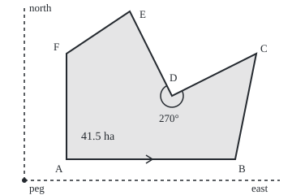

# Shoelace formula: area of any polygon from its corners, with a sign that says which way round

[Syllabus](../../../SYLLABUS.md) → [Geometry and trig](../README.md) → [Points, Convexity and Fractals](../README.md#s07) → Shoelace formula

---

## General Overview

A surveyor walks a field's boundary and records six corner posts, A to F, as grid positions from a survey peg: hundreds of metres east, then north. A (2, 1), B (10, 1), C (11, 6), D (7, 4), E (5, 8), F (2, 6). One grid square, 100 m by 100 m, is one hectare.

At D the fence bends into the field: a **reflex corner**, with an inside angle over 180 degrees; here 270, as fences DC and DE meet at a right angle. There is no width times height to multiply.

The shoelace formula needs only the list. For each fence it makes one cross-multiplication of neighbouring posts, adds the six results and halves: 41.5 hectares. The written layout criss-crosses two columns like laces, hence the name.

The sum carries a sign. Walked A to F, anticlockwise, it is +41.5; walked backwards, −41.5. On three posts alone, the sign says whether the walk turns left or right. At D it turns right, which is how a program finds the reflex corner.

**Half the sum of the cross products of consecutive corners is the polygon's area, plus for an anticlockwise walk and minus for a clockwise one; on three points, the same sign tells a left turn from a right turn.**

**What kind of fact this is:** a theorem, proved on this card in Why it works; the turn test is a method built on it.

### The picture: the survey polygon, to scale

<p align="center"></p>

Drawn to scale, 100 m = 26 units, north up: peg (30, 222), A (82, 196), B (290, 196), C (316, 66), D (212, 118), E (160, 14), F (82, 66). The arrow on AB shows the anticlockwise walk; the arc marks D's reflex angle, 270 degrees.

---

## The formula

Notation first, in words. Corners are numbered 1 to $n$ in walking order; corner $i$ sits at $(x_i, y_i)$, east then north. The corner after the last is the first again, so the fence F to A counts. The capital sigma, Σ, means "add the bracket for every $i$ from 1 to $n$". A reminder from [Cross product](../05-Vectors%20in%20Space/01-cross-product-and-oriented-area.md): for two arrows in the plane, $u \times v$ is east of u times north of v, minus north of u times east of v. It is the signed area of the parallelogram they span, positive when v lies anticlockwise from u.

$$S = \frac{1}{2}\sum_{i=1}^{n}\left(x_i\,y_{i+1} - y_i\,x_{i+1}\right), \qquad x_{n+1} = x_1,\ \ y_{n+1} = y_1$$

**Read it aloud:** for each fence, this post's east times the next post's north, minus this post's north times the next post's east; add them all and halve.

Each bracket is $P_i \times P_{i+1}$, the cross product of two position arrows from the peg. The field's area is $\lvert S\rvert$, the size of $S$ without its sign. The turn test applies the same cross product to three points:

$$\mathrm{turn}(a, b, c) = (b_x - a_x)(c_y - a_y) - (b_y - a_y)(c_x - a_x)$$

**Read it aloud:** the arrow from a to b crossed with the arrow from a to c; positive means walking a, b, c turns left at b, negative right, zero a straight line.

| Symbol | Plain meaning | In our example | Push it up and the answer… |
| --- | --- | --- | --- |
| $n$ | number of corners | 6 | one more term |
| $i$ | a corner's place in the walk | 1 for A, 6 for F | — |
| $x_i$, $y_i$ | corner $i$'s east and north, in hundreds of metres | D is (7, 4) | a post moved outward grows the area |
| $P_i$ | corner $i$ as an arrow from the peg | D is (7, 4) | — |
| $u \times v$ | cross product: signed parallelogram area | $P_1 \times P_2 = -8$ | flips sign when u and v swap |
| $S$ | signed area, hectares | +41.5 | reversing the walk gives −41.5 |
| $\lvert S\rvert$ | the area, sign dropped | 41.5 ha, 415,000 square metres | — |
| $a$, $b$, $c$ | three points for the turn test | C, D, E gives −20 | positive left, negative right |

### When it holds

- **Corners in walking order.** Swap B and C in the list and the fence crosses itself; the sum gives 12.5.
- **A simple boundary**, one loop that never crosses itself. A crossing splits the field into lobes, pieces walked in opposite directions, and they subtract.
- **Straight fences on a flat grid.** A creek needs more posts; latitude and longitude must first be projected to metres.
- **Equal units, north up.** Screen coordinates grow downward and flip every sign.
- **One loop.** A pond is a second loop walked the other way, so its area comes off.

---

## Why it works

### Step 0: sweep every fence from the peg

Each fence, with the peg, makes a triangle: plus when the fence runs anticlockwise as seen from the peg, minus when clockwise. Round the loop, ground outside is swept once each way and cancels; ground inside is swept once, net.

### Step 1: one fence gives one signed triangle

Fence AB is the arrow pair $P_1 = (2, 1)$ and $P_2 = (10, 1)$. Their cross product is 2 × 1 − 1 × 10 = −8, negative because B lies clockwise from A as seen from the peg. The triangle peg-A-B is half that parallelogram. Every bracket in the formula is twice one such signed triangle.

### Step 2: a triangle's area from its three fences

A triangle a, b, c, anywhere relative to the peg, has signed area half its turn test. The cross product multiplies out like ordinary brackets, flips sign when its arrows swap, and is 0 for an arrow with itself. Multiplying out:

$$\mathrm{turn}(a, b, c) = a \times b + b \times c + c \times a$$

That is the shoelace sum for three corners, so the formula holds for every triangle, wherever the peg sits.

<details>
<summary>The algebra behind this</summary>

$(b - a) \times (c - a) = b \times c - b \times a - a \times c + a \times a$. The last term is 0, and swapping arrows flips sign, so $-b \times a = a \times b$ and $-a \times c = c \times a$.

</details>

### Step 3: cut the field into triangles; inside cuts cancel

A diagonal is a segment joining two corners. Diagonals from D to F, A and B cut the field into triangles DEF, DFA, DAB, DBC, of 8.0, 12.5, 12.0 and 9.0 hectares: total 41.5. Write each as its three-fence sum from Step 2, all walked anticlockwise. Diagonal DF appears as $D \times F$ in one triangle and $F \times D$ in the next, and they cancel; so does every inside diagonal. Only the six outer fences survive, in walking order: the shoelace sum.

This rests on one fact: every simple polygon splits into triangles by inside diagonals. With a reflex corner, some diagonals leave the field, so it needs proof.

<details>
<summary>Detailed proof: every simple polygon splits into triangles</summary>

Induction on the number of corners. A triangle is one already. With four or more, take the lowest corner v (leftmost if tied). Everything lies on or above it, so its inside angle is under 180 degrees. Call its neighbours u and w.

If segment uw stays inside, it is a diagonal. Otherwise some corner lies in triangle uvw; take the one farthest from line uw, z. A fence crossing segment vz would need an end in the triangle still farther from uw than z, so none does, and vz is a diagonal.

Either diagonal cuts the polygon into two simple polygons with fewer corners, which split by induction. O'Rourke's first chapter gives this argument; Meisters proved every such polygon has an "ear", a corner whose neighbours a diagonal joins.

</details>

### Step 4: direction, turns, and the peg

Walk backwards and each $P_i \times P_{i+1}$ becomes $P_{i+1} \times P_i$: same size, opposite sign. So −41.5.

An anticlockwise walk keeps the inside on its left. Ordinary corners turn left; a reflex corner turns right. The turn tests at A to F are 40, 40, 18, −20, 16, 15: one right turn, at D. The −20 is twice triangle CDE, the notch at D; filling it adds 10 hectares.

The peg's place changes the terms, not the total. With the peg on A the terms are 0, 40, 2, 26, 15, 0, still 83. Shifting every corner by one arrow adds that arrow crossed with each fence arrow; the fence arrows of a closed loop add to zero, so the extras do too.

Slice a curved boundary ever finer and the same boundary sum becomes [Green's theorem](../../06-Calculus%20and%20analysis/09-Vector%20Calculus/06-greens-theorem.md); this card is its straight-edged case.

---

## Worked numbers, by hand

| Step | Arithmetic | Value |
| --- | --- | --- |
| fence AB | 2 × 1 − 1 × 10 = 2 − 10 | −8 |
| fence BC | 10 × 6 − 1 × 11 = 60 − 11 | 49 |
| fence CD | 11 × 4 − 6 × 7 = 44 − 42 | 2 |
| fence DE | 7 × 8 − 4 × 5 = 56 − 20 | 36 |
| fence EF | 5 × 6 − 8 × 2 = 30 − 16 | 14 |
| fence FA, the closing one | 2 × 1 − 6 × 2 = 2 − 12 | −10 |
| add the six | −8 + 49 + 2 + 36 + 14 − 10 | 83 |
| halve | 83 ÷ 2 | **41.5 ha** |
| in square metres | 41.5 × 10,000 | 415,000 |
| turn at D | (7 − 11)(8 − 6) − (4 − 6)(5 − 11) = −8 − 12 | −20, a right turn |

The field holds 41.5 hectares, and D is its one corner where the fence bends inward.

### What breaks if you drop a piece

| Mistake | Comes out at | What went wrong |
| --- | --- | --- |
| Closing fence FA left out | 46.5 ha | Open loop: outside ground stops cancelling |
| No halving | 83 ha | Parallelograms counted, not triangles |
| Each term made positive | 59.5 ha | Cancelling destroyed |
| B and C swapped | 12.5 ha | Fence crosses itself; lobes covering 29.64 ha subtract |

---

## Code, from first principles, and it actually runs

Nothing is imported. Road one is the shoelace sum. Road two forms no cross product: it cuts the field into 9000 upright strips, finds where each strip's middle line meets the fences, and adds width times inside height. Four asserts: the roads agree; walking backwards flips the sign and moving the peg changes nothing; D is the only right turn; the notch the strips measure is half the turn test at D.

### Python

```python
# Shoelace formula: the check behind the card. Standard library only.
# The survey polygon, corners A to F in hundreds of metres from a survey peg,
# so one grid square is one hectare. Road one is the shoelace sum of cross
# products. Road two slices the field into thin upright strips and adds their
# heights; it never forms a cross product.
POLY = [(2, 1), (10, 1), (11, 6), (7, 4), (5, 8), (2, 6)]      # A B C D E F
NAMES = "ABCDEF"

def cross(p, q): return p[0] * q[1] - p[1] * q[0]
def terms(P): return [cross(P[i], P[(i + 1) % len(P)]) for i in range(len(P))]
def shoelace(P): return sum(terms(P)) / 2
def turn(a, b, c): return cross((b[0] - a[0], b[1] - a[1]), (c[0] - a[0], c[1] - a[1]))

def slices(P, n=9000):             # road two: n strips across x = 2..11
    lo, hi = min(p[0] for p in P), max(p[0] for p in P)
    w, total = (hi - lo) / n, 0.0
    for k in range(n):
        x = lo + (k + 0.5) * w     # the strip's middle line
        ys = []
        for i in range(len(P)):
            (x1, y1), (x2, y2) = P[i], P[(i + 1) % len(P)]
            if (x1 <= x < x2) or (x2 <= x < x1):
                ys.append(y1 + (y2 - y1) * (x - x1) / (x2 - x1))
        ys.sort()                  # boundary crossings, bottom to top
        total += w * sum(ys[j + 1] - ys[j] for j in range(0, len(ys), 2))
    return total

t = terms(POLY)
area, strip = shoelace(POLY), slices(POLY)
back = shoelace(POLY[::-1])
turns = [turn(POLY[i - 1], POLY[i], POLY[(i + 1) % 6]) for i in range(6)]
no_d = POLY[:3] + POLY[4:]                             # cut the notch off at D
notch = slices(no_d) - strip
moved = [(x - 2, y - 1) for x, y in POLY]              # peg moved onto corner A
swapped = [POLY[i] for i in (0, 2, 1, 3, 4, 5)]        # B and C copied in the wrong order
print("corners:", ", ".join(f"{n} ({x}, {y})" for n, (x, y) in zip(NAMES, POLY)))
print("edge products:", ", ".join(f"{p[0] * q[1]} - {p[1] * q[0]}" for p, q in zip(POLY, POLY[1:] + POLY[:1])))
print("figure, 1 unit = 26 svg units: peg (30, 222),", ", ".join(f"{n} ({30 + 26 * x}, {222 - 26 * y})" for n, (x, y) in zip(NAMES, POLY)))
print("edge terms AB BC CD DE EF FA:", ", ".join(str(v) for v in t), "; sum", sum(t))
print(f"road one, shoelace: {area:.1f} ha = {area * 10000:,.0f} m^2")
print(f"road two, 9000 upright strips: {strip:.6f} ha")
print(f"walked backwards, A F E D C B: {back:.1f} ha")
print("turn test at A B C D E F:", ", ".join(str(v) for v in turns))
fan = [turn(POLY[3], POLY[k], POLY[(k + 1) % 6]) / 2 for k in (4, 5, 0, 1)]   # D with EF, FA, AB, BC
print("fan from D, triangles DEF DFA DAB DBC:", ", ".join(f"{v:.1f}" for v in fan), "ha")
print(f"cut the notch at D, by strips: {notch:.6f} ha more; half of -(turn at D): {-turns[3] / 2:.1f}")
print(f"peg moved onto A: terms {', '.join(str(v) for v in terms(moved))}; area {shoelace(moved):.1f} ha")
print(f"what breaks: closing edge FA left out: {sum(t[:-1]) / 2:.1f} ha")
print(f"what breaks: no halving: {sum(t):.1f}")
print(f"what breaks: each term made positive: {sum(abs(v) for v in t) / 2:.1f} ha")
print(f"what breaks: B and C swapped: shoelace {shoelace(swapped):.1f} ha, ground covered {slices(swapped):.2f} ha")
assert abs(area - strip) < 1e-6                        # two roads, one area
assert back == -area and shoelace(moved) == area       # direction flips the sign; the peg does not matter
assert [v < 0 for v in turns] == [False, False, False, True, False, False]
assert abs(notch - (-turns[3] / 2)) < 1e-6             # the right turn's triangle is the notch
```

**Ran 2026-09-24 on macOS, Python 3.14.6, standard library only. All checks passed. Output, pasted from the run:**

```
corners: A (2, 1), B (10, 1), C (11, 6), D (7, 4), E (5, 8), F (2, 6)
edge products: 2 - 10, 60 - 11, 44 - 42, 56 - 20, 30 - 16, 2 - 12
figure, 1 unit = 26 svg units: peg (30, 222), A (82, 196), B (290, 196), C (316, 66), D (212, 118), E (160, 14), F (82, 66)
edge terms AB BC CD DE EF FA: -8, 49, 2, 36, 14, -10 ; sum 83
road one, shoelace: 41.5 ha = 415,000 m^2
road two, 9000 upright strips: 41.500000 ha
walked backwards, A F E D C B: -41.5 ha
turn test at A B C D E F: 40, 40, 18, -20, 16, 15
fan from D, triangles DEF DFA DAB DBC: 8.0, 12.5, 12.0, 9.0 ha
cut the notch at D, by strips: 10.000000 ha more; half of -(turn at D): 10.0
peg moved onto A: terms 0, 40, 2, 26, 15, 0; area 41.5 ha
what breaks: closing edge FA left out: 46.5 ha
what breaks: no halving: 83.0
what breaks: each term made positive: 59.5 ha
what breaks: B and C swapped: shoelace 12.5 ha, ground covered 29.64 ha
```

### Rust

```rust
// Shoelace formula: the check behind the card. std only.
// The survey polygon, corners A to F in hundreds of metres from a survey peg,
// so one grid square is one hectare. Road one is the shoelace sum of cross
// products. Road two slices the field into thin upright strips and adds their
// heights; it never forms a cross product.
type P = (i64, i64);
const POLY: [P; 6] = [(2, 1), (10, 1), (11, 6), (7, 4), (5, 8), (2, 6)]; // A B C D E F

fn cross(p: P, q: P) -> i64 { p.0 * q.1 - p.1 * q.0 }
fn terms(p: &[P]) -> Vec<i64> { (0..p.len()).map(|i| cross(p[i], p[(i + 1) % p.len()])).collect() }
fn shoelace(p: &[P]) -> f64 { terms(p).iter().sum::<i64>() as f64 / 2.0 }
fn turn(a: P, b: P, c: P) -> i64 { cross((b.0 - a.0, b.1 - a.1), (c.0 - a.0, c.1 - a.1)) }

fn slices(p: &[P], n: usize) -> f64 { // road two: n strips across x = 2..11
    let lo = p.iter().map(|q| q.0).min().unwrap() as f64;
    let hi = p.iter().map(|q| q.0).max().unwrap() as f64;
    let (w, mut total) = ((hi - lo) / n as f64, 0.0);
    for k in 0..n {
        let x = lo + (k as f64 + 0.5) * w; // the strip's middle line
        let mut ys: Vec<f64> = Vec::new();
        for i in 0..p.len() {
            let ((x1, y1), (x2, y2)) = (p[i], p[(i + 1) % p.len()]);
            let (x1, y1, x2, y2) = (x1 as f64, y1 as f64, x2 as f64, y2 as f64);
            if (x1 <= x && x < x2) || (x2 <= x && x < x1) {
                ys.push(y1 + (y2 - y1) * (x - x1) / (x2 - x1));
            }
        }
        ys.sort_by(|a, b| a.partial_cmp(b).unwrap()); // boundary crossings, bottom to top
        total += w * (0..ys.len()).step_by(2).map(|j| ys[j + 1] - ys[j]).sum::<f64>();
    }
    total
}

fn join(v: &[i64]) -> String { v.iter().map(|x| x.to_string()).collect::<Vec<_>>().join(", ") }

fn main() {
    let names = ["A", "B", "C", "D", "E", "F"];
    let t = terms(&POLY);
    let (area, strip) = (shoelace(&POLY), slices(&POLY, 9000));
    let rev: Vec<P> = POLY.iter().rev().copied().collect();
    let back = shoelace(&rev);
    let turns: Vec<i64> = (0..6).map(|i| turn(POLY[(i + 5) % 6], POLY[i], POLY[(i + 1) % 6])).collect();
    let no_d: Vec<P> = vec![POLY[0], POLY[1], POLY[2], POLY[4], POLY[5]]; // cut the notch off at D
    let notch = slices(&no_d, 9000) - strip;
    let moved: Vec<P> = POLY.iter().map(|&(x, y)| (x - 2, y - 1)).collect(); // peg moved onto corner A
    let swapped: Vec<P> = [0, 2, 1, 3, 4, 5].iter().map(|&i| POLY[i]).collect(); // B and C copied in the wrong order
    let fig: Vec<String> = (0..6).map(|i| format!("{} ({}, {})", names[i], 30 + 26 * POLY[i].0, 222 - 26 * POLY[i].1)).collect();
    let cs: Vec<String> = (0..6).map(|i| format!("{} ({}, {})", names[i], POLY[i].0, POLY[i].1)).collect();
    println!("corners: {}", cs.join(", "));
    let pr: Vec<String> = (0..6).map(|i| { let (p, q) = (POLY[i], POLY[(i + 1) % 6]); format!("{} - {}", p.0 * q.1, p.1 * q.0) }).collect();
    println!("edge products: {}", pr.join(", "));
    println!("figure, 1 unit = 26 svg units: peg (30, 222), {}", fig.join(", "));
    let sum: i64 = t.iter().sum();
    println!("edge terms AB BC CD DE EF FA: {} ; sum {}", join(&t), sum);
    let m2 = (area * 10000.0) as i64;
    println!("road one, shoelace: {:.1} ha = {},{:03} m^2", area, m2 / 1000, m2 % 1000);
    println!("road two, 9000 upright strips: {:.6} ha", strip);
    println!("walked backwards, A F E D C B: {:.1} ha", back);
    println!("turn test at A B C D E F: {}", join(&turns));
    let fan: Vec<String> = [4, 5, 0, 1].iter().map(|&k| format!("{:.1}", turn(POLY[3], POLY[k], POLY[(k + 1) % 6]) as f64 / 2.0)).collect(); // D with EF, FA, AB, BC
    println!("fan from D, triangles DEF DFA DAB DBC: {} ha", fan.join(", "));
    println!("cut the notch at D, by strips: {:.6} ha more; half of -(turn at D): {:.1}", notch, -turns[3] as f64 / 2.0);
    println!("peg moved onto A: terms {}; area {:.1} ha", join(&terms(&moved)), shoelace(&moved));
    println!("what breaks: closing edge FA left out: {:.1} ha", t[..5].iter().sum::<i64>() as f64 / 2.0);
    println!("what breaks: no halving: {:.1}", sum as f64);
    println!("what breaks: each term made positive: {:.1} ha", t.iter().map(|v| v.abs()).sum::<i64>() as f64 / 2.0);
    println!("what breaks: B and C swapped: shoelace {:.1} ha, ground covered {:.2} ha", shoelace(&swapped), slices(&swapped, 9000));
    assert!((area - strip).abs() < 1e-6); // two roads, one area
    assert!(back == -area && shoelace(&moved) == area); // direction flips the sign; the peg does not matter
    assert!(turns.iter().map(|&v| v < 0).collect::<Vec<_>>() == vec![false, false, false, true, false, false]);
    assert!((notch - (-turns[3] as f64 / 2.0)).abs() < 1e-6); // the right turn's triangle is the notch
}
```

**Ran 2026-09-24 on macOS, rustc 1.98.1, no crates. All checks passed. Output, pasted from the run:**

```
corners: A (2, 1), B (10, 1), C (11, 6), D (7, 4), E (5, 8), F (2, 6)
edge products: 2 - 10, 60 - 11, 44 - 42, 56 - 20, 30 - 16, 2 - 12
figure, 1 unit = 26 svg units: peg (30, 222), A (82, 196), B (290, 196), C (316, 66), D (212, 118), E (160, 14), F (82, 66)
edge terms AB BC CD DE EF FA: -8, 49, 2, 36, 14, -10 ; sum 83
road one, shoelace: 41.5 ha = 415,000 m^2
road two, 9000 upright strips: 41.500000 ha
walked backwards, A F E D C B: -41.5 ha
turn test at A B C D E F: 40, 40, 18, -20, 16, 15
fan from D, triangles DEF DFA DAB DBC: 8.0, 12.5, 12.0, 9.0 ha
cut the notch at D, by strips: 10.000000 ha more; half of -(turn at D): 10.0
peg moved onto A: terms 0, 40, 2, 26, 15, 0; area 41.5 ha
what breaks: closing edge FA left out: 46.5 ha
what breaks: no halving: 83.0
what breaks: each term made positive: 59.5 ha
what breaks: B and C swapped: shoelace 12.5 ha, ground covered 29.64 ha
```

The two outputs are identical line for line.

> [!TIP]
> **Try changing**
> - **Reverse POLY.** Guess first: which assert fails? The first: the shoelace gives −41.5, the strips still 41.5.
> - **Swap B and C in POLY.** Guess first. The first fails: shoelace 12.5, strips 29.64.
> - **Set the strip count to 9.** Guess first. Still exact, since strip edges land on the corners' east positions; at 7 the first assert fails.
> - **Add 100 to every coordinate.** Guess first. The terms grow; the area stays 41.5.

---

## The usual mistake

> [!warning]
> **Treating the six points as the field.** The formula measures a walk, not a set of posts. Swap B and C and the same posts make a fence that crosses itself, and the sum reads 12.5. Check the list goes round the boundary in order.
>
> - **Screen coordinates.** The second number grows downward, so an anticlockwise-looking shape comes out negative.

---

## Where you meet it in real life

- **Land survey.** Parcel areas come from the coordinates of corner marks: the surveyor's area formula, older than computers.
- **Mapping data.** The GeoJSON standard, RFC 7946, wants outer rings anticlockwise and holes clockwise; software checks this sum's sign.
- **Computer graphics.** A triangle whose screen corners wind the wrong way faces away and is skipped (back-face culling): the turn test, millions of times a frame.

> **Say it back**
> Each fence, seen from a peg, makes a triangle whose signed area is half a cross product. Round the loop, outside ground cancels and inside ground remains. The field's six terms add to 83: 41.5 hectares. Walked backwards the answer is negative. On three posts the same sign tells left from right, and the one right turn is at D, the reflex corner.

---

## What this builds on

- [Cross product](../05-Vectors%20in%20Space/01-cross-product-and-oriented-area.md): the cross product as the signed area of a parallelogram, the brick every term is made of.

## Where this goes next

- [Convex sets](02-convex-sets-and-convex-hulls.md): the turn test picks out the outer boundary of a scattered set of points.
- [Inside or outside](03-point-in-polygon-and-segment-tests.md): turn signs decide whether two fences cross and whether a point is inside.
- [Fractals](05-self-similarity-and-fractal-dimension.md): polygons whose area settles while their perimeter grows without end.
- [Green's theorem](../../06-Calculus%20and%20analysis/09-Vector%20Calculus/06-greens-theorem.md): the boundary sum for curved boundaries.

---

## Sources

Verified 2026-09-24: every link below opens a page naming the cited work.

- Braden, Bart. "The Surveyor's Area Formula." *The College Mathematics Journal* 17(4), 1986. [Publisher page](https://doi.org/10.1080/07468342.1986.11972974). Surveying use, with proofs.
- Meisters, G. H. "Polygons Have Ears." *The American Mathematical Monthly* 82(6), 1975. [Publisher page](https://doi.org/10.1080/00029890.1975.11993898). The triangle-splitting fact behind Step 3.
- O'Rourke, Joseph. *Computational Geometry in C*, 2nd ed. Cambridge University Press, 1998. [Publisher page](https://doi.org/10.1017/CBO9780511804120). Chapter 1: triangulation, signed area, the left-turn test.
- Kritchevsky, Alex. "Oriented Areas and the Shoelace Formula," 2018. [Article](https://alexkritchevsky.com/2018/08/06/oriented-area.html). Signed areas and cancelling lobes, illustrated.
