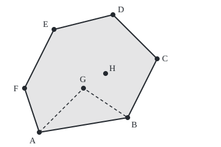

# Convex sets: no dents, and the rubber band that finds the hull

[Syllabus](../../../SYLLABUS.md) → [Geometry and trig](../../../SYLLABUS.md#w05) → [Points, Convexity and Fractals](../../../SYLLABUS.md#w05-s07) → Convex sets

---

## General Overview

Eight trees stand in a field, measured in metres from a corner post: A at (2, 0), B at (14, 2), C at (18, 10), D at (12, 16), E at (4, 14), F at (0, 6), G at (8, 6) and H at (11, 8). A farmer wants one paddock round all of them with as little fence as possible.

Drop a giant rubber band over the trunks and let it snap tight. It touches six trees, F, A, B, C, D and E, running straight between them; G and H end up inside. That band is the shortest fence round every tree: 53.110 m of wire round 196 square metres.

The band's shape has no dents: the straight path between any two spots inside it stays inside. Such a shape is **convex**; this one is the **convex hull** of the trees.

**A region is convex when the straight segment between any two of its points stays inside it; the convex hull of some points is the smallest convex region holding them all, and a sweep that keeps only left turns finds its corners.**

**What kind of fact this is:** a method, resting on two definitions (convex set, convex hull); its correctness and the shortest-fence claim are proved on this card in Why it works.

### The picture: eight trees and the tight fence

<p align="center"></p>

Scale 1 m = 12 units, corner post at (40, 216). Dashed: a fence dented in to G.

---

## The formula

Points scale and add coordinate by coordinate, as vectors do; ∈ reads "is in"; turn is twice a triangle's signed area, from [Shoelace formula](01-polygon-area-and-orientation.md).

A region $S$ is convex when

$$(1 - t)\,u + t\,v \in S \quad\text{for every two points } u, v \in S \text{ and every } t \text{ from 0 to 1}.$$

**Read it aloud:** every step of a straight walk between two points of the region stays in the region.

For a set $P$ of $n$ trees, each written $p_i$, the hull is

$$\mathrm{hull}(P) = \{\, w_1 p_1 + w_2 p_2 + \dots + w_n p_n \;:\; \text{every } w_i \ge 0,\ \ w_1 + w_2 + \dots + w_n = 1 \,\}.$$

**Read it aloud:** the hull is every weighted average of the trees, with weights never negative and adding to one.

Every algorithm here runs on one test:

$$\mathrm{turn}(a, b, c) = (b_x - a_x)(c_y - a_y) - (b_y - a_y)(c_x - a_x).$$

**Read it aloud:** walking a to b to c, positive means a left bend, negative a right bend, zero straight on.

| Symbol | Plain meaning | In our example | Push it up and the answer… |
| --- | --- | --- | --- |
| $S$ | a region of the plane | the paddock | — |
| $u$, $v$ | two points of the region | trees A and H | — |
| $t$ | fraction of the way from $u$ to $v$ | 1/2: midpoint (6.5, 4.0) | slides towards $v$ |
| $P$, $n$ | the trees; how many | A to H; 8 | a new tree grows the hull or leaves it alone |
| $p_i$, $w_i$ | the i-th tree; its weight | G = 0.4043 F + 0.4255 B + 0.1702 D | pulls the average to that tree |
| $\mathrm{hull}(P)$ | the convex hull | polygon F A B C D E, 196 square metres | — |
| $\mathrm{turn}(a, b, c)$ | twice the signed area of triangle a, b, c | turn(F, A, B) = 76 | sharper left bend |
| $a_x$, $a_y$ | across and up coordinates of a | F: 0 and 6 | — |

### When it holds

- **Exact coordinates.** Everything hangs on the sign of turn; three nearly lined-up trees measured in decimals can get the wrong sign, and the sweep drops the wrong tree.
- **At least three trees, not all in one line.** Otherwise the hull is a point or a segment: no paddock.
- **Flat, open ground.** The shortest fence assumes straight lines may run anywhere; a pond or a hillside changes it.

---

## Why it works

### Step 0: a tight band bends only one way

A tight band runs straight between the trees it touches. Going round anticlockwise it bends left at each; a right bend would be a hook that, let go, pulls straight and shorter.

### Step 1: all bends one way means no dents

Round the hull anticlockwise the corner turns are 40, 76, 88, 72, 60 and 56: all left. A fence dipping in to G turns −60 there, a right bend; in to H, −48.

A right bend makes a notch. The fence through all eight has posts A and H, yet their midpoint, (6.5, 4.0), lies in the triangle A, B, G cut away. Not convex.

With all left bends, the paddock lies left of every fence line. The ground on one side of a line, a **half-plane**, is convex: along a segment, turn averages its values at the ends. An overlap of convex regions is convex, since a segment inside each is inside all.

<details>
<summary>Detailed proof: turn averages along a segment</summary>

Fix a and b and let q = (1 − t)u + tv. Each product in turn(a, b, q) holds one coordinate of q, so turn(a, b, q) = (1 − t) turn(a, b, u) + t turn(a, b, v), at least 0 when both ends are. A fence winding once anticlockwise with only left bends encloses the overlap of the half-planes left of its edges.

</details>

### Step 2: the hull is the weighted averages

The weights 0.4043, 0.4255 and 0.1702 on F, B and D add to 1.0000 and rebuild G at (8.0, 6.0); each is a ratio of two turns.

Blending two weighted averages blends their weights, still non-negative and adding to one: the averages form a convex set. Any convex region holding the trees holds every average: fold all but the last tree into one average, blend with the last, and the segment rule does the rest. So the averages are the smallest such region.

### Step 3: the sweep keeps only true corners

Sort the trees left to right and walk along them, keeping a chain. When a tree arrives, check the last two kept. A right bend or straight on into the newcomer puts the middle tree on or above the shortcut, off the hull's bottom edge: drop it and check again.

That builds the **lower chain**; right to left builds the **upper chain**; joined, they are the hull: **Andrew's monotone chain** (1979). Both chains bend only left, so the loop is convex by Step 1, and every dropped tree ends inside it. Sorting is the slow part, about $n \log_2 n$ comparisons; each tree then joins and leaves a chain at most once.

<details>
<summary>Detailed proof: a dropped tree is never a lower corner</summary>

Sorted by x, kept tree a is at or left of m, newcomer p at or right. If turn(a, m, p) ≤ 0, m lies on or above segment a to p. The hull holds that segment, so its lower boundary is on or below it, and m can touch that boundary only mid-way along a straight run: not a corner. The final chain bends left from leftmost to rightmost with every tree on or above it: the lower boundary.

</details>

### Step 4: gift wrapping, a second road

Stretch a string from the leftmost tree, F, to any other. Whenever a tree lies to its right, swing the string to it. When none does, every tree is in the convex half-plane on the string's left, so the whole hull is: the string lies along a hull edge. Walk to its far end and repeat until back at F. This is **gift wrapping** (Jarvis, 1973). Each hull edge costs one pass over all $n$ trees.

A brute force agrees: of 56 ordered pairs, only AB, BC, CD, DE, EF and FA have every tree on the left.

### Step 5: the tight fence is the shortest

Any fence round the trees cuts down to the hull without lengthening, so none is shorter than 53.110 m.

<details>
<summary>Detailed proof: no fence round the trees is shorter</summary>

Take a fence of straight pieces round every tree. Replace each inward dent by the segment across it: never longer, trees still inside. Once every bend is left, the fence is convex. Cut along each hull edge's line, keeping the trees' side: the path cut away is replaced by a segment between the same two points, never longer. After six cuts the fence is the hull's boundary.

</details>

---

## Worked numbers, by hand

| Step | Arithmetic | Value |
| --- | --- | --- |
| Sort by x | — | F A E G H D B C |
| G arrives | turn(A, E, G) = 2 × 6 − 14 × 6 | −72: drop E |
| H arrives | turn(A, G, H) = 6 × 8 − 6 × 9 | −6: drop G |
| D arrives | turn(A, H, D) = 9 × 16 − 8 × 10 | 64: keep |
| B arrives | turn(H, D, B) = 1 × (−6) − 8 × 3, then turn(A, H, B) = 9 × 2 − 8 × 12 | −30: drop D; −78: drop H |
| C arrives | turn(A, B, C) = 12 × 10 − 2 × 16 | 88: keep; lower chain F A B C |
| Upper chain, right to left | drops B (−72), H (−22), G (−72), A (−40) | upper chain C D E F; hull F A B C D E |
| Shoelace | −12 + 4 + 104 + 168 + 104 + 24 = 392, halved | **196 square metres** |
| Fence | 6.325 + 12.166 + 8.944 + 8.485 + 8.246 + 8.944 | **53.110 m** |

### What breaks if you drop a piece

| Mistake | Comes out at | What went wrong |
| --- | --- | --- |
| Fence through all eight, F A G B H C D E | 142.0 square metres, 61.685 m of fence | Right bends at G (−60) and H (−48): more fence, less ground |
| Trees fenced left to right, F A E G H D B C | 9.0 square metres, 82.604 m of fence | The fence crosses itself; shoelace terms cancel |

---

## Code, from first principles, and it actually runs

Nothing is imported; the square root is Newton's rule. Road one is the monotone chain, road two gift wrapping, which never sorts. A brute force tries all 56 pairs as edges, 5 cm grid cells count the area, and G is rebuilt from its weights. A second case adds a ninth tree.

### Python

```python
# Eight trees, one fence: monotone chain against gift wrapping.  Nothing imported.
T = {"A": (2, 0), "B": (14, 2), "C": (18, 10), "D": (12, 16),
     "E": (4, 14), "F": (0, 6), "G": (8, 6), "H": (11, 8), "I": (20, 4)}
P, name = sorted(v for k, v in T.items() if k != "I"), {v: k for k, v in T.items()}
def turn(a, b, c):                       # > 0: a -> b -> c bends left
    return (b[0] - a[0]) * (c[1] - a[1]) - (b[1] - a[1]) * (c[0] - a[0])
def root(v):                             # square root by Newton's rule
    r = max(v, 1.0)
    for _ in range(60): r = (r + v / r) / 2
    return r
def chain(pts, log):                     # one half of the monotone chain
    h = []
    for p in pts:
        while len(h) >= 2 and turn(h[-2], h[-1], p) <= 0:  # a right turn or straight: drop
            log.append(f"{name[h[-1]]} {turn(h[-2], h[-1], p)}"); h.pop()
        h.append(p)
    return h[:-1]
def wrap(pts):                           # gift wrapping from the lowest leftmost tree
    hull = [min(pts)]
    while True:
        q = next(p for p in pts if p != hull[-1])
        for r in pts:
            if turn(hull[-1], q, r) < 0:
                q = r                    # r lies right of the string: swing to it
        if q == hull[0]: return hull
        hull.append(q)
area = lambda h: sum(turn((0, 0), h[i - 1], h[i]) for i in range(len(h))) / 2
fence = lambda h: sum(root((h[i][0] - h[i - 1][0]) ** 2 + (h[i][1] - h[i - 1][1]) ** 2) for i in range(len(h)))
inside = lambda h, p: all(turn(h[i - 1], h[i], p) >= -1e-9 for i in range(len(h)))
names = lambda h: " ".join(name[p] for p in h)
mono, gift = chain(P, low := []) + chain(P[::-1], up := []), wrap(P)
brute = sorted(name[a] + name[b] for a in P for b in P if a != b and all(turn(a, b, r) >= 0 for r in P))
edges = sorted(name[mono[i - 1]] + name[mono[i]] for i in range(len(mono)))
cells = sum(inside(mono, ((i + 0.5) / 20, (j + 0.5) / 20)) for i in range(360) for j in range(320))
seg = [((10 - t) * a[0] / 10 + t * b[0] / 10, (10 - t) * a[1] / 10 + t * b[1] / 10) for a in P for b in P if a < b for t in range(1, 10)]
A, B, C, D, F, G, H = (T[k] for k in "ABCDFGH")
w = [turn(G, B, D) / turn(F, B, D), turn(F, G, D) / turn(F, B, D), turn(F, B, G) / turn(F, B, D)]
mix = [w[0] * F[k] + w[1] * B[k] + w[2] * D[k] for k in (0, 1)]
dent, nine = [T[k] for k in "FAGBHCDE"], wrap(P + [T["I"]])
print(f"road one, monotone chain: {names(mono)}\nroad two, gift wrapping: {names(gift)}")
print(f"brute force, of {len(P) * (len(P) - 1)} ordered pairs, edges with every tree on the left: {' '.join(brute)}")
print("turns at the corners: " + ", ".join(f"{name[mono[i]]} {turn(mono[i - 1], mono[i], mono[(i + 1) % 6])}" for i in range(6))
      + f"; dented fence at G {turn(A, G, B)}, at H {turn(B, H, C)}")
print(f"lower sweep drops: {', '.join(low)}; upper sweep drops: {', '.join(up)}")
print("shoelace terms: " + ", ".join(f"{turn((0, 0), mono[i - 1], mono[i % 6]):.0f}" for i in range(1, 7)) + f"; sum {2 * area(mono):.0f}")
print("edges: " + ", ".join(f"{name[mono[i - 1]]}{name[mono[i % 6]]} {fence([mono[i - 1], mono[i % 6]]) / 2:.3f}" for i in range(1, 7)))
print(f"hull: {len(mono)} corners, area {area(mono):.1f} m^2, fence {fence(mono):.3f} m")
print(f"fine grid, 0.05 m cells inside: {cells} = {cells / 400:.2f} m^2")
print(f"segment rule: {len(seg)} points on the 28 tree-to-tree segments, inside the hull: {sum(inside(mono, p) for p in seg)}")
print(f"G as a mix of F, B, D: weights {w[0]:.4f}, {w[1]:.4f}, {w[2]:.4f}; sum {sum(w):.4f}; point ({mix[0]:.1f}, {mix[1]:.1f})")
print(f"midpoint of A and H (6.5, 4.0) in the notch A B G: {inside([A, B, G], (6.5, 4))}")
print(f"mistake, fence through all eight F A G B H C D E: area {area(dent):.1f} m^2, fence {fence(dent):.3f} m")
print(f"mistake, trees fenced left to right {names(P)}: area {area(P):.1f} m^2, fence {fence(P):.3f} m")
print(f"ninth tree I at (20, 4): hull {names(nine)}, area {area(nine):.1f} m^2, fence {fence(nine):.3f} m")
print("figure, 1 m = 12: " + " ".join(f"{k} ({40 + 12 * T[k][0]}, {216 - 12 * T[k][1]})" for k in "ABCDEFGH"))
assert mono == gift                                        # two sweeps, one fence
assert brute == edges                                      # every edge found by brute force
assert abs(cells / 400 - area(mono)) < 0.5                 # grid count against shoelace
assert min(w) > 0 and abs(mix[0] - G[0]) < 1e-9 and abs(mix[1] - G[1]) < 1e-9
print("ALL CHECKS PASS")
```

**Ran 2026-09-24 on macOS, Python 3.14.6, standard library only. All checks passed. Output, pasted from the run:**

```
road one, monotone chain: F A B C D E
road two, gift wrapping: F A B C D E
brute force, of 56 ordered pairs, edges with every tree on the left: AB BC CD DE EF FA
turns at the corners: F 40, A 76, B 88, C 72, D 60, E 56; dented fence at G -60, at H -48
lower sweep drops: E -72, G -6, D -30, H -78; upper sweep drops: B -72, H -22, G -72, A -40
shoelace terms: -12, 4, 104, 168, 104, 24; sum 392
edges: FA 6.325, AB 12.166, BC 8.944, CD 8.485, DE 8.246, EF 8.944
hull: 6 corners, area 196.0 m^2, fence 53.110 m
fine grid, 0.05 m cells inside: 78480 = 196.20 m^2
segment rule: 252 points on the 28 tree-to-tree segments, inside the hull: 252
G as a mix of F, B, D: weights 0.4043, 0.4255, 0.1702; sum 1.0000; point (8.0, 6.0)
midpoint of A and H (6.5, 4.0) in the notch A B G: True
mistake, fence through all eight F A G B H C D E: area 142.0 m^2, fence 61.685 m
mistake, trees fenced left to right F A E G H D B C: area 9.0 m^2, fence 82.604 m
ninth tree I at (20, 4): hull F A B I C D E, area 216.0 m^2, fence 56.815 m
figure, 1 m = 12: A (64, 216) B (208, 192) C (256, 96) D (184, 24) E (88, 48) F (40, 144) G (136, 144) H (172, 120)
ALL CHECKS PASS
```

The grid gives 196.20, not 196: cells centred exactly on a fence line count as inside.

### Rust

Same numbers, same labels, built with `rustc --edition 2021 -O`.

```rust
// Eight trees, one fence: monotone chain against gift wrapping.  No crates.
type Pt = (f64, f64);
const T: [(&str, Pt); 9] = [("A", (2.0, 0.0)), ("B", (14.0, 2.0)), ("C", (18.0, 10.0)), ("D", (12.0, 16.0)),
    ("E", (4.0, 14.0)), ("F", (0.0, 6.0)), ("G", (8.0, 6.0)), ("H", (11.0, 8.0)), ("I", (20.0, 4.0))];
fn tree(k: &str) -> Pt { T.iter().find(|t| t.0 == k).unwrap().1 }
fn name(p: Pt) -> &'static str { T.iter().find(|t| t.1 == p).unwrap().0 }
fn names(h: &[Pt]) -> String { h.iter().map(|&p| name(p)).collect::<Vec<_>>().join(" ") }
fn turn(a: Pt, b: Pt, c: Pt) -> f64 { (b.0 - a.0) * (c.1 - a.1) - (b.1 - a.1) * (c.0 - a.0) } // > 0: bends left
fn root(v: f64) -> f64 { (0..60).fold(v.max(1.0), |r, _| (r + v / r) / 2.0) } // square root by Newton's rule
fn chain(pts: &[Pt], log: &mut Vec<String>) -> Vec<Pt> { // one half of the monotone chain
    let mut h: Vec<Pt> = Vec::new();
    for &p in pts {
        while h.len() >= 2 && turn(h[h.len() - 2], h[h.len() - 1], p) <= 0.0 { // right turn or straight: drop
            log.push(format!("{} {}", name(h[h.len() - 1]), turn(h[h.len() - 2], h[h.len() - 1], p)));
            h.pop();
        }
        h.push(p);
    }
    h.pop();
    h
}
fn wrap(pts: &[Pt]) -> Vec<Pt> {                     // gift wrapping from the lowest leftmost tree
    let mut hull = vec![pts.iter().copied().fold(pts[0], |m, p| if p < m { p } else { m })];
    loop {
        let last = *hull.last().unwrap();
        let mut q = *pts.iter().find(|&&p| p != last).unwrap();
        for &r in pts { if turn(last, q, r) < 0.0 { q = r } } // r right of the string: swing to it
        if q == hull[0] { return hull }
        hull.push(q);
    }
}
fn area(h: &[Pt]) -> f64 { (0..h.len()).map(|i| turn((0.0, 0.0), h[(i + h.len() - 1) % h.len()], h[i])).sum::<f64>() / 2.0 }
fn fence(h: &[Pt]) -> f64 { (0..h.len()).map(|i| { let (a, b) = (h[(i + h.len() - 1) % h.len()], h[i]); root((b.0 - a.0).powi(2) + (b.1 - a.1).powi(2)) }).sum() }
fn inside(h: &[Pt], p: Pt) -> bool { (0..h.len()).all(|i| turn(h[(i + h.len() - 1) % h.len()], h[i], p) >= -1e-9) }
fn main() {
    let mut p: Vec<Pt> = T.iter().filter(|t| t.0 != "I").map(|t| t.1).collect();
    p.sort_by(|a, b| a.partial_cmp(b).unwrap());
    let rev: Vec<Pt> = p.iter().rev().copied().collect();
    let (mut low, mut up) = (Vec::new(), Vec::new());
    let (mono, gift) = ([chain(&p, &mut low), chain(&rev, &mut up)].concat(), wrap(&p));
    let mut brute: Vec<String> = Vec::new();
    for &a in &p { for &b in &p { if a != b && p.iter().all(|&r| turn(a, b, r) >= 0.0) { brute.push(format!("{}{}", name(a), name(b))) } } }
    brute.sort();
    let mut edges: Vec<String> = (0..mono.len()).map(|i| format!("{}{}", name(mono[(i + 5) % 6]), name(mono[i]))).collect();
    edges.sort();
    let cells = (0..360).flat_map(|i| (0..320).map(move |j| ((i as f64 + 0.5) / 20.0, (j as f64 + 0.5) / 20.0))).filter(|&q| inside(&mono, q)).count();
    let mut seg: Vec<Pt> = Vec::new();
    for &a in &p { for &b in &p { if a < b { for t in 1..10 { let t = t as f64;
        seg.push(((10.0 - t) * a.0 / 10.0 + t * b.0 / 10.0, (10.0 - t) * a.1 / 10.0 + t * b.1 / 10.0)) } } } }
    let [a, b, c, d, f, g, h] = ["A", "B", "C", "D", "F", "G", "H"].map(tree);
    let w = [turn(g, b, d) / turn(f, b, d), turn(f, g, d) / turn(f, b, d), turn(f, b, g) / turn(f, b, d)];
    let mix = (w[0] * f.0 + w[1] * b.0 + w[2] * d.0, w[0] * f.1 + w[1] * b.1 + w[2] * d.1);
    let dent: Vec<Pt> = "FAGBHCDE".chars().map(|k| tree(&k.to_string())).collect();
    let nine = wrap(&[p.clone(), vec![tree("I")]].concat());
    let tf = |x: bool| if x { "True" } else { "False" };
    println!("road one, monotone chain: {}\nroad two, gift wrapping: {}", names(&mono), names(&gift));
    println!("brute force, of {} ordered pairs, edges with every tree on the left: {}", p.len() * (p.len() - 1), brute.join(" "));
    println!("turns at the corners: {}", (0..6).map(|i| format!("{} {}", name(mono[i]), turn(mono[(i + 5) % 6], mono[i], mono[(i + 1) % 6]))).collect::<Vec<_>>().join(", ")
        + &format!("; dented fence at G {}, at H {}", turn(a, g, b), turn(b, h, c)));
    println!("lower sweep drops: {}; upper sweep drops: {}", low.join(", "), up.join(", "));
    println!("shoelace terms: {}; sum {:.0}", (1..7).map(|i| format!("{:.0}", turn((0.0, 0.0), mono[i - 1], mono[i % 6]))).collect::<Vec<_>>().join(", "), 2.0 * area(&mono));
    println!("edges: {}", (1..7).map(|i| format!("{}{} {:.3}", name(mono[i - 1]), name(mono[i % 6]), fence(&[mono[i - 1], mono[i % 6]]) / 2.0)).collect::<Vec<_>>().join(", "));
    println!("hull: {} corners, area {:.1} m^2, fence {:.3} m", mono.len(), area(&mono), fence(&mono));
    println!("fine grid, 0.05 m cells inside: {} = {:.2} m^2", cells, cells as f64 / 400.0);
    println!("segment rule: {} points on the 28 tree-to-tree segments, inside the hull: {}", seg.len(), seg.iter().filter(|&&q| inside(&mono, q)).count());
    println!("G as a mix of F, B, D: weights {:.4}, {:.4}, {:.4}; sum {:.4}; point ({:.1}, {:.1})", w[0], w[1], w[2], w.iter().sum::<f64>(), mix.0, mix.1);
    println!("midpoint of A and H (6.5, 4.0) in the notch A B G: {}", tf(inside(&[a, b, g], (6.5, 4.0))));
    println!("mistake, fence through all eight F A G B H C D E: area {:.1} m^2, fence {:.3} m", area(&dent), fence(&dent));
    println!("mistake, trees fenced left to right {}: area {:.1} m^2, fence {:.3} m", names(&p), area(&p), fence(&p));
    println!("ninth tree I at (20, 4): hull {}, area {:.1} m^2, fence {:.3} m", names(&nine), area(&nine), fence(&nine));
    println!("figure, 1 m = 12: {}", "ABCDEFGH".chars().map(|k| { let q = tree(&k.to_string()); format!("{} ({}, {})", k, 40.0 + 12.0 * q.0, 216.0 - 12.0 * q.1) }).collect::<Vec<_>>().join(" "));
    assert!(mono == gift);                                          // two sweeps, one fence
    assert!(brute == edges);                                        // every edge found by brute force
    assert!((cells as f64 / 400.0 - area(&mono)).abs() < 0.5);      // grid count against shoelace
    assert!(w.iter().all(|&x| x > 0.0) && (mix.0 - g.0).abs() < 1e-9 && (mix.1 - g.1).abs() < 1e-9);
    println!("ALL CHECKS PASS");
}
```

**Ran 2026-09-24 on macOS, rustc 1.98.1, no crates. All checks passed. Output, pasted from the run:**

```
road one, monotone chain: F A B C D E
road two, gift wrapping: F A B C D E
brute force, of 56 ordered pairs, edges with every tree on the left: AB BC CD DE EF FA
turns at the corners: F 40, A 76, B 88, C 72, D 60, E 56; dented fence at G -60, at H -48
lower sweep drops: E -72, G -6, D -30, H -78; upper sweep drops: B -72, H -22, G -72, A -40
shoelace terms: -12, 4, 104, 168, 104, 24; sum 392
edges: FA 6.325, AB 12.166, BC 8.944, CD 8.485, DE 8.246, EF 8.944
hull: 6 corners, area 196.0 m^2, fence 53.110 m
fine grid, 0.05 m cells inside: 78480 = 196.20 m^2
segment rule: 252 points on the 28 tree-to-tree segments, inside the hull: 252
G as a mix of F, B, D: weights 0.4043, 0.4255, 0.1702; sum 1.0000; point (8.0, 6.0)
midpoint of A and H (6.5, 4.0) in the notch A B G: True
mistake, fence through all eight F A G B H C D E: area 142.0 m^2, fence 61.685 m
mistake, trees fenced left to right F A E G H D B C: area 9.0 m^2, fence 82.604 m
ninth tree I at (20, 4): hull F A B I C D E, area 216.0 m^2, fence 56.815 m
figure, 1 m = 12: A (64, 216) B (208, 192) C (256, 96) D (184, 24) E (88, 48) F (40, 144) G (136, 144) H (172, 120)
ALL CHECKS PASS
```

The two outputs match line for line.

> [!TIP]
> **Try changing**
> - **A ninth tree.** Guess first: how many corners if tree I at (20, 4) joins? Seven, F A B I C D E: 216.0 square metres inside 56.815 m of fence.
> - **Flip the test.** Change the sweep's `<= 0` to `>= 0`. Guess first. The sweep walks the corners clockwise, F E D C B A, and the first assert stops the run.

---

## The usual mistake

> [!warning]
> **Thinking the fence must touch every tree.** Through all eight, it bends right at G and H and holds 142.0 square metres with 61.685 m of wire; the hull holds 196 with 53.110 m.
>
> - **Testing a few segments.** All 252 points tested on the 28 tree-to-tree segments lie in the hull: an illustration, not a proof. One failing segment does disprove convexity.
> - **A clockwise list.** It gives the shoelace total with a minus sign: same region, walked the other way.

---

## Where you meet it in real life

- **Wildlife surveys.** A home range is often first estimated as the hull of an animal's sightings.
- **Collision checks.** Games and robots test hulls first: if two do not overlap, nothing inside them touches.
- **Optimization.** A linear programme's allowed choices form a convex region; when a best choice exists, one sits at a corner (Convex sets).
- **Maps from points.** With no three trees in line, the trees whose nearest-tree patches run off without end are the hull's corners ([Nearest-neighbour maps](04-voronoi-and-delaunay.md)). Inside a fence that is not convex, see [Inside or outside](03-point-in-polygon-and-segment-tests.md).

> **Say it back**
> A region is convex when the straight path between any two of its points stays inside, which for a fence means it bends the same way at every corner. The convex hull of some points is the smallest convex region holding them: all their weighted averages. A sweep keeping only left turns finds its corners, and so does gift wrapping. For the eight trees: 53.110 m of fence round 196 square metres, and no fence is shorter.

---

## What this builds on

- [Shoelace formula](01-polygon-area-and-orientation.md): the turn as a signed area, and the shoelace formula.

## Where this goes next

- [Nearest-neighbour maps](04-voronoi-and-delaunay.md): the ground nearest each tree, rimmed by the hull.
- Convex sets: convex regions where minimising a cost is well behaved.
- Separation: Step 4's string, in any dimension.
- Krein-Milman: a convex region rebuilt from its corners.

---

## Sources

Verified 2026-09-24: every link below resolves to the publisher's page.

- Andrew, A. M. "Another efficient algorithm for convex hulls in two dimensions." *Information Processing Letters* 9(5), 1979. [DOI](https://doi.org/10.1016/0020-0190(79)90072-3). The monotone chain.
- Jarvis, R. A. "On the identification of the convex hull of a finite set of points in the plane." *Information Processing Letters* 2(1), 1973. [DOI](https://doi.org/10.1016/0020-0190(73)90020-3). Gift wrapping.
- de Berg, Mark, Otfried Cheong, Marc van Kreveld and Mark Overmars. *Computational Geometry: Algorithms and Applications*, 3rd ed. Springer, 2008. [Publisher page](https://link.springer.com/book/10.1007/978-3-540-77974-2). Chapter 1: the hull by sweeping, with its proof.
- Boyd, Stephen, and Lieven Vandenberghe. *Convex Optimization*. Cambridge University Press, 2004. [Book page and full text](https://web.stanford.edu/~boyd/cvxbook/). Chapter 2: convex sets and the hull as weighted averages.
