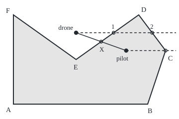

# Inside or outside: ray casting, and whether two segments cross

[Syllabus](../../../SYLLABUS.md) → [Geometry and trig](../../../SYLLABUS.md#w05) → [Points, Convexity and Fractals](../../../SYLLABUS.md#w05-s07) → Inside or outside

---

## General Overview

A paddock is fenced on six straight runs. Five corners point outward. The sixth, E, points inward, a reflex corner (more than 180° inside): the fence bends in round a dam, leaving a V-shaped notch in the north side. A spraying drone hovers 70 m east and 80 m north of the south-west corner. Is it over the paddock or over the dam?

The drone lies within the paddock's east–west and north–south spans, so a box drawn round the paddock says yes. The answer is no: the drone hangs in the notch. The pilot stands at 126 m east, 60 m north. Does the line from pilot to drone cross a fence, and which?

One small calculation answers both: which side of a line a point lies on. Send a ray (a half-line running forever one way) due east from the point and count the fences it meets. The drone's meets two: outside. The pilot's meets one: inside. The flight line crosses fence D–E at 98 m east, 70 m north.

**A point is inside a fence that does not cross itself exactly when a ray from it meets the fence an odd number of times; and two straight segments cross exactly when each one's ends lie on opposite sides of the other.**

**What kind of fact this is:** a method; the facts it rests on are theorems, proved on this card in Why it works for straight-sided fences, with the general curve in Jordan curve theorem.

### The picture: the paddock, the drone and the pilot

<p align="center"></p>

Drawn at 1 m = 1.8 units, corner A at the bottom left. The drone's dashed ray meets fences D–E and C–D, marked 1 and 2: even, so outside. The pilot's ray passes exactly through corner C and counts once. The solid flight line crosses D–E at X.

---

## The formula

Positions are grid coordinates in metres, east then north ([Distance and midpoint](../04-Coordinates%20and%20Curves/01-distance-and-midpoint.md)). For a point $a$, $a_x$ is its east coordinate and $a_y$ its north coordinate; the small letter below, a subscript, names the part.

The one tool is the orientation of three points, from [Shoelace formula](01-polygon-area-and-orientation.md):

$$\operatorname{orient}(a, b, c) = (b_x - a_x)(c_y - a_y) - (b_y - a_y)(c_x - a_x)$$

**Read it aloud:** walking from $a$ towards $b$, the number is positive if $c$ lies on the left, negative if on the right, zero if all three are in line.

It is the cross product of the arrows from $a$ to $b$ and from $a$ to $c$; only its sign is used here.

**Inside or outside.** A fence edge from corner $a$ to corner $b$ counts as a crossing of the eastward ray from $p$ when

$$(a_y > p_y) \ne (b_y > p_y) \quad\text{and}\quad \operatorname{orient}(a, b, p)\,(b_y - a_y) > 0$$

**Read it aloud:** exactly one end of the edge lies strictly north of the point, and the point lies west of the edge.

The point is inside when the count $n$ of such edges is odd, outside when it is even.

**Two segments.** The segment from $p$ to $q$ and the segment from $r$ to $s$ cross when

$$\operatorname{orient}(p, q, r)\,\operatorname{orient}(p, q, s) < 0 \quad\text{and}\quad \operatorname{orient}(r, s, p)\,\operatorname{orient}(r, s, q) < 0$$

**Read it aloud:** each segment's two ends lie on opposite sides of the other segment's line. A product is negative exactly when the two signs differ.

| Symbol | Plain meaning | In our example | Push it up and the answer… |
| --- | --- | --- | --- |
| $p$ | the point tested; in the crossing test, one end of the flight line | drone (70, 80), pilot (126, 60) | — |
| $a$, $b$, $c$ | points fed to orient; $a$, $b$ also a fence edge's ends | D (140, 100), E (70, 50) | — |
| $a_x$, $a_y$, $p_x$, $p_y$ | east and north coordinates, in metres | E: 70 east, 50 north | — |
| $\operatorname{orient}$ | twice a triangle's signed area; its sign says left or right | orient(D, E, drone) = −2100 | larger size: further from the line |
| $n$ | edges met by the eastward ray | 2 for the drone, 1 for the pilot | each extra crossing flips the verdict |
| $q$, $r$, $s$ | segment ends in the crossing test | $p$ the pilot, $q$ the drone; $r$, $s$ = D, E | — |
| $t$, $u$ | where the lines meet, as a fraction along each segment | 0.5 and 0.6 | outside 0 to 1: off the segment |
| $w$ | winding angle: total turn of the sight line from $p$ to a runner circling the fence | 0° drone, 360° pilot | — |

### When it holds

- **A fence that does not cross itself.** A figure-eight breaks "odd means inside".
- **The strict "north of".** Loosen it to "north or level" and a corner at the point's height counts twice.
- **A point not on a fence.** On one, that edge's orientation is zero and a separate on-the-line test decides.
- **Exact arithmetic.** Whole-metre coordinates make every sign exact; with rounded decimals a point a hair from a line can get the wrong one.
- **Proper crossings.** A segment ending on another gives orientation zero; touching needs an extra between-the-ends check.

---

## Why it works

### Step 0: every crossing flips the side

Far enough east a ray is clear of the paddock: outside. Walking back to the point, each fence crossed flips the side, so only the count's parity (odd or even) matters.

### Step 1: an edge crosses the ray east of the point

An edge meets the horizontal line through $p$ only if one end is north of $p$ and the other is not: the rule's first half.

For an edge running north, the crossing is east of $p$ exactly when $p$ is on the walk's left, orientation positive; running south, the sides swap. Multiplying by $b_y - a_y$, positive going north and negative going south, folds both into one sign. For the drone on D–E, orientation −2100 and the drop from 100 m to 50 m are both negative: the product is positive, and the crossing counts, at 112 m east. The decision never divides.

### Step 2: a corner on the ray counts once or not at all

The pilot's ray passes exactly through corner C, at (170, 60), where the fence runs on north: one crossing. Edge B–C has neither end strictly north of 60 m, so it does not count; C–D does. The pilot gets $n$ = 1, inside.

So a corner at the ray's height counts as if just south of it: passed through, it counts once; touched and turned back from, twice or not at all. Parity is right either way.

### Step 3: two segments cross when each straddles the other

If flight and fence cross, each straddles the other's line. Conversely, if D and E straddle the flight line, the fence segment meets that line; if pilot and drone straddle the fence line, the flight segment meets it. Two lines that are not parallel meet once, so that point is on both segments. Here orient(D, E, pilot) = 2100 against −2100 for the drone, and orient(pilot, drone, D) = −2520 against 1680 for E.

<details>
<summary>Detailed proof: the fence has exactly two sides</summary>

Move $p$ along a path that never touches the fence. Its count changes only when a corner passes through the ray's height, and the half-open rule makes that change 0 or 2. So parity is constant along the path.

Two points close together either side of one edge, away from corners, have rays meeting the same edges except that one: their parities differ.

Far away the count is 0. So points joined to far away without touching the fence are even, points just across an edge are odd, and no path joins the two without crossing the fence. That is the two-sided split for straight-run fences; for any closed curve that does not cross itself it is the Jordan curve theorem.

</details>

A second road needs no counting. Watch a runner go once round the fence: from inside, the sight line turns a full 360°; from outside it swings and returns, 0° in all. That total is the winding angle $w$, computed in the code from the inverse tangent ([Inverse trig](../03-Trigonometry/05-inverse-trig-and-solving-equations.md)). The segment test is checked by solving the two lines' equations for $t$ and $u$.


---

## Worked numbers, by hand

| Step | Arithmetic | Value |
| --- | --- | --- |
| E is reflex | orient(D, E, F) = (−70)(0) − (−50)(−140) | −7000, a right turn |
| drone, fence D–E | D (100 m) north of 80 m, E (50 m) not; (−70)(−20) − (−50)(−70), fence runs south | −2100: counts, at 112 m |
| drone, fence C–D | (−30)(20) − (40)(−100), fence runs north | 3400: counts, at 155 m |
| drone's count | no other fence qualifies | **2, outside** |
| pilot's count | C–D counts, B–C does not | **1, inside** |
| flight line against D–E | 2100 and −2100; −2520 and 1680 | **signs differ twice: crosses** |
| where | t = 0.5, u = 0.6 | **(98, 70)** |

The drone is over the dam; flying out to it from the pilot crosses fence D–E.

As a cross-check, 127 of 180 grid points 10 m apart test inside by both roads: about 12700 square metres, against the shoelace formula's exact 12300.

### What breaks if you drop a piece

| Mistake | Comes out at | What went wrong |
| --- | --- | --- |
| Box test on the paddock's extremes | drone inside | The notch is inside the box, outside the fence |
| A corner on the ray counted on both its edges | pilot count 2, outside | Corner C is one crossing, not two |
| Only fence B–C's ends checked against the flight line | orient 2880 and −880, "crosses" | The lines meet behind the pilot, t = −0.7021 |

The code prints all three.

---

## Code, from first principles, and it actually runs

Two roads each. Inside or outside: crossing counts against the winding angle, on the drone, the pilot and the grid. Crossing: the straddle test on every fence against solving for $t$ and $u$ by Cramer's rule (a ratio of two determinants). The distance formula then confirms the meeting point lies on both segments.

### Python

```python
# Inside or outside -- the check behind the card.  Standard library only.  A paddock
# of six corners, reflex at E; a drone at (70, 80), its pilot at (126, 60).  Each verdict
# is reached twice: ray crossings against winding angle, straddle test against solving.
import math
P = {"A": (0, 0), "B": (150, 0), "C": (170, 60), "D": (140, 100), "E": (70, 50), "F": (0, 100)}
fence = list(P.values())
edges = [(fence[i], fence[(i + 1) % 6]) for i in range(6)]
drone, pilot, B, C, D, E = (70, 80), (126, 60), P["B"], P["C"], P["D"], P["E"]
def orient(a, b, c):                   # twice the signed area of triangle a, b, c
    return (b[0] - a[0]) * (c[1] - a[1]) - (b[1] - a[1]) * (c[0] - a[0])
def crossings(p, half_open=True):      # road one: x of each fence the ray going right meets
    hits = []
    for a, b in edges:
        closed = a[1] != b[1] and min(a[1], b[1]) <= p[1] <= max(a[1], b[1])
        if ((a[1] > p[1]) != (b[1] > p[1]) if half_open else closed) and orient(a, b, p) * (b[1] - a[1]) > 0:
            hits.append(a[0] + (p[1] - a[1]) * (b[0] - a[0]) / (b[1] - a[1]))
    return sorted(hits)
def winding(p):                        # road two: total turn of the sight line, in degrees
    total = 0.0
    for a, b in edges:
        d = math.atan2(b[1] - p[1], b[0] - p[0]) - math.atan2(a[1] - p[1], a[0] - p[0])
        total += (d + math.pi) % (2 * math.pi) - math.pi
    return abs(math.degrees(total))
def straddle(p, q, r, s):              # road one: each segment's ends on opposite sides of the other
    return orient(p, q, r) * orient(p, q, s) < 0 and orient(r, s, p) * orient(r, s, q) < 0
def solve(p, q, r, s):                 # road two: p + t(q - p) = r + u(s - r), by Cramer's rule
    dx, dy, ex, ey, fx, fy = q[0] - p[0], q[1] - p[1], s[0] - r[0], s[1] - r[1], r[0] - p[0], r[1] - p[1]
    det = ex * dy - dx * ey
    return (ex * fy - ey * fx) / det, (dx * fy - dy * fx) / det

side = lambda k: "inside" if k else "outside"
svg = lambda x, y: (round(27 + 1.8 * x, 1), round(210 - 1.8 * y, 1))
dist = lambda a, b: math.sqrt((b[0] - a[0]) ** 2 + (b[1] - a[1]) ** 2)
print(f"reflex corner E: orient(D, E, F) = {orient(D, E, P['F'])}; area by shoelace {sum(orient((0, 0), a, b) for a, b in edges) / 2} m2")
for name, p in (("drone", drone), ("pilot", pilot)):
    h = crossings(p)
    print(f"{name} {p}: ray meets fences at x = {h}, count {len(h)} -> {side(len(h) % 2)}; winding {winding(p):.2f} deg")
print(f"orient(D, E, pilot) = {orient(D, E, pilot)}, orient(D, E, drone) = {orient(D, E, drone)}\n"
      f"orient(pilot, drone, D) = {orient(pilot, drone, D)}, orient(pilot, drone, E) = {orient(pilot, drone, E)}")
t, u = solve(pilot, drone, D, E)
X = (pilot[0] + t * (drone[0] - pilot[0]), pilot[1] + t * (drone[1] - pilot[1]))
print(f"flight line meets fence D-E at t = {t}, u = {u}, point ({X[0]:g}, {X[1]:g})")
by_straddle = [straddle(pilot, drone, a, b) for a, b in edges]
by_solving = [0 < v < 1 and 0 < w < 1 for v, w in [solve(pilot, drone, a, b) for a, b in edges]]
print(f"fences crossed by the flight line: straddle test {sum(by_straddle)}, solving {sum(by_solving)}")
grid = [(4 + 10 * i, 3 + 10 * j) for i in range(18) for j in range(10)]
ray_in, wind_in = [len(crossings(g)) % 2 == 1 for g in grid], [round(winding(g)) == 360 for g in grid]
print(f"grid of {len(grid)} points 10 m apart: inside by ray {sum(ray_in)}, by winding {sum(wind_in)}; x 100 m2 = {100 * sum(ray_in)} m2")
print(f"mistake 1, bounding box 0..170 by 0..100 says the drone is {side(0 <= drone[0] <= 170 and 0 <= drone[1] <= 100)}")
bad, (t2, u2) = crossings(pilot, half_open=False), solve(pilot, drone, B, C)
print(f"mistake 2, corner C counted on both its fences: pilot count {len(bad)} -> {side(len(bad) % 2)}")
print(f"mistake 3, fence B-C ends only: orient(pilot, drone, B) = {orient(pilot, drone, B)}, C = {orient(pilot, drone, C)} -> 'crosses'\n"
      f"  but orient(B, C, pilot) = {orient(B, C, pilot)}, orient(B, C, drone) = {orient(B, C, drone)}; t = {t2:.4f}, u = {u2:.4f}")
print(f"figure, corners {[svg(*c) for c in fence]}")
print(f"figure, drone {svg(*drone)}, pilot {svg(*pilot)}, meet {svg(*X)}, ray hits {[svg(x, drone[1]) for x in crossings(drone)]}, {svg(*C)}")
assert ray_in == wind_in and [len(crossings(p)) % 2 for p in (drone, pilot)] == [0, 1]
assert by_straddle == by_solving and by_straddle.index(True) == 3        # fence D-E, both roads
assert abs(dist(pilot, X) + dist(X, drone) - dist(pilot, drone)) < 1e-9 and abs(dist(D, X) - u * dist(D, E)) + abs(dist(X, E) - (1 - u) * dist(D, E)) < 1e-9
assert len(bad) % 2 != len(crossings(pilot)) % 2 and not 0 < t2 < 1
print("ALL CHECKS PASS")
```

**Ran 2026-09-24 on macOS, Python 3.14.6, standard library only. All checks passed. Output, pasted from the run:**

```
reflex corner E: orient(D, E, F) = -7000; area by shoelace 12300.0 m2
drone (70, 80): ray meets fences at x = [112.0, 155.0], count 2 -> outside; winding 0.00 deg
pilot (126, 60): ray meets fences at x = [170.0], count 1 -> inside; winding 360.00 deg
orient(D, E, pilot) = 2100, orient(D, E, drone) = -2100
orient(pilot, drone, D) = -2520, orient(pilot, drone, E) = 1680
flight line meets fence D-E at t = 0.5, u = 0.6, point (98, 70)
fences crossed by the flight line: straddle test 1, solving 1
grid of 180 points 10 m apart: inside by ray 127, by winding 127; x 100 m2 = 12700 m2
mistake 1, bounding box 0..170 by 0..100 says the drone is inside
mistake 2, corner C counted on both its fences: pilot count 2 -> outside
mistake 3, fence B-C ends only: orient(pilot, drone, B) = 2880, C = -880 -> 'crosses'
  but orient(B, C, pilot) = 2640, orient(B, C, drone) = 6400; t = -0.7021, u = 0.7660
figure, corners [(27.0, 210.0), (297.0, 210.0), (333.0, 102.0), (279.0, 30.0), (153.0, 120.0), (27.0, 30.0)]
figure, drone (153.0, 66.0), pilot (253.8, 102.0), meet (203.4, 84.0), ray hits [(228.6, 66.0), (306.0, 66.0)], (333.0, 102.0)
ALL CHECKS PASS
```

### Rust

Same numbers, same labels, built with `rustc --edition 2021 -O`.

```rust
// Inside or outside -- the same check as the Python, in Rust.  No crates.  A paddock
// of six corners, reflex at E; a drone at (70, 80), its pilot at (126, 60).  Each verdict
// is reached twice: ray crossings against winding angle, straddle test against solving.
type Pt = (f64, f64);
const FENCE: [Pt; 6] = [(0.0, 0.0), (150.0, 0.0), (170.0, 60.0), (140.0, 100.0), (70.0, 50.0), (0.0, 100.0)];
fn edges() -> Vec<(Pt, Pt)> { (0..6).map(|i| (FENCE[i], FENCE[(i + 1) % 6])).collect() }
fn orient(a: Pt, b: Pt, c: Pt) -> f64 { (b.0 - a.0) * (c.1 - a.1) - (b.1 - a.1) * (c.0 - a.0) }
fn crossings(p: Pt, half_open: bool) -> Vec<f64> {   // road one: x of each fence the ray going right meets
    let mut hits = Vec::new();
    for (a, b) in edges() {
        let closed = a.1 != b.1 && a.1.min(b.1) <= p.1 && p.1 <= a.1.max(b.1);
        let spans = if half_open { (a.1 > p.1) != (b.1 > p.1) } else { closed };
        if spans && orient(a, b, p) * (b.1 - a.1) > 0.0 { hits.push(a.0 + (p.1 - a.1) * (b.0 - a.0) / (b.1 - a.1)) }
    }
    hits.sort_by(|x, y| x.partial_cmp(y).unwrap());
    hits
}
fn winding(p: Pt) -> f64 {                           // road two: total turn of the sight line, in degrees
    let pi = std::f64::consts::PI;
    let mut total = 0.0;
    for (a, b) in edges() {
        let d = (b.1 - p.1).atan2(b.0 - p.0) - (a.1 - p.1).atan2(a.0 - p.0);
        total += (d + pi).rem_euclid(2.0 * pi) - pi;
    }
    total.to_degrees().abs()
}
fn straddle(p: Pt, q: Pt, r: Pt, s: Pt) -> bool {   // road one: each segment's ends on opposite sides of the other
    orient(p, q, r) * orient(p, q, s) < 0.0 && orient(r, s, p) * orient(r, s, q) < 0.0
}
fn solve(p: Pt, q: Pt, r: Pt, s: Pt) -> (f64, f64) { // road two: p + t(q - p) = r + u(s - r), by Cramer's rule
    let (dx, dy, ex, ey, fx, fy) = (q.0 - p.0, q.1 - p.1, s.0 - r.0, s.1 - r.1, r.0 - p.0, r.1 - p.1);
    let det = ex * dy - dx * ey;
    ((ex * fy - ey * fx) / det, (dx * fy - dy * fx) / det)
}
fn side(k: bool) -> &'static str { if k { "inside" } else { "outside" } }
fn svg(p: Pt) -> Pt { (((27.0 + 1.8 * p.0) * 10.0).round() / 10.0, ((210.0 - 1.8 * p.1) * 10.0).round() / 10.0) }
fn dist(a: Pt, b: Pt) -> f64 { ((b.0 - a.0).powi(2) + (b.1 - a.1).powi(2)).sqrt() }
fn g(x: f64) -> String { if x.fract() == 0.0 { format!("{}", x as i64) } else { format!("{}", x) } }
fn pi(p: Pt) -> String { format!("({}, {})", g(p.0), g(p.1)) }
fn main() {
    let (drone, pilot) = ((70.0, 80.0), (126.0, 60.0));
    let (b, c, d, e) = (FENCE[1], FENCE[2], FENCE[3], FENCE[4]);
    let area: f64 = edges().iter().map(|&(a, b)| orient((0.0, 0.0), a, b)).sum::<f64>() / 2.0;
    println!("reflex corner E: orient(D, E, F) = {}; area by shoelace {:?} m2", g(orient(d, e, FENCE[5])), area);
    for (name, p) in [("drone", drone), ("pilot", pilot)] {
        let h = crossings(p, true);
        println!("{} {}: ray meets fences at x = {:?}, count {} -> {}; winding {:.2} deg", name, pi(p), h, h.len(), side(h.len() % 2 == 1), winding(p));
    }
    println!("orient(D, E, pilot) = {}, orient(D, E, drone) = {}", g(orient(d, e, pilot)), g(orient(d, e, drone)));
    println!("orient(pilot, drone, D) = {}, orient(pilot, drone, E) = {}", g(orient(pilot, drone, d)), g(orient(pilot, drone, e)));
    let (t, u) = solve(pilot, drone, d, e);
    let x = (pilot.0 + t * (drone.0 - pilot.0), pilot.1 + t * (drone.1 - pilot.1));
    println!("flight line meets fence D-E at t = {:?}, u = {:?}, point {}", t, u, pi(x));
    let by_straddle: Vec<bool> = edges().iter().map(|&(a, b)| straddle(pilot, drone, a, b)).collect();
    let by_solving: Vec<bool> = edges().iter().map(|&(a, b)| { let (v, w) = solve(pilot, drone, a, b); 0.0 < v && v < 1.0 && 0.0 < w && w < 1.0 }).collect();
    let count = |v: &Vec<bool>| v.iter().filter(|&&k| k).count();
    println!("fences crossed by the flight line: straddle test {}, solving {}", count(&by_straddle), count(&by_solving));
    let grid: Vec<Pt> = (0..18).flat_map(|i| (0..10).map(move |j| (4.0 + 10.0 * i as f64, 3.0 + 10.0 * j as f64))).collect();
    let ray_in: Vec<bool> = grid.iter().map(|&q| crossings(q, true).len() % 2 == 1).collect();
    let wind_in: Vec<bool> = grid.iter().map(|&q| winding(q).round() == 360.0).collect();
    println!("grid of {} points 10 m apart: inside by ray {}, by winding {}; x 100 m2 = {} m2", grid.len(), count(&ray_in), count(&wind_in), 100 * count(&ray_in));
    println!("mistake 1, bounding box 0..170 by 0..100 says the drone is {}", side(0.0 <= drone.0 && drone.0 <= 170.0 && 0.0 <= drone.1 && drone.1 <= 100.0));
    let (bad, (t2, u2)) = (crossings(pilot, false), solve(pilot, drone, b, c));
    println!("mistake 2, corner C counted on both its fences: pilot count {} -> {}", bad.len(), side(bad.len() % 2 == 1));
    println!("mistake 3, fence B-C ends only: orient(pilot, drone, B) = {}, C = {} -> 'crosses'", g(orient(pilot, drone, b)), g(orient(pilot, drone, c)));
    println!("  but orient(B, C, pilot) = {}, orient(B, C, drone) = {}; t = {:.4}, u = {:.4}", g(orient(b, c, pilot)), g(orient(b, c, drone)), t2, u2);
    println!("figure, corners {:?}", FENCE.iter().map(|&q| svg(q)).collect::<Vec<Pt>>());
    let hits: Vec<Pt> = crossings(drone, true).iter().map(|&h| svg((h, drone.1))).collect();
    println!("figure, drone {:?}, pilot {:?}, meet {:?}, ray hits {:?}, {:?}", svg(drone), svg(pilot), svg(x), hits, svg(c));
    assert!(ray_in == wind_in && crossings(drone, true).len() % 2 == 0 && crossings(pilot, true).len() % 2 == 1);
    assert!(by_straddle == by_solving && by_straddle.iter().position(|&k| k) == Some(3)); // fence D-E, both roads
    assert!((dist(pilot, x) + dist(x, drone) - dist(pilot, drone)).abs() < 1e-9 && (dist(d, x) - u * dist(d, e)).abs() + (dist(x, e) - (1.0 - u) * dist(d, e)).abs() < 1e-9);
    assert!(bad.len() % 2 != crossings(pilot, true).len() % 2 && !(0.0 < t2 && t2 < 1.0));
    println!("ALL CHECKS PASS");
}
```

**Ran 2026-09-24 on macOS, rustc 1.98.1, no crates. All checks passed. Output, pasted from the run:**

```
reflex corner E: orient(D, E, F) = -7000; area by shoelace 12300.0 m2
drone (70, 80): ray meets fences at x = [112.0, 155.0], count 2 -> outside; winding 0.00 deg
pilot (126, 60): ray meets fences at x = [170.0], count 1 -> inside; winding 360.00 deg
orient(D, E, pilot) = 2100, orient(D, E, drone) = -2100
orient(pilot, drone, D) = -2520, orient(pilot, drone, E) = 1680
flight line meets fence D-E at t = 0.5, u = 0.6, point (98, 70)
fences crossed by the flight line: straddle test 1, solving 1
grid of 180 points 10 m apart: inside by ray 127, by winding 127; x 100 m2 = 12700 m2
mistake 1, bounding box 0..170 by 0..100 says the drone is inside
mistake 2, corner C counted on both its fences: pilot count 2 -> outside
mistake 3, fence B-C ends only: orient(pilot, drone, B) = 2880, C = -880 -> 'crosses'
  but orient(B, C, pilot) = 2640, orient(B, C, drone) = 6400; t = -0.7021, u = 0.7660
figure, corners [(27.0, 210.0), (297.0, 210.0), (333.0, 102.0), (279.0, 30.0), (153.0, 120.0), (27.0, 30.0)]
figure, drone (153.0, 66.0), pilot (253.8, 102.0), meet (203.4, 84.0), ray hits [(228.6, 66.0), (306.0, 66.0)], (333.0, 102.0)
ALL CHECKS PASS
```

The two outputs match line for line.

> [!TIP]
> **Try changing**
> Guess first, then run it.
> - **Move the drone south of E.** Set the drone to `(70, 40)`. Guess: inside, one crossing, on B–C at 163.33 m east; winding 360°. The first assert stops the run.
> - **Count corners twice.** Change `half_open=True` to `half_open=False` in the definition of `crossings`. Guess: the pilot's count becomes 2, at 170 m twice: outside. The first assert stops the run.
> - **Check only one side.** Delete the second half of `straddle`, from `and orient(r, s, p)`. Guess: fence B–C joins D–E as "crossed", and the second assert stops the run.

---

## The usual mistake

> [!warning]
> **Reading "between the extremes" as "inside".** The drone lies within the paddock's spans of 0 to 170 m east and 0 to 100 m north, yet it is over the dam. A box holds empty ground even round the convex shapes of [Convex sets](02-convex-sets-and-convex-hulls.md); reflex corner E puts it in the middle.
>
> - **Counting a corner twice.** Corner C counted on both its edges gives the pilot 2: outside.
> - **Testing one side only.** Fence B–C's ends straddle the flight line (2880 and −880), but pilot and drone sit on one side of B–C's line (2640 and 6400); the lines meet behind the pilot, t = −0.7021.
> - **Trusting rounded decimals near a fence.** A point a hair from a fence can get the wrong sign; whole-metre coordinates avoid it here.

---

## Where you meet it in real life

- **Geofencing.** Drone controllers and phone alerts test positions against mapped boundaries this way.
- **Maps and land records.** Which parcel, district or time zone holds a point is a point-in-polygon test on surveyed boundaries.
- **Screens and fonts.** Filling a letter's outline tests pixels by the even-odd rule, the crossing count.
- **Collision checks.** Games and robot planners test moving segments against walls with the straddle test.

> **Say it back**
> Orientation says whether a point lies left or right of a line. A ray from a point meets a fence that does not cross itself an odd number of times exactly when the point is inside. A corner on the ray counts as just below it. Two segments cross exactly when each one's ends straddle the other. The drone's ray meets two fences: it is over the dam.

---

## What this builds on

- [Shoelace formula](01-polygon-area-and-orientation.md): the triangle's signed area, whose sign is the orientation test, and the shoelace area.

## Where this goes next

- Jordan curve theorem: every closed curve that does not cross itself has exactly one inside and one outside.

This card proved the two-sided split for straight-run fences; whether a curve with no straight pieces, even one too crinkled to have a length, still has a clean inside and outside is what the Jordan curve theorem answers.

---

## Sources

Verified 24 Sep 2026: every link below resolves to the publisher's page.

- de Berg, Mark, Otfried Cheong, Marc van Kreveld and Mark Overmars. *Computational Geometry: Algorithms and Applications*, 3rd ed. Springer, 2008. [Publisher page](https://link.springer.com/book/10.1007/978-3-540-77974-2). Chapter 1 builds the convex hull on the left-or-right test and treats degenerate cases and rounding.
- Cormen, Thomas H., Charles E. Leiserson, Ronald L. Rivest and Clifford Stein. *Introduction to Algorithms*, 4th ed. MIT Press, 2022. [Publisher page](https://mitpress.mit.edu/9780262046305/introduction-to-algorithms/). The computational geometry chapter gives the straddle test for segments, with the touching cases.
- Shimrat, M. "Algorithm 112: Position of point relative to polygon." *Communications of the ACM* 5, no. 8 (1962): 434. [DOI](https://doi.org/10.1145/368637.368653). An early published version of the crossing-count test.
