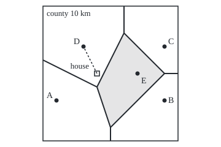
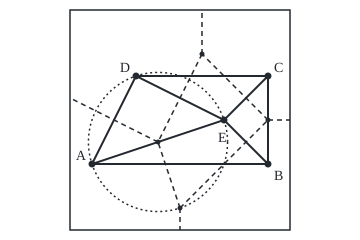

# Nearest-neighbour maps: Voronoi cells and the Delaunay triangulation behind them

[Syllabus](../../../SYLLABUS.md) → [Geometry and trig](../README.md) → [Points, Convexity and Fractals](../README.md#s07) → Nearest-neighbour maps

---

## General Overview

A county is a square 10 km on a side, with five hospitals, A to E. Put a grid on it with the origin at the south-west corner, so (x, y) means x km east and y km north. The hospitals sit at A (1, 3), B (9, 3), C (9, 7), D (3, 7) and E (7, 5).

A house at (4, 5) needs an ambulance. Straight-line distances: A 3.61 km, B 5.39, C 5.39, D 2.24, E 3.00. D is nearest, though E looks central.

To settle every house at once, shade each spot by its nearest hospital. The county splits into five regions, one per hospital: **Voronoi cells**, after Georgy Voronoi (1908), together the **Voronoi diagram**. Joining hospitals whose cells share an edge cuts the space between them into triangles: the **Delaunay triangulation**, after Boris Delaunay (1934).

**Every edge of the map lies on the line of spots equally far from two hospitals; every corner is the centre of a circle through three hospitals with no hospital inside; and joining neighbours gives one triangle per corner.**

**What kind of fact this is:** the cell is a definition; the empty-circle property and the corner-triangle match are theorems, proved on this card in Why it works.

### The picture: the county cut into five cells

<p align="center"></p>

To scale, 1 km = 22 units. The dashed line joins the house to D. Only E's cell, shaded, is closed.

---

## The formula

Notation first, in words. Bars round a difference, $\lvert X - P\rvert$, mean the straight-line distance between two positions; curly braces collect the spots that pass the test after the colon; the dot is the dot product.

$$V(P) = \{\, X : \lvert X - P\rvert \le \lvert X - Q\rvert \text{ for every other hospital } Q \,\}$$

**Read it aloud:** the cell of hospital P is every spot at least as close to P as to any other hospital.

$$\lvert X - P\rvert = \lvert X - Q\rvert \quad\text{exactly when}\quad 2\,(Q - P)\cdot X = \lvert Q\rvert^2 - \lvert P\rvert^2$$

**Read it aloud:** the spots equally far from two hospitals form one straight line, square to the segment joining them, through its midpoint: the **perpendicular bisector**, where two cells meet.

The **empty-circle property:** three hospitals form a Delaunay triangle exactly when the circle through them, of radius $r$, has no hospital strictly inside. Its centre is then a map corner.

With $n$ hospitals, $h$ of them corners of the convex hull (the tightest convex shape round them all), and no four on one circle:

$$\text{triangles} = 2n - 2 - h, \qquad \text{edges} = 3n - 3 - h$$

| Symbol | Plain meaning | In our example | Push it up and the answer… |
| --- | --- | --- | --- |
| $P$, $Q$ | two hospitals, as grid positions | A (1, 3), E (7, 5) | — |
| $X$ | a house, at position (x, y) in km | (4, 5) | — |
| $\lvert X - P\rvert$ | straight-line distance from house to hospital | 2.24 km to D | — |
| $\lvert Q\rvert$ | a hospital's distance from the origin | E: square root of 7^2 + 5^2 | — |
| $V(P)$ | the Voronoi cell of P | E's cell, 17.00 square km | — |
| $r$ | radius of the circle through three hospitals | 4.47 km for A, B, E | the corner is worse served |
| $n$ | number of hospitals | 5 | more triangles, smaller cells |
| $h$ | hospitals on the convex hull; their cells are open-ended | 4 | fewer triangles |

### When it holds

- **Straight-line distance.** Measured by travel time, the edges curve and the bisector rule fails.
- **Every hospital counts the same.** Weighting by size bends the edges off the bisectors.
- **No four hospitals on one circle.** Otherwise four cells share a corner and the triangulation is not unique.
- **Not all hospitals on one line.** Then there is no triangle; the cells are parallel strips.

---

## Why it works

### Step 0: a boundary is a straight line

A (1, 3) and B (9, 3) are level, so the spots equally far from both lie on x = 5. For any pair, expand with the dot product: $\lvert X - P\rvert^2 = X\cdot X - 2\,P\cdot X + P\cdot P$. Equate two such squared distances and $X\cdot X$ cancels, leaving the bisector equation of The formula. No square of X remains, so it is a straight line; Q − P is square to it, and the midpoint of P and Q satisfies it. For A and E it reads 3x + y = 16.

### Step 1: a cell is convex

The spots at least as close to P as to Q fill one side of that line, a **half-plane**. P's cell is what all its half-planes share. Half-planes are convex (the segment between two of their points stays inside), and so is what convex sets share ([Convex sets](02-convex-sets-and-convex-hulls.md)). So every cell is convex, with straight sides.

A cell is open-ended exactly when its hospital is a hull corner. E sits inside the hull, and far enough out in any direction one of A, B, C, D is closer, so E's cell closes.

### Step 2: three bisectors meet at one point

A spot on both the A–B and the A–E bisector is as far from B as from A, and as far from E as from A, so it lies on the B–E bisector too: the three meet at the centre of the circle through A, B and E. Solving x = 5 with 3x + y = 16 gives (5, 1), 4.47 km from all three.

### Step 3: a corner is the centre of an empty circle

A spot at distance $r$ from three hospitals is a map corner exactly when those three are nearest to it: when no hospital lies strictly inside the circle. From (5, 1) the next hospital, D, is 6.32 km away, beyond 4.47 km, so (5, 1) is a corner. Triple A, B, D fails: its centre (5.00, 3.50) is 4.03 km from the three but 2.50 km from E.

### Step 4: neighbours make triangles, one per corner

Join two hospitals whenever their cells share an edge. Three cells meet at each corner, so the joins there close the triangle whose empty circle Step 3 found; by Step 0 each join is square to its map edge. Hospitals match cells, joins match edges, triangles match corners: a **duality**, a one-for-one pairing of two pictures.

The county gives triangles A B E, A D E, B C E and C D E, centred at (5, 1), (4, 4), (9, 5) and (6, 8), and eight joins: four hull sides, four spokes to E. With $n$ = 5 and $h$ = 4, that is $2n - 2 - h$ and $3n - 3 - h$.

<details>
<summary>Detailed proof: the triangle and edge counts</summary>

Take from de Berg and co-authors (chapter 9) that the triangles cover the hull without gaps or overlaps; assume no hospital lies partway along a hull side.

Count angles two ways. Each triangle holds 180°. At each of the $n - h$ inside hospitals the angles fill 360°; at the $h$ hull corners they fill the hull's angles, $(h - 2)$ × 180° in all. So triangles × 180° = $(n - h)$ × 360° + $(h - 2)$ × 180°, and triangles = $2n - 2 - h$.

Count sides: an inside edge serves two triangles, a hull side one. So 3 × triangles = 2 × edges − $h$, and edges = $3n - 3 - h$.

</details>

A second road lifts each hospital to a height equal to its squared distance from the origin; the underside of the lifted points' convex hull, pressed flat, is the triangulation (de Berg and co-authors).

### The picture: triangles, map and one empty circle

<p align="center"></p>

To scale, 1 km = 22 units. Solid: Delaunay triangles. Dashed: the map. Dotted: the empty circle through A, D and E, centred on the corner (4, 4), radius 3.16 km. The corner (9, 5) sits on side B C because the angle at E is a right angle.

---

## Worked numbers, by hand

| Step | Arithmetic | Value |
| --- | --- | --- |
| house (4, 5) to D (3, 7) | square root of 1^2 + 2^2 | 2.24 km |
| bisector of A and B | through the midpoint (5, 3), square to A B | x = 5 |
| bisector of A and E | 2 × (6, 2) · (x, y) = 74 − 10 | 3x + y = 16 |
| corner for A, B, E | x = 5 into 3x + y = 16 | (5, 1) |
| its radius | square root of 4^2 + 2^2 | 4.47 km |
| empty? | D is the square root of 2^2 + 6^2 away | 6.32 km: **empty** |
| area of E's cell | shoelace on (5, 1), (9, 5), (6, 8), (4, 4): (16 + 42 − 8 − 16) ÷ 2 | **17.00 square km** |

Every house in those 17.00 square km is closest to E, and at most 4.47 km from it, at the corner (5, 1).

### What breaks if you drop a piece

| Mistake | Comes out at | What went wrong |
| --- | --- | --- |
| Corner of A B E at the centroid (average position), (5.67, 3.67) | 4.71, 3.40, 1.89 km from A, B, E | Not equally far from all three |
| Triangle A B D | radius 4.03, E 2.50 km from the centre | Circle not empty |
| Every triple a corner | 10 centres | Only 4 circles are empty |
| Worst spot at a corner | (5.00, 1.00), 4.47 km | Edge x = 5 reaches (5.00, 0.00), 5.00 km |

---

## Code, from first principles, and it actually runs

Nothing is imported. Road one tests all 10 triples of hospitals for an empty circle. Road two never mentions circles: it starts each cell as the whole county, cuts away the part beyond each bisector, and reads corners and neighbours off the pieces. Cell areas come by shoelace and by counting 160,000 grid houses; the worst-served spot from the cells and from every whole-kilometre point.

### Python

```python
# Voronoi cells and the Delaunay triangulation -- the check behind the card. Nothing is imported.
# Road one tests every triple of hospitals for an empty circle; road two cuts the county along bisectors.
H = {"A": (1, 3), "B": (9, 3), "C": (9, 7), "D": (3, 7), "E": (7, 5)}
NAMES, HOUSE, W, n = sorted(H), (4, 5), 10, 5
d2 = lambda p, q: (p[0] - q[0]) ** 2 + (p[1] - q[1]) ** 2
km = lambda p, q: d2(p, q) ** 0.5
pt = lambda p: f"({p[0]:.2f}, {p[1]:.2f})"
key = lambda p: (round(p[0], 6) + 0.0, round(p[1], 6) + 0.0)
def centre(a, b, c):  # equal distance to a, b and c: two straight-line equations, solved
    a1, b1, c1 = 2 * (b[0] - a[0]), 2 * (b[1] - a[1]), d2(b, (0, 0)) - d2(a, (0, 0))
    a2, b2, c2 = 2 * (c[0] - a[0]), 2 * (c[1] - a[1]), d2(c, (0, 0)) - d2(a, (0, 0))
    return ((c1 * b2 - c2 * b1) / (a1 * b2 - a2 * b1), (a1 * c2 - a2 * c1) / (a1 * b2 - a2 * b1))
def clip(poly, p, q):  # keep the part of a convex polygon at least as close to p as to q
    f, out = (lambda v: d2(v, p) - d2(v, q)), []
    for u, v in zip(poly, poly[1:] + poly[:1]):
        if f(u) <= 0: out.append(u)
        if f(u) * f(v) < 0:
            t = f(u) / (f(u) - f(v)); out.append((u[0] + t * (v[0] - u[0]), u[1] + t * (v[1] - u[1])))
    return out
print("hospitals " + " ".join(f"{k} {H[k]}" for k in NAMES) + f"; county {W} km x {W} km")
print(f"house {HOUSE}: " + " ".join(f"{k} {km(HOUSE, H[k]):.2f}" for k in NAMES) + " km -> nearest " + min(NAMES, key=lambda k: d2(HOUSE, H[k])))
triples = [a + b + c for a in NAMES for b in NAMES for c in NAMES if a < b < c]
tris, edges1 = [], set()                                            # road one: empty circles
for t in triples:
    o = centre(*(H[k] for k in t)); r = km(o, H[t[0]]); near = min(km(o, H[k]) for k in NAMES if k not in t)
    if near > r + 1e-9:
        tris.append(key(o)); edges1 |= {t[0] + t[1], t[0] + t[2], t[1] + t[2]}
        print(f"triangle {' '.join(t)}: centre {pt(o)}, radius {r:.2f}, next hospital {near:.2f} km")
print(f"triples tested {len(triples)}, empty circles {len(tris)}; Delaunay edges {' '.join(sorted(edges1))}")
cells = {k: [(0.0, 0.0), (W, 0.0), (W, W), (0.0, W)] for k in NAMES}     # road two: cut the county
for k, q in [(k, q) for k in NAMES for q in NAMES if k != q]: cells[k] = clip(cells[k], H[k], H[q])
ties = lambda v: sum(abs(d2(v, H[q]) - min(d2(v, H[s]) for s in NAMES)) < 1e-9 for q in NAMES)
corners = sorted({key(v) for c in cells.values() for v in c if ties(v) >= 3})
edges2 = [p + q for p in NAMES for q in NAMES if p < q and sum(abs(d2(v, H[p]) - d2(v, H[q])) < 1e-9 for v in cells[p]) >= 2]
print("road two, corners shared by three cells: " + " ".join(pt(v) for v in corners))
print("road two, cells sharing an edge: " + " ".join(edges2))
areas = {k: sum(u[0] * v[1] - v[0] * u[1] for u, v in zip(c, c[1:] + c[:1])) / 2 for k, c in cells.items()}
count = dict.fromkeys(NAMES, 0)                           # 400 x 400 houses, 1/40 km apart
for i in range(400):
    for j in range(400):
        count[min(NAMES, key=lambda k: d2((2 * i + 1, 2 * j + 1), (80 * H[k][0], 80 * H[k][1])))] += 1
print("cell areas by shoelace, km^2: " + " ".join(f"{k} {areas[k]:.2f}" for k in NAMES) + f"; total {sum(areas.values()):.2f}")
print("cell areas by counting 160000 houses: " + " ".join(f"{k} {count[k] / 1600:.2f}" for k in NAMES) + f"; total {sum(count.values()) / 1600:.2f}")
h = sum(any(min(v) < 1e-9 or max(v) > W - 1e-9 for v in cells[k]) for k in NAMES)
print(f"hull hospitals (open-ended cells) h = {h}; triangles 2n-2-h = {2 * n - 2 - h}; edges 3n-3-h = {3 * n - 3 - h}")
worst = max((km(v, H[k]), key(v)) for k in NAMES for v in cells[k])
brute = max((min(km((x, y), H[k]) for k in NAMES), (x, y)) for x in range(W + 1) for y in range(W + 1))
print(f"worst-served spot, from the cells: {pt(worst[1])} at {worst[0]:.2f} km; by grid search: {pt(brute[1])} at {brute[0]:.2f} km")
g = ((1 + 9 + 7) / 3, (3 + 3 + 5) / 3); o = centre(H["A"], H["B"], H["D"])
print(f"mistake 1, centroid {pt(g)} of A B E: " + " ".join(f"{k} {km(g, H[k]):.2f}" for k in "ABE") + " km, not equal")
print(f"mistake 2, triangle A B D: centre {pt(o)}, radius {km(o, H['A']):.2f}, but E is {km(o, H['E']):.2f} km away")
print(f"mistake 3, every triple as a corner: {len(triples)} centres, the map has {len(corners)}")
px = lambda p: f"({70 + 22 * p[0]:g},{230 - 22 * p[1]:g})"
print("figure, 1 km = 22 units, hospitals " + " ".join(px(H[k]) for k in NAMES) + ", corners " + " ".join(px(v) for v in corners))
print("figure, edge ends " + " ".join(px(v) for v in sorted({key(v) for c in cells.values() for v in c if ties(v) == 2})) + f", house {px(HOUSE)}, circle A D E radius {22 * km(corners[0], H['A']):.2f}")
assert corners == sorted(tris)                                      # two roads, one set of corners
assert edges2 == sorted(edges1) and len(tris) == 2 * n - 2 - h      # two roads, one triangulation
assert all(abs(areas[k] - count[k] / 1600) < 0.2 for k in NAMES)    # shoelace against counting
assert abs(worst[0] - brute[0]) < 1e-9                              # cells against brute search
print("ALL CHECKS PASS")
```

**Ran 2026-09-24 on macOS, Python 3.14.6, standard library only. All checks passed. Output, pasted from the run:**

```
hospitals A (1, 3) B (9, 3) C (9, 7) D (3, 7) E (7, 5); county 10 km x 10 km
house (4, 5): A 3.61 B 5.39 C 5.39 D 2.24 E 3.00 km -> nearest D
triangle A B E: centre (5.00, 1.00), radius 4.47, next hospital 6.32 km
triangle A D E: centre (4.00, 4.00), radius 3.16, next hospital 5.10 km
triangle B C E: centre (9.00, 5.00), radius 2.00, next hospital 6.32 km
triangle C D E: centre (6.00, 8.00), radius 3.16, next hospital 5.83 km
triples tested 10, empty circles 4; Delaunay edges AB AD AE BC BE CD CE DE
road two, corners shared by three cells: (4.00, 4.00) (5.00, 1.00) (6.00, 8.00) (9.00, 5.00)
road two, cells sharing an edge: AB AD AE BC BE CD CE DE
cell areas by shoelace, km^2: A 22.50 B 17.00 C 15.50 D 28.00 E 17.00; total 100.00
cell areas by counting 160000 houses: A 22.51 B 17.05 C 15.54 D 28.00 E 16.90; total 100.00
hull hospitals (open-ended cells) h = 4; triangles 2n-2-h = 4; edges 3n-3-h = 8
worst-served spot, from the cells: (5.00, 0.00) at 5.00 km; by grid search: (5.00, 0.00) at 5.00 km
mistake 1, centroid (5.67, 3.67) of A B E: A 4.71 B 3.40 E 1.89 km, not equal
mistake 2, triangle A B D: centre (5.00, 3.50), radius 4.03, but E is 2.50 km away
mistake 3, every triple as a corner: 10 centres, the map has 4
figure, 1 km = 22 units, hospitals (92,164) (268,164) (268,76) (136,76) (224,120), corners (158,142) (180,208) (202,54) (268,120)
figure, edge ends (70,98) (180,230) (202,10) (290,120), house (158,120), circle A D E radius 69.57
ALL CHECKS PASS
```

### Rust

Same numbers, same labels, built with `rustc --edition 2021 -O`. Grid houses use whole units of 1/80 km, so ties break alike in both.

```rust
// Voronoi cells and the Delaunay triangulation -- the same check as the Python, in Rust. No crates.
// Road one tests every triple of hospitals for an empty circle; road two cuts the county along bisectors.
type P = (f64, f64);
const NAMES: [&str; 5] = ["A", "B", "C", "D", "E"]; const W: f64 = 10.0;
const H: [P; 5] = [(1.0, 3.0), (9.0, 3.0), (9.0, 7.0), (3.0, 7.0), (7.0, 5.0)];
fn d2(p: P, q: P) -> f64 { (p.0 - q.0).powi(2) + (p.1 - q.1).powi(2) } fn km(p: P, q: P) -> f64 { d2(p, q).sqrt() }
fn pt(p: P) -> String { format!("({:.2}, {:.2})", p.0, p.1) }
fn key(p: P) -> P { ((p.0 * 1e6).round() / 1e6 + 0.0, (p.1 * 1e6).round() / 1e6 + 0.0) }
fn centre(a: P, b: P, c: P) -> P { // equal distance to a, b and c: two straight-line equations, solved
    let (a1, b1, c1) = (2.0 * (b.0 - a.0), 2.0 * (b.1 - a.1), d2(b, (0.0, 0.0)) - d2(a, (0.0, 0.0)));
    let (a2, b2, c2) = (2.0 * (c.0 - a.0), 2.0 * (c.1 - a.1), d2(c, (0.0, 0.0)) - d2(a, (0.0, 0.0)));
    ((c1 * b2 - c2 * b1) / (a1 * b2 - a2 * b1), (a1 * c2 - a2 * c1) / (a1 * b2 - a2 * b1))
}
fn clip(poly: &[P], p: P, q: P) -> Vec<P> { // keep the part of a convex polygon at least as close to p as to q
    let (f, mut out) = (|v: P| d2(v, p) - d2(v, q), Vec::new());
    for i in 0..poly.len() {
        let (u, v) = (poly[i], poly[(i + 1) % poly.len()]);
        if f(u) <= 0.0 { out.push(u) }
        if f(u) * f(v) < 0.0 { let t = f(u) / (f(u) - f(v)); out.push((u.0 + t * (v.0 - u.0), u.1 + t * (v.1 - u.1))) }
    }
    out
}
fn cmp(a: &P, b: &P) -> std::cmp::Ordering { a.partial_cmp(b).unwrap() }
fn main() {
    let (house, n) = ((4.0, 5.0), 5usize);
    let near_of = |x: P| (0..5).fold(0, |b, k| if d2(x, H[k]) < d2(x, H[b]) { k } else { b });
    println!("hospitals {}; county {} km x {} km", (0..5).map(|k| format!("{} ({}, {})", NAMES[k], H[k].0, H[k].1)).collect::<Vec<_>>().join(" "), W, W);
    println!("house (4, 5): {} km -> nearest {}", (0..5).map(|k| format!("{} {:.2}", NAMES[k], km(house, H[k]))).collect::<Vec<_>>().join(" "), NAMES[near_of(house)]);
    let mut triples = Vec::new();
    for a in 0..5 { for b in a + 1..5 { for c in b + 1..5 { triples.push([a, b, c]) } } }
    let (mut tris, mut edges1): (Vec<P>, Vec<String>) = (Vec::new(), Vec::new()); // road one: empty circles
    for t in &triples {
        let o = centre(H[t[0]], H[t[1]], H[t[2]]); let r = km(o, H[t[0]]);
        let near = (0..5).filter(|k| !t.contains(k)).map(|k| km(o, H[k])).fold(f64::INFINITY, f64::min);
        if near > r + 1e-9 {
            tris.push(key(o));
            for (i, j) in [(0, 1), (0, 2), (1, 2)] { let e = format!("{}{}", NAMES[t[i]], NAMES[t[j]]); if !edges1.contains(&e) { edges1.push(e) } }
            println!("triangle {} {} {}: centre {}, radius {:.2}, next hospital {:.2} km", NAMES[t[0]], NAMES[t[1]], NAMES[t[2]], pt(o), r, near);
        }
    }
    edges1.sort(); tris.sort_by(cmp);
    println!("triples tested {}, empty circles {}; Delaunay edges {}", triples.len(), tris.len(), edges1.join(" "));
    let mut cells: Vec<Vec<P>> = vec![vec![(0.0, 0.0), (W, 0.0), (W, W), (0.0, W)]; 5]; // road two: cut the county
    for k in 0..5 { for q in 0..5 { if q != k { cells[k] = clip(&cells[k], H[k], H[q]) } } }
    let ties = |v: P| { let m = (0..5).map(|s| d2(v, H[s])).fold(f64::INFINITY, f64::min); (0..5).filter(|&q| (d2(v, H[q]) - m).abs() < 1e-9).count() };
    let mut corners: Vec<P> = cells.iter().flatten().filter(|&&v| ties(v) >= 3).map(|&v| key(v)).collect();
    corners.sort_by(cmp); corners.dedup();
    let mut edges2 = Vec::new();
    for p in 0..5 { for q in p + 1..5 { if cells[p].iter().filter(|&&v| (d2(v, H[p]) - d2(v, H[q])).abs() < 1e-9).count() >= 2 { edges2.push(format!("{}{}", NAMES[p], NAMES[q])) } } }
    println!("road two, corners shared by three cells: {}", corners.iter().map(|&v| pt(v)).collect::<Vec<_>>().join(" "));
    println!("road two, cells sharing an edge: {}", edges2.join(" "));
    let areas: Vec<f64> = cells.iter().map(|c| (0..c.len()).map(|i| { let (u, v) = (c[i], c[(i + 1) % c.len()]); u.0 * v.1 - v.0 * u.1 }).sum::<f64>() / 2.0).collect();
    let mut count = [0usize; 5]; // 400 x 400 houses, 1/40 km apart, in whole units of 1/80 km
    for i in 0..400i64 { for j in 0..400i64 {
        let g = (2 * i + 1, 2 * j + 1);
        let dd = |k: usize| { let (x, y) = (80 * H[k].0 as i64, 80 * H[k].1 as i64); (g.0 - x).pow(2) + (g.1 - y).pow(2) };
        count[(0..5).fold(0, |b, k| if dd(k) < dd(b) { k } else { b })] += 1;
    } }
    println!("cell areas by shoelace, km^2: {}; total {:.2}", (0..5).map(|k| format!("{} {:.2}", NAMES[k], areas[k])).collect::<Vec<_>>().join(" "), areas.iter().sum::<f64>());
    println!("cell areas by counting 160000 houses: {}; total {:.2}", (0..5).map(|k| format!("{} {:.2}", NAMES[k], count[k] as f64 / 1600.0)).collect::<Vec<_>>().join(" "), count.iter().sum::<usize>() as f64 / 1600.0);
    let h = cells.iter().filter(|c| c.iter().any(|v| v.0.min(v.1) < 1e-9 || v.0.max(v.1) > W - 1e-9)).count();
    println!("hull hospitals (open-ended cells) h = {}; triangles 2n-2-h = {}; edges 3n-3-h = {}", h, 2 * n - 2 - h, 3 * n - 3 - h);
    let (mut worst, mut brute) = ((0.0, (0.0, 0.0)), (0.0, (0.0, 0.0)));
    for k in 0..5 { for &v in &cells[k] { let c = (km(v, H[k]), key(v)); if c.partial_cmp(&worst).unwrap().is_gt() { worst = c } } }
    for x in 0..=10 { for y in 0..=10 { let p = (x as f64, y as f64); let c = (km(p, H[near_of(p)]), p); if c.partial_cmp(&brute).unwrap().is_gt() { brute = c } } }
    println!("worst-served spot, from the cells: {} at {:.2} km; by grid search: {} at {:.2} km", pt(worst.1), worst.0, pt(brute.1), brute.0);
    let (g, o) = (((1.0 + 9.0 + 7.0) / 3.0, (3.0 + 3.0 + 5.0) / 3.0), centre(H[0], H[1], H[3]));
    println!("mistake 1, centroid {} of A B E: A {:.2} B {:.2} E {:.2} km, not equal", pt(g), km(g, H[0]), km(g, H[1]), km(g, H[4]));
    println!("mistake 2, triangle A B D: centre {}, radius {:.2}, but E is {:.2} km away", pt(o), km(o, H[0]), km(o, H[4]));
    println!("mistake 3, every triple as a corner: {} centres, the map has {}", triples.len(), corners.len());
    let px = |p: P| format!("({},{})", 70.0 + 22.0 * p.0, 230.0 - 22.0 * p.1);
    println!("figure, 1 km = 22 units, hospitals {}, corners {}", H.iter().map(|&p| px(p)).collect::<Vec<_>>().join(" "), corners.iter().map(|&p| px(p)).collect::<Vec<_>>().join(" "));
    let mut ends: Vec<P> = cells.iter().flatten().filter(|&&v| ties(v) == 2).map(|&v| key(v)).collect(); ends.sort_by(cmp); ends.dedup();
    println!("figure, edge ends {}, house {}, circle A D E radius {:.2}", ends.iter().map(|&p| px(p)).collect::<Vec<_>>().join(" "), px(house), 22.0 * km(corners[0], H[0]));
    assert!(corners == tris);                                           // two roads, one set of corners
    assert!(edges2 == edges1 && tris.len() == 2 * n - 2 - h);           // two roads, one triangulation
    assert!((0..5).all(|k| (areas[k] - count[k] as f64 / 1600.0).abs() < 0.2)); // shoelace against counting
    assert!((worst.0 - brute.0).abs() < 1e-9);                          // cells against brute search
    println!("ALL CHECKS PASS");
}
```

**Ran 2026-09-24 on macOS, rustc 1.98.1, no crates. All checks passed. Output, pasted from the run:**

```
hospitals A (1, 3) B (9, 3) C (9, 7) D (3, 7) E (7, 5); county 10 km x 10 km
house (4, 5): A 3.61 B 5.39 C 5.39 D 2.24 E 3.00 km -> nearest D
triangle A B E: centre (5.00, 1.00), radius 4.47, next hospital 6.32 km
triangle A D E: centre (4.00, 4.00), radius 3.16, next hospital 5.10 km
triangle B C E: centre (9.00, 5.00), radius 2.00, next hospital 6.32 km
triangle C D E: centre (6.00, 8.00), radius 3.16, next hospital 5.83 km
triples tested 10, empty circles 4; Delaunay edges AB AD AE BC BE CD CE DE
road two, corners shared by three cells: (4.00, 4.00) (5.00, 1.00) (6.00, 8.00) (9.00, 5.00)
road two, cells sharing an edge: AB AD AE BC BE CD CE DE
cell areas by shoelace, km^2: A 22.50 B 17.00 C 15.50 D 28.00 E 17.00; total 100.00
cell areas by counting 160000 houses: A 22.51 B 17.05 C 15.54 D 28.00 E 16.90; total 100.00
hull hospitals (open-ended cells) h = 4; triangles 2n-2-h = 4; edges 3n-3-h = 8
worst-served spot, from the cells: (5.00, 0.00) at 5.00 km; by grid search: (5.00, 0.00) at 5.00 km
mistake 1, centroid (5.67, 3.67) of A B E: A 4.71 B 3.40 E 1.89 km, not equal
mistake 2, triangle A B D: centre (5.00, 3.50), radius 4.03, but E is 2.50 km away
mistake 3, every triple as a corner: 10 centres, the map has 4
figure, 1 km = 22 units, hospitals (92,164) (268,164) (268,76) (136,76) (224,120), corners (158,142) (180,208) (202,54) (268,120)
figure, edge ends (70,98) (180,230) (202,10) (290,120), house (158,120), circle A D E radius 69.57
ALL CHECKS PASS
```

The outputs match line for line. Counted areas miss shoelace areas by up to 0.10 square km, as cell edges cut grid squares; the assert allows 0.2.

> [!TIP]
> **Try changing**
> Guess first, then run it.
> - **Move the house.** Set `HOUSE` to `(6, 6)`: E's cell, 1.41 km from E.
> - **Push E onto the hull.** Set E to `(5, 9)`: h = 5, 3 triangles, 7 edges, and B D becomes a Delaunay edge.
> - **Loosen the empty-circle test.** Change `near > r + 1e-9` to `near > r - 2`: triangle A B D sneaks in, and the first assert stops the run.

---

## The usual mistake

> [!warning]
> **Putting a map corner inside its triangle.** The corner for A, B and E is (5, 1), south of side A B, which runs along y = 3: outside the triangle. A circle's centre leaves the triangle whenever one angle is wider than a right angle, here at E. The centroid, (5.67, 3.67), is 4.71, 3.40 and 1.89 km from A, B and E: no corner.
>
> - **Every triple gives a corner.** Five hospitals give 10 circle centres; the map has 4 corners.
> - **The worst-served spot is a map corner.** The worst corner is (5.00, 1.00), 4.47 km out, but the A–B edge meets the county line at (5.00, 0.00), 5.00 km from both.
> - **A Delaunay edge crosses its map edge.** Their lines are square to each other but need not meet: A B runs along y = 3, its map edge from (5, 1) down to (5, 0).

---

## Where you meet it in real life

- **Ambulance and fire-station catchments.** Planners start from nearest-station cells, then check corners and boundary points, where distances peak.
- **Terrain and engineering meshes.** Spot heights are joined into triangles; Delaunay's choice makes the smallest angle as large as possible, avoiding long thin triangles.
- **Nearest-neighbour lookup.** Labelling a data point by its nearest known example assigns it by cell. Which cell holds a house is a point-in-polygon test ([Inside or outside](03-point-in-polygon-and-segment-tests.md)); a cell's area is the shoelace formula ([Shoelace formula](01-polygon-area-and-orientation.md)).

> **Say it back**
> Shading each spot by its nearest hospital splits a map into convex cells. Each edge lies on the perpendicular bisector of two hospitals. A spot equally far from three is a corner exactly when their circle has no hospital inside. Joining hospitals whose cells touch gives the Delaunay triangles, one per corner: 2n − 2 − h of them.

---

## What this builds on

- [Convex sets](02-convex-sets-and-convex-hulls.md): why cells are convex, and which hospitals get open-ended cells.

## Where this goes next

- Vietoris-Rips, Cech and alpha complexes: grow a disc round each point and join points whose discs meet.

The map answers who is nearest; what shape a cloud of points has, seen at every scale at once, is the question a later card takes up.

---

## Sources

Verified 2026-09-24: every link below opens a page naming the cited work.

- de Berg, Mark, Otfried Cheong, Marc van Kreveld and Mark Overmars. *Computational Geometry: Algorithms and Applications*, 3rd ed. Springer, 2008. [Publisher page](https://link.springer.com/book/10.1007/978-3-540-77974-2). Chapter 7 builds Voronoi diagrams; chapter 9 proves the empty-circle property, the counts and the angle property.
- Aurenhammer, Franz. "Voronoi diagrams: a survey of a fundamental geometric data structure." *ACM Computing Surveys* 23(3), 1991. [DOI](https://doi.org/10.1145/116873.116880). The duality, the lifting construction and applications.
- Delaunay, B. "Sur la sphère vide. A la mémoire de Georges Voronoï." *Bulletin de l'Académie des Sciences de l'URSS*, 1934, no. 6, 793–800. [Math-Net.Ru](https://www.mathnet.ru/eng/im4937). The empty-circle criterion, first stated.
