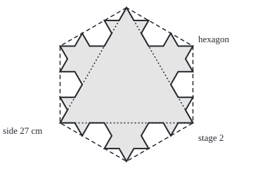
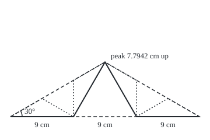

# Fractals: shapes made of smaller copies of themselves, and a dimension that is not a whole number

Geometry and trig → Points, Convexity and Fractals → Copies at every scale → Fractals

---

## General Overview

Cut an equilateral triangle from card, sides 27 cm. On the middle third of each side stand a smaller equilateral triangle pointing outward, and erase its base. The result is a six-pointed star with 12 sides of 9 cm.

Repeat on every side, without end: the **Koch snowflake**, published by Helge von Koch in 1904. The outline grows by four thirds a stage, passing a kilometre at stage 25 and the equator at stage 62. Yet the shape never leaves a hexagon, and its area settles at 505.0660 cm^2.

Each side of the finished snowflake is four copies of itself, a third the size: it is **self-similar**. A square is too, so copies alone do not make a **fractal**: a shape with new detail at every scale, whose dimension is usually not a whole number. The Koch edge's **similarity dimension** is 1.2619, between a line and a surface.

**Magnify a self-similar shape s times and count the N copies of the original inside: its dimension D is the power with s^D = N, a whole number for a square, a fraction for the Koch edge.**

**What kind of fact this is:** the dimension is a definition; the snowflake's finite area and endless perimeter are theorems, proved in Why it works.

### The picture: the snowflake at stage 2, fenced by a hexagon

<p align="center"></p>

Drawn to scale, 1 cm = 7 units, centre at (180, 120). Dotted: the starting triangle. Shaded: stage 2. Dashed: the hexagon through the six points of the stage 1 star.

---

## The formula

Notation first, in words. A shape is magnified $s$ times, and $N$ counts the non-overlapping copies of the original inside the result. The **similarity dimension** $D$ is the power that turns $s$ into $N$.

$$N = s^D \qquad\text{so}\qquad D = \frac{\log N}{\log s}$$

**Read it aloud:** N equals s to the power D, so D is log N over log s.

Magnified 3 times, a segment holds 3 copies ($D$ = 1), a square 9 = 3^2 ($D$ = 2), a cube 27 = 3^3 ($D$ = 3).

One side of the snowflake, magnified 3 times, holds 4 copies of itself: $D$ = log 4 / log 3 = 1.2619. The Sierpinski triangle (join the midpoints of a triangle's sides, remove the middle one of the four small triangles, and repeat on every piece left) magnified 2 times holds 3: $D$ = log 3 / log 2 = 1.5850. Any log base works if top and bottom share it ([logarithms](../../01-Foundations/03-Powers%2C%20Roots%20and%20Logarithms/05-logarithms.md)).

For the snowflake itself, with first side $L$ and stage number $n$:

$$P_n = 3L\left(\tfrac{4}{3}\right)^n, \qquad A_n = A_0\left(\tfrac{8}{5} - \tfrac{3}{5}\left(\tfrac{4}{9}\right)^n\right), \qquad A_0 = \tfrac{\sqrt{3}}{4}L^2$$

**Read it aloud:** the perimeter gains a third each stage; the area's shortfall below eight fifths of the first triangle shrinks by four ninths each stage.

| Symbol | Plain meaning | In our example | Push it up and the answer… |
| --- | --- | --- | --- |
| $s$ | the magnification | 3 (Koch), 2 (Sierpinski) | D falls |
| $N$ | copies inside the magnified shape | 4 (Koch), 3 (Sierpinski) | D rises |
| $D$ | similarity dimension | 1.2619, 1.5850 | — |
| $L$ | side of the first triangle | 27 cm | every length scales with it |
| $n$ | stage: rounds of replacing every side | 0 to 6 | perimeter grows, area creeps up |
| $P_n$ | perimeter at stage n | 81 cm, then 108, 144 … | — |
| $A_0$ | area of the first triangle | 315.6663 cm^2 | final area scales with it |
| $A_n$ | area at stage n | 420.8883 cm^2 at stage 1 | — |

### When it holds

- **Every copy shrunk by the same factor.** Copies of mixed sizes need a sum over the pieces; one log ratio gives the wrong number.
- **No overlaps.** Count a segment as four thirds, one counted twice, and the formula reports 1.2619 for a shape of dimension 1.
- **Exact copies at every scale.** A coastline repeats its pattern only over a range of sizes, so its dimension is measured, not counted.
- **Uniform shrinking.** Copies squashed more one way than the other need other tools.

---

## Why it works

### Step 0: every piece is a copy, so one stage tells the whole story

Each stage does the same thing to every side, a third the size. So the whole snowflake follows from two counts: four new sides for every old one, each a third as long.

### Step 1: the perimeter multiplies by four thirds, without limit

Stage 0 has 3 sides of 27 cm: 81 cm. Four sides a third as long replace each side, so the total becomes four thirds of itself: 108, 144, 192, 256 cm.

Four thirds is more than 1, so the powers pass any length named in advance. For 1 km, 100,000 cm, logs give n > log(100,000/81) / log(4/3), rounded up to 25; the equator, 40075 km, falls at stage 62. The finished edge has no finite length.

### Step 2: the area gains less and less

Stage n adds a small triangle on each of the 3 × 4^(n−1) sides of stage n − 1. Its sides are L/3^n, so its area is $A_0$ / 9^n: shrink lengths by 3^n and areas shrink by 9^n, the square ([similar-triangles-and-scale](../01-Angles%2C%20Triangles%20and%20Congruence/04-similar-triangles-and-scale.md)).

Stage 1 adds a third of the first area, reaching 420.8883 cm^2. Each later stage adds four ninths of the last gain: four times the triangles, each a ninth the size. Induction gives the formula for $A_n$.

<details>
<summary>Detailed proof: the area formula, by induction</summary>

At stage 0 the formula gives $A_0$ × (8/5 − 3/5) = $A_0$.

Stage n adds 3 × 4^(n−1) triangles of area $A_0$ / 9^n, which is $A_0$ × (1/3) × (4/9)^(n−1).

The formula rises from stage n − 1 to n by $A_0$ × (3/5) × (4/9)^(n−1) × (1 − 4/9), the same amount. Right at stage 0 and carried from each stage to the next, it is right at every stage.

</details>

The shortfall below 8/5 × $A_0$ is (3/5) × (4/9)^n × $A_0$, which more than halves every stage and drops below any size named in advance. The area settles at 8/5 × 315.6663 = 505.0660 cm^2.

### Step 3: a fence that no stage crosses

Over each side draw its **cap**: a flat triangle on the side, with 30° angles at both ends. Its height is the side times √3/6: 7.7942 cm for 27 cm. The first bump rises exactly that high, so its peak is the cap's peak.

<p align="center"></p>

Drawn to scale, 1 cm = 12 units, so the cap is 93.53 units high. Dashed: the cap. Solid: the side after stage 1. Dotted: the caps over its four new sides.

The four small caps sit inside the big one: two share its 30° corners, two have their peaks on its slopes. Each later stage stays inside the small caps, whose own caps sit inside them, and so on down.

The triangle plus its three caps is a regular hexagon. Each cap holds a third of the triangle's area, so the hexagon holds 631.3325 cm^2, and no stage passes that. In the code, none of stage 6's 12288 corners reaches past the hexagon's sides, 13.5000 cm from the centre.

### Step 4: why the power, and why it is not a whole number

Measure one side at stage n in pieces of length L/3^n: there are 4^n. Add up each piece's size raised to a power d: 4^n × (L/3^n)^d. With d = 1 that is length, L × (4/3)^n, which grows without end. With d = 2 it is L^2 × (4/9)^n, an area, which shrinks toward nothing: the edge itself covers no area.

Only one power keeps the total steady: the d with 4 × (1/3)^d = 1, so four new pieces weigh what the old one did. That is 3^d = 4, the formula's s^D = N, and d = 1.2619.

The Sierpinski triangle is the same count with 3 copies at half size. Stage 6 has 729 triangles holding 0.1780 of the first area; the endless limit has none, yet at dimension 1.5850 it is more than a curve.

<details>
<summary>Similarity dimension and the other dimensions</summary>

The **Hausdorff dimension** makes Step 4 exact, covering a set with small pieces of any shape. Moran (1946) and Hutchinson (1981) proved it equals log N / log s when copies overlap at most along edges; the proof needs measure theory.

</details>

A second road ignores the construction: lay grids of shrinking squares over the shape and count the squares it touches. The count grows like (1/size)^D, so the slope of log count against log(1/size) estimates D. On stage 6 the code gets 1.2466; the grid does not line up with the copies, so this is an estimate.

---

## Worked numbers, by hand

| Step | Arithmetic | Value |
| --- | --- | --- |
| starting area | √3/4 × 27 × 27 | 315.6663 cm^2 |
| stage 1 | 12 sides of 9 cm; area plus a third | 108 cm, 420.8883 cm^2 |
| the fence | 2 × 315.6663 | 631.3325 cm^2 |
| the snowflake's area | 8/5 × 315.6663 | **505.0660 cm^2** |
| stage passing 1 km | log(100,000/81) / log(4/3), rounded up | **25** |
| Koch edge dimension | log 4 / log 3 | **1.2619** |
| Sierpinski dimension | log 3 / log 2 | **1.5850** |

### What breaks if you drop a piece

| Mistake | Comes out at | What went wrong |
| --- | --- | --- |
| Ratio flipped: log 3 / log 4 | 0.7925 | Below 1, for an unbroken curve |
| Growth factor as the magnification: log 4 / log(4/3) | 4.8188 | Above 3, more than solid space; s is 3 |
| Each stage's gain 4/3 of the last, not 4/9 | stage 10: 5605.52 cm^2, not 505.01 | Length factor used for area |

The code prints all three.

---

## Code, from first principles, and it actually runs

The script builds each stage as a list of corners and takes two roads to each claim. Perimeter: distances round the corners, against 81 × (4/3)^n. Area: the shoelace formula ([polygon-area-and-orientation](01-polygon-area-and-orientation.md)), against the closed form. Stage counts: stepping, against logs. Dimension: log 4 / log 3, against a box count. The fence is a dot-product test on stage 6. Only `math` is imported.

### Python

```python
# Koch snowflake and fractal dimension -- the check behind the card.  Only
# math is imported, for sqrt, hypot and log.  A 27 cm equilateral triangle;
# each stage swaps every side's middle third for two sides of an outward bump.
# Perimeter, area and dimension are each reached by two separate roads.
import math
S3, SIDE = math.sqrt(3), 27.0
R, A0 = SIDE / S3, S3 / 4 * SIDE * SIDE      # centre-to-corner distance, first area

def koch(poly):                              # one stage: every side becomes four
    out = []
    for i, (px, py) in enumerate(poly):
        qx, qy = poly[(i + 1) % len(poly)]
        dx, dy = (qx - px) / 3, (qy - py) / 3
        ax, ay = px + dx, py + dy            # apex: the middle third turned 60 degrees out
        out += [(px, py), (ax, ay), (ax + dx / 2 + dy * S3 / 2, ay - dx * S3 / 2 + dy / 2), (ax + dx, ay + dy)]
    return out

def shoelace(p):                             # road one to the area
    return sum(p[i - 1][0] * p[i][1] - p[i][0] * p[i - 1][1] for i in range(len(p))) / 2

def walk(p):                                 # road one to the perimeter
    return sum(math.hypot(p[i][0] - p[i - 1][0], p[i][1] - p[i - 1][1]) for i in range(len(p)))

stages = [[(0.0, R), (-SIDE / 2, -R / 2), (SIDE / 2, -R / 2)]]
for n in range(6):
    stages.append(koch(stages[-1]))
print(f"side 27 cm; first area {A0:.4f} cm^2; the snowflake's area {1.6 * A0:.4f}; hexagon {2 * A0:.4f}")
print("stage, sides, perimeter walked / 81 x (4/3)^n, area by shoelace / by formula (cm, cm^2)")
for n, p in enumerate(stages[:6]):
    per, area, formula = walk(p), shoelace(p), A0 * (1.6 - 0.6 * (4 / 9) ** n)
    print(f"{n}, {len(p)}, {per:.4f} / {81 * (4 / 3) ** n:.4f}, {area:.4f} / {formula:.4f}")
    assert abs(per - 81 * (4 / 3) ** n) < 1e-9 * per and abs(area - formula) < 1e-9 * area  # two roads each
normals = ((1.0, 0.0), (0.5, S3 / 2), (-0.5, S3 / 2))     # the hexagon's sides face these ways, and back
reach = max(abs(x * c + y * s) for x, y in stages[6] for c, s in normals)
print(f"stage 6: {len(stages[6])} sides; farthest reach toward a hexagon side {reach:.4f} cm, apothem {R * S3 / 2:.4f}")
assert reach <= R * S3 / 2 + 1e-9                             # never leaves the hexagon
for km in (1, 40075):                                         # 1 km, then the equator
    goal, n, per = km * 1e5, 0, 81.0
    while per <= goal:
        n, per = n + 1, per * 4 / 3
    by_log = math.ceil(math.log(goal / 81) / math.log(4 / 3))
    print(f"perimeter first passes {km} km at stage {n} by stepping, {by_log} by logs")
    assert n == by_log
dims = [(nm, math.log(N) / math.log(s)) for nm, N, s in (("line", 3, 3), ("square", 9, 3), ("Koch", 4, 3), ("Sierpinski", 3, 2))]
print("log N / log s: " + ", ".join(f"{nm} {d:.4f}" for nm, d in dims))
counts = [len({(math.floor(x / (SIDE / 3 ** k)), math.floor(y / (SIDE / 3 ** k))) for x, y in stages[6]}) for k in (2, 3, 4)]
slope = math.log(counts[2] / counts[0]) / math.log(9)
print(f"boxes of 3, 1, 1/3 cm touching stage 6: {counts}; slope log(count) per log(1/size) {slope:.4f}")
assert abs(slope - dims[2][1]) < 0.05                        # box count agrees with log 4 / log 3
print(f"figure, 1 cm = 7 units, centre (180, 120): corners (180, {120 - 7 * R:.2f}), ({180 - 7 * SIDE / 2:.2f}, "
      f"{120 + 3.5 * R:.2f}), ({180 + 7 * SIDE / 2:.2f}, {120 + 3.5 * R:.2f}); lowest tip y {120 + 7 * R:.2f}; cap {SIDE * S3 / 6:.4f} cm = {12 * SIDE * S3 / 6:.2f} units")
print(f"Sierpinski stage 6: {3 ** 6} triangles, {(3 / 4) ** 6:.4f} of the area left")
print(f"mistakes: log 3 / log 4 = {math.log(3) / math.log(4):.4f}; log 4 / log(4/3) = {math.log(4) / math.log(4 / 3):.4f};"
      f" stage 10 area with 4/3 for 4/9 = {A0 * (4 / 3) ** 10:.2f}, true {A0 * (1.6 - 0.6 * (4 / 9) ** 10):.2f}")
print("ALL CHECKS PASS")
```

**Ran 2026-09-24 on macOS, Python 3.14.6, standard library only. All checks passed. Output, pasted from the run:**

```
side 27 cm; first area 315.6663 cm^2; the snowflake's area 505.0660; hexagon 631.3325
stage, sides, perimeter walked / 81 x (4/3)^n, area by shoelace / by formula (cm, cm^2)
0, 3, 81.0000 / 81.0000, 315.6663 / 315.6663
1, 12, 108.0000 / 108.0000, 420.8883 / 420.8883
2, 48, 144.0000 / 144.0000, 467.6537 / 467.6537
3, 192, 192.0000 / 192.0000, 488.4383 / 488.4383
4, 768, 256.0000 / 256.0000, 497.6759 / 497.6759
5, 3072, 341.3333 / 341.3333, 501.7815 / 501.7815
stage 6: 12288 sides; farthest reach toward a hexagon side 13.5000 cm, apothem 13.5000
perimeter first passes 1 km at stage 25 by stepping, 25 by logs
perimeter first passes 40075 km at stage 62 by stepping, 62 by logs
log N / log s: line 1.0000, square 2.0000, Koch 1.2619, Sierpinski 1.5850
boxes of 3, 1, 1/3 cm touching stage 6: [57, 238, 882]; slope log(count) per log(1/size) 1.2466
figure, 1 cm = 7 units, centre (180, 120): corners (180, 10.88), (85.50, 174.56), (274.50, 174.56); lowest tip y 229.12; cap 7.7942 cm = 93.53 units
Sierpinski stage 6: 729 triangles, 0.1780 of the area left
mistakes: log 3 / log 4 = 0.7925; log 4 / log(4/3) = 4.8188; stage 10 area with 4/3 for 4/9 = 5605.52, true 505.01
ALL CHECKS PASS
```

### Rust

Same numbers, same labels, built with `rustc --edition 2021 -O`.

```rust
// Koch snowflake and fractal dimension -- the same check as the Python, in
// Rust.  No crates.  A 27 cm equilateral triangle; each stage swaps every
// side's middle third for two sides of an outward bump.  Perimeter, area and
// dimension are each reached by two separate roads.
use std::collections::HashSet;
type Poly = Vec<(f64, f64)>;

fn koch(poly: &Poly, s3: f64) -> Poly {          // one stage: every side becomes four
    let mut out = Vec::new();
    for i in 0..poly.len() {
        let ((px, py), (qx, qy)) = (poly[i], poly[(i + 1) % poly.len()]);
        let (dx, dy) = ((qx - px) / 3.0, (qy - py) / 3.0);
        let (ax, ay) = (px + dx, py + dy);       // apex: the middle third turned 60 degrees out
        out.extend([(px, py), (ax, ay), (ax + dx / 2.0 + dy * s3 / 2.0, ay - dx * s3 / 2.0 + dy / 2.0), (ax + dx, ay + dy)]);
    }
    out
}

fn prev(p: &Poly, i: usize) -> (f64, f64) { p[(i + p.len() - 1) % p.len()] }

fn shoelace(p: &Poly) -> f64 {                   // road one to the area
    (0..p.len()).map(|i| prev(p, i).0 * p[i].1 - p[i].0 * prev(p, i).1).sum::<f64>() / 2.0
}

fn walk(p: &Poly) -> f64 {                       // road one to the perimeter
    (0..p.len()).map(|i| (p[i].0 - prev(p, i).0).hypot(p[i].1 - prev(p, i).1)).sum()
}

fn main() {
    let (s3, side) = (3f64.sqrt(), 27.0);
    let (r, a0) = (side / s3, s3 / 4.0 * side * side);
    let mut stages: Vec<Poly> = vec![vec![(0.0, r), (-side / 2.0, -r / 2.0), (side / 2.0, -r / 2.0)]];
    for _ in 0..6 { let next = koch(stages.last().unwrap(), s3); stages.push(next) }
    println!("side 27 cm; first area {:.4} cm^2; the snowflake's area {:.4}; hexagon {:.4}", a0, 1.6 * a0, 2.0 * a0);
    println!("stage, sides, perimeter walked / 81 x (4/3)^n, area by shoelace / by formula (cm, cm^2)");
    for n in 0..6 {
        let p = &stages[n];
        let (per, area) = (walk(p), shoelace(p));
        let (grow, formula) = (81.0 * (4.0f64 / 3.0).powi(n as i32), a0 * (1.6 - 0.6 * (4.0f64 / 9.0).powi(n as i32)));
        println!("{}, {}, {:.4} / {:.4}, {:.4} / {:.4}", n, p.len(), per, grow, area, formula);
        assert!((per - grow).abs() < 1e-9 * per && (area - formula).abs() < 1e-9 * area); // two roads each
    }
    let normals = [(1.0, 0.0), (0.5, s3 / 2.0), (-0.5, s3 / 2.0)]; // the hexagon's sides face these ways, and back
    let reach = stages[6].iter().flat_map(|&(x, y)| normals.iter().map(move |&(c, s)| (x * c + y * s).abs())).fold(0.0, f64::max);
    println!("stage 6: {} sides; farthest reach toward a hexagon side {:.4} cm, apothem {:.4}", stages[6].len(), reach, r * s3 / 2.0);
    assert!(reach <= r * s3 / 2.0 + 1e-9);                         // never leaves the hexagon
    for km in [1u64, 40075] {                                        // 1 km, then the equator
        let (goal, mut n, mut per) = (km as f64 * 1e5, 0, 81.0);
        while per <= goal { n += 1; per = per * 4.0 / 3.0 }
        let by_log = ((goal / 81.0).ln() / (4.0f64 / 3.0).ln()).ceil() as i32;
        println!("perimeter first passes {} km at stage {} by stepping, {} by logs", km, n, by_log);
        assert!(n == by_log);
    }
    let dims: Vec<(&str, f64)> = [("line", 3.0f64, 3.0f64), ("square", 9.0, 3.0), ("Koch", 4.0, 3.0), ("Sierpinski", 3.0, 2.0)]
        .iter().map(|&(nm, big_n, s)| (nm, big_n.ln() / s.ln())).collect();
    let shown: Vec<String> = dims.iter().map(|(nm, d)| format!("{} {:.4}", nm, d)).collect();
    println!("log N / log s: {}", shown.join(", "));
    let counts: Vec<usize> = [2, 3, 4].iter().map(|&k| {
        let size = side / 3f64.powi(k);
        stages[6].iter().map(|&(x, y)| ((x / size).floor() as i64, (y / size).floor() as i64)).collect::<HashSet<_>>().len()
    }).collect();
    let slope = (counts[2] as f64 / counts[0] as f64).ln() / 9f64.ln();
    println!("boxes of 3, 1, 1/3 cm touching stage 6: {:?}; slope log(count) per log(1/size) {:.4}", counts, slope);
    assert!((slope - dims[2].1).abs() < 0.05);                     // box count agrees with log 4 / log 3
    println!("figure, 1 cm = 7 units, centre (180, 120): corners (180, {:.2}), ({:.2}, {:.2}), ({:.2}, {:.2}); lowest tip y {:.2}; cap {:.4} cm = {:.2} units",
             120.0 - 7.0 * r, 180.0 - 7.0 * side / 2.0, 120.0 + 3.5 * r, 180.0 + 7.0 * side / 2.0, 120.0 + 3.5 * r, 120.0 + 7.0 * r, side * s3 / 6.0, 12.0 * side * s3 / 6.0);
    println!("Sierpinski stage 6: {} triangles, {:.4} of the area left", 3i64.pow(6), 0.75f64.powi(6));
    println!("mistakes: log 3 / log 4 = {:.4}; log 4 / log(4/3) = {:.4}; stage 10 area with 4/3 for 4/9 = {:.2}, true {:.2}",
             3f64.ln() / 4f64.ln(), 4f64.ln() / (4.0f64 / 3.0).ln(), a0 * (4.0f64 / 3.0).powi(10), a0 * (1.6 - 0.6 * (4.0f64 / 9.0).powi(10)));
    println!("ALL CHECKS PASS");
}
```

**Ran 2026-09-24 on macOS, rustc 1.98.1, no crates. All checks passed. Output, pasted from the run:**

```
side 27 cm; first area 315.6663 cm^2; the snowflake's area 505.0660; hexagon 631.3325
stage, sides, perimeter walked / 81 x (4/3)^n, area by shoelace / by formula (cm, cm^2)
0, 3, 81.0000 / 81.0000, 315.6663 / 315.6663
1, 12, 108.0000 / 108.0000, 420.8883 / 420.8883
2, 48, 144.0000 / 144.0000, 467.6537 / 467.6537
3, 192, 192.0000 / 192.0000, 488.4383 / 488.4383
4, 768, 256.0000 / 256.0000, 497.6759 / 497.6759
5, 3072, 341.3333 / 341.3333, 501.7815 / 501.7815
stage 6: 12288 sides; farthest reach toward a hexagon side 13.5000 cm, apothem 13.5000
perimeter first passes 1 km at stage 25 by stepping, 25 by logs
perimeter first passes 40075 km at stage 62 by stepping, 62 by logs
log N / log s: line 1.0000, square 2.0000, Koch 1.2619, Sierpinski 1.5850
boxes of 3, 1, 1/3 cm touching stage 6: [57, 238, 882]; slope log(count) per log(1/size) 1.2466
figure, 1 cm = 7 units, centre (180, 120): corners (180, 10.88), (85.50, 174.56), (274.50, 174.56); lowest tip y 229.12; cap 7.7942 cm = 93.53 units
Sierpinski stage 6: 729 triangles, 0.1780 of the area left
mistakes: log 3 / log 4 = 0.7925; log 4 / log(4/3) = 4.8188; stage 10 area with 4/3 for 4/9 = 5605.52, true 505.01
ALL CHECKS PASS
```

The two outputs match line for line.

> [!TIP]
> **Try changing**
> Guess first, then run it.
> - **Bumps turned inward.** Swap the signs of the two `S3 / 2` terms in the apex line. The perimeter is unchanged; the area falls below the first triangle's and the assert stops the run.
> - **Two stages as one.** Replace `("Koch", 4, 3)` by `("Koch", 16, 9)`: magnify 9 times and 16 copies fit. Still 1.2619, since 16 = 4^2 and 9 = 3^2.

---

## The usual mistake

> [!warning]
> **Endless perimeter does not mean endless area.** The outline grows by four thirds a stage, but each stage's added area is four ninths of the last, since areas shrink by the square of the length factor. The snowflake stays inside a 631.3325 cm^2 hexagon.
>
> - **Flipping the ratio.** log 3 / log 4 = 0.7925 puts an unbroken curve below dimension 1. The copy count goes on top.
> - **The growth factor as the magnification.** Length grows by 4/3 a stage, but the copies are a third the size: s = 3, else D = 4.8188.
> - **A finite stage as the fractal.** Stage 6 of the Sierpinski triangle still holds 0.1780 of the area; only the endless limit has none.

---

## Where you meet it in real life

- **Coastlines.** Measured with shorter rulers, a rocky coast keeps getting longer. Benoit Mandelbrot's 1967 paper read a dimension between 1 and 2 off that growth.
- **Image analysis.** Box counting gives one number for how rough a boundary is: cell outlines, cracks, porous rock.
- **Inside or outside.** The fence test is the convex case of [point-in-polygon-and-segment-tests](03-point-in-polygon-and-segment-tests.md); the hexagon is convex in the sense of [convex-sets-and-convex-hulls](02-convex-sets-and-convex-hulls.md).

> **Say it back**
> The Koch snowflake replaces every side with four sides a third as long, for ever. Its perimeter multiplies by four thirds a stage and passes any length. Its area gains four ninths of the last gain, stays inside a hexagon and settles at eight fifths of the first triangle. A self-similar shape magnified s times holds N copies of itself, and its dimension D solves s^D = N. For the Koch edge that is 1.2619: more than a line, less than a surface.

---

## What this builds on

- [polygon-area-and-orientation](01-polygon-area-and-orientation.md): the shoelace formula that measures each stage's area from its corners.
- [logarithms](../../01-Foundations/03-Powers%2C%20Roots%20and%20Logarithms/05-logarithms.md): solving s^D = N for the power, and finding the stage that passes a given length.

## Where this goes next

- standard-examples-and-counterexamples: shapes like the Koch curve as test cases for what "curve" and "connected" mean.

This card counted copies of a shape defined by an endless process; what the finished shape is as a set of points, and in what sense the stages approach it, is what topology answers.

---

## Sources

Verified 24 Sep 2026: every link below resolves to the publisher's page.

- Hutchinson, John E. "Fractals and Self-Similarity." *Indiana University Mathematics Journal* 30 (1981), 713–747. [Journal page](https://doi.org/10.1512/iumj.1981.30.30055). The similarity dimension, and when it equals the Hausdorff dimension.
- Falconer, Kenneth. *Fractal Geometry: Mathematical Foundations and Applications*, 3rd ed. Wiley, 2014. [Publisher page](https://www.wiley.com/en-us/Fractal+Geometry%3A+Mathematical+Foundations+and+Applications%2C+3rd+Edition-p-9781119942399). The Koch curve and box counting.
- Mandelbrot, Benoit. "How Long Is the Coast of Britain? Statistical Self-Similarity and Fractional Dimension." *Science* 156 (1967), 636–638. [Journal page](https://doi.org/10.1126/science.156.3775.636). Coastline length against ruler size.
- O'Connor, J. J., and E. F. Robertson. "Niels Fabian Helge von Koch." MacTutor Archive, University of St Andrews. [Biography](https://mathshistory.st-andrews.ac.uk/Biographies/Koch/). The 1904 paper that built the curve.
