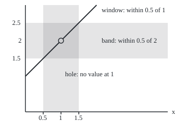

# Limits: the value a function is heading for, and the promise that makes 'heading for' precise

Calculus and analysis → Limits and Continuity → Heading for a value → Limits

---

## General Overview

Take the fraction (x squared minus 1) over (x minus 1). At x = 0.9 it gives 1.9; at 1.1, 2.1; at 0.999, 1.999; at 1.001, 2.001. From both sides the answers crowd towards 2.

At x = 1 the fraction breaks: top and bottom are both 0, and 0 divided by 0 has no value. The rule has a hole exactly where its outputs point.

A **limit** names the value the outputs head for, without asking what happens at the point. "Heading for" is a metaphor; the card replaces it with a promise that can be checked. Name a tolerance on the output, say 0.001. Then find a distance on the input, here also 0.001, that keeps every x that close to 1, other than 1 itself, within 0.001 of 2. A limit is that promise kept for every tolerance, however small.

**A function has limit L at a point when, for every output tolerance, some input distance keeps all nearby inputs (the point itself excluded) within that tolerance of L.**

**What kind of fact this is:** a definition; the claim that this fraction heads for 2 is then proved from it in Why it works.

### The picture: a line with a hole, a band and a window

<p align="center"></p>

Drawn to scale, 70 px per unit on both axes. At tolerance 0.5 the window is 0.5 wide on each side, and the line crosses the doubly shaded square corner to corner. The picture illustrates; Why it works proves.

---

## The formula

Notation first, in words: $\lim_{x \to a} f(x) = L$ is read "f(x) heads for L as x heads for a". The arrow means "approaches".

$$\lim_{x \to 1} \frac{x^2 - 1}{x - 1} = 2$$

**Read it aloud:** as x heads for 1, the fraction heads for 2.

The promise behind it, at tolerance 0.001:

$$0 < \lvert x - 1\rvert < 0.001 \implies \left\lvert \frac{x^2 - 1}{x - 1} - 2 \right\rvert < 0.001$$

**Read it aloud:** if x is within 0.001 of 1 but not 1, the fraction is within 0.001 of 2. The bars measure distance on either side. The line holds with any positive number in place of both copies of 0.001; that "any" is the whole content of the limit.

| Symbol | Plain meaning | In our example | Push it up and the answer… |
| --- | --- | --- | --- |
| $f$, $g$ | the rule; $g$ is it with a value patched in at 1 | the fraction; $g(1)$ = 100 | a patch leaves the limit alone |
| $x$ | an input near the point | 0.999, 1.001 | moves along the line x + 1 |
| $a$ | the input being approached | 1 | examines the rule somewhere else |
| $L$ | the value the outputs head for | 2 | a wrong L fails at small tolerances |
| $\lim_{x \to a} f(x)$ | the limit itself | 2 | — |
| $\lvert x - a\rvert$ | input distance from the point | at most 0.001 | wider lets in worse outputs |
| $\lvert f(x) - L\rvert$ | output miss from the limit | under 0.001 | looser allows a wider window |
| $m$ | slope of a line, in Step 4 | 3 | the window shrinks to tolerance ÷ slope |

### When it holds

A definition holds by agreement; three conditions are built in.

- **The point is excluded.** Only inputs with $0 < \lvert x - a\rvert$ are tested. Without that, the fraction could never have a limit at 1.
- **Inputs exist arbitrarily close to the point.** With none near a, nothing is tested and any L would pass.
- **Tolerance first, then distance.** The distance may depend on the tolerance, not on which x is tested: one distance serves every x inside it.

---

## Why it works

### Step 0: only nearby values count

The limit never looks at x = 1, only at inputs near it, so a rule can have a limit where it has no value.

### Step 1: the fraction is a line with one point missing

Divide x^2 − 1 by x − 1 ([polynomial-division](../../03-Algebra/02-Polynomials/04-polynomial-division.md)): x^2 − 1 = (x − 1)(x + 1). For any x other than 1, the factor x − 1 is not zero and cancels:

$$\frac{x^2 - 1}{x - 1} = x + 1 \quad \text{for } x \ne 1$$

At x = 1 cancelling would divide by zero. The fraction is the line x + 1 with the point (1, 2) punched out.

### Step 2: the miss equals the distance

Subtract the candidate limit 2:

$$\lvert f(x) - 2\rvert = \lvert (x + 1) - 2\rvert = \lvert x - 1\rvert$$

The output misses 2 by exactly as much as the input misses 1, for every x other than 1.

### Step 3: answer every tolerance

Name a tolerance, 0.001. Choose the input distance 0.001. Any x with 0 < |x − 1| < 0.001 then has |f(x) − 2| = |x − 1| < 0.001. The same move answers every tolerance, named or not: that makes it a proof, and the overview's table only evidence. Any smaller distance also works; the definition asks for one, not the widest.

### Step 4: a steeper line needs a narrower window

The line 3x − 1 also passes through (1, 2) and heads for 2 at 1. Its miss is |3x − 1 − 2| = 3|x − 1|, three times the input distance. To land within 0.001 of 2, stay within 0.001 ÷ 3 ≈ 0.000333 of 1. Reusing the distance 0.001 fails: x = 1.0009 lands 0.0027 from 2.

For any straight line with slope $m$ (not zero), the answer to a tolerance is tolerance ÷ |m|: the promise for the linear case.

### Step 5: a patched value and a jump

Fill the hole with the value 100 and call the result $g$: $g(1)$ = 100. The promise never tests x = 1, so $g$ keeps limit 2, with distance 0.001 at tolerance 0.001. When value and limit agree, the rule is continuous there ([continuity](05-continuity.md)).

A jump is different. Take the rule giving 0 for x below 1 and 1 from 1 upwards. Every window around 1 holds outputs 0 and 1. No single L sits within 0.25 of both, so at tolerance 0.25 no window works: no limit. The best candidate, L = 0.5, still misses by 0.5. From the left alone the rule heads for 0, from the right for 1; these one-sided limits exist but disagree.

<details>
<summary>Detailed proof: the definition in symbols, the linear case, and why a limit is unique</summary>

**The definition.** Write the Greek letter epsilon, $\varepsilon > 0$, for the output tolerance and delta, $\delta > 0$, for the input distance. Then $\lim_{x \to a} f(x) = L$ means: for every $\varepsilon > 0$ there is a $\delta > 0$ such that every input x of f with $0 < \lvert x - a\rvert < \delta$ satisfies $\lvert f(x) - L\rvert < \varepsilon$. Every positive distance around a must contain inputs of f other than a.

**Any line.** Let the rule be mx + c, slope $m \ne 0$, constant c; its candidate limit at a is ma + c. Given $\varepsilon > 0$, take $\delta = \varepsilon / \lvert m\rvert$. For $0 < \lvert x - a\rvert < \delta$, the miss is $\lvert m\rvert \cdot \lvert x - a\rvert < \varepsilon$. With m = 1, c = 1, a = 1 this is the fraction off its hole (Step 3); with m = 3, c = −1 it is Step 4.

**Uniqueness.** Suppose f heads for L and for a different value K. Take $\varepsilon$ as half the gap between them. Inside the smaller of the two distances pick an input x other than a. Then f(x) is within half the gap of L and within half the gap of K. The gap is at most the sum of those two misses, so the gap is less than itself: impossible. The jump fails for a like reason: every window holds outputs 0 and 1, and no L is less than 0.5 from both.

</details>

A second road feeds in a list of inputs marching to 1, such as 0.9, 0.99, 0.999, and asks where the outputs go; [sequences-and-limits](03-sequences-and-limits.md) builds it.

---

## Worked numbers, by hand

| Step | Arithmetic | Value |
| --- | --- | --- |
| just below 1 | −0.001999 ÷ −0.001 | 1.999 |
| just above 1 | 0.002001 ÷ 0.001 | 2.001 |
| at 1 | (1 − 1) ÷ (1 − 1) | 0 ÷ 0, no value |
| cancel, x ≠ 1 | (x − 1)(x + 1) ÷ (x − 1) | x + 1 |
| the miss from 2 | (x + 1) − 2 | x − 1 |
| tolerance 0.001 | miss = distance, so distance 0.001 | **limit 2** |

Every input within 0.001 of 1, except 1, lands within 0.001 of 2; likewise for any tolerance.

### What breaks if you drop a piece

| Mistake | Comes out at | What went wrong |
| --- | --- | --- |
| Substitute x = 1 | 0 ÷ 0 | the limit never uses the point |
| Read the limit off a patched value | 100, not 2 | one point says nothing about its neighbours |
| Distance 0.001 for 3x − 1, tolerance 0.001 | x = 1.0009 misses by 0.0027 | slope 3 triples the miss; use 0.000333 |
| Claim a limit for the jump | best miss 0.5, at L = 0.5 | the sides head for 0 and 1 |

The code prints all four.

---

## Code, from first principles, and it actually runs

Nothing is imported. Road one evaluates the fraction near 1; road two the cancelled form x + 1. A third road ignores the proof: a bisection search (halve an interval sixty times, keeping the half holding the answer) finds the widest distance whose 400 sampled inputs all land within the tolerance. The asserts check it matches Steps 3 and 4, and that the jump defeats tolerance 0.25.

### Python

```python
# Limits -- the check behind the card.  Nothing is imported.
# f(x) = (x^2 - 1)/(x - 1) has no value at x = 1.  Road one works the original
# fraction; road two the cancelled form x + 1.  A bisection search then finds,
# by brute force over a window of sampled inputs, the widest distance from 1
# that keeps every output within a tolerance of the limit; the card's proof
# says that distance equals the tolerance for f, and a third of it for 3x - 1.
def f(x): return (x * x - 1) / (x - 1)       # the original fraction, x != 1
def line(x): return x + 1                    # the cancelled form
def steep(x): return 3 * x - 1               # a second straight line through (1, 2)
def jump(x): return 0.0 if x < 1 else 1.0    # a rule that jumps at 1

def worst(rule, L, r, n=200):                # biggest miss from L, 0 < |x - 1| <= r
    return max(abs(rule(1 + s * r * k / n) - L) for k in range(1, n + 1) for s in (-1, 1))

def radius(rule, L, t):                      # bisection: widest window whose misses stay under t
    lo, hi = 0.0, 1.0
    for _ in range(60):
        mid = (lo + hi) / 2
        if worst(rule, L, mid) < t: lo = mid
        else: hi = mid
    return lo

xs = [0.9, 0.99, 0.999, 1.001, 1.01, 1.1]
for x in xs:
    print(f"x = {x:.3f}: top {x * x - 1:.6f} / bottom {x - 1:.6f} = {f(x):.6f}; x + 1 = {line(x):.6f}")
print(f"x = 1: top {1 * 1 - 1}, bottom {1 - 1}, no value; cancelled form gives {line(1.0):.6f}")
found = {}
for t in (0.1, 0.01, 0.001):
    found[t] = (radius(f, 2, t), radius(steep, 2, t))
    print(f"tolerance {t:.3f}: widest distance for f {found[t][0]:.6f}, for 3x - 1 {found[t][1]:.6f}")
x = 1.0009
print(f"distance 0.001 used for 3x - 1: x = {x:.4f} misses 2 by {abs(steep(x) - 2):.6f}")
print("patched rule, value 100 at x = 1: widest distance at tolerance 0.001 "
      f"{radius(lambda u: 100.0 if u == 1 else f(u), 2, 0.001):.6f}")
best = min((worst(jump, -1 + i / 1000, 0.001), -1 + i / 1000) for i in range(3001))
print(f"jump at 1: best candidate {best[1]:.3f}, smallest possible miss {best[0]:.6f}, over tolerance 0.25")
r = radius(f, 2, 0.5)
X, Y = (lambda u: 50 + 70 * u), (lambda v: 220 - 70 * v)
print(f"figure, 70 px per unit, tolerance 0.5, distance {r:.3f}: hole ({X(1):.0f}, {Y(2):.0f}); line ({X(0):.0f}, {Y(1):.0f}) "
      f"to ({X(2):.0f}, {Y(3):.0f}); band y {Y(2.5):.0f} to {Y(1.5):.0f}; window x {X(1 - r):.0f} to {X(1 + r):.0f}")
assert all(abs(f(x) - line(x)) < 1e-9 for x in xs)                  # two roads agree
assert all(abs(found[t][0] - t) < 1e-6 * t for t in found)          # search matches: distance = tolerance
assert all(abs(found[t][1] - t / 3) < 1e-6 * t for t in found)      # search matches: tolerance / slope
assert abs(best[0] - 0.5) < 1e-9 and best[0] > 0.25                 # the jump defeats tolerance 0.25
print("ALL CHECKS PASS")
```

**Ran 2026-09-27 on macOS, Python 3.14.6, standard library only. All checks passed. Output, pasted from the run:**

```
x = 0.900: top -0.190000 / bottom -0.100000 = 1.900000; x + 1 = 1.900000
x = 0.990: top -0.019900 / bottom -0.010000 = 1.990000; x + 1 = 1.990000
x = 0.999: top -0.001999 / bottom -0.001000 = 1.999000; x + 1 = 1.999000
x = 1.001: top 0.002001 / bottom 0.001000 = 2.001000; x + 1 = 2.001000
x = 1.010: top 0.020100 / bottom 0.010000 = 2.010000; x + 1 = 2.010000
x = 1.100: top 0.210000 / bottom 0.100000 = 2.100000; x + 1 = 2.100000
x = 1: top 0, bottom 0, no value; cancelled form gives 2.000000
tolerance 0.100: widest distance for f 0.100000, for 3x - 1 0.033333
tolerance 0.010: widest distance for f 0.010000, for 3x - 1 0.003333
tolerance 0.001: widest distance for f 0.001000, for 3x - 1 0.000333
distance 0.001 used for 3x - 1: x = 1.0009 misses 2 by 0.002700
patched rule, value 100 at x = 1: widest distance at tolerance 0.001 0.001000
jump at 1: best candidate 0.500, smallest possible miss 0.500000, over tolerance 0.25
figure, 70 px per unit, tolerance 0.5, distance 0.500: hole (120, 80); line (50, 150) to (190, 10); band y 45 to 115; window x 85 to 155
ALL CHECKS PASS
```

### Rust

```rust
// Limits -- the check behind the card.  Rust std only, no crates.
// f(x) = (x^2 - 1)/(x - 1) has no value at x = 1.  Road one works the original
// fraction; road two the cancelled form x + 1.  A bisection search then finds,
// by brute force over a window of sampled inputs, the widest distance from 1
// that keeps every output within a tolerance of the limit; the card's proof
// says that distance equals the tolerance for f, and a third of it for 3x - 1.
fn f(x: f64) -> f64 { (x * x - 1.0) / (x - 1.0) }        // the original fraction, x != 1
fn line(x: f64) -> f64 { x + 1.0 }                      // the cancelled form
fn steep(x: f64) -> f64 { 3.0 * x - 1.0 }               // a second straight line through (1, 2)
fn jump(x: f64) -> f64 { if x < 1.0 { 0.0 } else { 1.0 } } // a rule that jumps at 1
fn patched(x: f64) -> f64 { if x == 1.0 { 100.0 } else { f(x) } }

fn worst(rule: fn(f64) -> f64, l: f64, r: f64) -> f64 { // biggest miss from l, 0 < |x - 1| <= r
    let n = 200;
    let mut m: f64 = 0.0;
    for k in 1..=n {
        for s in [-1.0, 1.0] {
            m = m.max((rule(1.0 + s * r * (k as f64) / (n as f64)) - l).abs());
        }
    }
    m
}

fn radius(rule: fn(f64) -> f64, l: f64, t: f64) -> f64 { // bisection: widest window under t
    let (mut lo, mut hi) = (0.0, 1.0);
    for _ in 0..60 {
        let mid = (lo + hi) / 2.0;
        if worst(rule, l, mid) < t { lo = mid } else { hi = mid }
    }
    lo
}

fn main() {
    let xs = [0.9, 0.99, 0.999, 1.001, 1.01, 1.1];
    for &x in xs.iter() {
        println!("x = {:.3}: top {:.6} / bottom {:.6} = {:.6}; x + 1 = {:.6}", x, x * x - 1.0, x - 1.0, f(x), line(x));
    }
    println!("x = 1: top {}, bottom {}, no value; cancelled form gives {:.6}", 1 * 1 - 1, 1 - 1, line(1.0));
    let ts = [0.1, 0.01, 0.001];
    let mut found = Vec::new();
    for &t in ts.iter() {
        let pair = (radius(f, 2.0, t), radius(steep, 2.0, t));
        println!("tolerance {:.3}: widest distance for f {:.6}, for 3x - 1 {:.6}", t, pair.0, pair.1);
        found.push((t, pair));
    }
    let x = 1.0009;
    println!("distance 0.001 used for 3x - 1: x = {:.4} misses 2 by {:.6}", x, (steep(x) - 2.0).abs());
    println!("patched rule, value 100 at x = 1: widest distance at tolerance 0.001 {:.6}", radius(patched, 2.0, 0.001));
    let mut best = (f64::INFINITY, 0.0);
    for i in 0..=3000 {
        let l = -1.0 + (i as f64) / 1000.0;
        let w = worst(jump, l, 0.001);
        if w < best.0 { best = (w, l); }
    }
    println!("jump at 1: best candidate {:.3}, smallest possible miss {:.6}, over tolerance 0.25", best.1, best.0);
    let r = radius(f, 2.0, 0.5);
    let px = |u: f64| 50.0 + 70.0 * u;
    let py = |v: f64| 220.0 - 70.0 * v;
    println!("figure, 70 px per unit, tolerance 0.5, distance {:.3}: hole ({:.0}, {:.0}); line ({:.0}, {:.0}) to ({:.0}, {:.0}); band y {:.0} to {:.0}; window x {:.0} to {:.0}",
        r, px(1.0), py(2.0), px(0.0), py(1.0), px(2.0), py(3.0), py(2.5), py(1.5), px(1.0 - r), px(1.0 + r));
    assert!(xs.iter().all(|&x| (f(x) - line(x)).abs() < 1e-9));                 // two roads agree
    assert!(found.iter().all(|&(t, p)| (p.0 - t).abs() < 1e-6 * t));            // distance = tolerance
    assert!(found.iter().all(|&(t, p)| (p.1 - t / 3.0).abs() < 1e-6 * t));      // tolerance / slope
    assert!((best.0 - 0.5).abs() < 1e-9 && best.0 > 0.25);                       // jump defeats 0.25
    println!("ALL CHECKS PASS");
}
```

**Ran 2026-09-27 on macOS, rustc 1.98.1, no crates. All checks passed. Output, pasted from the run:**

```
x = 0.900: top -0.190000 / bottom -0.100000 = 1.900000; x + 1 = 1.900000
x = 0.990: top -0.019900 / bottom -0.010000 = 1.990000; x + 1 = 1.990000
x = 0.999: top -0.001999 / bottom -0.001000 = 1.999000; x + 1 = 1.999000
x = 1.001: top 0.002001 / bottom 0.001000 = 2.001000; x + 1 = 2.001000
x = 1.010: top 0.020100 / bottom 0.010000 = 2.010000; x + 1 = 2.010000
x = 1.100: top 0.210000 / bottom 0.100000 = 2.100000; x + 1 = 2.100000
x = 1: top 0, bottom 0, no value; cancelled form gives 2.000000
tolerance 0.100: widest distance for f 0.100000, for 3x - 1 0.033333
tolerance 0.010: widest distance for f 0.010000, for 3x - 1 0.003333
tolerance 0.001: widest distance for f 0.001000, for 3x - 1 0.000333
distance 0.001 used for 3x - 1: x = 1.0009 misses 2 by 0.002700
patched rule, value 100 at x = 1: widest distance at tolerance 0.001 0.001000
jump at 1: best candidate 0.500, smallest possible miss 0.500000, over tolerance 0.25
figure, 70 px per unit, tolerance 0.5, distance 0.500: hole (120, 80); line (50, 150) to (190, 10); band y 45 to 115; window x 85 to 155
ALL CHECKS PASS
```

The two outputs agree line for line.

> [!TIP]
> **Try changing**
> Guess first, then run it.
> - **A steeper line.** Change `3 * x - 1` to `5 * x - 3`, still through (1, 2). The search reports 0.000200 at tolerance 0.001, a fifth, and the third assert, expecting a third, stops the run.
> - **A smaller jump.** Change the jump's upper value from 1.0 to 0.4. The best miss drops to 0.200000, under 0.25, and the fourth assert stops the run.
> - **A tighter tolerance.** Add 0.0001 to the tolerances. The search finds 0.000100 and 0.000033 and every assert passes; the tolerance prints as 0.000 at three decimals.

---

## The usual mistake

> [!warning]
> **Reading a limit as the value at the point.** The fraction has no value at 1 and limit 2; the patched rule has value 100 there and limit 2. The limit describes the neighbourhood, the value one point.
>
> - **A table as proof.** Six outputs near 2 are evidence; the identity miss = distance is proof.
> - **One distance per tolerance, not per input.** For 3x − 1 at tolerance 0.001, the distance 0.001 fails at x = 1.0009, miss 0.0027.
> - **"Approaches" read as "never reaches".** The line x + 1 heads for 2 at 1 and equals 2 there.
> - **0 ÷ 0 read as "no limit".** Substitution failed; the limit did not. Cancelling finds 2.

---

## Where you meet it in real life

- **Speed at an instant.** Distance covered over time taken, as the time shrinks to nothing, is another 0 ÷ 0 that heads for a value: [the-derivative](../02-Derivatives/01-the-derivative.md).
- **Machining tolerances.** A part must come out within 0.01 mm of spec, so the machine setting is held within some distance of its target: tolerance first, distance second.
- **Signals settling.** A circuit's steady output is a limit as time runs on; [final-value-theorem-and-steady-gain](../../13-Engineering%20mathematics/02-Linear%20Systems%20and%20Transforms/05-final-value-theorem-and-steady-gain.md) computes it.

> **Say it back**
> A limit is the value a rule's outputs head for as its input heads for a point, with the point itself left out. The promise: for every output tolerance there is an input distance that keeps every nearby output within it. The fraction is the line x + 1 with a hole at 1, so its miss from 2 equals the input's distance from 1. A line of slope 3 needs a distance a third as wide. A patched value does not move a limit; a jump destroys it.

---

## What this builds on

- [functions](../../01-Foundations/08-Relations%20and%20Functions/02-functions.md): a rule with allowed inputs, which may have a hole.
- [polynomial-division](../../03-Algebra/02-Polynomials/04-polynomial-division.md): the division that exposes the line.

## Where this goes next

- [supremum-and-completeness](02-supremum-and-completeness.md): the real numbers have no gaps for a limit to fall into.
- [limit-laws-and-the-squeeze](04-limit-laws-and-the-squeeze.md): limits of sums and products, and trapping.
- [continuity](05-continuity.md): limit and value agree.
- [the-derivative](../02-Derivatives/01-the-derivative.md): the limit of a rate of change.
- [final-value-theorem-and-steady-gain](../../13-Engineering%20mathematics/02-Linear%20Systems%20and%20Transforms/05-final-value-theorem-and-steady-gain.md): a system's limit as time runs on.
- convergence-and-continuity-in-metric-spaces: the same promise with other distances.

Cancelling worked because the fraction was a line in disguise; most rules are not, and building their limits from simpler ones is [limit-laws-and-the-squeeze](04-limit-laws-and-the-squeeze.md).

---

## Sources

Verified 2026-09-27: every link below resolves to the publisher's page.

- OpenStax. *Calculus Volume 1*. [2.2 The Limit of a Function](https://openstax.org/books/calculus-volume-1/pages/2-2-the-limit-of-a-function) and [2.5 The Precise Definition of a Limit](https://openstax.org/books/calculus-volume-1/pages/2-5-the-precise-definition-of-a-limit). Free; the table of values, then the tolerance definition with linear proofs.
- Abbott, Stephen. *Understanding Analysis*, 2nd ed. Springer, 2015. [Publisher page](https://link.springer.com/book/10.1007/978-1-4939-2712-8). Functional limits with the limit-point condition, and uniqueness.
- O'Connor, J. J., and E. F. Robertson. "Augustin Louis Cauchy." MacTutor Archive, University of St Andrews. [Biography](https://mathshistory.st-andrews.ac.uk/Biographies/Cauchy/). His 1821 *Cours d'analyse* set out the basic theorems of calculus as rigorously as he could.
