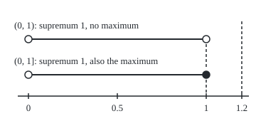
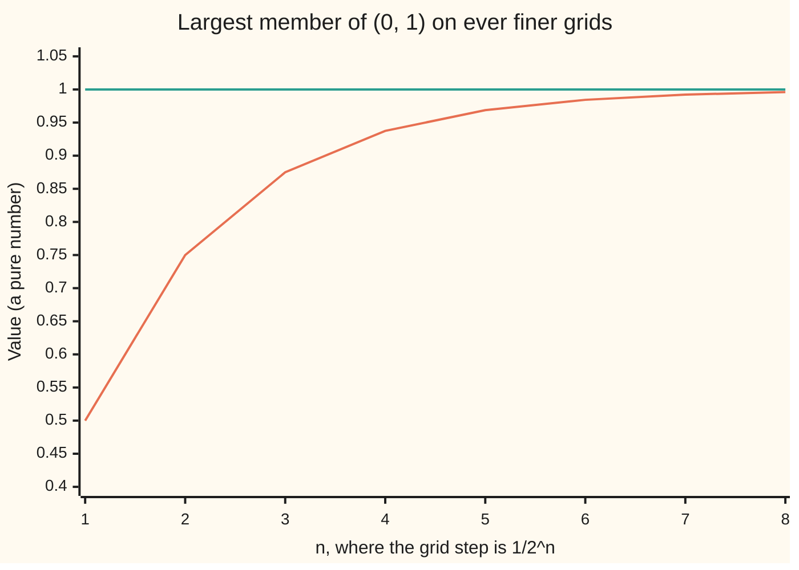

# No gaps: least upper bounds and why the reals have them

Calculus and analysis → Limits and Continuity → Least upper bounds → No gaps

---

## General Overview

Take every number strictly between 0 and 1. Write that collection (0, 1): round brackets leave the ends out. A square bracket keeps an end in, so (0, 1] includes 1.

Which member is the largest? Try 0.9: halfway to 1 is 0.95, inside and bigger. Try 0.999: halfway is 0.9995. Every candidate loses this way, so there is no largest member, no **maximum**.

Yet there is a sharp top edge. Every member is below 1, and nothing smaller than 1 keeps them all below it. So 1 is the lowest ceiling: the **least upper bound**, or **supremum**. A maximum must be a member. A supremum need not be.

Calculus keeps proving that a number exists without writing it down: a root, a highest point, an area. Each proof builds a collection of numbers and takes its lowest ceiling. The real numbers promise that lowest ceiling is always there. That promise is **completeness**.

**A supremum is the lowest number no member of a collection passes, reached or not; completeness promises one for every collection of reals with a member and a ceiling.**

**What kind of fact this is:** a definition (the supremum) plus the axiom that defines the real numbers (completeness); Why it works proves its first consequences, and its folded proof derives the axiom from infinite decimals.

### The picture: two intervals, one top edge

<p align="center"></p>

To scale: 250 units of width per unit of number, so 0 sits at x = 40, 0.5 at 165, 1 at 290 and 1.2 at 340. Hollow circles are ends left out; the filled dot is an end kept in. Both dashed lines are ceilings; only 1 is the lowest.

---

## The formula

$S$ names a collection of numbers. $\sup S$, read "the supremum of S", is its least upper bound; $\max S$ is its largest member, if any. An **upper bound**, or ceiling, is a number no member passes.

$$s = \sup S \iff \begin{cases} x \le s & \text{for every } x \text{ in } S \\ \text{some } x \text{ in } S \text{ has } x > t & \text{for every } t < s \end{cases}$$

**Read it aloud:** s is a ceiling over every member, and any number lower than s is passed by some member. Neither line asks s to be a member.

Completeness, the axiom:

$$S \text{ non-empty, bounded above} \;\Longrightarrow\; \sup S \text{ exists, a real number}$$

**Read it aloud:** a collection of reals with a member and a ceiling has a lowest ceiling, and it is a real number. For (0, 1] the supremum and maximum are both 1.

| Symbol | Plain meaning | In our example | Push it up and the answer… |
| --- | --- | --- | --- |
| $S$ | a collection of real numbers | (0, 1) | a higher top edge raises the supremum |
| $x$ | any one member of $S$ | 0.95 | stays below 1 |
| $s$, $\sup S$ | the least upper bound | 1 | — |
| $\max S$ | the largest member, if any | none; 1 for (0, 1] | — |
| $m$ | a proposed maximum | 0.9 | its beater (m + 1)/2 rises too |
| $t$ | a challenger below $s$ | 0.999 | the member passing it nears 1 |
| $\iff$, $\Longrightarrow$ | "exactly when"; "guarantees" | read the two lines aloud | — |
| $\inf S$ | the greatest lower bound, the **infimum** | 0 | — |

The infimum works upside down: negate every member, take the supremum, negate it back.

### When it holds

The supremum is a definition. Completeness has three conditions, each needed:

- **A member.** Every number is a ceiling over an empty collection, so none is lowest.
- **A ceiling.** The counting numbers 1, 2, 3, ... have none: 1000.5 is passed by 1001.
- **Reals, not only fractions.** The fractions whose square is under 2 have no lowest fraction ceiling (Step 3).

---

## Why it works

### Step 0: a ceiling is tested against every member

A maximum is a member. A ceiling is any number the members cannot pass. Naming the supremum takes two checks: the candidate is a ceiling, and every lower number is not. The second is a game: a challenger names a lower number, and the reply is a member above it.

### Step 1: (0, 1) has no largest member

Take any member $m$. Halfway to 1 is (m + 1)/2, above $m$ and below 1 because $m$ is below 1. So it is a larger member. With numbers: 0.9 is beaten by 0.95, 0.99 by 0.995, 0.999 by 0.9995. The argument works for whichever member is named.

### Step 2: 1 is the lowest ceiling

Every member is below 1, so 1 is a ceiling. Any lower challenger $t$ loses. If $t$ is above 0, the member (t + 1)/2 passes it: 0.999 is passed by 0.9995, and 0.5 by 0.75. If $t$ is 0 or below, 0.5 passes it; the challenger -3 is one such. No number below 1 is a ceiling, so the supremum is 1.

This is the tolerance game of [limits](01-limits.md): name any gap below 1, and a member lands in it. On a grid of step 1/2^n (fractions with 2^n on the bottom), the largest member is 1 minus one step.



Rising line: the largest grid member. Flat line: the supremum, 1. At n = 20 the gap is 1/1048576, still not zero. The chart illustrates; Steps 1 and 2 prove.

### Step 3: the fractions have a gap where a ceiling should be

Keep only fractions whose square is under 2. The fraction 3/2 is a ceiling, since its square is over 2. The rule sending q to (2q + 2)/(q + 2) turns any fraction ceiling into a lower one (algebra in the folded proof): 3/2, 10/7, 17/12, 58/41, 99/70, forever.

The lowest ceiling would square to exactly 2, and no fraction does ([real-numbers-no-gaps](../../01-Foundations/02-The%20Number%20Line/04-real-numbers-no-gaps.md)). Halving an interval around it twenty times pins it between 1.4142132 and 1.4142141. The reals put root 2 there; the fractions leave a hole. Completeness rules such holes out.

### Step 4: completeness at work, the counting numbers have no ceiling

This is the wing's existence-proof pattern on a small case. Claim: no real number is a ceiling over 1, 2, 3, ... .

Suppose one were. Completeness gives a lowest ceiling s. Then s − 1 is not a ceiling, so some counting number n is above s − 1. So n + 1, also a counting number, is above s, and s was no ceiling. The supposition fails. This is the **Archimedean property**. Hence 1/n shrinks below any positive size, which [sequences-and-limits](03-sequences-and-limits.md) uses at once.

<details>
<summary>Detailed proof</summary>

**The standard form.** Write $\varepsilon$ (epsilon) for any positive number. The formula's second line, with $t = s - \varepsilon$, reads: for every $\varepsilon > 0$ some member exceeds $s - \varepsilon$.

**The fraction rule.** For a positive fraction q, let $q^* = (2q + 2)/(q + 2)$. Then $q - q^* = (q^2 - 2)/(q + 2)$ and $(q^*)^2 - 2 = 2(q^2 - 2)/(q + 2)^2$. If $q^2 > 2$, both are positive: $q^*$ is lower and still a ceiling. If $q^2 < 2$, both are negative: $q^*$ is a larger member, so q is no ceiling. A fraction ceiling that is lowest would need $q^2 = 2$.

**Completeness from infinite decimals.** Model reals as infinite decimals. Let S have a member and a ceiling. Pick the whole-number part, then each digit in turn, as the largest keeping "some member reaches this cut-off" true. Call the result s, and its cut-off after k digits s(k).

By construction some member reaches s(k), and none reaches $s(k) + 10^{-k}$, or a digit (or, past a 9, an earlier digit) could have been larger. So every member is below $s + 10^{-k}$ for every k, hence at most s: s is a ceiling. For any $t < s$, pick k with $10^{-k} < s - t$; then $s(k) > t$, and a member reaching s(k) passes t. So s is the supremum.

</details>

Other constructions of the reals, Dedekind's cuts or limits of bunching fraction sequences, make completeness a theorem; the second generalises in completeness-and-completion.

---

## Worked numbers, by hand

| Step | Arithmetic | Value |
| --- | --- | --- |
| proposed maximum 0.9 | (0.9 + 1)/2 | 0.95, a larger member |
| proposed maximum 0.999 | (0.999 + 1)/2 | 0.9995, a larger member |
| challenger 0.5 below 1 | (0.5 + 1)/2 | 0.75 passes it |
| proposed ceiling 1.2 | no member reaches it, but 1 is lower | a ceiling, not the least |
| proposed ceiling 1 | no member reaches it; every lower number is passed | **sup S = 1** |
| largest member | every member is beaten | **no max S** |

An exact top edge at 1, with no member on it; putting 1 in, as (0, 1], makes the edge a maximum.

### What breaks if you drop a piece

| Mistake | Comes out at | What went wrong |
| --- | --- | --- |
| Largest member found as the maximum | 0.999, beaten by 0.9995 | A sample is not the collection |
| Any ceiling as the supremum | 1.2, when 1 is lower | It must be the lowest |
| No ceiling: 1, 2, 3, ... | 1000.5 passed by 1001 | Completeness needs a ceiling |
| Fractions only, square under 2 | 3/2, 10/7, 17/12, 58/41, 99/70, ... | Each has a lower one |

The code prints all four.

---

## Code, from first principles, and it actually runs

Nothing is imported. Road one plays the ceiling game in exact ten-thousandths: every proposed maximum and challenger is beaten by a member it constructs. Road two never uses that formula: it searches grids of step 1/2^n for the largest member and checks it is 1 minus one step. Fraction ceilings are trimmed in whole numbers, and a halving bracket confirms each sits above root 2.

### Python

```python
# No gaps: least upper bounds -- the check behind the card.  Nothing is
# imported.  S is every number strictly between 0 and 1.  Road one plays the
# ceiling game in exact ten-thousandths: every proposed maximum, and every
# proposed ceiling below 1, is beaten by a member.  Road two scans finer and
# finer grids of members: the largest climbs toward 1 and never lands on it.
U = 10000                                     # one unit, in ten-thousandths

def dec(n, places=4):                         # dec(9500) -> "0.95", exact
    sign, n = ("-" if n < 0 else ""), abs(n)
    s = f"{n // 10 ** places}.{n % 10 ** places:0{places}d}"
    return sign + s.rstrip("0").rstrip(".")

def in_s(x):                                  # is x (in ten-thousandths) in S?
    return 0 < x < U

def beat(t):                                  # a member of S above t, for t < 1
    return (t + U) // 2 if t > 0 else U // 2

print("S = every number strictly between 0 and 1")
maxes, lows = [9000, 9900, 9990], [9990, 5000, -30000]
assert all(in_s(beat(x)) and beat(x) > x for x in maxes + lows)  # road one
for m in maxes:                               # no largest member
    print(f"proposed maximum {dec(m)}: ({dec(m)} + 1)/2 = {dec(beat(m))}, a larger member")
for t in lows:                                # no ceiling below 1
    print(f"proposed ceiling {dec(t)}: member {dec(beat(t))} passes it")
tops = []
for n in range(1, 21):                        # road two: grids of step 1/2^n
    d = 2 ** n
    k = max(j for j in range(2 * d + 1) if 0 < j < d)
    assert k == d - 1                          # scan agrees with 1 - 1/2^n
    tops.append(k / d)
print("road two, largest member on the grid of step 1/2^n, n = 1 to 8:")
print("  " + ", ".join(str(x) for x in tops[:8]))
print("  to two places: " + ", ".join(f"{x:.2f}" for x in tops[:8]))
print(f"  n = 20: gap to 1 is 1/{2 ** 20}; every grid member stays below 1")
print("ceiling 1.2 holds, and so does 1, which is lower: sup S = 1, no max S")
print("same set with 1 put in, (0, 1]: sup = 1 = max, a member")
p, r, trims = 3, 2, []                        # fraction ceilings over q*q < 2
for _ in range(5):
    assert p * p > 2 * r * r and all(p * b < a * r for a, b in trims[-1:])  # lower ceiling
    trims.append((p, r))
    p, r = 2 * p + 2 * r, p + 2 * r            # q -> (2q + 2)/(q + 2), lower
    g = next(x for x in range(min(p, r), 0, -1) if p % x == 0 and r % x == 0)
    p, r = p // g, r // g
print("fraction ceilings over the fractions whose square is under 2:")
print("  " + ", ".join(f"{a}/{b} = {a / b:.6f}" for a, b in trims))
lo, hi, den = 1, 2, 1                         # halving: where the gap sits
for _ in range(20):
    lo, hi, den = 2 * lo, 2 * hi, 2 * den
    mid = (lo + hi) // 2
    lo, hi = (mid, hi) if mid * mid < 2 * den * den else (lo, mid)
assert all(a * den > hi * b for a, b in trims)  # every fraction ceiling sits above
print(f"halving 20 times: the lowest ceiling is between {lo / den:.7f} and {hi / den:.7f}")
c = 10005                                     # a ceiling over 1, 2, 3, ... ?
print(f"no ceiling over 1, 2, 3, ...: proposed ceiling {dec(c, 1)} is passed by {c // 10 + 1}")
xs = [(dec(t, 1), 40 + 25 * t) for t in (0, 5, 10, 12)]   # t in tenths
print("figure, x = 40 + 250 t: " + ", ".join(f"{t} -> {x}" for t, x in xs))
print("ALL CHECKS PASS")
```

**Ran 2026-09-27 on macOS, Python 3.14.6, standard library only. All checks passed. Output, pasted from the run:**

```
S = every number strictly between 0 and 1
proposed maximum 0.9: (0.9 + 1)/2 = 0.95, a larger member
proposed maximum 0.99: (0.99 + 1)/2 = 0.995, a larger member
proposed maximum 0.999: (0.999 + 1)/2 = 0.9995, a larger member
proposed ceiling 0.999: member 0.9995 passes it
proposed ceiling 0.5: member 0.75 passes it
proposed ceiling -3: member 0.5 passes it
road two, largest member on the grid of step 1/2^n, n = 1 to 8:
  0.5, 0.75, 0.875, 0.9375, 0.96875, 0.984375, 0.9921875, 0.99609375
  to two places: 0.50, 0.75, 0.88, 0.94, 0.97, 0.98, 0.99, 1.00
  n = 20: gap to 1 is 1/1048576; every grid member stays below 1
ceiling 1.2 holds, and so does 1, which is lower: sup S = 1, no max S
same set with 1 put in, (0, 1]: sup = 1 = max, a member
fraction ceilings over the fractions whose square is under 2:
  3/2 = 1.500000, 10/7 = 1.428571, 17/12 = 1.416667, 58/41 = 1.414634, 99/70 = 1.414286
halving 20 times: the lowest ceiling is between 1.4142132 and 1.4142141
no ceiling over 1, 2, 3, ...: proposed ceiling 1000.5 is passed by 1001
figure, x = 40 + 250 t: 0 -> 40, 0.5 -> 165, 1 -> 290, 1.2 -> 340
ALL CHECKS PASS
```

### Rust

Same numbers, same labels, built with `rustc --edition 2021 -O`.

```rust
// No gaps: least upper bounds -- the same check as the Python, in Rust.  No
// crates.  S is every number strictly between 0 and 1.  Road one plays the
// ceiling game in exact ten-thousandths: every proposed maximum, and every
// proposed ceiling below 1, is beaten by a member.  Road two scans finer and
// finer grids of members: the largest climbs toward 1 and never lands on it.
const U: i64 = 10000; // one unit, in ten-thousandths

fn dec(n: i64, places: u32) -> String { // dec(9500, 4) -> "0.95", exact
    let (sign, m, p) = (if n < 0 { "-" } else { "" }, n.abs(), 10_i64.pow(places));
    let s = format!("{}.{:0w$}", m / p, m % p, w = places as usize);
    format!("{}{}", sign, s.trim_end_matches('0').trim_end_matches('.'))
}

fn in_s(x: i64) -> bool { 0 < x && x < U } // is x (in ten-thousandths) in S?

fn beat(t: i64) -> i64 { if t > 0 { (t + U) / 2 } else { U / 2 } } // a member above t

fn main() {
    println!("S = every number strictly between 0 and 1");
    let (maxes, lows) = ([9000_i64, 9900, 9990], [9990_i64, 5000, -30000]);
    assert!(maxes.iter().chain(lows.iter()).all(|&x| in_s(beat(x)) && beat(x) > x)); // road one
    for m in maxes { // no largest member
        println!("proposed maximum {}: ({} + 1)/2 = {}, a larger member", dec(m, 4), dec(m, 4), dec(beat(m), 4));
    }
    for t in lows { // no ceiling below 1
        println!("proposed ceiling {}: member {} passes it", dec(t, 4), dec(beat(t), 4));
    }
    let mut tops: Vec<f64> = Vec::new();
    for n in 1..=20_u32 { // road two: grids of step 1/2^n
        let d = 2_i64.pow(n);
        let k = (0..=2 * d).filter(|&j| 0 < j && j < d).max().unwrap();
        assert!(k == d - 1); // scan agrees with 1 - 1/2^n
        tops.push(k as f64 / d as f64);
    }
    println!("road two, largest member on the grid of step 1/2^n, n = 1 to 8:");
    let shown: Vec<String> = tops[..8].iter().map(|x| format!("{}", x)).collect();
    println!("  {}", shown.join(", "));
    let two: Vec<String> = tops[..8].iter().map(|x| format!("{:.2}", x)).collect();
    println!("  to two places: {}", two.join(", "));
    println!("  n = 20: gap to 1 is 1/{}; every grid member stays below 1", 2_i64.pow(20));
    println!("ceiling 1.2 holds, and so does 1, which is lower: sup S = 1, no max S");
    println!("same set with 1 put in, (0, 1]: sup = 1 = max, a member");
    let (mut p, mut r, mut trims) = (3_i64, 2_i64, Vec::<(i64, i64)>::new()); // fraction ceilings
    for _ in 0..5 {
        assert!(p * p > 2 * r * r && trims.last().map_or(true, |&(a, b)| p * b < a * r)); // lower ceiling
        trims.push((p, r));
        let (np, nr) = (2 * p + 2 * r, p + 2 * r); // q -> (2q + 2)/(q + 2), lower
        let g = (1..=np.min(nr)).rev().find(|x| np % x == 0 && nr % x == 0).unwrap();
        p = np / g;
        r = nr / g;
    }
    println!("fraction ceilings over the fractions whose square is under 2:");
    let tr: Vec<String> = trims.iter().map(|&(a, b)| format!("{}/{} = {:.6}", a, b, a as f64 / b as f64)).collect();
    println!("  {}", tr.join(", "));
    let (mut lo, mut hi, mut den) = (1_i64, 2_i64, 1_i64); // halving: where the gap sits
    for _ in 0..20 {
        lo *= 2; hi *= 2; den *= 2;
        let mid = (lo + hi) / 2;
        if mid * mid < 2 * den * den { lo = mid } else { hi = mid }
    }
    assert!(trims.iter().all(|&(a, b)| a * den > hi * b)); // every fraction ceiling sits above
    println!("halving 20 times: the lowest ceiling is between {:.7} and {:.7}", lo as f64 / den as f64, hi as f64 / den as f64);
    let c = 10005_i64; // a ceiling over 1, 2, 3, ... ?
    println!("no ceiling over 1, 2, 3, ...: proposed ceiling {} is passed by {}", dec(c, 1), c / 10 + 1);
    let xs: Vec<String> = [0_i64, 5, 10, 12].iter().map(|&t| format!("{} -> {}", dec(t, 1), 40 + 25 * t)).collect();
    println!("figure, x = 40 + 250 t: {}", xs.join(", "));
    println!("ALL CHECKS PASS");
}
```

**Ran 2026-09-27 on macOS, rustc 1.98.1, no crates. All checks passed. Output, pasted from the run:**

```
S = every number strictly between 0 and 1
proposed maximum 0.9: (0.9 + 1)/2 = 0.95, a larger member
proposed maximum 0.99: (0.99 + 1)/2 = 0.995, a larger member
proposed maximum 0.999: (0.999 + 1)/2 = 0.9995, a larger member
proposed ceiling 0.999: member 0.9995 passes it
proposed ceiling 0.5: member 0.75 passes it
proposed ceiling -3: member 0.5 passes it
road two, largest member on the grid of step 1/2^n, n = 1 to 8:
  0.5, 0.75, 0.875, 0.9375, 0.96875, 0.984375, 0.9921875, 0.99609375
  to two places: 0.50, 0.75, 0.88, 0.94, 0.97, 0.98, 0.99, 1.00
  n = 20: gap to 1 is 1/1048576; every grid member stays below 1
ceiling 1.2 holds, and so does 1, which is lower: sup S = 1, no max S
same set with 1 put in, (0, 1]: sup = 1 = max, a member
fraction ceilings over the fractions whose square is under 2:
  3/2 = 1.500000, 10/7 = 1.428571, 17/12 = 1.416667, 58/41 = 1.414634, 99/70 = 1.414286
halving 20 times: the lowest ceiling is between 1.4142132 and 1.4142141
no ceiling over 1, 2, 3, ...: proposed ceiling 1000.5 is passed by 1001
figure, x = 40 + 250 t: 0 -> 40, 0.5 -> 165, 1 -> 290, 1.2 -> 340
ALL CHECKS PASS
```

The two outputs match line for line.

> [!TIP]
> **Try changing**
> Guess first, then run it.
> - **Keep the top end in.** In the grid scan change `j < d` to `j <= d`. Answer: the largest grid member becomes 1 itself, the maximum of (0, 1], and the scan's assert stops the run.
> - **A lazy challenger.** Make `beat` return `t // 2` for positive `t`. Answer: the "beater" of 0.9 is lower than 0.9, and the first assert stops the run.
> - **A wrong trimming rule.** Replace `2 * p + 2 * r, p + 2 * r` with `p + 2 * r, p + r`. Answer: the fraction after 3/2 squares under 2, so it is no ceiling, and the ceiling assert stops the run.

---

## The usual mistake

> [!warning]
> **Treating the supremum as the largest member.** The supremum of (0, 1) is 1, and 1 is not in (0, 1). A supremum is about ceilings; only when it is a member is it the maximum, as for (0, 1].
>
> - **Stopping at the largest member found.** 0.999 looks like the top until 0.9995 beats it.
> - **Taking any ceiling.** 1.2 is a ceiling over (0, 1), but 1 is lower.
> - **Forgetting the ceiling condition.** For 1, 2, 3, ..., a proposed ceiling of 1000.5 is passed by 1001.
> - **Expecting fractions to be enough.** The ceilings 3/2, 10/7, 17/12, 58/41, 99/70 keep falling with no lowest one.

---

## Where you meet it in real life

- **Strict limits.** A rule such as "under 1 tonne" allows loads as close to it as anyone likes, with no heaviest allowed load. The limit is the supremum.
- **Root finding.** Halving a bracket, as Step 3 does for root 2, relies on a number where the brackets close in; [intermediate-value-theorem](06-intermediate-value-theorem.md) proves it is a root.
- **Best-possible bounds.** "The error never exceeds this" names a supremum of errors that may never be reached; [extreme-value-theorem](07-extreme-value-theorem.md) says when it is.

> **Say it back**
> A ceiling is a number no member passes. The supremum is the lowest ceiling and need not be a member; the maximum must be. (0, 1) has supremum 1 and no maximum, since every member is beaten by the one halfway to 1. Completeness promises a supremum to every collection of reals with a member and a ceiling. The fractions break it at root 2; calculus's existence proofs lean on it.

---

## What this builds on

- [limits](01-limits.md): the tolerance game, played here against ceilings.
- [real-numbers-no-gaps](../../01-Foundations/02-The%20Number%20Line/04-real-numbers-no-gaps.md): the no-gaps promise in words, and root 2 as the hole in the fractions.

## Where this goes next

- [sequences-and-limits](03-sequences-and-limits.md): a rising sequence with a ceiling heads for its supremum.
- [intermediate-value-theorem](06-intermediate-value-theorem.md): a root pinned down as a supremum.
- [riemann-integral](../04-Integrals/01-riemann-integral.md): area from suprema of rectangle sums.
- [lebesgue-outer-measure](../../10-Measure%20and%20integration/02-Length%20Done%20Properly/01-lebesgue-outer-measure.md): length as an infimum of covering lengths.
- [limits-of-measurable-functions](../../10-Measure%20and%20integration/03-Measurable%20Functions/02-limits-of-measurable-functions.md): suprema of functions, point by point.
- [functions-of-bounded-variation](../../10-Measure%20and%20integration/11-Derivatives%20Meet%20the%20Lebesgue%20Integral/01-functions-of-bounded-variation.md): total wiggle as a supremum over cuttings.
- completeness-and-completion: no gaps in any space with a distance.
- normed-spaces-and-banach-spaces: sizes of functions as suprema, in spaces with no gaps.
- reflexive-spaces-and-the-second-dual: suprema that are, or are not, reached.

---

## Sources

Verified 2026-09-27: every link below resolves to the publisher's or author's page.

- Lebl, Jiří. *Basic Analysis I: Introduction to Real Analysis*. [Basic properties of the real numbers](https://www.jirka.org/ra/html/sec_basicpropsrn.html). Free; the least-upper-bound property and the infimum by negation.
- Abbott, Stephen. *Understanding Analysis*, 2nd ed. Springer, 2015. [Publisher page](https://link.springer.com/book/10.1007/978-1-4939-2712-8). Chapter 1: the axiom of completeness and its first consequences.
- O'Connor, J. J., and E. F. Robertson. "Richard Dedekind." MacTutor Archive, University of St Andrews. [Biography](https://mathshistory.st-andrews.ac.uk/Biographies/Dedekind/). Dates the 1872 cut construction of the reals.
