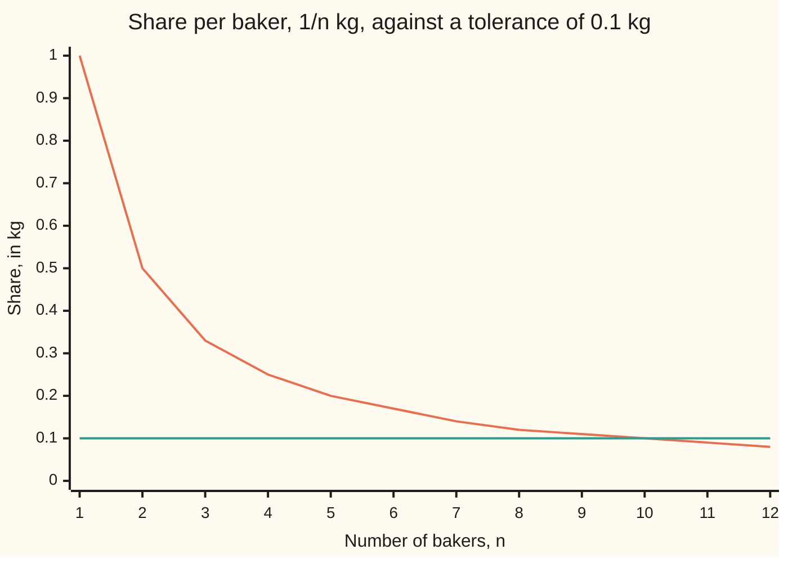
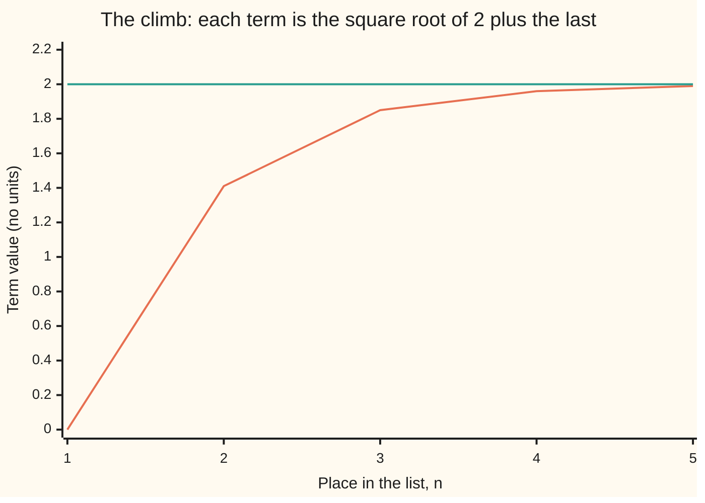

# Sequences: limits with a whole number as the clock, and the monotone convergence theorem

[Syllabus](../../../SYLLABUS.md) → [Calculus and analysis](../README.md) → [Limits and Continuity](../README.md#s01) → Sequences

---

## General Overview

A kilogram of flour is split evenly among some number of bakers. One baker gets 1 kg, two get 1/2 kg each, ten get 0.1 kg, eleven get 1/11 kg. Write the shares in order and the list 1, 1/2, 1/3, 1/4 runs on without end.

From which baker on is every share below 0.1 kg? Not the tenth: that share is exactly 0.1 kg. From the eleventh on, every share is at most 1/11 kg. One cutoff, 10, settles it for the whole infinite rest of the list; for 0.01 kg the cutoff is 100. Every tolerance gets a cutoff: that is what "the shares head for zero" means.

An endless numbered list is a **sequence**. Its limit is a promise about everything past a cutoff, never about one term. The monotone convergence theorem says when a limit must exist before anyone knows its value.

**A sequence heads for L when every tolerance has a cutoff past which every term is closer to L than that tolerance; a list that only climbs, under a ceiling, always has such a limit.**

**What kind of fact this is:** a definition (the limit of a sequence) and a theorem (monotone convergence), proved on this card in Why it works.

### The picture: the shares and the 0.1 line



The falling line is the share 1/n; the flat line is the tolerance, 0.1 kg. The share touches it at n = 10 and stays below from n = 11 on.

---

## The formula

Notation first, in words. A sequence is written $a_n$, read "a sub n": the term in place $n$, where $n$ ticks 1, 2, 3 and on like a clock. Here $a_n = 1/n$. The arrow to infinity reads "heads for $L$ as $n$ grows without end".

$$\lim_{n\to\infty} a_n = L \quad\text{means}\quad \text{for every tolerance } t>0 \text{ there is a cutoff } N \text{ with } |a_n - L| < t \text{ for every } n > N.$$

**Read it aloud:** name any positive tolerance, and past some place in the list every term is closer to L than that.

The bars $|a_n - L|$ are the distance from term to limit. For the shares the cutoff is the whole part of 1/t: 10 for 0.1, 100 for 0.01, 333 for 0.003.

The theorem:

$$\text{if } a_1 \le a_2 \le a_3 \le \cdots \text{ and every } a_n \le B, \text{ then } \lim_{n\to\infty} a_n = \sup\{a_1, a_2, a_3, \ldots\}.$$

**Read it aloud:** a list that never steps down and never passes a ceiling heads for its least upper bound.

The mirror image holds for a list that never steps up and never drops below a floor, like the shares: it heads for its greatest lower bound.

| Symbol | Plain meaning | In our example | Push it up and the answer… |
| --- | --- | --- | --- |
| $a_n$ | the term in place n | the share 1/n kg | — |
| $n$ | the place in the list, a whole number | 11 | the share shrinks toward L |
| $L$ | the limit: the number the terms head for | 0 kg | — |
| $t$ | the tolerance, in the terms' units | 0.1 kg | a smaller cutoff will do |
| $N$ | the cutoff, a count: past it every term is within t | 10 | — |
| $B$ | a ceiling no term passes | 2 for the climb below | the limit is unchanged |
| $c_n$ | the climb: each term the square root of 2 plus the last | 0, 1.414214, 1.847759… | — |
| $\sup$ | least upper bound, the lowest ceiling ([No gaps](02-supremum-and-completeness.md)) | 2 for the climb | — |

### When it holds

- **Every tolerance, not one.** The terms of 1, −1, 1, −1 all lie within 1.5 of 0, yet tolerance 0.1 has no cutoff for any L.
- **Monotone convergence needs both halves.** Without a ceiling, the running total 1 + 1/2 + … + 1/n climbs past every number. Without a steady direction, 1, −1, 1, −1 sits in a box unsettled.
- **No gaps in the number line.** Among fractions alone, the decimals of the square root of 2 climb under a ceiling and crowd together, with no fraction to head for.

---

## Why it works

### Step 1: the shares head for 0

With tolerance 0.1, the share 1/n is below 0.1 exactly when n is above 10, so 10 is the smallest cutoff.

For any tolerance t, a whole number at least 1/t is a cutoff. One always exists, because the whole numbers have no ceiling (the Archimedean property, proved in [No gaps](02-supremum-and-completeness.md)). No share ever equals 0: a limit need not be reached.

Sequences also test function limits ([Limits](01-limits.md)). Feed the shelf's fraction (x squared minus 1) over (x minus 1) the inputs x = 1 + 1/n. At n = 11 it gives 2.090909, off 2 by 0.090909, which is 1/11: the outputs reach 2 on the shares' schedule.

### Step 2: a list that settles stays in a box

Take a list heading for L and tolerance 1. Past the cutoff, every term lies between L − 1 and L + 1. Before it sit finitely many terms, and finitely many numbers have a largest size. So one number bounds every term: the list is **bounded**. The shares all lie between 0 and 1.

### Step 3: staying in a box is not settling

If 1, −1, 1, −1… headed for L, then with tolerance 0.1 both 1 and −1 would sit within 0.1 of L past the cutoff. They are 2 apart, so no L survives. Bounded is necessary for a limit, never sufficient.

### Step 4: climbing under a ceiling forces a limit

Let a list never step down and never pass a ceiling. The real numbers have no gaps, so the terms have a least upper bound; call it L. Take tolerance 0.1. Since L − 0.1 is below the lowest ceiling, it is no ceiling: some term, the K-th say, lies above it. Every later term is at least that term and at most L, so within 0.1 of L. The same runs for any tolerance. That is the monotone convergence theorem.

It proves a limit exists before its value is known. The **climb** $c_n$ starts at 0 and makes each next term the square root of 2 plus the last: 0, 1.414214, 1.847759, 1.961571, 1.990369, 1.997591.



The rising line is the climb; the flat line is the ceiling 2.

Two facts, by induction ([Induction](../../01-Foundations/06-Proof/04-proof-by-induction.md)). **Below 2:** a term below 2 gives a next term below the square root of 4. **Never steps down:** for a term c at least 0 and below 2, the next term beats c exactly when (2 − c)(1 + c) is positive, which it is.

So the climb has a limit L. The limit laws ([Limit laws and the squeeze](04-limit-laws-and-the-squeeze.md)) pass "next squared equals 2 plus last" to the limit: L times L equals 2 + L, roots 2 and −1. No term is negative, so L is 2.

Prove the limit exists before solving for it: doubling from 1 "solves" L = 2L to L = 0, yet its twentieth term is 524,288.

### Step 5: crowding, without naming the limit

A list is **Cauchy** when every tolerance has a cutoff past which any two terms lie within that tolerance of each other. No limit is named. The shares pass: past place 10, every share lies between 0 and 1/11, so any two differ by less than 0.1. The running total 1 + 1/2 + … fails, though its steps shrink: from place n to place 2n it gains at least n × 1/(2n) = 1/2, however late n is. On the real line, Cauchy and convergent are the same; the folded proof gets it from monotone convergence.

<details>
<summary>Detailed proof</summary>

Write ε (epsilon, the traditional letter) for the tolerance t. A sequence a_n converges to L if for every ε > 0 there is a whole number N with |a_n − L| < ε for all n > N.

**1/n converges to 0.** The Archimedean property gives a whole number N ≥ 1/ε. For n > N, n > 1/ε, so 1/n < ε.

**The limit is unique.** If a_n converged to L and to M ≠ L, take ε = |L − M|/2. Past both cutoffs, |L − M| ≤ |L − a_n| + |a_n − M| < 2ε = |L − M|, a contradiction.

**Convergent implies bounded.** Take ε = 1 with cutoff N. For n > N, |a_n| < |L| + 1. The largest of |a_1|, …, |a_N| and |L| + 1 bounds every term.

**Monotone convergence.** Let a_n ≤ a_(n+1) ≤ B for all n. By completeness the terms have a least upper bound L. Given ε > 0, L − ε is not an upper bound, so a_K > L − ε for some K. For n > K, L − ε < a_K ≤ a_n ≤ L, so |a_n − L| < ε. The decreasing case applies this to −a_n.

**Cauchy implies convergent.** A Cauchy list is bounded: past its cutoff for ε = 1, every term lies within 1 of a_(N+1). Let u_N be the least upper bound of the tail {a_n : n > N}. The u_N never step up and stay above a floor, so they converge to some L. Given ε > 0, take N with |a_m − a_n| < ε for all m, n > N, and fix n > N. For M ≥ N every term past M lies within ε of a_n, so a_n − ε ≤ u_M ≤ a_n + ε. Letting M grow gives |a_n − L| ≤ ε for every n > N; ε is arbitrary. The converse is the triangle inequality with ε/2.

**The climb's rate.** Since c_(n+1) squared is 2 + c_n, 2 − c_(n+1) = (2 − c_n)/(2 + c_(n+1)), at most half of 2 − c_n: a second proof that the limit is 2.

</details>

---

## Worked numbers, by hand

| Step | Arithmetic | Value |
| --- | --- | --- |
| tolerance | a tenth of a kilogram | 0.1 kg |
| term 10 | 1/10, equal to the tolerance, not below | 0.100000 |
| term 11 | 1/11 | 0.090909 |
| cutoff | past term 10, all inside | **N = 10** |
| tighter tolerances | 1 ÷ 0.01; whole part of 1 ÷ 0.003 | 100; 333 |

From the eleventh baker on, every share is under 100 g.

### What breaks if you drop a piece

| Mistake | Comes out at | What went wrong |
| --- | --- | --- |
| Cutoff 9 for tolerance 0.1 | term 10 sits at 0.100000 | "within" means strictly below |
| Bounded taken for convergent | places 101, 102 give −1, 1: gap 2 | no L lies within 0.1 of both |
| Climbing, no ceiling | 1 + 1/2 + … + 1/1024 = 7.509176 | steps shrink to 0.000977, yet each doubling block adds at least 1/2 |
| Solving before proving | doubling from 1: "limit" 0, term 20 = 524,288 | no limit was promised |

The code prints all four.

---

## Code, from first principles, and it actually runs

Each cutoff comes by formula and by walking the terms; the climb's limit by 20 iterations and by the quadratic formula.

### Python

```python
# Sequences and limits -- the check behind the card.  Standard library only;
# math.sqrt is the one primitive used.  Each cutoff N is found by a formula and
# by walking the terms; the climb to 2 is met by iterating and by algebra.
import math

def cutoff_formula(p, q):             # tolerance p/q: 1/n < p/q exactly when n > q/p
    return q // p

def cutoff_scan(p, q):                # walk n up, remember the last term not inside
    last = 0
    for n in range(1, 10 * q):        # 1/n only shrinks, so no later term can fail
        if 1 / n >= p / q:
            last = n
    return last

def two(xs):
    return " ".join(f"{x:.2f}" for x in xs)

print("sequence a_n = 1/n, heading for L = 0")
print("chart, 1/n for n = 1..12:", two(1 / n for n in range(1, 13)))
for p, q in ((1, 10), (1, 100), (3, 1000)):
    nf, ns = cutoff_formula(p, q), cutoff_scan(p, q)
    print(f"tolerance {p}/{q}: N by formula {nf}, N by scan {ns}")
    assert nf == ns                                            # two roads, one cutoff
print(f"term 10 misses by {1 / 10:.6f}, term 11 is inside at {1 / 11:.6f}")
print(f"mistake, cutoff 9 for tolerance 1/10: term 10 sits at {1 / 10:.6f}, not below 0.1")
alt = [(-1) ** n for n in (101, 102)]
print(f"mistake, bounded is not convergent: (-1)^n at n = 101, 102 gives {alt[0]}, {alt[1]}; "
      f"gap {alt[1] - alt[0]} > 2 x 0.1")
x = 1 + 1 / 11
f = (x * x - 1) / (x - 1)                                      # the uncancelled fraction
print(f"house example, (x^2 - 1)/(x - 1) at x = 1 + 1/11: {f:.6f}, off 2 by {f - 2:.6f}")
assert abs((f - 2) - 1 / 11) < 1e-12                           # fraction road vs 1/n road
c, climb = 0.0, []
for n in range(1, 21):                                         # c_1 = 0, c_(n+1) = sqrt(2 + c_n)
    climb.append(c)
    c = math.sqrt(2 + c)
print("climb c_n, n = 1..6:", " ".join(f"{v:.6f}" for v in climb[:6]))
print("gap 2 - c_n, n = 1..6:", " ".join(f"{2 - v:.6f}" for v in climb[:6]))
print("chart, c_n for n = 1..5:", two(climb[:5]))
up = all(a < b for a, b in zip(climb, climb[1:])) and all(v < 2 for v in climb)
print(f"every step up and every term below 2, n = 1..20: {'yes' if up else 'no'}")
root = (1 + math.sqrt(1 + 8)) / 2                              # road 2: L*L = 2 + L
print(f"road 2, L = sqrt(2 + L) so L^2 - L - 2 = 0: L = {root:.6f} or {(1 - math.sqrt(1 + 8)) / 2:.6f}")
assert up and abs(climb[-1] - root) < 1e-10                    # iteration vs algebra
print(f"first climb term within 0.1 of 2: n = {next(n for n, v in enumerate(climb, 1) if 2 - v < 0.1)}")
d = 1
for _ in range(19):
    d *= 2
print(f"mistake, no ceiling: d_(n+1) = 2 d_n from 1 has 'fixed point' 0, yet d_20 = {d}")
h = sum(1 / k for k in range(1, 1025))                         # road 1: add every term
print(f"mistake, steps shrink but no ceiling: 1 + 1/2 + ... + 1/1024 = {h:.6f}, "
      f"doubling-block bound 1 + 10/2 = {1 + 10 / 2:.6f}, last step {1 / 1024:.6f}")
assert h >= 1 + 10 / 2                                         # road 2: blocks of 1/2
print("ALL CHECKS PASS")
```

**Ran 2026-09-27 on macOS, Python 3.14.6, standard library only. All checks passed. Output, pasted from the run:**

```
sequence a_n = 1/n, heading for L = 0
chart, 1/n for n = 1..12: 1.00 0.50 0.33 0.25 0.20 0.17 0.14 0.12 0.11 0.10 0.09 0.08
tolerance 1/10: N by formula 10, N by scan 10
tolerance 1/100: N by formula 100, N by scan 100
tolerance 3/1000: N by formula 333, N by scan 333
term 10 misses by 0.100000, term 11 is inside at 0.090909
mistake, cutoff 9 for tolerance 1/10: term 10 sits at 0.100000, not below 0.1
mistake, bounded is not convergent: (-1)^n at n = 101, 102 gives -1, 1; gap 2 > 2 x 0.1
house example, (x^2 - 1)/(x - 1) at x = 1 + 1/11: 2.090909, off 2 by 0.090909
climb c_n, n = 1..6: 0.000000 1.414214 1.847759 1.961571 1.990369 1.997591
gap 2 - c_n, n = 1..6: 2.000000 0.585786 0.152241 0.038429 0.009631 0.002409
chart, c_n for n = 1..5: 0.00 1.41 1.85 1.96 1.99
every step up and every term below 2, n = 1..20: yes
road 2, L = sqrt(2 + L) so L^2 - L - 2 = 0: L = 2.000000 or -1.000000
first climb term within 0.1 of 2: n = 4
mistake, no ceiling: d_(n+1) = 2 d_n from 1 has 'fixed point' 0, yet d_20 = 524288
mistake, steps shrink but no ceiling: 1 + 1/2 + ... + 1/1024 = 7.509176, doubling-block bound 1 + 10/2 = 6.000000, last step 0.000977
ALL CHECKS PASS
```

### Rust

Same numbers, same labels, built with `rustc --edition 2021 -O`.

```rust
// Sequences and limits -- the same check as the Python, in Rust.  No crates;
// f64::sqrt is the one primitive used.  Each cutoff N is found by a formula and
// by walking the terms; the climb to 2 is met by iterating and by algebra.

fn cutoff_formula(p: u64, q: u64) -> u64 { q / p }     // tolerance p/q: 1/n < p/q exactly when n > q/p

fn cutoff_scan(p: u64, q: u64) -> u64 {                // walk n up, remember the last term not inside
    let mut last = 0;
    for n in 1..10 * q {                                // 1/n only shrinks, so no later term can fail
        if 1.0 / n as f64 >= p as f64 / q as f64 { last = n }
    }
    last
}

fn two(xs: &[f64]) -> String {
    xs.iter().map(|x| format!("{:.2}", x)).collect::<Vec<_>>().join(" ")
}

fn six(xs: &[f64]) -> String {
    xs.iter().map(|x| format!("{:.6}", x)).collect::<Vec<_>>().join(" ")
}

fn main() {
    println!("sequence a_n = 1/n, heading for L = 0");
    let recips: Vec<f64> = (1..13).map(|n| 1.0 / n as f64).collect();
    println!("chart, 1/n for n = 1..12: {}", two(&recips));
    for (p, q) in [(1u64, 10u64), (1, 100), (3, 1000)] {
        let (nf, ns) = (cutoff_formula(p, q), cutoff_scan(p, q));
        println!("tolerance {}/{}: N by formula {}, N by scan {}", p, q, nf, ns);
        assert_eq!(nf, ns);                                               // two roads, one cutoff
    }
    println!("term 10 misses by {:.6}, term 11 is inside at {:.6}", 1.0 / 10.0, 1.0 / 11.0);
    println!("mistake, cutoff 9 for tolerance 1/10: term 10 sits at {:.6}, not below 0.1", 1.0 / 10.0);
    let alt: Vec<i64> = [101u32, 102].iter().map(|&n| (-1i64).pow(n)).collect();
    println!("mistake, bounded is not convergent: (-1)^n at n = 101, 102 gives {}, {}; gap {} > 2 x 0.1",
             alt[0], alt[1], alt[1] - alt[0]);
    let x: f64 = 1.0 + 1.0 / 11.0;
    let f = (x * x - 1.0) / (x - 1.0);                                    // the uncancelled fraction
    println!("house example, (x^2 - 1)/(x - 1) at x = 1 + 1/11: {:.6}, off 2 by {:.6}", f, f - 2.0);
    assert!(((f - 2.0) - 1.0 / 11.0).abs() < 1e-12);                     // fraction road vs 1/n road
    let (mut c, mut climb) = (0.0f64, Vec::new());
    for _ in 1..21 {                                                      // c_1 = 0, c_(n+1) = sqrt(2 + c_n)
        climb.push(c);
        c = (2.0 + c).sqrt();
    }
    let gaps: Vec<f64> = climb[..6].iter().map(|v| 2.0 - v).collect();
    println!("climb c_n, n = 1..6: {}", six(&climb[..6]));
    println!("gap 2 - c_n, n = 1..6: {}", six(&gaps));
    println!("chart, c_n for n = 1..5: {}", two(&climb[..5]));
    let up = climb.windows(2).all(|w| w[0] < w[1]) && climb.iter().all(|&v| v < 2.0);
    println!("every step up and every term below 2, n = 1..20: {}", if up { "yes" } else { "no" });
    let root = (1.0 + (1.0f64 + 8.0).sqrt()) / 2.0;                       // road 2: L*L = 2 + L
    println!("road 2, L = sqrt(2 + L) so L^2 - L - 2 = 0: L = {:.6} or {:.6}",
             root, (1.0 - (1.0f64 + 8.0).sqrt()) / 2.0);
    assert!(up && (climb[19] - root).abs() < 1e-10);                      // iteration vs algebra
    let first = climb.iter().position(|&v| 2.0 - v < 0.1).unwrap() + 1;
    println!("first climb term within 0.1 of 2: n = {}", first);
    let mut d: u64 = 1;
    for _ in 0..19 { d *= 2 }
    println!("mistake, no ceiling: d_(n+1) = 2 d_n from 1 has 'fixed point' 0, yet d_20 = {}", d);
    let h: f64 = (1..1025).map(|k| 1.0 / k as f64).sum();               // road 1: add every term
    println!("mistake, steps shrink but no ceiling: 1 + 1/2 + ... + 1/1024 = {:.6}, doubling-block bound 1 + 10/2 = {:.6}, last step {:.6}",
             h, 1.0 + 10.0 / 2.0, 1.0 / 1024.0);
    assert!(h >= 1.0 + 10.0 / 2.0);                                       // road 2: blocks of 1/2
    println!("ALL CHECKS PASS");
}
```

**Ran 2026-09-27 on macOS, rustc 1.98.1, no crates. All checks passed. Output, pasted from the run:**

```
sequence a_n = 1/n, heading for L = 0
chart, 1/n for n = 1..12: 1.00 0.50 0.33 0.25 0.20 0.17 0.14 0.12 0.11 0.10 0.09 0.08
tolerance 1/10: N by formula 10, N by scan 10
tolerance 1/100: N by formula 100, N by scan 100
tolerance 3/1000: N by formula 333, N by scan 333
term 10 misses by 0.100000, term 11 is inside at 0.090909
mistake, cutoff 9 for tolerance 1/10: term 10 sits at 0.100000, not below 0.1
mistake, bounded is not convergent: (-1)^n at n = 101, 102 gives -1, 1; gap 2 > 2 x 0.1
house example, (x^2 - 1)/(x - 1) at x = 1 + 1/11: 2.090909, off 2 by 0.090909
climb c_n, n = 1..6: 0.000000 1.414214 1.847759 1.961571 1.990369 1.997591
gap 2 - c_n, n = 1..6: 2.000000 0.585786 0.152241 0.038429 0.009631 0.002409
chart, c_n for n = 1..5: 0.00 1.41 1.85 1.96 1.99
every step up and every term below 2, n = 1..20: yes
road 2, L = sqrt(2 + L) so L^2 - L - 2 = 0: L = 2.000000 or -1.000000
first climb term within 0.1 of 2: n = 4
mistake, no ceiling: d_(n+1) = 2 d_n from 1 has 'fixed point' 0, yet d_20 = 524288
mistake, steps shrink but no ceiling: 1 + 1/2 + ... + 1/1024 = 7.509176, doubling-block bound 1 + 10/2 = 6.000000, last step 0.000977
ALL CHECKS PASS
```

The two outputs match line for line.

> [!TIP]
> **Try changing**
> Guess first, then run it.
> - **A different climb.** Change `2 + c` to `6 + c` in the loop. The climb heads for 3 and passes 2 at its second term, so the climb's assert stops the run.
> - **A tighter target.** Change the test `2 - v < 0.1` to `2 - v < 0.001`. The answer is 7: each step cuts the gap by roughly four.

---

## The usual mistake

> [!warning]
> **Watching terms get close and calling it a limit.** A table of terms, however long, is finitely many observations; a limit is a claim about infinitely many. Only "1/n shrinks as n grows" covers the millionth share. Computation illustrates a limit and never proves one.

---

## Where you meet it in real life

- **Calculators.** A square-root routine repeats one step until the answer stops moving; a proved gap bound, like the climb's, fixes how many steps suffice.
- **Infinite sums.** A never-ending sum is the limit of its running totals, in [Infinite series](../06-Series/01-series-convergence.md).

> **Say it back**
> A sequence heads for L when every tolerance has a cutoff past which every term is within that tolerance of L; for 1/n and 0.1 the cutoff is 10. Settling implies bounded, not the reverse. A list that never steps down, under a ceiling, heads for its least upper bound; on the real line, a crowding list settles.

---

## What this builds on

- [No gaps](02-supremum-and-completeness.md): the least upper bound, and the Archimedean property behind every cutoff.
- [Induction](../../01-Foundations/06-Proof/04-proof-by-induction.md): the climb stays below 2 and never steps down, at every place.

## Where this goes next

- [Limit laws and the squeeze](04-limit-laws-and-the-squeeze.md): limits of sums, products and quotients.
- [The integral](../04-Integrals/01-riemann-integral.md): area as a limit of rectangle sums.
- [Infinite series](../06-Series/01-series-convergence.md): sums as limits of running totals.
- [Uniform convergence](../06-Series/07-uniform-convergence.md): one cutoff for a whole family of functions.
- [The Picard-Lindelof theorem](../../08-Differential%20equations%20and%20dynamics/02-Existence%2C%20Uniqueness%20and%20Sensitivity/02-lipschitz-and-the-picard-lindelof-theorem.md): solutions as limits of repeated guesses.
- [Convergence](../../08-Differential%20equations%20and%20dynamics/09-Fourier%20Series/02-convergence-jumps-and-gibbs.md): wave sums that settle except at jumps.
- [Generated sigma-algebras and Borel sets](../../10-Measure%20and%20integration/01-Sets%20You%20Can%20Measure/03-generated-and-borel-sigma-algebras.md): sets built by endless lists of operations.
- [Continuity and subadditivity](../../10-Measure%20and%20integration/01-Sets%20You%20Can%20Measure/05-continuity-of-measure.md): monotone convergence for growing sets.
- [Sums, products, sups and limits](../../10-Measure%20and%20integration/03-Measurable%20Functions/02-limits-of-measurable-functions.md): function sequences, point by point.
- [Riesz-Fischer](../../10-Measure%20and%20integration/07-Sizes%20of%20Functions/05-completeness-of-lp.md): Cauchy lists of functions settle.
- Limits and continuity with distances: the tolerance game with any distance.
- Compactness three ways: every list has a settling sub-list.

---

## Sources

Verified 2026-09-27: every link below resolves to the publisher's page.

- Lebl, Jiří. *Basic Analysis I: Introduction to Real Analysis*, §2.1. [Sequences and limits](https://www.jirka.org/ra/html/sec_seqsandlims.html). Free; the definition, boundedness and monotone convergence.
- Lebl, Jiří. *Basic Analysis I*, §2.2. [Facts about limits of sequences](https://www.jirka.org/ra/html/sec_factslimsseqs.html). Limit laws and the squeeze lemma for sequences.
- Abbott, Stephen. *Understanding Analysis*, 2nd ed. Springer, 2015. [Publisher page](https://link.springer.com/book/10.1007/978-1-4939-2712-8). Chapter 2: the tolerance game, monotone convergence and Cauchy sequences.
