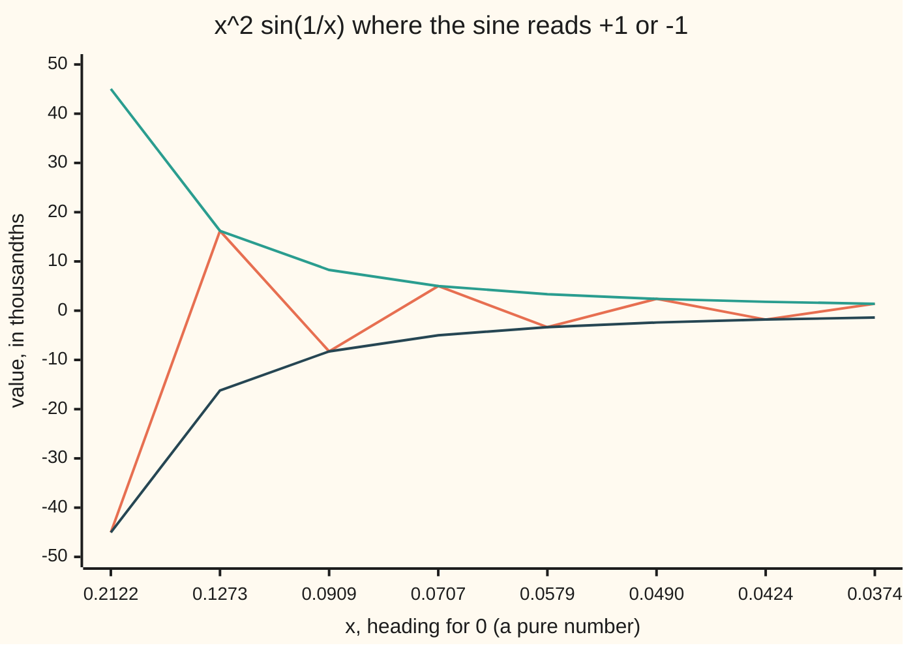

# Limit laws and the squeeze: combining limits and trapping an oscillating one

Calculus and analysis → Limits and Continuity → Algebra of limits → Limit laws and the squeeze

---

## General Overview

Take 0.1, flip it to 10, take the sine of 10, and multiply by 0.1 squared: −0.00544021. From 0.01 the same recipe gives −0.00005064; from 0.001, 0.00000083. The recipe is x squared times the sine of 1 over x. Where does it head as x heads for 0?

The sine part never settles: as x shrinks, it swings between 1 and −1 ever faster. Yet the product is pinned. A sine never leaves −1 to 1, so the product never leaves $-x^2$ to $x^2$, and both of those head for 0.

That trap is the **squeeze**. Beside it sit the **limit laws**: if two functions head for known numbers, their sum heads for the sum, their product for the product, their quotient for the quotient, provided the bottom number is not 0. The squeeze handles pieces the laws cannot touch.

**Limits pass through adding, multiplying and dividing, and a function trapped between two others that head for the same number heads there too, even when one of its own factors never settles.**

**What kind of fact this is:** a theorem, proved on this card in Why it works.

### The picture: the wobble inside the funnel



Orange: the function where its sine reads exactly −1 or +1. Green: the ceiling, x squared. Dark blue: the floor, minus x squared. In thousandths: −45.03 means −0.04503. Segments join samples; between them the function swings through 0.

---

## The formula

Reminder ([limits](01-limits.md)): $\lim_{x\to a} f(x) = L$ reads "f(x) heads for L as x heads for a".

If $\lim_{x\to a} f(x) = L$ and $\lim_{x\to a} g(x) = M$, both finite, then:

$$\lim_{x\to a}\big(f(x)+g(x)\big)=L+M,\qquad \lim_{x\to a} c\,f(x)=c\,L,\qquad \lim_{x\to a} f(x)\,g(x)=L\,M,\qquad \lim_{x\to a}\frac{f(x)}{g(x)}=\frac{L}{M}\ \text{ if } M\neq 0.$$

**Read it aloud:** the limit of a sum, multiple, product or quotient is the sum, multiple, product or quotient of the limits, as long as the bottom limit is not zero.

Subtraction follows: take c = −1 and add. The squeeze theorem: if, for every x in some window around a (a itself aside),

$$f(x)\le h(x)\le g(x)\qquad\text{and}\qquad \lim_{x\to a} f(x)=\lim_{x\to a} g(x)=L,$$

then $\lim_{x\to a} h(x) = L$.

**Read it aloud:** a function caught between a floor and a ceiling that both head for L heads for L as well.

Here $h(x) = x^2 \sin(1/x)$, floor $-x^2$, ceiling $x^2$, a = 0, L = 0.

| Symbol | Plain meaning | In our example | Push it up and the answer… |
| --- | --- | --- | --- |
| $x$ | the input, a pure number | heads for 0 | — |
| $a$ | the point x heads for | 0 | a new question |
| $f$, $g$ | functions with known limits; in the squeeze, floor and ceiling | $-x^2$, $x^2$ | a higher ceiling allows more wobble |
| $L$, $M$ | the finite numbers f and g head for | 0, 0 | the combined limit moves with them |
| $c$ | a fixed multiplier | −1 turns ceiling into floor | the limit scales with it |
| $h$ | the trapped function | $x^2 \sin(1/x)$ | — |
| $B$ | a height to beat, for an infinite limit | 1000000 | x must come closer to 0 |
| $\infty$ | "beyond every height or distance", never a number | 1/x squared at 0 | — |

### When it holds

- **Each part has a finite limit.** Otherwise the law is silent: the sine part has no limit, so the product law says nothing about $x^2 \sin(1/x)$, which still heads for 0.
- **The bottom limit is not 0.** Otherwise 0 over 0 can mean anything: see What breaks.
- **The trap holds on a whole window around a.** Eight charted points prove nothing.
- **Floor and ceiling share one limit.** The sine sits between −1 and 1, which differ, and has no limit.
- **Limits are finite.** "Infinity minus infinity" has no single value.

---

## Why it works

### Step 0: closeness is a budget that can be split

A limit is a game: name a tolerance, and some window around a keeps the output within it. Every law splits the tolerance between the parts and uses the narrower window.

### Step 1: sums, by halving the tolerance

For a sum within 0.001 of L + M, ask f and g for 0.0005 each. Inside the narrower window the errors add to at most 0.001. A multiplier c other than 0 is the same game with the tolerance divided by the size of c; c = 0 gives 0 at once.

### Step 2: products, by keeping one factor bounded

Write the error of a product in two pieces:

$$f(x)\,g(x)-L\,M = f(x)\big(g(x)-M\big)+M\big(f(x)-L\big).$$

Near a, f stays within 1 of L, so the first piece is bounded times small and the second is fixed times small. Shrink the window until each is under half the tolerance.

### Step 3: quotients, by keeping the bottom away from 0

If M is not 0, near a the bottom g(x) stays at least half as far from 0 as M. In (h(x) + 5)/(x + 2) the bottom heads for 2 and stays above 1 once x is within 1 of 0. So 1 over g(x) cannot blow up and heads for 1 over M; the product law finishes. When M is 0 that floor is missing.

### Step 4: the squeeze, by trapping the tolerance

Ask for h within 0.001 of 0. The ceiling $x^2$ is under 0.001 once x is within the square root of 0.001, 0.031623, of 0; the floor is above −0.001 there; h sits between. A grid scan of that window found the largest size of h to be 0.00092071. Tolerance 0.00001 gives window 0.003162 and largest size 0.00000984.

<details>
<summary>Detailed proof</summary>

Write ε (epsilon) for the output tolerance, δ (delta) for the input window, and take 0 < |x − a| < δ throughout.

**Sum.** Pick δ so that |f − L| < ε/2 and |g − M| < ε/2. Then |f + g − (L + M)| ≤ |f − L| + |g − M| < ε.

**Product.** Pick δ so that |f − L| < 1, hence |f| < |L| + 1; |g − M| < ε / (2(|L| + 1)); and |f − L| < ε / (2(|M| + 1)). Then |fg − LM| ≤ |f||g − M| + |M||f − L| < ε/2 + ε/2.

**Quotient.** If M ≠ 0, pick δ with |g − M| < |M|/2, so |g| > |M|/2. Then |1/g − 1/M| = |g − M| / (|g||M|) < 2|g − M| / M^2, which is under ε once |g − M| < εM^2/2. Apply the product law to f times 1/g.

**Squeeze.** Pick δ so that the trap holds, L − ε < f(x) and g(x) < L + ε. Then L − ε < f(x) ≤ h(x) ≤ g(x) < L + ε, so |h(x) − L| < ε. For the example, δ = √ε works directly: |h(x)| ≤ x^2 < ε.

</details>

### Step 5: why the product law cannot do Step 4's job

At x = 1/(π/2 + 2πn), for whole numbers n, the sine factor reads 1; at x = 1/(3π/2 + 2πn) it reads −1. Both lists crowd into 0; a scan of 0 < |x| < 0.001 met 1.000000 and −1.000000. The product law needs a limit for each factor; the squeeze needs only the range −1 to 1.

### Step 6: infinity, two different ways

An **infinite limit** is about the output. $\lim_{x\to 0} 1/x^2 = \infty$, read "1 over x squared heads for infinity", means: name any height B, and a window around 0 exists where the output beats it. For B = 1000000 the window is 0.001. No number is approached. Sides can differ: 1 over x is 1000 at x = 0.001 and −1000 at x = −0.001.

A **limit at infinity** is about the input. $\lim_{x\to\infty} 1/x = 0$ means: name a tolerance, and a cutoff exists beyond which the output stays within it. For 0.001 the cutoff is 1000, where the output is 0.001000. The laws and the squeeze carry over unchanged.

The two meet here: with t = 1/x, the sine of 1 over x near 0 is sin t far out, and it has no limit there either.

A second road runs on sequences: the outputs along any list of inputs heading for 0 are trapped the same way, and the sequence squeeze in [sequences-and-limits](03-sequences-and-limits.md) gives the same 0.

---

## Worked numbers, by hand

The squeeze settles h; the laws then carry it into (h(x) + 5)/(x + 2) as x heads for 0.

| Step | Arithmetic | Value |
| --- | --- | --- |
| limit of h | squeeze; window 0.031623 for tolerance 0.001 | 0 |
| limit of the top, h(x) + 5 | sum law: 0 + 5 | 5 |
| limit of the bottom, x + 2 | sum law: 0 + 2, not 0 | 2 |
| limit of the whole | quotient law: 5 / 2 | **2.5** |
| looking directly, x = 0.001 | (0.00000083 + 5) / 2.001 | 2.498751 |
| gap at x = 0.01, 0.001, 0.000001 | distance from 2.5 | 0.012463, 0.001249, 0.000001 |

The laws give 2.5 without evaluating anything near 0; direct evaluation closes on it.

### What breaks if you drop a piece

| Mistake | Comes out at | What went wrong |
| --- | --- | --- |
| Floor −1 and ceiling 1 around the sine alone | 1 at x = 0.0374, −1 at x = 0.0424, and so on closer in | the bounds head for different numbers |
| Quotient law with bottom limit 0 | at x = 0.001: x/x = 1, x squared over x = 0.001000, x over x squared = 1000 | 0 over 0 signals more work, not an answer |
| 1 over x called "infinity at 0" | 1000 at x = 0.001, −1000 at x = −0.001 | the sides run off in opposite directions |

The code prints all three.

---

## Code, from first principles, and it actually runs

Two roads reach the limit 0, sharing no arithmetic. Road one, the squeeze: the ceiling alone picks the window, the square root of the tolerance. Road two looks: it scans a fine grid on both sides of 0 inside that window and records the largest size of h. Chart points are computed with the sine and again from the sign pattern; the laws' 2.5 meets direct evaluation. Each assert fails when the maths is broken on purpose.

### Python

```python
# Limit laws and the squeeze -- the check behind the card.  Standard library
# only; math.sin is the one primitive.  h(x) = x^2 sin(1/x) heads for 0 as x
# heads for 0.  Road one: the squeeze bound x^2 picks the window sqrt(eps).
# Road two: a brute scan of h itself on that window, sharing no arithmetic.
import math

def h(x):
    return x * x * math.sin(1 / x)

def scan(fn, width, n=200000):          # every grid point with 0 < |x| < width
    xs = [width * k / n for k in range(1, n)]
    return [fn(s * x) for x in xs for s in (1, -1)]

for x in (0.1, 0.01, 0.001):
    print(f"x = {x}: h = {h(x):.8f}, bound x^2 = {x * x:.8f}")
worst = {}
for eps in (0.01, 0.001, 0.00001):
    delta = math.sqrt(eps)              # road one: x^2 < eps once |x| < sqrt(eps)
    worst[eps] = max(abs(v) for v in scan(h, delta))      # road two: look
    print(f"tolerance {eps:.6f}: window {delta:.6f}, largest |h| found {worst[eps]:.8f}")
sines = scan(lambda x: math.sin(1 / x), 0.001)
print(f"sin(1/x) for 0 < |x| < 0.001 reaches {max(sines):.6f} and {min(sines):.6f}")
peaks = [1 / (math.pi / 2 + n * math.pi) for n in range(1, 9)]  # sine is +1 or -1
by_sine = [h(x) for x in peaks]
by_sign = [(-1) ** n * x * x for n, x in zip(range(1, 9), peaks)]
print("chart x:                  " + ", ".join(f"{x:.4f}" for x in peaks))
print("chart h, thousandths:     " + ", ".join(f"{1000 * v:.2f}" for v in by_sine))
print("chart x^2, thousandths:   " + ", ".join(f"{1000 * x * x:.2f}" for x in peaks))
print("chart -x^2, thousandths:  " + ", ".join(f"{-1000 * x * x:.2f}" for x in peaks))
law = (0 + 5) / (0 + 2)                 # limits of the parts: h -> 0, x -> 0
direct = [(h(x) + 5) / (x + 2) for x in (0.01, 0.001, 0.000001)]
print(f"(h + 5)/(x + 2): laws give {law:.6f}; direct at 0.01, 0.001, 0.000001: "
      + ", ".join(f"{v:.6f}" for v in direct))
gaps = [abs(v - law) for v in direct]
print("gap from 2.5 at those three points: " + ", ".join(f"{g:.6f}" for g in gaps))
print(f"infinite limit: 1/x^2 at 0.001 is {1 / 0.001 ** 2:.0f}; 1/x at 0.001 and -0.001 is "
      f"{1 / 0.001:.0f} and {1 / -0.001:.0f}; at infinity: 1/x at 1000 is {1 / 1000:.6f}")
print(f"mistake, bounds -1 and 1 disagree: sin(1/x) at x = {peaks[7]:.4f} and {peaks[6]:.4f} "
      f"is {math.sin(1 / peaks[7]):.0f} and {math.sin(1 / peaks[6]):.0f}")
print(f"mistake, 0/0 at x = 0.001: x/x = {0.001 / 0.001:.0f}, x^2/x = {0.001 ** 2 / 0.001:.6f}, "
      f"x/x^2 = {0.001 / 0.001 ** 2:.0f}")
assert all(worst[e] < e for e in worst)                    # the squeeze window works
assert max(sines) > 0.999 and min(sines) < -0.999          # the factor never settles
assert all(abs(a - b) < 1e-12 for a, b in zip(by_sine, by_sign))
assert gaps[0] > gaps[1] > gaps[2] and gaps[2] < 0.00001  # looking agrees with laws
print("ALL CHECKS PASS")
```

**Ran 2026-09-27 on macOS, Python 3.14.6, standard library only. All checks passed. Output, pasted from the run:**

```
x = 0.1: h = -0.00544021, bound x^2 = 0.01000000
x = 0.01: h = -0.00005064, bound x^2 = 0.00010000
x = 0.001: h = 0.00000083, bound x^2 = 0.00000100
tolerance 0.010000: window 0.100000, largest |h| found 0.00841064
tolerance 0.001000: window 0.031623, largest |h| found 0.00092071
tolerance 0.000010: window 0.003162, largest |h| found 0.00000984
sin(1/x) for 0 < |x| < 0.001 reaches 1.000000 and -1.000000
chart x:                  0.2122, 0.1273, 0.0909, 0.0707, 0.0579, 0.0490, 0.0424, 0.0374
chart h, thousandths:     -45.03, 16.21, -8.27, 5.00, -3.35, 2.40, -1.80, 1.40
chart x^2, thousandths:   45.03, 16.21, 8.27, 5.00, 3.35, 2.40, 1.80, 1.40
chart -x^2, thousandths:  -45.03, -16.21, -8.27, -5.00, -3.35, -2.40, -1.80, -1.40
(h + 5)/(x + 2): laws give 2.500000; direct at 0.01, 0.001, 0.000001: 2.487537, 2.498751, 2.499999
gap from 2.5 at those three points: 0.012463, 0.001249, 0.000001
infinite limit: 1/x^2 at 0.001 is 1000000; 1/x at 0.001 and -0.001 is 1000 and -1000; at infinity: 1/x at 1000 is 0.001000
mistake, bounds -1 and 1 disagree: sin(1/x) at x = 0.0374 and 0.0424 is 1 and -1
mistake, 0/0 at x = 0.001: x/x = 1, x^2/x = 0.001000, x/x^2 = 1000
ALL CHECKS PASS
```

### Rust

Built with `rustc --edition 2021 -O`; the output is identical to Python's.

```rust
// Limit laws and the squeeze -- the same check as the Python, in Rust, std
// only; f64::sin is the one primitive.  h(x) = x^2 sin(1/x) heads for 0 as x
// heads for 0.  Road one: the squeeze bound x^2 picks the window sqrt(eps).
// Road two: a brute scan of h itself on that window, sharing no arithmetic.
use std::f64::consts::PI;

fn h(x: f64) -> f64 {
    x * x * (1.0 / x).sin()
}

fn scan(f: &dyn Fn(f64) -> f64, width: f64) -> Vec<f64> {
    let n = 200000; // every grid point with 0 < |x| < width
    let mut out = Vec::new();
    for k in 1..n {
        let x = width * k as f64 / n as f64;
        out.push(f(x));
        out.push(f(-x));
    }
    out
}

fn list(v: &[f64], places: usize) -> String {
    v.iter().map(|x| format!("{:.*}", places, x)).collect::<Vec<_>>().join(", ")
}

fn main() {
    for x in [0.1, 0.01, 0.001] {
        println!("x = {}: h = {:.8}, bound x^2 = {:.8}", x, h(x), x * x);
    }
    let mut worst = Vec::new();
    for eps in [0.01_f64, 0.001, 0.00001] {
        let delta = eps.sqrt(); // road one: x^2 < eps once |x| < sqrt(eps)
        let w = scan(&h, delta).iter().fold(0.0_f64, |m, v| m.max(v.abs())); // road two
        worst.push((eps, w));
        println!("tolerance {:.6}: window {:.6}, largest |h| found {:.8}", eps, delta, w);
    }
    let sines = scan(&|x: f64| (1.0 / x).sin(), 0.001);
    let top = sines.iter().cloned().fold(f64::MIN, f64::max);
    let bottom = sines.iter().cloned().fold(f64::MAX, f64::min);
    println!("sin(1/x) for 0 < |x| < 0.001 reaches {:.6} and {:.6}", top, bottom);
    let peaks: Vec<f64> = (1..9).map(|n| 1.0 / (PI / 2.0 + n as f64 * PI)).collect();
    let by_sine: Vec<f64> = peaks.iter().map(|&x| h(x)).collect();
    let by_sign: Vec<f64> = (1..9).zip(&peaks).map(|(n, &x)| if n % 2 == 0 { x * x } else { -x * x }).collect();
    let k = |v: &Vec<f64>, s: f64| v.iter().map(|x| s * 1000.0 * x).collect::<Vec<f64>>();
    let squares: Vec<f64> = peaks.iter().map(|x| x * x).collect();
    println!("chart x:                  {}", list(&peaks, 4));
    println!("chart h, thousandths:     {}", list(&k(&by_sine, 1.0), 2));
    println!("chart x^2, thousandths:   {}", list(&k(&squares, 1.0), 2));
    println!("chart -x^2, thousandths:  {}", list(&k(&squares, -1.0), 2));
    let law = (0.0 + 5.0) / (0.0 + 2.0); // limits of the parts: h -> 0, x -> 0
    let direct: Vec<f64> = [0.01, 0.001, 0.000001].iter().map(|&x| (h(x) + 5.0) / (x + 2.0)).collect();
    println!("(h + 5)/(x + 2): laws give {:.6}; direct at 0.01, 0.001, 0.000001: {}", law, list(&direct, 6));
    let gaps: Vec<f64> = direct.iter().map(|v| (v - law).abs()).collect();
    println!("gap from 2.5 at those three points: {}", list(&gaps, 6));
    println!("infinite limit: 1/x^2 at 0.001 is {:.0}; 1/x at 0.001 and -0.001 is {:.0} and {:.0}; at infinity: 1/x at 1000 is {:.6}",
        1.0 / (0.001_f64 * 0.001), 1.0 / 0.001, 1.0 / -0.001, 1.0 / 1000.0);
    println!("mistake, bounds -1 and 1 disagree: sin(1/x) at x = {:.4} and {:.4} is {:.0} and {:.0}",
        peaks[7], peaks[6], (1.0 / peaks[7]).sin(), (1.0 / peaks[6]).sin());
    println!("mistake, 0/0 at x = 0.001: x/x = {:.0}, x^2/x = {:.6}, x/x^2 = {:.0}",
        0.001 / 0.001, 0.001_f64 * 0.001 / 0.001, 0.001 / (0.001_f64 * 0.001));
    assert!(worst.iter().all(|&(e, w)| w < e)); // the squeeze window works
    assert!(top > 0.999 && bottom < -0.999); // the factor never settles
    assert!(by_sine.iter().zip(&by_sign).all(|(a, b)| (a - b).abs() < 1e-12));
    assert!(gaps[0] > gaps[1] && gaps[1] > gaps[2] && gaps[2] < 0.00001); // looking agrees with laws
    println!("ALL CHECKS PASS");
}
```

**Ran 2026-09-27 on macOS, rustc 1.98.1, no crates. All checks passed. Output, pasted from the run:**

```
x = 0.1: h = -0.00544021, bound x^2 = 0.01000000
x = 0.01: h = -0.00005064, bound x^2 = 0.00010000
x = 0.001: h = 0.00000083, bound x^2 = 0.00000100
tolerance 0.010000: window 0.100000, largest |h| found 0.00841064
tolerance 0.001000: window 0.031623, largest |h| found 0.00092071
tolerance 0.000010: window 0.003162, largest |h| found 0.00000984
sin(1/x) for 0 < |x| < 0.001 reaches 1.000000 and -1.000000
chart x:                  0.2122, 0.1273, 0.0909, 0.0707, 0.0579, 0.0490, 0.0424, 0.0374
chart h, thousandths:     -45.03, 16.21, -8.27, 5.00, -3.35, 2.40, -1.80, 1.40
chart x^2, thousandths:   45.03, 16.21, 8.27, 5.00, 3.35, 2.40, 1.80, 1.40
chart -x^2, thousandths:  -45.03, -16.21, -8.27, -5.00, -3.35, -2.40, -1.80, -1.40
(h + 5)/(x + 2): laws give 2.500000; direct at 0.01, 0.001, 0.000001: 2.487537, 2.498751, 2.499999
gap from 2.5 at those three points: 0.012463, 0.001249, 0.000001
infinite limit: 1/x^2 at 0.001 is 1000000; 1/x at 0.001 and -0.001 is 1000 and -1000; at infinity: 1/x at 1000 is 0.001000
mistake, bounds -1 and 1 disagree: sin(1/x) at x = 0.0374 and 0.0424 is 1 and -1
mistake, 0/0 at x = 0.001: x/x = 1, x^2/x = 0.001000, x/x^2 = 1000
ALL CHECKS PASS
```

> [!TIP]
> **Try changing**
> - **Drop one x from h.** Guess first: does it still head for 0? Yes, but the window must shrink to the tolerance itself, so the first assert fails.
> - **Replace the 5 with 0.** Guess first: the laws give 0, and the direct values close on 0.
> - **Replace the bottom x + 2 with x.** Guess first: the quotient law is silent, and the values grow without bound from the right.
> - **Scan the sine alone on a narrower window.** Guess first: it still reaches 1 and −1.

---

## The usual mistake

> [!warning]
> **Reading "the sine has no limit" as "the product has no limit".** When one factor does not settle, the product law says nothing either way. Here x squared crushes the wobble, and the squeeze proves the product heads for 0.
>
> - **Substituting into 0 over 0.** x/x, x squared over x, x over x squared: 1, 0.001000, 1000 at x = 0.001.
> - **Calling 1 over x "infinity at 0".** It is −1000 just left of 0.
> - **Trusting a chart.** The trap must hold on a whole window.
> - **Confusing "infinite limit" with "limit at infinity".** Output beyond every height, against input going far out.

---

## Where you meet it in real life

- **The rate of change of a wave.** The sine of a small angle over the angle heads for 1, squeezed between the cosine and 1 by the bound in [small-angles-and-the-sine-bound](../../05-Geometry%20and%20trig/03-Trigonometry/08-small-angles-and-the-sine-bound.md).
- **Damped vibrations.** A swing trapped between plus and minus e to the minus t comes to rest as time t runs on, however it oscillates.
- **Error bounds.** An error whose sign flips unpredictably is controlled by a bound on its size.
- **Polynomials.** The laws are how [continuity](05-continuity.md) covers every polynomial at once.

> **Say it back**
> Limits pass through sums, multiples, products and quotients, when every part has a finite limit and no bottom limit is 0. Each law splits the tolerance between the parts. When a part has no limit, the squeeze traps the function between a floor and a ceiling heading for one number. The sine of 1 over x never settles, but times x squared it is trapped between minus and plus x squared, so it heads for 0. An infinite limit is an output beyond every height; a limit at infinity is an input going far out.

---

## What this builds on

- [limits](01-limits.md): the tolerance game and the notation this card combines.
- [sequences-and-limits](03-sequences-and-limits.md): the same laws and squeeze for lists of numbers, and the second road in Step 6.
- [small-angles-and-the-sine-bound](../../05-Geometry%20and%20trig/03-Trigonometry/08-small-angles-and-the-sine-bound.md): the sine's range and the bound behind the sine's own squeeze.

## Where this goes next

- [continuity](05-continuity.md): a limit that equals the value; the laws carry it through sums, products and quotients.
- [intermediate-value-theorem](06-intermediate-value-theorem.md): what that continuity guarantees on a whole interval.

---

## Sources

Verified 2026-09-27: every link below resolves to the publisher's page.

- OpenStax. *Calculus Volume 1*, section 2.3, "The Limit Laws". [Publisher page](https://openstax.org/books/calculus-volume-1/pages/2-3-the-limit-laws). The laws and the squeeze theorem.
- OpenStax. *Calculus Volume 1*, section 2.5, "The Precise Definition of a Limit". [Publisher page](https://openstax.org/books/calculus-volume-1/pages/2-5-the-precise-definition-of-a-limit). Tolerance proofs of the laws; infinite limits.
- OpenStax. *Calculus Volume 1*, section 4.6, "Limits at Infinity and Asymptotes". [Publisher page](https://openstax.org/books/calculus-volume-1/pages/4-6-limits-at-infinity-and-asymptotes). Limits at infinity.
