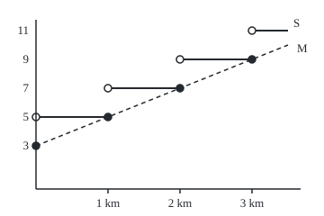

# Continuity: no jumps, no holes, and the limit is the value

[Syllabus](../../../SYLLABUS.md) → [Calculus and analysis](../README.md) → [Limits and Continuity](../README.md#s01) → Continuity

---

## General Overview

A taxi charges $3 at the kerb, then $2 for every kilometre started. At exactly 1 km the meter reads $5. One metre further it reads $7. No distance ever shows $6: the fare leaps $2 at each kilometre mark.

A second taxi charges the same $2 a kilometre, measured continuously. At 2 km it reads $7, and a few metres either side, within a cent of $7.

That second property is **continuity**. Picture a pen drawing the graph without lifting; a drawing can hide a gap, so the real definition uses limits: the value at a point is exactly what nearby values head for. The stepped fare fails at every whole kilometre; the metered fare passes everywhere.

**A function is continuous at a point when it has a value there and its nearby values head for exactly that value; sums, products and chains of continuous functions stay continuous.**

**What kind of fact this is:** a definition (continuity), with a theorem (sums, products and compositions stay continuous) proved on this card in Why it works.

### The picture: the two fares over the first 3.5 km

<p align="center"></p>

To scale: 80 pixels per kilometre, 16 pixels per dollar. Steps S are the stepped fare: a filled dot is the value shown, an open dot a value approached but not shown there. The dashed line M is the metered fare.

---

## The formula

A reminder from [Limits](01-limits.md): $\lim_{d \to a} f(d) = L$ says "f(d) heads for L as d heads for a", and the value at a plays no part. Two new marks, in words first: a small minus sign above the a, $\lim_{d \to a^-}$, means approach from below only; a small plus sign, $\lim_{d \to a^+}$, from above only. These are the **one-sided limits**.

$$f \text{ is continuous at } a \quad\text{when}\quad \lim_{d \to a} f(d) = f(a)$$

**Read it aloud:** f is continuous at a when f(d) heads for f(a) as d heads for a.

Three demands: $f(a)$ exists, the limit exists (both one-sided limits agree), and the two are equal. Continuous at every point of an interval is **continuous on the interval**; at an endpoint only the inside side counts.

The two fares, with the ceiling $\lceil d \rceil$ meaning d rounded up to a whole number:

$$S(d) = 3 + 2\lceil d \rceil, \qquad M(d) = 3 + 2d$$

The theorem: if $f$ and $g$ are continuous at a point, so are

$$f + g, \qquad f \cdot g, \qquad \text{and the chain } f(g(t)) \text{ at } t = a, \text{ if } f \text{ is continuous at } g(a).$$

**Read it aloud:** sums, products and chains of continuous functions are continuous, the outer one needing continuity where the inner one lands.

| Symbol | Plain meaning | In our example | Push it up and the answer… |
| --- | --- | --- | --- |
| $d$ | distance driven, in km | 1 km, 2 km | the fare rises |
| $a$, $L$ | the point tested; the value approached | 1 km; 5 dollars from below | — |
| $S(d)$ | stepped fare | 5 dollars at 1 km, 7 at 1.001 km | jumps 2 dollars at each whole km |
| $M(d)$ | metered fare | 7 dollars at 2 km | rises 2 dollars per km, smoothly |
| $\lceil d \rceil$ | kilometres started | 2 at 1.001 km | steps up at each whole km |
| $\lim_{d \to a^-}$, $\lim_{d \to a^+}$ | one-sided limits | 5 and 7 dollars at 1 km | — |
| $f$, $g$ | two functions continuous at the point | fare 3 + t; surge 1 + 0.05 t | — |
| $t$, $d(t)$ | minutes since pickup; distance, 0.5 t km | 4 min, 2 km | more fare |

### The four ways to fail

- **Removable (a hole).** The limit exists; the value is missing or wrong. A meter that blanks at 2 km shows $0 while both sides head for $7; setting $7 repairs it. The house fraction (x^2 − 1)/(x − 1) has no value at x = 1, though its neighbours head for 2.
- **Jump.** The one-sided limits differ: the stepped fare at 1 km, $5 from below, $7 from above. No choice of value repairs it.
- **Infinite.** The outputs grow without bound: the metered price per kilometre, M(d)/d, is $32 at 0.1 km, $302 at 0.01 km, $3002 at 0.001 km.
- **Oscillating.** The outputs swing forever, as the sine of one over d does near d = 0.

### When it holds

Continuity is a definition. The theorem needs:

- **Both parts continuous at the point.** Add anything continuous to the stepped fare and its steps survive.
- **For a chain, the outer function continuous where the inner one lands.** Distance over time fed into the stepped fare gives $7 at 4 minutes, $9 a moment later.
- **For a quotient, a nonzero denominator.** Price per kilometre blows up at the kerb; elsewhere the quotient law holds ([Limit laws and the squeeze](04-limit-laws-and-the-squeeze.md)).

---

## Why it works

### Step 0: continuity is a promise about tolerances

"Heads for" is a game: name an output tolerance, and the function wins if some input window keeps every output that close to the value at the point. Continuity is winning for every tolerance. Each rule builds a window for the combination from windows for its parts.

### Step 1: the metered fare wins, the stepped fare loses

Metered fare at 2 km, value $7, tolerance one cent. The fare moves $2 per km, so a window of 0.01 / 2 = 0.005 km, five metres, is enough; a brute-force search for the widest safe window agrees. Any tolerance works: halve it.

Stepped fare at 1 km, value $5, tolerance a generous $1. Every window contains a distance just past 1 km, and at 1.000000001 km the fare is $7. No window works: the stepped fare is not continuous at 1 km. From below it shows $5 throughout, so it is continuous from the left only.

### Step 2: sums split the tolerance

The cab covers 0.5 km a minute, so after t minutes the fare is 3 + t dollars. Add waiting at 25 cents a minute: the total is 3 + 1.25 t, which is $8 at 4 minutes.

To land the total within a cent, land each part within half a cent. The fare needs t within 0.005000 minutes, the waiting charge 0.020000; take the smaller. The widest safe window is 0.008000 minutes: a proof needs a window that works, not the widest.

### Step 3: products need a bound first

A surge multiplier rises 5% a minute, 1 + 0.05 t. The charge is fare times multiplier: 7 × 1.2 = $8.40 at 4 minutes.

A product's change is the fare's change times the multiplier, plus the fare times the multiplier's change. Keep each part within an amount h of its value, with h at most 1. The multiplier then stays below 1.2 + 1, so the product moves less than h × (7 + 1.2 + 1). For a cent, h = 0.01 / (7.00 + 1.20 + 1) = 0.001087. The fare moves $1 a minute, so t within 0.001087 minutes; the multiplier moves 0.05 a minute, so 0.022 minutes. The smaller, 0.001087 minutes, is the recipe. The quadratic formula gives the exact widest window, 0.006450 minutes, and the brute-force search agrees.

### Step 4: chains pass the window along

The fare over time is M(d(t)). For the fare to land within a cent of $7, distance must be within 0.005 km of 2 km (Step 1). For that, time must be within 0.005 / 0.5 = 0.010000 minutes of 4. The widest safe window is 0.010000 minutes: here the recipe is exact.

### Step 5: every polynomial is continuous

A constant wins the game with any window; the function returning its own input wins with a window equal to the tolerance. Every polynomial is built from these by sums and products, so every polynomial is continuous everywhere.

<details>
<summary>Detailed proof</summary>

Write ε (epsilon) for the output tolerance and δ (delta) for the input window, both positive. f is continuous at a when for every ε there is a δ with $|f(x) - f(a)| < \varepsilon$ whenever $|x - a| < \delta$. This is the limit definition with x = a also allowed, which costs nothing: f(a) is within any tolerance of itself.

**Sums.** Pick δ1 for f and δ2 for g, each with tolerance ε/2. Within the smaller, $|(f+g)(x) - (f+g)(a)| \le |f(x) - f(a)| + |g(x) - g(a)| < \varepsilon$.

**Products.** Split $f(x)g(x) - f(a)g(a)$ as $(f(x) - f(a))\,g(x) + f(a)\,(g(x) - g(a))$. Take η (eta) as the smaller of 1 and ε / (|f(a)| + |g(a)| + 1), and a window where f and g each move less than η. There |g(x)| < |g(a)| + 1, so the product moves less than η(|g(a)| + 1 + |f(a)|), at most ε.

**Compositions.** Let g be continuous at a and f at b = g(a). Given ε, f gives a window γ (gamma) around b. With γ as tolerance, g gives δ with $|g(x) - b| < \gamma$ whenever $|x - a| < \delta$. So within δ of a, f(g(x)) is within ε of f(b).

</details>

A second road: f is continuous at a exactly when it sends every sequence heading for a to one heading for f(a), so the rules follow from those for sequences ([Sequences](03-sequences-and-limits.md)).

---

## Worked numbers, by hand

The stepped fare at 1 km.

| Step | Arithmetic | Value |
| --- | --- | --- |
| just below 1 km | 1 kilometre started: 3 + 2 × 1 | $5 |
| at 1 km | still 1 started: 3 + 2 × 1 | $5 |
| just above 1 km | 2 started: 3 + 2 × 2 | $7 |
| size of the jump | 7 − 5 | **$2: a jump discontinuity** |

Below equals the value, above does not: continuous from the left only. Stopping at 1 km costs $5; one metre more costs $7.

### What breaks if you drop a piece

| Mistake | Comes out at | What went wrong |
| --- | --- | --- |
| Checking only that a limit exists | blanking meter: limit $7, value $0 | The value must equal the limit |
| Chaining into a jumping function | $7 at 4 min, $9 a moment later | The outer function jumps where the inner one lands |
| Dividing by something that reaches zero | $32, $302, $3002 per km as d shrinks | Quotients need a nonzero denominator |

The code prints each of these.

---

## Code, from first principles, and it actually runs

Two roads at every step: the stepped fare by formula and by a meter simulated metre by metre; each recipe window against a brute-force search (400 samples, 60 halvings), and the product's window by the quadratic formula too.

### Python

```python
# Continuity -- the check behind the card.  Standard library only.  Two roads
# each time: a simulated meter against the fare formula, and a brute-force
# search for the widest safe window against the recipe the proofs give.
import math

def S(d): return 3 + 2 * math.ceil(d)                # stepped fare, by formula
def M(d): return 3 + 2 * d                            # metered fare
def meter(d):                                         # stepped fare, by driving
    fare = 3                                          # $3 at the kerb, then metre by metre
    for m in range(1, round(d * 1000) + 1):
        if m % 1000 == 1: fare += 2                   # a new kilometre starts
    return fare
def widest(f, a, tol):                                # widest window around a
    ok = lambda w: all(abs(f(a + s * w * k / 200) - f(a)) < tol   # that keeps
                       for k in range(1, 201) for s in (-1, 1))   # f within tol
    lo, hi = 0.0, 1.0
    for _ in range(60):                                # bisection on the width
        mid = (lo + hi) / 2; lo, hi = (mid, hi) if ok(mid) else (lo, mid)
    return lo
DS = [0, 0.4, 1, 1.001, 2, 2.5, 3.2]
print("setup: $3 at the kerb, $2 per km (started, or metered); cab 0.5 km a minute; "
      "waiting 0.25 a minute; surge 1 + 0.05 t")
for name, f in (("formula", S), ("driving", meter)):
    print(f"stepped fare by {name} at 0, 0.4, 1, 1.001, 2, 2.5, 3.2 km:", ", ".join(str(f(d)) for d in DS))
for a in (1, 2):
    print(f"at {a} km: from the left {S(a - 1e-9):.2f}, value {S(a):.2f}, "
          f"from the right {S(a + 1e-9):.2f}, jump {S(a + 1e-9) - S(a - 1e-9):.2f}")
print("stepped fare at 1.1, 1.01, 1.001 km:", ", ".join(str(S(1 + h)) for h in (0.1, 0.01, 0.001)))
blank = lambda d: 0 if d == 2 else M(d)               # a meter that blanks at 2 km
print(f"blanking meter at 2 km: from the left {blank(2 - 1e-9):.2f}, value {blank(2):.2f}, "
      f"from the right {blank(2 + 1e-9):.2f}")
print("metered price per km at 0.1, 0.01, 0.001 km:", ", ".join(f"{M(h) / h:.2f}" for h in (0.1, 0.01, 0.001)))
w_m, w_s = widest(M, 2, 0.01), widest(S, 1, 1)
print(f"metered fare at 2 km, within $0.01: recipe {0.01 / 2:.6f} km, widest {w_m:.6f} km")
print(f"stepped fare at 1 km, within $1: some window works: {'yes' if w_s > 1e-12 else 'no'}; "
      f"fare at 1.000000001 km is {S(1.000000001)}")
fare_t = lambda t: M(0.5 * t)                         # the cab covers 0.5 km a minute
total, surge = (lambda t: fare_t(t) + 0.25 * t), (lambda t: 1 + 0.05 * t)   # waiting; surge
prod = lambda t: fare_t(t) * surge(t)
eta = 0.01 / (fare_t(4) + surge(4) + 1)               # the product proof's recipe
q = lambda c: (-1.15 + math.sqrt(1.15 ** 2 - 0.2 * (3 - c))) / 0.1   # 0.05t^2 + 1.15t + 3 = c
w_q = min(q(8.41) - 4, 4 - q(8.39))                   # the exact widest window
rows = [("composition 3 + t", fare_t, 0.01 / 2 / 0.5), ("sum 3 + 1.25 t", total, min(0.005, 0.005 / 0.25)),
        ("product (3 + t)(1 + 0.05 t)", prod, min(eta, eta / 0.05))]
print(f"sum recipe: fare within $0.005 needs {0.005:.6f} min, waiting within $0.005 needs {0.005 / 0.25:.6f} min")
print(f"product recipe: 0.01 / ({fare_t(4):.2f} + {surge(4):.2f} + 1) = {eta:.6f} min; "
      f"whole tolerance to each part instead: {min(0.01, 0.01 / 0.05):.6f} min")
wide = [widest(f, 4, 0.01) for _, f, _ in rows]
for (name, f, rec), w in zip(rows, wide):
    print(f"{name} at 4 min = {f(4):.2f}; recipe {rec:.6f} min, widest {w:.6f} min")
print(f"product widest window by the quadratic formula: {w_q:.6f} min")
print(f"stepped fare over time at 4 min: {S(0.5 * 4)}, a moment later {S(0.5 * 4.000001)}")
X, Y = (lambda d: 40 + 80 * d), (lambda f: 210 - 16 * f)
print(f"figure, 80 px per km, 16 px per dollar; step tops at y = {', '.join(f'{Y(S(k)):.0f}' for k in (1, 2, 3, 4))}; "
      f"meter line ({X(0):.0f}, {Y(M(0)):.0f}) to ({X(3.5):.0f}, {Y(M(3.5)):.0f})")
assert [meter(d) for d in DS] == [S(d) for d in DS]                 # driving = formula
assert abs(w_m - 0.01 / 2) < 1e-9 and w_s < 1e-12                   # continuous vs jump
assert all(rec <= w + 1e-12 for (_, _, rec), w in zip(rows, wide))  # recipes are safe
assert abs(wide[2] - w_q) < 1e-9                                    # two roads agree
print("ALL CHECKS PASS")
```

**Ran 2026-09-27 on macOS, Python 3.14.6, standard library only. All checks passed. Output, pasted from the run:**

```
setup: $3 at the kerb, $2 per km (started, or metered); cab 0.5 km a minute; waiting 0.25 a minute; surge 1 + 0.05 t
stepped fare by formula at 0, 0.4, 1, 1.001, 2, 2.5, 3.2 km: 3, 5, 5, 7, 7, 9, 11
stepped fare by driving at 0, 0.4, 1, 1.001, 2, 2.5, 3.2 km: 3, 5, 5, 7, 7, 9, 11
at 1 km: from the left 5.00, value 5.00, from the right 7.00, jump 2.00
at 2 km: from the left 7.00, value 7.00, from the right 9.00, jump 2.00
stepped fare at 1.1, 1.01, 1.001 km: 7, 7, 7
blanking meter at 2 km: from the left 7.00, value 0.00, from the right 7.00
metered price per km at 0.1, 0.01, 0.001 km: 32.00, 302.00, 3002.00
metered fare at 2 km, within $0.01: recipe 0.005000 km, widest 0.005000 km
stepped fare at 1 km, within $1: some window works: no; fare at 1.000000001 km is 7
sum recipe: fare within $0.005 needs 0.005000 min, waiting within $0.005 needs 0.020000 min
product recipe: 0.01 / (7.00 + 1.20 + 1) = 0.001087 min; whole tolerance to each part instead: 0.010000 min
composition 3 + t at 4 min = 7.00; recipe 0.010000 min, widest 0.010000 min
sum 3 + 1.25 t at 4 min = 8.00; recipe 0.005000 min, widest 0.008000 min
product (3 + t)(1 + 0.05 t) at 4 min = 8.40; recipe 0.001087 min, widest 0.006450 min
product widest window by the quadratic formula: 0.006450 min
stepped fare over time at 4 min: 7, a moment later 9
figure, 80 px per km, 16 px per dollar; step tops at y = 130, 98, 66, 34; meter line (40, 162) to (320, 50)
ALL CHECKS PASS
```

### Rust

Same numbers, same labels, built with `rustc --edition 2021 -O`.

```rust
// Continuity -- the same check as the Python, in Rust, std only.  Two roads
// each time: a simulated meter against the fare formula, and a brute-force
// search for the widest safe window against the recipe the proofs give.
fn s(d: f64) -> f64 { 3.0 + 2.0 * d.ceil() }          // stepped fare, by formula
fn m(d: f64) -> f64 { 3.0 + 2.0 * d }                  // metered fare
fn meter(d: f64) -> f64 {                              // stepped fare, by driving
    let mut fare = 3.0;                                // $3 at the kerb, then metre by metre
    for k in 1..=((d * 1000.0).round() as i64) {
        if k % 1000 == 1 { fare += 2.0; }              // a new kilometre starts
    }
    fare
}
fn widest(f: &dyn Fn(f64) -> f64, a: f64, tol: f64) -> f64 {
    let ok = |w: f64| (1..=200).all(|k| [-1.0, 1.0].iter().all(|sg: &f64|
        (f(a + sg * w * k as f64 / 200.0) - f(a)).abs() < tol));
    let (mut lo, mut hi) = (0.0, 1.0);
    for _ in 0..60 {                                   // bisection on the width
        let mid = (lo + hi) / 2.0;
        if ok(mid) { lo = mid } else { hi = mid }
    }
    lo
}
fn join(v: Vec<String>) -> String { v.join(", ") }
fn main() {
    let ds = [0.0, 0.4, 1.0, 1.001, 2.0, 2.5, 3.2];
    println!("setup: $3 at the kerb, $2 per km (started, or metered); cab 0.5 km a minute; waiting 0.25 a minute; surge 1 + 0.05 t");
    for (name, f) in [("formula", s as fn(f64) -> f64), ("driving", meter)] {
        println!("stepped fare by {} at 0, 0.4, 1, 1.001, 2, 2.5, 3.2 km: {}", name,
                 join(ds.iter().map(|&d| format!("{}", f(d))).collect()));
    }
    for a in [1.0, 2.0] {
        println!("at {} km: from the left {:.2}, value {:.2}, from the right {:.2}, jump {:.2}",
                 a, s(a - 1e-9), s(a), s(a + 1e-9), s(a + 1e-9) - s(a - 1e-9));
    }
    println!("stepped fare at 1.1, 1.01, 1.001 km: {}", join([0.1, 0.01, 0.001].iter().map(|h| format!("{}", s(1.0 + h))).collect()));
    let blank = |d: f64| if d == 2.0 { 0.0 } else { m(d) };  // a meter that blanks at 2 km
    println!("blanking meter at 2 km: from the left {:.2}, value {:.2}, from the right {:.2}",
             blank(2.0 - 1e-9), blank(2.0), blank(2.0 + 1e-9));
    println!("metered price per km at 0.1, 0.01, 0.001 km: {}", join([0.1, 0.01, 0.001].iter().map(|h| format!("{:.2}", m(*h) / h)).collect()));
    let (w_m, w_s) = (widest(&m, 2.0, 0.01), widest(&s, 1.0, 1.0));
    println!("metered fare at 2 km, within $0.01: recipe {:.6} km, widest {:.6} km", 0.01 / 2.0, w_m);
    println!("stepped fare at 1 km, within $1: some window works: {}; fare at 1.000000001 km is {}",
             if w_s > 1e-12 { "yes" } else { "no" }, s(1.000000001));
    let fare_t = |t: f64| m(0.5 * t);                  // the cab covers 0.5 km a minute
    let total = |t: f64| fare_t(t) + 0.25 * t;         // plus 25 cents a minute waiting
    let surge = |t: f64| 1.0 + 0.05 * t;               // a multiplier rising 5% a minute
    let prod = |t: f64| fare_t(t) * surge(t);
    let eta = 0.01 / (fare_t(4.0) + surge(4.0) + 1.0); // the product proof's recipe
    let q = |c: f64| (-1.15 + (1.15f64.powi(2) - 0.2 * (3.0 - c)).sqrt()) / 0.1;  // 0.05t^2 + 1.15t + 3 = c
    let w_q = (q(8.41) - 4.0).min(4.0 - q(8.39));      // the exact widest window
    let rows: [(&str, &dyn Fn(f64) -> f64, f64); 3] = [("composition 3 + t", &fare_t, 0.01 / 2.0 / 0.5),
        ("sum 3 + 1.25 t", &total, 0.005f64.min(0.005 / 0.25)), ("product (3 + t)(1 + 0.05 t)", &prod, eta.min(eta / 0.05))];
    println!("sum recipe: fare within $0.005 needs {:.6} min, waiting within $0.005 needs {:.6} min", 0.005, 0.005 / 0.25);
    println!("product recipe: 0.01 / ({:.2} + {:.2} + 1) = {:.6} min; whole tolerance to each part instead: {:.6} min",
             fare_t(4.0), surge(4.0), eta, 0.01f64.min(0.01 / 0.05));
    let wide: Vec<f64> = rows.iter().map(|r| widest(r.1, 4.0, 0.01)).collect();
    for (r, w) in rows.iter().zip(&wide) {
        println!("{} at 4 min = {:.2}; recipe {:.6} min, widest {:.6} min", r.0, (r.1)(4.0), r.2, w);
    }
    println!("product widest window by the quadratic formula: {:.6} min", w_q);
    println!("stepped fare over time at 4 min: {}, a moment later {}", s(0.5 * 4.0), s(0.5 * 4.000001));
    let (x, y) = (|d: f64| 40.0 + 80.0 * d, |f: f64| 210.0 - 16.0 * f);
    println!("figure, 80 px per km, 16 px per dollar; step tops at y = {}; meter line ({:.0}, {:.0}) to ({:.0}, {:.0})",
             join([1.0, 2.0, 3.0, 4.0].iter().map(|&k| format!("{:.0}", y(s(k)))).collect()), x(0.0), y(m(0.0)), x(3.5), y(m(3.5)));
    assert!(ds.iter().all(|&d| meter(d) == s(d)));                        // driving = formula
    assert!((w_m - 0.01 / 2.0).abs() < 1e-9 && w_s < 1e-12);              // continuous vs jump
    assert!(rows.iter().zip(&wide).all(|(r, w)| r.2 <= w + 1e-12));      // recipes are safe
    assert!((wide[2] - w_q).abs() < 1e-9);                                // two roads agree
    println!("ALL CHECKS PASS");
}
```

**Ran 2026-09-27 on macOS, rustc 1.98.1, no crates. All checks passed. Output, pasted from the run:**

```
setup: $3 at the kerb, $2 per km (started, or metered); cab 0.5 km a minute; waiting 0.25 a minute; surge 1 + 0.05 t
stepped fare by formula at 0, 0.4, 1, 1.001, 2, 2.5, 3.2 km: 3, 5, 5, 7, 7, 9, 11
stepped fare by driving at 0, 0.4, 1, 1.001, 2, 2.5, 3.2 km: 3, 5, 5, 7, 7, 9, 11
at 1 km: from the left 5.00, value 5.00, from the right 7.00, jump 2.00
at 2 km: from the left 7.00, value 7.00, from the right 9.00, jump 2.00
stepped fare at 1.1, 1.01, 1.001 km: 7, 7, 7
blanking meter at 2 km: from the left 7.00, value 0.00, from the right 7.00
metered price per km at 0.1, 0.01, 0.001 km: 32.00, 302.00, 3002.00
metered fare at 2 km, within $0.01: recipe 0.005000 km, widest 0.005000 km
stepped fare at 1 km, within $1: some window works: no; fare at 1.000000001 km is 7
sum recipe: fare within $0.005 needs 0.005000 min, waiting within $0.005 needs 0.020000 min
product recipe: 0.01 / (7.00 + 1.20 + 1) = 0.001087 min; whole tolerance to each part instead: 0.010000 min
composition 3 + t at 4 min = 7.00; recipe 0.010000 min, widest 0.010000 min
sum 3 + 1.25 t at 4 min = 8.00; recipe 0.005000 min, widest 0.008000 min
product (3 + t)(1 + 0.05 t) at 4 min = 8.40; recipe 0.001087 min, widest 0.006450 min
product widest window by the quadratic formula: 0.006450 min
stepped fare over time at 4 min: 7, a moment later 9
figure, 80 px per km, 16 px per dollar; step tops at y = 130, 98, 66, 34; meter line (40, 162) to (320, 50)
ALL CHECKS PASS
```

> [!TIP]
> **Try changing**
> Guess first, then run it.
> - **Round down.** Change `math.ceil` to `math.floor` in `S`: formula and meter disagree, and the first assert stops the run.
> - **Tighter tolerance.** Change `widest(M, 2, 0.01)` to `widest(M, 2, 0.001)`: the window shrinks to 0.0005 km and the second assert stops the run.
> - **No split in the sum.** Change `min(0.005, 0.005 / 0.25)` to `min(0.01, 0.01 / 0.25)`: the recipe offers 0.01 minutes, wider than the true 0.008, and the third assert stops the run.

---

## The usual mistake

> [!warning]
> **"Defined everywhere" read as "continuous".** The stepped fare has a value at every distance. Continuity asks more: at 1 km the value is $5 and the neighbours above say $7.
>
> - **A limit is not enough.** The blanking meter has limit $7 at 2 km and value $0.
> - **One side is not both.** The stepped fare is continuous from the left at 1 km, and still not continuous there.
> - **Samples are not a proof.** At whole kilometres the two fares agree; samples there cannot show the jumps.

---

## Where you meet it in real life

- **Tariffs.** Postage by weight band and parking by the started hour are step functions like the fare: continuous inside each band, jumping at each edge.
- **Root-finding.** A continuous function below zero at one end and above at the other crosses zero between ([Intermediate value theorem](06-intermediate-value-theorem.md)). The stepped fare goes from $5 to $7 and never shows $6.
- **Best and worst cases.** On a closed interval a continuous function reaches a largest and smallest value ([Extreme value theorem](07-extreme-value-theorem.md)).

> **Say it back**
> A function is continuous at a point when nearby values head for exactly its value there. It fails as a hole, a jump, a blow-up or an endless swing. Windows for the parts build a window for a sum, product or chain, so every polynomial is continuous.

---

## What this builds on

- [Limits](01-limits.md): the limit, its notation and the tolerance game continuity is built from.

## Where this goes next

- [Intermediate value theorem](06-intermediate-value-theorem.md): a continuous function takes every value between its end values.
- [The derivative](../02-Derivatives/01-the-derivative.md): a rate of change, existing only where the function is continuous.
- [Measurable functions](../../10-Measure%20and%20integration/03-Measurable%20Functions/01-measurable-functions.md): a looser class that holds the stepped fare.
- [Bounded variation](../../10-Measure%20and%20integration/11-Derivatives%20Meet%20the%20Lebesgue%20Integral/01-functions-of-bounded-variation.md): finite total up-and-down movement, jumps included.
- Limits and continuity with distances: the same game with any notion of distance.
- Continuity by pre-images, and homeomorphism: continuity with no distances at all.
- Homotopy: continuous deformations of one map into another.

---

## Sources

Verified 2026-09-27: every link below resolves to the publisher's page.

- OpenStax. *Calculus Volume 1*, section 2.4, "Continuity". [Publisher page](https://openstax.org/books/calculus-volume-1/pages/2-4-continuity). Free; the three conditions and the kinds of discontinuity.
- Abbott, Stephen. *Understanding Analysis*, 2nd ed. Springer, 2015. [Publisher page](https://link.springer.com/book/10.1007/978-1-4939-2712-8). Chapter 4 proves the combination rules in tolerance form.
- Bartle, Robert G., and Donald R. Sherbert. *Introduction to Real Analysis*, 4th ed. Wiley. [Publisher page](https://www.wiley.com/en-us/Introduction+to+Real+Analysis%2C+4th+Edition-p-9780471433316). Continuity by sequences and by tolerances.
