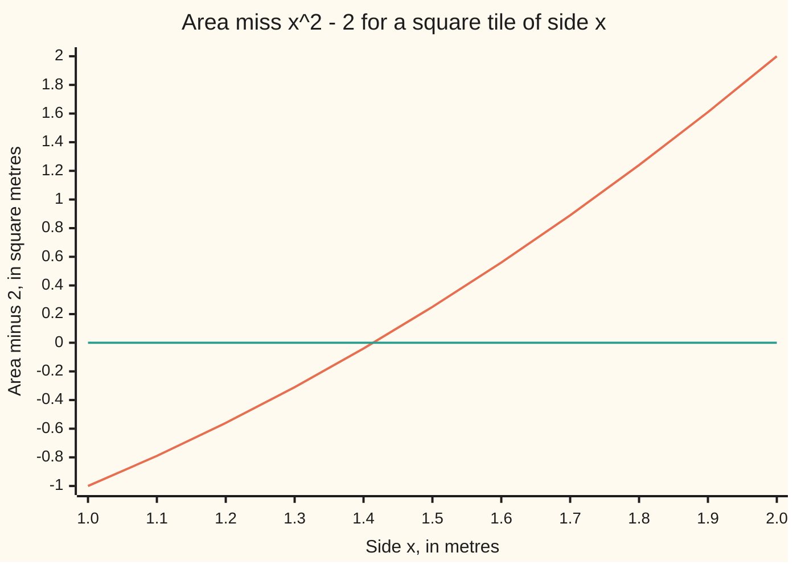

# Intermediate value theorem: a continuous function cannot skip a value

Calculus and analysis → Limits and Continuity → Roots from sign changes → Intermediate value theorem

---

## General Overview

A square tile of side 1 m covers 1 square metre. A tile of side 2 m covers 4. Somewhere between sits a side that covers exactly 2.

Measure the miss: side squared minus 2. At side 1 it is −1; at side 2 it is +2. As the side grows smoothly, the miss cannot get from below zero to above without passing through zero. That side is the square root of two, about 1.414213562373095 m.

The **intermediate value theorem** turns this into a proof. It says a continuous function (one whose graph has no jumps or holes, [continuity](05-continuity.md)) on a closed interval takes every value between its two end values. A sign change at the ends proves a root exists. Halving the interval over and over, called **bisection**, is both the proof and a way to close in on the root. How many roots there are, the theorem never says.

**A function that is continuous on a closed interval, below a target at one end and above it at the other, equals the target somewhere in between: at least once, possibly more.**

**What kind of fact this is:** a theorem, proved on this card in Why it works; the full tolerance proof is folded there.

### The picture: the miss, from side 1 to side 2



The rising line is the miss x^2 − 2 at sides 0.1 m apart; the flat line is zero. The miss is −0.04 at 1.4 and 0.25 at 1.5: the graph suggests a crossing there, the argument below proves one.

---

## The formula

$$f \text{ continuous on } [a, b], \quad y \text{ between } f(a) \text{ and } f(b) \;\Longrightarrow\; f(c) = y \text{ for some } c \text{ in } [a, b]$$

**Read it aloud:** if f has no jumps on the closed interval from a to b, then every value between f(a) and f(b) is hit by some input c in that interval.

| Symbol | Plain meaning | In our example | Push it up and the answer… |
| --- | --- | --- | --- |
| $f$ | the continuous function | the area miss x^2 − 2, square metres | — |
| $a$, $b$ | ends of the closed interval, both included | sides 1 m and 2 m | wider can catch more crossings |
| $y$ | the target, between f(a) and f(b) | 0: no miss | c moves to a larger side (f rises here) |
| $c$ | an input where f hits y; exists, location not given | 1.414213562373095 m | — |
| $n$ | halvings done so far | 12 | each one halves the bracket |
| $a_n$, $b_n$ | bracket ends after n halvings: f below target left, above right | 5792/4096 and 5793/4096 | — |
| $m$ | the midpoint, tested next | 1.5 first | — |
| $h$, $j$ | a cubic and a jump, showing the limits | x^3 − x; −1 then 1 | — |

The working form, target 0, is often named after Bernard Bolzano:

$$f(a) < 0 < f(b) \;\Longrightarrow\; f(c) = 0 \text{ for some } c \text{ in } [a, b]$$

Any target reduces to it: f hits y exactly where f − y hits zero. The bracket after n halvings has width

$$b_n - a_n = \frac{b - a}{2^n}$$

**Read it aloud:** each halving cuts the width in two; 12 halvings of [1, 2] pin the root inside a width of 1/4096.

### When it holds

- **Continuous at every point of the interval.** Drop it and a jump can skip the target: j is −1 below 1.5 and 1 from 1.5 on, changes sign on [1, 2], and is never zero.
- **A closed interval with no gaps.** The inputs must fill [a, b], ends included. On the fractions alone, x^2 − 2 changes sign on [1, 2] and never hits zero, since the square root of two is not a fraction ([supremum-and-completeness](02-supremum-and-completeness.md)).
- **Existence only.** Uniqueness needs a second fact, such as f rising the whole way.

---

## Why it works

### Step 0: keep a bracket that straddles the target, and shrink it

A bracket is an interval with f below zero at its left end and above zero at its right. Cut it at the midpoint and one half is still a bracket. The kept halves shrink onto one point, and continuity forces f to be zero there.

### Step 1: halving never loses the sign change

On [1, 2] the midpoint is 1.5 and f(1.5) = 0.25, above zero, so [1, 1.5] keeps the change. In general, if f(m) is below zero the right half is a bracket; if above, the left half; if zero, the root is found.

### Step 2: the brackets close on exactly one number

Each bracket sits inside the last, and the widths (b − a)/2^n shrink below any positive size. The real line has no gaps, so exactly one number c lies in all of them: the least upper bound, written sup, of the left ends. This is where completeness is spent; on the fractions the same brackets close on nothing.

### Step 3: at that number, f is zero

Continuity at c means f(x) heads for f(c) as x heads for c, written

$$\lim_{x \to c} f(x) = f(c).$$

For this f the tolerance game is plain arithmetic. On [1, 2], f(x) − f(c) = (x − c)(x + c), and x + c is at most 4. To land within 0.001 of f(c), stay within 0.00025 of c. The checks measure the worst case in that window: 0.000707.

Suppose f(c) were above zero. With half of f(c) as the tolerance, continuity gives a window around c where f stays above zero. Once the brackets are narrow enough the left ends a_n sit in that window, yet f is below zero at each: a contradiction. The right ends b_n rule out f(c) below zero. So f(c) = 0.

<details>
<summary>Detailed proof</summary>

Let f be continuous on [a, b], f(a) < 0 < f(b). Set a_0 = a, b_0 = b, and m = (a_n + b_n)/2. If f(m) = 0, stop: c = m. If f(m) < 0, replace a_n by m; otherwise replace b_n by m. Then f(a_n) < 0 < f(b_n) and b_n − a_n = (b − a)/2^n for every n.

The a_n rise and are bounded by b, so c = sup of the a_n exists by completeness. Every b_n bounds every a_k, so a_n ≤ c ≤ b_n: both ends lie within (b − a)/2^n of c.

Suppose f(c) > 0. Take ε = f(c)/2. Continuity at c gives δ > 0 with |f(x) − f(c)| < ε, so f(x) > 0, for every x in [a, b] with |x − c| < δ. Choose n with (b − a)/2^n < δ. Then |a_n − c| < δ, so f(a_n) > 0, against f(a_n) < 0. If f(c) < 0, take ε = −f(c)/2; the same window makes f(b_n) < 0, against f(b_n) > 0. Hence f(c) = 0.

For another target y, apply this to f − y, or to y − f if f(a) > f(b).

</details>

### Step 4: a sign change gives existence, not uniqueness

The cubic h(x) = x^3 − x is −6 at x = −2 and 6 at x = 2. It factors as x(x − 1)(x + 1): roots −1, 0 and 1. Bisection's first midpoint on [−2, 2] is 0, a root, and the method stops there, blind to the other two.

For the tile, one more fact gives uniqueness: if 1 ≤ x < z ≤ 2 then z^2 − x^2 = (z − x)(z + x) > 0, so f rises the whole way and crosses zero once. That is a property of this f, not of continuity.

Another road skips the halving: take c = sup of the inputs where f is below zero, and continuity again forbids f(c) above or below zero. The version that treats an interval as one unbroken, connected piece is connectedness-and-path-connectedness.

---

## Worked numbers, by hand

| Step | Arithmetic | Value |
| --- | --- | --- |
| ends | 1^2 − 2 and 2^2 − 2 | −1 and 2: a sign change |
| halving 1 | 1.5^2 − 2 | 0.25 above: keep [1, 1.5] |
| halving 2 | 1.25^2 − 2 | −0.4375 below: keep [1.25, 1.5] |
| halving 3 | 1.375^2 − 2 | −0.109375 below: keep [1.375, 1.5] |
| halving 4 | 1.4375^2 − 2 | 0.06640625 above: keep [1.375, 1.4375] |
| halving 12 | width 1/4096 | [5792/4096, 5793/4096] = [1.4140625, 1.414306640625] |
| best guess | the midpoint | **1.4141845703125, within 1/8192 = 0.0001220703125 of the root** |

A tile side of 1.4141845703125 m is guaranteed within 0.0001220703125 m of the side covering exactly 2 square metres.

### What breaks if you drop a piece

| Mistake | Comes out at | What went wrong |
| --- | --- | --- |
| Drop continuity: bisect the jump j | closes on 1.5, where j is 1; never 0 | a jump skips every value between −1 and 1 |
| Drop the gap-free line: halve over fractions only | 0 of the 12 midpoints squares to exactly 2 | the brackets close on a number that is not a fraction |
| Read "a root" as "the root": the cubic h on [−2, 2] | bisection returns 0; the roots are −1, 0 and 1 | a sign change promises at least one root, not one |

The code prints all three.

---

## Code, from first principles, and it actually runs

Nothing is imported. Road 1 halves in whole numbers, each side written k/4096, so every sign test is exact. Road 2 walks that grid upwards one step at a time, with no halving, until the square passes 2. Road 3 averages x and 2/x, from 1.5: if x is too big, 2/x is too small, so their average lands closer. It brackets nothing. Fifty float halvings meet road 3 to the last printed digit. The three breakers run after.

### Python

```python
# Intermediate value theorem -- the check behind the card.  Nothing is imported.
# f(x) = x*x - 2 on [1, 2]: f(1) < 0 < f(2), so a root exists.  Road 1 halves
# the bracket in exact whole numbers (x = k / 2^n); road 2 scans a grid; road 3
# averages x and 2/x again and again.  Then three functions that break the theorem.
def f(x): return x * x - 2

def bisect(g, lo, hi, steps):            # keep the half whose ends still straddle 0
    for _ in range(steps):
        m = (lo + hi) / 2
        if g(m) < 0: lo = m
        else: hi = m
    return lo, hi

print(f"f(1) = {f(1.0):.2f}, f(2) = {f(2.0):.2f}: the signs differ")
print("chart, f(x) at x = 1.0, 1.1, ..., 2.0:", " ".join(f"{f((10 + i) / 10):.2f}" for i in range(11)))
lo, hi, den, bad = 1, 2, 1, 0           # the bracket is [lo/den, hi/den], exactly
for n in range(1, 13):
    lo, hi, den = 2 * lo, 2 * hi, 2 * den
    m = lo + 1                           # the midpoint, in the finer units
    bad += m * m == 2 * den * den        # a midpoint that squares to exactly 2?
    if m * m < 2 * den * den: lo = m     # f(m) < 0, decided in whole numbers
    else: hi = m
    if n <= 4:
        print(f"halving {n}: m = {m / den:.8f}, f(m) = {f(m / den):.8f}, keep [{lo / den:.8f}, {hi / den:.8f}]")
print(f"road 1, halving 12: [{lo}/{den}, {hi}/{den}] = [{lo / den:.12f}, {hi / den:.12f}]")
print(f"midpoint {(lo + hi) / (2 * den):.13f}, root within 1/{2 * den} = {1 / (2 * den):.13f}")
k = den                                  # road 2: walk the grid k/4096 up from 1
while (k + 1) * (k + 1) < 2 * den * den: k += 1
print(f"road 2, grid scan: largest k with k*k < 2*{den}*{den} is {k}")
b50 = bisect(f, 1.0, 2.0, 50)[0]
x, heron = 1.5, []                      # road 3: average x and 2/x, from 1.5
for _ in range(4):
    x = (x + 2 / x) / 2
    heron.append(x)
print(f"50 halvings in floats: {b50:.15f}")
print("road 3, averaging from 1.5:", " ".join(f"{v:.15f}" for v in heron))
worst = max(abs(f(b50 + d) - f(b50)) for d in [0.00025 * (i - 500) / 500 for i in range(1001)])
print(f"tolerance game at the root: inputs within 0.00025 move f by at most {worst:.6f} < 0.001")
print(f"midpoints squaring to exactly 2 in 12 halvings: {bad}")
def jump(x): return -1.0 if x < 1.5 else 1.0
jl, jh = bisect(jump, 1.0, 2.0, 40)
print(f"jump: ends {jump(1.0):.0f}, {jump(2.0):.0f}; bisection closes on {jh:.10f}, where it is {jump(jh):.0f}")
def h(x): return x * x * x - x
roots = [x / 4 for x in range(-8, 9) if h(x / 4) == 0]
print(f"x^3 - x on [-2, 2]: ends {h(-2):.0f}, {h(2):.0f}; grid roots {roots}; first midpoint {(-2 + 2) / 2:.1f}")
rises = all(f((11 + i) / 10) > f((10 + i) / 10) for i in range(10))
print("f rises at every step of the grid:", "yes" if rises else "no")
assert (lo, hi) == (k, k + 1)                           # halving meets the grid scan
assert abs(b50 - heron[-1]) < 1e-15                    # halving meets averaging
assert roots == [-1.0, 0.0, 1.0]                        # the factors x, x - 1, x + 1
assert worst <= 4 * 0.00025                             # |f(x) - f(c)| <= 4|x - c|
print("ALL CHECKS PASS")
```

**Ran 2026-09-27 on macOS, Python 3.14.6, standard library only. All checks passed. Output, pasted from the run:**

```
f(1) = -1.00, f(2) = 2.00: the signs differ
chart, f(x) at x = 1.0, 1.1, ..., 2.0: -1.00 -0.79 -0.56 -0.31 -0.04 0.25 0.56 0.89 1.24 1.61 2.00
halving 1: m = 1.50000000, f(m) = 0.25000000, keep [1.00000000, 1.50000000]
halving 2: m = 1.25000000, f(m) = -0.43750000, keep [1.25000000, 1.50000000]
halving 3: m = 1.37500000, f(m) = -0.10937500, keep [1.37500000, 1.50000000]
halving 4: m = 1.43750000, f(m) = 0.06640625, keep [1.37500000, 1.43750000]
road 1, halving 12: [5792/4096, 5793/4096] = [1.414062500000, 1.414306640625]
midpoint 1.4141845703125, root within 1/8192 = 0.0001220703125
road 2, grid scan: largest k with k*k < 2*4096*4096 is 5792
50 halvings in floats: 1.414213562373095
road 3, averaging from 1.5: 1.416666666666667 1.414215686274510 1.414213562374690 1.414213562373095
tolerance game at the root: inputs within 0.00025 move f by at most 0.000707 < 0.001
midpoints squaring to exactly 2 in 12 halvings: 0
jump: ends -1, 1; bisection closes on 1.5000000000, where it is 1
x^3 - x on [-2, 2]: ends -6, 6; grid roots [-1.0, 0.0, 1.0]; first midpoint 0.0
f rises at every step of the grid: yes
ALL CHECKS PASS
```

### Rust

Same numbers, same labels, built with `rustc --edition 2021 -O`.

```rust
// Intermediate value theorem -- the same check as the Python, in Rust.  No crates.
// f(x) = x*x - 2 on [1, 2]: f(1) < 0 < f(2), so a root exists.  Road 1 halves
// the bracket in exact whole numbers (x = k / 2^n); road 2 scans a grid; road 3
// averages x and 2/x again and again.  Then three functions that break the theorem.
fn f(x: f64) -> f64 { x * x - 2.0 }

fn bisect(g: &dyn Fn(f64) -> f64, mut lo: f64, mut hi: f64, steps: u32) -> (f64, f64) {
    for _ in 0..steps {                  // keep the half whose ends still straddle 0
        let m = (lo + hi) / 2.0;
        if g(m) < 0.0 { lo = m } else { hi = m }
    }
    (lo, hi)
}

fn jump(x: f64) -> f64 { if x < 1.5 { -1.0 } else { 1.0 } }
fn h(x: f64) -> f64 { x * x * x - x }

fn main() {
    println!("f(1) = {:.2}, f(2) = {:.2}: the signs differ", f(1.0), f(2.0));
    let chart: Vec<String> = (0..11).map(|i| format!("{:.2}", f((10 + i) as f64 / 10.0))).collect();
    println!("chart, f(x) at x = 1.0, 1.1, ..., 2.0: {}", chart.join(" "));
    let (mut lo, mut hi, mut den, mut bad): (i64, i64, i64, i64) = (1, 2, 1, 0);
    for n in 1..=12 {                    // the bracket is [lo/den, hi/den], exactly
        lo *= 2; hi *= 2; den *= 2;
        let m = lo + 1;                  // the midpoint, in the finer units
        if m * m == 2 * den * den { bad += 1 }
        if m * m < 2 * den * den { lo = m } else { hi = m }
        if n <= 4 {
            let (x, d) = (m as f64, den as f64);
            println!("halving {}: m = {:.8}, f(m) = {:.8}, keep [{:.8}, {:.8}]",
                     n, x / d, f(x / d), lo as f64 / d, hi as f64 / d);
        }
    }
    let d = den as f64;
    println!("road 1, halving 12: [{}/{}, {}/{}] = [{:.12}, {:.12}]", lo, den, hi, den, lo as f64 / d, hi as f64 / d);
    println!("midpoint {:.13}, root within 1/{} = {:.13}", (lo + hi) as f64 / (2.0 * d), 2 * den, 1.0 / (2.0 * d));
    let mut k = den;                     // road 2: walk the grid k/4096 up from 1
    while (k + 1) * (k + 1) < 2 * den * den { k += 1 }
    println!("road 2, grid scan: largest k with k*k < 2*{}*{} is {}", den, den, k);
    let b50 = bisect(&f, 1.0, 2.0, 50).0;
    let (mut x, mut heron) = (1.5_f64, Vec::new());
    for _ in 0..4 {                      // road 3: average x and 2/x, from 1.5
        x = (x + 2.0 / x) / 2.0;
        heron.push(x);
    }
    println!("50 halvings in floats: {:.15}", b50);
    let nw: Vec<String> = heron.iter().map(|v| format!("{:.15}", v)).collect();
    println!("road 3, averaging from 1.5: {}", nw.join(" "));
    let worst = (0..1001).map(|i| 0.00025 * (i - 500) as f64 / 500.0)
        .map(|dx| (f(b50 + dx) - f(b50)).abs()).fold(0.0_f64, f64::max);
    println!("tolerance game at the root: inputs within 0.00025 move f by at most {:.6} < 0.001", worst);
    println!("midpoints squaring to exactly 2 in 12 halvings: {}", bad);
    let jh = bisect(&jump, 1.0, 2.0, 40).1;
    println!("jump: ends {:.0}, {:.0}; bisection closes on {:.10}, where it is {:.0}", jump(1.0), jump(2.0), jh, jump(jh));
    let roots: Vec<f64> = (-8..9).map(|i| i as f64 / 4.0).filter(|&x| h(x) == 0.0).collect();
    println!("x^3 - x on [-2, 2]: ends {:.0}, {:.0}; grid roots {:?}; first midpoint {:.1}", h(-2.0), h(2.0), roots, (-2.0 + 2.0) / 2.0);
    let rises = (0..10).all(|i| f((11 + i) as f64 / 10.0) > f((10 + i) as f64 / 10.0));
    println!("f rises at every step of the grid: {}", if rises { "yes" } else { "no" });
    assert!((lo, hi) == (k, k + 1));                    // halving meets the grid scan
    assert!((b50 - heron[3]).abs() < 1e-15);           // halving meets averaging
    assert!(roots == vec![-1.0, 0.0, 1.0]);             // the factors x, x - 1, x + 1
    assert!(worst <= 4.0 * 0.00025);                    // |f(x) - f(c)| <= 4|x - c|
    println!("ALL CHECKS PASS");
}
```

**Ran 2026-09-27 on macOS, rustc 1.98.1, no crates. All checks passed. Output, pasted from the run:**

```
f(1) = -1.00, f(2) = 2.00: the signs differ
chart, f(x) at x = 1.0, 1.1, ..., 2.0: -1.00 -0.79 -0.56 -0.31 -0.04 0.25 0.56 0.89 1.24 1.61 2.00
halving 1: m = 1.50000000, f(m) = 0.25000000, keep [1.00000000, 1.50000000]
halving 2: m = 1.25000000, f(m) = -0.43750000, keep [1.25000000, 1.50000000]
halving 3: m = 1.37500000, f(m) = -0.10937500, keep [1.37500000, 1.50000000]
halving 4: m = 1.43750000, f(m) = 0.06640625, keep [1.37500000, 1.43750000]
road 1, halving 12: [5792/4096, 5793/4096] = [1.414062500000, 1.414306640625]
midpoint 1.4141845703125, root within 1/8192 = 0.0001220703125
road 2, grid scan: largest k with k*k < 2*4096*4096 is 5792
50 halvings in floats: 1.414213562373095
road 3, averaging from 1.5: 1.416666666666667 1.414215686274510 1.414213562374690 1.414213562373095
tolerance game at the root: inputs within 0.00025 move f by at most 0.000707 < 0.001
midpoints squaring to exactly 2 in 12 halvings: 0
jump: ends -1, 1; bisection closes on 1.5000000000, where it is 1
x^3 - x on [-2, 2]: ends -6, 6; grid roots [-1.0, 0.0, 1.0]; first midpoint 0.0
f rises at every step of the grid: yes
ALL CHECKS PASS
```

> [!TIP]
> **Try changing**
> - **Guess first:** run 4 halvings instead of 12. The bracket is [1.375, 1.4375], and its midpoint is right only in the first decimal place.
> - **Guess first:** move the jump in j elsewhere inside [1, 2]. Bisection closes on the new jump point; j is still never zero.
> - **Guess first:** bisect the cubic on [−2, 3]. The first midpoint is no root; the method closes on 1, not 0. The root found depends on the start.

---

## The usual mistake

> [!warning]
> **Treating a sign change as proof of exactly one root.** The theorem gives at least one. The cubic x^3 − x is −6 at −2 and 6 at 2, yet has three roots; bisection reports only 0. Uniqueness takes a separate fact.
>
> - **Bisecting a function with a jump.** The jump j still yields a closing bracket, on 1.5, where j is 1: a point that is no root.
> - **Reading the graph as the proof.** The chart shows −0.04 at 1.4 and 0.25 at 1.5; eleven dots say nothing about the gaps between them. The proof is the bracket argument.
> - **Taking the midpoint as exact.** After 12 halvings the answer is 1.4141845703125 give or take 0.0001220703125, not a value of the square root of two.

---

## Where you meet it in real life

- **Implied volatility.** An option's price rises continuously with volatility; if a low volatility prices below the market and a high one above, some volatility matches the market exactly ([implied-volatility](../../12-Financial%20mathematics/11-Implied%20volatility%20and%20the%20vanilla%20inverses/01-implied-volatility.md)).
- **Safe root-finding.** Solvers keep a bracket so they cannot lose the root; halving is the fallback inside faster methods (bisection-and-bracketing).
- **Desk inverses.** A strike from a quoted delta, a barrier from a target premium: each runs a continuous price backwards, and a sign change proves the answer exists before the search ([fx-strike-from-delta](../../12-Financial%20mathematics/21-FX%20vanilla%20options%20-%20Garman-Kohlhagen%20and%20the%20desk%20conventions/06-fx-strike-from-delta.md)).

> **Say it back**
> A continuous function on a closed interval takes every value between its end values. The tile's miss x^2 − 2 is −1 at side 1 and 2 at side 2, so it is zero somewhere between. Halving keeps a bracket, the gap-free real line supplies one point inside all brackets, and continuity forces zero there. A jump or a missing number breaks the argument. The promise is at least one root, not exactly one.

---

## What this builds on

- [continuity](05-continuity.md): no jumps, stated as a limit; the fact that forces f(c) = 0.
- [supremum-and-completeness](02-supremum-and-completeness.md): the real line has no gaps, so the shrinking brackets close on a real number.

## Where this goes next

- [extreme-value-theorem](07-extreme-value-theorem.md): the same hypotheses give a highest and a lowest value.
- [root-finding-for-inverses](../../12-Financial%20mathematics/07-Greeks%20by%20Numbers%20and%20Calibration/05-root-finding-for-inverses.md): solvers that run a price backwards.
- [implied-volatility](../../12-Financial%20mathematics/11-Implied%20volatility%20and%20the%20vanilla%20inverses/01-implied-volatility.md): its existence is this theorem.
- [implied-volatility-by-newton-and-bisection](../../12-Financial%20mathematics/11-Implied%20volatility%20and%20the%20vanilla%20inverses/02-implied-volatility-by-newton-and-bisection.md): roads 1 and 3, on an option price.
- [barrier-inverses-level-and-volatility](../../12-Financial%20mathematics/16-Barriers%2C%20touches%20and%20lookbacks/07-barrier-inverses-level-and-volatility.md): a barrier level or volatility, solved for.
- [fx-strike-from-delta](../../12-Financial%20mathematics/21-FX%20vanilla%20options%20-%20Garman-Kohlhagen%20and%20the%20desk%20conventions/06-fx-strike-from-delta.md): the strike that gives a quoted delta.
- [market-strangle-and-smile-strangle](../../12-Financial%20mathematics/22-The%20FX%20smile%20-%20risk%20reversals%2C%20butterflies%20and%20vanna-volga/02-market-strangle-and-smile-strangle.md): matching a quoted strangle.
- [barrier-level-from-a-target-premium](../../12-Financial%20mathematics/23-FX%20exotics%20as%20desks%20use%20them%20-%20digitals%2C%20touches%20and%20barriers/08-barrier-level-from-a-target-premium.md): the barrier that hits a premium.
- [implied-correlation-from-a-quanto](../../12-Financial%20mathematics/24-Quantos%20and%20composites/05-implied-correlation-from-a-quanto.md): correlation from a quanto price.
- [implied-correlation-from-a-spread-option](../../12-Financial%20mathematics/26-Options%20on%20commodity%20futures%20and%20spreads/06-implied-correlation-from-a-spread-option.md): correlation from a spread option.
- bisection-and-bracketing: halving as an algorithm, with stopping rules.
- connectedness-and-path-connectedness: the property of an interval the proof uses.
- images-of-compact-and-connected-sets: the theorem in general form.

The theorem fills in every value between the end values but says nothing about values beyond them; whether a highest and a lowest are actually reached is [extreme-value-theorem](07-extreme-value-theorem.md).

---

## Sources

Verified 2026-09-27: every link below resolves to the publisher's page.

- OpenStax. *Calculus Volume 1*, section 2.4, "Continuity". [Publisher page](https://openstax.org/books/calculus-volume-1/pages/2-4-continuity). Free; states the theorem and uses it to show roots exist.
- Abbott, Stephen. *Understanding Analysis*, 2nd ed. Springer, 2015. [Publisher page](https://link.springer.com/book/10.1007/978-1-4939-2712-8). Proves the theorem by nested intervals and by the least upper bound, and explains why completeness is needed.
- O'Connor, J. J., and E. F. Robertson. "Bernard Bolzano." MacTutor Archive, University of St Andrews. [Biography](https://mathshistory.st-andrews.ac.uk/Biographies/Bolzano/). Bolzano's 1817 "purely analytic proof" of the theorem, without appeal to a drawn curve.
