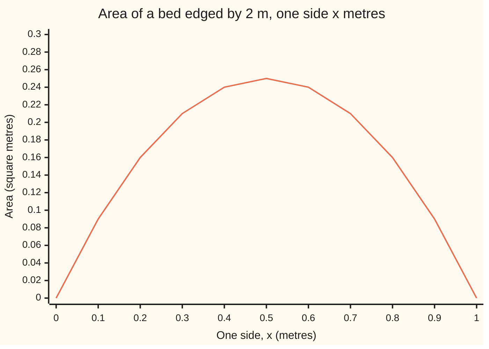

# Extreme value theorem: a continuous function on a closed interval hits a highest and a lowest value

[Syllabus](../../../SYLLABUS.md) → [Calculus and analysis](../README.md) → [Limits and Continuity](../README.md#s01) → Extreme value theorem

---

## General Overview

A gardener has 2 metres of edging for a rectangular bed. Two neighbouring sides share 1 metre, so if one side is x metres the other is 1 − x. The area is x(1 − x) square metres: 0.21 at x = 0.3, 0.24 at x = 0.4, 0.25 at x = 0.5, a square. The ends, x = 0 and x = 1, are flat beds of area 0, kept as boundary cases.

Now forbid the flat beds and ask for the longest side a bed can have. A side of 0.9 metres is beaten by 0.95, which is beaten by 0.995. No side wins; the lengths creep toward 1 and never arrive.

The difference is whether the allowed inputs include their ends. The extreme value theorem says when a best and a worst input must exist, for a **continuous** function: one where nearby inputs give nearby outputs, with no jumps ([Continuity](05-continuity.md)).

**A function that is continuous on a closed interval, both ends included and both finite, takes a largest value and a smallest value at inputs in that interval, ends allowed.**

**What kind of fact this is:** a theorem, proved on this card in Why it works; locating the top is a separate calculation.

### The picture: the bed's area, side by side



The line is the area x(1 − x), sampled every 0.1 metres, peaking at 0.25 over x = 0.5. The picture suggests a top; the proof guarantees one.

---

## The formula

Notation first. Square brackets, as in $[a,b]$, mean an interval including both ends; round brackets, as in (0, 1), leave the ends out. $\sup$ is the least upper bound of a set of numbers ([No gaps](02-supremum-and-completeness.md)): the smallest number nothing in the set exceeds, not always a member.

If $f$ is continuous at every point of $[a,b]$ (at an end, judged from inside only), with $a$ and $b$ finite and $a \le b$, then there are inputs $c$ and $d$ in $[a,b]$ with

$$f(d) \le f(x) \le f(c) \quad \text{for every } x \text{ in } [a,b].$$

**Read it aloud:** some allowed input gives an output nothing beats, and some allowed input gives an output nothing undercuts.

The top is $M = f(c)$, the bottom $m = f(d)$: actual outputs, not bounds only approached. For the bed:

$$f(x) = x(1-x) = \tfrac14 - \left(x - \tfrac12\right)^2, \qquad 0 \le x \le 1.$$

The proof uses a sequence $x_n$, a list of inputs with $n$ as its clock ([Sequences](03-sequences-and-limits.md)). A **subsequence** keeps infinitely many terms, in order, and drops the rest; its k-th kept term is $x_{n_k}$, where $n_k$ is its position in the original list.

| Symbol | Plain meaning | In our example | Push it up and the answer… |
| --- | --- | --- | --- |
| $f$ | the rule from input to output | side in metres to area in square metres | — |
| $x$ | one allowed input | one side of the bed, in metres | area rises to x = 0.5, then falls |
| $a$, $b$ | the interval's ends, both included | 0 and 1 metre | a wider interval can raise the top |
| $c$, $d$ | inputs giving the top and the bottom | c = 0.5; d = 0 or d = 1 | found, not set |
| $M$, $m$, $\sup$ | top and bottom values; $M$ is the $\sup$ of all outputs | 0.25 and 0 square metres | — |
| $x_n$, $n$ | a list of inputs and its clock | grid bests 0.333333, 0.444444 | later terms |
| $x_{n_k}$, $n_k$, $k$ | a subsequence, a kept term's old position, the new clock | every other term: $n_k$ = 2k − 1 | — |
| $g$ | the side itself, $g(x) = x$, on (0, 1) | 0.9 is beaten by 0.95 | has no top |

### When it holds

- **Continuous everywhere, ends included.** Otherwise the top can be skipped: a rule equal to x below 1 and 0 at x = 1 reaches 0.999, never 1.
- **Both ends included.** Otherwise the top escapes through the gap: $g(x) = x$ on (0, 1) has no largest value.
- **Both ends finite.** Otherwise outputs can run away: x(1 − x) on [0, infinity) has no bottom, since f(100) = −9900.
- **Real numbers, with no gaps.** On fractions alone, the point a list piles up at can be missing: on the fractions from 1 to 2, −(x^2 − 2)^2 nears 0 but never reaches it, since no fraction squares to 2.

---

## Why it works

### Step 0: a trapped list must pile up somewhere inside

Inputs with outputs climbing toward the highest cannot escape a closed, bounded interval, so some crowd toward one point of it. Continuity carries their outputs to that point's output: the top.

### Step 1: every list inside the interval has a settling subsequence

A list need not settle: the flat beds give 0, 1, 0, 1, …, but every other term gives 0, 0, 0, …, settled.

Halving always finds such a subsequence. Cut $[a,b]$ into closed halves. One holds terms at infinitely many positions, or the list would be finite. Keep it; halve again. The kept halves nest and shrink, and the real numbers have no gaps, so they close down on one point, c. Pick one term from each kept half, each later in the list than the last. The picks head for c, and c is in $[a,b]$ because the halves kept their ends. This is the Bolzano–Weierstrass theorem.

### Step 2: continuity carries a settling list to the right output

Continuity at c means outputs head for $f(c)$ whenever inputs head for c. On the bed at 0.5: to keep the area within 0.001 of the top, keep x within 0.0316 of 0.5, since the shortfall is the square of the distance. A subsequence settling at c eventually stays within every such distance, so its outputs settle at $f(c)$.

### Step 3: the outputs cannot run off

Suppose the outputs had no upper bound. Then some input has output above 1, another above 2, and so on. Step 1 gives a subsequence of those inputs settling at some c in the interval; Step 2 sends their outputs to the single number $f(c)$. Yet they pass every whole number. So the outputs are bounded above; the same argument on $-f$, every output's sign flipped, bounds them below.

### Step 4: the least upper bound is an actual output

Bounded outputs have a least upper bound, $M$, the $\sup$ of all outputs. For each n some input has output within 1/n of M, or a smaller number would be an upper bound. Step 1 gives a subsequence of those inputs settling at some c in $[a,b]$; Step 2 sends its outputs to $f(c)$. They also head for M. A list heads for one number only, so $f(c) = M$: the top is attained. Applying this to $-f$ gives the bottom.

On the bed, grids of step 1/3, 1/9, 1/27 give best inputs 0.333333, 0.444444, 0.481481 with areas 0.222222, 0.246914, 0.249657, climbing toward 0.25: the kind of list Step 4 uses.

<details>
<summary>Detailed proof</summary>

Let $f$ be continuous on $[a,b]$, with $a < b$ finite; if $a = b$ the one output is both extremes.

**Bolzano–Weierstrass.** For $x_n$ in $[a,b]$, keep closed halves as in Step 1; the k-th has width $(b-a)/2^k$. Let $c$ be the supremum of their left ends, which lies in every kept half. With $n_1 < n_2 < \cdots$ and $x_{n_k}$ in the k-th half, $\lvert x_{n_k} - c\rvert \le (b-a)/2^k$, which heads for 0.

**Continuity.** Given $\varepsilon > 0$, continuity at c gives $\delta > 0$ with $\lvert f(x) - f(c)\rvert < \varepsilon$ when $\lvert x - c\rvert < \delta$. Eventually $\lvert x_{n_k} - c\rvert < \delta$, so $f(x_{n_k})$ converges to $f(c)$.

**Bounded.** If not, pick $x_n$ with $f(x_n) > n$. A subsequence converges to c in $[a,b]$, so $f(x_{n_k})$ converges to $f(c)$; yet $f(x_{n_k}) > n_k \ge k$, and a convergent sequence is bounded.

**Attained.** Let $M = \sup\{f(x) : x \in [a,b]\}$. For each n pick $x_n$ with $M - 1/n < f(x_n) \le M$. A subsequence converges to c in $[a,b]$. Then $f(x_{n_k})$ converges to $f(c)$ and to M, and limits are unique, so $f(c) = M$. For the minimum apply this to $-f$: its maximum $-m$ is attained at some d, so $f(d) = m$.

</details>

### Step 5: finding the top is a separate job

The theorem says a top exists, not where. For the bed, algebra finds it: $x(1-x) = \tfrac14 - (x - \tfrac12)^2$, and a square is never negative, so the area is at most 0.25, reached only at x = 0.5. Both factors are at least 0, so the bottom is 0, at the ends.

The same proof works on any **compact** set, one where every list has a subsequence settling inside it; continuous images of compact sets are compact (What compactness and connectedness buy).

---

## Worked numbers, by hand

| Step | Arithmetic | Value |
| --- | --- | --- |
| Try x = 0.3 m | 0.3 × 0.7 | 0.21 square metres |
| Rewrite the area | x(1 − x) = 1/4 − (x − 1/2)^2 | 0.25 minus a square |
| Bound it | the square is never negative | at most 0.25 |
| Attain the bound | the square is 0 at x = 0.5 | **top 0.25 square metres at x = 0.5 m** |
| The bottom | x and 1 − x both at least 0 | **0 at x = 0 and at x = 1** |
| Tolerance at the top | shortfall h^2 < 0.001 | h < 0.0316 m |

### What breaks if you drop a piece

| Mistake | Comes out at | What went wrong |
| --- | --- | --- |
| A coarse grid's best read as the top | 0.222222 at x = 0.333333 | Step 1/3 never lands on 0.5 |
| Dropping the ends: $g(x) = x$ on (0, 1) | 0.9 beaten by 0.95, 0.999 by 0.9995 | The top 1 is never an output |
| A jump: x below 1, 0 at x = 1 | 0.999 at x = 0.999, 0 at x = 1 | Not continuous at 1; the top 1 is skipped |
| No right end: x(1 − x) on [0, infinity) | f(10) = −90, f(100) = −9900 | No bottom |

The code prints all four.

---

## Code, from first principles, and it actually runs

Two roads to the top. Road 1 is brute force on grids of step 1/N for N = 3, 9, 27, 81, 243, none containing 0.5. Road 2 is the completed square, checked in whole numbers at 1001 points; it predicts each grid's gap as (1/(2N))^2, since the best grid point sits 1/(2N) from 0.5. A scan plays the tolerance game; the failures from What breaks are printed.

### Python

```python
# Extreme value theorem -- the check behind the card.  Standard library only.
# The bed: sides x and 1 - x metres, area f(x) = x(1 - x) square metres, x in [0, 1].
# Road 1 hunts the top by brute force on finer and finer grids.  Road 2 completes
# the square, in whole numbers, so no rounding can hide a miss.

def f(x):
    return x * (1 - x)

def best_on_grid(n):                     # first k in 0..n with the largest k(n - k)
    best = 0
    for k in range(n + 1):
        if k * (n - k) > best * (n - best):
            best = k
    return best

print("chart, 2 m of edging, sides x and 1-x, area at x = 0.0, 0.1, ..., 1.0:", " ".join(f"{f(k / 10):.2f}" for k in range(11)))
print("road 1, grids of step 1/N; an odd N never lands on x = 0.5")
gaps = []
for n in (3, 9, 27, 81, 243):
    k = best_on_grid(n)
    area = k * (n - k) / (n * n)
    gap, algebra = 0.25 - area, (1 / (2 * n)) ** 2
    gaps.append((gap, algebra))
    print(f"N = {n:<3}  best x {k / n:.6f}  area {area:.6f}  short of 0.25 by {gap:.6f}  (1/(2N))^2 = {algebra:.6f}")
square = [250000 - (k - 500) ** 2 for k in range(1001)]   # 1/4 - (x - 1/2)^2, times 1000^2
product = [k * (1000 - k) for k in range(1001)]            # x(1 - x), times 1000^2
top, low = max(product), min(product)
print(f"road 2, x(1-x) = 1/4 - (x - 1/2)^2 at all 1001 points k/1000: {'yes' if product == square else 'no'}")
print(f"largest area {top / 1e6:.2f} at x = {product.index(top) / 1000:.1f}; smallest {low / 1e6:.2f} at x = "
      + " and ".join(f"{k / 1000:.0f}" for k in range(1001) if product[k] == low))
h = 0
while f(0.5) - f(0.5 + (h + 1) * 1e-6) < 0.001:            # widest step still inside the tolerance
    h += 1
print(f"tolerance game: area within 0.001 of the top needs x within {h * 1e-6:.4f} of 0.5; sqrt(0.001) = {0.001 ** 0.5:.4f}")
print("open interval, g(x) = x on (0,1): " + ", ".join(f"{c} beaten by {(c + 1) / 2}" for c in (0.9, 0.99, 0.999))
      + "; the top 1 is never an output")
jump = lambda x: x if x < 1 else 0.0
print(f"jump on [0,1], x below 1 and 0 at x = 1: value {jump(0.999)} at x = 0.999, value {jump(1.0):.0f} at x = 1")
print(f"x(1-x) on [0, infinity): top 0.25 kept; f(10) = {f(10):.0f}, f(100) = {f(100):.0f}, no bottom")
assert all(abs(g - a) < 1e-12 for g, a in gaps)             # grid miss equals the algebra's miss
assert product == square                                    # two formulas, one function, exactly
assert product.index(top) == 500 and square[500] == top     # brute-force top sits where the square says
assert abs(h * 1e-6 - 0.001 ** 0.5) < 1e-6                  # scan agrees with sqrt(0.001)
print("ALL CHECKS PASS")
```

**Ran 2026-09-27 on macOS, Python 3.14.6, standard library only. All checks passed. Output, pasted from the run:**

```
chart, 2 m of edging, sides x and 1-x, area at x = 0.0, 0.1, ..., 1.0: 0.00 0.09 0.16 0.21 0.24 0.25 0.24 0.21 0.16 0.09 0.00
road 1, grids of step 1/N; an odd N never lands on x = 0.5
N = 3    best x 0.333333  area 0.222222  short of 0.25 by 0.027778  (1/(2N))^2 = 0.027778
N = 9    best x 0.444444  area 0.246914  short of 0.25 by 0.003086  (1/(2N))^2 = 0.003086
N = 27   best x 0.481481  area 0.249657  short of 0.25 by 0.000343  (1/(2N))^2 = 0.000343
N = 81   best x 0.493827  area 0.249962  short of 0.25 by 0.000038  (1/(2N))^2 = 0.000038
N = 243  best x 0.497942  area 0.249996  short of 0.25 by 0.000004  (1/(2N))^2 = 0.000004
road 2, x(1-x) = 1/4 - (x - 1/2)^2 at all 1001 points k/1000: yes
largest area 0.25 at x = 0.5; smallest 0.00 at x = 0 and 1
tolerance game: area within 0.001 of the top needs x within 0.0316 of 0.5; sqrt(0.001) = 0.0316
open interval, g(x) = x on (0,1): 0.9 beaten by 0.95, 0.99 beaten by 0.995, 0.999 beaten by 0.9995; the top 1 is never an output
jump on [0,1], x below 1 and 0 at x = 1: value 0.999 at x = 0.999, value 0 at x = 1
x(1-x) on [0, infinity): top 0.25 kept; f(10) = -90, f(100) = -9900, no bottom
ALL CHECKS PASS
```

### Rust

Same numbers, same labels, built with `rustc --edition 2021 -O`.

```rust
// Extreme value theorem -- the same check as the Python, in Rust.  No crates.
// The bed: sides x and 1 - x metres, area f(x) = x(1 - x) square metres, x in [0, 1].
// Road 1 hunts the top by brute force on finer and finer grids.  Road 2 completes
// the square, in whole numbers, so no rounding can hide a miss.

fn f(x: f64) -> f64 { x * (1.0 - x) }

fn best_on_grid(n: i64) -> i64 {                  // first k in 0..n with the largest k(n - k)
    let mut best = 0;
    for k in 0..=n {
        if k * (n - k) > best * (n - best) { best = k }
    }
    best
}

fn main() {
    let chart: Vec<String> = (0..11).map(|k| format!("{:.2}", f(k as f64 / 10.0))).collect();
    println!("chart, 2 m of edging, sides x and 1-x, area at x = 0.0, 0.1, ..., 1.0: {}", chart.join(" "));
    println!("road 1, grids of step 1/N; an odd N never lands on x = 0.5");
    let mut gaps: Vec<(f64, f64)> = Vec::new();
    for n in [3i64, 9, 27, 81, 243] {
        let k = best_on_grid(n);
        let area = (k * (n - k)) as f64 / (n * n) as f64;
        let (gap, algebra) = (0.25 - area, (1.0 / (2.0 * n as f64)).powi(2));
        gaps.push((gap, algebra));
        println!("N = {:<3}  best x {:.6}  area {:.6}  short of 0.25 by {:.6}  (1/(2N))^2 = {:.6}",
                 n, k as f64 / n as f64, area, gap, algebra);
    }
    let square: Vec<i64> = (0..=1000).map(|k: i64| 250000 - (k - 500) * (k - 500)).collect();
    let product: Vec<i64> = (0..=1000).map(|k: i64| k * (1000 - k)).collect();
    let top = *product.iter().max().unwrap();
    let low = *product.iter().min().unwrap();
    let top_at = product.iter().position(|&p| p == top).unwrap();
    println!("road 2, x(1-x) = 1/4 - (x - 1/2)^2 at all 1001 points k/1000: {}",
             if product == square { "yes" } else { "no" });
    let lows: Vec<String> = (0..=1000).filter(|&k| product[k] == low)
        .map(|k| format!("{:.0}", k as f64 / 1000.0)).collect();
    println!("largest area {:.2} at x = {:.1}; smallest {:.2} at x = {}",
             top as f64 / 1e6, top_at as f64 / 1000.0, low as f64 / 1e6, lows.join(" and "));
    let mut h: i64 = 0;
    while f(0.5) - f(0.5 + (h + 1) as f64 * 1e-6) < 0.001 { h += 1 }   // widest step inside the tolerance
    println!("tolerance game: area within 0.001 of the top needs x within {:.4} of 0.5; sqrt(0.001) = {:.4}",
             h as f64 * 1e-6, 0.001f64.sqrt());
    let beats: Vec<String> = [0.9f64, 0.99, 0.999].iter()
        .map(|c| format!("{} beaten by {}", c, (c + 1.0) / 2.0)).collect();
    println!("open interval, g(x) = x on (0,1): {}; the top 1 is never an output", beats.join(", "));
    let jump = |x: f64| if x < 1.0 { x } else { 0.0 };
    println!("jump on [0,1], x below 1 and 0 at x = 1: value {} at x = 0.999, value {:.0} at x = 1",
             jump(0.999), jump(1.0));
    println!("x(1-x) on [0, infinity): top 0.25 kept; f(10) = {:.0}, f(100) = {:.0}, no bottom", f(10.0), f(100.0));
    assert!(gaps.iter().all(|(g, a)| (g - a).abs() < 1e-12));      // grid miss equals the algebra's miss
    assert!(product == square);                                     // two formulas, one function, exactly
    assert!(top_at == 500 && square[500] == top);                   // brute-force top sits where the square says
    assert!((h as f64 * 1e-6 - 0.001f64.sqrt()).abs() < 1e-6);     // scan agrees with sqrt(0.001)
    println!("ALL CHECKS PASS");
}
```

**Ran 2026-09-27 on macOS, rustc 1.98.1, no crates. All checks passed. Output, pasted from the run:**

```
chart, 2 m of edging, sides x and 1-x, area at x = 0.0, 0.1, ..., 1.0: 0.00 0.09 0.16 0.21 0.24 0.25 0.24 0.21 0.16 0.09 0.00
road 1, grids of step 1/N; an odd N never lands on x = 0.5
N = 3    best x 0.333333  area 0.222222  short of 0.25 by 0.027778  (1/(2N))^2 = 0.027778
N = 9    best x 0.444444  area 0.246914  short of 0.25 by 0.003086  (1/(2N))^2 = 0.003086
N = 27   best x 0.481481  area 0.249657  short of 0.25 by 0.000343  (1/(2N))^2 = 0.000343
N = 81   best x 0.493827  area 0.249962  short of 0.25 by 0.000038  (1/(2N))^2 = 0.000038
N = 243  best x 0.497942  area 0.249996  short of 0.25 by 0.000004  (1/(2N))^2 = 0.000004
road 2, x(1-x) = 1/4 - (x - 1/2)^2 at all 1001 points k/1000: yes
largest area 0.25 at x = 0.5; smallest 0.00 at x = 0 and 1
tolerance game: area within 0.001 of the top needs x within 0.0316 of 0.5; sqrt(0.001) = 0.0316
open interval, g(x) = x on (0,1): 0.9 beaten by 0.95, 0.99 beaten by 0.995, 0.999 beaten by 0.9995; the top 1 is never an output
jump on [0,1], x below 1 and 0 at x = 1: value 0.999 at x = 0.999, value 0 at x = 1
x(1-x) on [0, infinity): top 0.25 kept; f(10) = -90, f(100) = -9900, no bottom
ALL CHECKS PASS
```

The two outputs match line for line.

> [!TIP]
> **Try changing**
> Guess first, then run it.
> - **Even grids.** Change the grid list to `(2, 4, 8)`. Each contains 0.5, the gap is 0, and the first assert stops the run: the gap formula holds for odd N only.
> - **Mend the jump.** Return 1 at x = 1. The rule becomes x on [0, 1], continuous, with its top 1 attained at x = 1.
> - **Move the square.** Change `(k - 500)` to `(k - 499)`. The formulas disagree and the second assert stops the run.

---

## The usual mistake

> [!warning]
> **Treating the theorem as a search method.** It guarantees a top exists; it does not locate it. A grid of step 1/3 reports 0.222222, short of the true 0.25 by 0.027778.
>
> - **Dropping a hypothesis drops the guarantee, not always the extremes.** x(1 − x) on (0, 1) keeps its top 0.25; it loses only its bottom 0.
> - **Bounded is not attained.** $g(x) = x$ on (0, 1) stays below 1, yet 0.999 is beaten by 0.9995.
> - **Unique is not promised.** The bottom 0 is taken at x = 0 and at x = 1.

---

## Where you meet it in real life

- **Numerical optimisation.** A refining search closes in only on a top that exists; on the bed, grids climb from 0.222222 to 0.249996.
- **Later calculus.** The mean value theorem starts from a guaranteed highest point ([Mean value theorem](../03-What%20Derivatives%20Tell%20You/02-mean-value-theorem.md)).
- **Design limits.** A cost that varies continuously over a closed range of settings has a cheapest setting, so a search for it is not chasing something absent.

> **Say it back**
> A continuous function on a closed, bounded interval has a largest and a smallest value, taken at inputs in the interval. Any list of inputs there has a subsequence settling inside it, and continuity carries the outputs along. That bounds the outputs, then makes their least upper bound an output. Drop an end or continuity and the top can be approached forever. Finding the top is a separate job.

---

## What this builds on

- [Intermediate value theorem](06-intermediate-value-theorem.md): the same halving argument, used on a continuous function over a closed interval.

## Where this goes next

- [Uniform continuity](08-uniform-continuity-and-lipschitz.md): uses the same subsequence argument.
- [Mean value theorem](../03-What%20Derivatives%20Tell%20You/02-mean-value-theorem.md): a guaranteed top, combined with slopes.
- What compactness and connectedness buy: the theorem for compact sets.
- Equivalent norms: a minimum on a sphere that must exist.
- Hopf-Rinow: shortest paths that must exist.

Continuity gives each point its own input distance for a tolerance; whether one distance serves the whole interval at once is [Uniform continuity](08-uniform-continuity-and-lipschitz.md).

---

## Sources

Verified 2026-09-27: every link below resolves to the publisher's page.

- Lebl, Jiří. *Basic Analysis I: Introduction to Real Analysis*. [Extreme and intermediate value theorems, §3.3](https://www.jirka.org/ra/html/sec_minmaxint.html) and [Bolzano–Weierstrass, §2.3](https://www.jirka.org/ra/html/sec_bw.html). Free; bounded first, then attained, by subsequences.
- Abbott, Stephen. *Understanding Analysis*, 2nd ed. Springer, 2015. [doi:10.1007/978-1-4939-2712-8](https://doi.org/10.1007/978-1-4939-2712-8). Section 4.4, continuous functions on compact sets.
- Rodriguez, Casey. "Lecture 16: The Min/Max Theorem and Bolzano's Intermediate Value Theorem." *18.100A Real Analysis*, MIT OpenCourseWare, Fall 2020. [Lecture notes](https://ocw.mit.edu/courses/18-100a-real-analysis-fall-2020/resources/mit18_100af20_lec162/). The sequence proof in one lecture.
