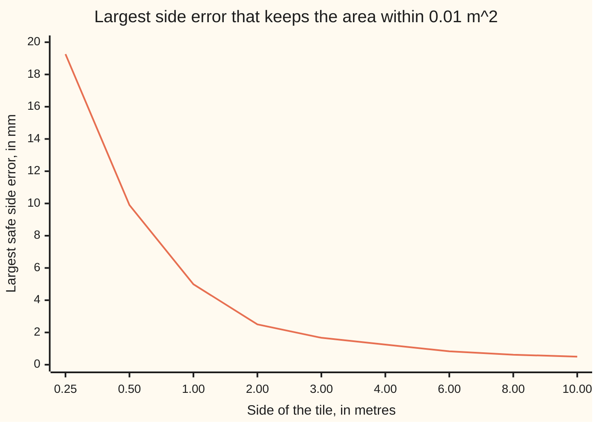

# Uniform continuity: one tolerance for the whole interval, and the Lipschitz shortcut

[Syllabus](../../../SYLLABUS.md) → [Calculus and analysis](../README.md) → [Limits and Continuity](../README.md#s01) → Uniform continuity

---

## General Overview

A workshop cuts square tiles with sides up to 2 m, and charges by area, side times side. The contract allows the area to miss by at most 0.01 m^2. How accurately must the saw hold the side?

It depends on the tile. Side 0.5 m forgives a side error of 9.90 mm. Side 2 m forgives only 2.50 mm, because there each millimetre of side adds about four times as much area. One saw setting good for every tile exists: 2.50 mm.

A function whose output tolerance can be met by one input tolerance across the whole interval is **uniformly continuous**. Plain continuity ([Continuity](05-continuity.md)) promises a tolerance at each input separately. Uniform continuity fixes the tolerance first, then tests every point.

With no size limit, no setting works: side 100 m forgives 0.00005 m, and bigger sides forgive less.

**Continuity on a closed, bounded interval can always be met with one input tolerance for the whole interval; a fixed cap on steepness, the Lipschitz constant, turns that tolerance into a one-line division.**

**What kind of fact this is:** a theorem (Heine–Cantor), proved on this card in Why it works; uniform continuity and the Lipschitz constant are definitions.

### The picture: the best tolerance, side by side



The line is the most side error each tile can take. Up to 2 m its lowest value is 2.50 mm, which covers them all; past 10 m it keeps falling towards zero. The horizontal axis is spaced by category, not to scale.

---

## The formula

Bars around a difference, as in $\lvert x - y\rvert$, give the distance between two numbers. A function $f$ is **Lipschitz** on an interval, with **Lipschitz constant** $K$, when no two inputs have outputs further apart than $K$ times their own distance:

$$\lvert f(x) - f(y)\rvert \le K\,\lvert x - y\rvert \quad \text{for every } x, y \text{ in the interval.}$$

**Read it aloud:** the gap between two outputs is at most K times the gap between the inputs, wherever the two inputs sit.

Divided by the input gap, the left side is the slope of a **chord**, the straight line joining two points of the graph. So K caps the steepness of every chord. For the tiles, $f(x) = x^2$ on sides 0 to 2 m, and $K = 4$ square metres per metre. The shortcut:

$$\text{input tolerance} = \frac{\text{output tolerance}}{K} = \frac{0.01}{4} = 0.0025 \text{ m}.$$

**Read it aloud:** the error the output can bear, divided by the steepness cap, is the error the input may carry, everywhere at once.

When no K is at hand, **Heine–Cantor** still guarantees one tolerance: a function continuous at every point of a closed, bounded interval $[a, b]$ is uniformly continuous on it.

| Symbol | Plain meaning | In our example | Push it up and the answer… |
| --- | --- | --- | --- |
| $f$ | the function: side in, area out | $f(x) = x^2$ | — |
| $x$, $y$ | any two inputs | sides 1.9975 m and 2 m | — |
| $\lvert x - y\rvert$ | their distance | 0.0025 m | output gap may grow |
| $K$ | Lipschitz constant: cap on chord steepness, output units per input unit | 4 m^2 per m | tolerance shrinks |
| $a$, $b$ | the interval's ends, both included | 0 m and 2 m | b up: larger K, smaller tolerance |
| $c$ | one fixed side, for continuity at a point | 0.5 m, 100 m | its tolerance shrinks |
| $h$ | a proposed input tolerance | 0.1 m to 0.001 m | — |
| $x_n$, $y_n$, $x_{n_j}$, $y_{n_j}$ | the folded proof's bad pairs, and a settling subsequence | — | — |

### When it holds

- **Continuous.** A switch reading 0 below 1 and 1 from 1 up has no tolerance: inputs 0.9999 and 1 give outputs 1 apart.
- **Closed, both ends included.** On 0 to 1 with 0 left out, $1/x$ is continuous, yet inputs 1/100 and 1/101, 0.00009901 apart, give outputs 1 apart, and 1/n against 1/(n + 1) does the same ever closer.
- **Bounded.** Squaring on the whole line is continuous but not uniformly so (Step 2).
- **A tolerance, not a constant.** The square root on 0 to 1 is uniformly continuous, but no K fits it near 0 (Step 4).

---

## Why it works

### Step 0: fix the steepness, and the tolerance fixes itself

If no chord is steeper than K, an input gap below the output tolerance divided by K gives an output gap below the output tolerance. That sentence never says where the inputs sit, so a Lipschitz function is uniformly continuous.

### Step 1: find K for the tiles by factoring

The area gap between sides $x$ and $y$ factors as a difference of squares:

$$\lvert x^2 - y^2\rvert = \lvert x - y\rvert \cdot (x + y) \le 4\,\lvert x - y\rvert.$$

On sides up to 2 m, $x + y$ is at most 4, so K = 4 and the tolerance is 0.01 / 4 = 0.0025 m. The hardest pair sits at the top end, 1.9975 m against 2 m: area gap 0.00999375 m^2, just inside.

The largest single tolerance that works makes that top pair's gap exactly 0.01: 2 − √(4 − 0.01) = 0.00250156 m. The shortcut gives up almost nothing.

### Step 2: at each side, its own tolerance; on the whole line, no floor

Plain continuity at one side $c$ tests only pairs with one member at $c$. Upwards is tighter, since the curve steepens, so the largest safe error solves $(c + h)^2 - c^2 = 0.01$: it is $\sqrt{c^2 + 0.01} - c$. At 0.5 m that is 0.00990195 m; at 100 m, 0.00005 m. The chart plots it.

Every side has its tolerance, but on the whole line no single one survives. Propose any input tolerance $h$. The sides $1/h$ and $1/h + h/2$ are closer than $h$, yet

$$\left(\tfrac{1}{h} + \tfrac{h}{2}\right)^2 - \left(\tfrac{1}{h}\right)^2 = 1 + \tfrac{h^2}{4} > 1,$$

a hundred times the permitted 0.01 m^2. With $h$ = 0.0025 m the sides are 400 m and 400.00125 m, area gap 1.00000156 m^2. Every proposal fails somewhere.

### Step 3: Heine–Cantor, the shape of the proof

Suppose some output tolerance on $[a, b]$ had no single input tolerance. Then for each input tolerance tried, 1, 1/2, 1/3 and on, some pair of inputs closer than that has outputs at least the fixed tolerance apart.

Bounded: the first members of those pairs have a subsequence settling on one point (Bolzano–Weierstrass, from [Extreme value theorem](07-extreme-value-theorem.md)). Closed: that point is in the interval. The second members, ever closer to the first, settle there too. Continuity at that point pulls both outputs to one value, so their gap shrinks: a contradiction.

On the whole line the bad pairs run off, never settling; with 0 left out, the $1/x$ pairs settle on 0, outside the domain.

<details>
<summary>Detailed proof: Heine–Cantor</summary>

Write ε for an output tolerance and δ for an input tolerance, both positive. Uniform continuity on $[a, b]$: for every ε some δ makes any two inputs closer than δ have outputs closer than ε.

Suppose it fails for some ε. Then for each whole number n, δ = 1/n fails: some $x_n$ and $y_n$ in $[a, b]$ have $\lvert x_n - y_n\rvert < 1/n$ and $\lvert f(x_n) - f(y_n)\rvert \ge$ ε.

The first members lie in a bounded interval, so a subsequence of them, $x_{n_j}$ with growing indices, converges to some point p (Bolzano–Weierstrass). Since every term lies between a and b, so does p: closedness is used here.

By the triangle inequality, $\lvert y_{n_j} - p\rvert \le \lvert y_{n_j} - x_{n_j}\rvert + \lvert x_{n_j} - p\rvert < 1/n_j + \lvert x_{n_j} - p\rvert$, and both terms go to 0. So $y_{n_j}$ converges to p too.

By continuity at p, eventually both $f(x_{n_j})$ and $f(y_{n_j})$ lie within ε/3 of $f(p)$, so their gap is below 2ε/3, contradicting its being at least ε. The proof shows a δ exists without computing one; a K gives δ = ε/K.

</details>

### Step 4: uniform does not give a K

The square root on 0 to 1 is continuous on a closed, bounded interval, so Heine–Cantor applies. For inputs $0 \le x \le y$, $(\sqrt{y} - \sqrt{x})^2 \le (\sqrt{y} - \sqrt{x})(\sqrt{y} + \sqrt{x}) = y - x$: the output gap never exceeds the square root of the input gap. So inputs 0.01 apart have outputs at most 0.1 apart; the code finds that largest gap at 0.

No K fits. Propose K = 4: inputs 0 and 0.04 give a chord of steepness 5. Inputs 0 and $1/(K+1)^2$ beat any proposed K with steepness $K + 1$. The graph stands vertical at 0.

So Lipschitz gives uniform, uniform gives plain continuity, and neither arrow reverses: the square root blocks the first, squaring on the whole line the second.

A second road to K uses derivatives: a rate never above 4 in size allows no chord steeper than 4. [Fixed points](../03-What%20Derivatives%20Tell%20You/07-fixed-point-iteration-and-the-contraction-principle.md) takes it.

---

## Worked numbers, by hand

| Step | Arithmetic | Value |
| --- | --- | --- |
| area tolerance | from the contract | 0.01 m^2 |
| steepness ceiling | x + y is at most 2 + 2 | K = 4 m^2 per m |
| Lipschitz tolerance | 0.01 / 4 | **0.0025 m, that is 2.5 mm** |
| worst pair | 2 × 2 − 1.9975 × 1.9975 | 0.00999375 m^2, inside 0.01 |
| best single tolerance | 2 − √(4 − 0.01) | 0.00250156 m |
| tolerance at side 0.5 alone | √(0.25 + 0.01) − 0.5 | 0.00990195 m |
| that tolerance used at side 2 | 2 × 2 − (2 − 0.00990195) squared | 0.03950976 m^2, nearly four times too much |

A saw held to 2.5 mm keeps every tile inside the contract; one tuned on small tiles does not.

### What breaks if you drop a piece

| Mistake | Comes out at | What went wrong |
| --- | --- | --- |
| Tolerance from side 0.5 used at side 2 | area gap 0.03950976 m^2 | a pointwise tolerance, not a uniform one |
| Any size, tolerance 0.0025 m | sides 400 and 400.00125, gap 1.00000156 m^2 | bounded dropped |
| $1/x$, 0 left out | inputs 0.00009901 apart, outputs 1 apart | closed dropped |
| K assumed from uniformity | square root, 0 and 0.04: steepness 5 | uniform is not Lipschitz |
| Switch jumping at 1 | inputs 0.9999 and 1, outputs 1 apart | continuous dropped |

The code prints all five.

---

## Code, from first principles, and it actually runs

Each tolerance is reached twice: by formula, and by bisection, halving a search interval sixty times and keeping the half where sampled pairs meet the area tolerance, with no roots taken. K = 4 is checked against two million sampled chords, the whole-line gaps against $1 + h^2/4$.

### Python

```python
# Uniform continuity and Lipschitz -- the check behind the card.  Only
# math.sqrt is imported.  Example: a square tile of side x metres, area x*x,
# sides from 0 to 2 m, area tolerance 0.01 m^2.  Each tolerance is found twice:
# by a formula, and by bisection over sample points, which takes no roots.
from math import sqrt
EPS, B = 0.01, 2.0

def bisect(ok, lo=0.0, hi=1.0):           # largest d with ok(d) true
    for _ in range(60):
        mid = (lo + hi) / 2
        lo, hi = (mid, hi) if ok(mid) else (lo, mid)
    return lo

def uniform_ok(d):                         # every sampled pair d apart in [0, 2]
    xs = [i * (B - d) / 2000 for i in range(2001)]
    return max((x + d) * (x + d) - x * x for x in xs) <= EPS

def point_ok(c):                           # every sample within d of the side c
    return lambda d: max(abs((c + d * k / 100) ** 2 - c * c) for k in range(-100, 101)) <= EPS

K = 2 * B                                  # factoring: x*x - y*y = (x - y)(x + y), x + y <= 4
g = [i / 1000 for i in range(2001)]
steep = max((y * y - x * x) / (y - x) for i, x in enumerate(g) for y in g[i + 1:])
lip = EPS / K
exact, bis = B - sqrt(B * B - EPS), bisect(uniform_ok)
d5 = sqrt(0.25 + EPS) - 0.5
print(f"K by factoring on [0,2]: {K:.6f}; steepest sampled chord: {steep:.6f}")
print(f"Lipschitz tolerance, m: {lip:.8f}")
print(f"worst pair 1.9975 and 2, area gap: {B * B - (B - lip) ** 2:.8f}")
print(f"best uniform tolerance, m: formula {exact:.8f}, bisection {bis:.8f}")
print(f"best at side 0.5 alone, m: {d5:.8f}; used at side 2, area gap {B * B - (B - d5) ** 2:.8f}")
print(f"best at side 100 alone, m: {sqrt(10000 + EPS) - 100:.8f}")
for d in (0.1, 0.01, 0.0025, 0.001):
    x = 1 / d; y = x + d / 2
    assert abs((y * y - x * x) - (1 + d * d / 4)) < 1e-6    # direct gap against the algebra
    print(f"whole line, tolerance {d}: sides {x:.2f} and {y:.5f}, area gap {y * y - x * x:.8f}")
print(f"open end, 1/x at 0.01 and {1 / 101:.8f}: input gap {0.01 - 1 / 101:.8f}, output gap {1 / (1 / 101) - 1 / 0.01:.6f}")
t = 1 / (K + 1)
print(f"square root, K = 4 beaten by 0 and {t * t:.2f}: ratio {sqrt(t * t) / (t * t):.6f}")
print(f"square root, inputs 0.01 apart, largest output gap {max(sqrt(i / 1000 + 0.01) - sqrt(i / 1000) for i in range(991)):.6f}")
step = lambda x: 1 if x >= 1 else 0            # a switch that jumps at side 1
print(f"jump at 1: inputs 0.9999 and 1, output gap {step(1.0) - step(0.9999)}")
cs = [0.25, 0.5, 1, 2, 3, 4, 6, 8, 10]
pts = [bisect(point_ok(c)) for c in cs]
for c, p in zip(cs, pts):
    assert abs(p - (sqrt(c * c + EPS) - c)) < 1e-9          # bisection against the closed form
assert 0 <= K - steep < 0.0011                                # sampled chords against factoring
assert abs(bis - exact) < 1e-9                                # bisection against the formula
print(f"try, sides up to 3 m: K {2 * 3.0:.6f}, tolerance {EPS / (2 * 3.0):.8f}; area tolerance 0.001 on [0,2]: {0.001 / K:.8f}")
print("figure, side m:", " ".join(f"{c:.2f}" for c in cs))
print("figure, best tolerance mm:", " ".join(f"{1000 * p:.2f}" for p in pts))
print("all four checks passed")
```

**Ran 2026-09-27 on macOS, Python 3.14.6, standard library only. All checks passed. Output, pasted from the run:**

```
K by factoring on [0,2]: 4.000000; steepest sampled chord: 3.999000
Lipschitz tolerance, m: 0.00250000
worst pair 1.9975 and 2, area gap: 0.00999375
best uniform tolerance, m: formula 0.00250156, bisection 0.00250156
best at side 0.5 alone, m: 0.00990195; used at side 2, area gap 0.03950976
best at side 100 alone, m: 0.00005000
whole line, tolerance 0.1: sides 10.00 and 10.05000, area gap 1.00250000
whole line, tolerance 0.01: sides 100.00 and 100.00500, area gap 1.00002500
whole line, tolerance 0.0025: sides 400.00 and 400.00125, area gap 1.00000156
whole line, tolerance 0.001: sides 1000.00 and 1000.00050, area gap 1.00000025
open end, 1/x at 0.01 and 0.00990099: input gap 0.00009901, output gap 1.000000
square root, K = 4 beaten by 0 and 0.04: ratio 5.000000
square root, inputs 0.01 apart, largest output gap 0.100000
jump at 1: inputs 0.9999 and 1, output gap 1
try, sides up to 3 m: K 6.000000, tolerance 0.00166667; area tolerance 0.001 on [0,2]: 0.00025000
figure, side m: 0.25 0.50 1.00 2.00 3.00 4.00 6.00 8.00 10.00
figure, best tolerance mm: 19.26 9.90 4.99 2.50 1.67 1.25 0.83 0.62 0.50
all four checks passed
```

### Rust

```rust
// Uniform continuity and Lipschitz -- the check behind the card.  std only.
// Example: a square tile of side x metres, area x*x, sides from 0 to 2 m,
// area tolerance 0.01 m^2.  Each tolerance is found twice: by a formula, and
// by bisection over sample points, which takes no roots.
const EPS: f64 = 0.01;
const B: f64 = 2.0;

fn bisect<F: Fn(f64) -> bool>(ok: F) -> f64 { // largest d with ok(d) true
    let (mut lo, mut hi) = (0.0, 1.0);
    for _ in 0..60 {
        let mid = (lo + hi) / 2.0;
        if ok(mid) { lo = mid } else { hi = mid }
    }
    lo
}

fn uniform_ok(d: f64) -> bool { // every sampled pair d apart in [0, 2]
    (0..=2000).map(|i| i as f64 * (B - d) / 2000.0)
        .map(|x| (x + d) * (x + d) - x * x).fold(f64::MIN, f64::max) <= EPS
}

fn point_ok(c: f64, d: f64) -> bool { // every sample within d of the side c
    (-100..=100).map(|k| ((c + d * k as f64 / 100.0).powi(2) - c * c).abs())
        .fold(f64::MIN, f64::max) <= EPS
}

fn step(x: f64) -> i32 { if x >= 1.0 { 1 } else { 0 } } // a switch that jumps at side 1

fn main() {
    let k = 2.0 * B; // factoring: x*x - y*y = (x - y)(x + y), x + y <= 4
    let g: Vec<f64> = (0..=2000).map(|i| i as f64 / 1000.0).collect();
    let mut steep = f64::MIN;
    for i in 0..g.len() {
        for j in i + 1..g.len() {
            steep = steep.max((g[j] * g[j] - g[i] * g[i]) / (g[j] - g[i]));
        }
    }
    let lip = EPS / k;
    let (exact, bis) = (B - (B * B - EPS).sqrt(), bisect(uniform_ok));
    let d5 = (0.25 + EPS).sqrt() - 0.5;
    println!("K by factoring on [0,2]: {:.6}; steepest sampled chord: {:.6}", k, steep);
    println!("Lipschitz tolerance, m: {:.8}", lip);
    println!("worst pair 1.9975 and 2, area gap: {:.8}", B * B - (B - lip).powi(2));
    println!("best uniform tolerance, m: formula {:.8}, bisection {:.8}", exact, bis);
    println!("best at side 0.5 alone, m: {:.8}; used at side 2, area gap {:.8}", d5, B * B - (B - d5).powi(2));
    println!("best at side 100 alone, m: {:.8}", (10000.0 + EPS).sqrt() - 100.0);
    for d in [0.1f64, 0.01, 0.0025, 0.001] {
        let x = 1.0 / d;
        let y = x + d / 2.0;
        assert!(((y * y - x * x) - (1.0 + d * d / 4.0)).abs() < 1e-6); // direct gap against the algebra
        println!("whole line, tolerance {}: sides {:.2} and {:.5}, area gap {:.8}", d, x, y, y * y - x * x);
    }
    println!("open end, 1/x at 0.01 and {:.8}: input gap {:.8}, output gap {:.6}",
        1.0 / 101.0, 0.01 - 1.0 / 101.0, 1.0 / (1.0 / 101.0) - 1.0 / 0.01);
    let t = 1.0 / (k + 1.0);
    println!("square root, K = 4 beaten by 0 and {:.2}: ratio {:.6}", t * t, (t * t).sqrt() / (t * t));
    let sq = (0..991).map(|i| (i as f64 / 1000.0 + 0.01).sqrt() - (i as f64 / 1000.0).sqrt()).fold(f64::MIN, f64::max);
    println!("square root, inputs 0.01 apart, largest output gap {:.6}", sq);
    println!("jump at 1: inputs 0.9999 and 1, output gap {}", step(1.0) - step(0.9999));
    let cs = [0.25, 0.5, 1.0, 2.0, 3.0, 4.0, 6.0, 8.0, 10.0];
    let pts: Vec<f64> = cs.iter().map(|&c| bisect(|d| point_ok(c, d))).collect();
    for (c, p) in cs.iter().zip(&pts) {
        assert!((p - ((c * c + EPS).sqrt() - c)).abs() < 1e-9); // bisection against the closed form
    }
    assert!(k - steep >= 0.0 && k - steep < 0.0011); // sampled chords against factoring
    assert!((bis - exact).abs() < 1e-9); // bisection against the formula
    let side: Vec<String> = cs.iter().map(|c| format!("{:.2}", c)).collect();
    let mm: Vec<String> = pts.iter().map(|p| format!("{:.2}", 1000.0 * p)).collect();
    println!("try, sides up to 3 m: K {:.6}, tolerance {:.8}; area tolerance 0.001 on [0,2]: {:.8}", 2.0 * 3.0, EPS / (2.0 * 3.0), 0.001 / k);
    println!("figure, side m: {}", side.join(" "));
    println!("figure, best tolerance mm: {}", mm.join(" "));
    println!("all four checks passed");
}
```

**Ran 2026-09-27 on macOS, rustc 1.98.1, no crates. All checks passed. Output, pasted from the run:**

```
K by factoring on [0,2]: 4.000000; steepest sampled chord: 3.999000
Lipschitz tolerance, m: 0.00250000
worst pair 1.9975 and 2, area gap: 0.00999375
best uniform tolerance, m: formula 0.00250156, bisection 0.00250156
best at side 0.5 alone, m: 0.00990195; used at side 2, area gap 0.03950976
best at side 100 alone, m: 0.00005000
whole line, tolerance 0.1: sides 10.00 and 10.05000, area gap 1.00250000
whole line, tolerance 0.01: sides 100.00 and 100.00500, area gap 1.00002500
whole line, tolerance 0.0025: sides 400.00 and 400.00125, area gap 1.00000156
whole line, tolerance 0.001: sides 1000.00 and 1000.00050, area gap 1.00000025
open end, 1/x at 0.01 and 0.00990099: input gap 0.00009901, output gap 1.000000
square root, K = 4 beaten by 0 and 0.04: ratio 5.000000
square root, inputs 0.01 apart, largest output gap 0.100000
jump at 1: inputs 0.9999 and 1, output gap 1
try, sides up to 3 m: K 6.000000, tolerance 0.00166667; area tolerance 0.001 on [0,2]: 0.00025000
figure, side m: 0.25 0.50 1.00 2.00 3.00 4.00 6.00 8.00 10.00
figure, best tolerance mm: 19.26 9.90 4.99 2.50 1.67 1.25 0.83 0.62 0.50
all four checks passed
```

The two outputs agree line for line.

> [!TIP]
> **Try changing**
> - **Guess first:** sides up to 3 m (`B = 3.0`). K becomes 6, the tolerance 0.00166667 m; the `try` line prints both.
> - **Guess first:** a contract of 0.001 m^2. The tolerance falls tenfold too, to 0.00025 m.
> - **Guess first:** square roots in place of squares in the chord scan. The steepest chord never settles; it grows as the grid refines, since no K exists.

---

## The usual mistake

> [!warning]
> **Checking every point and calling it uniform.** A tolerance at side 0.5, at 2 and at 100 shows only plain continuity. Uniform continuity fixes one tolerance first; on the whole line the pointwise ones keep falling.
>
> - **Forgetting the interval.** Squaring is uniformly continuous on 0 to 2 m and not on the whole line.
> - **Sampled chords as proof of K.** The steepest sampled chord is 3.999; sampling can refute a K, never prove one.
> - **Expecting Heine–Cantor to give a number.** It proves a tolerance exists; the number comes from K.

---

## Where you meet it in real life

- **Manufacturing tolerances.** A cost computed from a measured length inherits the length's error times K; one tolerance for a whole product range is a uniform one.
- **Stable neural networks.** Capping a network's K bounds how far a small input change can move its output.
- **Solving equations by repetition.** A map with K below 1 pulls points together, so repeating it homes in on one answer: Fixed points.

> **Say it back**
> Continuity gives each input its own tolerance. Uniform continuity asks for one tolerance for the whole interval. Heine–Cantor: continuous on a closed, bounded interval guarantees one. A Lipschitz constant K caps every chord's steepness, so the tolerance is the output tolerance divided by K, 0.0025 m for the tiles. The square root is uniform with no K.

---

## What this builds on

- [Extreme value theorem](07-extreme-value-theorem.md): the settling subsequence in a closed, bounded interval, and the habit of watching which hypothesis each step spends.

## Where this goes next

- [Fixed points](../03-What%20Derivatives%20Tell%20You/07-fixed-point-iteration-and-the-contraction-principle.md): K from a bounded derivative; K below 1 forces one fixed point.
- [Uniform convergence](../06-Series/07-uniform-convergence.md): "one tolerance first" for a sequence of functions.
- Fixed points: iteration error bounded by powers of K.
- Uniform continuity: Heine–Cantor for any distance, compactness replacing closed and bounded.
- Bounded operators: for linear maps, K is the operator norm.
- Approximate identities: uniform continuity making smoothing converge everywhere at once.

---

## Sources

Verified 2026-09-27: every link below resolves to the publisher's page.

- Lebl, Jiří. *Basic Analysis I*, §3.4 "Uniform continuity". [Section page](https://www.jirka.org/ra/html/sec_unifcont.html). Free; the definitions, Heine–Cantor and Lipschitz functions.
- Abbott, Stephen. *Understanding Analysis*, 2nd ed. Springer, 2015. [Publisher page](https://link.springer.com/book/10.1007/978-1-4939-2712-8). Chapter 4 proves Heine–Cantor by sequences, as here.
- Bartle, Robert G., and Donald R. Sherbert. *Introduction to Real Analysis*, 4th ed. Wiley, 2011. [Publisher page](https://www.wiley.com/en-us/Introduction+to+Real+Analysis%2C+4th+Edition-p-9780471433316). Section 5.4: uniform continuity and Lipschitz functions.
