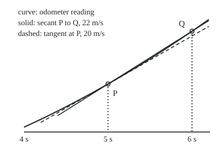

# The derivative: instantaneous rate as a limit of average rates

[Syllabus](../../../SYLLABUS.md) → [Calculus and analysis](../README.md) → [Derivatives](../README.md#s02) → The derivative

---

## General Overview

A car pulls away from traffic lights. Its odometer, zeroed at the lights, reads 50 m after 5 seconds and 72 m after 6 seconds. So in that one second it covered 22 m: an average speed of 22 m/s.

That is not its speed at the 5-second mark: the car is speeding up, so the average runs ahead. Shrink the window. Over the next tenth of a second the average is 20.2 m/s. Over a hundredth, 20.02. Over a thousandth, 20.002. The averages close in on 20 m/s, which is 72 km/h, and that is what the speedometer shows at 5 seconds.

No single window gives 20; every window is an average. The number the averages head for as the window shrinks to nothing is the **derivative**.

**The derivative is the limit of average rates over shrinking windows: output change divided by input change, as the input change heads for zero.**

**What kind of fact this is:** a definition; one theorem rides with it (a function with a derivative at a point, called differentiable there, is continuous there), proved on this card in Why it works.

### The picture: secant onto tangent

<p align="center"></p>

Drawn to scale: 1 s is 140 units across, 1 m is 4 units up, the axis at 30 m. P is (5 s, 50 m); Q is (6 s, 72 m). As Q slides towards P, the solid line swings onto the dashed one.

---

## The formula

Notation first, in words. The derivative of a function f at a point $a$ is written $f'(a)$, read "f prime of a", or $\frac{dy}{dx}$ when output is y and input x, read "the rate of y per unit of x". Reminder from [Limits](../01-Limits%20and%20Continuity/01-limits.md): $\lim_{h \to 0}$ reads "what this heads for as h heads for 0".

$$f'(a) = \lim_{h \to 0} \frac{f(a+h) - f(a)}{h}$$

**Read it aloud:** step the input from a to a + h, divide the change in output by the step, and see what that average rate heads for as the step shrinks to zero.

For the car the function is the odometer, $s(t) = 2t^2$ metres at $t$ seconds, and the instant is 5 s:

$$s'(5) = \lim_{h \to 0} \frac{s(5+h) - s(5)}{h} = 20 \text{ m/s}$$

| Symbol | Plain meaning | In our example | Push it up and the answer… |
| --- | --- | --- | --- |
| $s(t)$ | the odometer reading, metres, at time t | 2 × t × t; 50 m at 5 s | a faster car gives bigger averages |
| $t$ | time since the lights, seconds | 5 s at the instant | later instants give higher speeds (4t) |
| $a$ | the input where the rate is wanted | 5 s | the car's rate at a is 4 × a |
| $h$ | the window: the step in the input, either sign, never 0 | 1, 0.1, 0.01, 0.001 s | the average drifts from 20 by 2h |
| $f$ | any function, input x to output y | the odometer | — |
| $f'(a)$, $s'(5)$ | the derivative at a: output units per input unit | 20 m/s | — |
| $\frac{ds}{dt}$ | the same derivative, written as a rate of s per unit of t | 20 m/s at 5 s | — |
| $\lim_{h \to 0}$ | what the expression heads for as h heads for 0 | averages head for 20 | — |

A derivative's units are the output's units per input unit: metres per second here.

### When it holds

A definition names something; what can fail is the limit, and then there is no derivative at that point:

- **The function is defined on both sides of a.** At an end point only one side exists, and the result is labelled a one-sided rate.
- **Both sides head for the same number.** A car stopping dead at 5 s gives left averages near 20, right ones 0.
- **The number is finite.** A trip meter reset at 5 s gives left averages that grow without bound in size.

---

## Why it works

### Step 0: an average needs two times, so take a limit instead of a single time

Speed is distance divided by time. At one instant both are zero, and 0 divided by 0 is no number. So compute averages over windows that are not zero and ask what they head for: a limit, which never needs the value at h = 0 itself.

### Step 1: work the car's average for every window at once

Over a window of $h$ seconds from 5 s, the reading goes from 50 m to 2(5 + h)(5 + h) = 50 + 20h + 2h^2 metres. Subtract 50, divide by h:

$$\frac{s(5+h) - s(5)}{h} = \frac{20h + 2h^2}{h} = 20 + 2h$$

Dividing is allowed because h is not zero. As h heads for 0, so does 2h, and the average heads for **20 m/s**. At any instant a the same algebra gives 4a + 2h, so the speed at a is 4a: 8 m/s at 2 s.

### Step 2: the tolerance game, with numbers

Name a tolerance, say 0.001 m/s. The average is off from 20 by exactly 2 × |h|, so any window shorter than 0.0005 s, on either side, lands within 0.001 of 20. Any tighter tolerance has its shorter window. That is the whole content of "heads for 20".

### Step 3: read it as a slope

On the graph, the average over a window is the slope of the straight line through two points of the curve: a **secant**, rise over run. As the second point slides in, the secants swing onto one line through P, the **tangent**, whose slope is the derivative: 20 m of rise per 1 s of run.

### Step 4: a derivative forces continuity

Continuity at a means the output's gap from f(a) heads for 0 as the input closes in ([Continuity](../01-Limits%20and%20Continuity/05-continuity.md)). Write the gap as window times average:

$$f(a+h) - f(a) = h \times \frac{f(a+h) - f(a)}{h}$$

If the derivative exists, the average heads for a fixed number while h heads for 0, so their product, the gap, heads for 0. For the car: 2.02 m at a 0.1 s window, 0.2002 m at 0.01 s, 0.020002 m at 0.001 s.

The converse fails. A car that stops dead at 5 s is continuous (gaps 0.019998 m and 0 m over a thousandth of a second), but its left and right averages are 19.998 and 0: a corner, with no derivative.

<details>
<summary>Detailed proof</summary>

The tolerance form of the definition: f'(a) = L means that for every tolerance ε (epsilon) greater than 0 there is a window size δ (delta) greater than 0 such that every window h with 0 < |h| < δ gives an average within ε of L.

**The car.** The average minus 20 is exactly 2h, so δ = ε/2 works. With ε = 0.001, δ = 0.0005, as in Step 2.

**Differentiable implies continuous.** Suppose f'(a) = L. Take ε = 1 and its window δ1: for 0 < |h| < δ1 the average is within 1 of L, so its size is below |L| + 1. Then |f(a + h) − f(a)| = |h| × |average| < |h| × (|L| + 1). Given any output tolerance η (eta) above 0, take |h| below both δ1 and η/(|L| + 1). The gap is then below η. That is continuity at a.

**The corner.** Left windows give 20 + 2h, right windows 0. With ε = 5 no L is within 5 of both, so no δ works.

</details>

Whole-second readings reach the same number with no limit: 18 m in the fifth second, 22 m in the sixth; their mean is 20 m/s. That is exact only because the odometer curve is a parabola (a curve whose formula has t^2 as its highest power); elsewhere it is an estimate.

---

## Worked numbers, by hand

| Step | Arithmetic | Value |
| --- | --- | --- |
| Reading at 5 s | 2 × 5 × 5 | 50 m |
| Reading at 6 s | 2 × 6 × 6 | 72 m |
| One-second average | (72 − 50) / 1 | 22 m/s |
| Tenth of a second | gap 2.02 m over 0.1 s | 20.2 m/s |
| Hundredth | gap 0.2002 m over 0.01 s | 20.02 m/s |
| Thousandth | gap 0.020002 m over 0.001 s | 20.002 m/s |
| Any window h | (20h + 2h^2) / h | 20 + 2h |
| Limit as h heads for 0 | 20 + 2 × 0 | **20 m/s** |

At 5 seconds the car is doing 20 m/s, 72 km/h; averages after the instant run high, averages before it low.

### What breaks if you drop a piece

| Mistake | Comes out at | What went wrong |
| --- | --- | --- |
| Whole trip: 50 m over 5 s | 10 m/s | an average from the lights, not near the instant |
| Stop at the one-second window | 22 m/s | a finite window is still an average |
| A car stopping dead at 5 s (a corner) | left 19.998, right 0 m/s | continuous, but two one-sided rates: no derivative |
| Trip meter reset at 5 s (a jump) | −49,980.002 m/s at −0.001 s; −499,980.0002 at −0.0001 s | not continuous, so by Step 4 no derivative; the averages blow up |

---

## Code, from first principles, and it actually runs

Two independent roads to the speed at 5 s: raw averages over shrinking windows on both sides, asserted against the hand algebra 4a + 2h. Whole-second readings give a third road. Repeated halving finds the tolerance window with no algebra. The code also prints the continuity gaps, the corner, the jump, a second case at 2 s and the figure's coordinates.

### Python

```python
# The derivative -- the check behind the card.  Nothing is imported.
# The car's odometer reads s(t) = 2 t^2 metres at t seconds.  The speed at
# a = 5 s is reached by two roads: raw average speeds over shrinking windows,
# and the hand algebra 4a + 2h.  Whole-second odometer readings give a third.
A, TOL = 5.0, 0.001

def s(t): return 2 * t * t                      # the odometer, metres
def corner(t): return s(t) if t <= A else s(A)  # stops dead against a barrier at 5 s
def jump(t): return s(t) - (s(A) if t >= A else 0)  # trip meter reset to 0 at 5 s
def avg(f, a, h): return (f(a + h) - f(a)) / h  # average speed over the window

print(f"odometer at a = {A:.0f} s: {s(A):.3f} m")
windows = [1, 0.1, 0.01, 0.001, 0.0001, -0.0001, -1]
for h in windows:
    q = avg(s, A, h)
    print(f"window {h:+.4f} s: average {q:.6f} m/s, off by {abs(q - 4 * A):.6f}")
    assert abs(q - (4 * A + 2 * h)) < 1e-7          # raw road == algebra road
readings = [s(t) for t in range(7)]
per_second = [readings[k + 1] - readings[k] for k in range(6)]
odo = (per_second[4] + per_second[5]) / 2
print(f"odometer, seconds 0 to 6: {[int(r) for r in readings]} m")
print(f"metres in each second: {[int(p) for p in per_second]}; mean of the two around 5 s: {odo:.3f} m/s")
assert abs(odo - avg(s, A, 1e-6)) < 1e-5            # whole seconds == shrinking window
lo, hi = 0.0, 1.0                                    # halve to the widest window within TOL
for _ in range(60):
    mid = (lo + hi) / 2
    lo, hi = (mid, hi) if abs(avg(s, A, mid) - 4 * A) <= TOL else (lo, mid)
print(f"to land within {TOL} m/s of 20: widest window by halving {lo:.6f} s; algebra {TOL / 2:.6f} s")
assert abs(lo - TOL / 2) < 1e-9
for h in [0.1, 0.01, 0.001]:
    print(f"continuity, window {h}: gap {s(A + h) - s(A):.6f} m = {h} x {avg(s, A, h):.6f}")
left, right = avg(corner, A, -0.001), avg(corner, A, 0.001)
print(f"corner: left average {left:.6f}, right {right:.6f} m/s; gaps "
      f"{abs(corner(A - 0.001) - corner(A)):.6f} and {abs(corner(A + 0.001) - corner(A)):.6f} m")
assert left - right > 19                             # two one-sided rates: no derivative
print(f"jump: left average {avg(jump, A, -0.001):.4f} at -0.001 s, {avg(jump, A, -0.0001):.4f} at -0.0001 s")
print(f"second case, a = 2 s: window 0.0001 gives {avg(s, 2, 0.0001):.6f}; algebra 4a = {4 * 2} m/s")
print(f"mistakes: whole trip {s(A) / A:.3f} m/s; one-second window {avg(s, A, 1):.3f} m/s; answer 20 m/s = {20 * 3.6:.0f} km/h")
X = lambda t: 40 + 140 * (t - 4)                     # figure: 1 s = 140 units
Y = lambda m: 220 - 4 * (m - 30)                     # 1 m = 4 units, y points down
pts = [(4, s(4)), (5.1, s(4) + 16 * 1.1), (6.2, s(6.2)), (5, 50), (6, 72),
       (4.2, 50 - 20 * 0.8), (6.2, 50 + 20 * 1.2), (4.4, 50 - 22 * 0.6), (6.2, 50 + 22 * 1.2)]
print("figure, " + " ".join(f"({X(t):.1f},{Y(m):.2f})" for t, m in pts))
print("ALL CHECKS PASS")
```

**Ran 2026-09-27 on macOS, Python 3.14.6, standard library only. All checks passed. Output, pasted from the run:**

```
odometer at a = 5 s: 50.000 m
window +1.0000 s: average 22.000000 m/s, off by 2.000000
window +0.1000 s: average 20.200000 m/s, off by 0.200000
window +0.0100 s: average 20.020000 m/s, off by 0.020000
window +0.0010 s: average 20.002000 m/s, off by 0.002000
window +0.0001 s: average 20.000200 m/s, off by 0.000200
window -0.0001 s: average 19.999800 m/s, off by 0.000200
window -1.0000 s: average 18.000000 m/s, off by 2.000000
odometer, seconds 0 to 6: [0, 2, 8, 18, 32, 50, 72] m
metres in each second: [2, 6, 10, 14, 18, 22]; mean of the two around 5 s: 20.000 m/s
to land within 0.001 m/s of 20: widest window by halving 0.000500 s; algebra 0.000500 s
continuity, window 0.1: gap 2.020000 m = 0.1 x 20.200000
continuity, window 0.01: gap 0.200200 m = 0.01 x 20.020000
continuity, window 0.001: gap 0.020002 m = 0.001 x 20.002000
corner: left average 19.998000, right 0.000000 m/s; gaps 0.019998 and 0.000000 m
jump: left average -49980.0020 at -0.001 s, -499980.0002 at -0.0001 s
second case, a = 2 s: window 0.0001 gives 8.000200; algebra 4a = 8 m/s
mistakes: whole trip 10.000 m/s; one-second window 22.000 m/s; answer 20 m/s = 72 km/h
figure, (40.0,212.00) (194.0,141.60) (348.0,32.48) (180.0,140.00) (320.0,52.00) (68.0,204.00) (348.0,44.00) (96.0,192.80) (348.0,34.40)
ALL CHECKS PASS
```

### Rust

```rust
// The derivative -- the check behind the card.  std only.
// The car's odometer reads s(t) = 2 t^2 metres at t seconds.  The speed at
// a = 5 s is reached by two roads: raw average speeds over shrinking windows,
// and the hand algebra 4a + 2h.  Whole-second odometer readings give a third.
const A: f64 = 5.0;
const TOL: f64 = 0.001;

fn s(t: f64) -> f64 { 2.0 * t * t } // the odometer, metres
fn corner(t: f64) -> f64 { if t <= A { s(t) } else { s(A) } } // stops dead at 5 s
fn jump(t: f64) -> f64 { s(t) - if t >= A { s(A) } else { 0.0 } } // trip meter reset at 5 s
fn avg(f: fn(f64) -> f64, a: f64, h: f64) -> f64 { (f(a + h) - f(a)) / h }

fn main() {
    println!("odometer at a = {:.0} s: {:.3} m", A, s(A));
    for h in [1.0, 0.1, 0.01, 0.001, 0.0001, -0.0001, -1.0] {
        let q = avg(s, A, h);
        println!("window {:+.4} s: average {:.6} m/s, off by {:.6}", h, q, (q - 4.0 * A).abs());
        assert!((q - (4.0 * A + 2.0 * h)).abs() < 1e-7); // raw road == algebra road
    }
    let readings: Vec<f64> = (0..7).map(|t| s(t as f64)).collect();
    let per_second: Vec<f64> = (0..6).map(|k| readings[k + 1] - readings[k]).collect();
    let odo = (per_second[4] + per_second[5]) / 2.0;
    let ints = |v: &Vec<f64>| v.iter().map(|x| *x as i64).collect::<Vec<i64>>();
    println!("odometer, seconds 0 to 6: {:?} m", ints(&readings));
    println!("metres in each second: {:?}; mean of the two around 5 s: {:.3} m/s", ints(&per_second), odo);
    assert!((odo - avg(s, A, 1e-6)).abs() < 1e-5); // whole seconds == shrinking window
    let (mut lo, mut hi) = (0.0_f64, 1.0_f64); // halve to the widest window within TOL
    for _ in 0..60 {
        let mid = (lo + hi) / 2.0;
        if (avg(s, A, mid) - 4.0 * A).abs() <= TOL { lo = mid } else { hi = mid }
    }
    println!("to land within {} m/s of 20: widest window by halving {:.6} s; algebra {:.6} s", TOL, lo, TOL / 2.0);
    assert!((lo - TOL / 2.0).abs() < 1e-9);
    for h in [0.1, 0.01, 0.001] {
        println!("continuity, window {}: gap {:.6} m = {} x {:.6}", h, s(A + h) - s(A), h, avg(s, A, h));
    }
    let (left, right) = (avg(corner, A, -0.001), avg(corner, A, 0.001));
    println!("corner: left average {:.6}, right {:.6} m/s; gaps {:.6} and {:.6} m", left, right,
        (corner(A - 0.001) - corner(A)).abs(), (corner(A + 0.001) - corner(A)).abs());
    assert!(left - right > 19.0); // two one-sided rates: no derivative
    println!("jump: left average {:.4} at -0.001 s, {:.4} at -0.0001 s", avg(jump, A, -0.001), avg(jump, A, -0.0001));
    println!("second case, a = 2 s: window 0.0001 gives {:.6}; algebra 4a = {} m/s", avg(s, 2.0, 0.0001), 4 * 2);
    println!("mistakes: whole trip {:.3} m/s; one-second window {:.3} m/s; answer 20 m/s = {:.0} km/h",
        s(A) / A, avg(s, A, 1.0), 20.0 * 3.6);
    let x = |t: f64| 40.0 + 140.0 * (t - 4.0); // figure: 1 s = 140 units
    let y = |m: f64| 220.0 - 4.0 * (m - 30.0); // 1 m = 4 units, y points down
    let pts = [(4.0, s(4.0)), (5.1, s(4.0) + 16.0 * 1.1), (6.2, s(6.2)), (5.0, 50.0), (6.0, 72.0),
        (4.2, 50.0 - 20.0 * 0.8), (6.2, 50.0 + 20.0 * 1.2), (4.4, 50.0 - 22.0 * 0.6), (6.2, 50.0 + 22.0 * 1.2)];
    let fig: Vec<String> = pts.iter().map(|&(t, m)| format!("({:.1},{:.2})", x(t), y(m))).collect();
    println!("figure, {}", fig.join(" "));
    println!("ALL CHECKS PASS");
}
```

**Ran 2026-09-27 on macOS, rustc 1.98.1, no crates. All checks passed. Output, pasted from the run:**

```
odometer at a = 5 s: 50.000 m
window +1.0000 s: average 22.000000 m/s, off by 2.000000
window +0.1000 s: average 20.200000 m/s, off by 0.200000
window +0.0100 s: average 20.020000 m/s, off by 0.020000
window +0.0010 s: average 20.002000 m/s, off by 0.002000
window +0.0001 s: average 20.000200 m/s, off by 0.000200
window -0.0001 s: average 19.999800 m/s, off by 0.000200
window -1.0000 s: average 18.000000 m/s, off by 2.000000
odometer, seconds 0 to 6: [0, 2, 8, 18, 32, 50, 72] m
metres in each second: [2, 6, 10, 14, 18, 22]; mean of the two around 5 s: 20.000 m/s
to land within 0.001 m/s of 20: widest window by halving 0.000500 s; algebra 0.000500 s
continuity, window 0.1: gap 2.020000 m = 0.1 x 20.200000
continuity, window 0.01: gap 0.200200 m = 0.01 x 20.020000
continuity, window 0.001: gap 0.020002 m = 0.001 x 20.002000
corner: left average 19.998000, right 0.000000 m/s; gaps 0.019998 and 0.000000 m
jump: left average -49980.0020 at -0.001 s, -499980.0002 at -0.0001 s
second case, a = 2 s: window 0.0001 gives 8.000200; algebra 4a = 8 m/s
mistakes: whole trip 10.000 m/s; one-second window 22.000 m/s; answer 20 m/s = 72 km/h
figure, (40.0,212.00) (194.0,141.60) (348.0,32.48) (180.0,140.00) (320.0,52.00) (68.0,204.00) (348.0,44.00) (96.0,192.80) (348.0,34.40)
ALL CHECKS PASS
```

The two outputs agree line for line.

> [!TIP]
> **Try changing**
> Guess first, then run it.
> - **A different instant.** Set `A = 2.0`. The windows now close on 8 m/s, as the algebra says, but the whole-seconds assert stops the run: it still reads the seconds around 5 s.
> - **A faster car.** Change the odometer to `2 * t * t + 3 * t`. Every average rises by exactly 3, the windows close on 23 m/s, and the first assert stops the run because the algebra road still says 20 + 2h.
> - **Smooth out the corner.** Make `corner` return `s(t)` on both sides. The right average becomes 20.002 and the corner assert stops the run: there is no longer a corner to detect.

---

## The usual mistake

> [!warning]
> **Putting h = 0 into the average.** At h = 0 the average is 0 / 0, no number. The derivative cancels h while h is not zero (Step 1), then asks what 20 + 2h heads for.
>
> - **Whole-trip average.** 50 m over 5 s is 10 m/s, half the true 20.
> - **One window taken as the answer.** 22 m/s over the next second is 10% high; 18 m/s over the previous one, 10% low.
> - **Checking one side only.** The stopped car's left averages head for 20 and would pass; the right ones read 0.
> - **Dropping the units.** The answer is 20 metres per second, not 20 metres.

---

## Where you meet it in real life

- **Speedometers.** The needle estimates the odometer's derivative from wheel turns over a short window.
- **Marginal cost.** The derivative of total cost with respect to quantity, in dollars per item.
- **Option hedging.** An option's delta is its price's rate per dollar of the stock price ([Delta](../../12-Financial%20mathematics/09-The%20Greeks%2C%20one%20each/01-delta.md)).
- **Every derivative rule.** All come from this one limit: [Product and quotient rules](02-product-and-quotient-rules.md), [Chain rule](03-chain-rule.md), [Derivatives of sine and cosine](04-derivatives-of-trig-functions.md), [Derivatives of exp and log](05-derivatives-of-exp-and-log.md).

> **Say it back**
> An average rate is output change over input change across a window. Shrink the window and the averages head for one number, the derivative. The car's average from 5 s is 20 + 2h, so its speed at 5 s is 20 m/s. On a graph it is the tangent's slope. A derivative forces continuity; a corner shows the reverse fails.

---

## What this builds on

- [Limits](../01-Limits%20and%20Continuity/01-limits.md): the limit and its tolerance game, which the definition is built from.
- [Continuity](../01-Limits%20and%20Continuity/05-continuity.md): the property Step 4 proves a derivative forces.

## Where this goes next

- [Product and quotient rules](02-product-and-quotient-rules.md): derivatives of products and quotients.
- [Second derivatives](08-higher-derivatives-and-concavity.md): the rate of the rate; the car's acceleration.
- [Linear approximation](../03-What%20Derivatives%20Tell%20You/01-linear-approximation-and-related-rates.md): the tangent used to predict nearby values.
- [Mean value theorem](../03-What%20Derivatives%20Tell%20You/02-mean-value-theorem.md): some instant in every window matches its average.
- [Partial derivatives](../07-Several%20Variables/01-partial-derivatives.md): several inputs, one moved at a time.
- [The complex derivative](../../07-Complex%20analysis/02-Holomorphic%20Functions/01-complex-derivative-and-cauchy-riemann.md): the window may point any direction in a plane.
- [A differential equation](../../08-Differential%20equations%20and%20dynamics/01-Rate%20Equations/01-what-a-differential-equation-says.md): equations that state a rate and ask for the function.
- Unbounded operators: differentiation as an operation on whole functions.

---

## Sources

Verified 2026-09-27: every link below resolves to the publisher's page.

- Strang, Gilbert, and Edwin Herman. *Calculus Volume 1*. OpenStax, 2016. [Section 3.1, Defining the Derivative](https://openstax.org/books/calculus-volume-1/pages/3-1-defining-the-derivative). Difference quotients, tangents, velocity.
- The same book, [Section 3.2, The Derivative as a Function](https://openstax.org/books/calculus-volume-1/pages/3-2-the-derivative-as-a-function). Differentiable implies continuous; the corner.
- Strang, Gilbert. *Calculus*, 3rd ed. Wellesley-Cambridge Press, free on MIT OpenCourseWare. [Calculus Open Textbook](https://ocw.mit.edu/courses/res-18-001-calculus-fall-2023/). A full course built on rates.
- O'Connor, J. J., and E. F. Robertson. "Gottfried Leibniz." MacTutor Archive, University of St Andrews. [Biography](https://mathshistory.st-andrews.ac.uk/Biographies/Leibniz/). Dates the 1684 paper that first printed his differential calculus.
