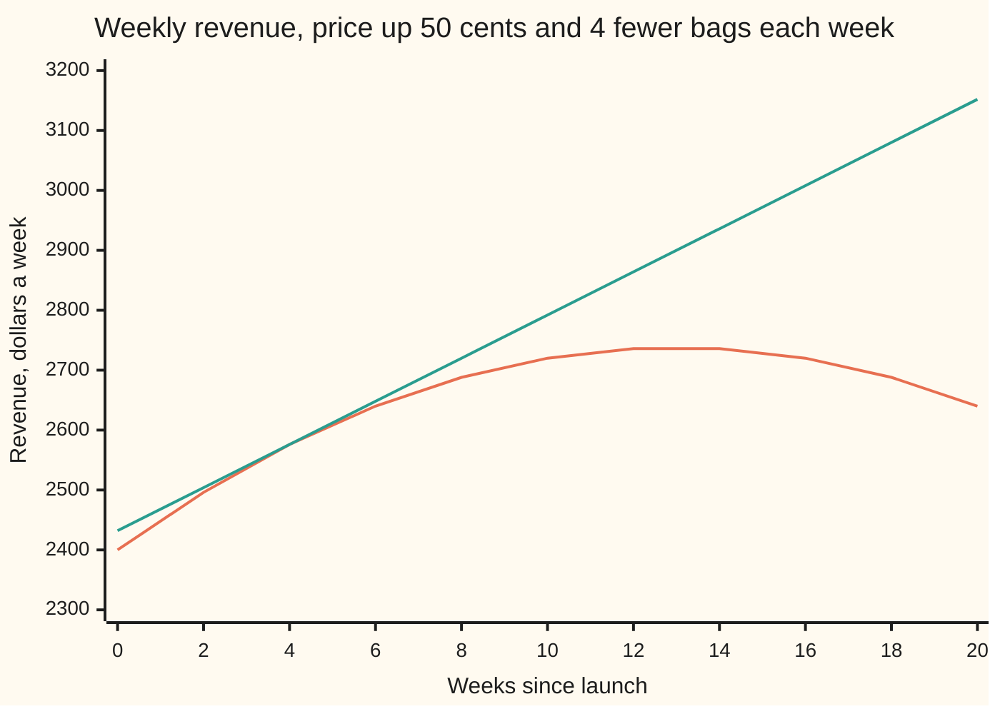
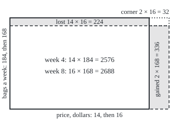

# Product and quotient rules: derivatives of things multiplied and divided

[Syllabus](../../../SYLLABUS.md) → [Calculus and analysis](../README.md) → [Derivatives](../README.md#s02) → Product and quotient rules

---

## General Overview

A small roaster sells coffee by the bag. At launch a bag costs $12 and 200 bags go out each week. Every week the price rises 50 cents, and every week 4 fewer bags sell. Weekly revenue is price times bags.

In week 4 a bag costs $14.00, 184 bags sell, and revenue is $2,576.00 a week. Is revenue rising or falling? Both of its factors move, in opposite directions. The price pushes revenue up by 50 cents on each of 184 bags: $92.00 a week, per week. The lost bags pull it down by 4 bags at $14.00 each: $56.00. Net, revenue climbs $36.00 a week, per week.

Multiplying the two rates gives 0.5 × (−4) = −2: wrong sign, wrong size. The right answer adds each factor's rate times the other factor's current value. That is the **product rule**. It yields the rate of a ratio, the **quotient rule**, and the rate of every whole-number power.

**The rate of a product is the first factor's rate times the second factor, plus the first factor times the second's rate; the rate of a ratio follows from it.**

**What kind of fact this is:** a theorem, proved on this card in Why it works from the limit that defines a derivative.

### The picture: revenue over twenty weeks



The orange curve is revenue. The green line touches it at week 4 with slope 36. Revenue tops out at $2,738.00 in week 13, where the two contributions cancel.

---

## The formula

A reminder of notation from [The derivative](01-the-derivative.md): a prime marks a derivative, so $p'$ is the rate of $p$ per unit of the input. For two functions $f$ and $g$ of the same input, each with a derivative there:

$$(f g)' = f' g + f g'$$

**Read it aloud:** the rate of a product is the first's rate times the second, plus the first times the second's rate.

$$\left(\frac{f}{g}\right)' = \frac{f' g - f g'}{g^2}, \qquad g \ne 0$$

**Read it aloud:** the rate of a ratio is the top's rate times the bottom, minus the top times the bottom's rate, all over the bottom squared.

For a whole number $n \ne 0$, written with d/dx meaning "the derivative with respect to x":

$$\frac{d}{dx}\, x^n = n\, x^{n-1}, \qquad \text{with } x \ne 0 \text{ when } n \text{ is negative}$$

**Read it aloud:** bring the power down in front and lower it by one.

| Symbol | Plain meaning | In our example | Push it up and the answer… |
| --- | --- | --- | --- |
| $t$ | time, in weeks since launch | 4 | the rate falls 4 dollars a week, per week, for each week later |
| $p$ | price of a bag, dollars: 12 + 0.5t | 14.00 | a higher price weights the bag loss more |
| $q$ | bags sold a week: 200 − 4t | 184 | more bags weight the price rise more |
| $R$ | weekly revenue, p × q | 2,576.00 | — |
| $p'$, $q'$, $R'$ | rates per week: dollars, bags, dollars a week | 0.5, −4, 36 | — |
| $h$ | a small step in time, weeks | 4 down to 0.001 | a bigger step leaves a bigger gap to the rate |
| $f$, $g$ | any two functions with derivatives at the point | R on top, q below | — |
| $n$ | a whole-number power, possibly negative | 3 and −2 | — |

Units: $R'$ is dollars a week, per week, the output's unit per input unit.

### When it holds

- **Both factors have a derivative at the point.** A price held at $14 until week 4, rising after, gives revenue a left rate of −56 and a right rate of 36 there: a corner, no single rate.
- **A bottom that is not zero.** Bags reach 0 in week 50, and revenue ÷ bags has no value there.
- **Whole-number powers.** Other powers need logarithms, in [Derivatives of exp and log](05-derivatives-of-exp-and-log.md).

---

## Why it works

### Step 0: a product is an area

Draw revenue as a rectangle: price across, bags up. When time moves on, width and height both change a little. The new area differs from the old by two thin strips and one small corner. The strips give the rate; the corner shrinks away.

### The picture: one step of 4 weeks

<p align="center"></p>

The solid rectangle is week 4; the dashed one is week 8. Scale: 20 units across per dollar, 1 unit up per bag. The shaded right strip is gained, the shaded top strip is lost, and the dotted corner lies in neither: 2688 − 2576 = 336 − 224 = 112.

### Step 1: split the change into three pieces

Over a step of $h$ weeks, price changes by Δp (read "the change in p") and bags by Δq. The new revenue is (p + Δp)(q + Δq). Multiply out and subtract the old p × q:

ΔR = Δp × q + p × Δq + Δp × Δq.

For the 4-week step: 2 × 184 + 14 × (−16) + 2 × (−16) = 368 − 224 − 32 = 112. In the picture, the gained strip at the new height, 336, is 368 less the corner 32.

### Step 2: divide by the step and shrink it

Divide by $h$ to get an average rate:

ΔR / h = (Δp / h) × q + p × (Δq / h) + (Δp / h) × Δq.

As $h$ shrinks, Δp / h heads for $p'$ and Δq / h heads for $q'$. That is the definition of a derivative. The last term carries an extra Δq, which heads for 0, so it vanishes. What is left is $p' q + p q'$.

Here the corner term is exactly 0.5 × (−4) × h = −2h. At h = 1 the average rate is 34, at h = 0.1 it is 35.8, at h = 0.001 it is 35.998. A step of 0.001 weeks lands within 0.002 of 36; halve the step to halve the gap. That game, won for every tolerance, is the limit.

Why does Δq head for 0? It equals h × (Δq / h): a shrinking step times a number near $q'$. A function with a derivative cannot jump.

<details>
<summary>Detailed proof</summary>

Let f and g have derivatives at x. Write the product's difference quotient as
$$\frac{f(x+h)g(x+h) - f(x)g(x)}{h} = \frac{f(x+h)-f(x)}{h}\,g(x+h) + f(x)\,\frac{g(x+h)-g(x)}{h}.$$
The fractions tend to f'(x) and g'(x); it remains to show g(x+h) tends to g(x). Pick δ > 0 so that for 0 < |h| < δ the quotient of g is within 1 of g'(x). Then |g(x+h) − g(x)| ≤ |h| (|g'(x)| + 1). Given ε > 0, taking |h| below both δ and ε / (|g'(x)| + 1) makes this less than ε. By the limit laws for sums and products, the quotient tends to f'(x)g(x) + f(x)g'(x).

For the reciprocal, suppose g(x) ≠ 0. By the continuity just shown, for small h, |g(x+h) − g(x)| < |g(x)|/2, so g(x+h) is at least |g(x)|/2 away from 0 and 1/g(x+h) exists. Then
$$\frac{1/g(x+h) - 1/g(x)}{h} = -\frac{g(x+h)-g(x)}{h}\cdot\frac{1}{g(x+h)\,g(x)} \to -\frac{g'(x)}{g(x)^2}.$$

</details>

### Step 3: a reciprocal, then any ratio

The gap 1/g(x+h) − 1/g(x) equals −(g(x+h) − g(x)) over g(x+h) × g(x). Divide by $h$ and shrink it: the rate of 1/g is −g′ / g^2. A ratio f/g is f times 1/g, so the product rule gives f′/g − f g′/g^2, which over a common bottom is the quotient rule.

Test it: price is revenue ÷ bags. With R′ = 36: (36 × 184 − 2576 × (−4)) / 184^2 = (6624 + 10304) / 33856 = 16928 / 33856 = 0.5. The quotient rule hands back the 50 cents a week the story started with.

### Step 4: every whole-number power

A power is a product: x^3 = x × x^2. The rate of x is 1. If the rate of x^n is n x^(n−1), the product rule gives the rate of x^(n+1) as 1 × x^n + x × n x^(n−1) = (n + 1) x^n. Climbing from n = 1 one step at a time (induction), it holds for every positive whole number. (For n = 0, x^0 is the constant 1, whose rate is 0.) At x = 2 the rate of x^3 is 3 × 4 = 12.

For a negative power, x^(−m) = 1 / x^m with m positive. The reciprocal rule gives −m x^(m−1) / x^(2m) = −m x^(−m−1): the same pattern, n x^(n−1) with n = −m. It needs x ≠ 0, since 1/x^m has no value there. At x = 2, the rate of 1/x^2 is −2 / 8 = −0.25.

A second road, by logarithms, turns a product into a sum: [Derivatives of exp and log](05-derivatives-of-exp-and-log.md).

---

## Worked numbers, by hand

| Step | Arithmetic | Value |
| --- | --- | --- |
| price and bags, week 4 | 12 + 0.5 × 4; 200 − 4 × 4 | 14.00 and 184 |
| revenue | 14 × 184 | 2,576.00 |
| price's contribution | 0.5 × 184 | 92.00 |
| bags' contribution | 14 × (−4) | −56.00 |
| rate of revenue | 92 − 56 | **36.00 dollars a week, per week** |
| price back from revenue ÷ bags | (36 × 184 − 2576 × (−4)) / 184^2 = 16928 / 33856 | **0.5 dollars a week** |
### What breaks if you drop a piece

| Mistake | Comes out at | What went wrong |
| --- | --- | --- |
| Multiply the two rates | −2 instead of 36 | Each rate must be weighted by the other factor's value |
| Top of the quotient reversed | −0.5 instead of 0.5 | The subtraction runs "top's rate first" |
| Bottom not squared | 92 instead of 0.5 | Dividing by the bottom once leaves an answer 184 times too big |
| Price with a corner at week 4 | left −56, right 35.998 | Price has no rate at the corner, so neither does revenue |

The code prints all four.

---

## Code, from first principles, and it actually runs

Two roads. The first applies the rules. The second never uses them: it takes the difference quotient (change over step) with the step shrinking from 4 weeks to 0.001 and prints the gap closing. The code also recovers the price rate both ways, builds the power rule from repeated products, finds the peak by bisection (halving an interval around the rate's sign change) and by a grid search, and prints each wrong answer.

### Python

```python
# Product and quotient rules -- the check behind the card.  Nothing imported.
# A roaster's bag of coffee: price p = 12 + 0.5t dollars, bags sold a week
# q = 200 - 4t, t in weeks.  Revenue R = p * q.  Road one: the rules.
# Road two: difference quotients with a shrinking step h, straight from the limit.
def p(t): return 12 + 0.5 * t
def q(t): return 200 - 4 * t
def R(t): return p(t) * q(t)
dp, dq = 0.5, -4.0                           # the two rates, per week
def rate(t): return dp * q(t) + p(t) * dq    # product rule
def dquot(f, t, h): return (f(t + h) - f(t)) / h
def pw(x, n):                                # x multiplied in n times
    out = 1.0
    for _ in range(n): out *= x
    return out
def power_by_products(x, n):                 # d(x^n) from x^n = x * x^(n-1), step by step
    d = 1.0
    for k in range(2, n + 1): d = 1.0 * pw(x, k - 1) + x * d
    return d
t = 4.0
print(f"week 4: price {p(t):.2f}, bags {q(t):.0f}, revenue {R(t):.2f}")
print(f"product rule: 0.5*184 + 14*(-4) = {dp * q(t):.2f} + ({p(t) * dq:.2f}) = {rate(t):.2f}")
for h in (4.0, 1.0, 0.1, 0.01, 0.001):
    print(f"h = {h:g}: revenue quotient {dquot(R, t, h):.6f}, gap to rule {dquot(R, t, h) - rate(t):.6f}")
H = 4.0; ddp, ddq = p(t + H) - p(t), q(t + H) - q(t)
print(f"step of 4 weeks: {p(t + H):.2f} x {q(t + H):.0f} = {R(t + H):.2f}; change {R(t + H) - R(t):.2f} = {ddp * q(t):.2f} "
      f"+ ({p(t) * ddq:.2f}) + ({ddp * ddq:.2f}); strips {ddp * q(t + H):.2f} and {p(t) * ddq:.2f}")
print(f"figure, 20 units a dollar, 1 a bag: old right {20 + 20 * p(t):.0f} top {220 - q(t):.0f}, "
      f"new right {20 + 20 * p(t + H):.0f} top {220 - q(t + H):.0f}")
quot = (rate(t) * q(t) - R(t) * dq) / (q(t) * q(t))           # price = revenue / bags
def price_back(s): return R(s) / q(s)
print(f"quotient by hand: 36*184 = {rate(t) * q(t):.0f}, 2576*(-4) = {R(t) * dq:.0f}, top {rate(t) * q(t) - R(t) * dq:.0f}, "
      f"184^2 = {q(t) * q(t):.0f}; bags reach 0 at week {-q(0) / dq:.0f}")
print(f"quotient rule on revenue/bags: {quot:.6f}; quotient h = 0.001: {dquot(price_back, t, 0.001):.6f}")
print(f"cube at 2: rule {3 * pw(2, 2):.6f}, repeated products {power_by_products(2.0, 3):.6f}, "
      f"h = 0.001: {dquot(lambda x: pw(x, 3), 2.0, 0.001):.6f}")
recip = lambda x: 1 / pw(x, 2)
print(f"1/x^2 at 2: rule {-2 / pw(2, 3):.6f}, h = 0.001: {dquot(recip, 2.0, 0.001):.6f}")
lo, hi = 0.0, 50.0                          # bisection: where the product-rule rate is zero
for _ in range(60):
    mid = (lo + hi) / 2
    lo, hi = (mid, hi) if rate(mid) > 0 else (lo, mid)
grid = max((R(k / 1000), k / 1000) for k in range(50001))
print(f"revenue peaks: rate zero at week {lo:.3f} by bisection, grid maximum at {grid[1]:.3f}, revenue {grid[0]:.2f}")
print(f"mistakes: product of rates {dp * dq:.2f}; reversed quotient {(R(t) * dq - rate(t) * q(t)) / (q(t) * q(t)):.6f}; "
      f"unsquared {(rate(t) * q(t) - R(t) * dq) / q(t):.6f}")
def R_corner(s): return (12 + 0.5 * max(s - 4, 0) + 2) * q(s)  # price flat at 14 until week 4, then rising
print(f"price with a corner at week 4: left quotient {dquot(R_corner, t, -0.001):.6f}, right quotient {dquot(R_corner, t, 0.001):.6f}")
print("chart revenue:", ", ".join(f"{R(s):.0f}" for s in range(0, 21, 2)))
print("chart tangent:", ", ".join(f"{R(t) + rate(t) * (s - t):.0f}" for s in range(0, 21, 2)))
assert abs(dquot(R, t, 0.001) - rate(t)) < 0.003                  # rule against the limit
assert abs(quot - dquot(price_back, t, 0.001)) < 1e-6              # quotient rule against the limit
assert all(abs(power_by_products(2.0, n) - n * pw(2, n - 1)) < 1e-9 for n in range(1, 9))
assert abs(lo - grid[1]) < 0.002                                   # rate zero where revenue tops out
print("ALL CHECKS PASS")
```

**Ran 2026-09-27 on macOS, Python 3.14.6, standard library only. All checks passed. Output, pasted from the run:**

```
week 4: price 14.00, bags 184, revenue 2576.00
product rule: 0.5*184 + 14*(-4) = 92.00 + (-56.00) = 36.00
h = 4: revenue quotient 28.000000, gap to rule -8.000000
h = 1: revenue quotient 34.000000, gap to rule -2.000000
h = 0.1: revenue quotient 35.800000, gap to rule -0.200000
h = 0.01: revenue quotient 35.980000, gap to rule -0.020000
h = 0.001: revenue quotient 35.998000, gap to rule -0.002000
step of 4 weeks: 16.00 x 168 = 2688.00; change 112.00 = 368.00 + (-224.00) + (-32.00); strips 336.00 and -224.00
figure, 20 units a dollar, 1 a bag: old right 300 top 36, new right 340 top 52
quotient by hand: 36*184 = 6624, 2576*(-4) = -10304, top 16928, 184^2 = 33856; bags reach 0 at week 50
quotient rule on revenue/bags: 0.500000; quotient h = 0.001: 0.500000
cube at 2: rule 12.000000, repeated products 12.000000, h = 0.001: 12.006001
1/x^2 at 2: rule -0.250000, h = 0.001: -0.249813
revenue peaks: rate zero at week 13.000 by bisection, grid maximum at 13.000, revenue 2738.00
mistakes: product of rates -2.00; reversed quotient -0.500000; unsquared 92.000000
price with a corner at week 4: left quotient -56.000000, right quotient 35.998000
chart revenue: 2400, 2496, 2576, 2640, 2688, 2720, 2736, 2736, 2720, 2688, 2640
chart tangent: 2432, 2504, 2576, 2648, 2720, 2792, 2864, 2936, 3008, 3080, 3152
ALL CHECKS PASS
```

### Rust

Same numbers, same labels, built with `rustc --edition 2021 -O`.

```rust
// Product and quotient rules -- the same check as the Python, in Rust.  No crates.
// A roaster's bag of coffee: price p = 12 + 0.5t dollars, bags sold a week
// q = 200 - 4t, t in weeks.  Revenue R = p * q.  Road one: the rules.
// Road two: difference quotients with a shrinking step h, straight from the limit.
fn p(t: f64) -> f64 { 12.0 + 0.5 * t }
fn q(t: f64) -> f64 { 200.0 - 4.0 * t }
fn rev(t: f64) -> f64 { p(t) * q(t) }
const DP: f64 = 0.5;
const DQ: f64 = -4.0;
fn rate(t: f64) -> f64 { DP * q(t) + p(t) * DQ }            // product rule
fn dquot(f: &dyn Fn(f64) -> f64, t: f64, h: f64) -> f64 { (f(t + h) - f(t)) / h }
fn pw(x: f64, n: u32) -> f64 {                              // x multiplied in n times
    let mut out = 1.0;
    for _ in 0..n { out *= x }
    out
}
fn power_by_products(x: f64, n: u32) -> f64 {               // d(x^n) from x^n = x * x^(n-1)
    let mut d = 1.0;
    for k in 2..=n { d = 1.0 * pw(x, k - 1) + x * d }
    d
}
fn price_back(s: f64) -> f64 { rev(s) / q(s) }
fn r_corner(s: f64) -> f64 { (12.0 + 0.5 * (s - 4.0).max(0.0) + 2.0) * q(s) }

fn main() {
    let t = 4.0;
    println!("week 4: price {:.2}, bags {:.0}, revenue {:.2}", p(t), q(t), rev(t));
    println!("product rule: 0.5*184 + 14*(-4) = {:.2} + ({:.2}) = {:.2}", DP * q(t), p(t) * DQ, rate(t));
    for (h, lab) in [(4.0, "4"), (1.0, "1"), (0.1, "0.1"), (0.01, "0.01"), (0.001, "0.001")] {
        let d = dquot(&rev, t, h);
        println!("h = {}: revenue quotient {:.6}, gap to rule {:.6}", lab, d, d - rate(t));
    }
    let big = 4.0;
    let (ddp, ddq) = (p(t + big) - p(t), q(t + big) - q(t));
    println!("step of 4 weeks: {:.2} x {:.0} = {:.2}; change {:.2} = {:.2} + ({:.2}) + ({:.2}); strips {:.2} and {:.2}",
             p(t + big), q(t + big), rev(t + big), rev(t + big) - rev(t), ddp * q(t), p(t) * ddq, ddp * ddq,
             ddp * q(t + big), p(t) * ddq);
    println!("figure, 20 units a dollar, 1 a bag: old right {:.0} top {:.0}, new right {:.0} top {:.0}",
             20.0 + 20.0 * p(t), 220.0 - q(t), 20.0 + 20.0 * p(t + big), 220.0 - q(t + big));
    let quot = (rate(t) * q(t) - rev(t) * DQ) / (q(t) * q(t));   // price = revenue / bags
    let back = dquot(&price_back, t, 0.001);
    println!("quotient by hand: 36*184 = {:.0}, 2576*(-4) = {:.0}, top {:.0}, 184^2 = {:.0}; bags reach 0 at week {:.0}",
             rate(t) * q(t), rev(t) * DQ, rate(t) * q(t) - rev(t) * DQ, q(t) * q(t), -q(0.0) / DQ);
    println!("quotient rule on revenue/bags: {:.6}; quotient h = 0.001: {:.6}", quot, back);
    let cube = |x: f64| pw(x, 3);
    println!("cube at 2: rule {:.6}, repeated products {:.6}, h = 0.001: {:.6}",
             3.0 * pw(2.0, 2), power_by_products(2.0, 3), dquot(&cube, 2.0, 0.001));
    let recip = |x: f64| 1.0 / pw(x, 2);
    println!("1/x^2 at 2: rule {:.6}, h = 0.001: {:.6}", -2.0 / pw(2.0, 3), dquot(&recip, 2.0, 0.001));
    let (mut lo, mut hi) = (0.0f64, 50.0f64);                  // bisection: rate zero
    for _ in 0..60 {
        let mid = (lo + hi) / 2.0;
        if rate(mid) > 0.0 { lo = mid } else { hi = mid }
    }
    let (mut best, mut at) = (f64::MIN, 0.0);
    for k in 0..=50000 {
        let s = k as f64 / 1000.0;
        if rev(s) >= best { best = rev(s); at = s }
    }
    println!("revenue peaks: rate zero at week {:.3} by bisection, grid maximum at {:.3}, revenue {:.2}", lo, at, best);
    println!("mistakes: product of rates {:.2}; reversed quotient {:.6}; unsquared {:.6}", DP * DQ,
             (rev(t) * DQ - rate(t) * q(t)) / (q(t) * q(t)), (rate(t) * q(t) - rev(t) * DQ) / q(t));
    println!("price with a corner at week 4: left quotient {:.6}, right quotient {:.6}",
             dquot(&r_corner, t, -0.001), dquot(&r_corner, t, 0.001));
    let pts: Vec<String> = (0..=20).step_by(2).map(|s| format!("{:.0}", rev(s as f64))).collect();
    println!("chart revenue: {}", pts.join(", "));
    let tan: Vec<String> = (0..=20).step_by(2).map(|s| format!("{:.0}", rev(t) + rate(t) * (s as f64 - t))).collect();
    println!("chart tangent: {}", tan.join(", "));
    assert!((dquot(&rev, t, 0.001) - rate(t)).abs() < 0.003);            // rule against the limit
    assert!((quot - back).abs() < 1e-6);                                  // quotient rule against the limit
    assert!((1..9).all(|n| (power_by_products(2.0, n) - n as f64 * pw(2.0, n - 1)).abs() < 1e-9));
    assert!((lo - at).abs() < 0.002);                                    // rate zero where revenue tops out
    println!("ALL CHECKS PASS");
}
```

**Ran 2026-09-27 on macOS, rustc 1.98.1, no crates. All checks passed. Output, pasted from the run:**

```
week 4: price 14.00, bags 184, revenue 2576.00
product rule: 0.5*184 + 14*(-4) = 92.00 + (-56.00) = 36.00
h = 4: revenue quotient 28.000000, gap to rule -8.000000
h = 1: revenue quotient 34.000000, gap to rule -2.000000
h = 0.1: revenue quotient 35.800000, gap to rule -0.200000
h = 0.01: revenue quotient 35.980000, gap to rule -0.020000
h = 0.001: revenue quotient 35.998000, gap to rule -0.002000
step of 4 weeks: 16.00 x 168 = 2688.00; change 112.00 = 368.00 + (-224.00) + (-32.00); strips 336.00 and -224.00
figure, 20 units a dollar, 1 a bag: old right 300 top 36, new right 340 top 52
quotient by hand: 36*184 = 6624, 2576*(-4) = -10304, top 16928, 184^2 = 33856; bags reach 0 at week 50
quotient rule on revenue/bags: 0.500000; quotient h = 0.001: 0.500000
cube at 2: rule 12.000000, repeated products 12.000000, h = 0.001: 12.006001
1/x^2 at 2: rule -0.250000, h = 0.001: -0.249813
revenue peaks: rate zero at week 13.000 by bisection, grid maximum at 13.000, revenue 2738.00
mistakes: product of rates -2.00; reversed quotient -0.500000; unsquared 92.000000
price with a corner at week 4: left quotient -56.000000, right quotient 35.998000
chart revenue: 2400, 2496, 2576, 2640, 2688, 2720, 2736, 2736, 2720, 2688, 2640
chart tangent: 2432, 2504, 2576, 2648, 2720, 2792, 2864, 2936, 3008, 3080, 3152
ALL CHECKS PASS
```

> [!TIP]
> **Try changing**
> - **Guess first:** set `dq` to 0. The rule reads 92, the price's contribution alone, and the first assert fails: `q` still falls, so rule and limit disagree.
> - **Guess first:** set `dp` to 0. The rule reads −56, and the first assert fails the same way.
> - **Guess first:** move `t` to 13. The contributions cancel: the rate is 0 at the peak.
> - **Guess first:** move `t` to 50. Bags are 0 and the quotient's division fails.

---

## The usual mistake

> [!warning]
> **Multiplying the rates.** The rate of p × q is not p′ × q′: 0.5 × (−4) gives −2, but revenue rises at 36. Each factor's change acts on the whole of the other factor, so each rate is weighted by the other's value, and the two add.
>
> - **Reversing the top of the quotient.** f g′ − f′ g gives −0.5 instead of 0.5: the right size with the wrong sign.
> - **A negative power at 0.** 1/x^2 has no value at x = 0, so no rate either.
> - **A finite step taken as the rate.** Over 4 weeks the average is 28, not 36: the corner's −8 is still in it.

---

## Where you meet it in real life

- **Pricing.** Revenue is price times volume. Raising price pays while price's contribution beats the lost volume's; the peak sits where they cancel, here week 13.
- **Rates of ratios.** Profit margin and cost per unit are quotients; a growing bottom pulls the ratio down, the quotient rule's minus sign.
- **Electrical power.** Power is voltage times current. When both drift, the rate of power needs both contributions.
- **Trigonometry.** tan x is sin x ÷ cos x, so its derivative comes from the quotient rule once [Derivatives of sine and cosine](04-derivatives-of-trig-functions.md) supplies the rates of sine and cosine.

> **Say it back**
> Multiply two moving quantities and the product changes by two strips and a corner. Divided by the step, the corner vanishes and the strips give first's rate times second plus first times second's rate. A ratio is a product with a reciprocal, whose rate is minus the bottom's rate over the bottom squared. Repeated products give n x^(n−1) for every whole-number power, away from 0 for negative ones. The roaster's revenue climbs $36 a week in week 4, not −2.

---

## What this builds on

- [The derivative](01-the-derivative.md): the difference quotient and the limit every step here takes.

## Where this goes next

- [Chain rule](03-chain-rule.md): the rate of one function fed into another.
- [Integration by parts](../04-Integrals/04-integration-by-parts.md): the product rule run backwards to undo a derivative.
- [The integrating factor](../../08-Differential%20equations%20and%20dynamics/01-Rate%20Equations/05-integrating-factor.md): a multiplier chosen so that one side becomes the product rule's output.
---

## Sources

Verified 2026-09-27: every link below resolves to the publisher's page.

- OpenStax. *Calculus Volume 1*, section 3.3, Differentiation Rules. [Chapter page](https://openstax.org/books/calculus-volume-1/pages/3-3-differentiation-rules). Free; proves the product rule from the limit and states the quotient and power rules.
- Strang, Gilbert. *Calculus*. MIT OpenCourseWare. [Course and book page](https://ocw.mit.edu/courses/res-18-001-calculus-fall-2023/). Free; its chapter on derivatives covers the product, quotient and power rules.
