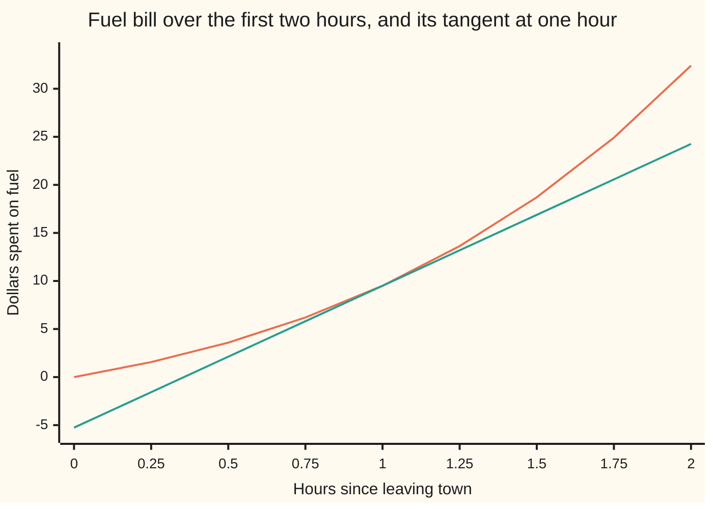
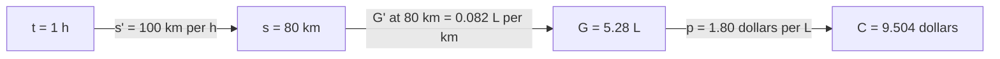

# Chain rule: rates multiply when one quantity drives another

Calculus and analysis → Derivatives → Rates through a chain → Chain rule

---

## General Overview

A car leaves town at noon and speeds up as the traffic thins. One hour out it has covered 80 km and is doing 100 km/h. The road climbs into hills, so each kilometre burns more fuel than the last: 5.28 litres so far, and 0.082 litres per kilometre at the 80 km mark. Fuel costs $1.80 a litre.

How fast is the fuel bill growing at that moment?

Three rates sit in a line. Time drives distance at 100 km per hour; distance drives fuel at 0.082 litres per km; fuel drives money at 1.80 dollars per litre. Multiply them and the units cancel in pairs: 1.80 × 0.082 × 100 = 14.76 dollars per hour.

That multiplication is the chain rule. The theorem says the product is exact at that instant, although every rate in it changes as the car moves.

**When one quantity drives another, the rate of the last per unit of the first is the product of the rates along the chain, each read where the chain actually is.**

**What kind of fact this is:** a theorem, proved on this card in Why it works.

### The picture: the bill and its tangent at one hour



The curving line is the fuel bill. The straight line is its tangent at one hour: it touches the bill at 9.50 dollars and climbs at 14.76 dollars per hour.

---

## The formula

A reminder from [the-derivative](01-the-derivative.md): $f'(x)$, also written dy/dx, is the rate of y per unit of x at one point.

One new notation, in words first: $f \circ g$, read "f after g", hands an input to $g$ and the result to $f$. So $(f \circ g)(t) = f(g(t))$. Here $g$ is the **inner** function and $f$ the **outer** one.

$$(f \circ g)'(t) = f'(g(t))\,g'(t)$$

**Read it aloud:** the rate of the whole chain is the outer rate, read at the value the inner function hands over, times the inner rate.

On the drive the chain has three links. With $s(t)$ the km driven by hour $t$, $G(s)$ the litres burned by km $s$, $p$ the price per litre and $C(t) = p\,G(s(t))$ the dollars spent by hour $t$:

$$C'(t) = p \cdot G'(s(t)) \cdot s'(t)$$

The units check it: (dollars per litre) × (litres per km) × (km per hour) = dollars per hour. That cancelling is a memory aid, not a proof; Step 1 shows where it breaks.

The example's functions are $s(t) = 60t + 20t^2$ km and $G(s) = 0.05s + 0.0002s^2$ litres. The power rule from [product-and-quotient-rules](02-product-and-quotient-rules.md) gives speed $s'(t) = 60 + 40t$ and burn rate $G'(s) = 0.05 + 0.0004s$.

| Symbol | Plain meaning | In our example | Push it up and the answer… |
| --- | --- | --- | --- |
| $t$ | hours since leaving town | 1 h | grows: faster car, steeper road |
| $s$, $s'$ | km driven by hour t; speed in km/h | 80 km; 100 km/h | grows in proportion to speed |
| $G$, $G'$ | litres burned by km s; litres per km there | 5.28 L; 0.082 L/km | grows in proportion to burn rate |
| $p$ | fuel price, dollars per litre | 1.80 | grows in proportion |
| $C$, $C'$ | dollars spent by hour t; dollars per hour | 9.504; 14.76 | — |
| $f$, $g$ | any outer and inner function | G and s | — |
| $h$, $k$ | a time step; the distance it adds | 0.01 h; 1.002 km | the secant drifts from 14.76 |
| $r$, $e$ | slippage: how far the step's average rates miss the exact ones | 0.200 km/h; 0.0002004 L/km | both shrink to 0 with the step |

The flow of the chain, with each rate read at the car's actual position:



### When it holds

- **The inner function has a rate at t.** An instant jump in speed at one hour leaves no single inner rate.
- **The outer function has a rate at the value handed over, s(t) = 80 km.** If the burn rate jumps at km 80, from 0.06 L/km on the flat to 0.09 L/km up a climb, the cost rate from the left is 10.80 dollars per hour and from the right 16.20: no single rate exists.
- **The outer function is defined all around that value**, so nearby positions of the car are ones it accepts.

---

## Why it works

### Step 0: near a point, each link multiplies a small change by its rate

Add a small time step h. The car goes about 100h km further, each extra km burns about 0.082 litres, and each litre costs 1.80 dollars. So the bill grows by about 1.80 × 0.082 × 100 × h. The work is to make "about" exact.

### Step 1: the tempting proof divides by something that can be zero

Write Δ for "change over the step". The tempting line is

$$\frac{\Delta C}{\Delta t} = \frac{\Delta C}{\Delta s} \cdot \frac{\Delta s}{\Delta t}$$

and let the step shrink. It fails when Δs is zero. Park the car at 80 km: every step adds 0 km, and ΔC/Δs is 0 divided by 0, yet the bill's rate is plainly 0. A car that reverses and pulls forward ever faster near one instant is back at the same spot after arbitrarily small steps, so shrinking does not rescue it. The honest proof never divides by the inner change.

### Step 2: write each change as (rate + slippage) × step

For the inner link, the extra distance over a step h is exactly

$$k = s(1+h) - s(1) = (100 + r)\,h, \qquad r = 20h.$$

Here r, in km/h, is the **slippage**: how far the step's average speed misses 100 km/h. Likewise e, in L/km, is how far the step's average burn misses 0.082.

For the outer link, the extra fuel over an extra k km is exactly

$$G(80 + k) - G(80) = (0.082 + e)\,k, \qquad e = 0.0002k.$$

It holds for every k, k = 0 included: a product, not a quotient, so a parked car causes no trouble.

### Step 3: substitute, then divide only by h

Put the first equation into the second and multiply by p:

$$\frac{C(1+h) - C(1)}{h} = p\,(0.082 + e)(100 + r).$$

The only division is by h, never zero. At h = 0.01 hour: k = 1.002 km, r = 0.200, e = 0.0002004, and the right side is 1.80 × 0.0822004 × 100.2 = 14.825664, the same as the secant computed from the bill directly.

### Step 4: shrink the step

As h shrinks, r shrinks; so does k = (100 + r)h, and with it e = 0.0002k. The right side heads for 1.80 × 0.082 × 100 = 14.76, the derivative.

The tolerance game, with numbers. The secant misses 14.76 by 0.67 at h = 0.1 hour, 0.066 at 0.01, 0.0066 at 0.001, 0.00066 at 0.0001. To land within 0.01 dollars per hour, any forward step under 0.00153 hour, about 5.5 seconds, will do: here the miss grows with the step.

<details>
<summary>Detailed proof</summary>

Let g have a derivative at t, and f be defined around u = g(t) with a derivative there.

For k ≠ 0 set e(k) = (f(u + k) − f(u))/k − f'(u), and e(0) = 0. Then f(u + k) − f(u) = (f'(u) + e(k))k for every small k, zero included, and for each ε > 0 some η > 0 gives |e(k)| < ε whenever |k| < η.

For h ≠ 0 set r(h) = (g(t + h) − g(t))/h − g'(t), so k(h) = g(t + h) − g(t) = (g'(t) + r(h))h. As h → 0, r(h) → 0 and so k(h) → 0: pick δ > 0 with |k(h)| < η whenever 0 < |h| < δ. Then |e(k(h))| < ε, so e(k(h)) → 0.

For 0 < |h| < δ, (f(g(t + h)) − f(g(t)))/h = (f'(u) + e(k(h)))(g'(t) + r(h)), which goes to f'(g(t)) g'(t). No step divided by k.

</details>

A longer chain is the two-link rule used twice. A second road is to expand $C(t)$ into powers of $t$ and differentiate term by term; it works here because everything is a polynomial, and the code does it. The chain done mechanically by computer is forward-mode-automatic-differentiation.

---

## Worked numbers, by hand

| Step | Arithmetic | Value |
| --- | --- | --- |
| distance at 1 h | 60 × 1 + 20 × 1 × 1 | 80 km |
| speed at 1 h | 60 + 40 × 1 | 100 km/h |
| fuel burned by 80 km | 0.05 × 80 + 0.0002 × 80 × 80 = 4 + 1.28 | 5.28 L |
| burn rate at 80 km | 0.05 + 0.0004 × 80 | 0.082 L/km |
| bill at 1 h | 1.80 × 5.28 | 9.504 dollars |
| cost rate | 1.80 × 0.082 × 100 | **14.76 dollars per hour** |

At one hour the bill stands at 9.504 dollars and is rising at 14.76 dollars per hour.

### What breaks if you drop a piece

| Mistake | Comes out at | What went wrong |
| --- | --- | --- |
| Burn rate read at t = 1 instead of s = 80 | 9.072 dollars per hour | The fuel function receives km, not hours |
| Average speed 80 km/h used for the speed now | 11.808 dollars per hour | The inner rate must be the rate at 1 h |
| Inner rate dropped | 0.1476 dollars per km | Wrong units: per km, not per hour |
| Burn rate with a corner at km 80 | 10.80 from the left, 16.20 from the right | The outer function has no rate at 80 km |

The code prints all four.

---

## Code, from first principles, and it actually runs

Three roads to the cost rate: multiply the three rates; expand the bill into powers of t and differentiate term by term; take secants over shrinking steps. The script also plays the tolerance game by bisection, checks Step 3 against the direct secant, and prints every wrong answer and chart point.

### Python

```python
# Chain rule -- the check behind the card.  Nothing is imported.  A car leaves
# town: s(t) = 60t + 20t^2 km after t hours; the road climbs, so G(s) = 0.05s +
# 0.0002s^2 litres are burned by km s; fuel costs 1.80 $/L.  Cost rate at t = 1.
P, T = 1.80, 1.0
def s(t): return 60 * t + 20 * t * t                 # km driven by hour t
def G(x): return 0.05 * x + 0.0002 * x * x            # litres burned by km x
def C(t): return P * G(s(t))                          # dollars spent by hour t
def mul(a, b):                                        # multiply two coefficient lists
    out = [0.0] * (len(a) + len(b) - 1)
    for i, x in enumerate(a):
        for j, y in enumerate(b): out[i + j] += x * y
    return out
def fmt(v, d=3): return "[" + ", ".join(f"{x:.{d}f}" for x in v) + "]"
# road 1: three rates, each from the power rule, multiplied
inner, middle = 60 + 40 * T, 0.05 + 0.0004 * s(T)
chain = P * middle * inner
# road 2: expand C(t) into powers of t, then differentiate term by term
sc = [0.0, 60.0, 20.0]
cc = [P * (0.05 * a + 0.0002 * b) for a, b in zip(sc + [0.0, 0.0], mul(sc, sc))]
expanded = sum(k * c * T ** (k - 1) for k, c in enumerate(cc) if k > 0)
print(f"at t = 1 h: distance {s(T):.0f} km, fuel used {G(s(T)):.2f} L, cost {C(T):.3f} $")
print(f"rates: ds/dt = {inner:.0f} km/h, dG/ds at 80 km = {middle:.3f} L/km, price {P:.2f} $/L")
print(f"road 1, rates multiplied: {P:.2f} x {middle:.3f} x {inner:.0f} = {chain:.2f} $/h")
print(f"road 2, C(t) expanded, coefficients {fmt(cc)}; C'(1) = {expanded:.2f} $/h")
errs = []
for h in (0.1, 0.01, 0.001, 0.0001):                  # road 3: shrinking secants
    q = (C(T + h) - C(T)) / h
    errs.append(q - chain)
    print(f"road 3, secant over h = {h:g} h: {q:.6f} $/h, error {q - chain:.6f}")
lo, hi = 0.0, 0.1                                     # largest step within 0.01 $/h
for _ in range(60):
    mid = (lo + hi) / 2
    if (C(T + mid) - C(T)) / mid - chain < 0.01: lo = mid
    else: hi = mid
print(f"tolerance: every forward step under {lo:.5f} h ({lo * 3600:.1f} s) lands within 0.01 $/h")
h = 0.01; k = s(T + h) - s(T); r = 20 * h; e = 0.0002 * k
proof = P * (middle + e) * (inner + r)
print(f"proof pieces at h = 0.01: k = {k:.3f} km, r = {r:.3f}, e = {e:.7f}, product {proof:.6f}")
def Cp(t): return P * G(80 + 0 * t)                  # a parked car: s stays at 80 km
print(f"parked car, s held at 80 km: secant over h = 0.01 is {(Cp(T + h) - Cp(T)) / h:.2f}; chain gives {P * middle * 0:.2f}")
print(f"mistake 1, dG/ds read at 1 instead of 80: {P * (0.05 + 0.0004 * T) * inner:.3f} $/h")
print(f"mistake 2, average speed 80 km/h in place of 100: {P * middle * s(T) / T:.3f} $/h")
print(f"mistake 3, inner rate dropped: {P * middle:.4f} $ per km, not per hour")
def Gc(x): return 0.06 * x if x <= 80 else 4.8 + 0.09 * (x - 80)   # climb starts at km 80
left = (P * Gc(s(T)) - P * Gc(s(T - 0.001))) / 0.001
right = (P * Gc(s(T + 0.001)) - P * Gc(s(T))) / 0.001
print(f"corner at km 80: cost rate from the left {left:.2f} $/h, from the right {right:.2f} $/h")
pts = [i / 4 for i in range(9)]
print("chart, cost C(t) at t = 0, 0.25, ..., 2:", fmt([C(t) for t in pts], 2))
print("chart, tangent at t = 1:", fmt([C(T) + chain * (t - T) for t in pts], 2))
assert abs(chain - expanded) < 1e-9                   # product of rates = term-by-term
assert abs(errs[-1]) < 1e-3 and 9 < errs[0] / errs[1] < 11   # secants close in, tenfold
assert abs(proof - (C(T + h) - C(T)) / h) < 1e-9      # remainder form = direct secant
assert abs((right - left) - P * (0.09 - 0.06) * 100) < 0.01   # the corner's jump
print("ALL CHECKS PASS")
```

**Ran 2026-09-27 on macOS, Python 3.14.6, standard library only. All checks passed. Output, pasted from the run:**

```
at t = 1 h: distance 80 km, fuel used 5.28 L, cost 9.504 $
rates: ds/dt = 100 km/h, dG/ds at 80 km = 0.082 L/km, price 1.80 $/L
road 1, rates multiplied: 1.80 x 0.082 x 100 = 14.76 $/h
road 2, C(t) expanded, coefficients [0.000, 5.400, 3.096, 0.864, 0.144]; C'(1) = 14.76 $/h
road 3, secant over h = 0.1 h: 15.429744 $/h, error 0.669744
road 3, secant over h = 0.01 h: 14.825664 $/h, error 0.065664
road 3, secant over h = 0.001 h: 14.766553 $/h, error 0.006553
road 3, secant over h = 0.0001 h: 14.760655 $/h, error 0.000655
tolerance: every forward step under 0.00153 h (5.5 s) lands within 0.01 $/h
proof pieces at h = 0.01: k = 1.002 km, r = 0.200, e = 0.0002004, product 14.825664
parked car, s held at 80 km: secant over h = 0.01 is 0.00; chain gives 0.00
mistake 1, dG/ds read at 1 instead of 80: 9.072 $/h
mistake 2, average speed 80 km/h in place of 100: 11.808 $/h
mistake 3, inner rate dropped: 0.1476 $ per km, not per hour
corner at km 80: cost rate from the left 10.80 $/h, from the right 16.20 $/h
chart, cost C(t) at t = 0, 0.25, ..., 2: [0.00, 1.56, 3.59, 6.20, 9.50, 13.63, 18.71, 24.91, 32.40]
chart, tangent at t = 1: [-5.26, -1.57, 2.12, 5.81, 9.50, 13.19, 16.88, 20.57, 24.26]
ALL CHECKS PASS
```

### Rust

Same numbers, same labels.

```rust
// Chain rule -- the same check as the Python, in Rust.  No crates.  A car
// leaves town: s(t) = 60t + 20t^2 km after t hours; the road climbs, so G(s) =
// 0.05s + 0.0002s^2 litres are burned by km s; fuel costs 1.80 $/L.
const P: f64 = 1.80;
const T: f64 = 1.0;
fn s(t: f64) -> f64 { 60.0 * t + 20.0 * t * t }          // km driven by hour t
fn g(x: f64) -> f64 { 0.05 * x + 0.0002 * x * x }        // litres burned by km x
fn c(t: f64) -> f64 { P * g(s(t)) }                      // dollars spent by hour t
fn gc(x: f64) -> f64 { if x <= 80.0 { 0.06 * x } else { 4.8 + 0.09 * (x - 80.0) } }
fn mul(a: &[f64], b: &[f64]) -> Vec<f64> {               // multiply two coefficient lists
    let mut out = vec![0.0; a.len() + b.len() - 1];
    for (i, x) in a.iter().enumerate() { for (j, y) in b.iter().enumerate() { out[i + j] += x * y } }
    out
}
fn fmt(v: &[f64], d: usize) -> String {
    format!("[{}]", v.iter().map(|x| format!("{:.*}", d, x)).collect::<Vec<_>>().join(", "))
}
fn main() {
    // road 1: three rates, each from the power rule, multiplied
    let (inner, middle) = (60.0 + 40.0 * T, 0.05 + 0.0004 * s(T));
    let chain = P * middle * inner;
    // road 2: expand C(t) into powers of t, then differentiate term by term
    let sc = [0.0, 60.0, 20.0];
    let sq = mul(&sc, &sc);
    let cc: Vec<f64> = (0..sq.len()).map(|i| P * (0.05 * sc.get(i).copied().unwrap_or(0.0) + 0.0002 * sq[i])).collect();
    let expanded: f64 = (1..cc.len()).map(|k| k as f64 * cc[k] * T.powi(k as i32 - 1)).sum();
    println!("at t = 1 h: distance {:.0} km, fuel used {:.2} L, cost {:.3} $", s(T), g(s(T)), c(T));
    println!("rates: ds/dt = {:.0} km/h, dG/ds at 80 km = {:.3} L/km, price {:.2} $/L", inner, middle, P);
    println!("road 1, rates multiplied: {:.2} x {:.3} x {:.0} = {:.2} $/h", P, middle, inner, chain);
    println!("road 2, C(t) expanded, coefficients {}; C'(1) = {:.2} $/h", fmt(&cc, 3), expanded);
    let mut errs = Vec::new();
    for h in [0.1, 0.01, 0.001, 0.0001] {                // road 3: shrinking secants
        let q = (c(T + h) - c(T)) / h;
        errs.push(q - chain);
        println!("road 3, secant over h = {} h: {:.6} $/h, error {:.6}", h, q, q - chain);
    }
    let (mut lo, mut hi) = (0.0_f64, 0.1_f64);           // largest step within 0.01 $/h
    for _ in 0..60 {
        let mid = (lo + hi) / 2.0;
        if (c(T + mid) - c(T)) / mid - chain < 0.01 { lo = mid } else { hi = mid }
    }
    println!("tolerance: every forward step under {:.5} h ({:.1} s) lands within 0.01 $/h", lo, lo * 3600.0);
    let h = 0.01;
    let k = s(T + h) - s(T);
    let (r, e) = (20.0 * h, 0.0002 * k);
    let proof = P * (middle + e) * (inner + r);
    println!("proof pieces at h = 0.01: k = {:.3} km, r = {:.3}, e = {:.7}, product {:.6}", k, r, e, proof);
    let cp = |t: f64| P * g(80.0 + 0.0 * t);             // a parked car: s stays at 80 km
    println!("parked car, s held at 80 km: secant over h = 0.01 is {:.2}; chain gives {:.2}", (cp(T + h) - cp(T)) / h, P * middle * 0.0);
    println!("mistake 1, dG/ds read at 1 instead of 80: {:.3} $/h", P * (0.05 + 0.0004 * T) * inner);
    println!("mistake 2, average speed 80 km/h in place of 100: {:.3} $/h", P * middle * s(T) / T);
    println!("mistake 3, inner rate dropped: {:.4} $ per km, not per hour", P * middle);
    let left = (P * gc(s(T)) - P * gc(s(T - 0.001))) / 0.001;
    let right = (P * gc(s(T + 0.001)) - P * gc(s(T))) / 0.001;
    println!("corner at km 80: cost rate from the left {:.2} $/h, from the right {:.2} $/h", left, right);
    let pts: Vec<f64> = (0..9).map(|i| i as f64 / 4.0).collect();
    println!("chart, cost C(t) at t = 0, 0.25, ..., 2: {}", fmt(&pts.iter().map(|&t| c(t)).collect::<Vec<_>>(), 2));
    println!("chart, tangent at t = 1: {}", fmt(&pts.iter().map(|&t| c(T) + chain * (t - T)).collect::<Vec<_>>(), 2));
    assert!((chain - expanded).abs() < 1e-9);                        // product of rates = term-by-term
    assert!(errs[3].abs() < 1e-3 && errs[0] / errs[1] > 9.0 && errs[0] / errs[1] < 11.0);
    assert!((proof - (c(T + h) - c(T)) / h).abs() < 1e-9);           // remainder form = direct secant
    assert!(((right - left) - P * (0.09 - 0.06) * 100.0).abs() < 0.01); // the corner's jump
    println!("ALL CHECKS PASS");
}
```

**Ran 2026-09-27 on macOS, rustc 1.98.1, no crates. All checks passed. Output, pasted from the run:**

```
at t = 1 h: distance 80 km, fuel used 5.28 L, cost 9.504 $
rates: ds/dt = 100 km/h, dG/ds at 80 km = 0.082 L/km, price 1.80 $/L
road 1, rates multiplied: 1.80 x 0.082 x 100 = 14.76 $/h
road 2, C(t) expanded, coefficients [0.000, 5.400, 3.096, 0.864, 0.144]; C'(1) = 14.76 $/h
road 3, secant over h = 0.1 h: 15.429744 $/h, error 0.669744
road 3, secant over h = 0.01 h: 14.825664 $/h, error 0.065664
road 3, secant over h = 0.001 h: 14.766553 $/h, error 0.006553
road 3, secant over h = 0.0001 h: 14.760655 $/h, error 0.000655
tolerance: every forward step under 0.00153 h (5.5 s) lands within 0.01 $/h
proof pieces at h = 0.01: k = 1.002 km, r = 0.200, e = 0.0002004, product 14.825664
parked car, s held at 80 km: secant over h = 0.01 is 0.00; chain gives 0.00
mistake 1, dG/ds read at 1 instead of 80: 9.072 $/h
mistake 2, average speed 80 km/h in place of 100: 11.808 $/h
mistake 3, inner rate dropped: 0.1476 $ per km, not per hour
corner at km 80: cost rate from the left 10.80 $/h, from the right 16.20 $/h
chart, cost C(t) at t = 0, 0.25, ..., 2: [0.00, 1.56, 3.59, 6.20, 9.50, 13.63, 18.71, 24.91, 32.40]
chart, tangent at t = 1: [-5.26, -1.57, 2.12, 5.81, 9.50, 13.19, 16.88, 20.57, 24.26]
ALL CHECKS PASS
```

The two outputs match line for line.

> [!TIP]
> **Try changing**
> - **Dearer fuel.** Set `P` to 2.10. The cost rate becomes 2.10 × 0.082 × 100 = 17.22 dollars per hour, and every assert still passes.
> - **Later in the drive.** Set `T` to 2.0. The car is at 200 km doing 140 km/h, burning 0.13 L/km, so the rate is 32.76 dollars per hour. The second assert stops the run: the bill bends harder there, and the smallest secant still misses by 0.001174.
> - **A steeper road.** Change 0.0002 to 0.0003 in `G` only. The secants follow the new road to 17.64; roads 1 and 2 were written for the old one and still say 14.76, so the second assert stops the run.

---

## The usual mistake

> [!warning]
> **Reading the outer rate at the wrong input.** The fuel function is fed kilometres, so its rate is read at 80 km, not at 1 hour. Reading it at 1 gives 9.072 dollars per hour instead of 14.76.
>
> - **Dropping the inner rate.** 1.80 × 0.082 = 0.1476 is dollars per km, not per hour.
> - **An average for an instant.** The first hour's average speed, 80 km/h, gives 11.808.
> - **A secant for the derivative.** Over 0.01 hour the average is 14.825664; the derivative is the limit, 14.76.
> - **Confusing the chain with a product.** The product rule is for two quantities multiplied; the chain rule for one fed into another.

---

## Where you meet it in real life

- **Running costs.** A bill set by usage, with usage set by time, grows at price × usage rate × pace: fuel, electricity, computing.
- **Option hedging.** An option's price moves with the stock's; that rate is [delta](../../12-Financial%20mathematics/09-The%20Greeks%2C%20one%20each/01-delta.md), found through the chain rule.
- **Training neural networks.** A network is a long chain of functions; each setting's effect on the error is a product of rates.
- **Motion along a track.** Height depends on position along the track, position on time; climbing speed is their chain.

> **Say it back**
> When one quantity drives another, the rates multiply, each read where the chain is: the fuel rate at the car's position, not the clock time. The proof writes each change as (rate + slippage) × step, so it never divides by a change that might be zero. As the step shrinks, the slippages vanish and the product is exact: 14.76 dollars per hour on the drive.

---

## What this builds on

- [product-and-quotient-rules](02-product-and-quotient-rules.md): the power rule used to get the speed and the burn rate, and the product rule this card is kept distinct from.

## Where this goes next

- [derivatives-of-trig-functions](04-derivatives-of-trig-functions.md): sine and cosine through the chain.
- [derivatives-of-exp-and-log](05-derivatives-of-exp-and-log.md): growth and logs, chained.
- [substitution](../04-Integrals/03-substitution.md): the chain rule run backwards.
- [parametric-motion](../05-Curves%20and%20Solids/01-parametric-motion.md): speed along a curve traced in time.
- [separable-equations](../../08-Differential%20equations%20and%20dynamics/01-Rate%20Equations/03-separable-equations.md): rate equations solved through the chain.
- [lyapunov-functions](../../08-Differential%20equations%20and%20dynamics/06-Nonlinear%20Dynamics%20in%20the%20Plane/04-lyapunov-functions.md): an energy's rate along a moving state.
- [the-transport-equation-and-characteristics](../../08-Differential%20equations%20and%20dynamics/10-The%20Classical%20PDEs/02-the-transport-equation-and-characteristics.md): a quantity carried along a moving line.
- [the-wave-equation-and-dalemberts-formula](../../08-Differential%20equations%20and%20dynamics/10-The%20Classical%20PDEs/05-the-wave-equation-and-dalemberts-formula.md): waves as shapes sliding at fixed speed.
- [delta](../../12-Financial%20mathematics/09-The%20Greeks%2C%20one%20each/01-delta.md): an option's rate per dollar of stock.
- [garman-kohlhagen-greeks](../../12-Financial%20mathematics/21-FX%20vanilla%20options%20-%20Garman-Kohlhagen%20and%20the%20desk%20conventions/03-garman-kohlhagen-greeks.md): sensitivities chained across currencies.
- forward-mode-automatic-differentiation: the chain carried out by computer.

The chain rule needs each link's rate; for sine, cosine and the exponential none is known yet, and [derivatives-of-trig-functions](04-derivatives-of-trig-functions.md) supplies the first of them.

---

## Sources

Verified 2026-09-27: every link below resolves to the publisher's page.

- Lebl, Jiří. *Basic Analysis I: Introduction to Real Analysis*. [Section 4.1, The derivative](https://www.jirka.org/ra/html/sec_der.html). The chain rule with its exact hypotheses, proved without dividing by the inner change.
- Strang, Gilbert, and Edwin "Jed" Herman. *Calculus Volume 1*. OpenStax. [Section 3.6, The Chain Rule](https://openstax.org/books/calculus-volume-1/pages/3-6-the-chain-rule). Worked examples and the Leibniz form with units.
- Strang, Gilbert. *Calculus*, 3rd ed. MIT OpenCourseWare. [Calculus Open Textbook](https://ocw.mit.edu/courses/res-18-001-calculus-fall-2023/). The chain rule as a product of rates along a chain of changes.
