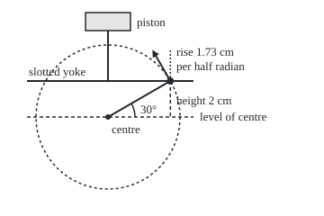
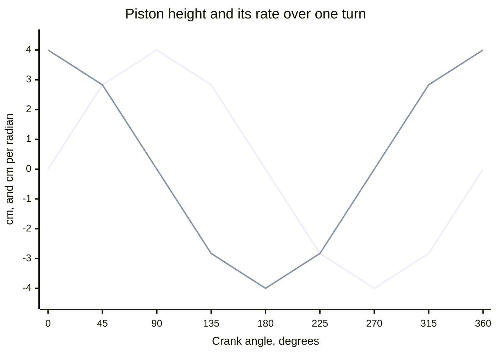

# Derivatives of sine and cosine: why the derivative of sine is cosine

[Syllabus](../../../SYLLABUS.md) → [Calculus and analysis](../../../SYLLABUS.md#w06) → [Derivatives](../../../SYLLABUS.md#w06-s02) → Derivatives of sine and cosine

---

## General Overview

A crank arm 4 cm long turns about a fixed centre. A pin at its tip rides in a horizontal slot in a sliding bar, the slotted yoke, which carries a piston straight up and down. So the piston's height copies the pin's: with the arm at angle x above the horizontal, in radians, both sit 4 sin x cm above the centre.

At 30° the pin is 2 cm up. How fast does the piston climb, in centimetres per radian of turn? The answer is 3.464102, which is 4 cos 30°. The rate of a sine is a cosine.

Two earlier tools prove it for every angle: the addition formula for sine, and the sandwich that traps a small angle between its sine and its tangent. Cosine follows with a minus sign; tangent and secant by the quotient rule.

**In radians, the rate of sin x is cos x and the rate of cos x is minus sin x, because the addition formula reduces every angle's rate to two limits at zero, and the small-angle sandwich settles both.**

**What kind of fact this is:** a theorem, proved on this card in Why it works.

### The picture: the pin, its height, and where it is heading

<p align="center"></p>

Scale: 1 cm = 20 units. Centre (120.00, 130.00), pin (189.28, 90.00). The arrow is half a radian of travel at the pin's 30° speed and direction, ending at (169.28, 55.36). Its upward part, 1.73 cm, is half of the formula's 3.464102 cm per radian.



The line starting at 0 is the height, 4 sin x cm. The line starting at 4 is its rate from the code's difference quotient: 4 cos x, a quarter turn ahead.

---

## The formula

A reminder of notation: the derivative of f at x, written f'(x) or dy/dx and read "the rate of y per unit of x", is the limit of the rise over the run, (f(x + h) − f(x))/h, as the step h heads for 0 ([The derivative](01-the-derivative.md)). d/dx in front of a function means its derivative, with x as the input.

$$\frac{d}{dx}\sin x = \cos x, \qquad \frac{d}{dx}\cos x = -\sin x$$

**Read it aloud:** in radians, sine changes at the rate cos x, and cosine at the rate minus sin x.

Secant is sec x = 1/cos x. By the quotient rule, wherever cos x is not zero:

$$\frac{d}{dx}\tan x = \frac{1}{\cos^2 x} = \sec^2 x, \qquad \frac{d}{dx}\sec x = \frac{\sin x}{\cos^2 x} = \sec x \tan x$$

For the piston, with arm length r, $y = r\sin x$, so dy/dx = r cos x cm per radian; turning at $\omega$ radians per second, the chain rule gives dy/dt = r cos x × $\omega$ cm/s.

| Symbol | Plain meaning | In our example | Push it up and the answer… |
| --- | --- | --- | --- |
| $x$ | crank angle above the horizontal, radians | 30° | the rate r cos x falls, to 0 at 90° |
| $h$ | a small extra turn: the run | 0.1, 0.01, 0.001 | the quotient drifts from the rate |
| $r$ | crank arm length | 4 cm | every rate scales with it |
| $y$ | piston height above the centre | 2 cm | — |
| $\sin x$, $\cos x$ | height and reach on an arm of length 1 | 0.500000, 0.866025 | — |
| $\tan x$, $\sec x$ | sin x / cos x, and 1 / cos x | rates 1.333333, 0.666667 | both rates blow up near 90° |
| $t$, $\omega$ | time in s; turning rate in radians per s | $\omega$ = 50 | speed grows in step |
| $L$ | connecting rod length, second case | 14 cm | the rod's extra push fades |

### When it holds

- **The angle is in radians.** The sandwich uses a slice of a radius-1 circle having area h/2, true only in radians. In degrees, sine's rate at 0 is 0.017453, not 1.
- **The addition formula holds for every pair of angles** ([Trig identities](../../05-Geometry%20and%20trig/03-Trigonometry/03-trig-identities.md)), so sine and cosine have a rate at every angle.
- **Tangent and secant need cos x not zero.** At 90° neither has a value, so neither has a rate: rise over run from 0.01 below 90° to 0.01 above reads −9999.67, though tangent climbs wherever it is defined.
- **For speeds, the angle must change smoothly in time.** The chain rule needs x to have its own rate; a jerking crank has no speed at the jerk.

---

## Why it works

### Step 0: one formula moves every angle's question to angle zero

The rate at x = 30° asks how sin(x + h) differs from sin x. The addition formula splits sin(x + h) into sin x cos h + cos x sin h. Then

$$\frac{\sin(x+h) - \sin x}{h} = \sin x \cdot \frac{\cos h - 1}{h} + \cos x \cdot \frac{\sin h}{h}$$

Only two quotients depend on h, and neither involves x. Settle their limits and every angle's rate follows.

At 30° with h = 0.1: 0.500000 × (−0.049958) + 0.866025 × 0.998334 = 0.839604. The direct rise-over-run is 0.839604 too: the split is exact.

### Step 1: the sandwich sends (sin h)/h to 1

For h between 0 and a right angle, in radians, [Small angles](../../05-Geometry%20and%20trig/03-Trigonometry/08-small-angles-and-the-sine-bound.md) nests a triangle inside a slice of circle inside a larger triangle and reads off

$$\sin h < h < \tan h$$

Dividing the left half by h gives (sin h)/h < 1. Dividing the right half by h and multiplying by cos h, positive there, gives cos h < (sin h)/h. The ratio is trapped between cos h and 1.

The tolerance game makes "heads for 1" precise. To land within 0.001 of 1, cos h above 0.999 suffices. Step 2 shows 1 − cos h is at most $h^2/2$, so any h below 0.044721 will do. At h = 0.04, cos h is 0.999200 and (sin h)/h is 0.999733: inside the band. Every tighter target gets its own h the same way: that is lim (h → 0) (sin h)/h = 1, read "(sin h)/h heads for 1 as h heads for 0".

A negative h changes nothing: sin(−h)/(−h) equals sin h/h, since sine is odd.

### Step 2: (cos h − 1)/h heads for 0

The half-angle identity gives $1 - \cos h = 2\sin^2(h/2)$. The sandwich says sin(h/2) < h/2, so $1 - \cos h < 2(h/2)^2 = h^2/2$. Divide by h:

$$0 < \frac{1 - \cos h}{h} < \frac{h}{2}$$

For negative h the quotient flips sign but keeps its size. It is squeezed to 0 ([Limit laws and the squeeze](../01-Limits%20and%20Continuity/04-limit-laws-and-the-squeeze.md)). At h = 0.01, (cos h − 1)/h is −0.005000, a hair inside the bound.

### Step 3: sine's rate is cosine

Put the two limits into Step 0's split. The first term heads for sin x × 0, the second for cos x × 1:

$$\frac{d}{dx}\sin x = \cos x$$

For the piston, y = 4 sin x, so dy/dx = 4 cos 30° = 3.464102 cm per radian.

### Step 4: cosine's rate is minus sine

The addition formula for cosine is cos(x + h) = cos x cos h − sin x sin h. The same split gives

$$\frac{\cos(x+h) - \cos x}{h} = \cos x \cdot \frac{\cos h - 1}{h} - \sin x \cdot \frac{\sin h}{h} \;\longrightarrow\; -\sin x$$

The pin's sideways reach, 4 cos x, changes at −2.000000 cm per radian: it moves back towards the piston's line as it rises, as the arrow shows.

### Step 5: tangent and secant by the quotient rule

Tangent is sin x over cos x. The quotient rule ([Product and quotient rules](02-product-and-quotient-rules.md)) gives a top of cos x · cos x + sin x · sin x, which is 1, over $\cos^2 x$: the rate is $\sec^2 x$, 1.333333 at 30°.

Secant is 1 over cos x, so its rate is sin x over $\cos^2 x$, which is sec x tan x: 0.666667 at 30°.

### Step 6: from per radian to per second, and a real engine

The crank turns at 50 radians a second, so x = 50t with t in seconds. The chain rule ([Chain rule](03-chain-rule.md)) multiplies the rates: 3.464102 cm per radian × 50 radians per second = 173.205 cm/s.

Most engines use a connecting rod of length L from the pin to a piston above the centre. The piston sits $r\sin x$ up plus the rod's upright part, $\sqrt{L^2 - (r\cos x)^2}$ by Pythagoras. The rate of cosine and the chain rule give:

$$\frac{dy}{dx} = r\cos x + \frac{r^2 \cos x \sin x}{\sqrt{L^2 - r^2\cos^2 x}}$$

With L = 14 cm at 30° this is 3.97486 cm per radian, against the yoke's 3.46410: the tilting rod adds a push.

<details>
<summary>Detailed proof: the two limits with epsilon and delta</summary>

For every ε > 0, take δ = min(1, √(2ε)). If 0 < h < δ, the sandwich gives cos h < sin h / h < 1, so $\lvert \sin h / h - 1 \rvert < 1 - \cos h < h^2/2 < \varepsilon$; negative h gives the same ratio.

For (cos h − 1)/h, take δ = min(1, 2ε): then its size is below |h|/2 < ε.

Fix x. Sine's quotient minus cos x equals sin x · (cos h − 1)/h + cos x · (sin h / h − 1). With both brackets below ε/2 and |sin x|, |cos x| ≤ 1, the whole is below ε. Cosine is the same with Step 4's signs.

</details>

A second road to cosine's rule: cos x = sin(π/2 − x), and the chain rule gives cos(π/2 − x) × (−1) = −sin x.

---

## Worked numbers, by hand

| Step | Arithmetic | Value |
| --- | --- | --- |
| crank at 30° | sin 30°, cos 30° | 0.500000, 0.866025 |
| piston height | 4 × 0.500000 | 2 cm |
| piston's rate | 4 × cos 30° | **3.464102 cm per radian** |
| piston's speed | 3.464102 × 50 | **173.205 cm/s** |
| tangent's rate | 1 / (0.866025 × 0.866025) | 1.333333 per radian |
| rod engine, L = 14 cm | chain rule, Step 6 | 3.97486 cm per radian |

### What breaks if you drop a piece

| Mistake | Comes out at | What went wrong |
| --- | --- | --- |
| Angle in degrees | rate 0.017453 at 0, not 1 | the sandwich's h/2 area needs radians |
| Minus sign dropped on cosine | sideways rate +2, not −2 | the pin moves inward as it rises |
| $\tan^2 x$ for tangent's rate | 0.333333, not 1.333333 | $\sec^2 x$ is $1 + \tan^2 x$; the 1 was lost |
| Tangent's rule across 90° | quotient −9999.67 over 0.02 | no value at 90°, so no rate |

The code prints all four.

---

## Code, from first principles, and it actually runs

Two roads to every rate: the proved formula, and a rise over run at shrinking steps h = 0.1, 0.01, 0.001, closing in on it. The sandwich, Step 0's split, the speed and the rod engine are checked the same way.

### Python

```python
# Derivatives of sine and cosine -- the check behind the card.  math.sin and
# math.cos are primitives; every derivative here comes from this script's own
# difference quotient.  A crank of radius 4 cm turns at 50 radians a second;
# a slotted yoke makes the piston's height y = 4 sin x cm at crank angle x.
import math
R, W, L, X = 4.0, 50.0, 14.0, math.pi / 6       # cm, rad/s, cm, 30 degrees

def slope(f, x, h):                             # road two: rise over run
    return (f(x + h) - f(x)) / h

def c2(v):                                      # print a tiny float as 0.00
    return "0.00" if abs(v) < 0.005 else f"{v:.2f}"

height, side = (lambda x: R * math.sin(x)), (lambda x: R * math.cos(x))
tan, sec = (lambda x: math.sin(x) / math.cos(x)), (lambda x: 1 / math.cos(x))
rod = lambda x: R * math.sin(x) + math.sqrt(L * L - (R * math.cos(x)) ** 2)
s, c = math.sin(X), math.cos(X)
for h in (0.5, 0.1, 0.01):
    q, k = math.sin(h) / h, (math.cos(h) - 1) / h
    assert math.cos(h) < q < 1 and abs(k) <= h / 2     # the sandwich and its twin
    print(f"sandwich h = {h:.2f}: cos h = {math.cos(h):.6f} < sin h / h = {q:.6f} < 1; (cos h - 1) / h = {k:.6f}")
g = math.sqrt(0.002)
print(f"within 0.001 of 1: h below {g:.6f} is enough; at h = 0.04, cos h = {math.cos(0.04):.6f}, sin h / h = {math.sin(0.04) / 0.04:.6f}")
split = s * (math.cos(0.1) - 1) / 0.1 + c * math.sin(0.1) / 0.1
direct = (math.sin(X + 0.1) - s) / 0.1
assert abs(split - direct) < 1e-12                  # the addition formula at work
print(f"split at h = 0.10: {s:.6f} x {(math.cos(0.1) - 1) / 0.1:.6f} + {c:.6f} x {math.sin(0.1) / 0.1:.6f} = {split:.6f}; direct quotient {direct:.6f}")
print(f"crank at 30 deg: sin x = {s:.6f}, cos x = {c:.6f}; piston height {R * s:.6f} cm, pin sideways {R * c:.6f} cm")
rules = [("height 4 sin x", height, R * c), ("sideways 4 cos x", side, -R * s),
         ("tan x", tan, 1 / (c * c)), ("sec x", sec, s / (c * c))]
for name, f, rule in rules:
    q = [slope(f, X, h) for h in (0.1, 0.01, 0.001)]
    assert abs(slope(f, X, 1e-6) - rule) < 1e-5     # formula against quotient
    print(f"{name} at 30 deg: rule {rule:.6f}; quotients h = 0.1, 0.01, 0.001: {q[0]:.6f}, {q[1]:.6f}, {q[2]:.6f}")
v = slope(lambda t: height(W * t), X / W, 1e-7)
rr = R * c + R * R * c * s / math.sqrt(L * L - (R * c) ** 2)
qr = slope(rod, X, 1e-7)
assert abs(v - R * c * W) < 1e-3 and abs(qr - rr) < 1e-5   # speed and rod engine, two roads each
print(f"piston speed at 30 deg: rule 4 cos x times 50 = {R * c * W:.3f} cm/s; time quotient {v:.3f} cm/s")
print(f"rod engine, rod 14 cm: rule {rr:.5f} cm/rad; quotient {qr:.5f}; yoke {R * c:.5f}")
deg = slope(lambda u: math.sin(u * math.pi / 180), 0.0, 1e-6)
print(f"mistake, degrees: rate of sine at 0 is {deg:.6f} per degree, not 1; sign dropped: sideways +{R * s:.6f} for {-R * s:.6f}")
print(f"mistake, tan squared: {tan(X) ** 2:.6f} for {1 / (c * c):.6f}; straddling 90 deg, h = 0.01: {(tan(math.pi / 2 + 0.01) - tan(math.pi / 2 - 0.01)) / 0.02:.2f}")
grid = [k * math.pi / 4 for k in range(9)]
print("chart height cm:", ", ".join(c2(height(x)) for x in grid))
print("chart rate cm/rad:", ", ".join(c2(slope(height, x, 1e-6)) for x in grid))
tip = (120 + 20 * R * c - 40 * s, 130 - 20 * R * s - 40 * c)
print(f"figure, centre (120.00, 130.00), pin ({120 + 20 * R * c:.2f}, {130 - 20 * R * s:.2f}), arrow tip ({tip[0]:.2f}, {tip[1]:.2f}), rise {40 * c / 20:.2f} cm")
print("ALL CHECKS PASS")
```

**Ran 2026-09-27 on macOS, Python 3.14.6, standard library only. All checks passed. Output, pasted from the run:**

```
sandwich h = 0.50: cos h = 0.877583 < sin h / h = 0.958851 < 1; (cos h - 1) / h = -0.244835
sandwich h = 0.10: cos h = 0.995004 < sin h / h = 0.998334 < 1; (cos h - 1) / h = -0.049958
sandwich h = 0.01: cos h = 0.999950 < sin h / h = 0.999983 < 1; (cos h - 1) / h = -0.005000
within 0.001 of 1: h below 0.044721 is enough; at h = 0.04, cos h = 0.999200, sin h / h = 0.999733
split at h = 0.10: 0.500000 x -0.049958 + 0.866025 x 0.998334 = 0.839604; direct quotient 0.839604
crank at 30 deg: sin x = 0.500000, cos x = 0.866025; piston height 2.000000 cm, pin sideways 3.464102 cm
height 4 sin x at 30 deg: rule 3.464102; quotients h = 0.1, 0.01, 0.001: 3.358414, 3.454044, 3.463101
sideways 4 cos x at 30 deg: rule -2.000000; quotients h = 0.1, 0.01, 0.001: -2.169729, -2.017287, -2.001732
tan x at 30 deg: rule 1.333333; quotients h = 0.1, 0.01, 0.001: 1.420057, 1.341121, 1.334104
sec x at 30 deg: rule 0.666667; quotients h = 0.1, 0.01, 0.001: 0.771570, 0.676368, 0.667630
piston speed at 30 deg: rule 4 cos x times 50 = 173.205 cm/s; time quotient 173.205 cm/s
rod engine, rod 14 cm: rule 3.97486 cm/rad; quotient 3.97486; yoke 3.46410
mistake, degrees: rate of sine at 0 is 0.017453 per degree, not 1; sign dropped: sideways +2.000000 for -2.000000
mistake, tan squared: 0.333333 for 1.333333; straddling 90 deg, h = 0.01: -9999.67
chart height cm: 0.00, 2.83, 4.00, 2.83, 0.00, -2.83, -4.00, -2.83, 0.00
chart rate cm/rad: 4.00, 2.83, 0.00, -2.83, -4.00, -2.83, 0.00, 2.83, 4.00
figure, centre (120.00, 130.00), pin (189.28, 90.00), arrow tip (169.28, 55.36), rise 1.73 cm
ALL CHECKS PASS
```

### Rust

Same numbers, same labels, built with `rustc --edition 2021 -O`.

```rust
// Derivatives of sine and cosine -- the same check as the Python, in Rust, std
// only.  f64::sin and f64::cos are primitives; every derivative comes from this
// program's own difference quotient.  Crank radius 4 cm, 50 radians a second,
// piston height y = 4 sin x cm at crank angle x.
use std::f64::consts::PI;
const R: f64 = 4.0;
const W: f64 = 50.0;
const L: f64 = 14.0;

fn slope(f: &dyn Fn(f64) -> f64, x: f64, h: f64) -> f64 {
    (f(x + h) - f(x)) / h // road two: rise over run
}

fn c2(v: f64) -> String {
    if v.abs() < 0.005 { "0.00".to_string() } else { format!("{:.2}", v) }
}

fn main() {
    let x0 = PI / 6.0; // 30 degrees
    let height = |x: f64| R * x.sin();
    let side = |x: f64| R * x.cos();
    let tan = |x: f64| x.sin() / x.cos();
    let sec = |x: f64| 1.0 / x.cos();
    let rod = |x: f64| R * x.sin() + (L * L - (R * x.cos()).powi(2)).sqrt();
    let (s, c) = (x0.sin(), x0.cos());
    for h in [0.5_f64, 0.1, 0.01] {
        let (q, k) = (h.sin() / h, (h.cos() - 1.0) / h);
        assert!(h.cos() < q && q < 1.0 && k.abs() <= h / 2.0); // the sandwich and its twin
        println!("sandwich h = {:.2}: cos h = {:.6} < sin h / h = {:.6} < 1; (cos h - 1) / h = {:.6}", h, h.cos(), q, k);
    }
    let g = 0.002_f64.sqrt();
    println!("within 0.001 of 1: h below {:.6} is enough; at h = 0.04, cos h = {:.6}, sin h / h = {:.6}",
             g, 0.04_f64.cos(), 0.04_f64.sin() / 0.04);
    let split = s * (0.1_f64.cos() - 1.0) / 0.1 + c * 0.1_f64.sin() / 0.1;
    let direct = ((x0 + 0.1).sin() - s) / 0.1;
    assert!((split - direct).abs() < 1e-12); // the addition formula at work
    println!("split at h = 0.10: {:.6} x {:.6} + {:.6} x {:.6} = {:.6}; direct quotient {:.6}",
             s, (0.1_f64.cos() - 1.0) / 0.1, c, 0.1_f64.sin() / 0.1, split, direct);
    println!("crank at 30 deg: sin x = {:.6}, cos x = {:.6}; piston height {:.6} cm, pin sideways {:.6} cm", s, c, R * s, R * c);
    let rules: [(&str, &dyn Fn(f64) -> f64, f64); 4] = [
        ("height 4 sin x", &height, R * c), ("sideways 4 cos x", &side, -R * s),
        ("tan x", &tan, 1.0 / (c * c)), ("sec x", &sec, s / (c * c))];
    for (name, f, rule) in rules {
        let q: Vec<f64> = [0.1, 0.01, 0.001].iter().map(|&h| slope(f, x0, h)).collect();
        assert!((slope(f, x0, 1e-6) - rule).abs() < 1e-5); // formula against quotient
        println!("{} at 30 deg: rule {:.6}; quotients h = 0.1, 0.01, 0.001: {:.6}, {:.6}, {:.6}", name, rule, q[0], q[1], q[2]);
    }
    let v = slope(&|t: f64| height(W * t), x0 / W, 1e-7);
    let rr = R * c + R * R * c * s / (L * L - (R * c).powi(2)).sqrt();
    let qr = slope(&rod, x0, 1e-7);
    assert!((v - R * c * W).abs() < 1e-3 && (qr - rr).abs() < 1e-5); // speed and rod engine, two roads each
    println!("piston speed at 30 deg: rule 4 cos x times 50 = {:.3} cm/s; time quotient {:.3} cm/s", R * c * W, v);
    println!("rod engine, rod 14 cm: rule {:.5} cm/rad; quotient {:.5}; yoke {:.5}", rr, qr, R * c);
    let deg = slope(&|u: f64| (u * PI / 180.0).sin(), 0.0, 1e-6);
    println!("mistake, degrees: rate of sine at 0 is {:.6} per degree, not 1; sign dropped: sideways +{:.6} for {:.6}", deg, R * s, -R * s);
    println!("mistake, tan squared: {:.6} for {:.6}; straddling 90 deg, h = 0.01: {:.2}",
             tan(x0).powi(2), 1.0 / (c * c), (tan(PI / 2.0 + 0.01) - tan(PI / 2.0 - 0.01)) / 0.02);
    let grid: Vec<f64> = (0..9).map(|k| k as f64 * PI / 4.0).collect();
    let hs: Vec<String> = grid.iter().map(|&x| c2(height(x))).collect();
    let rs: Vec<String> = grid.iter().map(|&x| c2(slope(&height, x, 1e-6))).collect();
    println!("chart height cm: {}", hs.join(", "));
    println!("chart rate cm/rad: {}", rs.join(", "));
    let tip = (120.0 + 20.0 * R * c - 40.0 * s, 130.0 - 20.0 * R * s - 40.0 * c);
    println!("figure, centre (120.00, 130.00), pin ({:.2}, {:.2}), arrow tip ({:.2}, {:.2}), rise {:.2} cm",
             120.0 + 20.0 * R * c, 130.0 - 20.0 * R * s, tip.0, tip.1, 40.0 * c / 20.0);
    println!("ALL CHECKS PASS");
}
```

**Ran 2026-09-27 on macOS, rustc 1.98.1, no crates. All checks passed. Output, pasted from the run:**

```
sandwich h = 0.50: cos h = 0.877583 < sin h / h = 0.958851 < 1; (cos h - 1) / h = -0.244835
sandwich h = 0.10: cos h = 0.995004 < sin h / h = 0.998334 < 1; (cos h - 1) / h = -0.049958
sandwich h = 0.01: cos h = 0.999950 < sin h / h = 0.999983 < 1; (cos h - 1) / h = -0.005000
within 0.001 of 1: h below 0.044721 is enough; at h = 0.04, cos h = 0.999200, sin h / h = 0.999733
split at h = 0.10: 0.500000 x -0.049958 + 0.866025 x 0.998334 = 0.839604; direct quotient 0.839604
crank at 30 deg: sin x = 0.500000, cos x = 0.866025; piston height 2.000000 cm, pin sideways 3.464102 cm
height 4 sin x at 30 deg: rule 3.464102; quotients h = 0.1, 0.01, 0.001: 3.358414, 3.454044, 3.463101
sideways 4 cos x at 30 deg: rule -2.000000; quotients h = 0.1, 0.01, 0.001: -2.169729, -2.017287, -2.001732
tan x at 30 deg: rule 1.333333; quotients h = 0.1, 0.01, 0.001: 1.420057, 1.341121, 1.334104
sec x at 30 deg: rule 0.666667; quotients h = 0.1, 0.01, 0.001: 0.771570, 0.676368, 0.667630
piston speed at 30 deg: rule 4 cos x times 50 = 173.205 cm/s; time quotient 173.205 cm/s
rod engine, rod 14 cm: rule 3.97486 cm/rad; quotient 3.97486; yoke 3.46410
mistake, degrees: rate of sine at 0 is 0.017453 per degree, not 1; sign dropped: sideways +2.000000 for -2.000000
mistake, tan squared: 0.333333 for 1.333333; straddling 90 deg, h = 0.01: -9999.67
chart height cm: 0.00, 2.83, 4.00, 2.83, 0.00, -2.83, -4.00, -2.83, 0.00
chart rate cm/rad: 4.00, 2.83, 0.00, -2.83, -4.00, -2.83, 0.00, 2.83, 4.00
figure, centre (120.00, 130.00), pin (189.28, 90.00), arrow tip (169.28, 55.36), rise 1.73 cm
ALL CHECKS PASS
```

> [!TIP]
> **Try changing**
> Guess first, then run it.
> - **A slower crank.** Set `W` to `25.0`. Guess: the speed halves, and the rates per radian do not move at all.
> - **Degrees by mistake.** In the `rules` list, give the height rule as `R * c * math.pi / 180`. The height assert stops the run: the quotient still says 3.464102.
> - **A longer rod.** Set `L` to `1400.0`. Guess: the rod engine's rate nears the yoke's 3.46410, since a long rod barely tilts.

---

## The usual mistake

> [!warning]
> **Using the rules in degrees.** The sandwich compares a length with an angle, which works only when the angle is arc length on a radius-1 circle: a radian. In degrees, the rate of sin x is (π/180) cos x, 0.017453 at 0, not 1.
>
> - **Dropping cosine's minus sign.** The pin's sideways reach shrinks as it rises: −2, not +2 cm per radian.
> - **Writing $\tan^2 x$ for tangent's rate.** At 30° that gives 0.333333 instead of 1.333333.
> - **Proving (sin h)/h → 1 with a rule that uses sine's derivative.** That argues in a circle.

---

## Where you meet it in real life

- **Engines and pumps.** A piston's speed at each crank angle is r cos x times the turning rate, plus Step 6's rod term.
- **Anything that vibrates.** A spring's bounce and alternating current follow sines in time; their rates are cosines, a quarter turn ahead.
- **Second rates.** Applying the rule twice returns minus sine: the piston's acceleration points against its height ([Second derivatives](08-higher-derivatives-and-concavity.md)).

> **Say it back**
> The addition formula splits sine's rise-over-run into cos x times (sin h)/h plus sin x times (cos h − 1)/h. The sandwich sends the first quotient to 1 and the second to 0. So sine's rate is cosine, and the same split gives minus sine for cosine. The quotient rule gives tangent and secant. All of it holds in radians only.

---

## What this builds on

- [Chain rule](03-chain-rule.md): turns cm per radian into cm per second, and handles the rod engine.
- [Trig identities](../../05-Geometry%20and%20trig/03-Trigonometry/03-trig-identities.md): the addition formulas that do Step 0, and the half-angle identity of Step 2.
- [Small angles](../../05-Geometry%20and%20trig/03-Trigonometry/08-small-angles-and-the-sine-bound.md): the sandwich sin h < h < tan h.

## Where this goes next

- [Trig substitution](../04-Integrals/06-trig-substitution.md): runs these rules backwards, swapping a square root for a sine to find areas.

---

## Sources

Verified 2026-09-27: every link below resolves to the publisher's page.

- OpenStax. *Calculus Volume 1*, §3.5 "Derivatives of Trigonometric Functions". [Publisher page](https://openstax.org/books/calculus-volume-1/pages/3-5-derivatives-of-trigonometric-functions). The addition-formula proof and the tangent and secant rules.
- OpenStax. *Calculus Volume 1*, §2.3 "The Limit Laws". [Publisher page](https://openstax.org/books/calculus-volume-1/pages/2-3-the-limit-laws). The squeeze theorem and the geometric bounds behind the two limits at zero.
