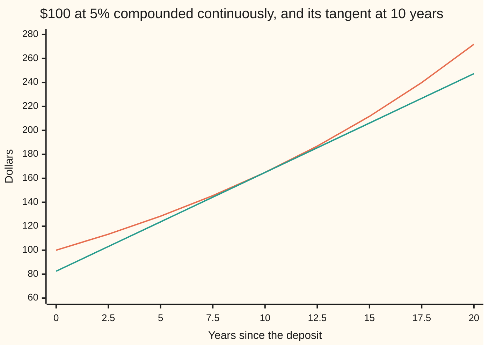

# Derivatives of exp and log: the function that is its own rate, and its inverse

Calculus and analysis → Derivatives → Growth that feeds itself → Derivatives of exp and log

---

## General Overview

Put $100 in an account paying 5% a year, compounded continuously: interest is added at every instant, not once a year. After ten years it holds 100 × e^0.5 = 164.87 dollars, where e = 2.718282 is the compounding ceiling from [compounding-frequency-and-e](../../01-Foundations/04-Compound%20Growth%20and%20Discounting/04-compounding-frequency-and-e.md).

How fast is the money growing at that moment? At 5% of whatever is there: 0.05 × 164.87 = 8.24 dollars per year. Money that earns interest on its interest grows at a speed set by its own size.

Behind it is one function: e^x, e raised to the power x, changes at a rate equal to its own value. Its inverse, the natural log ln x, answers how long until a target is reached, and changes at rate 1/x.

**The function e^x changes at a rate equal to its own value, its inverse ln x changes at rate 1/x, and every other base picks up the factor ln b.**

**What kind of fact this is:** a theorem, proved on this card in Why it works from two compounding inequalities.

### The picture: the balance and its tangent at ten years



The curving line is the balance. The straight line is its tangent at ten years, touching at 164.87 dollars and climbing at 8.24 dollars per year.

---

## The formula

A reminder from [the-derivative](01-the-derivative.md): f'(x), also written dy/dx, is the rate of y per unit of x. Written in front of an expression, d/dx means "the rate, per unit of x, of what follows".

$$\frac{d}{dx}\,e^x = e^x, \qquad \frac{d}{dx}\,\ln x = \frac{1}{x} \quad (x > 0)$$

**Read it aloud:** e to the x grows at a rate equal to itself; the natural log of x grows at one over x.

The balance after $t$ years is $B$ = 100 e^(rt), with $r$ = 0.05. The chain rule ([chain-rule](03-chain-rule.md)) adds the inner rate r:

$$\frac{dB}{dt} = r \cdot 100\,e^{rt} = r\,B$$

Units: r per year times dollars gives dollars per year.

For any positive base $b$, and the log to that base when b ≠ 1:

$$\frac{d}{dx}\,b^x = b^x \ln b, \qquad \frac{d}{dx}\,\log_b x = \frac{1}{x \ln b}$$

And for a positive quantity f built from products and powers, **logarithmic differentiation** reads its relative rate, its rate divided by its value, off its log:

$$\frac{f'}{f} = \frac{d}{dx}\,\ln f$$

| Symbol | Plain meaning | In our example | Push it up and the answer… |
| --- | --- | --- | --- |
| $e$ | the compounding ceiling | 2.718282 | fixed; nothing moves it |
| $x$, $h$ | any input; a small step added to it | h = 0.01 year | the secant drifts from the rate |
| $t$ | years since the deposit | 10 | balance and rate both rise |
| $r$ | continuous interest rate per year | 0.05 | rate rises, faster later |
| $B$ | balance in dollars; its rate is dB/dt | 164.87; 8.24 per year | rate rises in proportion |
| $T$ | years needed to reach a balance B | 13.862944 for 200 | each extra dollar costs less time |
| $b$ | another positive base | 1.05, yearly compounding | the factor ln b rises |
| $n$, $p$, $V$ | fund shares, share price, fund value | 200; 32.974425; 6594.885083 | relative rates add |

### When it holds

- **Positive base, positive log input.** (−2)^0.5 and ln 0 are not real numbers; there is no curve to differentiate.
- **The balance moves smoothly.** A bank crediting interest once a year makes a staircase with no rate at a credit date. Over a 0.001-year step the secant from the left is 7756.6 dollars per year, from the right 0.0; shrink the step and the left one grows without bound.

---

## Why it works

### Step 0: every point is the point zero, rescaled

Powers of e multiply: e^(x+h) = e^x × e^h. So

$$\frac{e^{x+h} - e^x}{h} = e^x \cdot \frac{e^h - 1}{h}.$$

The slope at x is e^x times the slope at 0. The theorem reduces to one fact: the slope at zero is exactly 1.

### Step 1: compounding squeezes the slope at zero to 1

Two inequalities from the e card:

- **Compounding beats simple interest:** e^h ≥ 1 + h.
- **The same, run backwards:** e^(−h) ≥ 1 − h, and e^(−h) = 1/e^h, so e^h ≤ 1/(1 − h) when h < 1.

Subtract 1 and divide by a positive h:

$$1 \;\le\; \frac{e^h - 1}{h} \;\le\; \frac{1}{1-h} \qquad (0 < h < 1)$$

For negative h the division flips the walls: the quotient sits between 1/(1 − h) and 1. At h = 0.01 the quotient is 1.005017, between 1 and 1.010101. At h = −0.01 it is 0.995017, between 0.990099 and 1.

The tolerance game: to land within 0.001 of 1, the wall 1/(1 − h) must be within 0.001 of 1, which holds once h is no more than 0.000999 in size, either sign. Both walls close on 1, so the limit is 1.

<details>
<summary>Detailed proof</summary>

*The inequalities.* For h > −n, (1 + h/n)^n ≥ 1 + h for every whole n ≥ 1 (Bernoulli's inequality), by induction: multiply (1 + h/n)^k ≥ 1 + kh/n by the positive 1 + h/n and drop the term kh^2/n^2, which is not negative. The e card makes e^h the limit of (1 + h/n)^n, so e^h ≥ 1 + h. With −h in place of h, e^(−h) ≥ 1 − h; for h < 1 both sides are positive, and inverting gives e^h ≤ 1/(1 − h).

*The limit.* For 0 < |h| < 1 the walls give |(e^h − 1)/h − 1| ≤ |h|/(1 − |h|). Given ε > 0, δ = ε/(1 + ε) makes this below ε whenever 0 < |h| < δ.

*The log.* For u > −1 put h = ln(1 + u) in e^h ≥ 1 + h and e^(−h) ≥ 1 − h: ln(1 + u) ≤ u and ln(1 + u) ≥ u/(1 + u). With u = k/x, x > 0, the quotient (ln(x + k) − ln x)/k lies between 1/(x + k) and 1/x, for either sign of k. Both tend to 1/x.

</details>

### Step 2: the account's rate is 5% of the account

The chain rule feeds rt into e^x and multiplies by the inner rate r: dB/dt = r × B. At ten years, 0.05 × 164.872127 = 8.243606 dollars per year. Secants over 0.1, 0.01 and 0.001 year miss it by 0.020643, 0.002061 and 0.000206: tenfold closer each time.

### Step 3: the log is squeezed the same way

The log undoes the exponential: y = ln x exactly when e^y = x. Put a log in place of h in the same two inequalities and they trap the log's difference quotient over a step k > 0 between 1/(x + k) and 1/x. Both walls close on 1/x.

In money terms, the years to reach a balance B are $T$ = ln(B/100)/r, with rate 1/(rB) years per dollar. Reaching 200 dollars takes 13.862944 years; each extra dollar of target adds 0.1 year. At 164.87 dollars it costs 0.121306 years, which is 1/8.243606: years per dollar flips dollars per year. The flip for any inverse is [implicit-and-inverse-differentiation](06-implicit-and-inverse-differentiation.md).

### Step 4: any other base goes through e

A positive base is a power of e: b = e^(ln b), so b^x = e^(x ln b), and the chain rule supplies the inner rate ln b. Yearly compounding at 5% is base 1.05, and ln 1.05 = 0.048790. At ten years that balance is 162.889463 dollars, growing at 7.947404 dollars per year. The log to base b is ln x divided by the constant ln b, so its rate is 1/(x ln b). Likewise x^a = e^(a ln x) has rate a x^(a−1) for x > 0.

### Step 5: logarithmic differentiation adds relative rates

Logs turn products into sums: ln(np) = ln n + ln p. Differentiate with the chain rule:

$$\frac{V'}{V} = \frac{n'}{n} + \frac{p'}{p}.$$

A fund starts with 100 shares and buys 10 a year, so at ten years $n$ = 200 shares, relative rate 10/200 = 0.05. Each share's price $p$ = 20e^(0.05t) is 32.974425 dollars, relative rate 0.05. The value $V$ = 6594.885083 has relative rate 0.10, so it grows at 659.488508 dollars per year. The product rule from [product-and-quotient-rules](02-product-and-quotient-rules.md) agrees; for long products, logs are shorter.

---

## Worked numbers, by hand

| Step | Arithmetic | Value |
| --- | --- | --- |
| balance at 10 years | 100 × e^0.5 = 100 × 1.648721 | 164.87 dollars |
| rate of the balance | 0.05 × 164.872127 | **8.24 dollars per year** |
| years to reach 200 | ln 2 ÷ 0.05 = 0.693147 ÷ 0.05 | 13.862944 years |
| time per extra dollar at 200 | 1 ÷ (0.05 × 200) | 0.1 year |
| yearly 5%, rate at 10 years | 162.889463 × 0.048790 | 7.95 dollars per year |
| fund, relative rate | 10 ÷ 200 + 0.05 | 0.10 per year |
| fund, rate | 0.10 × 6594.885083 | 659.49 dollars per year |

### What breaks if you drop a piece

| Mistake | Comes out at | What went wrong |
| --- | --- | --- |
| Inner rate 0.05 dropped | 164.872127 dollars per year | The exponent moves at 0.05 per year, not 1 |
| Power rule on 1.05^t: t × 1.05^(t−1) × 100 | 1551.328216 dollars per year | The variable is in the exponent, not the base |
| 5% used for base 1.05 | 8.144473, not 7.947404 | The factor is ln 1.05 = 0.048790 |
| Interest credited once a year | left 7756.6, right 0.0 | A staircase has no rate at a credit date |

The code prints all four.

---

## Code, from first principles, and it actually runs

Two roads to each rate: the card's formula, and shrinking difference quotients on an e^x the script sums from its own series, so no derivative formula enters the second road. It also prints the Step 1 squeeze, the log, the other base, the fund three ways, the mistakes and every chart point. `NOW` is the moment of looking, 10 years.

### Python

```python
# Derivatives of exp and log -- the check behind the card.  $100 grows at 5% a
# year, compounded continuously.  math supplies exp and log as primitives only:
# every rate is found twice, by the card's formula and by shrinking difference
# quotients on an exponential summed from its own series.
import math
R, B0, NOW = 0.05, 100.0, 10.0                 # rate, deposit, the moment we look
def my_exp(x):                                   # e^x from its series, term by term
    term, total, k = 1.0, 1.0, 0
    while abs(term) > 1e-17 * total:
        k += 1; term *= x / k; total += term
    return total
def bal(t): return B0 * my_exp(R * t)            # road 2's balance
def years_to(b): return math.log(b / B0) / R     # years until the balance reads b
def fund(t): return (100 + 10 * t) * 20 * my_exp(R * t)   # shares times price
def sec(f, x, h): return (f(x + h) - f(x)) / h   # forward difference quotient
def mid(f, x): return (f(x + 1e-5) - f(x - 1e-5)) / 2e-5  # central, for the asserts
b10 = B0 * math.exp(R * NOW); rate = R * b10     # road 1: rate = 5% of the balance
print(f"e = {my_exp(1):.6f}, e^{R * NOW:g} = {my_exp(R * NOW):.6f}; balance at {NOW:g} years {b10:.6f} "
      f"(series road {bal(NOW):.6f}); rate r x B = {rate:.6f} $/yr")
for h in (0.1, 0.01, 0.001):
    q = sec(bal, NOW, h)
    print(f"secant over h = {h:g} yr: {q:.6f} $/yr, error {q - rate:.6f}")
ok = True
for h in (0.1, 0.01, 0.001, -0.01):
    q, top = (my_exp(h) - 1) / h, 1 / (1 - h)
    lo, hi = min(1, top), max(1, top)
    ok = ok and lo <= q <= hi
    print(f"slope at zero, h = {h:g}: {lo:.6f} <= {q:.6f} <= {hi:.6f}")
print(f"tolerance: 1/(1 - h) - 1 <= 0.001 once h <= {0.001 / 1.001:.6f}")
for b in (b10, 200.0):
    print(f"years to reach {b:.2f}: {math.log(b / B0):.6f} / r = {years_to(b):.6f}; 1/(r B) = {1 / (R * b):.6f} yr per $, "
          f"secant {sec(years_to, b, 0.001):.6f}")
a10, lnb = 1.05 ** NOW, math.log(1.05)           # another base: rate x ln b
print(f"annual 5%: balance {B0 * a10:.6f}, ln 1.05 = {lnb:.6f}, rate {B0 * a10 * lnb:.6f} $/yr")
n = 100 + 10 * NOW; v, rel = fund(NOW), 10 / n + R
print(f"fund at {NOW:g} years: {n:g} shares x {20 * my_exp(R * NOW):.6f} = {v:.6f}; V'/V = {10 / n:.2f} + {R:.2f} = {rel:.2f}")
print(f"fund rate by logs {v * rel:.6f}, by product rule {10 * 20 * my_exp(R * NOW) + n * 20 * R * my_exp(R * NOW):.6f}, "
      f"by secant {mid(fund, NOW):.6f}")
print(f"mistake 1, inner 0.05 dropped: {b10:.6f} $/yr; mistake 2, power rule on 1.05^t: {B0 * NOW * 1.05 ** (NOW - 1):.6f}")
print(f"mistake 3, 5% of the annual balance: {0.05 * B0 * a10:.6f} $/yr, not {B0 * a10 * lnb:.6f}")
def stair(t): return B0 * 1.05 ** math.floor(t)  # interest credited once a year
print(f"staircase at year {NOW:g}: left secant {sec(stair, NOW, -0.001):.1f}, right secant {sec(stair, NOW, 0.001):.1f} $/yr")
pts = [2.5 * i for i in range(9)]
print("chart, balance at t = 0, 2.5, ..., 20:", ", ".join(f"{B0 * math.exp(R * t):.2f}" for t in pts))
print(f"chart, tangent at t = {NOW:g}:", ", ".join(f"{b10 + rate * (t - NOW):.2f}" for t in pts))
assert abs(mid(bal, NOW) - rate) < 1e-6                       # e^x is its own rate
assert ok                                                     # the squeeze on the slope at zero
assert abs(mid(years_to, 200.0) - 1 / (R * 200)) < 1e-8 and abs(mid(lambda t: B0 * 1.05 ** t, NOW) - B0 * a10 * lnb) < 1e-6
assert abs(mid(fund, NOW) - v * rel) < 1e-5                   # logarithmic differentiation
print("ALL CHECKS PASS")
```

**Ran 2026-09-27 on macOS, Python 3.14.6, standard library only. All checks passed. Output, pasted from the run:**

```
e = 2.718282, e^0.5 = 1.648721; balance at 10 years 164.872127 (series road 164.872127); rate r x B = 8.243606 $/yr
secant over h = 0.1 yr: 8.264250 $/yr, error 0.020643
secant over h = 0.01 yr: 8.245668 $/yr, error 0.002061
secant over h = 0.001 yr: 8.243812 $/yr, error 0.000206
slope at zero, h = 0.1: 1.000000 <= 1.051709 <= 1.111111
slope at zero, h = 0.01: 1.000000 <= 1.005017 <= 1.010101
slope at zero, h = 0.001: 1.000000 <= 1.000500 <= 1.001001
slope at zero, h = -0.01: 0.990099 <= 0.995017 <= 1.000000
tolerance: 1/(1 - h) - 1 <= 0.001 once h <= 0.000999
years to reach 164.87: 0.500000 / r = 10.000000; 1/(r B) = 0.121306 yr per $, secant 0.121306
years to reach 200.00: 0.693147 / r = 13.862944; 1/(r B) = 0.100000 yr per $, secant 0.100000
annual 5%: balance 162.889463, ln 1.05 = 0.048790, rate 7.947404 $/yr
fund at 10 years: 200 shares x 32.974425 = 6594.885083; V'/V = 0.05 + 0.05 = 0.10
fund rate by logs 659.488508, by product rule 659.488508, by secant 659.488508
mistake 1, inner 0.05 dropped: 164.872127 $/yr; mistake 2, power rule on 1.05^t: 1551.328216
mistake 3, 5% of the annual balance: 8.144473 $/yr, not 7.947404
staircase at year 10: left secant 7756.6, right secant 0.0 $/yr
chart, balance at t = 0, 2.5, ..., 20: 100.00, 113.31, 128.40, 145.50, 164.87, 186.82, 211.70, 239.89, 271.83
chart, tangent at t = 10: 82.44, 103.05, 123.65, 144.26, 164.87, 185.48, 206.09, 226.70, 247.31
ALL CHECKS PASS
```

### Rust

Same numbers, same labels.

```rust
// Derivatives of exp and log -- the same check as the Python, in Rust.  No
// crates.  $100 grows at 5% a year, compounded continuously.  Every rate is
// found twice, by the card's formula and by shrinking difference quotients on
// an exponential summed from its own series.
const R: f64 = 0.05;
const B0: f64 = 100.0;
const NOW: f64 = 10.0;                            // the moment we look, in years
fn my_exp(x: f64) -> f64 {                        // e^x from its series, term by term
    let (mut term, mut total, mut k) = (1.0_f64, 1.0_f64, 0.0_f64);
    while term.abs() > 1e-17 * total { k += 1.0; term *= x / k; total += term }
    total
}
fn bal(t: f64) -> f64 { B0 * my_exp(R * t) }      // road 2's balance
fn years_to(b: f64) -> f64 { (b / B0).ln() / R }  // years until the balance reads b
fn fund(t: f64) -> f64 { (100.0 + 10.0 * t) * 20.0 * my_exp(R * t) } // shares times price
fn stair(t: f64) -> f64 { B0 * 1.05_f64.powf(t.floor()) } // interest credited once a year
fn annual(t: f64) -> f64 { B0 * 1.05_f64.powf(t) }
fn sec(f: &dyn Fn(f64) -> f64, x: f64, h: f64) -> f64 { (f(x + h) - f(x)) / h }
fn mid(f: &dyn Fn(f64) -> f64, x: f64) -> f64 { (f(x + 1e-5) - f(x - 1e-5)) / 2e-5 }
fn join(v: &[f64]) -> String { v.iter().map(|x| format!("{:.2}", x)).collect::<Vec<_>>().join(", ") }
fn main() {
    let b10 = B0 * (R * NOW).exp();
    let rate = R * b10;                           // road 1: rate = 5% of the balance
    println!("e = {:.6}, e^{} = {:.6}; balance at {} years {:.6} (series road {:.6}); rate r x B = {:.6} $/yr",
             my_exp(1.0), R * NOW, my_exp(R * NOW), NOW, b10, bal(NOW), rate);
    for h in [0.1, 0.01, 0.001] {
        let q = sec(&bal, NOW, h);
        println!("secant over h = {} yr: {:.6} $/yr, error {:.6}", h, q, q - rate);
    }
    let mut ok = true;
    for h in [0.1_f64, 0.01, 0.001, -0.01] {
        let (q, top) = ((my_exp(h) - 1.0) / h, 1.0 / (1.0 - h));
        let (lo, hi) = (top.min(1.0), top.max(1.0));
        ok = ok && lo <= q && q <= hi;
        println!("slope at zero, h = {}: {:.6} <= {:.6} <= {:.6}", h, lo, q, hi);
    }
    println!("tolerance: 1/(1 - h) - 1 <= 0.001 once h <= {:.6}", 0.001 / 1.001);
    for b in [b10, 200.0] {
        println!("years to reach {:.2}: {:.6} / r = {:.6}; 1/(r B) = {:.6} yr per $, secant {:.6}",
                 b, (b / B0).ln(), years_to(b), 1.0 / (R * b), sec(&years_to, b, 0.001));
    }
    let (a10, lnb) = (1.05_f64.powf(NOW), 1.05_f64.ln()); // another base: rate x ln b
    println!("annual 5%: balance {:.6}, ln 1.05 = {:.6}, rate {:.6} $/yr", B0 * a10, lnb, B0 * a10 * lnb);
    let n = 100.0 + 10.0 * NOW;
    let (v, rel, p) = (fund(NOW), 10.0 / n + R, 20.0 * my_exp(R * NOW));
    println!("fund at {} years: {} shares x {:.6} = {:.6}; V'/V = {:.2} + {:.2} = {:.2}", NOW, n, p, v, 10.0 / n, R, rel);
    println!("fund rate by logs {:.6}, by product rule {:.6}, by secant {:.6}",
             v * rel, 10.0 * p + n * R * p, mid(&fund, NOW));
    println!("mistake 1, inner 0.05 dropped: {:.6} $/yr; mistake 2, power rule on 1.05^t: {:.6}",
             b10, B0 * NOW * 1.05_f64.powf(NOW - 1.0));
    println!("mistake 3, 5% of the annual balance: {:.6} $/yr, not {:.6}", 0.05 * B0 * a10, B0 * a10 * lnb);
    println!("staircase at year {}: left secant {:.1}, right secant {:.1} $/yr", NOW, sec(&stair, NOW, -0.001), sec(&stair, NOW, 0.001));
    let pts: Vec<f64> = (0..9).map(|i| 2.5 * i as f64).collect();
    println!("chart, balance at t = 0, 2.5, ..., 20: {}", join(&pts.iter().map(|&t| B0 * (R * t).exp()).collect::<Vec<_>>()));
    println!("chart, tangent at t = {}: {}", NOW, join(&pts.iter().map(|&t| b10 + rate * (t - NOW)).collect::<Vec<_>>()));
    assert!((mid(&bal, NOW) - rate).abs() < 1e-6);                 // e^x is its own rate
    assert!(ok);                                                   // the squeeze on the slope at zero
    assert!((mid(&years_to, 200.0) - 1.0 / (R * 200.0)).abs() < 1e-8 && (mid(&annual, NOW) - B0 * a10 * lnb).abs() < 1e-6);
    assert!((mid(&fund, NOW) - v * rel).abs() < 1e-5);             // logarithmic differentiation
    println!("ALL CHECKS PASS");
}
```

**Ran 2026-09-27 on macOS, rustc 1.98.1, no crates. All checks passed. Output, pasted from the run:**

```
e = 2.718282, e^0.5 = 1.648721; balance at 10 years 164.872127 (series road 164.872127); rate r x B = 8.243606 $/yr
secant over h = 0.1 yr: 8.264250 $/yr, error 0.020643
secant over h = 0.01 yr: 8.245668 $/yr, error 0.002061
secant over h = 0.001 yr: 8.243812 $/yr, error 0.000206
slope at zero, h = 0.1: 1.000000 <= 1.051709 <= 1.111111
slope at zero, h = 0.01: 1.000000 <= 1.005017 <= 1.010101
slope at zero, h = 0.001: 1.000000 <= 1.000500 <= 1.001001
slope at zero, h = -0.01: 0.990099 <= 0.995017 <= 1.000000
tolerance: 1/(1 - h) - 1 <= 0.001 once h <= 0.000999
years to reach 164.87: 0.500000 / r = 10.000000; 1/(r B) = 0.121306 yr per $, secant 0.121306
years to reach 200.00: 0.693147 / r = 13.862944; 1/(r B) = 0.100000 yr per $, secant 0.100000
annual 5%: balance 162.889463, ln 1.05 = 0.048790, rate 7.947404 $/yr
fund at 10 years: 200 shares x 32.974425 = 6594.885083; V'/V = 0.05 + 0.05 = 0.10
fund rate by logs 659.488508, by product rule 659.488508, by secant 659.488508
mistake 1, inner 0.05 dropped: 164.872127 $/yr; mistake 2, power rule on 1.05^t: 1551.328216
mistake 3, 5% of the annual balance: 8.144473 $/yr, not 7.947404
staircase at year 10: left secant 7756.6, right secant 0.0 $/yr
chart, balance at t = 0, 2.5, ..., 20: 100.00, 113.31, 128.40, 145.50, 164.87, 186.82, 211.70, 239.89, 271.83
chart, tangent at t = 10: 82.44, 103.05, 123.65, 144.26, 164.87, 185.48, 206.09, 226.70, 247.31
ALL CHECKS PASS
```

The two outputs match line for line.

> [!TIP]
> **Try changing**
> Guess first, then run it.
> - **A higher rate.** Set `R` to 0.08: balance 222.554093, rate 17.804327, and the fund's relative rate becomes 0.05 + 0.08 = 0.13. Every check still passes.
> - **Later on.** Set `NOW` to 20.0: balance 271.828183, rate 13.591409. The fund holds 300 shares, so its share count now grows at 10/300, not 5%.
> - **A wall too low.** Replace `1 / (1 - h)` with `1 + h / 2`. At h = 0.1 the quotient 1.051709 pokes above 1.05, and the second assert stops the run.

---

## The usual mistake

> [!warning]
> **Treating 1.05^t like a power of t.** The power rule brings an exponent down; it applies when the variable is the base, and here the variable is the exponent. On 100 × 1.05^t at ten years it gives 1551.328216 dollars per year; the true rate is 7.947404.
>
> - **Dropping the inner rate.** The rate of e^(0.05t) is 0.05 e^(0.05t): 8.24, not 164.87.
> - **The interest rate in place of ln b.** Yearly 5% grows at 4.879% of the balance: 7.947404, not 8.144473.

---

## Where you meet it in real life

- **Interest rates.** Finance quotes continuous rates because r × B makes "per cent per year" a relative rate; yearly 5% is continuous 4.879%.
- **Decay.** Drug levels and radioactive samples fall at a rate proportional to what remains: the same theorem with r negative.
- **Log charts.** A straight line on a log scale is steady relative growth, since the slope of ln B is B'/B.

> **Say it back**
> Powers of e multiply, so the slope of e^x anywhere is e^x times its slope at zero. Compounding traps that slope between 1 and 1/(1 − h), so it is 1. The log is trapped the same way and has rate 1/x. Other bases pick up ln b.

---

## What this builds on

- [chain-rule](03-chain-rule.md): the inner rates r, ln b and a.
- [compounding-frequency-and-e](../../01-Foundations/04-Compound%20Growth%20and%20Discounting/04-compounding-frequency-and-e.md): e, and compounding beating simple interest.
- [natural-log-and-doubling-time](../../01-Foundations/04-Compound%20Growth%20and%20Discounting/05-natural-log-and-doubling-time.md): ln as the time a balance needs.

## Where this goes next

- [implicit-and-inverse-differentiation](06-implicit-and-inverse-differentiation.md): the rate of any inverse function.
- [hyperbolic-functions](07-hyperbolic-functions.md): sinh and cosh, built from e^x and e^(−x).
- [what-a-differential-equation-says](../../08-Differential%20equations%20and%20dynamics/01-Rate%20Equations/01-what-a-differential-equation-says.md): "rate equals r times amount" as an equation.

100e^(rt) grows at r times itself; whether it is the only balance that does is answered in [what-a-differential-equation-says](../../08-Differential%20equations%20and%20dynamics/01-Rate%20Equations/01-what-a-differential-equation-says.md).

---

## Sources

Verified 2026-09-27: every link below opens the named work.

- Strang, Gilbert, and Edwin "Jed" Herman. *Calculus Volume 1*. OpenStax. [Section 3.9, Derivatives of Exponential and Logarithmic Functions](https://openstax.org/books/calculus-volume-1/pages/3-9-derivatives-of-exponential-and-logarithmic-functions). The formulas for any base, and logarithmic differentiation worked through.
- Lebl, Jiří. *Basic Analysis I: Introduction to Real Analysis*. [Section 5.4, The logarithm and the exponential](https://www.jirka.org/ra/html/sec_logandexp.html). A full construction of ln and exp with proofs of both derivatives.
- Strang, Gilbert. *Calculus*, 3rd ed. MIT OpenCourseWare. [Calculus Open Textbook](https://ocw.mit.edu/courses/res-18-001-calculus-fall-2023/). The exponential as the function that is its own rate, told through growth.
