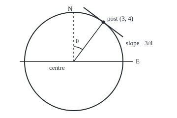

# Implicit and inverse differentiation: rates for curves that are not graphs, and for functions run backwards

[Syllabus](../../../SYLLABUS.md) → [Calculus and analysis](../../../SYLLABUS.md#w06) → [Derivatives](../../../SYLLABUS.md#w06-s02) → Implicit and inverse differentiation

---

## General Overview

A round pond has radius 5 m. Put its centre at the origin, x metres east and y metres north. A marker post stands on the shore at 3 m east, 4 m north: 3 × 3 + 4 × 4 = 25 = 5 × 5.

Walk the northern shore eastward from the post. How far south per metre east, right at the post? 0.75 m: the shore's slope there is −0.75.

No formula "y equals something in x" was needed. The shore is a **relation**, a rule tying x and y together: x^2 + y^2 = 25. Differentiating the relation as it stands and solving for the slope is **implicit differentiation**.

The post's compass bearing, clockwise from north, is the angle whose sine is 3/5: arcsin 0.6, arcsin being the undo of sine. Its rate at 0.6, 1.25 radians per unit of sine, is read off sine's own rate: **inverse differentiation**.

**When x and y are tied by an equation, differentiate both sides and solve for the slope; when a function is undone, the undo's rate is one over the original rate, read at the matching input.**

**What kind of fact this is:** the inverse rule is a theorem, proved on this card in Why it works; implicit differentiation is a method, resting on the chain rule.

### The picture: the pond, the post and the tangent

<p align="center"></p>

To scale, 20 pixels per metre. Dashed: north; θ: the post's bearing, 36.87°. The tangent, drawn from 1 m to 5 m east, meets the radius at a right angle.

---

## The formula

Recall from [The derivative](01-the-derivative.md): $y'$, or dy/dx, is the rate of y per unit of x. Treat y as a function of x along the northern shore and differentiate both sides:

$$x^2 + y^2 = 25 \quad\Longrightarrow\quad 2x + 2y\,y' = 0 \quad\Longrightarrow\quad y' = -\frac{x}{y} \quad (y \neq 0)$$

**Read it aloud:** the shore's slope is minus the eastward distance over the northward one: −0.75 m north per m east at the post.

For the inverse rule, recall from [Inverse functions](../../01-Foundations/08-Relations%20and%20Functions/05-inverse-functions.md) that $f^{-1}$ is the undo of f, not one over f. Call it g, with b = f(a).

$$g'(b) = \frac{1}{f'(a)} = \frac{1}{f'(g(b))} \qquad (f'(a) \neq 0)$$

**Read it aloud:** the undo's rate at an output is one over the original rate at the input that produced it.

For arcsin, f is sine on the window from −π/2 to π/2, and sine's rate is cosine ([Derivatives of sine and cosine](04-derivatives-of-trig-functions.md)):

$$\frac{d}{du}\arcsin u = \frac{1}{\cos(\arcsin u)} = \frac{1}{\sqrt{1 - u^2}} \qquad (-1 < u < 1)$$

On tangent, whose rate is 1 + tan^2, the rule gives arctan the rate 1/(1 + u^2): 0.5 at u = 1.

| Symbol | Plain meaning | In our example | Push it up and the answer… |
| --- | --- | --- | --- |
| $x$, $y$ | metres east and north of the centre | 3 m, 4 m | larger x: steeper; larger y: flatter |
| $y'$ | slope of the shore, dy/dx: metres north per metre east | −0.75 | — |
| $R$ | pond radius | 5 m | — |
| $f$, $g$ | a function and its undo, g = f^{-1} | sine and arcsin | — |
| $a$, $b$ | matching input and output, b = f(a) | 0.643501 rad and 0.6 | — |
| $u$, $\theta$ | a sine value; the angle with that sine, the bearing | 0.6; 0.643501 rad = 36.87° | near u = 1, arcsin's rate blows up |
| $h$, $k$ | an input step, and the output step it causes | k from 0.1 to 0.0001 | the quotient drifts from 1.25 |
| $\arcsin$, $\arctan$, $\arccos$ | undos of sine, tangent, cosine on their windows | rates 1.25 at 0.6, 0.5 at 1, −1.25 at 0.6 | — |

### When it holds

- **A differentiable branch exists near the point.** Here it is the graph y = √(25 − x^2). Differentiating an equation says what the slope must be *if* a branch exists; it does not make one.
- **The coefficient of y' is not zero.** At (5, 0), 2y is 0: the tangent is vertical, and dx/dy, x's rate per unit of y, is 0. For the crossing lines y^2 = x^2, the origin gives 0 = 0: two slopes, 1 and −1.
- **The function undone is one-to-one and continuous on an interval.** Sine qualifies on −π/2 to π/2; outside it, arcsin returns a different angle.
- **The original rate is not zero at the matching input.** Cubing has rate 0 at 0; the cube root's quotients there run 100, then 10000: no finite rate.

---

## Why it works

### Step 0: a relation that always holds has a total rate of zero

Along the shore, x^2 + y^2 stays exactly 25. A quantity that never changes has rate 0, so the rates of x^2 and y^2 must add to 0.

### Step 1: carry the hidden rate of y through the chain rule

Along the northern shore, y is a function of x, so y^2 is one function fed into another. By the [Chain rule](03-chain-rule.md), its rate is 2y times y'. The rate of x^2 is 2x; the rate of 25 is 0. Hence 2x + 2y·y' = 0, and where y is not 0, y' = −x/y.

At the post: 6 + 8y' = 0, so y' = −0.75. At (3, −4), on the southern shore, the same formula gives +0.75.

### Step 2: two more roads to the same slope

Differentiate the branch directly: y = √(25 − x^2) has rate −x/√(25 − x^2) by the chain rule, −3/4 at x = 3.

Or use geometry. The radius to the post has slope 4/3 = 1.333333. A tangent meets the radius at a right angle, and perpendicular slopes multiply to −1, so the tangent's slope is −3/4.

### Step 3: the inverse rule, proved without assuming the undo has a rate

Arcsin's graph is sine's flipped across the diagonal where height equals input. The flip swaps rise and run: slope 0.8 becomes 1/0.8 = 1.25. The proof makes that exact.

Take a small nonzero output step k from b = 0.6, and let h = g(b + k) − a be the input step producing it. Then k = f(a + h) − f(a), and h is not 0, else k would be. So

$$\frac{g(b + k) - g(b)}{k} = \frac{h}{f(a + h) - f(a)} = \frac{1}{\,(f(a + h) - f(a))/h\,}$$

Does h shrink when k does? Yes: the undo of a continuous, steadily rising function on an interval is continuous (proved below). So the bottom heads for f'(a), not 0, and the whole for 1/f'(a).

The tolerance game, with numbers. The arcsin quotient misses 1.25 by 0.068964 at k = 0.1, 0.005948 at 0.01, 0.000587 at 0.001 and 0.000059 at 0.0001. To land within 0.001 of 1.25, any positive k under 0.00170 will do.

<details>
<summary>Detailed proof</summary>

Let f be continuous and strictly increasing on an open interval I containing a, with f'(a) ≠ 0. Let b = f(a) and g the undo of f on f(I).

**g is continuous at b.** Take ε > 0 with a ± ε in I, so f(a − ε) < b < f(a + ε). Let δ be the smaller gap from b to those two values. If |k| < δ, then b + k lies between them, so it is a value of f (intermediate value theorem), and as f rises, g(b + k) lies between a − ε and a + ε.

**The rate.** For small k ≠ 0, h = g(b + k) − a is nonzero and the quotient is 1 / [(f(a + h) − f(a))/h]. As k → 0, h → 0 by continuity, so the bracket tends to f'(a) ≠ 0. For a falling f, apply this to −f.

</details>

### Step 4: the arcsin rate, with the sign fixed by the window

Let θ = arcsin u, so sin θ = u with θ between −π/2 and π/2. The rule gives 1/cos θ. On that window cosine is never negative, so cos θ = +√(1 − u^2), from cos^2 θ + sin^2 θ = 1. At u = 0.6: cos θ = 0.8, rate 1.25. At u = ±1, cos θ = 0: arcsin exists there, its rate does not.

Arccos uses the window 0 to π, where cosine falls. The rule gives 1/(−sin θ) = −1/√(1 − u^2): −1.25 at 0.6. The minus sign comes from the window.

A second route: differentiate f(g(b)) = b by the chain rule to get f'(a)·g'(b) = 1. It is quicker, but assumes g has a rate; Step 3 proves it.

---

## Worked numbers, by hand

| Step | Arithmetic | Value |
| --- | --- | --- |
| post on the shore | 3 × 3 + 4 × 4 | 25 = 5 × 5 |
| differentiate the relation | 2 × 3 + 2 × 4 × y' = 0 | 6 + 8y' = 0 |
| shore slope at the post | −6 / 8 | **−0.75 m north per m east** |
| the post's bearing | arcsin(3/5) | 0.643501 rad = 36.87° |
| sine's rate there | cos θ = √(1 − 0.36) | 0.8 |
| arcsin's rate at 0.6 | 1 / 0.8 | **1.25 rad per unit of sine** |

Moving the post east round the rim turns its bearing 1.25 / 5 = 0.25 rad per metre.

### What breaks if you drop a piece

| Mistake | Comes out at | What went wrong |
| --- | --- | --- |
| Minus sign dropped | +0.75 at the post | Walking east on the northern shore goes south |
| Chain factor dropped on y^2 | 2 × 3 + 2 × 4 = 14, not 0 | y was treated as a constant |
| Forward rate read at the output | 1/cos 0.6 = 1.211628, not 1.25 | cos belongs at the angle 0.643501, not at 0.6 |
| Cubing undone at 0 | quotients 100, then 10000 | forward rate 0: no finite inverse rate |

The code prints all four.

---

## Code, from first principles, and it actually runs

Only sqrt, sin and cos are imported; arcsin, arctan and arccos are built by halving an interval. Three roads to the slope, three to arcsin's rate; arctan is the second case.

### Python

```python
# Implicit and inverse differentiation -- the check behind the card.  Only sqrt,
# sin and cos are imported; every inverse is found by halving an interval.  A
# round pond, radius 5 m, centre at the origin, x metres east, y metres north.
from math import sqrt, sin, cos
R, X, Y, U = 5.0, 3.0, 4.0, 0.6          # the marker post at (3, 4); U = 3/5

def inv(f, v, lo, hi):                    # solve f(t) = v for increasing f, by halving
    for _ in range(200):
        mid = (lo + hi) / 2
        if f(mid) < v: lo = mid
        else: hi = mid
    return (lo + hi) / 2
def asin_(u): return inv(sin, u, -1.5, 1.5)
def atan_(u): return inv(lambda t: sin(t) / cos(t), u, -1.5, 1.5)
def acos_(u): return inv(lambda t: -cos(t), -u, 0.0, 3.0)
def cq(f, x, h=1e-5): return (f(x + h) - f(x - h)) / (2 * h)   # central quotient

implicit = -X / Y                                     # road 1: 2x + 2y y' = 0
branch = cq(lambda t: sqrt(R * R - t * t), X)         # road 2: upper half as a graph
radius = Y / X; perp = -1 / radius                    # road 3: square to the radius
lower = cq(lambda t: -sqrt(R * R - t * t), X)
side = cq(lambda s: sqrt(R * R - s * s), 0.0)         # east side, x as a graph of y
print(f"post at ({X:.0f}, {Y:.0f}): {X:.0f}^2 + {Y:.0f}^2 = {X * X + Y * Y:.0f} = {R:.0f}^2")
print(f"slope: road 1, -x/y = {implicit:.6f}; road 2, upper branch {branch:.6f}; road 3, radius slope {radius:.6f}, square to it {perp:.6f}")
print(f"at (3, -4): -x/y = {-X / -Y:.6f}, lower branch {lower:.6f}; at (5, 0): dx/dy = {side:.6f}")
print(f"crossing lines y^2 = x^2 at (0, 0): relation gives 0 = 0; the lines' slopes {cq(lambda t: t, 0.0):.6f} and {cq(lambda t: -t, 0.0):.6f}")
th = asin_(U); rule1 = 1 / cos(th); rule2 = 1 / sqrt(1 - U * U)
print(f"bearing: arcsin({U}) = {th:.6f} rad = {th * 45 / atan_(1.0):.2f} deg; sin {sin(th):.6f}, cos {cos(th):.6f}")
print(f"arcsin rate: road 1, 1/cos(theta) = {rule1:.6f}; road 2, 1/sqrt(1 - u^2) = {rule2:.6f}; per metre east {rule1 / R:.6f}")
errs = []
for k in (0.1, 0.01, 0.001, 0.0001):                   # road 3: shrinking output steps
    q = (asin_(U + k) - th) / k
    errs.append(q - rule1)
    print(f"road 3, output step k = {k}: quotient {q:.6f}, error {q - rule1:.6f}")
lo, hi = 0.0, 0.1                                     # largest step within 0.001
for _ in range(60):
    mid = (lo + hi) / 2
    if (asin_(U + mid) - th) / mid - rule1 < 0.001: lo = mid
    else: hi = mid
print(f"tolerance: every output step under {lo:.5f} lands within 0.001 of {rule1:.2f}")
a = atan_(1.0); ac = acos_(U)
print(f"second case: arctan(1) = {a:.6f} rad; rule 1/(1 + u^2) = cos^2 = {cos(a) ** 2:.6f}; central quotient {cq(atan_, 1.0):.6f}")
print(f"arccos(0.6) = {ac:.6f}; rate 1/(-sin) = {-1 / sin(ac):.6f}; central quotient {cq(acos_, U):.6f}")
print(f"mistake 1, minus sign dropped: {X / Y:.6f}; mistake 2, chain factor dropped: 2*3 + 2*4 = {2 * X + 2 * Y:.0f}, not 0")
print(f"mistake 3, forward rate read at the output: 1/cos(0.6) = {1 / cos(U):.6f}; mistake 4, forward rate kept: {cos(th):.6f}")
cube = [inv(lambda t: t * t * t, h ** 3, -1.0, 1.0) / h ** 3 for h in (0.1, 0.01)]
print(f"cube at 0, forward rate 0: inverse quotients for h = 0.1, 0.01: {cube[0]:.1f}, {cube[1]:.1f}")
S, CX, CY = 20, 150, 125                              # figure: 20 px per metre, y down
tan_end = [(CX + S * x, CY - S * (Y + implicit * (x - X))) for x in (1.0, 5.0)]
arc = (CX + 30 * sin(th), CY - 30 * cos(th))
print(f"figure, {S} px per m: centre ({CX}, {CY}), radius {S * R:.0f}, post ({CX + S * X:.0f}, {CY - S * Y:.0f}), "
      f"tangent ({tan_end[0][0]:.0f}, {tan_end[0][1]:.0f}) to ({tan_end[1][0]:.0f}, {tan_end[1][1]:.0f}), "
      f"north tip ({CX}, {CY - S * R:.0f}), angle arc ({CX}, {CY - 30}) to ({arc[0]:.0f}, {arc[1]:.0f})")
assert abs(implicit - branch) < 1e-8 and abs(perp - branch) < 1e-8   # three roads, one slope
assert abs(errs[-1]) < 1e-3 and 9 < errs[1] / errs[2] < 11            # quotients close in
assert abs(cos(a) ** 2 - cq(atan_, 1.0)) < 1e-8                        # arctan rule vs quotient
assert cube[1] / cube[0] > 50                                          # no finite inverse rate
print("ALL CHECKS PASS")
```

**Ran 2026-09-27 on macOS, Python 3.14.6, standard library only. All checks passed. Output, pasted from the run:**

```
post at (3, 4): 3^2 + 4^2 = 25 = 5^2
slope: road 1, -x/y = -0.750000; road 2, upper branch -0.750000; road 3, radius slope 1.333333, square to it -0.750000
at (3, -4): -x/y = 0.750000, lower branch 0.750000; at (5, 0): dx/dy = 0.000000
crossing lines y^2 = x^2 at (0, 0): relation gives 0 = 0; the lines' slopes 1.000000 and -1.000000
bearing: arcsin(0.6) = 0.643501 rad = 36.87 deg; sin 0.600000, cos 0.800000
arcsin rate: road 1, 1/cos(theta) = 1.250000; road 2, 1/sqrt(1 - u^2) = 1.250000; per metre east 0.250000
road 3, output step k = 0.1: quotient 1.318964, error 0.068964
road 3, output step k = 0.01: quotient 1.255948, error 0.005948
road 3, output step k = 0.001: quotient 1.250587, error 0.000587
road 3, output step k = 0.0001: quotient 1.250059, error 0.000059
tolerance: every output step under 0.00170 lands within 0.001 of 1.25
second case: arctan(1) = 0.785398 rad; rule 1/(1 + u^2) = cos^2 = 0.500000; central quotient 0.500000
arccos(0.6) = 0.927295; rate 1/(-sin) = -1.250000; central quotient -1.250000
mistake 1, minus sign dropped: 0.750000; mistake 2, chain factor dropped: 2*3 + 2*4 = 14, not 0
mistake 3, forward rate read at the output: 1/cos(0.6) = 1.211628; mistake 4, forward rate kept: 0.800000
cube at 0, forward rate 0: inverse quotients for h = 0.1, 0.01: 100.0, 10000.0
figure, 20 px per m: centre (150, 125), radius 100, post (210, 45), tangent (170, 15) to (250, 75), north tip (150, 25), angle arc (150, 95) to (168, 101)
ALL CHECKS PASS
```

### Rust

Same numbers, same labels.

```rust
// Implicit and inverse differentiation -- the same check as the Python, in
// Rust.  No crates; every inverse is found by halving an interval.  A round
// pond, radius 5 m, centre at the origin, x metres east, y metres north.
const R: f64 = 5.0;
const X: f64 = 3.0;
const Y: f64 = 4.0;
const U: f64 = 0.6;                       // the marker post at (3, 4); U = 3/5

fn inv(f: &dyn Fn(f64) -> f64, v: f64, mut lo: f64, mut hi: f64) -> f64 {
    for _ in 0..200 {                     // solve f(t) = v for increasing f, by halving
        let mid = (lo + hi) / 2.0;
        if f(mid) < v { lo = mid } else { hi = mid }
    }
    (lo + hi) / 2.0
}
fn asin_(u: f64) -> f64 { inv(&|t: f64| t.sin(), u, -1.5, 1.5) }
fn atan_(u: f64) -> f64 { inv(&|t: f64| t.sin() / t.cos(), u, -1.5, 1.5) }
fn acos_(u: f64) -> f64 { inv(&|t: f64| -t.cos(), -u, 0.0, 3.0) }
fn cq(f: &dyn Fn(f64) -> f64, x: f64) -> f64 { let h = 1e-5; (f(x + h) - f(x - h)) / (2.0 * h) }

fn main() {
    let implicit = -X / Y;                                   // road 1: 2x + 2y y' = 0
    let branch = cq(&|t: f64| (R * R - t * t).sqrt(), X);    // road 2: upper half as a graph
    let radius = Y / X;
    let perp = -1.0 / radius;                                // road 3: square to the radius
    let lower = cq(&|t: f64| -(R * R - t * t).sqrt(), X);
    let side = cq(&|s: f64| (R * R - s * s).sqrt(), 0.0);   // east side, x as a graph of y
    println!("post at ({:.0}, {:.0}): {:.0}^2 + {:.0}^2 = {:.0} = {:.0}^2", X, Y, X, Y, X * X + Y * Y, R);
    println!("slope: road 1, -x/y = {:.6}; road 2, upper branch {:.6}; road 3, radius slope {:.6}, square to it {:.6}", implicit, branch, radius, perp);
    println!("at (3, -4): -x/y = {:.6}, lower branch {:.6}; at (5, 0): dx/dy = {:.6}", -X / -Y, lower, side);
    println!("crossing lines y^2 = x^2 at (0, 0): relation gives 0 = 0; the lines' slopes {:.6} and {:.6}", cq(&|t: f64| t, 0.0), cq(&|t: f64| -t, 0.0));
    let th = asin_(U);
    let (rule1, rule2) = (1.0 / th.cos(), 1.0 / (1.0 - U * U).sqrt());
    println!("bearing: arcsin({}) = {:.6} rad = {:.2} deg; sin {:.6}, cos {:.6}", U, th, th * 45.0 / atan_(1.0), th.sin(), th.cos());
    println!("arcsin rate: road 1, 1/cos(theta) = {:.6}; road 2, 1/sqrt(1 - u^2) = {:.6}; per metre east {:.6}", rule1, rule2, rule1 / R);
    let mut errs = Vec::new();
    for k in [0.1, 0.01, 0.001, 0.0001] {                   // road 3: shrinking output steps
        let q = (asin_(U + k) - th) / k;
        errs.push(q - rule1);
        println!("road 3, output step k = {}: quotient {:.6}, error {:.6}", k, q, q - rule1);
    }
    let (mut lo, mut hi) = (0.0_f64, 0.1_f64);              // largest step within 0.001
    for _ in 0..60 {
        let mid = (lo + hi) / 2.0;
        if (asin_(U + mid) - th) / mid - rule1 < 0.001 { lo = mid } else { hi = mid }
    }
    println!("tolerance: every output step under {:.5} lands within 0.001 of {:.2}", lo, rule1);
    let (a, ac) = (atan_(1.0), acos_(U));
    let at_q = cq(&atan_, 1.0);
    println!("second case: arctan(1) = {:.6} rad; rule 1/(1 + u^2) = cos^2 = {:.6}; central quotient {:.6}", a, a.cos().powi(2), at_q);
    println!("arccos(0.6) = {:.6}; rate 1/(-sin) = {:.6}; central quotient {:.6}", ac, -1.0 / ac.sin(), cq(&acos_, U));
    println!("mistake 1, minus sign dropped: {:.6}; mistake 2, chain factor dropped: 2*3 + 2*4 = {:.0}, not 0", X / Y, 2.0 * X + 2.0 * Y);
    println!("mistake 3, forward rate read at the output: 1/cos(0.6) = {:.6}; mistake 4, forward rate kept: {:.6}", 1.0 / U.cos(), th.cos());
    let cube: Vec<f64> = [0.1_f64, 0.01].iter().map(|&h| inv(&|t: f64| t * t * t, h.powi(3), -1.0, 1.0) / h.powi(3)).collect();
    println!("cube at 0, forward rate 0: inverse quotients for h = 0.1, 0.01: {:.1}, {:.1}", cube[0], cube[1]);
    let (s, cx, cy) = (20.0_f64, 150.0_f64, 125.0_f64);     // figure: 20 px per metre, y down
    let te: Vec<(f64, f64)> = [1.0, 5.0].iter().map(|&x| (cx + s * x, cy - s * (Y + implicit * (x - X)))).collect();
    let arc = (cx + 30.0 * th.sin(), cy - 30.0 * th.cos());
    println!("figure, {} px per m: centre ({}, {}), radius {:.0}, post ({:.0}, {:.0}), tangent ({:.0}, {:.0}) to ({:.0}, {:.0}), north tip ({}, {:.0}), angle arc ({}, {}) to ({:.0}, {:.0})",
             s, cx, cy, s * R, cx + s * X, cy - s * Y, te[0].0, te[0].1, te[1].0, te[1].1, cx, cy - s * R, cx, cy - 30.0, arc.0, arc.1);
    assert!((implicit - branch).abs() < 1e-8 && (perp - branch).abs() < 1e-8);  // three roads, one slope
    assert!(errs[3].abs() < 1e-3 && errs[1] / errs[2] > 9.0 && errs[1] / errs[2] < 11.0);
    assert!((a.cos().powi(2) - at_q).abs() < 1e-8);                               // arctan rule vs quotient
    assert!(cube[1] / cube[0] > 50.0);                                            // no finite inverse rate
    println!("ALL CHECKS PASS");
}
```

**Ran 2026-09-27 on macOS, rustc 1.98.1, no crates. All checks passed. Output, pasted from the run:**

```
post at (3, 4): 3^2 + 4^2 = 25 = 5^2
slope: road 1, -x/y = -0.750000; road 2, upper branch -0.750000; road 3, radius slope 1.333333, square to it -0.750000
at (3, -4): -x/y = 0.750000, lower branch 0.750000; at (5, 0): dx/dy = 0.000000
crossing lines y^2 = x^2 at (0, 0): relation gives 0 = 0; the lines' slopes 1.000000 and -1.000000
bearing: arcsin(0.6) = 0.643501 rad = 36.87 deg; sin 0.600000, cos 0.800000
arcsin rate: road 1, 1/cos(theta) = 1.250000; road 2, 1/sqrt(1 - u^2) = 1.250000; per metre east 0.250000
road 3, output step k = 0.1: quotient 1.318964, error 0.068964
road 3, output step k = 0.01: quotient 1.255948, error 0.005948
road 3, output step k = 0.001: quotient 1.250587, error 0.000587
road 3, output step k = 0.0001: quotient 1.250059, error 0.000059
tolerance: every output step under 0.00170 lands within 0.001 of 1.25
second case: arctan(1) = 0.785398 rad; rule 1/(1 + u^2) = cos^2 = 0.500000; central quotient 0.500000
arccos(0.6) = 0.927295; rate 1/(-sin) = -1.250000; central quotient -1.250000
mistake 1, minus sign dropped: 0.750000; mistake 2, chain factor dropped: 2*3 + 2*4 = 14, not 0
mistake 3, forward rate read at the output: 1/cos(0.6) = 1.211628; mistake 4, forward rate kept: 0.800000
cube at 0, forward rate 0: inverse quotients for h = 0.1, 0.01: 100.0, 10000.0
figure, 20 px per m: centre (150, 125), radius 100, post (210, 45), tangent (170, 15) to (250, 75), north tip (150, 25), angle arc (150, 95) to (168, 101)
ALL CHECKS PASS
```

The two outputs match line for line.

> [!TIP]
> **Try changing**
> - **Move the post.** Guess first, then set `X, Y` to `4.0, 3.0`. All three roads give −4/3 = −1.333333; every assert passes.
> - **A sine value nearer 1.** Guess first, then set `U` to `0.8`. Bearing 53.13°, arcsin's rate 1/0.6 = 1.666667; the tolerance step shrinks to 0.00054, since arcsin bends harder near 1.
> - **The wrong forward rate.** Guess first, then change `1 / cos(th)` to `1 / sin(th)`. Road 1 says 1.666667, the quotients still close on 1.25, and the second assert stops the run.

---

## The usual mistake

> [!warning]
> **Reading the forward rate at the wrong place.** Arcsin's rate at 0.6 needs sine's rate at the angle 0.643501 rad, not at 0.6. Cosine read at 0.6 gives 1.211628, not 1.25.
>
> - **Dropping the window's sign.** Arccos falls: its rate at 0.6 is −1.25.
> - **Reading every zero as vertical.** At (5, 0) the tangent is vertical; at the crossing of y = x and y = −x the same zero hides two slopes.

---

## Where you meet it in real life

- **Linked quantities.** A ladder sliding down a wall, a balloon filling: two quantities tied by one equation, each rate found from the other, in [Linear approximation](../03-What%20Derivatives%20Tell%20You/01-linear-approximation-and-related-rates.md).
- **Tilt sensors.** A sensor reports the sine of its tilt; the angle is arcsin of the reading, and 1/√(1 − u^2) turns a reading error into an angle error, without bound near 90°.

> **Say it back**
> A relation that holds all along a curve has total rate zero. Differentiating both sides, with the chain rule on every y, gives the slope: −x/y on the pond, −0.75 at the post. An undo's rate is one over the original rate, read at the matching input: arcsin's is 1/√(1 − u^2), 1.25 at 0.6. Both fail where the divisor is zero.

---

## What this builds on

- [Derivatives of exp and log](05-derivatives-of-exp-and-log.md): the exponential and ln, the first function-and-undo pair with known rates.
- [Inverse functions](../../01-Foundations/08-Relations%20and%20Functions/05-inverse-functions.md): what an undo is, and why only a one-to-one rule has one.

## Where this goes next

- [Hyperbolic functions](07-hyperbolic-functions.md): sinh and cosh, whose undos take their rates by this card's rule.
- [Linear approximation](../03-What%20Derivatives%20Tell%20You/01-linear-approximation-and-related-rates.md): implicit differentiation with time as the variable.
- [Trig substitution](../04-Integrals/06-trig-substitution.md): the arcsin and arctan rates run in reverse.

How fast the shore's slope itself turns is the subject of [Second derivatives](08-higher-derivatives-and-concavity.md).

---

## Sources

Verified 2026-09-27: every link below resolves to the publisher's page.

- Strang, Gilbert, and Edwin "Jed" Herman. *Calculus Volume 1*. OpenStax. [Section 3.8, Implicit Differentiation](https://openstax.org/books/calculus-volume-1/pages/3-8-implicit-differentiation). The method on circles and other relations.
- Strang, Gilbert, and Edwin "Jed" Herman. *Calculus Volume 1*. OpenStax. [Section 3.7, Derivatives of Inverse Functions](https://openstax.org/books/calculus-volume-1/pages/3-7-derivatives-of-inverse-functions). The inverse rule and the inverse trigonometric rates.
- Lebl, Jiří. *Basic Analysis I: Introduction to Real Analysis*. [Section 4.4, Inverse function theorem](https://www.jirka.org/ra/html/sec_ift.html). The undo's continuity and rate, with exact hypotheses.
