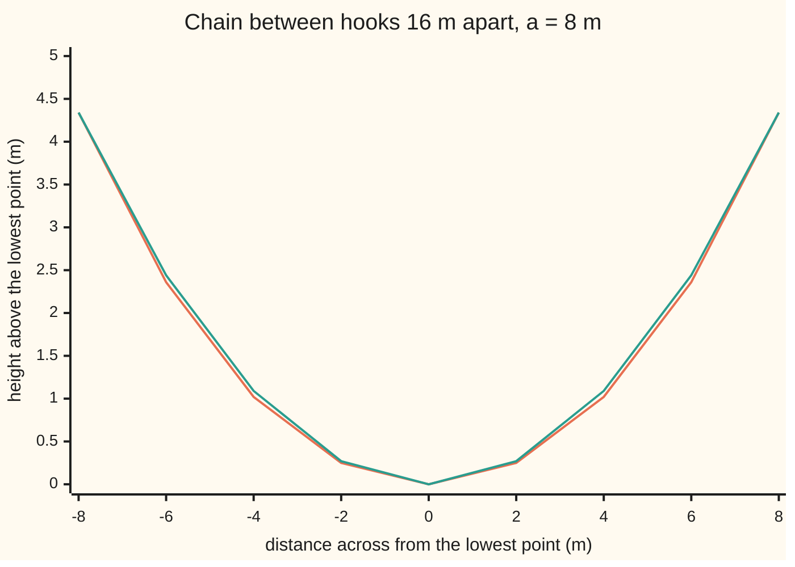

# Hyperbolic functions: sinh and cosh, the exponential's even and odd halves

[Syllabus](../../../SYLLABUS.md) → [Calculus and analysis](../../../SYLLABUS.md#w06) → [Derivatives](../../../SYLLABUS.md#w06-s02) → Hyperbolic functions

---

## General Overview

A chain hangs from two level hooks 16 m apart. Its lowest point is 4.344645 m below them. At each hook it climbs 1.175201 m per metre across. It uses 18.803219 m of chain.

All three come from one function. Take e^t, with e = 2.718282 and t a plain number, and its mirror e^−t. Their average is the **hyperbolic cosine**, written cosh t, said "kosh". Half their difference is the **hyperbolic sine**, sinh t, said "shine". This chain is pulled sideways at its bottom by the weight of 8 m of itself, so its height above a chosen level is 8 cosh(x/8) m, with x the distance across from the lowest point.

Cosh squared minus sinh squared is always 1, so the point (cosh t, sinh t) sits on the hyperbola across^2 − up^2 = 1, as cosine and sine sit on a circle: hence the name.

**Cosh and sinh are the even and odd halves of the exponential; their squares differ by exactly 1, each is the other's rate, and a hanging chain takes the shape of a cosh.**

**What kind of fact this is:** a definition; the identity, rates and inverse formulas are theorems proved in Why it works, and the chain's cosh shape is a physical model, derived on [Paths with a budget](../../08-Differential%20equations%20and%20dynamics/12-Calculus%20of%20Variations%20and%20Optimal%20Control/03-constrained-paths-and-the-hanging-chain.md).

### The picture: the chain against a parabola



Orange: the chain, 8 cosh(x/8) − 8. Green: Galileo's guess, the parabola through the bottom and both hooks, 0.09 m too high at 6 m. The picture shows the gap; it proves nothing.

---

## The formula

Notation: e^−t is 1 divided by e^t; $\cosh^2 t$ is cosh t times itself; d/dt is the rate per unit of t ([The derivative](01-the-derivative.md)).

$$\cosh t = \frac{e^t + e^{-t}}{2}, \qquad \sinh t = \frac{e^t - e^{-t}}{2}, \qquad \tanh t = \frac{\sinh t}{\cosh t}$$

$$\cosh^2 t - \sinh^2 t = 1, \qquad \frac{d}{dt}\sinh t = \cosh t, \qquad \frac{d}{dt}\cosh t = \sinh t, \qquad \frac{d}{dt}\tanh t = \frac{1}{\cosh^2 t}$$

**Read it aloud:** cosh is the average of e^t and e^−t, sinh half their difference, tanh their ratio; cosh squared minus sinh squared is one; each of sinh and cosh changes at the other's rate, with no minus sign.

The chain, measured from a level $a$ below its lowest point, and its slope:

$$y = a\cosh\frac{x}{a}, \qquad \frac{dy}{dx} = \sinh\frac{x}{a}$$

The inverses undo the functions. Cosh is equal at t and −t, so it is undone only on t ≥ 0:

| Inverse | Inputs | Log formula | Its rate |
| --- | --- | --- | --- |
| arsinh x | every real x | ln(x + √(x^2 + 1)) | 1 / √(x^2 + 1) |
| arcosh x | x ≥ 1; answers 0 or more | ln(x + √(x^2 − 1)) | 1 / √(x^2 − 1), for x > 1 |
| artanh x | −1 < x < 1 | ½ ln((1 + x)/(1 − x)) | 1 / (1 − x^2) |

| Symbol | Plain meaning | In our example | Push it up and the answer… |
| --- | --- | --- | --- |
| $t$ | the input, a plain number | x/a: 1 at the hook | both grow, near e^t / 2 |
| $e$ | the base whose power is its own rate | 2.718282 | — |
| $\cosh$, $\sinh$ | the even and odd halves of e^t | 1.543081 and 1.175201 at t = 1 | both climb without end |
| $\tanh$ | sinh over cosh | 0.761594 at t = 1 | creeps towards 1, never reaches it |
| $x$, $y$ | across from the lowest point; height above the chosen level; m | hook: 8, 12.344645 | — |
| $a$ | horizontal pull over the chain's weight per metre, m | 8 m | less sag |
| $h$ | a small step in the input: the run | 0.1, 0.01, 0.001 | the quotient drifts from the rate |
| arsinh, arcosh, artanh | the inverses | arcosh 1.25 = 0.693147 | — |

### When it holds

The definitions hold for every real t; the conditions belong to the inverses and the chain.

- **Arcosh needs an input of at least 1.** Cosh is never below 1: no point of the chain lies below its bottom.
- **Artanh needs an input strictly between −1 and 1.** Tanh approaches both without reaching them.
- **The chain is a cosh only if flexible, unstretched, at rest, with equal weight per metre of chain.** A cable carrying a deck spread evenly along the ground hangs as a parabola.
- **Rates are per unit of t.** On the chain t is x/a, so the chain rule brings 1/a, which the leading a cancels.

---

## Why it works

### Step 0: every function splits into an even half and an odd half

An even function takes the same value at t and −t; an odd one flips sign. Any function f splits into the two:

$$f(t) = \frac{f(t) + f(-t)}{2} + \frac{f(t) - f(-t)}{2}$$

For e^t the pieces are cosh t and sinh t, so

$$\cosh t + \sinh t = e^t, \qquad \cosh t - \sinh t = e^{-t}$$

At t = 1: 1.543081 + 1.175201 is 2.718282, and 1.543081 − 1.175201 is 0.367879.

### Step 1: the squares differ by one

Multiply the two lines of Step 0. A sum times a difference is a difference of squares, and e^t × e^−t is 1:

$$\cosh^2 t - \sinh^2 t = e^t e^{-t} = 1$$

At t = 1: 2.381098 − 1.381098 = 1. So cosh, a positive number whose square is 1 + sinh^2, is at least 1, and tanh stays strictly between −1 and 1.

### Step 2: each is the other's rate

The rate of e^t is e^t ([Derivatives of exp and log](05-derivatives-of-exp-and-log.md)); the chain rule ([Chain rule](03-chain-rule.md)) gives e^−t the rate −e^−t. Rates of sums are sums of rates:

$$\frac{d}{dt}\sinh t = \frac{e^t + e^{-t}}{2} = \cosh t, \qquad \frac{d}{dt}\cosh t = \frac{e^t - e^{-t}}{2} = \sinh t$$

The minus inside e^−t cancels the minus between the terms, so no minus survives, unlike cosine's rate ([Derivatives of sine and cosine](04-derivatives-of-trig-functions.md)).

The rise over run of sinh at 1 closes in: 1.604463, 1.548982, 1.543668 for h = 0.1, 0.01, 0.001, against cosh 1 = 1.543081, each gap about a tenth of the last.

For tanh the quotient rule ([Product and quotient rules](02-product-and-quotient-rules.md)) gives cosh × cosh − sinh × sinh, which Step 1 makes 1, over $\cosh^2 t$: 0.419974 at t = 1.

### Step 3: the chain's slope and length

By the chain rule, 8 cosh(x/8) has slope 8 × sinh(x/8) × 1/8 = sinh(x/8), metres up per metre across: 0 at the bottom, sinh 1 = 1.175201 at the hook.

The slope's own rate is (1/8) cosh(x/8), 0.192885 per metre at the hook; Step 1 makes cosh equal √(1 + sinh^2), so

$$\text{rate of the slope} = \frac{1}{a}\sqrt{1 + \text{slope}^2}$$

That is the chain's balance of forces, derived on [Paths with a budget](../../08-Differential%20equations%20and%20dynamics/12-Calculus%20of%20Variations%20and%20Optimal%20Control/03-constrained-paths-and-the-hanging-chain.md). The identity is what lets cosh obey it.

A short piece rises slope × run, so by Pythagoras its length is √(1 + slope^2) × run, which Step 1 makes cosh(x/8) × run. So 8 sinh(x/8), which has that rate and starts at 0, is the length from the middle; two functions with the same rate everywhere and the same start agree (the mean value theorem), so no other fits. Hook to hook: 16 sinh 1 = 18.803219 m.

### Step 4: undoing sinh, cosh and tanh

Sinh has rate cosh, at least 1, so it always rises, without end both ways: arsinh takes every input. Cosh has rate sinh, negative below 0 and positive above, so each value above 1 is hit at t and at −t; keeping t ≥ 0 makes the answer single.

Where is the chain 2 m above its lowest point? Where cosh(x/8) = 1.25, so x/8 = arcosh 1.25 = 0.693147, which is ln 2: at −5.545177 m and 5.545177 m. Arcosh gives the positive one; evenness gives the other. It climbs one metre per metre where sinh(x/8) = 1, at x = 8 arsinh 1 = 7.050989 m.

<details>
<summary>Detailed proof: the log formulas and the inverse rates</summary>

Put u = e^y, which is positive. If x = sinh y, then u^2 − 2xu − 1 = 0, with roots x ± √(x^2 + 1); only the plus root is positive, so y = ln(x + √(x^2 + 1)). If x = cosh y, then u^2 − 2xu + 1 = 0, with roots x ± √(x^2 − 1), real only for x ≥ 1; y ≥ 0 means u ≥ 1, the plus root. If x = tanh y, then u^2 = (1 + x)/(1 − x), positive only for −1 < x < 1.

An inverse's rate is 1 over the forward rate ([Implicit and inverse differentiation](06-implicit-and-inverse-differentiation.md)): cosh y = √(1 + x^2) for arsinh, by Step 1; sinh y = √(x^2 − 1) for arcosh, which is 0 at x = 1, so there arcosh has no finite rate; 1 − tanh^2 y = 1 − x^2 for artanh. At arcosh 1.25 the rate is 1.333333, at arsinh 1 it is 0.707107, at artanh 0.5 it is 1.333333.

</details>

A second road: in the series 1 + t + t^2/2 + t^3/6 + … for e^t, the even powers add to cosh t and the odd powers to sinh t. The code sums them without calling the exponential.

---

## Worked numbers, by hand

| Step | Arithmetic | Value |
| --- | --- | --- |
| cosh 1 | (2.718282 + 0.367879) / 2 | 1.543081 |
| sinh 1 | (2.718282 − 0.367879) / 2 | 1.175201 |
| identity at t = 1 | 2.381098 − 1.381098 | 1 |
| hook height | 8 × cosh 1 | 12.344645 m |
| sag | 12.344645 − 8 | **4.344645 m** |
| slope at the hook | sinh 1 | **1.175201 m up per m across** |
| chain to buy | 16 × sinh 1 | **18.803219 m** |
| 2 m above the bottom | 8 × arcosh 1.25, which is 8 ln 2 | ± 5.545177 m |

Order 18.803219 m of chain; it will sag 4.344645 m.

### What breaks if you drop a piece

| Mistake | Comes out at | What went wrong |
| --- | --- | --- |
| Trig's minus sign on cosh's rate | slope −1.175201 at the right hook | the minus inside e^−t cancels |
| A plus sign in the identity | cosh^2 1 + sinh^2 1 = 3.762196, not 1 | that sum is cosh 2, not a constant |
| Cosh undone without keeping t ≥ 0 | cosh(−0.693147) = 1.250000 too | two inputs, one output: no single inverse |

The code prints all three.

---

## Code, from first principles, and it actually runs

Each answer is reached twice. The series for e^t checks the values and the identity; shrinking quotients check the rates; 100000 straight pieces check the length; halving a bracket, with no logarithm, checks each inverse. Four asserts compare the roads.

### Python

```python
# Hyperbolic functions -- the check behind the card.  exp, log and sqrt are primitives; sinh,
# cosh, their rates and inverses are built here.  A chain hangs as y = 8 cosh(x / 8), hooks 16 m apart.
import math
A, HOOK = 8.0, 8.0                        # chain parameter a, hook's distance from the middle, m

def cosh(t): return (math.exp(t) + math.exp(-t)) / 2      # road one: exp's even half
def sinh(t): return (math.exp(t) - math.exp(-t)) / 2      # and its odd half
def tanh(t): return sinh(t) / cosh(t)
def chain(x): return A * cosh(x / A)
def series(t, parity):                    # road two: e^t's own terms, even or odd powers only
    total, term = 0.0, 1.0
    for n in range(40):
        if n % 2 == parity: total += term
        term *= t / (n + 1)
    return total

def slope(f, t, h): return (f(t + h) - f(t)) / h           # rise over run
def central(f, t): return (f(t + 1e-5) - f(t - 1e-5)) / 2e-5
def bisect(f, target, lo, hi):            # an inverse found by halving a bracket
    for _ in range(200):
        mid = (lo + hi) / 2
        lo, hi = (mid, hi) if f(mid) < target else (lo, mid)
    return (lo + hi) / 2

print(f"exp halves at t = 1: e^t = {math.exp(1):.6f}, e^-t = {math.exp(-1):.6f}; cosh = {cosh(1):.6f}, sinh = {sinh(1):.6f}, tanh = {tanh(1):.6f}")
for t in (1.0, 3.0, -2.0):
    c, s = series(t, 0), series(t, 1)
    assert max(abs(c - cosh(t)), abs(s - sinh(t))) < 1e-12 * cosh(t)    # series against exp halves
    assert abs(c * c - s * s - 1) < 1e-11                                # the identity, on road two
    print(f"t = {t:.0f}: series cosh = {c:.6f}, sinh = {s:.6f}; cosh^2 = {c * c:.6f}, sinh^2 = {s * s:.6f}, difference = {c * c - s * s:.6f}")
rates = [("sinh at 1", sinh, 1.0, cosh(1)), ("cosh at 1", cosh, 1.0, sinh(1)),
         ("tanh at 1", tanh, 1.0, 1 / cosh(1) ** 2), ("chain at the hook", chain, HOOK, sinh(HOOK / A))]
for name, f, at, rule in rates:
    q = [slope(f, at, h) for h in (0.1, 0.01, 0.001)]
    print(f"rate of {name}: rule {rule:.6f}; quotients h = 0.1, 0.01, 0.001: {q[0]:.6f}, {q[1]:.6f}, {q[2]:.6f}")
n, dx = 100000, 2 * HOOK / 100000
pieces = sum(math.hypot(dx, chain(-HOOK + (k + 1) * dx) - chain(-HOOK + k * dx)) for k in range(n))
length = 2 * A * sinh(HOOK / A)
roads = [(name, central(f, at), rule) for name, f, at, rule in rates] + [("length", pieces, length)]
for name, numeric, rule in roads:
    assert abs(numeric - rule) < 1e-6 * max(1, abs(rule))              # formula against brute force
print(f"chain: bottom {chain(0):.6f} m, hooks {chain(HOOK):.6f} m, sag {chain(HOOK) - chain(0):.6f} m; slope's rate {cosh(1) / A:.6f} = sqrt(1 + slope^2) / 8 = {math.sqrt(1 + sinh(1) ** 2) / A:.6f}")
print(f"chain length: 16 sinh 1 = {length:.6f} m; {n} straight pieces = {pieces:.6f} m")
inverses = [("arcosh 1.25", 1.25, math.log(1.25 + math.sqrt(1.25 ** 2 - 1)), cosh, 0.0, 1 / math.sqrt(1.25 ** 2 - 1)),
            ("arsinh 1.00", 1.0, math.log(1 + math.sqrt(2)), sinh, -5.0, 1 / math.sqrt(2)),
            ("artanh 0.50", 0.5, 0.5 * math.log(1.5 / 0.5), tanh, -5.0, 1 / (1 - 0.25))]
found = []
for name, x, formula, f, lo, rate in inverses:
    b = bisect(f, x, lo, 5.0)
    q = central(lambda u: bisect(f, u, lo, 5.0), x)
    assert max(abs(b - formula), abs(q - rate)) < 1e-6                 # log formula against bisection
    found.append(b)
    print(f"{name}: log formula {formula:.6f}; bisection {b:.6f}; rate rule {rate:.6f}, quotient {q:.6f}")
print(f"chain 2 m above its bottom at x = -{A * found[0]:.6f} and {A * found[0]:.6f} m; slope 1 at x = {A * found[1]:.6f} m")
print(f"mistakes: trig sign on cosh's rate {-sinh(1):.6f}; cosh^2 + sinh^2 at 1 = {cosh(1) ** 2 + sinh(1) ** 2:.6f}; cosh at -{found[0]:.6f} = {cosh(-found[0]):.6f} too")
xs, sag = range(-8, 9, 2), chain(HOOK) - chain(0)
print("chart x m: " + ", ".join(str(x) for x in xs))
print("chart catenary m: " + ", ".join(f"{chain(x) - A:.2f}" for x in xs))
print("chart parabola m: " + ", ".join(f"{sag * (x / 8) ** 2:.2f}" for x in xs) + f"; gap at 6 m {sag * 0.5625 - chain(6) + A:.2f}")
print("ALL CHECKS PASS")
```

**Ran 2026-09-27 on macOS, Python 3.14.6, standard library only. All checks passed. Output, pasted from the run:**

```
exp halves at t = 1: e^t = 2.718282, e^-t = 0.367879; cosh = 1.543081, sinh = 1.175201, tanh = 0.761594
t = 1: series cosh = 1.543081, sinh = 1.175201; cosh^2 = 2.381098, sinh^2 = 1.381098, difference = 1.000000
t = 3: series cosh = 10.067662, sinh = 10.017875; cosh^2 = 101.357818, sinh^2 = 100.357818, difference = 1.000000
t = -2: series cosh = 3.762196, sinh = -3.626860; cosh^2 = 14.154116, sinh^2 = 13.154116, difference = 1.000000
rate of sinh at 1: rule 1.543081; quotients h = 0.1, 0.01, 0.001: 1.604463, 1.548982, 1.543668
rate of cosh at 1: rule 1.175201; quotients h = 0.1, 0.01, 0.001: 1.254379, 1.182936, 1.175973
rate of tanh at 1: rule 0.419974; quotients h = 0.1, 0.01, 0.001: 0.389049, 0.416786, 0.419655
rate of chain at the hook: rule 1.175201; quotients h = 0.1, 0.01, 0.001: 1.184876, 1.176166, 1.175298
chain: bottom 8.000000 m, hooks 12.344645 m, sag 4.344645 m; slope's rate 0.192885 = sqrt(1 + slope^2) / 8 = 0.192885
chain length: 16 sinh 1 = 18.803219 m; 100000 straight pieces = 18.803219 m
arcosh 1.25: log formula 0.693147; bisection 0.693147; rate rule 1.333333, quotient 1.333333
arsinh 1.00: log formula 0.881374; bisection 0.881374; rate rule 0.707107, quotient 0.707107
artanh 0.50: log formula 0.549306; bisection 0.549306; rate rule 1.333333, quotient 1.333333
chain 2 m above its bottom at x = -5.545177 and 5.545177 m; slope 1 at x = 7.050989 m
mistakes: trig sign on cosh's rate -1.175201; cosh^2 + sinh^2 at 1 = 3.762196; cosh at -0.693147 = 1.250000 too
chart x m: -8, -6, -4, -2, 0, 2, 4, 6, 8
chart catenary m: 4.34, 2.36, 1.02, 0.25, 0.00, 0.25, 1.02, 2.36, 4.34
chart parabola m: 4.34, 2.44, 1.09, 0.27, 0.00, 0.27, 1.09, 2.44, 4.34; gap at 6 m 0.09
ALL CHECKS PASS
```

### Rust

Same rows, same labels, built with `rustc --edition 2021 -O`.

```rust
// Hyperbolic functions -- the Python check again, in Rust, std only.  exp, ln and sqrt are
// primitives; sinh, cosh, rates and inverses are built here.  Chain y = 8 cosh(x / 8), hooks 16 m apart.
const A: f64 = 8.0; // chain parameter a, m
const HOOK: f64 = 8.0; // hook's distance from the middle, m

fn cosh(t: f64) -> f64 { (t.exp() + (-t).exp()) / 2.0 } // road one: exp's even half
fn sinh(t: f64) -> f64 { (t.exp() - (-t).exp()) / 2.0 } // and its odd half
fn tanh(t: f64) -> f64 { sinh(t) / cosh(t) }
fn chain(x: f64) -> f64 { A * cosh(x / A) }

fn series(t: f64, parity: usize) -> f64 { // road two: e^t's own terms, even or odd powers only
    let (mut total, mut term) = (0.0, 1.0);
    for n in 0..40 {
        if n % 2 == parity { total += term; }
        term *= t / (n as f64 + 1.0);
    }
    total
}

fn slope(f: &dyn Fn(f64) -> f64, t: f64, h: f64) -> f64 { (f(t + h) - f(t)) / h } // rise over run
fn central(f: &dyn Fn(f64) -> f64, t: f64) -> f64 { (f(t + 1e-5) - f(t - 1e-5)) / 2e-5 }

fn bisect(f: fn(f64) -> f64, target: f64, mut lo: f64, mut hi: f64) -> f64 { // halve a bracket
    for _ in 0..200 {
        let mid = (lo + hi) / 2.0;
        if f(mid) < target { lo = mid; } else { hi = mid; }
    }
    (lo + hi) / 2.0
}

fn main() {
    println!("exp halves at t = 1: e^t = {:.6}, e^-t = {:.6}; cosh = {:.6}, sinh = {:.6}, tanh = {:.6}",
             1f64.exp(), (-1f64).exp(), cosh(1.0), sinh(1.0), tanh(1.0));
    for t in [1.0_f64, 3.0, -2.0] {
        let (c, s) = (series(t, 0), series(t, 1));
        assert!((c - cosh(t)).abs().max((s - sinh(t)).abs()) < 1e-12 * cosh(t)); // series against exp halves
        assert!((c * c - s * s - 1.0).abs() < 1e-11); // the identity, on road two
        println!("t = {:.0}: series cosh = {:.6}, sinh = {:.6}; cosh^2 = {:.6}, sinh^2 = {:.6}, difference = {:.6}",
                 t, c, s, c * c, s * s, c * c - s * s);
    }
    let rates: [(&str, fn(f64) -> f64, f64, f64); 4] = [("sinh at 1", sinh, 1.0, cosh(1.0)), ("cosh at 1", cosh, 1.0, sinh(1.0)),
        ("tanh at 1", tanh, 1.0, 1.0 / cosh(1.0).powi(2)), ("chain at the hook", chain, HOOK, sinh(HOOK / A))];
    for (name, f, at, rule) in rates {
        let q: Vec<f64> = [0.1, 0.01, 0.001].iter().map(|&h| slope(&f, at, h)).collect();
        println!("rate of {}: rule {:.6}; quotients h = 0.1, 0.01, 0.001: {:.6}, {:.6}, {:.6}", name, rule, q[0], q[1], q[2]);
    }
    let (n, dx) = (100000, 2.0 * HOOK / 100000.0);
    let pieces: f64 = (0..n).map(|k| dx.hypot(chain(-HOOK + (k + 1) as f64 * dx) - chain(-HOOK + k as f64 * dx))).sum();
    let length = 2.0 * A * sinh(HOOK / A);
    let mut roads: Vec<(f64, f64)> = rates.iter().map(|&(_, f, at, rule)| (central(&f, at), rule)).collect();
    roads.push((pieces, length));
    for (numeric, rule) in roads {
        assert!((numeric - rule).abs() < 1e-6 * rule.abs().max(1.0)); // formula against brute force
    }
    println!("chain: bottom {:.6} m, hooks {:.6} m, sag {:.6} m; slope's rate {:.6} = sqrt(1 + slope^2) / 8 = {:.6}",
             chain(0.0), chain(HOOK), chain(HOOK) - chain(0.0), cosh(1.0) / A, (1.0 + sinh(1.0).powi(2)).sqrt() / A);
    println!("chain length: 16 sinh 1 = {:.6} m; {} straight pieces = {:.6} m", length, n, pieces);
    let inverses: [(&str, f64, f64, fn(f64) -> f64, f64, f64); 3] = [
        ("arcosh 1.25", 1.25, (1.25 + (1.25f64 * 1.25 - 1.0).sqrt()).ln(), cosh, 0.0, 1.0 / (1.25f64 * 1.25 - 1.0).sqrt()),
        ("arsinh 1.00", 1.0, (1.0 + 2f64.sqrt()).ln(), sinh, -5.0, 1.0 / 2f64.sqrt()),
        ("artanh 0.50", 0.5, 0.5 * (1.5f64 / 0.5).ln(), tanh, -5.0, 1.0 / (1.0 - 0.25))];
    let mut found = Vec::new();
    for (name, x, formula, f, lo, rate) in inverses {
        let b = bisect(f, x, lo, 5.0);
        let q = central(&|u| bisect(f, u, lo, 5.0), x);
        assert!((b - formula).abs().max((q - rate).abs()) < 1e-6); // log formula against bisection
        found.push(b);
        println!("{}: log formula {:.6}; bisection {:.6}; rate rule {:.6}, quotient {:.6}", name, formula, b, rate, q);
    }
    println!("chain 2 m above its bottom at x = -{:.6} and {:.6} m; slope 1 at x = {:.6} m", A * found[0], A * found[0], A * found[1]);
    println!("mistakes: trig sign on cosh's rate {:.6}; cosh^2 + sinh^2 at 1 = {:.6}; cosh at -{:.6} = {:.6} too",
             -sinh(1.0), cosh(1.0).powi(2) + sinh(1.0).powi(2), found[0], cosh(-found[0]));
    let (xs, sag) = ((-8..=8).step_by(2).collect::<Vec<i32>>(), chain(HOOK) - chain(0.0));
    let join = |v: Vec<String>| v.join(", ");
    println!("chart x m: {}", join(xs.iter().map(|x| x.to_string()).collect()));
    println!("chart catenary m: {}", join(xs.iter().map(|&x| format!("{:.2}", chain(x as f64) - A)).collect()));
    println!("chart parabola m: {}; gap at 6 m {:.2}", join(xs.iter().map(|&x| format!("{:.2}", sag * (x as f64 / 8.0).powi(2))).collect()),
             sag * 0.5625 - chain(6.0) + A);
    println!("ALL CHECKS PASS");
}
```

**Ran 2026-09-27 on macOS, rustc 1.98.1, no crates. All checks passed. Output, pasted from the run:**

```
exp halves at t = 1: e^t = 2.718282, e^-t = 0.367879; cosh = 1.543081, sinh = 1.175201, tanh = 0.761594
t = 1: series cosh = 1.543081, sinh = 1.175201; cosh^2 = 2.381098, sinh^2 = 1.381098, difference = 1.000000
t = 3: series cosh = 10.067662, sinh = 10.017875; cosh^2 = 101.357818, sinh^2 = 100.357818, difference = 1.000000
t = -2: series cosh = 3.762196, sinh = -3.626860; cosh^2 = 14.154116, sinh^2 = 13.154116, difference = 1.000000
rate of sinh at 1: rule 1.543081; quotients h = 0.1, 0.01, 0.001: 1.604463, 1.548982, 1.543668
rate of cosh at 1: rule 1.175201; quotients h = 0.1, 0.01, 0.001: 1.254379, 1.182936, 1.175973
rate of tanh at 1: rule 0.419974; quotients h = 0.1, 0.01, 0.001: 0.389049, 0.416786, 0.419655
rate of chain at the hook: rule 1.175201; quotients h = 0.1, 0.01, 0.001: 1.184876, 1.176166, 1.175298
chain: bottom 8.000000 m, hooks 12.344645 m, sag 4.344645 m; slope's rate 0.192885 = sqrt(1 + slope^2) / 8 = 0.192885
chain length: 16 sinh 1 = 18.803219 m; 100000 straight pieces = 18.803219 m
arcosh 1.25: log formula 0.693147; bisection 0.693147; rate rule 1.333333, quotient 1.333333
arsinh 1.00: log formula 0.881374; bisection 0.881374; rate rule 0.707107, quotient 0.707107
artanh 0.50: log formula 0.549306; bisection 0.549306; rate rule 1.333333, quotient 1.333333
chain 2 m above its bottom at x = -5.545177 and 5.545177 m; slope 1 at x = 7.050989 m
mistakes: trig sign on cosh's rate -1.175201; cosh^2 + sinh^2 at 1 = 3.762196; cosh at -0.693147 = 1.250000 too
chart x m: -8, -6, -4, -2, 0, 2, 4, 6, 8
chart catenary m: 4.34, 2.36, 1.02, 0.25, 0.00, 0.25, 1.02, 2.36, 4.34
chart parabola m: 4.34, 2.44, 1.09, 0.27, 0.00, 0.27, 1.09, 2.44, 4.34; gap at 6 m 0.09
ALL CHECKS PASS
```

> [!TIP]
> **Try changing**
> Guess first, then run it.
> - **Plus to minus.** In `cosh`, change `+` to `-`. Which assert stops the run? The first.
> - **Too few pieces.** Change both `100000`s to `10`. Longer or shorter than 18.803219 m? Shorter: a straight piece is the shortest path. The length assert stops the run.
> - **Arcosh below 1.** In the first `inverses` row, change every `1.25` to `0.9`. A domain error stops the run: no real answer.

---

## The usual mistake

> [!warning]
> **Carrying trigonometry's signs over.** For cosh both of cosine's signs flip: its rate is plus sinh, and cosh squared minus sinh squared is 1. Copy the trig signs and the right hook's slope comes out −1.175201, and the identity gives 3.762196.
>
> - **Forgetting the negative answer.** Arcosh 1.25 gives x = 5.545177 m; the chain is also 2 m up at −5.545177 m.
> - **Reading arcosh as 1 over cosh.** The inverse undoes cosh; the reciprocal divides by it.
> - **Calling every cable a cosh.** An evenly loaded deck cable is a parabola; on the chart the two differ by 0.09 m at 6 m.

---

## Where you meet it in real life

- **Chains and power lines.** Sag and length come from cosh and sinh.
- **Arches.** A hanging chain turned upside down is an arch in pure compression; the Gateway Arch in St. Louis is a flattened cosh.
- **Growth plus decay.** Any mix of e^t and e^−t is a mix of cosh and sinh ([Laplace on a rectangle](../../08-Differential%20equations%20and%20dynamics/10-The%20Classical%20PDEs/08-laplace-on-a-rectangle.md)).

> **Say it back**
> Cosh and sinh are the even and odd halves of e^t. Their sum times their difference is e^t × e^−t, so cosh squared minus sinh squared is 1. Each is the other's rate, with no minus sign. Cosh is undone only on t at 0 or more. A chain with a = 8 m between hooks 16 m apart hangs as 8 cosh(x/8), sagging 4.344645 m.

---

## What this builds on

- [Derivatives of exp and log](05-derivatives-of-exp-and-log.md): the rate of e^t, and the logarithm in the inverse formulas.

## Where this goes next

- [The elementary functions](../../07-Complex%20analysis/02-Holomorphic%20Functions/03-exponential-sine-and-cosine-in-the-plane.md): cosine and sine as the same split of an exponential.
- [Shooting](../../08-Differential%20equations%20and%20dynamics/07-Series%20Solutions%20and%20Boundary%20Problems/06-the-shooting-method.md): sinh and cosh fitted to values at two ends.
- [Laplace on a rectangle](../../08-Differential%20equations%20and%20dynamics/10-The%20Classical%20PDEs/08-laplace-on-a-rectangle.md): sinh carries steady heat across a rectangle.
- [Paths with a budget](../../08-Differential%20equations%20and%20dynamics/12-Calculus%20of%20Variations%20and%20Optimal%20Control/03-constrained-paths-and-the-hanging-chain.md): derives the chain's cosh shape.

---

## Sources

Verified 2026-09-27: every link below resolves to the publisher's page.

- OpenStax. *Calculus Volume 1*, §6.9 "Calculus of the Hyperbolic Functions". [Publisher page](https://openstax.org/books/calculus-volume-1/pages/6-9-calculus-of-the-hyperbolic-functions). Definitions, rates, inverses and the catenary.
- OpenStax. *Calculus Volume 1*, §3.9 "Derivatives of Exponential and Logarithmic Functions". [Publisher page](https://openstax.org/books/calculus-volume-1/pages/3-9-derivatives-of-exponential-and-logarithmic-functions). The rate of e^t behind Step 2.
- O'Connor, J. J., and E. F. Robertson. "Catenary." MacTutor, University of St Andrews. [Curve page](https://mathshistory.st-andrews.ac.uk/Curves/Catenary/). Leibniz, Huygens and Johann Bernoulli, 1691; Jungius against Galileo's parabola, 1669.
