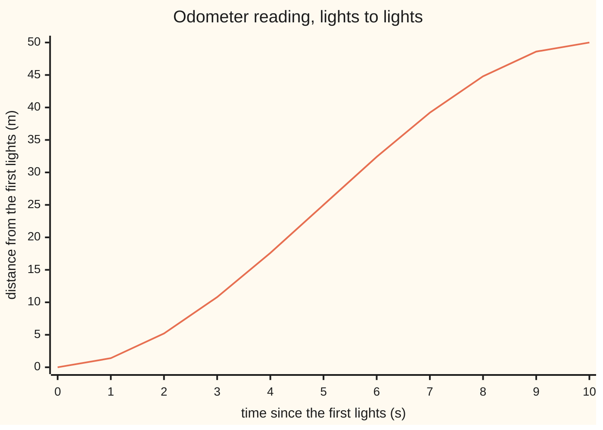
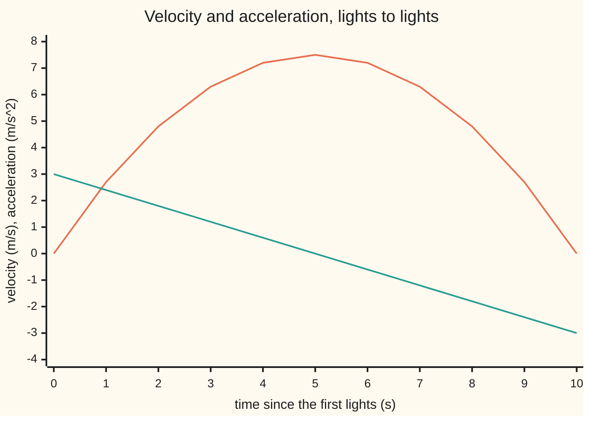

# Second derivatives: acceleration, and whether a curve bends up or down

[Syllabus](../../../SYLLABUS.md) → [Calculus and analysis](../../../SYLLABUS.md#w06) → [Derivatives](../../../SYLLABUS.md#w06-s02) → Second derivatives

---

## General Overview

A car pulls away from traffic lights and stops at the next set, 50 m on, 10 seconds later. Its odometer, zeroed at the first lights, reads 32.4 m at 6 s, 39.2 m at 7 s and 44.8 m at 8 s.

In the seventh second the car covered 6.8 m; in the eighth, 5.6 m. Velocity is positive but falling: the car is braking. Its acceleration is −1.2 m/s^2 (metres per second, per second). Moving forward, slowing down.

Acceleration is the rate of change of velocity, itself the rate of change of position: the rate of the rate. Its sign has a shape meaning. Negative, the position graph bends down like an upturned bowl; positive, up like a cup. The switch, at 5 s and 25 m, is where the foot moved to the brake.

**The second derivative is the derivative of the derivative: it measures how fast a rate is changing, and its sign says whether a graph bends up or down.**

**What kind of fact this is:** a definition (the second derivative, concave up and down, inflection point); one theorem rides with it (where the second derivative is negative the graph lies below each of its tangent lines), proved on this card in Why it works.

### The picture: the whole trip



The line is the odometer reading each second: bending up to 5 s while the car speeds up, down after, flattening as it stops.

---

## The formula

Notation first, in words. Reminder from [The derivative](01-the-derivative.md): $s'(t)$ is the rate of s per unit of t. Two primes, $s''(t)$, read "s double prime of t", is the derivative of $s'$; the other notation, $\frac{d^2 s}{dt^2}$, has its 2s count derivatives, not a square. Past three primes the count goes in brackets: $f^{(4)}$.

$$s''(t) = \lim_{h \to 0} \frac{s'(t+h) - s'(t)}{h}$$

**Read it aloud:** the change in velocity over a step h, divided by h, as h shrinks to zero.

The same number comes straight from positions:

$$s''(t) = \lim_{h \to 0} \frac{s(t+h) - 2\,s(t) + s(t-h)}{h^2}$$

**Read it aloud:** distance gained in the window after t, minus distance gained in the window before, over the window squared.

For the car, $s(t) = 1.5t^2 - 0.1t^3$ metres at $t$ seconds, from 0 to 10 s. Velocity $s'(t) = 3t - 0.3t^2$ m/s, acceleration $s''(t) = 3 - 0.6t$ m/s^2. At 7 s: 39.2 m, 6.3 m/s, −1.2 m/s^2.

The bend has its own measure, **curvature** $\kappa$ (Greek kappa): for a graph $y = f(t)$, its turning per metre along it, with a second and a metre drawn the same length:

$$\kappa = \frac{\lvert f''\rvert}{\left(1 + (f')^2\right)^{3/2}}$$

**Read it aloud:** the size of the second derivative, shrunk by the graph's steepness.

| Symbol | Plain meaning | In our example | Push it up and the answer… |
| --- | --- | --- | --- |
| $s(t)$ | odometer reading, metres, at time t | 39.2 m at 7 s | — |
| $t$ | seconds since the first lights | 7 s | past 5 s, braking |
| $s'(t)$ | velocity: metres per second | 6.3 m/s at 7 s | a steeper graph |
| $s''(t)$, $\frac{d^2 s}{dt^2}$ | acceleration: metres per second per second | −1.2 m/s^2 at 7 s | the graph bends up more |
| $s'''(t)$ | the third derivative, jerk: m/s^3 | −0.6 m/s^3 at every instant | the acceleration climbs faster |
| $h$ | the window: a small time step, never 0 | 1, 0.1, 0.01, 0.001 s | differences drift from the limit |
| $f$, $f^{(4)}$ | any function; its fourth derivative | the odometer; 0 | — |
| $\kappa$ | curvature: turning per unit length of graph | 0.004623 per m at 7 s | tighter bend, smaller circle |

### When it holds

A definition; what can fail is the limit:

- **Velocity must exist on a stretch around t.** A car hitting a wall has a corner in its position graph: no velocity at impact, so no acceleration.
- **Velocity must have no corner.** Stamping on the brake gives two one-sided accelerations and no second derivative at that instant.
- **Concavity is read on a stretch.** A single second derivative of zero decides nothing (see What breaks).

---

## Why it works

### Step 0: a derivative is a function, so it has a derivative

The derivative turns an odometer into a speedometer. Velocity is itself a function of time, so the same limit applies to it. The machine runs twice.

### Step 1: differentiate the car twice

From the derivative card, $t^2$ has rate $2t$. For $t^3$, the binomial theorem gives $(t+h)^3 = t^3 + 3t^2h + 3th^2 + h^3$. Subtract $t^3$ and divide by h: $3t^2 + 3th + h^2$, heading for $3t^2$. So velocity is $s'(t) = 1.5 \times 2t - 0.1 \times 3t^2 = 3t - 0.3t^2$, acceleration $s''(t) = 3 - 0.6t$, and jerk $s'''(t) = -0.6$ at every instant; every later derivative is 0.

At 7 s the acceleration is 3 − 0.6 × 7 = −1.2 m/s^2.

### Step 2: the same number from raw readings

Average velocity over a window is distance gained over h. Take it for the window after t and the window before, subtract, divide by h again: the second formula above, a difference of differences. Whole seconds at 7 s give 5.6 − 6.8 = −1.2. This central form is exact here at any window, because its error is set by the fourth derivative, which is 0. The one-sided form, $\frac{s(t+2h) - 2s(t+h) + s(t)}{h^2}$, is off by jerk times h: −1.8 at h = 1 s, −1.26 at 0.1 s, −1.206 at 0.01 s, closing on −1.2. To land within 0.001 of −1.2, any window under 0.001 / 0.6 of a second will do.

### Step 3: the sign decides the bend

The **tangent** at 7 s is the straight line touching the curve there, slope 6.3 m/s: where the car would be if it held its speed. Expanding the cubic, the gap between curve and tangent a time $h$ later is

$$s(7+h) - \big(s(7) + s'(7)\,h\big) = h^2 \left(\tfrac{1}{2}s''(7) + \tfrac{1}{6}s'''\,h\right) = h^2(-0.6 - 0.1h)$$

$h^2$ is never negative, and for small h the bracket is near half the second derivative. So the gap has the sign of $s''(7)$: negative, and the curve lies below its tangent. At 8 s the tangent predicts 45.5 m; the car is at 44.8 m, 0.7 m short.

That is **concave down**: below the tangents, an upturned bowl. **Concave up** is the reverse, with a positive second derivative. The trip is concave up from 0 to 5 s, concave down from 5 to 10 s.

### Step 4: the switch is an inflection point

An **inflection point** is where the second derivative changes sign. Here $3 - 0.6t$ crosses zero at 5 s, at 25 m, at top speed 7.5 m/s; the tangent there crosses the curve. The check finds 5 s by halving on raw second differences alone.

### Step 5: why curvature divides by the steepness

Slope is the tan of the graph's angle. By [Implicit and inverse differentiation](06-implicit-and-inverse-differentiation.md) and the [Chain rule](03-chain-rule.md), the angle turns $\frac{f''}{1 + (f')^2}$ per unit of t, while by Pythagoras one unit of t covers $\sqrt{1 + (f')^2}$ of graph. Their ratio is the curvature formula. At 7 s the steep graph spreads the bend thin: 0.004623 per metre. At 10 s the graph is flat and curvature equals the second derivative's size, 3 per metre. The check confirms both with circles through three nearby points, whose radius heads for 1 / curvature.

<details>
<summary>Detailed proof</summary>

**Claim.** If f'' < 0 throughout an open interval, then f(t) < f(a) + f'(a)(t − a) for any a ≠ t in it: the graph lies below each tangent.

**Proof.** Let g(t) = f(t) − f(a) − f'(a)(t − a), the gap to the tangent, so g(a) = 0 and g'(t) = f'(t) − f'(a). The [Mean value theorem](../03-What%20Derivatives%20Tell%20You/02-mean-value-theorem.md) on f' gives g'(u) = f''(c)(u − a) for some c between a and u: negative for u right of a, positive left of it. The same theorem on g gives g(t) = g'(d)(t − a) for some d between a and t. Right of a: negative times positive. Left of a: positive times negative. Either way g(t) < 0.

**Tolerance form.** f''(a) = L means: for every tolerance ε (epsilon) above 0 there is a window δ (delta) above 0 with (f'(a + h) − f'(a)) / h within ε of L whenever 0 < |h| < δ. At 7 s the velocity quotient is −1.2 − 0.3h, so δ = ε / 0.3 works.

</details>

The bracket in Step 3, extended to any number of derivatives, is [Taylor's theorem](../03-What%20Derivatives%20Tell%20You/05-taylors-theorem.md).

---

## Worked numbers, by hand

| Step | Arithmetic | Value |
| --- | --- | --- |
| Reading at 6 s | 1.5 × 6 × 6 − 0.1 × 6 × 6 × 6 | 32.4 m |
| Reading at 7 s | 1.5 × 7 × 7 − 0.1 × 7 × 7 × 7 | 39.2 m |
| Reading at 8 s | 1.5 × 8 × 8 − 0.1 × 8 × 8 × 8 | 44.8 m |
| Metres in the seventh second | 39.2 − 32.4 | 6.8 m |
| Metres in the eighth second | 44.8 − 39.2 | 5.6 m |
| Change in average speed over 1 s | 5.6 − 6.8 | −1.2 m/s |
| Formula | 3 − 0.6 × 7 | **−1.2 m/s^2** |

At 7 s the car sheds 1.2 m/s of speed per second while rolling forward at 6.3 m/s.

### How the three derivatives move together



First line (orange): velocity, peaking at 7.5 m/s at 5 s. Second line (teal): acceleration, falling 0.6 m/s^2 each second, zero at 5 s. Where teal is below zero, orange falls and the odometer graph bends down.

### What breaks if you drop a piece

| Mistake | Comes out at | What went wrong |
| --- | --- | --- |
| Squaring the velocity at 7 s | 39.69 | the 2 counts derivatives |
| Reading the bend from velocity's sign | "bends up", since 6.3 > 0 | the bend follows acceleration, −1.2 |
| Taking s'' = 0 as an inflection: $f(t) = t^4$ at 0 | 0.12 at −0.1, 0.000002 at 0, 0.12 at +0.1 | no sign change: concave up on both sides |
| Using s'' as curvature on a steep graph | 1.2 per m instead of 0.004623 | the steepness divisor was dropped |

---

## Code, from first principles, and it actually runs

Two roads to the acceleration: raw second differences over shrinking windows against the formula minus jerk times h, and whole-second readings against the formula at every second. It also halves to the inflection point, checks curvature against three-point circles, and prints every chart point.

### Python

```python
# Second derivatives -- the check behind the card.  Nothing is imported.
# A car pulls away from one set of lights and brakes to a stop at the next:
# s(t) = 1.5 t^2 - 0.1 t^3 metres at t seconds, 0 to 10 s.  The acceleration
# at 7 s is reached by two roads: differences of raw odometer readings, and
# the power-rule formula 3 - 0.6 t.  Whole-second readings give a third.
T = 7.0
def s(t): return 1.5 * t * t - 0.1 * t * t * t      # odometer, metres
def v(t): return 3 * t - 0.3 * t * t                 # power rule once, m/s
def acc(t): return 3 - 0.6 * t                       # power rule twice, m/s^2
def d2(f, t, h): return (f(t + h) - 2 * f(t) + f(t - h)) / (h * h)  # central
def r(x): return round(x, 9) + 0.0                   # prints -0.00 as 0.00
def row(xs): return ", ".join(f"{r(x):.2f}" for x in xs)

print(f"at {T:.0f} s: position {s(T):.2f} m, velocity {v(T):.2f} m/s, acceleration {acc(T):.2f} m/s^2")
for h in [1, 0.1, 0.01, 0.001]:
    fwd = (s(T + 2 * h) - 2 * s(T + h) + s(T)) / (h * h)   # difference of differences
    print(f"window {h}: forward second difference {fwd:.6f}, off by {abs(fwd - acc(T)):.6f}; central {d2(s, T, h):.6f}")
    assert abs(fwd - (acc(T) - 0.6 * h)) < 1e-5      # raw road == formula road
pos = [s(t) for t in range(11)]
d_1 = [pos[k + 1] - pos[k] for k in range(10)]
d_2 = [d_1[k + 1] - d_1[k] for k in range(9)]
d_3 = [d_2[k + 1] - d_2[k] for k in range(8)]
print(f"chart position, 0 to 10 s: {row(pos)}")
print(f"chart velocity: {row(v(t) for t in range(11))}")
print(f"chart acceleration: {row(acc(t) for t in range(11))}")
print(f"metres in each second: {row(d_1)}")
print(f"change from second to second, at 1 to 9 s: {row(d_2)}")
print(f"third differences: {row(d_3[:4])} ...; fourth differences: {row(d_3[k + 1] - d_3[k] for k in range(3))} ...")
assert all(abs(d_2[k] - acc(k + 1)) < 1e-9 for k in range(9))  # whole seconds == formula
lo, hi = 1.0, 9.0                                    # halve to where the bend switches
for _ in range(60):
    mid = (lo + hi) / 2
    lo, hi = (mid, hi) if d2(s, mid, 0.01) > 0 else (lo, mid)
print(f"inflection by halving: t = {lo:.6f} s at {s(lo):.3f} m, speed {v(lo):.2f} m/s; formula 3 / 0.6 = {3 / 0.6:.6f} s")
assert abs(lo - 3 / 0.6) < 1e-6
tan8 = s(T) + v(T) * 1
print(f"tangent at 7 s predicts {tan8:.2f} m at 8 s; car is at {s(8):.2f} m; gap {s(8) - tan8:.2f} = 1 x (-0.6 - 0.1)")
print(f"s = t^4 near 0, central second difference: {d2(lambda t: t ** 4, -0.1, 0.001):.4f}, {d2(lambda t: t ** 4, 0, 0.001):.6f}, {d2(lambda t: t ** 4, 0.1, 0.001):.4f}")
def circle(t, h):                                    # 1 / radius of circle through 3 points
    (x1, y1), (x2, y2), (x3, y3) = [(u, s(u)) for u in (t - h, t, t + h)]
    a2, b2, c2 = (x2 - x1) ** 2 + (y2 - y1) ** 2, (x3 - x2) ** 2 + (y3 - y2) ** 2, (x3 - x1) ** 2 + (y3 - y1) ** 2
    area2 = abs((x2 - x1) * (y3 - y1) - (x3 - x1) * (y2 - y1))
    return 2 * area2 / (a2 * b2 * c2) ** 0.5
for t in [7.0, 10.0]:
    kap = abs(acc(t)) / (1 + v(t) ** 2) ** 1.5
    print(f"curvature at {t:.0f} s: formula {kap:.6f} per m; circle through 3 points, h 0.1: {circle(t, 0.1):.6f}, h 0.001: {circle(t, 0.001):.6f}")
    assert abs(circle(t, 0.001) - kap) < 1e-5 * (1 + kap)
print(f"second case, 2 s: central difference {d2(s, 2, 0.5):.6f}, formula {acc(2):.2f} m/s^2; mistake: velocity squared {v(T) ** 2:.2f}")
print("ALL CHECKS PASS")
```

**Ran 2026-09-27 on macOS, Python 3.14.6, standard library only. All checks passed. Output, pasted from the run:**

```
at 7 s: position 39.20 m, velocity 6.30 m/s, acceleration -1.20 m/s^2
window 1: forward second difference -1.800000, off by 0.600000; central -1.200000
window 0.1: forward second difference -1.260000, off by 0.060000; central -1.200000
window 0.01: forward second difference -1.206000, off by 0.006000; central -1.200000
window 0.001: forward second difference -1.200600, off by 0.000600; central -1.200000
chart position, 0 to 10 s: 0.00, 1.40, 5.20, 10.80, 17.60, 25.00, 32.40, 39.20, 44.80, 48.60, 50.00
chart velocity: 0.00, 2.70, 4.80, 6.30, 7.20, 7.50, 7.20, 6.30, 4.80, 2.70, 0.00
chart acceleration: 3.00, 2.40, 1.80, 1.20, 0.60, 0.00, -0.60, -1.20, -1.80, -2.40, -3.00
metres in each second: 1.40, 3.80, 5.60, 6.80, 7.40, 7.40, 6.80, 5.60, 3.80, 1.40
change from second to second, at 1 to 9 s: 2.40, 1.80, 1.20, 0.60, 0.00, -0.60, -1.20, -1.80, -2.40
third differences: -0.60, -0.60, -0.60, -0.60 ...; fourth differences: 0.00, 0.00, 0.00 ...
inflection by halving: t = 5.000000 s at 25.000 m, speed 7.50 m/s; formula 3 / 0.6 = 5.000000 s
tangent at 7 s predicts 45.50 m at 8 s; car is at 44.80 m; gap -0.70 = 1 x (-0.6 - 0.1)
s = t^4 near 0, central second difference: 0.1200, 0.000002, 0.1200
curvature at 7 s: formula 0.004623 per m; circle through 3 points, h 0.1: 0.004626, h 0.001: 0.004623
curvature at 10 s: formula 3.000000 per m; circle through 3 points, h 0.1: 2.933981, h 0.001: 2.999993
second case, 2 s: central difference 1.800000, formula 1.80 m/s^2; mistake: velocity squared 39.69
ALL CHECKS PASS
```

### Rust

```rust
// Second derivatives -- the check behind the card.  std only.
// A car pulls away from one set of lights and brakes to a stop at the next:
// s(t) = 1.5 t^2 - 0.1 t^3 metres at t seconds, 0 to 10 s.  The acceleration
// at 7 s is reached by two roads: differences of raw odometer readings, and
// the power-rule formula 3 - 0.6 t.  Whole-second readings give a third.
const T: f64 = 7.0;
fn s(t: f64) -> f64 { 1.5 * t * t - 0.1 * t * t * t } // odometer, metres
fn v(t: f64) -> f64 { 3.0 * t - 0.3 * t * t } // power rule once, m/s
fn acc(t: f64) -> f64 { 3.0 - 0.6 * t } // power rule twice, m/s^2
fn d2(f: &dyn Fn(f64) -> f64, t: f64, h: f64) -> f64 { (f(t + h) - 2.0 * f(t) + f(t - h)) / (h * h) } // central
fn r(x: f64) -> f64 { (x * 1e9).round() / 1e9 + 0.0 } // prints -0.00 as 0.00
fn row(xs: &[f64]) -> String { xs.iter().map(|x| format!("{:.2}", r(*x))).collect::<Vec<_>>().join(", ") }
fn circle(t: f64, h: f64) -> f64 { // 1 / radius of circle through 3 points
    let p: Vec<(f64, f64)> = [t - h, t, t + h].iter().map(|&u| (u, s(u))).collect();
    let ((x1, y1), (x2, y2), (x3, y3)) = (p[0], p[1], p[2]);
    let a2 = (x2 - x1).powi(2) + (y2 - y1).powi(2);
    let b2 = (x3 - x2).powi(2) + (y3 - y2).powi(2);
    let c2 = (x3 - x1).powi(2) + (y3 - y1).powi(2);
    let area2 = ((x2 - x1) * (y3 - y1) - (x3 - x1) * (y2 - y1)).abs();
    2.0 * area2 / (a2 * b2 * c2).sqrt()
}

fn main() {
    println!("at {:.0} s: position {:.2} m, velocity {:.2} m/s, acceleration {:.2} m/s^2", T, s(T), v(T), acc(T));
    for h in [1.0, 0.1, 0.01, 0.001] {
        let fwd = (s(T + 2.0 * h) - 2.0 * s(T + h) + s(T)) / (h * h); // difference of differences
        println!("window {}: forward second difference {:.6}, off by {:.6}; central {:.6}", h, fwd, (fwd - acc(T)).abs(), d2(&s, T, h));
        assert!((fwd - (acc(T) - 0.6 * h)).abs() < 1e-5); // raw road == formula road
    }
    let pos: Vec<f64> = (0..11).map(|t| s(t as f64)).collect();
    let d_1: Vec<f64> = (0..10).map(|k| pos[k + 1] - pos[k]).collect();
    let d_2: Vec<f64> = (0..9).map(|k| d_1[k + 1] - d_1[k]).collect();
    let d_3: Vec<f64> = (0..8).map(|k| d_2[k + 1] - d_2[k]).collect();
    let d_4: Vec<f64> = (0..3).map(|k| d_3[k + 1] - d_3[k]).collect();
    println!("chart position, 0 to 10 s: {}", row(&pos));
    println!("chart velocity: {}", row(&(0..11).map(|t| v(t as f64)).collect::<Vec<_>>()));
    println!("chart acceleration: {}", row(&(0..11).map(|t| acc(t as f64)).collect::<Vec<_>>()));
    println!("metres in each second: {}", row(&d_1));
    println!("change from second to second, at 1 to 9 s: {}", row(&d_2));
    println!("third differences: {} ...; fourth differences: {} ...", row(&d_3[..4]), row(&d_4));
    assert!((0..9).all(|k| (d_2[k] - acc((k + 1) as f64)).abs() < 1e-9)); // whole seconds == formula
    let (mut lo, mut hi) = (1.0_f64, 9.0_f64); // halve to where the bend switches
    for _ in 0..60 {
        let mid = (lo + hi) / 2.0;
        if d2(&s, mid, 0.01) > 0.0 { lo = mid } else { hi = mid }
    }
    println!("inflection by halving: t = {:.6} s at {:.3} m, speed {:.2} m/s; formula 3 / 0.6 = {:.6} s", lo, s(lo), v(lo), 3.0 / 0.6);
    assert!((lo - 3.0 / 0.6).abs() < 1e-6);
    let tan8 = s(T) + v(T) * 1.0;
    println!("tangent at 7 s predicts {:.2} m at 8 s; car is at {:.2} m; gap {:.2} = 1 x (-0.6 - 0.1)", tan8, s(8.0), s(8.0) - tan8);
    let q = |t: f64| t.powi(4);
    println!("s = t^4 near 0, central second difference: {:.4}, {:.6}, {:.4}", d2(&q, -0.1, 0.001), d2(&q, 0.0, 0.001), d2(&q, 0.1, 0.001));
    for t in [7.0, 10.0] {
        let kap = acc(t).abs() / (1.0 + v(t).powi(2)).powf(1.5);
        println!("curvature at {:.0} s: formula {:.6} per m; circle through 3 points, h 0.1: {:.6}, h 0.001: {:.6}", t, kap, circle(t, 0.1), circle(t, 0.001));
        assert!((circle(t, 0.001) - kap).abs() < 1e-5 * (1.0 + kap));
    }
    println!("second case, 2 s: central difference {:.6}, formula {:.2} m/s^2; mistake: velocity squared {:.2}", d2(&s, 2.0, 0.5), acc(2.0), v(T).powi(2));
    println!("ALL CHECKS PASS");
}
```

**Ran 2026-09-27 on macOS, rustc 1.98.1, no crates. All checks passed. Output, pasted from the run:**

```
at 7 s: position 39.20 m, velocity 6.30 m/s, acceleration -1.20 m/s^2
window 1: forward second difference -1.800000, off by 0.600000; central -1.200000
window 0.1: forward second difference -1.260000, off by 0.060000; central -1.200000
window 0.01: forward second difference -1.206000, off by 0.006000; central -1.200000
window 0.001: forward second difference -1.200600, off by 0.000600; central -1.200000
chart position, 0 to 10 s: 0.00, 1.40, 5.20, 10.80, 17.60, 25.00, 32.40, 39.20, 44.80, 48.60, 50.00
chart velocity: 0.00, 2.70, 4.80, 6.30, 7.20, 7.50, 7.20, 6.30, 4.80, 2.70, 0.00
chart acceleration: 3.00, 2.40, 1.80, 1.20, 0.60, 0.00, -0.60, -1.20, -1.80, -2.40, -3.00
metres in each second: 1.40, 3.80, 5.60, 6.80, 7.40, 7.40, 6.80, 5.60, 3.80, 1.40
change from second to second, at 1 to 9 s: 2.40, 1.80, 1.20, 0.60, 0.00, -0.60, -1.20, -1.80, -2.40
third differences: -0.60, -0.60, -0.60, -0.60 ...; fourth differences: 0.00, 0.00, 0.00 ...
inflection by halving: t = 5.000000 s at 25.000 m, speed 7.50 m/s; formula 3 / 0.6 = 5.000000 s
tangent at 7 s predicts 45.50 m at 8 s; car is at 44.80 m; gap -0.70 = 1 x (-0.6 - 0.1)
s = t^4 near 0, central second difference: 0.1200, 0.000002, 0.1200
curvature at 7 s: formula 0.004623 per m; circle through 3 points, h 0.1: 0.004626, h 0.001: 0.004623
curvature at 10 s: formula 3.000000 per m; circle through 3 points, h 0.1: 2.933981, h 0.001: 2.999993
second case, 2 s: central difference 1.800000, formula 1.80 m/s^2; mistake: velocity squared 39.69
ALL CHECKS PASS
```

The two outputs agree line for line. The circle at 10 s starts further off, 2% at h = 0.1, but at both instants the error shrinks with h squared.

> [!TIP]
> **Try changing**
> Guess first, then run it.
> - **Brake harder in the odometer only.** Change `0.1` to `0.11` in `s`. The raw road reads a stronger deceleration, the formula still says −1.2, and the first assert stops the run.
> - **A far smaller window.** Add `1e-7` to the windows. The forward difference comes out positive: rounding noise divided by h squared swamps the answer, and the first assert stops the run.
> - **Curvature at the inflection.** Add `5.0` to the curvature loop. Both roads print 0.000000: at the switch the graph is momentarily straight.

---

## The usual mistake

> [!warning]
> **Reading "slowing down" from the slope instead of the bend.** At 7 s the odometer graph still climbs at 6.3 m/s. What says "braking" is that it climbs less steeply each second: the second derivative, −1.2 m/s^2.
>
> - **Squaring instead of differentiating twice.** 6.3 squared is 39.69, meaningless here.
> - **Negative acceleration read as "going backwards".** Velocity stays positive until 10 s; only its size is falling.
> - **Zero second derivative read as an inflection.** $f(t) = t^4$ bends up on both sides of 0.

---

## Where you meet it in real life

- **Braking.** Brakes are rated by deceleration, the second derivative of position; Step 3's tangent gap is why a braking car stops short of where its speed points.
- **Ride comfort.** Lift and railway engineers limit jerk, the third derivative, which passengers feel as a lurch.
- **Beams.** A loaded beam's bending is the second derivative of its sag: Stress, strain and bending.
- **Track design.** Railway and road curves are joined so second derivatives match at each seam, or passengers feel a jolt: Cubic splines.
- **Hanging chains.** The curve on [Hyperbolic functions](07-hyperbolic-functions.md) is concave up everywhere: cosh is its own second derivative.

> **Say it back**
> The second derivative is the derivative of the derivative; for position, acceleration. Raw positions give it as a difference of differences over the window squared. Negative means the graph lies below its tangents: concave down. Where the sign changes is an inflection point, here 5 s into the trip. Curvature is the second derivative shrunk by the graph's steepness.

---

## What this builds on

- [The derivative](01-the-derivative.md): the limit of average rates, applied here twice.

## Where this goes next

- [Optimisation](../03-What%20Derivatives%20Tell%20You/03-monotonicity-and-optimisation.md): the sign of the second derivative telling a peak from a trough.
- [Taylor's theorem](../03-What%20Derivatives%20Tell%20You/05-taylors-theorem.md): Step 3's bracket extended to every derivative, with its error stated.
- Stress, strain and bending: a beam's bending as the second derivative of its sag.
- Cubic splines: curves stitched so their second derivatives agree at the joins.

---

## Sources

Verified 2026-09-27: every link below resolves to the publisher's page.

- Strang, Gilbert, and Edwin Herman. *Calculus Volume 1*. OpenStax, 2016. [Section 3.2, The Derivative as a Function](https://openstax.org/books/calculus-volume-1/pages/3-2-the-derivative-as-a-function). Higher derivatives; acceleration.
- The same book, [Section 4.5, Derivatives and the Shape of a Graph](https://openstax.org/books/calculus-volume-1/pages/4-5-derivatives-and-the-shape-of-a-graph). Concavity and inflection points.
- Strang, Gilbert, and Edwin Herman. *Calculus Volume 3*. OpenStax, 2016. [Section 3.3, Arc Length and Curvature](https://openstax.org/books/calculus-volume-3/pages/3-3-arc-length-and-curvature). The curvature formula.
