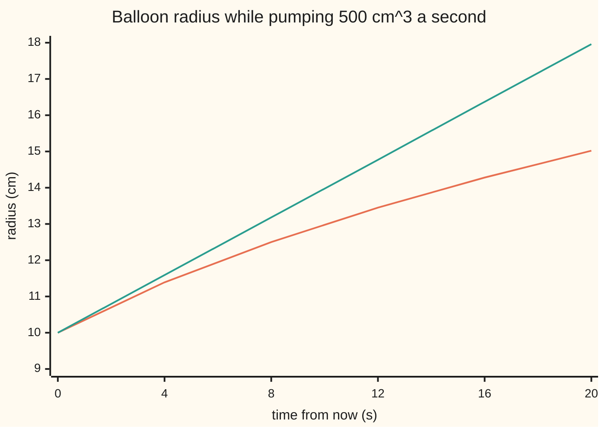

# Linear approximation: the tangent line as a stand-in, and rates linked through a relation

Calculus and analysis → What Derivatives Tell You → Predicting from a slope → Linear approximation

---

## General Overview

A round balloon has a radius of 10 cm and holds 4188.790 cm^3 of air. A pump pushes in 500 cm^3 every second. How fast is the radius growing right now?

Volume and radius are tied by the volume of a sphere, so the known volume rate fixes the radius rate. Linking two changing quantities through their relation is called **related rates**.

And where will the radius be one second from now? Walking along the present slope instead of the curve gives a quick forecast: the tangent line (the straight line touching the curve with the same slope) stands in for the curve. That stand-in is the **linear approximation**; the card says how far off it is.

**Near a point where a function has a derivative, the value a small step away is the value here plus slope times step, with an error that shrinks faster than the step; two quantities tied by a relation have their rates tied by the slope of that relation.**

**What kind of fact this is:** an approximation, with its error bounded on this card in Why it works; the related-rates formula is exact at each instant.

### The picture: the radius against its tangent line



Orange: the true radius. Green: the tangent line at time 0, climbing at a constant 0.397887358 cm/s. They part slowly; by 20 s the line says 17.96 cm, the balloon 15.02 cm.

---

## The formula

Notation first, in words. $f'(a)$ is the derivative of $f$ at the input $a$, the rate of output per unit of input ([the-derivative](../02-Derivatives/01-the-derivative.md)). $f''$ is the derivative of that rate, how fast the slope itself turns. $h$ is the step, and $R(h)$ the remainder: true value minus tangent forecast.

$$f(a+h) = f(a) + f'(a)\,h + R(h), \qquad \frac{R(h)}{h} \to 0 \text{ as } h \to 0$$

**Read it aloud:** the value a step away is the value here, plus slope times step, plus a remainder tiny even compared with the step.

When the size of $f''$ stays below a ceiling $M$ all the way from $a$ to $a+h$, the remainder has a bound:

$$\lvert R(h)\rvert \le \frac{M\,h^2}{2}$$

**Read it aloud:** the error is at most half the ceiling times the step squared.

For the balloon, the sphere's volume gives the related-rates formula:

$$V = \tfrac{4}{3}\pi r^3, \qquad \frac{dV}{dt} = 4\pi r^2\,\frac{dr}{dt}, \qquad \frac{dr}{dt} = \frac{dV/dt}{4\pi r^2}$$

**Read it aloud:** the volume rate is the surface area times the radius rate; so the radius rate is the pump rate spread over the surface.

| Symbol | Plain meaning | In our example | Push it up and the answer… |
| --- | --- | --- | --- |
| $f$, $a$ | a function, and the input where its value and slope are known | radius against volume; 4188.790 cm^3 | new base, new slope |
| $h$ | the step from the base | 500 cm^3, one second of pumping | error grows as its square |
| $f'(a)$ | the slope at the base, output units per input unit | 0.000795775 cm per cm^3 | forecast moves further |
| $R$ | true value minus tangent forecast | −0.014858 cm | — |
| $M$ | a ceiling on the size of $f''$ over the step | 12.6651 × 10^-8 cm per cm^6 | bound widens |
| $r$, $V$ | radius and volume | 10 cm, 4188.790 cm^3 | bigger balloon, slower radius |
| $t$ | time in seconds, 0 now | 0 s | — |
| $dV/dt$, $dr/dt$ | volume rate and radius rate | 500 cm^3/s, 0.397887358 cm/s | radius rate rises in step |

### When it holds

- **A derivative at the base.** At a corner, such as the absolute value of x at 0, the slopes from right and left disagree; there is no tangent line to use.
- **A small step.** The error grows as the step squared: 20 s out, the line says 17.96 cm against a true 15.02 cm.
- **A ceiling on the bend.** The bound needs $M$, which blows up as the balloon empties. Without one, $R(h)/h$ still heads for 0, but $R$ need not stay under any multiple of $h^2$: for $\lvert x\rvert^{3/2}$ at 0, $R/h^2$ is 10 at $h = 0.01$ and 100 at $h = 0.0001$.
- **The relation at every instant.** A balloon stretching into a sausage makes 4πr^2 the wrong surface.
- **A nonzero surface.** At radius 0 the division by 4πr^2 fails.

---

## Why it works

### Step 0: close up, a smooth curve is its tangent line

Zoom far enough into a point with a derivative and curve and tangent line become hard to tell apart. Below, that gap is measured.

### Step 1: the remainder shrinks faster than the step

Rearrange the formula. The remainder divided by the step is

$$\frac{R(h)}{h} = \frac{f(a+h) - f(a)}{h} - f'(a).$$

The first term is the slope of a chord (a straight line through two points of the curve). By definition the derivative is what that slope heads for as the step shrinks, so the difference heads for 0.

For the balloon's radius against volume, steps of 500, 250 and 125 cm^3 give remainder-over-step values of −2.972, −1.533 and −0.779, in units of 10^-5 cm per cm^3. Halving the step roughly halves the ratio.

### Step 2: the size of the error, from the bend

The first line says the error is small, not how small. The tangent's slope is fixed; the curve's slope drifts from it at a rate of at most $M$. After a distance s the slopes differ by at most $M$ times s, and adding up a gap that grows in a straight line from 0 gives half of $M$ times the step squared.

<details>
<summary>Detailed proof: the bound M h^2 / 2</summary>

Take h > 0; a negative step is the mirror image. For s from 0 to h let g(s) = f(a+s) − f(a) − f'(a)s, the gap between curve and tangent. Then g(0) = 0 and g'(s) = f'(a+s) − f'(a).

Since the size of f'' is at most M, by the [mean-value-theorem](02-mean-value-theorem.md), f'(a+s) − f'(a) equals f'' at some point times s, so |g'(s)| ≤ Ms.

Let p(s) = Ms^2/2 − g(s). Then p(0) = 0 and p'(s) = Ms − g'(s) ≥ 0. A function whose derivative is never negative never falls ([monotonicity-and-optimisation](03-monotonicity-and-optimisation.md)), so p(h) ≥ 0: g(h) ≤ Mh^2/2. The same on Ms^2/2 + g(s) gives g(h) ≥ −Mh^2/2. So |R(h)| ≤ Mh^2/2. In epsilon language: every step with |h| < delta = 2 epsilon / M keeps |R(h)/h| below epsilon.

</details>

The sign of $f''$ gives the side. The radius bends downwards against volume, since each extra cm^3 spreads over a larger surface, so the tangent overestimates. At a 500 cm^3 step the true radius is 10.383029 cm, the tangent says 10.397887 cm: an error of −0.014858 cm, inside the bound of 0.015831 cm.

<details>
<summary>The algebra behind the ceiling M</summary>

The slope of radius against volume is 1/(4πr^2). It changes by −2/(4πr^3) per cm of radius, and r grows at 1/(4πr^2) cm per cm^3. Nested rates multiply (the chain rule), so f'' = −1/(8π^2 r^5), largest in size at r = 10 cm: M = 12.6651 × 10^-8. Near the base the error is about f'' times h^2/2, so error over h^2 should head for −M/2 = −6.3326 × 10^-8. The code prints −5.943, −6.131 and −6.230 (units of 10^-8) as the step halves.

</details>

### Step 3: the relation ties the rates

In a short time the radius grows by a small thickness, and the new air forms a thin skin over the old sphere. Expanding the cube of the new radius gives the exact extra volume: surface 4πr^2 times the thickness, plus terms in the thickness squared and cubed.

Divide by the time taken. The left side is the average volume rate; the right side is 4πr^2 times the average radius rate, plus terms still carrying a factor of the thickness. As the time shrinks the thickness goes to 0, those terms vanish, and

$$\frac{dV}{dt} = 4\pi r^2\,\frac{dr}{dt}.$$

This is exact at each instant. At r = 10 cm the surface is 1256.637 cm^2, and 500 ÷ 1256.637 = 0.397887358 cm/s.

### Step 4: the two ideas are one

The slope of radius against volume is 1/(4πr^2) = 0.000795775 cm per cm^3; times the pump rate, it is Step 3's division. The related rate is the linear approximation taken per second.

A check that never uses the formula: find the true radius after a time dt from the volume, and divide the gain by dt. The tolerance game, with numbers: at dt = 0.1 s this quotient is off by −0.001572728 cm/s, at 0.01 s by −0.000158209, at 0.001 s by −0.000015830. To land within 0.001 cm/s, a step of 0.01 s is enough.

A second road to the bound adds a curvature term to the tangent line; [taylors-theorem](05-taylors-theorem.md) builds it.

---

## Worked numbers, by hand

| Step | Arithmetic | Value |
| --- | --- | --- |
| volume now | 4/3 × π × 10^3 | 4188.790 cm^3 |
| surface now | 4 × π × 10^2 | 1256.637 cm^2 |
| radius rate | 500 ÷ 1256.637 | **0.397887358 cm/s** |
| slope of radius against volume | 1 ÷ 1256.637 | 0.000795775 cm per cm^3 |
| tangent prediction after 500 cm^3 more | 10 + 500 × 0.000795775 | 10.397887 cm |
| true radius | cube root of 3 × (4188.790 + 500) ÷ (4π) | 10.383029 cm |
| error, and its bound | 10.383029 − 10.397887; M × 500^2 ÷ 2 | **−0.014858 cm**, within 0.015831 cm |

The radius grows at 0.397887358 cm a second, and a one-second tangent forecast is high by 0.014858 cm, about 0.15 mm.

Second case: at 20 cm the surface is four times larger, so the rate is a quarter, 0.099471839 cm/s; the difference quotient at dt = 0.001 s gives 0.099471345 cm/s.

### What breaks if you drop a piece

| Mistake | Comes out at | What went wrong |
| --- | --- | --- |
| Tangent line used 20 s ahead | 17.96 cm, against a true 15.02 cm | The error grows as the step squared |
| Multiplying by 4πr^2 instead of dividing | 628318.53, in cm^5/s | The surface spreads volume into thickness |
| Setting r = 10 before differentiating | dV/dt = 0.0, so dr/dt = 0 | A frozen radius has constant volume |

The code prints all three.

---

## Code, from first principles, and it actually runs

Road one is the formula and its tangent line. Road two uses neither: it finds the true radius as a cube root, by halving a bracket 200 times, and measures the rate by shrinking difference quotients. The asserts check that the roads meet at 10 cm and 20 cm, that the error sits below the tangent and inside the bound, and that halving the step divides the error by close to 4. The outputs agree line for line.

### Python

```python
# Linear approximation and related rates -- the check behind the card.
# A spherical balloon of radius 10 cm is pumped at 500 cm^3 of air a second.
# Road one is the formula dr/dt = (dV/dt) / (4 pi r^2) and its tangent line.
# Road two never uses it: it finds the radius itself, as a cube root by
# halving, and measures the rate by shrinking difference quotients.
from math import pi

def cube_root(y):                        # 200 halvings of the bracket [0, y + 1]
    lo, hi = 0.0, y + 1.0
    for _ in range(200):
        mid = (lo + hi) / 2
        if mid * mid * mid < y:
            lo = mid
        else:
            hi = mid
    return (lo + hi) / 2

def radius(v):                           # V = (4/3) pi r^3, solved for r
    return cube_root(3 * v / (4 * pi))

PUMP, R0, R1 = 500.0, 10.0, 20.0
V0, V1 = 4 / 3 * pi * R0 ** 3, 4 / 3 * pi * R1 ** 3
rate, rate1 = PUMP / (4 * pi * R0 * R0), PUMP / (4 * pi * R1 * R1)
slope = 1 / (4 * pi * R0 * R0)           # dr/dV at 10 cm, in cm per cm^3
M = 1 / (8 * pi * pi * R0 ** 5)          # largest size of r'' while r >= 10
print(f"balloon: r = {R0:.0f} cm, V = {V0:.3f} cm^3, pump {PUMP:.0f} cm^3/s")
print(f"formula at 10 cm: 4 pi r^2 = {4 * pi * R0 * R0:.3f} cm^2, dr/dt = {rate:.9f} cm/s; at 20 cm: {rate1:.9f} cm/s")
for dt in (0.1, 0.01, 0.001):
    q = (radius(V0 + PUMP * dt) - R0) / dt
    print(f"quotient at 10 cm, dt = {dt}: {q:.9f} cm/s, off by {q - rate:+.9f}")
q1 = (radius(V1 + PUMP * 0.001) - R1) / 0.001
print(f"quotient at 20 cm, dt = 0.001: {q1:.9f} cm/s, off by {q1 - rate1:+.9f}")
print(f"slope dr/dV at 10 cm: {slope:.9f} cm per cm^3; M = {M * 1e8:.4f} x 10^-8, M/2 = {M / 2 * 1e8:.4f} x 10^-8")
errs = []
for h in (500.0, 250.0, 125.0):
    line, true = R0 + slope * h, radius(V0 + h)
    errs.append(true - line)
    print(f"h = {h:.0f}: tangent {line:.6f}, true {true:.6f}, error {true - line:+.6f}, "
          f"error/h x 10^5 = {(true - line) / h * 1e5:+.3f}, error/h^2 x 10^8 = {(true - line) / h / h * 1e8:+.3f}")
bound = M * 500.0 ** 2 / 2
print(f"bound M h^2 / 2 at h = 500: {bound:.6f} cm; error ratios {errs[0] / errs[1]:.3f}, {errs[1] / errs[2]:.3f}")
ts = [0, 4, 8, 12, 16, 20]
print("chart, t (s): " + ", ".join(f"{t}" for t in ts))
print("chart, true radius (cm): " + ", ".join(f"{radius(V0 + PUMP * t):.2f}" for t in ts))
print("chart, tangent line (cm): " + ", ".join(f"{R0 + rate * t:.2f}" for t in ts))
print(f"mistake, multiply by 4 pi r^2 instead of dividing: {PUMP * 4 * pi * R0 * R0:.2f}")
print(f"mistake, fix r = 10 before differentiating: dV/dt = {(V0 - V0) / 0.001:.1f}, so dr/dt = 0")
assert abs((radius(V0 + PUMP * 1e-4) - R0) / 1e-4 - rate) < 1e-5   # road two meets road one
assert abs(q1 - rate1) < 1e-5                                      # the second case too
assert -bound <= errs[0] < 0                                       # below the tangent, within the bound
assert 3.8 < errs[1] / errs[2] < 4.2                               # halve the step, quarter the error
```

**Ran 2026-09-27 on macOS, Python 3.14.6, standard library only. All checks passed. Output, pasted from the run:**

```
balloon: r = 10 cm, V = 4188.790 cm^3, pump 500 cm^3/s
formula at 10 cm: 4 pi r^2 = 1256.637 cm^2, dr/dt = 0.397887358 cm/s; at 20 cm: 0.099471839 cm/s
quotient at 10 cm, dt = 0.1: 0.396314630 cm/s, off by -0.001572728
quotient at 10 cm, dt = 0.01: 0.397729148 cm/s, off by -0.000158209
quotient at 10 cm, dt = 0.001: 0.397871527 cm/s, off by -0.000015830
quotient at 20 cm, dt = 0.001: 0.099471345 cm/s, off by -0.000000495
slope dr/dV at 10 cm: 0.000795775 cm per cm^3; M = 12.6651 x 10^-8, M/2 = 6.3326 x 10^-8
h = 500: tangent 10.397887, true 10.383029, error -0.014858, error/h x 10^5 = -2.972, error/h^2 x 10^8 = -5.943
h = 250: tangent 10.198944, true 10.195112, error -0.003832, error/h x 10^5 = -1.533, error/h^2 x 10^8 = -6.131
h = 125: tangent 10.099472, true 10.098498, error -0.000973, error/h x 10^5 = -0.779, error/h^2 x 10^8 = -6.230
bound M h^2 / 2 at h = 500: 0.015831 cm; error ratios 3.878, 3.936
chart, t (s): 0, 4, 8, 12, 16, 20
chart, true radius (cm): 10.00, 11.39, 12.50, 13.45, 14.28, 15.02
chart, tangent line (cm): 10.00, 11.59, 13.18, 14.77, 16.37, 17.96
mistake, multiply by 4 pi r^2 instead of dividing: 628318.53
mistake, fix r = 10 before differentiating: dV/dt = 0.0, so dr/dt = 0
```

### Rust

```rust
// Linear approximation and related rates -- the check behind the card.
// A spherical balloon of radius 10 cm is pumped at 500 cm^3 of air a second.
// Road one is the formula dr/dt = (dV/dt) / (4 pi r^2) and its tangent line.
// Road two never uses it: it finds the radius itself, as a cube root by
// halving, and measures the rate by shrinking difference quotients.
use std::f64::consts::PI;

fn cube_root(y: f64) -> f64 {
    // 200 halvings of the bracket [0, y + 1]
    let (mut lo, mut hi) = (0.0, y + 1.0);
    for _ in 0..200 {
        let mid = (lo + hi) / 2.0;
        if mid * mid * mid < y { lo = mid; } else { hi = mid; }
    }
    (lo + hi) / 2.0
}

fn radius(v: f64) -> f64 {
    // V = (4/3) pi r^3, solved for r
    cube_root(3.0 * v / (4.0 * PI))
}

fn main() {
    let (pump, r0, r1) = (500.0_f64, 10.0_f64, 20.0_f64);
    let (v0, v1) = (4.0 / 3.0 * PI * r0.powi(3), 4.0 / 3.0 * PI * r1.powi(3));
    let (rate, rate1) = (pump / (4.0 * PI * r0 * r0), pump / (4.0 * PI * r1 * r1));
    let slope = 1.0 / (4.0 * PI * r0 * r0); // dr/dV at 10 cm, in cm per cm^3
    let m = 1.0 / (8.0 * PI * PI * r0.powi(5)); // largest size of r'' while r >= 10
    println!("balloon: r = {:.0} cm, V = {:.3} cm^3, pump {:.0} cm^3/s", r0, v0, pump);
    println!("formula at 10 cm: 4 pi r^2 = {:.3} cm^2, dr/dt = {:.9} cm/s; at 20 cm: {:.9} cm/s",
             4.0 * PI * r0 * r0, rate, rate1);
    for dt in [0.1_f64, 0.01, 0.001] {
        let q = (radius(v0 + pump * dt) - r0) / dt;
        println!("quotient at 10 cm, dt = {}: {:.9} cm/s, off by {:+.9}", dt, q, q - rate);
    }
    let q1 = (radius(v1 + pump * 0.001) - r1) / 0.001;
    println!("quotient at 20 cm, dt = 0.001: {:.9} cm/s, off by {:+.9}", q1, q1 - rate1);
    println!("slope dr/dV at 10 cm: {:.9} cm per cm^3; M = {:.4} x 10^-8, M/2 = {:.4} x 10^-8",
             slope, m * 1e8, m / 2.0 * 1e8);
    let mut errs = Vec::new();
    for h in [500.0_f64, 250.0, 125.0] {
        let (line, truth) = (r0 + slope * h, radius(v0 + h));
        errs.push(truth - line);
        println!("h = {:.0}: tangent {:.6}, true {:.6}, error {:+.6}, error/h x 10^5 = {:+.3}, error/h^2 x 10^8 = {:+.3}",
                 h, line, truth, truth - line, (truth - line) / h * 1e5, (truth - line) / h / h * 1e8);
    }
    let bound = m * 500.0_f64.powi(2) / 2.0;
    println!("bound M h^2 / 2 at h = 500: {:.6} cm; error ratios {:.3}, {:.3}",
             bound, errs[0] / errs[1], errs[1] / errs[2]);
    let ts = [0, 4, 8, 12, 16, 20];
    let row = |f: &dyn Fn(f64) -> f64| ts.iter().map(|&t| format!("{:.2}", f(t as f64))).collect::<Vec<_>>().join(", ");
    println!("chart, t (s): {}", ts.iter().map(|t| t.to_string()).collect::<Vec<_>>().join(", "));
    println!("chart, true radius (cm): {}", row(&|t| radius(v0 + pump * t)));
    println!("chart, tangent line (cm): {}", row(&|t| r0 + rate * t));
    println!("mistake, multiply by 4 pi r^2 instead of dividing: {:.2}", pump * 4.0 * PI * r0 * r0);
    println!("mistake, fix r = 10 before differentiating: dV/dt = {:.1}, so dr/dt = 0", (v0 - v0) / 0.001);
    assert!(((radius(v0 + pump * 1e-4) - r0) / 1e-4 - rate).abs() < 1e-5); // road two meets road one
    assert!((q1 - rate1).abs() < 1e-5); // the second case too
    assert!(-bound <= errs[0] && errs[0] < 0.0); // below the tangent, within the bound
    assert!(3.8 < errs[1] / errs[2] && errs[1] / errs[2] < 4.2); // halve the step, quarter the error
}
```

**Ran 2026-09-27 on macOS, rustc 1.98.1, no crates. All checks passed. Output, pasted from the run:**

```
balloon: r = 10 cm, V = 4188.790 cm^3, pump 500 cm^3/s
formula at 10 cm: 4 pi r^2 = 1256.637 cm^2, dr/dt = 0.397887358 cm/s; at 20 cm: 0.099471839 cm/s
quotient at 10 cm, dt = 0.1: 0.396314630 cm/s, off by -0.001572728
quotient at 10 cm, dt = 0.01: 0.397729148 cm/s, off by -0.000158209
quotient at 10 cm, dt = 0.001: 0.397871527 cm/s, off by -0.000015830
quotient at 20 cm, dt = 0.001: 0.099471345 cm/s, off by -0.000000495
slope dr/dV at 10 cm: 0.000795775 cm per cm^3; M = 12.6651 x 10^-8, M/2 = 6.3326 x 10^-8
h = 500: tangent 10.397887, true 10.383029, error -0.014858, error/h x 10^5 = -2.972, error/h^2 x 10^8 = -5.943
h = 250: tangent 10.198944, true 10.195112, error -0.003832, error/h x 10^5 = -1.533, error/h^2 x 10^8 = -6.131
h = 125: tangent 10.099472, true 10.098498, error -0.000973, error/h x 10^5 = -0.779, error/h^2 x 10^8 = -6.230
bound M h^2 / 2 at h = 500: 0.015831 cm; error ratios 3.878, 3.936
chart, t (s): 0, 4, 8, 12, 16, 20
chart, true radius (cm): 10.00, 11.39, 12.50, 13.45, 14.28, 15.02
chart, tangent line (cm): 10.00, 11.59, 13.18, 14.77, 16.37, 17.96
mistake, multiply by 4 pi r^2 instead of dividing: 628318.53
mistake, fix r = 10 before differentiating: dV/dt = 0.0, so dr/dt = 0
```

> [!TIP]
> **Try changing**
> - **Double the pump rate.** Guess first: the radius rate doubles; at a fixed radius it is a straight multiple of the pump rate.
> - **Let air out: h = −500.** Guess first: the error stays negative. The curve bends downwards on both sides, so the tangent sits above it either way.
> - **Use the chord from t − dt to t + dt.** Guess first: the off-by column shrinks as dt squared instead of dt, because the bend cancels between the two sides.

---

## The usual mistake

> [!warning]
> **Substituting before differentiating.** Put r = 10 into the volume first and the volume is a constant, 4188.790 cm^3, with rate 0.0; the radius rate then comes out 0. Differentiate while r is still changing; the instant's values go in afterwards.
>
> - **Using the tangent far from its base.** Twenty seconds out it says 17.96 cm; the balloon is at 15.02 cm.
> - **Sensitivity read as rate.** 4πr^2 = 1256.637 is cm^3 per cm of radius, a slope, not a speed. Multiplying the pump rate by it gives 628318.53.

---

## Where you meet it in real life

- **Measurement error.** The slope turns an error in a measured length into the error of a computed volume; [numerical-derivatives-and-sensitivity](08-numerical-derivatives-and-sensitivity.md) measures it when no formula is at hand.
- **The pendulum.** Replacing sin x by x for small swings is the tangent line of sin at 0.
- **Bond prices.** Modified duration is minus the slope of price against yield, divided by the price; price times duration times the yield change estimates the price fall.
- **Filling a tank.** The water level's rate from the inflow is related rates on the tank's shape.

> **Say it back**
> Near a point, a function with a derivative is almost its tangent line. The value a step away is the value here plus slope times step, with an error shrinking faster than the step. Differentiating a relation ties two rates. For the balloon, 500 cm^3 a second spread over 1256.637 cm^2 of surface is 0.397887358 cm/s: the linear approximation, taken per second.

---

## What this builds on

- [the-derivative](../02-Derivatives/01-the-derivative.md): the slope as the limit of chord slopes, which is the whole of Step 1.

## Where this goes next

- [newtons-method](06-newtons-method.md): set the tangent line to zero and solve.
- [eulers-method](../../08-Differential%20equations%20and%20dynamics/05-Numerical%20Evolution/01-eulers-method.md): follow a rate forward in many short tangent steps.
- [delta-method-and-slutsky](../../09-Probability%20and%20statistics/06-Limit%20Theorems%20in%20Practice/05-delta-method-and-slutsky.md): the slope carries a measurement's spread through a function.

Open question: where to step to make a function zero. [newtons-method](06-newtons-method.md) repeats the tangent step.

---

## Sources

Verified 2026-09-27: every link below resolves to the publisher's page.

- Strang, Gilbert, Edwin Herman et al. *Calculus Volume 1*, OpenStax, §4.2. [Linear Approximations and Differentials](https://openstax.org/books/calculus-volume-1/pages/4-2-linear-approximations-and-differentials). The tangent line as a stand-in, and differentials.
- Strang, Gilbert, Edwin Herman et al. *Calculus Volume 1*, OpenStax, §4.1. [Related Rates](https://openstax.org/books/calculus-volume-1/pages/4-1-related-rates). Balloon problems; differentiate before substituting.
- Strang, Gilbert, Edwin Herman et al. *Calculus Volume 2*, OpenStax, §6.3. [Taylor and Maclaurin Series](https://openstax.org/books/calculus-volume-2/pages/6-3-taylor-and-maclaurin-series). Taylor's theorem with remainder, which contains the bound.
- Jerison, David. *18.01SC Single Variable Calculus*, MIT OpenCourseWare, 2010. [Unit 2: Applications of Differentiation](https://ocw.mit.edu/courses/18-01sc-single-variable-calculus-fall-2010/pages/unit-2-applications-of-differentiation/). Lectures on both ideas.
