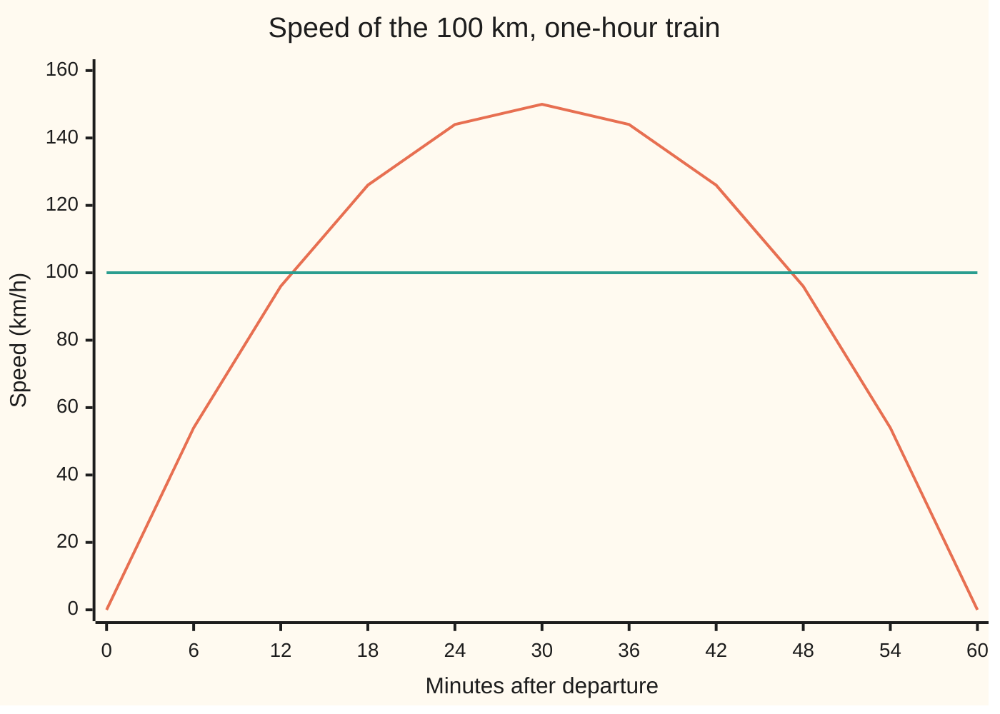
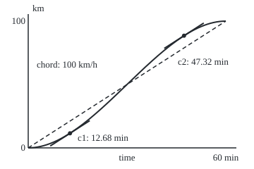

# Mean value theorem: somewhere the instantaneous rate equals the average rate

[Syllabus](../../../SYLLABUS.md) → [Calculus and analysis](../../../SYLLABUS.md#w06) → [What Derivatives Tell You](../../../SYLLABUS.md#w06-s03) → Mean value theorem

---

## General Overview

A train leaves one station at rest and stops at the next, 100 km down the line, exactly one hour later. Its average speed was 100 km/h. Was there an instant when the speedometer read exactly 100? On the run drawn below, yes: at 12.68 and at 47.32 minutes after departure.

However the train is driven, a trip with no teleporting and no instant change of speed passes through its average speed at least once. The mean value theorem is that guarantee, for any function.

Its main use runs the other way: facts about the derivative at single points ("zero speed at every instant") become facts about a whole stretch ("the train never moved").

**If a function has no jumps on a stretch and a derivative at every inside point, then at some inside point the derivative equals the average rate over the whole stretch.**

**What kind of fact this is:** a theorem, proved on this card in Why it works, with its special case, Rolle's theorem, and its consequence: zero derivative means constant.

### The picture: the train's speed through the hour



The orange curve is the train's speed, peaking at 150 km/h at half past. The teal line is the average, 100 km/h. They cross twice: the theorem promises at least one crossing, and this trip has two.

---

## The formula

Notation first, in words. $[a, b]$ means every input from a to b, ends included; $(a, b)$ leaves the two ends out. A function is **continuous** on a stretch when it has no jumps there, and **differentiable** at a point when it has a derivative there.

If $f$ is continuous on $[a, b]$ and differentiable on $(a, b)$, then at least one point $c$ strictly between a and b has

$$f'(c) = \frac{f(b) - f(a)}{b - a}.$$

**Read it aloud:** somewhere inside, the instantaneous rate equals the total change divided by the stretch's length.

The right side, the average rate $m$, is the slope of the **chord**: the straight line joining the graph's two end points. In pictures: some tangent runs parallel to the chord.

**Rolle's theorem** is the special case $f(a) = f(b)$. Then $m = 0$, and some inside point has $f'(c) = 0$: a flat tangent.

For the train, $f$ is the position $s$ in km, and $t$ the time in hours:

$$s(t) = 100\,(3t^2 - 2t^3), \qquad v(t) = s'(t) = 600t - 600t^2.$$

The speed $v$ is in km/h: output units per input unit.

| Symbol | Plain meaning | In our example | Push it up and the answer… |
| --- | --- | --- | --- |
| $f$, $s$ | the function; $s$ is the train's position | $s(t)$ km | — |
| $t$ | time since departure | 0 to 1 hour | — |
| $a$, $b$ | the ends of the stretch | 0 h and 1 h | — |
| $f'$, $v$ | the derivative; $v$ is speed | $v(t)$ km/h | — |
| $m$ | the average rate, $(f(b) - f(a))/(b - a)$ | 100 km/h | the promised instants move |
| $c$, $c_1$, $c_2$ | inside points where $f'(c) = m$ | 0.211325 h and 0.788675 h | found, not chosen |
| $g$ | $f$ minus a line of slope $m$: the lead over a steady 100 km/h | $s(t) - 100t$ km | — |
| $h$ | a small time step in a difference quotient | 0.1, 0.01, 0.001 h | a cruder slope |

### The picture: the chord and the two parallel tangents

<p align="center"></p>

Drawn to scale: 280 units across per hour, 1.8 units up per km. The solid curve is the position, the dashed chord has slope 100 km/h, and both short tangents have that same slope.

### When it holds

- **No jumps, ends included.** A position leaping to 100 km at the final instant averages 100 km/h with inside speed 0.
- **A derivative at every inside point.** 200 km/h for half an hour, then stopped dead, averages 100 km/h but never shows it: the corner has no derivative.
- **One unbroken stretch**, for constancy. Across a gap the value can change while the rate is zero wherever it exists.

---

## Why it works

### Step 0: at a smooth inside peak or trough, the slope is zero

Take the train's lead over a steady 100 km/h pace, $g(t) = s(t) - 100t$. It starts at 0 km, falls behind, pulls ahead, and ends at 0 km. It is lowest, 9.62 km behind, at $c_1$ = 0.211325 h.

Take slopes of $g$ over short steps from there. Forward, $g$ can only rise, so the slope is at least zero. Backward, $g$ also rises, but the step is negative, so the slope is at most zero:

| Step $h$ | Slope after $c_1$ | Slope before $c_1$ |
| --- | --- | --- |
| 0.1 h | +15.3205 | −19.3205 |
| 0.01 h | +1.7121 | −1.7521 |
| 0.001 h | +0.1730 | −0.1734 |

The derivative is the number both columns head for as the step shrinks ([The derivative](../02-Derivatives/01-the-derivative.md)). The "after" column is never negative and the "before" column never positive, so that number is 0. To land both slopes within 0.2 of 0, a step of 0.001 h is enough; each tenfold cut in the step cuts both about tenfold.

The same holds at any inside peak or trough where a derivative exists. At an end only one column exists, so the argument fails there: an end can be highest with a nonzero slope.

### Step 1: Rolle's theorem, equal ends force a flat point

Suppose $f(a) = f(b)$. If $f$ is constant, every slope is 0. If not, $f$ goes above or below the end height somewhere.

A continuous function on a closed stretch reaches a highest and a lowest value ([Extreme value theorem](../01-Limits%20and%20Continuity/07-extreme-value-theorem.md)). If $f$ goes above the end height, its highest value is reached inside, and Step 0 makes the derivative there 0. Going below uses the lowest value.

The lead $g$ is 0 km at both ends, lowest (−9.62 km) at $c_1$ and highest (+9.62 km) at $c_2$ = 0.788675 h: two flat points.

### Step 2: the mean value theorem, tilt until the ends are level

Set $g(x) = f(x) - m x$. The ends now match: $g(b) - g(a) = (f(b) - f(a)) - m(b - a) = 0$. A straight line adds no jump and no corner, so $g$ meets Rolle's conditions.

Rolle gives an inside $c$ with $g'(c) = 0$. Since $g'(x) = f'(x) - m$, that says $f'(c) = m$.

For the train, $g$ is the lead over a steady 100 km/h. Where the lead stops shrinking and starts growing, the train is doing exactly 100.

### Step 3: zero derivative means constant

Suppose $f'(x) = 0$ at every point of a stretch with no gaps. Pick any two points $a < b$ in it. Steps 0 to 2 apply on $[a, b]$, so

$$f(b) - f(a) = f'(c)\,(b - a) = 0 \times (b - a) = 0.$$

So $f$ is constant. A train at zero speed for a whole hour did not move. Likewise two trains with identical speed records stay a fixed distance apart: their difference has derivative 0. That is why an antiderivative is fixed up to one added constant.

<details>
<summary>Detailed proof</summary>

**Interior extremum.** Let $f$ be lowest on $(a, b)$ at $c$, with $f'(c)$ existing. For every step $h \ne 0$ keeping $c + h$ in the stretch, $f(c + h) - f(c) \ge 0$, so the quotient by $h$ is $\ge 0$ for $h > 0$ and $\le 0$ for $h < 0$. Given any $\varepsilon > 0$, the derivative's definition gives a distance within which every quotient lies within $\varepsilon$ of $f'(c)$. One step of each sign inside it gives $-\varepsilon < f'(c) < \varepsilon$; as $\varepsilon$ is arbitrary, $f'(c) = 0$. A highest value reverses the inequalities.

**The rest.** Rolle, the theorem and constancy then follow exactly as in Steps 1 to 3, which use nothing beyond this step and the extreme value theorem. For constancy, a derivative at every point forces continuity there, so $[a, b]$ meets the conditions; on a domain with a gap no such $[a, b]$ spans the gap.

</details>

The same tilt, with two functions, gives Cauchy's version, behind [L'Hopital's rule](04-lhopitals-rule.md). Repeated, it gives the error term in [Taylor's theorem](05-taylors-theorem.md).

---

## Worked numbers, by hand

| Step | Arithmetic | Value |
| --- | --- | --- |
| positions at the ends | $s(0) = 0$, $s(1) = 100(3 - 2)$ | 0 km and 100 km |
| average rate | (100 − 0) ÷ (1 − 0) | 100 km/h |
| speed | derivative of $100(3t^2 - 2t^3)$ | $600t - 600t^2$ km/h |
| set speed equal to the average | $600t - 600t^2 = 100$, so $6t^2 - 6t + 1 = 0$ | a quadratic |
| quadratic formula | $t = (6 \pm \sqrt{36 - 24})/12 = (3 \pm \sqrt{3})/6$ | two roots |
| with √3 = 1.732051 | (3 − 1.732051) ÷ 6 and (3 + 1.732051) ÷ 6 | **0.211325 h and 0.788675 h** |
| in minutes | times 60 | **12.68 min and 47.32 min** |
| positions then | $s$ at each time | 11.51 km and 88.49 km |
| lead over steady 100 km/h | $s(t) - 100t$ at each time | −9.62 km and +9.62 km |

The train passes 100 km/h accelerating at 11.51 km and braking at 88.49 km.

### What breaks if you drop a piece

| Mistake | Comes out at | What went wrong |
| --- | --- | --- |
| A corner: 200 km/h for 30 min, then stopped | average 100; speed 200, then 0, never 100 | no derivative at 30 minutes |
| A jump: 0 km until the last instant, then 100 km | average 100; speed 0 at every inside time | not continuous at the end $b$ |
| A gap at 30 min: at 0 km before, 100 km after | rate 0 everywhere it exists; values 0 and 100 | zero derivative gives constant only on one unbroken stretch |

The code prints all three.

---

## Code, from first principles, and it actually runs

Three independent roads find the instants of 100 km/h. Road 1 is the quadratic formula. Road 2 builds its own speed from a difference quotient, then halves an interval sixty times (bisection) around where speed minus 100 changes sign. Road 3 is Rolle's proof as a computation: no speed, only where the lead is lowest and highest. The difference-quotient speed, 98.0000, 99.9800, 99.9998, closes on 100: errors 2, 0.02, 0.0002.

### Python

```python
# Mean value theorem -- the check behind the card.  Standard library only.
# A train runs 100 km in 1 hour, rest to rest: s(t) = 100(3t^2 - 2t^3) km at
# t hours.  When is its speed exactly the average, 100 km/h?  Three roads: the
# quadratic formula; bisection on the script's own difference-quotient speed;
# and Rolle's road, which finds where the lead over a steady 100 km/h is
# lowest and highest on a grid, then refines, and never looks at a speed.
import math
def s(t): return 100 * (3 * t * t - 2 * t ** 3)
def lead(t): return s(t) - 100 * t                        # km ahead of steady pace
def speed(f, t, h=1e-5): return (f(t + h) - f(t - h)) / (2 * h)
def bisect(fn, lo, hi):
    for _ in range(60):
        mid = (lo + hi) / 2
        lo, hi = (mid, hi) if (fn(lo) < 0) == (fn(mid) < 0) else (lo, mid)
    return (lo + hi) / 2
def extreme(fn, sign):                                    # sign 1 lowest, -1 highest
    k = min(range(1001), key=lambda i: sign * fn(i / 1000))
    lo, hi = (k - 1) / 1000, (k + 1) / 1000
    for _ in range(100):
        a, b = lo + (hi - lo) / 3, hi - (hi - lo) / 3
        lo, hi = (lo, b) if sign * fn(a) < sign * fn(b) else (a, hi)
    return (lo + hi) / 2
avg = (s(1) - s(0)) / (1 - 0)
exact = [(3 - math.sqrt(3)) / 6, (3 + math.sqrt(3)) / 6]  # 600t - 600t^2 = 100
bis = [bisect(lambda t: speed(s, t) - avg, a, b) for a, b in ((0, 0.5), (0.5, 1))]
rol = [extreme(lead, 1), extreme(lead, -1)]
print(f"trip: {s(1) - s(0):.0f} km in 1 h; average speed {avg:.0f} km/h")
print("speed at minutes 0, 6, ..., 60:", [round(600 * k / 10 * (1 - k / 10)) for k in range(11)])
print(f"road 1, quadratic formula, sqrt 3 = {math.sqrt(3):.6f}: c1 = {exact[0]:.6f} h ({60 * exact[0]:.2f} min), c2 = {exact[1]:.6f} h ({60 * exact[1]:.2f} min)")
print(f"road 2, bisection on difference-quotient speed: c1 = {bis[0]:.6f}, c2 = {bis[1]:.6f}")
print(f"road 3, Rolle: lead lowest at {rol[0]:.6f} h, {lead(rol[0]):.2f} km; highest at {rol[1]:.6f} h, {lead(rol[1]):.2f} km")
print(f"positions at c1 and c2: {s(exact[0]):.2f} km and {s(exact[1]):.2f} km")
for h in (0.1, 0.01, 0.001):
    r, l = (lead(rol[0] + h) - lead(rol[0])) / h, (lead(rol[0] - h) - lead(rol[0])) / -h
    print(f"lead's slope over a step of {h} h after c1: {r:+.4f}, before c1: {l:+.4f}")
print("difference-quotient speed at c1, steps 0.1, 0.01, 0.001:",
      ", ".join(f"{speed(s, exact[0], h):.4f}" for h in (0.1, 0.01, 0.001)))
X, Y = lambda t: 40 + 280 * t, lambda km: 210 - 1.8 * km
print("figure, curve M 40,210 C", " ".join(f"{X(t):.1f},{Y(k):.1f}" for t, k in ((1/3, 0), (2/3, 100), (1, 100))))
for i, c in enumerate(exact, 1):
    ends = [(X(c + d), Y(s(c) + 100 * d)) for d in (-0.1, 0.1)]
    print(f"figure, tangent {i} at ({X(c):.1f},{Y(s(c)):.1f}) from ({ends[0][0]:.1f},{ends[0][1]:.1f}) to ({ends[1][0]:.1f},{ends[1][1]:.1f})")
corner = lambda t: 200 * t if t <= 0.5 else 100.0
jump = lambda t: 100.0 if t >= 1 else 0.0
gap = lambda t: 0.0 if t < 0.5 else 100.0                 # undefined at exactly 0.5
print(f"breaks 1, corner: average {corner(1) - corner(0):.0f}; speed {speed(corner, 0.25):.0f} before 30 min, {speed(corner, 0.75):.0f} after")
print(f"breaks 2, jump at the end: average {jump(1) - jump(0):.0f}; speed {speed(jump, 0.5):.0f} at every inside time")
print(f"breaks 3, gap at 30 min: rate {speed(gap, 0.25):.0f} and {speed(gap, 0.75):.0f}, values {gap(0.25):.0f} and {gap(0.75):.0f}")
assert all(abs(e - b) < 1e-6 for e, b in zip(exact, bis))          # formula vs bisection
assert all(abs(e - r) < 1e-6 for e, r in zip(exact, rol))          # formula vs Rolle's road
assert abs(speed(s, exact[0], 0.001) - 600 * exact[0] * (1 - exact[0])) < 1e-3
cavg = corner(1) - corner(0)                               # the corner trip's own average
assert abs(speed(corner, 0.25) - cavg) > 99 and abs(speed(corner, 0.75) - cavg) > 99
print("ALL CHECKS PASS")
```

**Ran 2026-09-27 on macOS, Python 3.14.6, standard library only. All checks passed. Output, pasted from the run:**

```
trip: 100 km in 1 h; average speed 100 km/h
speed at minutes 0, 6, ..., 60: [0, 54, 96, 126, 144, 150, 144, 126, 96, 54, 0]
road 1, quadratic formula, sqrt 3 = 1.732051: c1 = 0.211325 h (12.68 min), c2 = 0.788675 h (47.32 min)
road 2, bisection on difference-quotient speed: c1 = 0.211325, c2 = 0.788675
road 3, Rolle: lead lowest at 0.211325 h, -9.62 km; highest at 0.788675 h, 9.62 km
positions at c1 and c2: 11.51 km and 88.49 km
lead's slope over a step of 0.1 h after c1: +15.3205, before c1: -19.3205
lead's slope over a step of 0.01 h after c1: +1.7121, before c1: -1.7521
lead's slope over a step of 0.001 h after c1: +0.1730, before c1: -0.1734
difference-quotient speed at c1, steps 0.1, 0.01, 0.001: 98.0000, 99.9800, 99.9998
figure, curve M 40,210 C 133.3,210.0 226.7,30.0 320.0,30.0
figure, tangent 1 at (99.2,189.3) from (71.2,207.3) to (127.2,171.3)
figure, tangent 2 at (260.8,50.7) from (232.8,68.7) to (288.8,32.7)
breaks 1, corner: average 100; speed 200 before 30 min, 0 after
breaks 2, jump at the end: average 100; speed 0 at every inside time
breaks 3, gap at 30 min: rate 0 and 0, values 0 and 100
ALL CHECKS PASS
```

### Rust

Same rows, same labels, built with `rustc --edition 2021 -O`.

```rust
// Mean value theorem -- the same check as the Python, in Rust, std only.
// A train runs 100 km in 1 hour, rest to rest: s(t) = 100(3t^2 - 2t^3) km at
// t hours.  Three roads to the times its speed is exactly 100 km/h: the
// quadratic formula, bisection on a difference-quotient speed, and Rolle's
// road (lowest and highest lead over a steady 100 km/h, found on a grid).
fn s(t: f64) -> f64 { 100.0 * (3.0 * t * t - 2.0 * t * t * t) }
fn lead(t: f64) -> f64 { s(t) - 100.0 * t }
fn speed(f: &dyn Fn(f64) -> f64, t: f64, h: f64) -> f64 { (f(t + h) - f(t - h)) / (2.0 * h) }
fn bisect(f: &dyn Fn(f64) -> f64, mut lo: f64, mut hi: f64) -> f64 {
    for _ in 0..60 {
        let mid = (lo + hi) / 2.0;
        if (f(lo) < 0.0) == (f(mid) < 0.0) { lo = mid } else { hi = mid }
    }
    (lo + hi) / 2.0
}
fn extreme(f: &dyn Fn(f64) -> f64, sign: f64) -> f64 {
    let mut k = 0;
    for i in 1..=1000 { if sign * f(i as f64 / 1000.0) < sign * f(k as f64 / 1000.0) { k = i } }
    let (mut lo, mut hi) = ((k as f64 - 1.0) / 1000.0, (k as f64 + 1.0) / 1000.0);
    for _ in 0..100 {
        let (a, b) = (lo + (hi - lo) / 3.0, hi - (hi - lo) / 3.0);
        if sign * f(a) < sign * f(b) { hi = b } else { lo = a }
    }
    (lo + hi) / 2.0
}
fn main() {
    let h0 = 1e-5;
    let avg = (s(1.0) - s(0.0)) / (1.0 - 0.0);
    let exact = [(3.0 - 3f64.sqrt()) / 6.0, (3.0 + 3f64.sqrt()) / 6.0];
    let dv = |t: f64| speed(&s, t, h0) - avg;
    let bis = [bisect(&dv, 0.0, 0.5), bisect(&dv, 0.5, 1.0)];
    let rol = [extreme(&lead, 1.0), extreme(&lead, -1.0)];
    println!("trip: {:.0} km in 1 h; average speed {:.0} km/h", s(1.0) - s(0.0), avg);
    let v: Vec<String> = (0..11).map(|k| { let t = k as f64 / 10.0; format!("{}", (600.0 * t * (1.0 - t)).round() as i64) }).collect();
    println!("speed at minutes 0, 6, ..., 60: [{}]", v.join(", "));
    println!("road 1, quadratic formula, sqrt 3 = {:.6}: c1 = {:.6} h ({:.2} min), c2 = {:.6} h ({:.2} min)", 3f64.sqrt(), exact[0], 60.0 * exact[0], exact[1], 60.0 * exact[1]);
    println!("road 2, bisection on difference-quotient speed: c1 = {:.6}, c2 = {:.6}", bis[0], bis[1]);
    println!("road 3, Rolle: lead lowest at {:.6} h, {:.2} km; highest at {:.6} h, {:.2} km", rol[0], lead(rol[0]), rol[1], lead(rol[1]));
    println!("positions at c1 and c2: {:.2} km and {:.2} km", s(exact[0]), s(exact[1]));
    for h in [0.1, 0.01, 0.001] {
        let (r, l) = ((lead(rol[0] + h) - lead(rol[0])) / h, (lead(rol[0] - h) - lead(rol[0])) / -h);
        println!("lead's slope over a step of {} h after c1: {:+.4}, before c1: {:+.4}", h, r, l);
    }
    let q: Vec<String> = [0.1, 0.01, 0.001].iter().map(|&h| format!("{:.4}", speed(&s, exact[0], h))).collect();
    println!("difference-quotient speed at c1, steps 0.1, 0.01, 0.001: {}", q.join(", "));
    let (x, y) = (|t: f64| 40.0 + 280.0 * t, |km: f64| 210.0 - 1.8 * km);
    let pts: Vec<String> = [(1.0 / 3.0, 0.0), (2.0 / 3.0, 100.0), (1.0, 100.0)].iter().map(|&(t, k)| format!("{:.1},{:.1}", x(t), y(k))).collect();
    println!("figure, curve M 40,210 C {}", pts.join(" "));
    for (i, &c) in exact.iter().enumerate() {
        let e = [(x(c - 0.1), y(s(c) - 10.0)), (x(c + 0.1), y(s(c) + 10.0))];
        println!("figure, tangent {} at ({:.1},{:.1}) from ({:.1},{:.1}) to ({:.1},{:.1})", i + 1, x(c), y(s(c)), e[0].0, e[0].1, e[1].0, e[1].1);
    }
    let corner = |t: f64| if t <= 0.5 { 200.0 * t } else { 100.0 };
    let jump = |t: f64| if t >= 1.0 { 100.0 } else { 0.0 };
    let gap = |t: f64| if t < 0.5 { 0.0 } else { 100.0 }; // undefined at exactly 0.5
    let (c1, c2) = (speed(&corner, 0.25, h0), speed(&corner, 0.75, h0));
    println!("breaks 1, corner: average {:.0}; speed {:.0} before 30 min, {:.0} after", corner(1.0) - corner(0.0), c1, c2);
    println!("breaks 2, jump at the end: average {:.0}; speed {:.0} at every inside time", jump(1.0) - jump(0.0), speed(&jump, 0.5, h0));
    println!("breaks 3, gap at 30 min: rate {:.0} and {:.0}, values {:.0} and {:.0}", speed(&gap, 0.25, h0), speed(&gap, 0.75, h0), gap(0.25), gap(0.75));
    assert!(exact.iter().zip(bis.iter()).all(|(e, b)| (e - b).abs() < 1e-6)); // formula vs bisection
    assert!(exact.iter().zip(rol.iter()).all(|(e, r)| (e - r).abs() < 1e-6)); // formula vs Rolle
    assert!((speed(&s, exact[0], 0.001) - 600.0 * exact[0] * (1.0 - exact[0])).abs() < 1e-3);
    let cavg = corner(1.0) - corner(0.0); // the corner trip's own average
    assert!((c1 - cavg).abs() > 99.0 && (c2 - cavg).abs() > 99.0);
    println!("ALL CHECKS PASS");
}
```

**Ran 2026-09-27 on macOS, rustc 1.98.1, no crates. All checks passed. Output, pasted from the run:**

```
trip: 100 km in 1 h; average speed 100 km/h
speed at minutes 0, 6, ..., 60: [0, 54, 96, 126, 144, 150, 144, 126, 96, 54, 0]
road 1, quadratic formula, sqrt 3 = 1.732051: c1 = 0.211325 h (12.68 min), c2 = 0.788675 h (47.32 min)
road 2, bisection on difference-quotient speed: c1 = 0.211325, c2 = 0.788675
road 3, Rolle: lead lowest at 0.211325 h, -9.62 km; highest at 0.788675 h, 9.62 km
positions at c1 and c2: 11.51 km and 88.49 km
lead's slope over a step of 0.1 h after c1: +15.3205, before c1: -19.3205
lead's slope over a step of 0.01 h after c1: +1.7121, before c1: -1.7521
lead's slope over a step of 0.001 h after c1: +0.1730, before c1: -0.1734
difference-quotient speed at c1, steps 0.1, 0.01, 0.001: 98.0000, 99.9800, 99.9998
figure, curve M 40,210 C 133.3,210.0 226.7,30.0 320.0,30.0
figure, tangent 1 at (99.2,189.3) from (71.2,207.3) to (127.2,171.3)
figure, tangent 2 at (260.8,50.7) from (232.8,68.7) to (288.8,32.7)
breaks 1, corner: average 100; speed 200 before 30 min, 0 after
breaks 2, jump at the end: average 100; speed 0 at every inside time
breaks 3, gap at 30 min: rate 0 and 0, values 0 and 100
ALL CHECKS PASS
```

The two outputs are identical.

> [!TIP]
> **Try changing**
> - **Guess first:** in `lead`, replace `100 * t` by `90 * t`. Does road 3 still agree with road 1? No: it now finds the instants of 90 km/h, and the second assert fails.
> - **Guess first:** run road 2's bisection on the corner trip, over 0 to 1 h. It returns 30 min, where the speed jumps from 200 to 0: a change of sign, not a speed of 100.
> - **Guess first:** shrink the difference-quotient step further. The error keeps falling a hundredfold per tenfold cut: it shrinks with the square of the step.

---

## The usual mistake

> [!warning]
> **Reading the theorem as "the speed was 100 at the halfway time".** It promises a time, not which one: this train does 150 km/h at 30 minutes.
>
> - **Checking only for jumps.** The corner trip has none and never shows 100 km/h.
> - **Expecting a formula for c.** The theorem proves $c$ exists; finding it is separate work, here a quadratic and a bisection.

---

## Where you meet it in real life

- **Average-speed cameras.** Two cameras time a car over a known distance. An average above the limit means the car was at that speed at some instant, though no camera saw it.
- **Error bounds.** A rate never above a bound means a change at most that bound times the length: the train, never above 150 km/h, covers at most 150 km/h times any stretch's duration. [Linear approximation](01-linear-approximation-and-related-rates.md) and [Numerical derivatives](08-numerical-derivatives-and-sensitivity.md) live on bounds of this kind.
- **Solving by iteration.** A map with slope below 1 in size pulls points together, by this theorem: the engine of [Fixed points](07-fixed-point-iteration-and-the-contraction-principle.md).

> **Say it back**
> A function with no jumps on a closed stretch and a derivative inside takes its average rate as an instantaneous rate somewhere inside. The 100 km, one-hour train did exactly 100 km/h at 12.68 and 47.32 minutes. The proof levels the ends by subtracting the steady line, then finds a lowest or highest point, where the slope is zero. So a zero derivative on an unbroken stretch means a constant. A corner, a jump or a gap removes the guarantee.

---

## What this builds on

- [Extreme value theorem](../01-Limits%20and%20Continuity/07-extreme-value-theorem.md): highest and lowest values are reached, the fact Rolle stands on.
- [The derivative](../02-Derivatives/01-the-derivative.md): the slope as a limit of difference quotients, used in Step 0.

## Where this goes next

- [Optimisation](03-monotonicity-and-optimisation.md): a positive derivative means rising, by Step 3's argument.
- [L'Hopital's rule](04-lhopitals-rule.md): Cauchy's two-function version settles 0 over 0.
- [Taylor's theorem](05-taylors-theorem.md): repeated use sizes a polynomial approximation's error.
- [Fundamental theorem of calculus](../04-Integrals/02-fundamental-theorem-of-calculus.md): antiderivatives differ by a constant.
- [Differentiating under the integral sign](../../10-Measure%20and%20integration/05-Swapping%20Limits%20and%20Integrals/03-differentiating-under-the-integral.md): slope bounds control quotients inside an integral.
- The interpolation error theorem: Rolle, repeated, measures an interpolation miss.
- Sobolev and Poincare: size bounded by derivative size, in many dimensions.

---

## Sources

Verified 2026-09-27: every link below resolves to the publisher's page.

- Strang, Gilbert, Edwin Herman, et al. *Calculus Volume 1*, OpenStax. [Section 4.4, The Mean Value Theorem](https://openstax.org/books/calculus-volume-1/pages/4-4-the-mean-value-theorem). Free; Rolle, the theorem and its corollaries.
- Abbott, Stephen. *Understanding Analysis*, 2nd ed. Springer, 2015. [Publisher page](https://link.springer.com/book/10.1007/978-1-4939-2712-8). Chapter 5 proves every step with full rigour.
- O'Connor, J. J., and E. F. Robertson. "Michel Rolle." MacTutor Archive, University of St Andrews. [Biography](https://mathshistory.st-andrews.ac.uk/Biographies/Rolle/). Rolle's 1691 work on equations, where the special case appears.
