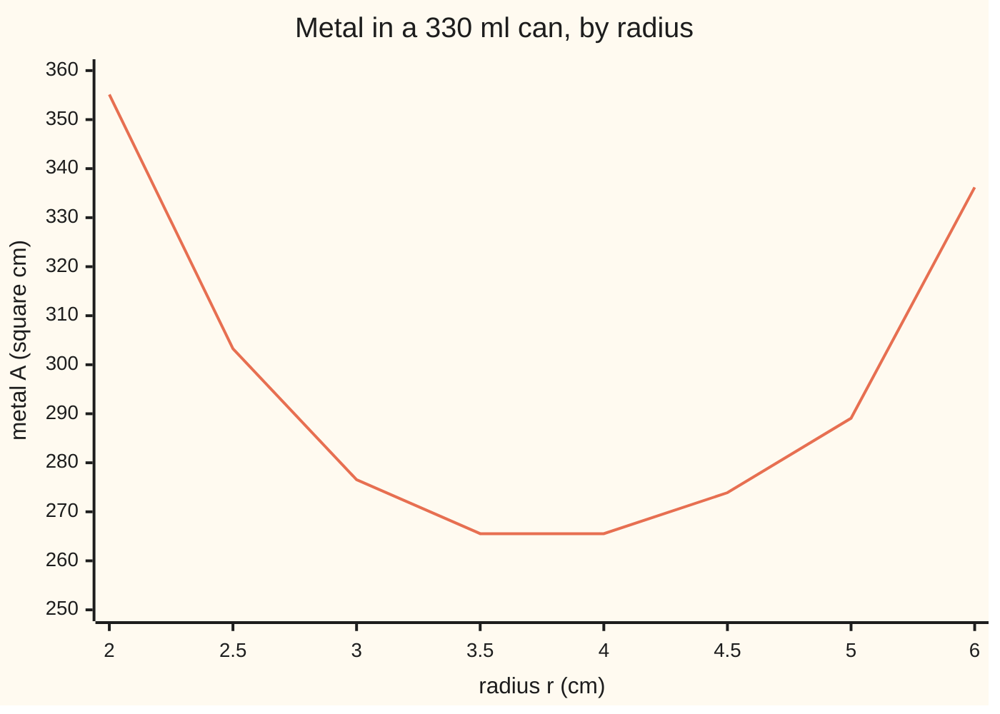
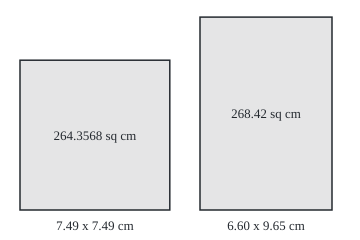

# Optimisation: where a function rises, where it falls, and where it peaks

[Syllabus](../../../SYLLABUS.md) → [Calculus and analysis](../README.md) → [What Derivatives Tell You](../README.md#s03) → Optimisation

---

## General Overview

A drinks maker fills 330 ml cans. Each is a closed cylinder: a wall and two lids, all metal. Which shape holds 330 ml with the least metal?

A flat can wastes metal on two huge lids; a thin one wastes it on a tall wall. Trying radii one by one never proves nothing better exists.

The derivative settles it. Where the rate of metal per centimetre of radius is negative, widening saves metal; where positive, it costs metal. The best radius sits where the sign flips: the best can is as tall as it is wide, using 264.3568 square cm of metal. If a factory line limits the width, the best can may sit at the limit instead, where the derivative is not zero.

**The sign of the derivative says where a function rises and where it falls; a best value sits where the sign flips or at an end of the allowed range, and comparing those few candidates finds it.**

**What kind of fact this is:** a theorem, proved on this card in Why it works from the mean value theorem; the candidate-and-compare recipe built on it is a method.

### The picture: metal against radius



The line is the metal A(r) at eight radii: falling, flat between 3.5 and 4 cm, then rising. The graph suggests; the argument proves.

---

## The formula

The radius $r$ runs from a lid's centre to its rim, in cm; the height $h$ is the wall's, in cm. The volume is fixed at $V$ = 330 cubic cm (330 ml), and a cylinder's volume is lid area times height, $\pi r^2 h$, so the radius pins the height:

$$h = \frac{V}{\pi r^2}$$

The metal is two lids plus the wall, which unrolls into a rectangle $2\pi r$ long and $h$ high:

$$A(r) = 2\pi r^2 + 2\pi r h = 2\pi r^2 + \frac{2V}{r}$$

**Read it aloud:** two lids, growing with the radius squared, plus a wall that shrinks as the can widens.

$$A'(r) = 4\pi r - \frac{2V}{r^2}, \qquad A''(r) = 4\pi + \frac{4V}{r^3}$$

**Read it aloud:** the rate of metal per cm of radius is the lids' growth minus the wall's saving; its own rate is always positive.

Three tests, for a function $f$ on an interval:

- **Sign test.** If $f'(x) > 0$ at every inside point, $f$ rises: $x_1 < x_2$ gives $f(x_1) < f(x_2)$. Negative slope, it falls.
- **First derivative test.** If the slope is negative just left of $c$ and positive just right, $c$ is a local minimum, lower than every nearby point. Reversed signs, a maximum.
- **Second derivative test.** If $f'(c) = 0$ and $f''(c) > 0$, $c$ is a local minimum; $f''(c) < 0$, a local maximum; $f''(c) = 0$, no verdict.

For a continuous $f$ on a closed interval from $a$ to $b$, the lowest and highest values sit among the candidates: points where $f'$ is zero or does not exist, and the ends $a$ and $b$.

| Symbol | Plain meaning | In our example | Push it up and the answer… |
| --- | --- | --- | --- |
| $r$ | radius, cm | best at 3.7449 | past 3.7449, more metal |
| $h$ | height, cm, fixed by the volume | 7.4899 at best | wider means shorter |
| $V$, $\pi$ | fixed volume, cubic cm; pi, rim over width | 330 | bigger can, same shape |
| $A(r)$ | metal used, square cm | 264.3568 at best | — |
| $A'(r)$ | metal per cm of radius, square cm per cm | -35.63 at r = 3, 23.96 at r = 4.5 | positive: widening costs |
| $A''(r)$ | rate of that rate, square cm per cm per cm | 37.70 at best | a sharper-bottomed curve |
| $f$, $f'$, $f''$ | any function, its slope, its slope's slope | A, A', A'' here | — |
| $a$, $b$, $c$, $s$, $x_1$, $x_2$ | interval ends; a candidate; two inputs; a small step | slot ends 2.5 and 3.3 cm | — |

### When it holds

- **An interval, no gaps.** On a domain with a hole, positive slope everywhere need not mean rising: -1/x, below.
- **A slope at every inside point, no jump at the ends.** A corner, like the bottom of a V, can be a minimum with no zero derivative: a candidate too.
- **Closed ends for a guaranteed best.** A continuous function on a closed interval reaches its lowest and highest values (the extreme value theorem); on an open range it may not.
- **A sign change, not just a zero.** Zero slope with one sign on both sides is a flat step, not a turn.

---

## Why it works

### Step 0: the mean value theorem turns a rate into a change

The [Mean value theorem](02-mean-value-theorem.md) says the average rate of change across a stretch equals the instant rate at some point inside. Facts about slopes become facts about values.

### Step 1: positive slope means rising

For inputs $x_1 < x_2$ in the interval, the mean value theorem gives a point $c$ between them with

$$f(x_2) - f(x_1) = f'(c)\,(x_2 - x_1)$$

The gap $x_2 - x_1$ is positive, and so is $f'(c)$, so $f(x_2) > f(x_1)$. Negative slope gives falling. "No gaps" is used here: $c$ must lie in the domain.

### Step 2: a sign flip makes a minimum

For the can, $A'(r) < 0$ exactly when $4\pi r < 2V/r^2$, that is when $r^3 < V/(2\pi)$ = 52.52. So the slope is negative below 3.7449 cm and positive above. By Step 1 the metal falls all the way to 3.7449 and rises after: a global minimum, lowest on the whole range. The first derivative test is Step 1 used on each side of $c$.

### Step 3: the second derivative reads the flip at one point

A positive second derivative at $c$ means the slope is rising through $c$. Zero at $c$ and rising, it is negative just left and positive just right: the flip of Step 2.

For the can, $A''(r)$ is positive at every radius. At the best one, $r^3 = V/(2\pi)$, so $4V/r^3 = 8\pi$ and $A'' = 12\pi$ = 37.70 square cm per cm per cm.

<details>
<summary>Detailed proof: the second derivative test</summary>

Suppose $f'(c) = 0$ and $f''(c) > 0$. $f''(c)$ is the limit of $\frac{f'(c+s)}{s}$ as the step $s$ shrinks to 0. Take the tolerance $\varepsilon = f''(c)/2$. There is a $\delta > 0$ such that $0 < |s| < \delta$ keeps that quotient within $\varepsilon$ of $f''(c)$, hence above $f''(c)/2 > 0$. So $f'(c+s)$ has the same sign as $s$: negative for $-\delta < s < 0$, positive for $0 < s < \delta$. Step 1 on each side gives $f(c+s) > f(c)$ for $0 < |s| < \delta$: a strict local minimum. With $f''(c) < 0$ every sign flips. With $f''(c) = 0$ nothing is fixed: $x^3$ and $x^4$ both occur.

</details>

### Step 4: height equals diameter

At the best radius, $4\pi r = 2V/r^2$, so $V = 2\pi r^3$. Into the height:

$$h = \frac{V}{\pi r^2} = \frac{2\pi r^3}{\pi r^2} = 2r$$

The height is the diameter. The volume dropped out: any closed can of uniform metal is best as tall as it is wide.

### Step 5: a restricted range, and why the ends matter

Suppose a filling line takes cans 5.0 to 6.6 cm across: radius $a$ = 2.5 to $b$ = 3.3 cm. Every radius there is below 3.7449, so the slope is negative throughout (-74.18 and -19.14 at the ends). The best allowed can is at the end $r$ = 3.3, with 268.42 square cm, where the slope is not zero: only checking the end finds it.

A second road, golden-section search, needs no derivative: it keeps an interval holding the lowest point and trims it each round by comparing two inside values, landing on the same 3.7449 cm. When $A'(r) = 0$ resists algebra, [Newton's method](06-newtons-method.md) solves it numerically.

---

## Worked numbers, by hand

| Step | Arithmetic | Value |
| --- | --- | --- |
| Slope zero | 4π r = 660 / r^2, so r^3 = 330 / (2π) | 52.52 |
| Best radius | cube root of 52.52 | 3.7449 cm |
| Height | 330 / (π × 3.7449^2) | 7.4899 cm, twice the radius |
| Slope signs | A'(3) and A'(4.5) | -35.63 and 23.96: a flip |
| Second derivative | 4π + 1320 / r^3 = 12π | 37.70, positive |
| Least metal | 2π × 3.7449^2 + 660 / 3.7449 | **264.3568 square cm** |
| Slot 2.5 to 3.3 cm | slope negative at both ends | best at 3.3: **268.42 square cm**, 1.54% more |

The best can is 7.49 cm wide and tall. Capped at 6.6 cm, it costs 1.54% more metal and stands 9.65 cm tall.

### The picture: the best can and the slot's best can

<p align="center"></p>

Scale: 20 units per cm, one base line. Left, the unrestricted best; right, the slot's best. Labels give width by height and metal used.

### What breaks if you drop a piece

| Mistake | Comes out at | What went wrong |
| --- | --- | --- |
| Solve A' = 0 and stop, on the slot | r = 3.7449, outside the slot | Ends unchecked; the best is r = 3.3, 268.42 square cm |
| Positive slope means rising, across a gap | f(x) = -1/x: slope 1.00 at -1 and 1, yet f(-1) = 1.00 > f(1) = -1.00 | 0 is not in the domain; Step 1 cannot cross it |
| Zero slope means a turn | x^3 has slope 0.00 at 0, but f(-0.1) = -0.001 and f(0.1) = 0.001 | No sign flip: it pauses, then keeps rising |
| Most metal on (0, infinity) | A(0.1) = 6600.06, A(0.01) = 66000.00 | An open range need not have a maximum |

The code prints all four.

---

## Code, from first principles, and it actually runs

Two roads to the best radius share no step: road 1 solves $A'(r) = 0$ by algebra, with a cube root built from exp and log; road 2, golden-section search, compares metal values only. Slopes are checked by a difference quotient, as on [Numerical derivatives](08-numerical-derivatives-and-sensitivity.md); a scan of 801 radii finds the slot's answer. Four asserts: the roads agree, height equals diameter, the slope formula matches the quotient and flips upward, the slot's best is its end.

### Python

```python
# Optimisation on the 330 ml can -- the check behind the card.  Standard library
# only.  Radius r in cm; the volume pins the height, h = 330 / (pi r^2), so the
# metal is A(r) = 2 pi r^2 + 660 / r square cm.  Road 1 solves A'(r) = 0 by
# algebra; road 2 hunts the lowest A by golden-section search, never using A'.
import math
PI, V = math.pi, 330.0
def A(r): return 2 * PI * r * r + 2 * V / r            # lids plus wall
def dA(r): return 4 * PI * r - 2 * V / (r * r)          # A'(r), by the power rule
def dq(f, r, s=1e-5): return (f(r + s) - f(r - s)) / (2 * s)   # own difference quotient
def golden(f, lo, hi):                                  # shrink [lo, hi] round the lowest f
    g = (math.sqrt(5) - 1) / 2
    for _ in range(80):
        a, b = hi - g * (hi - lo), lo + g * (hi - lo)
        if f(a) < f(b): hi = b
        else: lo = a
    return (lo + hi) / 2
r1 = math.exp(math.log(V / (2 * PI)) / 3)               # road 1: r^3 = 330 / (2 pi)
h1 = V / (PI * r1 * r1)
r2 = golden(A, 0.5, 20.0)                               # road 2: no derivative used
d2 = (A(r1 + 1e-3) - 2 * A(r1) + A(r1 - 1e-3)) / 1e-6  # A'' by a second difference
lo, hi = 2.5, 3.3                                       # a filling line takes 5.0 to 6.6 cm
scan = [lo + i * (hi - lo) / 800 for i in range(801)]
best = min(scan, key=A)
print("closed can, 330 ml: A(r) = 2*pi*r^2 + 660/r sq cm, r in cm")
print(f"road 1, solve A'(r) = 0: r^3 = {r1 ** 3:.2f}, r = {r1:.4f} cm, h = {h1:.4f} cm, h/(2r) = {h1 / (2 * r1):.4f}, A = {A(r1):.4f}")
print(f"road 2, golden-section search on A alone: r = {r2:.4f} cm, A = {A(r2):.4f}")
print(f"A' by formula at r = 3, 4.5: {dA(3):.2f}, {dA(4.5):.2f}; by difference quotient: {dq(A, 3):.2f}, {dq(A, 4.5):.2f}")
print(f"A'' at r = {r1:.4f}: formula 4*pi + 1320/r^3 = {4 * PI + 1320 / r1 ** 3:.2f}; second difference {d2:.2f}; 12*pi = {12 * PI:.2f}")
rs = [2, 2.5, 3, 3.5, 4, 4.5, 5, 6]
print("chart, r:", " ".join(f"{r}" for r in rs))
print("chart, A:", " ".join(f"{A(r):.2f}" for r in rs))
print(f"slot {2 * lo:.1f} to {2 * hi:.1f} cm across: A' at the ends {dA(lo):.2f}, {dA(hi):.2f}; stationary r = {r1:.4f} lies outside")
print(f"slot by scanning 801 radii: best r = {best:.4f}, A = {A(best):.2f}, h = {V / (PI * best * best):.2f} cm; extra metal {100 * (A(best) / A(r1) - 1):.2f}%")
print(f"figure, 20 units per cm, base y = 210: square can x 20 to {20 + 40 * r1:.1f}, top y {210 - 20 * h1:.1f}; slim can x 200 to {200 + 40 * hi:.1f}, top y {210 - 20 * V / (PI * hi * hi):.1f}")
print(f"figure, square can {2 * r1:.2f} x {h1:.2f} cm; slim can {2 * hi:.2f} x {V / (PI * hi * hi):.2f} cm")
g = lambda x: -1 / x
print(f"mistake 1, domain with a gap: f(x) = -1/x has f'(-1) = {dq(g, -1):.2f}, f'(1) = {dq(g, 1):.2f}, yet f(-1) = {g(-1):.2f} > f(1) = {g(1):.2f}")
c = lambda x: x ** 3
print(f"mistake 2, flat is not a turn: x^3 at 0 has slope {dq(c, 0):.2f}, f(-0.1) = {c(-0.1):.3f}, f(0.1) = {c(0.1):.3f}")
print(f"mistake 3, most metal on (0, infinity): A(0.1) = {A(0.1):.2f}, A(0.01) = {A(0.01):.2f}, no maximum")
assert abs(r2 - r1) < 1e-6                              # two roads, one radius
assert abs(V / (PI * r2 * r2) - 2 * r1) < 1e-5          # height equals diameter
assert abs(d2 - 12 * PI) < 1e-3 and all(abs(dA(r) - dq(A, r)) < 1e-6 for r in (3, 4.5)) and dA(3) < 0 < dA(4.5)  # slope formula right; it flips upward
assert abs(best - hi) < 1e-9 and A(best) > A(r2)        # the endpoint wins the slot
print("ALL CHECKS PASS")
```

**Ran 2026-09-27 on macOS, Python 3.14.6, standard library only. All checks passed. Output, pasted from the run:**

```
closed can, 330 ml: A(r) = 2*pi*r^2 + 660/r sq cm, r in cm
road 1, solve A'(r) = 0: r^3 = 52.52, r = 3.7449 cm, h = 7.4899 cm, h/(2r) = 1.0000, A = 264.3568
road 2, golden-section search on A alone: r = 3.7449 cm, A = 264.3568
A' by formula at r = 3, 4.5: -35.63, 23.96; by difference quotient: -35.63, 23.96
A'' at r = 3.7449: formula 4*pi + 1320/r^3 = 37.70; second difference 37.70; 12*pi = 37.70
chart, r: 2 2.5 3 3.5 4 4.5 5 6
chart, A: 355.13 303.27 276.55 265.54 265.53 273.90 289.08 336.19
slot 5.0 to 6.6 cm across: A' at the ends -74.18, -19.14; stationary r = 3.7449 lies outside
slot by scanning 801 radii: best r = 3.3000, A = 268.42, h = 9.65 cm; extra metal 1.54%
figure, 20 units per cm, base y = 210: square can x 20 to 169.8, top y 60.2; slim can x 200 to 332.0, top y 17.1
figure, square can 7.49 x 7.49 cm; slim can 6.60 x 9.65 cm
mistake 1, domain with a gap: f(x) = -1/x has f'(-1) = 1.00, f'(1) = 1.00, yet f(-1) = 1.00 > f(1) = -1.00
mistake 2, flat is not a turn: x^3 at 0 has slope 0.00, f(-0.1) = -0.001, f(0.1) = 0.001
mistake 3, most metal on (0, infinity): A(0.1) = 6600.06, A(0.01) = 66000.00, no maximum
ALL CHECKS PASS
```

### Rust

Same numbers, same labels, built with `rustc --edition 2021 -O`.

```rust
// Optimisation on the 330 ml can -- the same check as the Python, in Rust, std
// only.  Radius r in cm; the volume pins the height, h = 330 / (pi r^2), so the
// metal is A(r) = 2 pi r^2 + 660 / r square cm.  Road 1 solves A'(r) = 0 by
// algebra; road 2 hunts the lowest A by golden-section search, never using A'.
use std::f64::consts::PI;
const V: f64 = 330.0;
fn area(r: f64) -> f64 { 2.0 * PI * r * r + 2.0 * V / r }        // lids plus wall
fn d_area(r: f64) -> f64 { 4.0 * PI * r - 2.0 * V / (r * r) }    // A'(r), by the power rule
fn dq(f: &dyn Fn(f64) -> f64, r: f64) -> f64 {                   // own difference quotient
    let s = 1e-5;
    (f(r + s) - f(r - s)) / (2.0 * s)
}
fn golden(f: &dyn Fn(f64) -> f64, mut lo: f64, mut hi: f64) -> f64 {  // shrink round the lowest f
    let g = (5f64.sqrt() - 1.0) / 2.0;
    for _ in 0..80 {
        let (a, b) = (hi - g * (hi - lo), lo + g * (hi - lo));
        if f(a) < f(b) { hi = b } else { lo = a }
    }
    (lo + hi) / 2.0
}
fn main() {
    let a = |r: f64| area(r);
    let r1 = ((V / (2.0 * PI)).ln() / 3.0).exp();               // road 1: r^3 = 330 / (2 pi)
    let h1 = V / (PI * r1 * r1);
    let r2 = golden(&a, 0.5, 20.0);                              // road 2: no derivative used
    let d2 = (area(r1 + 1e-3) - 2.0 * area(r1) + area(r1 - 1e-3)) / 1e-6;  // A'' by a second difference
    let (lo, hi) = (2.5, 3.3);                                   // a filling line takes 5.0 to 6.6 cm
    let mut best = lo;
    for i in 0..801 {
        let r = lo + i as f64 * (hi - lo) / 800.0;
        if area(r) < area(best) { best = r }
    }
    println!("closed can, 330 ml: A(r) = 2*pi*r^2 + 660/r sq cm, r in cm");
    println!("road 1, solve A'(r) = 0: r^3 = {:.2}, r = {:.4} cm, h = {:.4} cm, h/(2r) = {:.4}, A = {:.4}", r1.powi(3), r1, h1, h1 / (2.0 * r1), area(r1));
    println!("road 2, golden-section search on A alone: r = {:.4} cm, A = {:.4}", r2, area(r2));
    println!("A' by formula at r = 3, 4.5: {:.2}, {:.2}; by difference quotient: {:.2}, {:.2}", d_area(3.0), d_area(4.5), dq(&a, 3.0), dq(&a, 4.5));
    println!("A'' at r = {:.4}: formula 4*pi + 1320/r^3 = {:.2}; second difference {:.2}; 12*pi = {:.2}", r1, 4.0 * PI + 1320.0 / r1.powi(3), d2, 12.0 * PI);
    let rs = [2.0, 2.5, 3.0, 3.5, 4.0, 4.5, 5.0, 6.0];
    println!("chart, r: {}", rs.iter().map(|r| format!("{}", r)).collect::<Vec<_>>().join(" "));
    println!("chart, A: {}", rs.iter().map(|&r| format!("{:.2}", area(r))).collect::<Vec<_>>().join(" "));
    println!("slot {:.1} to {:.1} cm across: A' at the ends {:.2}, {:.2}; stationary r = {:.4} lies outside", 2.0 * lo, 2.0 * hi, d_area(lo), d_area(hi), r1);
    println!("slot by scanning 801 radii: best r = {:.4}, A = {:.2}, h = {:.2} cm; extra metal {:.2}%", best, area(best), V / (PI * best * best), 100.0 * (area(best) / area(r1) - 1.0));
    println!("figure, 20 units per cm, base y = 210: square can x 20 to {:.1}, top y {:.1}; slim can x 200 to {:.1}, top y {:.1}", 20.0 + 40.0 * r1, 210.0 - 20.0 * h1, 200.0 + 40.0 * hi, 210.0 - 20.0 * V / (PI * hi * hi));
    println!("figure, square can {:.2} x {:.2} cm; slim can {:.2} x {:.2} cm", 2.0 * r1, h1, 2.0 * hi, V / (PI * hi * hi));
    let g = |x: f64| -1.0 / x;
    println!("mistake 1, domain with a gap: f(x) = -1/x has f'(-1) = {:.2}, f'(1) = {:.2}, yet f(-1) = {:.2} > f(1) = {:.2}", dq(&g, -1.0), dq(&g, 1.0), g(-1.0), g(1.0));
    let c = |x: f64| x * x * x;
    println!("mistake 2, flat is not a turn: x^3 at 0 has slope {:.2}, f(-0.1) = {:.3}, f(0.1) = {:.3}", dq(&c, 0.0), c(-0.1), c(0.1));
    println!("mistake 3, most metal on (0, infinity): A(0.1) = {:.2}, A(0.01) = {:.2}, no maximum", area(0.1), area(0.01));
    assert!((r2 - r1).abs() < 1e-6);                             // two roads, one radius
    assert!((V / (PI * r2 * r2) - 2.0 * r1).abs() < 1e-5);        // height equals diameter
    assert!((d2 - 12.0 * PI).abs() < 1e-3 && [3.0, 4.5].iter().all(|&r| (d_area(r) - dq(&a, r)).abs() < 1e-6) && d_area(3.0) < 0.0 && 0.0 < d_area(4.5));  // slope formula right; it flips upward
    assert!((best - hi).abs() < 1e-9 && area(best) > area(r2));   // the endpoint wins the slot
    println!("ALL CHECKS PASS");
}
```

**Ran 2026-09-27 on macOS, rustc 1.98.1, no crates. All checks passed. Output, pasted from the run:**

```
closed can, 330 ml: A(r) = 2*pi*r^2 + 660/r sq cm, r in cm
road 1, solve A'(r) = 0: r^3 = 52.52, r = 3.7449 cm, h = 7.4899 cm, h/(2r) = 1.0000, A = 264.3568
road 2, golden-section search on A alone: r = 3.7449 cm, A = 264.3568
A' by formula at r = 3, 4.5: -35.63, 23.96; by difference quotient: -35.63, 23.96
A'' at r = 3.7449: formula 4*pi + 1320/r^3 = 37.70; second difference 37.70; 12*pi = 37.70
chart, r: 2 2.5 3 3.5 4 4.5 5 6
chart, A: 355.13 303.27 276.55 265.54 265.53 273.90 289.08 336.19
slot 5.0 to 6.6 cm across: A' at the ends -74.18, -19.14; stationary r = 3.7449 lies outside
slot by scanning 801 radii: best r = 3.3000, A = 268.42, h = 9.65 cm; extra metal 1.54%
figure, 20 units per cm, base y = 210: square can x 20 to 169.8, top y 60.2; slim can x 200 to 332.0, top y 17.1
figure, square can 7.49 x 7.49 cm; slim can 6.60 x 9.65 cm
mistake 1, domain with a gap: f(x) = -1/x has f'(-1) = 1.00, f'(1) = 1.00, yet f(-1) = 1.00 > f(1) = -1.00
mistake 2, flat is not a turn: x^3 at 0 has slope 0.00, f(-0.1) = -0.001, f(0.1) = 0.001
mistake 3, most metal on (0, infinity): A(0.1) = 6600.06, A(0.01) = 66000.00, no maximum
ALL CHECKS PASS
```

> [!TIP]
> **Try changing**
> - **No top lid.** Guess first: taller or squatter? Change the lid term in `A` to `PI * r * r` and road 1's `V / (2 * PI)` to `V / PI`. Best height equals the radius, and the second assert fails: a cup is squat.
> - **Lids three times as costly as the wall.** Guess first. Use `6 * PI * r * r` in `A` and `V / (6 * PI)` in road 1. Best height is six radii, three widths: costly lids make cans slim.
> - **Change 330 to 500.** Guess first: does the shape change? No: the radius grows, the height still equals the diameter (Step 4).
> - **Widen the slot to 5.0 to 8.0 cm** (`hi` = 4.0). The radius 3.7449 now lies inside, the scan finds it, and the fourth assert fails.

---

## The usual mistake

> [!warning]
> **Treating "derivative equals zero" as the whole job.** A zero slope only nominates a candidate: a minimum, a maximum, or a flat step like x^3 at 0. On a restricted range the best often sits at an end, with slope not zero: -19.14 at the slot's edge.
>
> - **Differentiating before using the constraint.** Holding h fixed gives slope 4πr + 2πh, never zero. Replace h by 330 / (π r^2) first.
> - **Reading the second derivative as the verdict when it is zero.** x^3 and x^4 both have zero second derivative at 0; only x^4 has a minimum.

---

## Where you meet it in real life

- **Packaging.** Real cans are taller than wide: lids are commonly thicker metal, which pushes the best shape slim (Try changing), and hands cap the width.
- **Ordering stock.** Ordering cost and holding cost trade off like the can: one term grows with order size, one shrinks like one over it (Stock).
- **Fitting a model to data.** The best-fitting parameter sits where a derivative is zero; the second derivative says how sharply it is pinned ([Maximum likelihood](../../09-Probability%20and%20statistics/07-Sampling%20and%20Estimation/04-maximum-likelihood.md)).

> **Say it back**
> Positive slope across an interval means rising, negative means falling, by the mean value theorem. A minimum sits where the slope flips from negative to positive; a positive second derivative at zero slope guarantees the flip. Ends of a restricted range are candidates too. The 330 ml can uses least metal, 264.3568 square cm, when its height equals its diameter; held to 6.6 cm across, its best is the widest allowed.

---

## What this builds on

- [Mean value theorem](02-mean-value-theorem.md): the one move behind every test here, average rate equals an instant rate.
- [Second derivatives](../02-Derivatives/08-higher-derivatives-and-concavity.md): the second derivative, and bending upward read as a rising slope.

## Where this goes next

- [The Euler-Lagrange equation](../../08-Differential%20equations%20and%20dynamics/12-Calculus%20of%20Variations%20and%20Optimal%20Control/01-functionals-and-the-euler-lagrange-equation.md): the best whole curve, not the best single number.
- [Maximum likelihood](../../09-Probability%20and%20statistics/07-Sampling%20and%20Estimation/04-maximum-likelihood.md): the parameter making observed data most probable.
- Stock: the can's trade-off in a warehouse.

---

## Sources

Verified 2026-09-27: every link below resolves to the publisher's page.

- Strang, Gilbert, Edwin Herman, et al. *Calculus Volume 1*, OpenStax, 2016. [Section 4.3, Maxima and Minima](https://openstax.org/books/calculus-volume-1/pages/4-3-maxima-and-minima). Critical points and the closed-interval candidates.
- The same book, [Section 4.5, Derivatives and the Shape of a Graph](https://openstax.org/books/calculus-volume-1/pages/4-5-derivatives-and-the-shape-of-a-graph). The sign test and both derivative tests.
- The same book, [Section 4.7, Applied Optimization Problems](https://openstax.org/books/calculus-volume-1/pages/4-7-applied-optimization-problems). Using the constraint, checking the ends.
- Jerison, David. *18.01SC Single Variable Calculus*, MIT OpenCourseWare, Fall 2010. [Course page](https://ocw.mit.edu/courses/18-01sc-single-variable-calculus-fall-2010/). Lectures and problems on optimisation.
