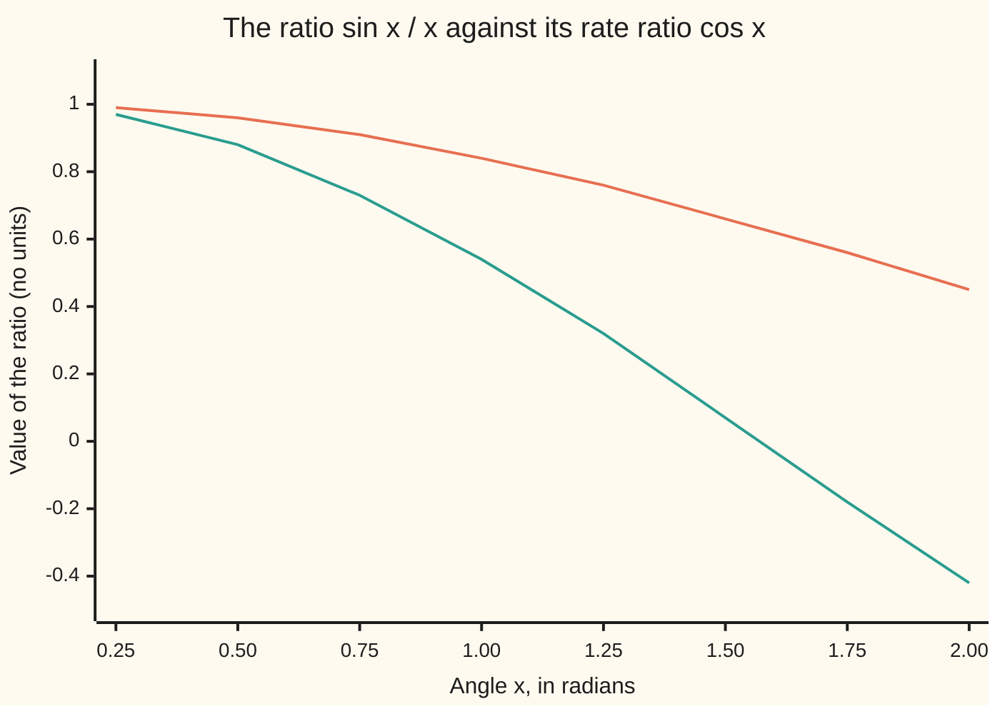

# L'Hopital's rule: limits of 0 over 0 and infinity over infinity, with the conditions that make it legal

Calculus and analysis → What Derivatives Tell You → Limits of ratios → L'Hopital's rule

---

## General Overview

Divide the sine of an angle by the angle, in radians. At 0.5 the ratio is 0.958851; at 0.1, 0.998334; at 0.01, 0.999983. At 0 it reads 0 over 0, which is no number. Which part vanishes faster?

A second race: multiply x by the shrinking factor e^(-x). At x = 5 the product is 0.033689735; at x = 10, 0.000453999. One factor grows, the other dies away. Which wins?

L'Hopital's rule settles both by comparing speeds instead of sizes.

**When a ratio reads 0 over 0 or infinity over infinity, replace top and bottom by their rates; if the new ratio settles on a limit, the old one settles on the same limit.**

**What kind of fact this is:** a theorem, proved on this card in Why it works; its use on other forms is a method.

### The picture: two different curves, one destination



Upper (orange) line: the ratio sin x / x. Lower (teal) line: the rate ratio cos x. They disagree everywhere shown, yet both climb toward 1 as x shrinks: agreement only at the limit.

---

## The formula

The limit notation from the limits card: lim (x → a) f(x) = L reads "f(x) heads for L as x heads for a". The rule, for a ratio of two functions:

$$\lim_{x \to a} \frac{f(x)}{g(x)} = \lim_{x \to a} \frac{f'(x)}{g'(x)} = L$$

**Read it aloud:** if top and bottom both head for 0, or both blow up, and the ratio of their rates heads for L, then the ratio itself heads for L.

The two limits agree; the two ratios need not agree anywhere. At x = 0.1 the ratio is 0.998334 and the rate ratio 0.995004.

| Symbol | Plain meaning | In our example | Push it up and the answer… |
| --- | --- | --- | --- |
| $x$ | the input, moving toward $a$ | 0.1 radians; then 10 | nearer $a$: nearer $L$, in both examples |
| $a$ | where $x$ heads: a number, or infinity | 0; infinity | — |
| $f$ | top of the ratio | sin x; then x | bigger ratio |
| $g$ | bottom of the ratio | x; then e^x | smaller ratio |
| $f'$, $g'$ | each one's rate, taken separately | cos x and 1; then 1 and e^x | their ratio is what the rule reads |
| $L$ | the limit both ratios share | 1; then 0 | — |
| $c$ | an in-between point where ratio and rate ratio agree exactly | 0.057729 when x = 0.1 | moves toward $a$ with $x$ |

Both rates are per unit of x, which cancels, so the rate ratio has the ratio's units; here, bare numbers.

### When it holds

- **The form is really 0 over 0 or infinity over infinity** (for the second, a bottom that blows up is enough). Fails: sin x / (x + 1) at 0 heads for 0, but the rates give 1.
- **Both functions have rates near a** (not necessarily at a), **and the bottom's rate is never 0 there.** The proof divides by it. Otto Stolz's pair, as x grows: f(x) = x + sin x cos x over g(x) = e^(sin x) f(x). The bottom's rate carries a factor cos x that keeps touching 0; cancel it and the rate ratio heads for 0, while the ratio e^(-sin x) swings between 1/e and e forever.
- **The rate ratio has a limit, or heads steadily for plus or minus infinity.** Fails: for (x + sin x)/x as x grows, the rate ratio 1 + cos x swings between 2 and 0. The rule is then silent, not negative: the ratio still heads for 1.

---

## Why it works

### Step 0: near a, both functions look like straight lines through zero

Close to 0, sin x is nearly the line through the origin with slope cos 0 = 1, and x is that line exactly ([linear-approximation-and-related-rates](01-linear-approximation-and-related-rates.md)). Two lines through one zero have heights in the ratio of their slopes. The work is making "nearly" exact, with no rate needed at a itself.

### Step 1: one shared in-between point

The mean value theorem ([mean-value-theorem](02-mean-value-theorem.md)) gives one function a point where its rate equals its average slope. On f and g separately it gives two different points; the rule needs one shared point, Cauchy's mean value theorem.

Set f(a) = g(a) = 0; since both head for 0, this makes both unbroken at a. Fix x near a and build a helper h(t) = f(t) g(x) − g(t) f(x), for t from a to x. At t = a both terms are 0; at t = x they cancel. So h starts and ends at 0, and Rolle's theorem (the equal-ends case of the mean value theorem) gives a point c between a and x where the rate of h is 0:

$$f'(c)\,g(x) = g'(c)\,f(x) \quad\text{so}\quad \frac{f(x)}{g(x)} = \frac{f'(c)}{g'(c)}$$

Dividing is legal: if g(x) were 0, Rolle would give g a zero rate between a and x, which is forbidden.

In numbers: at x = 0.1 the ratio is 0.998334, and cos c / 1 hits that value at c = 0.057729, between 0 and 0.1.

### Step 2: squeeze the point toward a

The point c is trapped between a and x, so as x heads for a, c is dragged along. The rate ratio at c heads for L, and the ratio at x equals it exactly.

The tolerance game in numbers: to land sin x / x within 0.001 of 1, it is enough, by Step 1, that cos c is. Now 1 − cos c = 2 sin^2(c/2), and sin t < t, so 1 − cos c is at most c^2/2, below 0.001 once c is below the square root of 0.002, about 0.0447 (cos 0.0447 = 0.9990002). Since c is smaller than x, every x within 0.0447 of 0 wins. At x = 0.0447 the ratio is 0.999667.

Where c sits is sharper than "between": at x = 0.01, c/x = 0.57735, which is 1/sqrt(3), because sin x / x falls from 1 like x^2/6 and cos c like c^2/2. Reading limits off such leading terms is the other route, done properly in [taylors-theorem](05-taylors-theorem.md).

<details>
<summary>Detailed proof</summary>

**0 over 0, from the right of a finite a.** Given ε > 0, pick δ > 0 with |f'(t)/g'(t) − L| < ε for all t in (a, a + δ). For x in that interval, Step 1 gives c in (a, x), so |f(x)/g(x) − L| = |f'(c)/g'(c) − L| < ε. The left side is the mirror image. For L = +∞, replace "within ε of L" by "above any bound B".

**x heading for infinity.** Put x = 1/t, t heading for 0 from the right. The chain rule multiplies both rates by −1/t^2, which cancels in the ratio.

**Infinity over infinity.** Let |g(x)| → ∞. Fix an anchor u near a where |f'/g' − L| < ε/4. For x nearer a, Cauchy's theorem from u to x gives q = (f(x) − f(u))/(g(x) − g(u)) with |q − L| < ε/4, and
f(x)/g(x) − L = (q − L)(1 − g(u)/g(x)) + (f(u) − L g(u))/g(x).
As |g(x)| grows, the bracket heads for 1 and the last term for 0: the total ends below ε.

</details>

### Step 3: infinity over infinity, on x e^(-x)

Rewrite the product x e^(-x) as the ratio x / e^x, where both parts blow up. The rates are 1 and e^x, never 0, and 1 / e^x heads for 0. The exponential outruns the line. It is below 0.001 once x passes 9.1180, and stays there, since its rate (1 − x) e^(-x) is negative for x above 1 ([monotonicity-and-optimisation](03-monotonicity-and-optimisation.md)).

### Step 4: rearrange the other forms first

The rule reads two shapes only; other stalemates are rearranged first.

| Form | What it looks like | Rearrangement |
| --- | --- | --- |
| 0 × infinity | x e^(-x) as x grows | move one factor to the bottom: x / e^x |
| infinity − infinity | 1/x − 1/sin x near 0 | one common bottom: (sin x − x)/(x sin x) |
| 1^infinity, 0^0, infinity^0 | a power whose base and exponent both move | take the natural log to get a product, then the first row |

Which factor goes downstairs matters. As e^(-x) / (1/x) the product is 0 over 0, but its rate ratio is x^2 e^(-x), 0.004540 at x = 10 against the original 0.000454: worse each round.

---

## Worked numbers, by hand

| Step | Arithmetic | Value |
| --- | --- | --- |
| form of sin x / x at 0 | top sin 0, bottom 0 | 0 over 0 |
| bottom's rate | rate of x | 1, never 0 |
| rate ratio | cos x / 1 | cos x |
| its limit | cos 0 | **1** |
| x e^(-x) as x grows, rearranged | 0 × infinity becomes x / e^x | infinity over infinity |
| rate ratio | 1 / e^x | 0.000045400 at x = 10 |
| its limit | 1 / e^x as x grows | **0** |

Near 0, sin x / x lands within any named tolerance of 1; x e^(-x) is below 0.001 for good once x passes 9.1180.

### What breaks if you drop a piece

| Mistake | Comes out at | What went wrong |
| --- | --- | --- |
| Rule on sin x / (x + 1), not 0 over 0 | rates 0.999950 at x = 0.01; ratio 0.009901 | the bottom heads for 1 |
| Quotient rule instead of two rates | −0.003333 at x = 0.01, heading for 0 | the rule takes top and bottom apart |
| Swinging rates, (x + sin x)/x | rate ratio 2.000000 at x = 62.8319, 0.000000 at 65.9734; ratio 1.000000 at both | no limit for the rate ratio: the rule is silent |
| Rearranged as e^(-x) / (1/x) | rate ratio 0.004540 at x = 10, against 0.000454 | each round multiplies in another x |

The code prints all four.

---

## Code, from first principles, and it actually runs

The checks import sin, cos, exp, sqrt and the constant pi only. Every rate is a central difference quotient, the change over a step of 0.00001 either side divided by the width. Road one computes each ratio near its limit. Road two computes the rate ratio from difference quotients, and a bisection (halving an interval until it pins a root) finds c and asserts the two agree there.

### Python

```python
# L'Hopital's rule -- the check behind the card.  math supplies sin, cos, exp
# and sqrt only; every rate comes from the card's own difference quotient.
# Example one: sin x / x as x heads for 0.  Example two: x e^(-x) as x heads
# for infinity, rearranged to x / e^x.
from math import sin, cos, exp, sqrt, pi

def rate(f, x, h=1e-5):                  # central difference quotient
    return (f(x + h) - f(x - h)) / (2 * h)

def ident(x):
    return x

def bisect(fun, lo, hi):                 # a root of fun between lo and hi
    for _ in range(200):
        mid = (lo + hi) / 2
        if (fun(lo) > 0) == (fun(mid) > 0):
            lo = mid
        else:
            hi = mid
    return (lo + hi) / 2

xs = [0.25 * k for k in range(1, 9)]
print("chart x:        ", " ".join(f"{x:.2f}" for x in xs))
print("chart sin x / x:", " ".join(f"{sin(x) / x:.2f}" for x in xs))
print("chart cos x:    ", " ".join(f"{cos(x):.2f}" for x in xs))
for x in (0.5, 0.1, 0.01):
    orig = sin(x) / x                                # road one: the ratio itself
    ratio = rate(sin, x) / rate(ident, x)            # road two: the two rates
    c = bisect(lambda t: cos(t) - orig, 0.0, x)      # Cauchy's shared point
    print(f"x={x}: sin x / x = {orig:.6f}, rate ratio = {ratio:.6f}, "
          f"c = {c:.6f}, c/x = {c / x:.5f}")
    assert cos(x) < orig < 1 and abs(orig - rate(sin, c) / rate(ident, c)) < 1e-8
print(f"c/x heads for 1/sqrt(3) = {1 / sqrt(3):.5f}")
assert abs(c / x - 1 / sqrt(3)) < 1e-4
tol = 0.001
d = sqrt(2 * tol)                                    # 1 - cos c <= c^2/2 < tol
print(f"tolerance {tol}: stay within {d:.4f} of 0; cos {d:.4f} = {cos(d):.7f}, "
      f"sin x / x there = {sin(d) / d:.6f}")
assert 1 - sin(d) / d < tol and 1 - cos(d) < tol
for x in (5, 10, 15):
    orig = x * exp(-x)
    ratio = rate(ident, x) / rate(exp, x)            # x / e^x, rates separately
    print(f"x={x}: x e^-x = {orig:.9f}, rate ratio 1/e^x = {ratio:.9f}")
    assert abs(ratio - exp(-x)) / exp(-x) < 1e-6
t = bisect(lambda x: x * exp(-x) - tol, 2.0, 20.0)
print(f"x e^-x stays below {tol} once x passes {t:.4f}")
x = 0.01
print(f"mistake, not 0/0: sin x/(x+1) at x={x} is {sin(x) / (x + 1):.6f}; "
      f"rates give {rate(sin, x) / rate(lambda u: u + 1, x):.6f}")
print(f"mistake, quotient rule: rate of sin x / x at x={x} is {rate(lambda u: sin(u) / u, x):.6f}")
for x in (20 * pi, 21 * pi):
    print(f"mistake, swinging rates: x={x:.4f}: (x + sin x)/x = {(x + sin(x)) / x:.6f}, "
          f"rate ratio = {round(rate(lambda u: u + sin(u), x), 6) + 0.0:.6f}")
x = 10
print(f"mistake, wrong rearrangement e^-x/(1/x) at x={x}: rate ratio = "
      f"{rate(lambda u: exp(-u), x) / rate(lambda u: 1 / u, x):.6f}, original {x * exp(-x):.6f}")
print("ALL CHECKS PASS")
```

**Ran 2026-09-27 on macOS, Python 3.14.6, standard library only. All checks passed. Output, pasted from the run:**

```
chart x:         0.25 0.50 0.75 1.00 1.25 1.50 1.75 2.00
chart sin x / x: 0.99 0.96 0.91 0.84 0.76 0.66 0.56 0.45
chart cos x:     0.97 0.88 0.73 0.54 0.32 0.07 -0.18 -0.42
x=0.5: sin x / x = 0.958851, rate ratio = 0.877583, c = 0.287869, c/x = 0.57574
x=0.1: sin x / x = 0.998334, rate ratio = 0.995004, c = 0.057729, c/x = 0.57729
x=0.01: sin x / x = 0.999983, rate ratio = 0.999950, c = 0.005773, c/x = 0.57735
c/x heads for 1/sqrt(3) = 0.57735
tolerance 0.001: stay within 0.0447 of 0; cos 0.0447 = 0.9990002, sin x / x there = 0.999667
x=5: x e^-x = 0.033689735, rate ratio 1/e^x = 0.006737947
x=10: x e^-x = 0.000453999, rate ratio 1/e^x = 0.000045400
x=15: x e^-x = 0.000004589, rate ratio 1/e^x = 0.000000306
x e^-x stays below 0.001 once x passes 9.1180
mistake, not 0/0: sin x/(x+1) at x=0.01 is 0.009901; rates give 0.999950
mistake, quotient rule: rate of sin x / x at x=0.01 is -0.003333
mistake, swinging rates: x=62.8319: (x + sin x)/x = 1.000000, rate ratio = 2.000000
mistake, swinging rates: x=65.9734: (x + sin x)/x = 1.000000, rate ratio = 0.000000
mistake, wrong rearrangement e^-x/(1/x) at x=10: rate ratio = 0.004540, original 0.000454
ALL CHECKS PASS
```

### Rust

Same numbers, same labels, built with `rustc --edition 2021 -O`.

```rust
// L'Hopital's rule -- the same check as the Python, in Rust.  No crates.  std
// supplies sin, cos, exp and sqrt only; every rate comes from the card's own
// difference quotient.  Example one: sin x / x as x heads for 0.  Example two:
// x e^(-x) as x heads for infinity, rearranged to x / e^x.
use std::f64::consts::PI;

fn rate(f: &dyn Fn(f64) -> f64, x: f64) -> f64 {
    let h = 1e-5; // central difference quotient
    (f(x + h) - f(x - h)) / (2.0 * h)
}

fn bisect(fun: &dyn Fn(f64) -> f64, mut lo: f64, mut hi: f64) -> f64 {
    for _ in 0..200 {
        let mid = (lo + hi) / 2.0;
        if (fun(lo) > 0.0) == (fun(mid) > 0.0) { lo = mid; } else { hi = mid; }
    }
    (lo + hi) / 2.0
}

fn row(label: &str, vals: &[f64]) {
    let s: Vec<String> = vals.iter().map(|v| format!("{:.2}", v)).collect();
    println!("{}{}", label, s.join(" "));
}

fn main() {
    let ident = |x: f64| x;
    let xs: Vec<f64> = (1..9).map(|k| 0.25 * k as f64).collect();
    row("chart x:         ", &xs);
    row("chart sin x / x: ", &xs.iter().map(|x| x.sin() / x).collect::<Vec<f64>>());
    row("chart cos x:     ", &xs.iter().map(|x| x.cos()).collect::<Vec<f64>>());
    let mut last = (0.0, 0.0);
    for &x in &[0.5f64, 0.1, 0.01] {
        let orig = x.sin() / x; // road one: the ratio itself
        let ratio = rate(&|u: f64| u.sin(), x) / rate(&ident, x); // road two: the two rates
        let c = bisect(&|t: f64| t.cos() - orig, 0.0, x); // Cauchy's shared point
        println!("x={}: sin x / x = {:.6}, rate ratio = {:.6}, c = {:.6}, c/x = {:.5}",
                 x, orig, ratio, c, c / x);
        assert!(x.cos() < orig && orig < 1.0
                && (orig - rate(&|u: f64| u.sin(), c) / rate(&ident, c)).abs() < 1e-8);
        last = (c, x);
    }
    println!("c/x heads for 1/sqrt(3) = {:.5}", 1.0 / 3f64.sqrt());
    assert!((last.0 / last.1 - 1.0 / 3f64.sqrt()).abs() < 1e-4);
    let tol: f64 = 0.001;
    let d = (2.0 * tol).sqrt(); // 1 - cos c <= c^2/2 < tol
    println!("tolerance {}: stay within {:.4} of 0; cos {:.4} = {:.7}, sin x / x there = {:.6}",
             tol, d, d, d.cos(), d.sin() / d);
    assert!(1.0 - d.sin() / d < tol && 1.0 - d.cos() < tol);
    for &x in &[5.0f64, 10.0, 15.0] {
        let orig = x * (-x).exp();
        let ratio = rate(&ident, x) / rate(&|u: f64| u.exp(), x); // x / e^x, rates separately
        println!("x={}: x e^-x = {:.9}, rate ratio 1/e^x = {:.9}", x, orig, ratio);
        assert!((ratio - (-x).exp()).abs() / (-x).exp() < 1e-6);
    }
    let t = bisect(&|x: f64| x * (-x).exp() - tol, 2.0, 20.0);
    println!("x e^-x stays below {} once x passes {:.4}", tol, t);
    let x = 0.01f64;
    println!("mistake, not 0/0: sin x/(x+1) at x={} is {:.6}; rates give {:.6}", x,
             x.sin() / (x + 1.0), rate(&|u: f64| u.sin(), x) / rate(&|u: f64| u + 1.0, x));
    println!("mistake, quotient rule: rate of sin x / x at x={} is {:.6}",
             x, rate(&|u: f64| u.sin() / u, x));
    for &x in &[20.0 * PI, 21.0 * PI] {
        let r = (rate(&|u: f64| u + u.sin(), x) * 1e6).round() / 1e6 + 0.0;
        println!("mistake, swinging rates: x={:.4}: (x + sin x)/x = {:.6}, rate ratio = {:.6}",
                 x, (x + x.sin()) / x, r);
    }
    let x = 10.0f64;
    println!("mistake, wrong rearrangement e^-x/(1/x) at x={}: rate ratio = {:.6}, original {:.6}",
             x, rate(&|u: f64| (-u).exp(), x) / rate(&|u: f64| 1.0 / u, x), x * (-x).exp());
    println!("ALL CHECKS PASS");
}
```

**Ran 2026-09-27 on macOS, rustc 1.98.1, no crates. All checks passed. Output, pasted from the run:**

```
chart x:         0.25 0.50 0.75 1.00 1.25 1.50 1.75 2.00
chart sin x / x: 0.99 0.96 0.91 0.84 0.76 0.66 0.56 0.45
chart cos x:     0.97 0.88 0.73 0.54 0.32 0.07 -0.18 -0.42
x=0.5: sin x / x = 0.958851, rate ratio = 0.877583, c = 0.287869, c/x = 0.57574
x=0.1: sin x / x = 0.998334, rate ratio = 0.995004, c = 0.057729, c/x = 0.57729
x=0.01: sin x / x = 0.999983, rate ratio = 0.999950, c = 0.005773, c/x = 0.57735
c/x heads for 1/sqrt(3) = 0.57735
tolerance 0.001: stay within 0.0447 of 0; cos 0.0447 = 0.9990002, sin x / x there = 0.999667
x=5: x e^-x = 0.033689735, rate ratio 1/e^x = 0.006737947
x=10: x e^-x = 0.000453999, rate ratio 1/e^x = 0.000045400
x=15: x e^-x = 0.000004589, rate ratio 1/e^x = 0.000000306
x e^-x stays below 0.001 once x passes 9.1180
mistake, not 0/0: sin x/(x+1) at x=0.01 is 0.009901; rates give 0.999950
mistake, quotient rule: rate of sin x / x at x=0.01 is -0.003333
mistake, swinging rates: x=62.8319: (x + sin x)/x = 1.000000, rate ratio = 2.000000
mistake, swinging rates: x=65.9734: (x + sin x)/x = 1.000000, rate ratio = 0.000000
mistake, wrong rearrangement e^-x/(1/x) at x=10: rate ratio = 0.004540, original 0.000454
ALL CHECKS PASS
```

> [!TIP]
> **Try changing**
> - **Guess first:** set the tolerance to 0.0001. Does the safe distance shrink ten times? No: it is the square root of twice the tolerance, so it shrinks by the square root of ten.
> - **Guess first:** replace x e^(-x) by x^3 e^(-x). New limit? Still 0, but the rule runs three times, and the 0.001 threshold moves further out.

---

## The usual mistake

> [!warning]
> **Differentiating before checking the form.** On sin x / (x + 1) at 0 the rule returns 1 while the ratio heads for 0, because the bottom never headed for 0. Check the form every time, including before each repeat.
>
> - **Reading silence as "no limit".** For (x + sin x)/x the rate ratio swings between 2 and 0, yet the ratio heads for 1 by the squeeze 1 − 1/x ≤ (x + sin x)/x ≤ 1 + 1/x.
> - **Circular use.** The rate of sin was built from sin x / x → 1, so the rule here is a second route, a consistency check. The first proof is the squeeze cos x < sin x / x < 1, from sin x < x < tan x.

---

## Where you meet it in real life

- **Small angles.** Pendulum clocks and optics replace sin x by x in radians; sin x / x → 1 is the licence, and Step 2 says how small is small.
- **Growth races.** An exponential beats any power, so an algorithm costing 2^n steps loses to one costing n^3 once n is large.
- **A dose that rises and fades.** In the simplest model with equal absorption and elimination rates, a drug level after one oral dose has the shape x e^(-x): a peak, then a fade to 0.

> **Say it back**
> When a ratio reads 0 over 0 or infinity over infinity, compare the rates of top and bottom. If the bottom's rate stays off 0 and the rate ratio has a limit, the ratio has it too. Cauchy's mean value theorem gives one in-between point where the two agree, dragged to the limit. Products, differences and powers are rearranged first. A rate ratio with no limit proves nothing.

---

## What this builds on

- [mean-value-theorem](02-mean-value-theorem.md): Rolle's theorem, applied to the helper h, yields Cauchy's shared in-between point.

## Where this goes next

- [taylors-theorem](05-taylors-theorem.md): limits read off leading terms, and the 1/sqrt(3) of Step 2 explained.
- [numerical-derivatives-and-sensitivity](08-numerical-derivatives-and-sensitivity.md): the difference quotient as a 0 over 0 form, with its error measured.

---

## Sources

Verified 2026-09-27: every link below resolves to the publisher's page.

- Strang, Gilbert, Edwin Herman, et al. *Calculus Volume 1*, OpenStax, 2016. [Section 4.8, L'Hôpital's Rule](https://openstax.org/books/calculus-volume-1/pages/4-8-lhopitals-rule). Both forms and the rearranged ones.
- Lebl, Jiří. *Basic Analysis I: Introduction to Real Analysis*. [Section 4.2, Mean value theorem](https://www.jirka.org/ra/html/sec_mvt.html). Cauchy's mean value theorem (Theorem 4.2.5); the rule with the nonzero-rate condition is Exercise 4.2.9.
- O'Connor, J. J., and E. F. Robertson. "Guillaume de l'Hôpital." MacTutor Archive, University of St Andrews. [Biography](https://mathshistory.st-andrews.ac.uk/Biographies/De_LHopital/). The rule in his 1696 book, and Johann Bernoulli's part in it.
