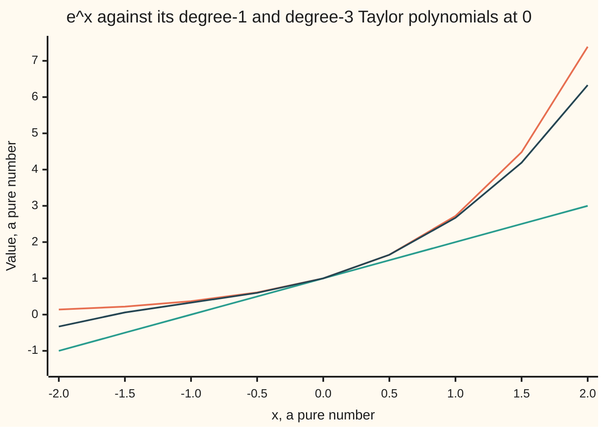

# Taylor's theorem: the best polynomial stand-in and a bound on its error

[Syllabus](../../../SYLLABUS.md) → [Calculus and analysis](../README.md) → [What Derivatives Tell You](../README.md#s03) → Taylor's theorem

---

## General Overview

A chip with no exponential button must still produce e^0.1, the growth factor of one year at 10% compounded continuously. It can only add, subtract, multiply and divide, so it needs a polynomial: a sum of powers of 0.1 with fixed coefficients.

Four terms give 1 + 0.1 + 0.005 + 0.000166667 = 1.105166667. The true value is 1.105170918, so the four terms alone are wrong in the sixth decimal. But the theorem that builds them also says how much they leave out, and from which side. That catches e^0.1 in a window from 1.105170833 to 1.105171272, and both ends round to 1.105171.

The polynomial copies the function's value, slope, bend and higher rates of change at one point. The gap it leaves is the **remainder**, the word used from here on.

**Match a function's value and first n derivatives at one point and a polynomial of degree n follows; what it misses is the next term with the next derivative read somewhere between the anchor and the target, so bounding that derivative bounds the error.**

**What kind of fact this is:** a theorem, proved on this card in Why it works; the polynomial itself is a definition.

### The picture: e^x and two of its stand-ins



Orange is e^x, green the tangent line 1 + x, dark the degree-3 stand-in. All three meet at 0 and part as x moves away; at x = 0.1 no drawing separates them, so the error needs a theorem.

---

## The formula

Notation first, in words. The k-th derivative of f, the rate of change taken k times over, is written $f^{(k)}$; the brackets keep it from reading as a power, and $f^{(0)}$ is f itself ([Second derivatives](../02-Derivatives/08-higher-derivatives-and-concavity.md)). The factorial k! is 1 × 2 × … × k, with 0! = 1.

The **Taylor polynomial of degree n** of f at the anchor a:

$$P_n(x) = \sum_{k=0}^{n} \frac{f^{(k)}(a)}{k!}\,(x-a)^k$$

**Read it aloud:** the value at the anchor, plus each derivative at the anchor times the step to the k-th power, over k factorial.

**Taylor's theorem, Lagrange's form of the remainder:** for each x other than a there is a point $\xi$ (the Greek letter xi) strictly between a and x with

$$f(x) = P_n(x) + R_n(x), \qquad R_n(x) = \frac{f^{(n+1)}(\xi)}{(n+1)!}\,h^{n+1}, \quad h = x - a$$

**Read it aloud:** the function is its polynomial plus one more term, whose derivative is read somewhere between anchor and target instead of at the anchor.

So if $\lvert f^{(n+1)}\rvert \le M$ everywhere between a and x, then $\lvert R_n(x)\rvert \le M\,\lvert h\rvert^{n+1}/(n+1)!$.

| Symbol | Plain meaning | In our example | Push it up and the answer… |
| --- | --- | --- | --- |
| $f$, $x$, $a$ | the function, the target, the anchor | e^x, 0.1, 0 | a farther target needs more terms |
| $h$ | the step x − a | 0.1 | error grows like h to the power n + 1 |
| $n$, $k$ | degree kept; counter from 0 to n | n = 3, four terms | error shrinks near the anchor |
| $f^{(k)}$ | the k-th derivative | always e^x | bigger coefficients |
| $P_n$ | the Taylor polynomial | 1.105166667 | nears the truth, near the anchor |
| $R_n$ | the remainder, f minus the polynomial | 0.000004251 | what the theorem pins down |
| $\xi$ | the point where the next derivative is read | 0.020134, found afterwards | anywhere between 0 and 0.1 |
| $M$ | a ceiling on the next derivative between a and x | e^0.1, bounded without its value | a looser ceiling gives a wider, still true, window |

### When it holds

- **f has n + 1 derivatives strictly between a and x, the n-th continuous up to both ends.** Drop this and the remainder need not look like a next term: the corner function in What breaks has remainder 0.1 and second derivative 0 wherever one exists.
- **The ceiling covers the whole stretch.** A ceiling read at the anchor alone put a false ceiling on e^0.1, below the truth.
- **Not a hypothesis: a small step.** The theorem holds at any x, but far from the anchor the bound is loose: at x = −2 the cubic reads −0.33 where e^x is 0.14.
- **Not covered: n running forever.** Whether the terms summed forever give back f is for [Taylor series](../06-Series/05-taylor-series.md).

---

## Why it works

### Step 0: match more rates of change and the copy stays close longer

A tangent line matches value and slope, then drifts as the curve bends ([Linear approximation](01-linear-approximation-and-related-rates.md)). Match the bend too and the drift starts later. Each matched derivative removes one more power of the step from the error.

### Step 1: the factorials make the derivatives match

Differentiate $(x-a)^k$ k times and it becomes the constant k!: 3 × 2 × 1 = 6 for the cube. Fewer times and a factor of (x − a) survives, which is 0 at the anchor; more times and it is 0 everywhere. So at the anchor the k-th derivative of $P_n$ sees only the k-th term, which gives its coefficient times k!. To equal $f^{(k)}(a)$ the coefficient must be $f^{(k)}(a)/k!$, and no other polynomial of degree n matches all n + 1 derivatives.

For e^x at 0 every derivative is 1, so the coefficients are 1/k! and $P_3(0.1)$ = 1 + 0.1 + 0.005 + 0.000166667.

### Step 2: the remainder is the next term, read somewhere in between

For n = 0 the claim is $f(x) = f(a) + f'(\xi)h$: the mean value theorem ([Mean value theorem](02-mean-value-theorem.md)). Taylor's theorem pushes it up n rungs.

The proof in words: freeze the target x and slide the anchor to t. Measure how far the polynomial anchored at t falls short of f(x), less one extra next-power term whose constant makes the total 0 at t = a. It is also 0 at t = x. Rolle's theorem gives a flat point between; differentiated, the sum cancels in pairs, and the flat point forces the constant to be $f^{(n+1)}(\xi)$.

<details>
<summary>Detailed proof</summary>

Fix $x \ne a$ and choose K with $R_n(x) = K h^{n+1}/(n+1)!$. For t between a and x let

$$g(t) = f(x) - \sum_{k=0}^{n} \frac{f^{(k)}(t)}{k!}(x-t)^k - K\frac{(x-t)^{n+1}}{(n+1)!}.$$

Then $g(a) = 0$ by the choice of K, and $g(x) = 0$ since every power of $(x - t)$ vanishes. The hypotheses make g continuous on the closed stretch and differentiable inside, so Rolle gives $\xi$ strictly between with $g'(\xi) = 0$. By the product rule the k-th term differentiates to $\frac{f^{(k+1)}(t)}{k!}(x-t)^k - \frac{f^{(k)}(t)}{(k-1)!}(x-t)^{k-1}$ (second part absent for k = 0); summed, each second part cancels the previous first part, leaving

$$g'(t) = \frac{(x-t)^n}{n!}\left(K - f^{(n+1)}(t)\right).$$

At $t = \xi$, where $x - \xi \ne 0$, this gives $K = f^{(n+1)}(\xi)$. For any tolerance $\varepsilon > 0$, a step with $M\lvert h\rvert^{n+1}/(n+1)! < \varepsilon$ then guarantees $\lvert f(x) - P_n(x)\rvert < \varepsilon$. ∎

</details>

### Step 3: for e^0.1 the remainder is bounded from both sides

With n = 3 the remainder is $e^{\xi}$ × 0.1^4/24, and 0.1^4/24 = 0.000004167. As $\xi$ lies between 0 and 0.1 and e^x climbs, $e^{\xi}$ is between 1 and e^0.1.

Low side: the remainder is at least 0.000004167, so e^0.1 is at least 1.105170833. High side, the unknown used against itself: e^0.1 is at most 1.105166667 + e^0.1 × 0.000004167. Collect the e^0.1 terms and divide: e^0.1 is at most 1.105166667 / (1 − 0.000004167) = 1.105171272. No value of e was needed.

### Step 4: halve the step, divide the error by 16

The degree-3 remainder carries the fourth power of the step, so halving the step should divide the error by about 2 × 2 × 2 × 2. At steps 0.2, 0.1 and 0.05 the errors are 0.000069425, 0.000004251 and 0.000000263: ratios 16.33 and 16.16, closing on 16 as $\xi$ is squeezed towards 0.

The theorem only says $\xi$ exists. With the true e^0.1 in hand, solving $e^{\xi}$ × 0.000004167 = 0.000004251 gives $\xi$ = 0.020134, inside the stretch.

A second route writes the remainder as an integral, by integrating by parts n times; Error bounds and Romberg leans on that form.

---

## Worked numbers, by hand

| Step | Arithmetic | Value |
| --- | --- | --- |
| degree 0 and 1 terms | 1, then 0.1 / 1! | 1 and 0.1 |
| degree 2 term | 0.1^2 / 2! | 0.005 |
| degree 3 term | 0.1^3 / 3! | 0.000166667 |
| four terms | 1 + 0.1 + 0.005 + 0.000166667 | 1.105166667 |
| remainder factor | 0.1^4 / 4! | 0.000004167 |
| low end | 1.105166667 + 0.000004167 | 1.105170833 |
| high end | 1.105166667 / (1 − 0.000004167) | 1.105171272 |
| both ends rounded | six decimals | **1.105171** |

A road with no series gives 1.105170918, inside the window. One year at 10% compounded continuously multiplies money by 1.105171.

### What breaks if you drop a piece

| Mistake | Comes out at | What went wrong |
| --- | --- | --- |
| No factorials: 1 + 0.1 + 0.01 + 0.001 | 1.111, off by 0.005829082 | coefficients are derivatives over k! |
| Ceiling read at the anchor, e^ξ at most 1 | ceiling 1.105170833, below the truth 1.105170918 | $\xi$ can be anywhere up to 0.1 |
| Four terms, no remainder | 1.105167 against 1.105171 | the polynomial misses 0.000004251 |
| Corner \|x − 0.05\|, anchor 0, n = 1 | remainder 0.1; Lagrange needs f″ = 20, but f″ is 0 wherever it exists | no second derivative at 0.05, so no ξ |

The corner function has slope −1.00 at 0, so its tangent line reads −0.05 at 0.1 where the function is 0.05.

---

## Code, from first principles, and it actually runs

Two roads share no arithmetic. Road one sums four Taylor terms and builds the Lagrange window. Road two uses no series: the natural log as the area under 1/t (a fact the Integrals shelf proves), summed by Simpson's rule and inverted by bisection. The asserts check that the window traps road two, that $\xi$ lies between 0 and 0.1, that both agree to six decimals, and that halving the step divides the error by 16 to within 1.

### Python

```python
# Taylor's theorem -- the check behind the card.  Nothing is imported.
# Road 1: four Taylor terms for e^0.1 plus the Lagrange remainder, which pins
# e^0.1 inside an interval.  Road 2: e^x found with no series at all, by
# bisection on ln y = x, with ln y built as a Simpson sum of the area under 1/t.

def ln(y, n=2000):                        # area under 1/t from 1 to y, Simpson
    h = (y - 1) / n
    s = 1 + 1 / y + sum((4 if k % 2 else 2) / (1 + k * h) for k in range(1, n))
    return s * h / 3

def exp2(x):                              # road 2: the y whose ln is x
    lo, hi = 0.01, 10.0
    for _ in range(60):
        mid = (lo + hi) / 2
        lo, hi = (mid, hi) if ln(mid) < x else (lo, mid)
    return (lo + hi) / 2

def taylor(x, n):                         # road 1: sum of x^k / k!, k = 0..n
    term, total = 1.0, 1.0
    for k in range(1, n + 1):
        term = term * x / k
        total += term
    return total

h = 0.1
p3 = taylor(h, 3)
q = h ** 4 / 24                           # the remainder is e^xi times q
low, high = p3 + q, p3 / (1 - q)          # e^xi >= 1, and e^xi <= e^0.1 solved
e01 = exp2(h)
xi = ln(24 * (e01 - p3) / h ** 4)         # the point Lagrange promises
errs = [exp2(t) - taylor(t, 3) for t in (0.2, 0.1, 0.05)]
p4, r4 = taylor(h, 4), h ** 5 / 120 * high  # next term, e^xi at most high
xs = [-2 + 0.5 * i for i in range(9)]
f = lambda t: abs(t - 0.05)               # a corner inside the interval
d2 = [round((f(t + 0.01) - 2 * f(t) + f(t - 0.01)) / 0.0001, 3) + 0.0 for t in (0.02, 0.08)]
print(f"four terms 1, 0.1, 0.005, {h**3/6:.9f}: P3(0.1) = {p3:.9f}")
print(f"remainder = e^xi x {q:.9f}, so between {q:.9f} and {high - p3:.9f}")
print(f"road 1: e^0.1 in [{low:.9f}, {high:.9f}], ends round to {low:.6f}, {high:.6f}")
print(f"road 2, ln by Simpson then bisection: e^0.1 = {e01:.9f}, rounds to {e01:.6f}")
print(f"true remainder {e01 - p3:.9f}; Lagrange point xi = {xi:.6f}")
print(f"five terms: P4(0.1) = {p4:.9f}, remainder under {r4:.9f}")
print("degree-3 error at h = 0.2, 0.1, 0.05: " + ", ".join(f"{e:.9f}" for e in errs))
print(f"halving h divides it by {errs[0]/errs[1]:.2f}, then {errs[1]/errs[2]:.2f}")
print("chart x: " + ", ".join(f"{t:.1f}" for t in xs))
print("chart e^x: " + ", ".join(f"{exp2(t):.2f}" for t in xs))
print("chart P1: " + ", ".join(f"{taylor(t, 1):.2f}" for t in xs))
print("chart P3: " + ", ".join(f"{taylor(t, 3):.2f}" for t in xs))
nf = sum(h ** k for k in range(4))            # the k! left out
print(f"mistake 1, no factorials: 1 + 0.1 + 0.01 + 0.001 = {nf:.9f}, off by {nf - e01:.9f}")
print(f"mistake 2, e^xi bounded by 1: ceiling {p3 + q:.9f}, below the truth {e01:.9f}")
print(f"mistake 3, four terms, no remainder: {p3:.6f} against {e01:.6f}")
print(f"corner |x - 0.05|: slope at 0 = {(f(1e-6) - f(-1e-6)) / 2e-6:.2f}, P1(0.1) = {f(0) - h:.2f}, f(0.1) = {f(h):.2f}, "
      f"Lagrange needs f'' = {2 * (f(h) - f(0) + h) / h**2:.1f}; f'' at 0.02, 0.08: {d2[0]:.1f}, {d2[1]:.1f}")
assert low <= e01 <= high and p4 < e01 < p4 + r4        # road 1 traps road 2
assert 0 < xi < h                                        # the point lies between 0 and 0.1
assert f"{low:.6f}" == f"{high:.6f}" == f"{e01:.6f}"     # six decimals, both roads
assert all(abs(errs[i] / errs[i + 1] - 16) < 1 for i in range(2))
print("ALL CHECKS PASS")
```

**Ran 2026-09-27 on macOS, Python 3.14.6, standard library only. All checks passed. Output, pasted from the run:**

```
four terms 1, 0.1, 0.005, 0.000166667: P3(0.1) = 1.105166667
remainder = e^xi x 0.000004167, so between 0.000004167 and 0.000004605
road 1: e^0.1 in [1.105170833, 1.105171272], ends round to 1.105171, 1.105171
road 2, ln by Simpson then bisection: e^0.1 = 1.105170918, rounds to 1.105171
true remainder 0.000004251; Lagrange point xi = 0.020134
five terms: P4(0.1) = 1.105170833, remainder under 0.000000092
degree-3 error at h = 0.2, 0.1, 0.05: 0.000069425, 0.000004251, 0.000000263
halving h divides it by 16.33, then 16.16
chart x: -2.0, -1.5, -1.0, -0.5, 0.0, 0.5, 1.0, 1.5, 2.0
chart e^x: 0.14, 0.22, 0.37, 0.61, 1.00, 1.65, 2.72, 4.48, 7.39
chart P1: -1.00, -0.50, 0.00, 0.50, 1.00, 1.50, 2.00, 2.50, 3.00
chart P3: -0.33, 0.06, 0.33, 0.60, 1.00, 1.65, 2.67, 4.19, 6.33
mistake 1, no factorials: 1 + 0.1 + 0.01 + 0.001 = 1.111000000, off by 0.005829082
mistake 2, e^xi bounded by 1: ceiling 1.105170833, below the truth 1.105170918
mistake 3, four terms, no remainder: 1.105167 against 1.105171
corner |x - 0.05|: slope at 0 = -1.00, P1(0.1) = -0.05, f(0.1) = 0.05, Lagrange needs f'' = 20.0; f'' at 0.02, 0.08: 0.0, 0.0
ALL CHECKS PASS
```

### Rust

Same numbers, same labels, built with `rustc --edition 2021 -O`.

```rust
// Taylor's theorem -- the same check as the Python, in Rust, std only.
// Road 1: four Taylor terms for e^0.1 plus the Lagrange remainder, which pins
// e^0.1 inside an interval.  Road 2: e^x found with no series at all, by
// bisection on ln y = x, with ln y built as a Simpson sum of the area under 1/t.

fn ln(y: f64) -> f64 {
    // area under 1/t from 1 to y, Simpson with 2000 panels
    let n = 2000;
    let h = (y - 1.0) / n as f64;
    let mut s = 1.0 + 1.0 / y;
    for k in 1..n {
        let w = if k % 2 == 1 { 4.0 } else { 2.0 };
        s += w / (1.0 + k as f64 * h);
    }
    s * h / 3.0
}

fn exp2(x: f64) -> f64 {
    // road 2: the y whose ln is x
    let (mut lo, mut hi) = (0.01, 10.0);
    for _ in 0..60 {
        let mid = (lo + hi) / 2.0;
        if ln(mid) < x { lo = mid } else { hi = mid }
    }
    (lo + hi) / 2.0
}

fn taylor(x: f64, n: u32) -> f64 {
    // road 1: sum of x^k / k!, k = 0..n
    let (mut term, mut total) = (1.0, 1.0);
    for k in 1..=n {
        term = term * x / k as f64;
        total += term;
    }
    total
}

fn f(t: f64) -> f64 { (t - 0.05).abs() } // a corner inside the interval

fn row(v: &[f64], p: usize) -> String {
    v.iter().map(|x| format!("{:.*}", p, x)).collect::<Vec<_>>().join(", ")
}

fn main() {
    let h: f64 = 0.1;
    let p3 = taylor(h, 3);
    let q = h.powi(4) / 24.0; // the remainder is e^xi times q
    let (low, high) = (p3 + q, p3 / (1.0 - q)); // e^xi >= 1, and e^xi <= e^0.1 solved
    let e01 = exp2(h);
    let xi = ln(24.0 * (e01 - p3) / h.powi(4)); // the point Lagrange promises
    let errs: Vec<f64> = [0.2, 0.1, 0.05].iter().map(|&t| exp2(t) - taylor(t, 3)).collect();
    let (p4, r4) = (taylor(h, 4), h.powi(5) / 120.0 * high); // next term, e^xi at most high
    let xs: Vec<f64> = (0..9).map(|i| -2.0 + 0.5 * i as f64).collect();
    let d2: Vec<f64> = [0.02, 0.08].iter()
        .map(|&t| ((f(t + 0.01) - 2.0 * f(t) + f(t - 0.01)) / 0.0001 * 1000.0).round() / 1000.0 + 0.0).collect();
    println!("four terms 1, 0.1, 0.005, {:.9}: P3(0.1) = {:.9}", h.powi(3) / 6.0, p3);
    println!("remainder = e^xi x {:.9}, so between {:.9} and {:.9}", q, q, high - p3);
    println!("road 1: e^0.1 in [{:.9}, {:.9}], ends round to {:.6}, {:.6}", low, high, low, high);
    println!("road 2, ln by Simpson then bisection: e^0.1 = {:.9}, rounds to {:.6}", e01, e01);
    println!("true remainder {:.9}; Lagrange point xi = {:.6}", e01 - p3, xi);
    println!("five terms: P4(0.1) = {:.9}, remainder under {:.9}", p4, r4);
    println!("degree-3 error at h = 0.2, 0.1, 0.05: {}", row(&errs, 9));
    println!("halving h divides it by {:.2}, then {:.2}", errs[0] / errs[1], errs[1] / errs[2]);
    println!("chart x: {}", row(&xs, 1));
    println!("chart e^x: {}", row(&xs.iter().map(|&t| exp2(t)).collect::<Vec<_>>(), 2));
    println!("chart P1: {}", row(&xs.iter().map(|&t| taylor(t, 1)).collect::<Vec<_>>(), 2));
    println!("chart P3: {}", row(&xs.iter().map(|&t| taylor(t, 3)).collect::<Vec<_>>(), 2));
    let nf: f64 = (0..4).map(|k| h.powi(k)).sum(); // the k! left out
    println!("mistake 1, no factorials: 1 + 0.1 + 0.01 + 0.001 = {:.9}, off by {:.9}", nf, nf - e01);
    println!("mistake 2, e^xi bounded by 1: ceiling {:.9}, below the truth {:.9}", p3 + q, e01);
    println!("mistake 3, four terms, no remainder: {:.6} against {:.6}", p3, e01);
    println!("corner |x - 0.05|: slope at 0 = {:.2}, P1(0.1) = {:.2}, f(0.1) = {:.2}, Lagrange needs f'' = {:.1}; f'' at 0.02, 0.08: {:.1}, {:.1}",
        (f(1e-6) - f(-1e-6)) / 2e-6, f(0.0) - h, f(h), 2.0 * (f(h) - f(0.0) + h) / (h * h), d2[0], d2[1]);
    assert!(low <= e01 && e01 <= high && p4 < e01 && e01 < p4 + r4); // road 1 traps road 2
    assert!(0.0 < xi && xi < h); // the point lies between 0 and 0.1
    assert!(format!("{:.6}", low) == format!("{:.6}", high) && format!("{:.6}", high) == format!("{:.6}", e01));
    assert!((0..2).all(|i| (errs[i] / errs[i + 1] - 16.0).abs() < 1.0));
    println!("ALL CHECKS PASS");
}
```

**Ran 2026-09-27 on macOS, rustc 1.98.1, no crates. All checks passed. Output, pasted from the run:**

```
four terms 1, 0.1, 0.005, 0.000166667: P3(0.1) = 1.105166667
remainder = e^xi x 0.000004167, so between 0.000004167 and 0.000004605
road 1: e^0.1 in [1.105170833, 1.105171272], ends round to 1.105171, 1.105171
road 2, ln by Simpson then bisection: e^0.1 = 1.105170918, rounds to 1.105171
true remainder 0.000004251; Lagrange point xi = 0.020134
five terms: P4(0.1) = 1.105170833, remainder under 0.000000092
degree-3 error at h = 0.2, 0.1, 0.05: 0.000069425, 0.000004251, 0.000000263
halving h divides it by 16.33, then 16.16
chart x: -2.0, -1.5, -1.0, -0.5, 0.0, 0.5, 1.0, 1.5, 2.0
chart e^x: 0.14, 0.22, 0.37, 0.61, 1.00, 1.65, 2.72, 4.48, 7.39
chart P1: -1.00, -0.50, 0.00, 0.50, 1.00, 1.50, 2.00, 2.50, 3.00
chart P3: -0.33, 0.06, 0.33, 0.60, 1.00, 1.65, 2.67, 4.19, 6.33
mistake 1, no factorials: 1 + 0.1 + 0.01 + 0.001 = 1.111000000, off by 0.005829082
mistake 2, e^xi bounded by 1: ceiling 1.105170833, below the truth 1.105170918
mistake 3, four terms, no remainder: 1.105167 against 1.105171
corner |x - 0.05|: slope at 0 = -1.00, P1(0.1) = -0.05, f(0.1) = 0.05, Lagrange needs f'' = 20.0; f'' at 0.02, 0.08: 0.0, 0.0
ALL CHECKS PASS
```

> [!TIP]
> **Try changing**
> - **Guess first:** keep five terms, `taylor(h, 4)`. Answer: 1.105170833, remainder under 0.000000092 with e^0.1 ≤ 1.105171272 as ceiling; both ends round to 1.105171.
> - **Guess first:** double the step to 0.2. Answer: the degree-3 error rises to 0.000069425.
> - **Guess first:** halve it to 0.05. Answer: 0.000000263.
> - **Guess first:** target −2. Answer: the cubic reads −0.33 against 0.14.

---

## The usual mistake

> [!warning]
> **Bounding the next derivative at the anchor instead of across the stretch.** The derivative is read at $\xi$, anywhere between a and x. Taking e^0 = 1 as the ceiling claims e^0.1 is at most 1.105170833; the truth, 1.105170918, is above it.
>
> - **Forgetting the factorials.** 1.111, off by 0.005829082.
> - **Reading n as the number of terms.** Degree 3 has four terms; its remainder carries the fourth power and 4!.
> - **Quoting the polynomial as the answer.** 1.105167 is wrong in the sixth decimal.

---

## Where you meet it in real life

- **Maths libraries.** An exponential routine shrinks its input to a short stretch near 0, then runs a polynomial whose length a remainder bound chose.
- **Bond prices.** A price change for a small yield shift is read from the first two Taylor terms ([Duration and convexity](../../12-Financial%20mathematics/01-Money%2C%20Dates%20and%20Discounting/06-duration-and-convexity.md)).
- **Root finders.** Newton's method solves the degree-1 polynomial in place of the function ([Newton's method](06-newtons-method.md)).
- **Ratios heading for 0 over 0.** Taylor polynomials show which part vanishes faster, the idea [L'Hopital's rule](04-lhopitals-rule.md) packages as a rule.

> **Say it back**
> A Taylor polynomial copies a function's value and first n derivatives at one anchor; the factorials make the copy exact. What it misses is the next term, its derivative read at an unknown point in between. Bound that derivative across the whole stretch and the error is bounded. For e^0.1, four terms and a two-sided remainder give a window whose ends both round to 1.105171.

---

## What this builds on

- [Second derivatives](../02-Derivatives/08-higher-derivatives-and-concavity.md): derivatives taken again and again, the coefficients' raw material.
- [Mean value theorem](02-mean-value-theorem.md): the n = 0 case, and Rolle's theorem, which drives the proof.

## Where this goes next

- [Numerical derivatives](08-numerical-derivatives-and-sensitivity.md): a difference quotient's error, from a remainder.
- [Numerical integration](../04-Integrals/08-numerical-integration.md): why Simpson's rule errs so little.
- [Taylor series](../06-Series/05-taylor-series.md): the polynomial carried on forever.
- [The central limit theorem, proved](../../10-Measure%20and%20integration/10-The%20Limit%20Theorems%2C%20Proved/07-central-limit-theorem.md): a second-order expansion behind the bell curve.
- [Ito's lemma](../../11-Stochastic%20processes%20and%20calculus/06-Ito%20Calculus/02-itos-lemma.md): an expansion whose second-order term survives.
- [Duration and convexity](../../12-Financial%20mathematics/01-Money%2C%20Dates%20and%20Discounting/06-duration-and-convexity.md): a bond's first two terms in yield.
- [The Greeks together](../../12-Financial%20mathematics/09-The%20Greeks%2C%20one%20each/09-greeks-together-taylor-pnl.md): daily profit as a sum of Greeks.
- [The volatility surface](../../12-Financial%20mathematics/12-The%20smile%20and%20the%20surface/03-volatility-surface-and-its-arbitrage-rules.md): local expansions of a price surface.
- Two different errors: the remainder as truncation error.
- Newton and secant: why Newton's error squares.
- The interpolation error theorem: the same form through several points.
- Error bounds and Romberg: the integral remainder at work.
- Runge-Kutta: steps built to match Taylor terms.
- Forward, backward and central differences: difference formulas ranked by Taylor terms.

The theorem controls one polynomial of fixed degree; whether adding terms forever recovers e^x far from 0 is the question [Taylor series](../06-Series/05-taylor-series.md) answers.

---

## Sources

Verified 2026-09-27: every link below resolves to the publisher's page.

- Lebl, Jiří. *Basic Analysis I: Introduction to Real Analysis*. [Section 4.3, Taylor's theorem](https://www.jirka.org/ra/html/sec_taylor.html). Free; proves the Lagrange remainder by the Rolle argument used here.
- Strang, Gilbert, Edwin Herman, et al. *Calculus Volume 2*. OpenStax. [Section 6.3, Taylor and Maclaurin Series](https://openstax.org/books/calculus-volume-2/pages/6-3-taylor-and-maclaurin-series). Taylor's theorem with remainder and worked error bounds.
- O'Connor, J. J., and E. F. Robertson. "Brook Taylor." MacTutor Archive, University of St Andrews. [Biography](https://mathshistory.st-andrews.ac.uk/Biographies/Taylor/). Taylor's 1715 *Methodus incrementorum*; Lagrange calling the theorem the basic principle of the differential calculus in 1772.
