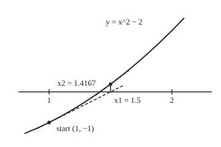
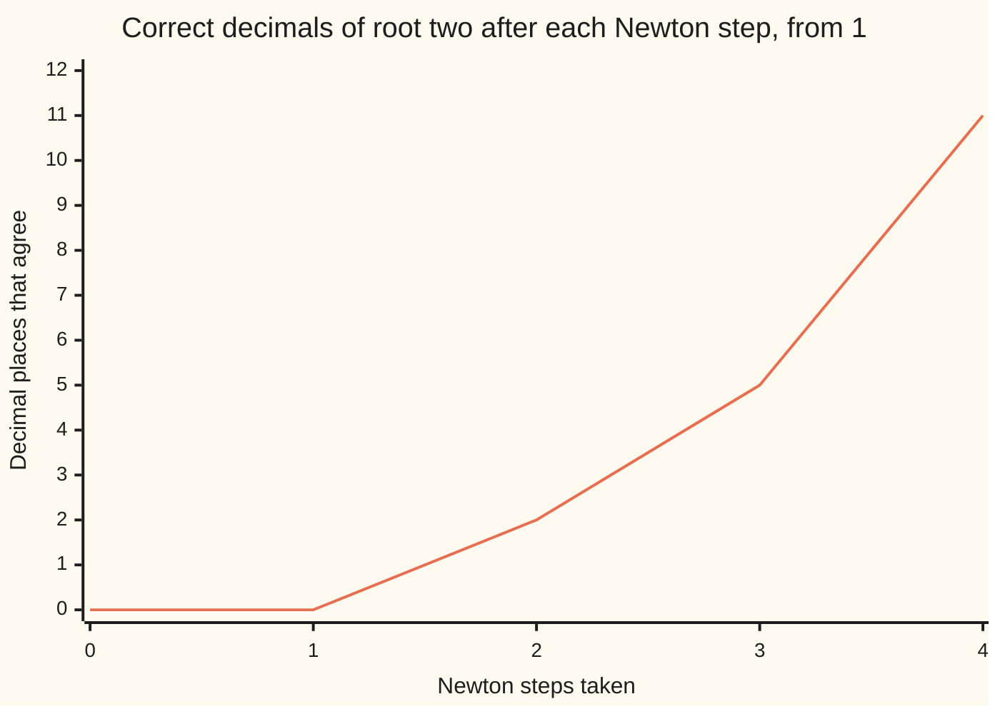

# Newton's method: solving f(x) equals a target by sliding down tangent lines

[Syllabus](../../../SYLLABUS.md) → [Calculus and analysis](../../../SYLLABUS.md#w06) → [What Derivatives Tell You](../../../SYLLABUS.md#w06-s03) → Newton's method

---

## General Overview

A square floor tile must cover exactly 2 square metres. Its side is the square root of 2 metres, and no fraction equals it. What a builder needs is a decimal good to enough places, and a rule for when to stop.

Guess 1 metre. That tile covers 1 square metre, 1 short. The area grows at 2 square metres per metre of side there, so add half a metre: 1.5. That covers a quarter too much. Repeat. Four rounds from 1 give 1.414213562374690, and the true side begins 1.414213562373095: eleven decimals agree.

Each round replaces the curve of area against side by its tangent line (the straight line touching the curve at the guess, with the same slope) and slides down it to the target. This is **Newton's method**. It needs the derivative: the rate of area per unit of side.

**Newton's method replaces the equation by its tangent line at the current guess, solves the line exactly, and repeats; near a root where the slope is not zero, each round roughly doubles the number of correct digits.**

**What kind of fact this is:** a method; its two guarantees, the exact error rule for square roots and fast convergence near a simple root (one where the slope is not zero), are theorems proved in Why it works.

### The picture: two tangent slides on the tile's area curve

<p align="center"></p>

Drawn at 1 metre of side = 200 units across, 1 square metre of miss = 50 units up. Each dashed tangent runs to the axis; the short upright climbs back to the curve. The second landing sits 0.0025 right of the root.

---

## The formula

A reminder of notation from the sequences card: a list of guesses is written $x_n$, with $n$ as its clock, so $x_0$ is the start and $x_{n+1}$ the guess after $x_n$.

To solve "something equals a target", move the target across first, so the job becomes $f(x) = 0$. For the tile, $f(x) = x^2 - 2$. Then one Newton step is

$$x_{n+1} = x_n - \frac{f(x_n)}{f'(x_n)}$$

**Read it aloud:** the next guess is the current one minus the miss divided by the miss's rate of change.

For the tile, $f'(x) = 2x$, and the step simplifies to $x_{n+1} = \tfrac{1}{2}\left(x_n + 2/x_n\right)$: average the guess with 2 divided by the guess.

The **residual** is $f(x_n)$: how far the guess misses, in the equation's units. Here the run stops once it is below $10^{-10}$ square metres.

| Symbol | Plain meaning | In our example | Push it up and the answer… |
| --- | --- | --- | --- |
| $f$ | the miss: area minus target | $x^2 - 2$, square metres | scaling it changes no step |
| $f'$, $f''$ | the slope of $f$ and the rate that slope changes | $2x$ square metres per metre, and 2 | a shorter step |
| $x_n$, $x_0$, $n$ | the guess after $n$ steps, in metres | $x_0 = 1$, $x_1 = 1.5$ | — |
| $r$ | the root: the side that exactly works | 1.414213562373095 m | — |
| $e_n$ | the error $x_n - r$ | $e_2 = 0.0025$ m | the next grows as its square |
| $a$, $b$ | ends of a bracket: $f$ changes sign between them | 1 and 2 | a looser guard |
| $m$ | the smallest slope size in the bracket | 2 square metres per metre on 1 to 2 | a tighter error bound |
| $\xi$ | a point a theorem says exists | between $x_n$ and $r$ | — |

### When it holds

- **A nonzero slope at the root.** Where the curve only touches the axis, as $x^2$ does at 0, the error merely halves each step.
- **A start close enough, or a bracket.** Far off, the tangent can point anywhere: $x^3 - 2x + 2$ from 0 bounces 0, 1, 0, 1.
- **No flat point on the way.** From $x_0 = 0$ the tile's step divides by zero.
- **A residual stop in the right units.** The residual is in square metres, the answer in metres; dividing by $m$ converts.

---

## Why it works

### Step 0: a curve looks straight up close

Zoomed in, a smooth curve looks like its tangent line ([Linear approximation](01-linear-approximation-and-related-rates.md)). A line's zero can be found exactly, so use it as the next guess.

### Step 1: solve the tangent line

The tangent at $x_n$ is $y = f(x_n) + f'(x_n)(x - x_n)$. Set $y = 0$. If $f'(x_n)$ is not zero, divide by it: $x = x_n - f(x_n)/f'(x_n)$. That is the formula.

At the tile's start, $f(1) = -1$ and $f'(1) = 2$: the line $y = 2x - 3$ meets the axis at 1.5. Units: square metres over square metres per metre leave metres.

### Step 2: for the tile, the error is squared exactly

Subtract the root $r$ from both sides of $x_{n+1} = (x_n^2 + 2)/(2x_n)$ and use $r^2 = 2$:

$$e_{n+1} = \frac{x_n^2 - 2 r x_n + r^2}{2x_n} = \frac{e_n^2}{2x_n}$$

No approximation was made. For $x_n > 0$ the new error is positive, so after one step every guess sits above $r$. It is at most half the old one, so the guesses fall to $r$. Near $r$ it is the old error squared times about 1/(2 × 1.414) = 0.3536: 0.0025 becomes 0.0000021.



The line counts decimal places the guess shares with the root, from the code's step rows: from step 2 on, about double the last, plus one.

### Step 3: any smooth function behaves the same near a simple root

Taylor's theorem ([Taylor's theorem](05-taylors-theorem.md)) says a curve leaves its tangent by an amount proportional to the distance squared. The step removes the straight part of the error; the bent part remains:

$$e_{n+1} = \frac{f''(\xi)}{2 f'(x_n)}\, e_n^2$$

**Read it aloud:** the next error is the current error squared, times the curve's bend divided by twice its slope.

<details>
<summary>Detailed proof: local quadratic convergence</summary>

Assume $f$ has a continuous second derivative near $r$, with $f(r) = 0$ and $f'(r) \neq 0$. Taylor's theorem with remainder, centred at $x_n$ and evaluated at $r$, gives a point $\xi$ between $x_n$ and $r$ with $0 = f(x_n) + f'(x_n)(r - x_n) + \tfrac{1}{2} f''(\xi)(r - x_n)^2$. Divide by $f'(x_n)$ and rearrange: $x_n - f(x_n)/f'(x_n) - r = \tfrac{f''(\xi)}{2 f'(x_n)}(x_n - r)^2$, which is the displayed rule.

By continuity, pick $\delta > 0$ so that from $r - \delta$ to $r + \delta$ the slope keeps $|f'| \ge \mu > 0$ and the bend keeps $|f''| \le M$. Let $K = M/(2\mu)$ and shrink the interval until $K\delta \le 1/2$. If $|e_n| \le \delta$, then $|e_{n+1}| \le K e_n^2 \le (K\delta)|e_n| \le |e_n|/2$, so the next guess stays inside. By induction the errors halve at least, the guesses tend to $r$, and $|e_{n+1}| \le K |e_n|^2$ throughout.

</details>

### Step 4: a small residual bounds the error, through the slope

The error needs the unknown root; the residual does not. The mean value theorem ([Mean value theorem](02-mean-value-theorem.md)) connects them: $f(x_n) - f(r) = f'(\xi)(x_n - r)$ for some $\xi$ between. With $f(r) = 0$ and every slope at least $m$ in size:

$$|x_n - r| \le \frac{|f(x_n)|}{m}$$

On the bracket from 1 to 2 the slope $2x$ is at least 2. After step 4 the residual is 0.0000000000045, so the error is at most 0.0000000000023 m; measured, it is 0.0000000000016.

### Step 5: the bracket is the safety net

First check that $f(a)$ and $f(b)$ differ in sign: $f(1) = -1$, $f(2) = 2$, so a continuous $f$ crosses zero between. The slope $2x$ is positive there, so $f$ only rises and the root is unique. If a Newton step would leave the bracket, take the midpoint; then keep the half whose ends still differ in sign. The root never escapes.

The cubic $x^3 - 2x + 2$ on $-2$ to 0 shows it. Unguarded from 0 it cycles. Guarded, two tangents point outside, so two halvings, then five Newton steps land on $-1.769292354239$.

Bisection alone, halving by signs and never using the slope, is the second road: it reaches 1.414213562373095 but needs 34 halvings to get under $10^{-10}$ wide. Newton needed 4. When any rule of the form "next = rule(current)" must converge is [Fixed points](07-fixed-point-iteration-and-the-contraction-principle.md).

---

## Worked numbers, by hand

| Step | Arithmetic | Value |
| --- | --- | --- |
| bracket | f(1) = 1 − 2, f(2) = 4 − 2 | −1 and 2: signs differ |
| step 1 | ½ × (1 + 2/1) | 3/2 = 1.5 |
| step 2 | ½ × (3/2 + 4/3) | 17/12 = 1.416666666666667 |
| step 3 | ½ × (17/12 + 24/17) | 577/408 = 1.414215686274510 |
| step 4 | ½ × (577/408 + 816/577) | 665857/470832 = 1.414213562374690 |
| residual | (665857/470832)^2 − 2 | 0.0000000000045 square metres, below the stop |
| error bound | residual ÷ 2 | **at most 0.0000000000023 m** |

A tile cut to 1.414213562374690 m misses 2 square metres by 0.0000000000045 of one, and its side is off by 0.0000000000016 m.

### What breaks if you drop a piece

| Mistake | Comes out at | What went wrong |
| --- | --- | --- |
| Start at 0 | slope $f'(0) = 0$, no next guess | a flat tangent never meets the axis |
| $x^3 - 2x + 2$ from 0, no bracket | 0, 1, 0, 1, 0 for ever | the tangent at 1 points straight back to 0 |
| Tile equation times $10^{-12}$, same stop | stops at once at 1.000, error 0.414 | the residual ignores the slope; the bound 0.500 warns |

---

## Code, from first principles, and it actually runs

Guarded Newton runs on the tile from the bracket 1 to 2 and stops on the residual. Two roads check it without sharing its arithmetic: exact whole-number fractions for each step, and bisection by signs alone. Then the error-squared rule is tested against the bisection root, and the three failures and the guarded cubic run. No square root is called.

### Python

```python
# Newton's method, the check behind the card.  Standard library only, no square root called.
# Solve x*x = 2 from the bracket [1, 2], stop on a residual, check two other ways, break it.
def sci(v):                                   # 2.5e-1, the form Rust prints
    m, e = f"{v:.1e}".split("e")
    return f"{m}e{int(e)}"
def bisect(f, a, b):                          # road two: signs only, no slopes
    k, k10 = 0, 0
    while a < (a + b) / 2 < b:                # halve until the floats run out
        c = (a + b) / 2
        a, b = (c, b) if (f(c) < 0) == (f(a) < 0) else (a, c)
        k += 1
        k10 = k10 or (k if b - a < 1e-10 else 0)
    return (a + b) / 2, k10

def newton(f, df, a, b, x, tol=1e-10):        # a step leaving the bracket bisects
    path, kinds = [x], ""
    while abs(f(x)) >= tol and len(path) < 60:
        t = x - f(x) / df(x) if df(x) != 0 else a - 1
        kinds += "N" if a < t < b else "B"
        x = t if a < t < b else (a + b) / 2
        a, b = (x, b) if (f(x) < 0) == (f(a) < 0) else (a, x)
        path.append(x)
    return path, kinds
def decimals(x, r):                           # decimal places that agree
    k = 0
    while int(x * 10 ** (k + 1)) == int(r * 10 ** (k + 1)): k += 1
    return k

f, df = (lambda x: x * x - 2), (lambda x: 2 * x)
print(f"bracket [1, 2]: f(1) = {f(1.0):.1f}, f(2) = {f(2.0):.1f}; the signs differ")
r, k10 = bisect(f, 1.0, 2.0)
path, kinds = newton(f, df, 1.0, 2.0, 1.0)
p, q = 1, 1                                   # road three: exact fractions p/q
for n, x in enumerate(path):
    print(f"step {n}  x = {x:.15f} = {p}/{q}  residual {sci(f(x))}  error {sci(x - r)}  decimals {decimals(x, r)}")
    assert abs(x - p / q) < 1e-15
    p, q = p * p + 2 * q * q, 2 * p * q
x4 = path[-1]
print(f"stopped after {len(path) - 1} Newton steps ({kinds}): residual below 1e-10; bound |f|/2 = {sci(abs(f(x4)) / 2)}")
print(f"bisection, signs only: {r:.15f}; {k10} halvings to a bracket under 1e-10 wide")
ratios = [(path[n + 1] - r) / (path[n] - r) ** 2 for n in range(3)]
print("error ratio e(n+1)/e(n)^2:", " ".join(f"{v:.4f}" for v in ratios),
      "; 1/(2 x_n):", " ".join(f"{1 / (2 * path[n]):.4f}" for n in range(3)), f"; limit 1/(2r) = {1 / (2 * r):.4f}")
X, Y = (lambda x: 40 + 200 * (x - 0.8)), (lambda y: 150 - 50 * y)
print(f"figure, start ({X(1):.1f}, {Y(-1):.1f}), x1 ({X(1.5):.1f}, {Y(0):.1f}), "
      f"curve above x1 ({X(1.5):.1f}, {Y(0.25):.1f}), x2 ({X(path[2]):.1f}, {Y(0):.1f})")
print(f"fail 1, start at 0: slope f'(0) = {df(0.0):.1f}, the tangent never meets the axis")
g, dg = (lambda x: x ** 3 - 2 * x + 2), (lambda x: 3 * x * x - 2)
cyc = [0.0]
for _ in range(4): cyc.append(cyc[-1] - g(cyc[-1]) / dg(cyc[-1]))
print("fail 2, x^3 - 2x + 2 from 0, no bracket:", " -> ".join(f"{v:.0f}" for v in cyc))
gpath, gk = newton(g, dg, -2.0, 0.0, 0.0); groot = bisect(g, -2.0, 0.0)[0]
print(f"same cubic guarded on [-2, 0]: {len(gpath) - 1} steps ({gk}), x = {gpath[-1]:.12f}, bisection {groot:.12f}")
spath, _ = newton(lambda x: 1e-12 * f(x), lambda x: 2e-12 * x, 1.0, 2.0, 1.0)
print(f"fail 3, f scaled by 1e-12: stops after {len(spath) - 1} steps at x = {spath[-1]:.3f}, "
      f"error {abs(spath[-1] - r):.3f}; bound |f|/m = {1e-12 * abs(f(1.0)) / 2e-12:.3f}")
assert abs(x4 - r) <= abs(f(x4)) / 2 < 1e-10          # Newton, bisection, residual bound
assert all(abs(ratios[n] - 1 / (2 * path[n])) < 1e-6 for n in range(3))
assert cyc == [0, 1, 0, 1, 0] and abs(gpath[-1] - groot) < 1e-10
print("ALL CHECKS PASS")
```

**Ran 2026-09-27 on macOS, Python 3.14.6, standard library only. All checks passed. Output, pasted from the run:**

```
bracket [1, 2]: f(1) = -1.0, f(2) = 2.0; the signs differ
step 0  x = 1.000000000000000 = 1/1  residual -1.0e0  error -4.1e-1  decimals 0
step 1  x = 1.500000000000000 = 3/2  residual 2.5e-1  error 8.6e-2  decimals 0
step 2  x = 1.416666666666667 = 17/12  residual 6.9e-3  error 2.5e-3  decimals 2
step 3  x = 1.414215686274510 = 577/408  residual 6.0e-6  error 2.1e-6  decimals 5
step 4  x = 1.414213562374690 = 665857/470832  residual 4.5e-12  error 1.6e-12  decimals 11
stopped after 4 Newton steps (NNNN): residual below 1e-10; bound |f|/2 = 2.3e-12
bisection, signs only: 1.414213562373095; 34 halvings to a bracket under 1e-10 wide
error ratio e(n+1)/e(n)^2: 0.5000 0.3333 0.3529 ; 1/(2 x_n): 0.5000 0.3333 0.3529 ; limit 1/(2r) = 0.3536
figure, start (80.0, 200.0), x1 (180.0, 150.0), curve above x1 (180.0, 137.5), x2 (163.3, 150.0)
fail 1, start at 0: slope f'(0) = 0.0, the tangent never meets the axis
fail 2, x^3 - 2x + 2 from 0, no bracket: 0 -> 1 -> 0 -> 1 -> 0
same cubic guarded on [-2, 0]: 7 steps (BBNNNNN), x = -1.769292354239, bisection -1.769292354239
fail 3, f scaled by 1e-12: stops after 0 steps at x = 1.000, error 0.414; bound |f|/m = 0.500
ALL CHECKS PASS
```

### Rust

Same numbers, same labels, built with `rustc --edition 2021 -O`.

```rust
// Newton's method, the same check as the Python, in Rust.  No crates, no square root called.
// Solve x*x = 2 from the bracket [1, 2], stop on a residual, check two other ways, break it.
fn bisect(f: &dyn Fn(f64) -> f64, mut a: f64, mut b: f64) -> (f64, usize) {
    let (mut k, mut k10) = (0, 0);                   // road two: signs only, no slopes
    while a < (a + b) / 2.0 && (a + b) / 2.0 < b {   // halve until the floats run out
        let c = (a + b) / 2.0;
        if (f(c) < 0.0) == (f(a) < 0.0) { a = c } else { b = c }
        k += 1;
        if k10 == 0 && b - a < 1e-10 { k10 = k }
    }
    ((a + b) / 2.0, k10)
}

fn newton(f: &dyn Fn(f64) -> f64, df: &dyn Fn(f64) -> f64, mut a: f64, mut b: f64, mut x: f64)
    -> (Vec<f64>, String) {                          // a step leaving the bracket bisects
    let (mut path, mut kinds) = (vec![x], String::new());
    while f(x).abs() >= 1e-10 && path.len() < 60 {
        let t = if df(x) != 0.0 { x - f(x) / df(x) } else { a - 1.0 };
        let inside = a < t && t < b;
        kinds.push(if inside { 'N' } else { 'B' });
        x = if inside { t } else { (a + b) / 2.0 };
        if (f(x) < 0.0) == (f(a) < 0.0) { a = x } else { b = x }
        path.push(x);
    }
    (path, kinds)
}

fn decimals(x: f64, r: f64) -> i32 {                 // decimal places that agree
    let mut k = 0;
    while (x * 10f64.powi(k + 1)) as i64 == (r * 10f64.powi(k + 1)) as i64 { k += 1 }
    k
}

fn main() {
    let f = |x: f64| x * x - 2.0;
    let df = |x: f64| 2.0 * x;
    println!("bracket [1, 2]: f(1) = {:.1}, f(2) = {:.1}; the signs differ", f(1.0), f(2.0));
    let (r, k10) = bisect(&f, 1.0, 2.0);
    let (path, kinds) = newton(&f, &df, 1.0, 2.0, 1.0);
    let (mut p, mut q): (i64, i64) = (1, 1);         // road three: exact fractions p/q
    for (n, &x) in path.iter().enumerate() {
        println!("step {}  x = {:.15} = {}/{}  residual {:.1e}  error {:.1e}  decimals {}",
                 n, x, p, q, f(x), x - r, decimals(x, r));
        assert!((x - p as f64 / q as f64).abs() < 1e-15);
        (p, q) = (p * p + 2 * q * q, 2 * p * q);
    }
    let x4 = path[path.len() - 1];
    println!("stopped after {} Newton steps ({}): residual below 1e-10; bound |f|/2 = {:.1e}",
             path.len() - 1, kinds, f(x4).abs() / 2.0);
    println!("bisection, signs only: {:.15}; {} halvings to a bracket under 1e-10 wide", r, k10);
    let ratios: Vec<f64> = (0..3).map(|n| (path[n + 1] - r) / (path[n] - r).powi(2)).collect();
    let fmt = |v: Vec<f64>| v.iter().map(|x| format!("{:.4}", x)).collect::<Vec<_>>().join(" ");
    println!("error ratio e(n+1)/e(n)^2: {} ; 1/(2 x_n): {} ; limit 1/(2r) = {:.4}", fmt(ratios.clone()),
             fmt((0..3).map(|n| 1.0 / (2.0 * path[n])).collect()), 1.0 / (2.0 * r));
    let (sx, sy) = (|x: f64| 40.0 + 200.0 * (x - 0.8), |y: f64| 150.0 - 50.0 * y);
    println!("figure, start ({:.1}, {:.1}), x1 ({:.1}, {:.1}), curve above x1 ({:.1}, {:.1}), x2 ({:.1}, {:.1})",
             sx(1.0), sy(-1.0), sx(1.5), sy(0.0), sx(1.5), sy(0.25), sx(path[2]), sy(0.0));
    println!("fail 1, start at 0: slope f'(0) = {:.1}, the tangent never meets the axis", df(0.0));
    let g = |x: f64| x.powi(3) - 2.0 * x + 2.0;
    let dg = |x: f64| 3.0 * x * x - 2.0;
    let mut cyc = vec![0.0f64];
    for _ in 0..4 { let c = cyc[cyc.len() - 1]; cyc.push(c - g(c) / dg(c)) }
    let cs: Vec<String> = cyc.iter().map(|v| format!("{:.0}", v)).collect();
    println!("fail 2, x^3 - 2x + 2 from 0, no bracket: {}", cs.join(" -> "));
    let (gpath, gk) = newton(&g, &dg, -2.0, 0.0, 0.0);
    let groot = bisect(&g, -2.0, 0.0).0;
    println!("same cubic guarded on [-2, 0]: {} steps ({}), x = {:.12}, bisection {:.12}",
             gpath.len() - 1, gk, gpath[gpath.len() - 1], groot);
    let (spath, _) = newton(&|x: f64| 1e-12 * f(x), &|x: f64| 2e-12 * x, 1.0, 2.0, 1.0);
    let s = spath[spath.len() - 1];
    println!("fail 3, f scaled by 1e-12: stops after {} steps at x = {:.3}, error {:.3}; bound |f|/m = {:.3}",
             spath.len() - 1, s, (s - r).abs(), 1e-12 * f(1.0).abs() / 2e-12);
    assert!((x4 - r).abs() <= f(x4).abs() / 2.0 && f(x4).abs() / 2.0 < 1e-10);
    assert!((0..3).all(|n| (ratios[n] - 1.0 / (2.0 * path[n])).abs() < 1e-6));
    assert!(cyc == vec![0.0, 1.0, 0.0, 1.0, 0.0] && (gpath[gpath.len() - 1] - groot).abs() < 1e-10);
    println!("ALL CHECKS PASS");
}
```

**Ran 2026-09-27 on macOS, rustc 1.98.1, no crates. All checks passed. Output, pasted from the run:**

```
bracket [1, 2]: f(1) = -1.0, f(2) = 2.0; the signs differ
step 0  x = 1.000000000000000 = 1/1  residual -1.0e0  error -4.1e-1  decimals 0
step 1  x = 1.500000000000000 = 3/2  residual 2.5e-1  error 8.6e-2  decimals 0
step 2  x = 1.416666666666667 = 17/12  residual 6.9e-3  error 2.5e-3  decimals 2
step 3  x = 1.414215686274510 = 577/408  residual 6.0e-6  error 2.1e-6  decimals 5
step 4  x = 1.414213562374690 = 665857/470832  residual 4.5e-12  error 1.6e-12  decimals 11
stopped after 4 Newton steps (NNNN): residual below 1e-10; bound |f|/2 = 2.3e-12
bisection, signs only: 1.414213562373095; 34 halvings to a bracket under 1e-10 wide
error ratio e(n+1)/e(n)^2: 0.5000 0.3333 0.3529 ; 1/(2 x_n): 0.5000 0.3333 0.3529 ; limit 1/(2r) = 0.3536
figure, start (80.0, 200.0), x1 (180.0, 150.0), curve above x1 (180.0, 137.5), x2 (163.3, 150.0)
fail 1, start at 0: slope f'(0) = 0.0, the tangent never meets the axis
fail 2, x^3 - 2x + 2 from 0, no bracket: 0 -> 1 -> 0 -> 1 -> 0
same cubic guarded on [-2, 0]: 7 steps (BBNNNNN), x = -1.769292354239, bisection -1.769292354239
fail 3, f scaled by 1e-12: stops after 0 steps at x = 1.000, error 0.414; bound |f|/m = 0.500
ALL CHECKS PASS
```

The two outputs match line for line.

> [!TIP]
> **Try changing**
> Guess first, then run it.
> - **Start at the far end.** Set the tile's start to `2.0` and `p, q` to `2, 1`. Answer: the tangent at 2 also lands on 1.5, so the same four steps follow, with fractions unreduced: 6/4, 68/48.
> - **Loosen the stop.** Set `tol` to `1e-4`. Answer: it stops after 3 steps with 5 decimals right, and the residual assert stops the run.
> - **Break the step.** Change `x - f(x) / df(x)` to `x - 0.9 * f(x) / df(x)`. Answer: the error is only cut by about a tenth each step, and the fraction assert fails at step 1.

---

## The usual mistake

> [!warning]
> **Trusting a small residual as a small error.** The residual is in the equation's units, the error in the answer's. Multiply the tile equation by $10^{-12}$ and the start 1 passes the stop while 0.414 m wrong. Divided by the smallest slope, $m$, the residual gives the honest bound 0.500 m.
>
> - **Flipping the sign.** Adding $f/f'$ instead of subtracting walks away from the root.
> - **Starting on a flat spot.** From 0 the tile's step divides by zero.
> - **Expecting any start to work.** $x^3 - 2x + 2$ from 0 repeats 0, 1, 0, 1. A bracket fixes it.
> - **A double root.** Where the curve touches the axis, $f'(r) = 0$ and the error only halves each step.

---

## Where you meet it in real life

- **Square roots in hardware.** Chips refine a table-lookup start for 1/x and square roots by a few Newton steps.
- **Interest rates.** The rate that makes a stream of payments worth a given price has no formula: [NPV and IRR](../../12-Financial%20mathematics/01-Money%2C%20Dates%20and%20Discounting/04-net-present-value-and-irr.md).
- **Implied volatility.** Traders solve backwards from an option's price, pairing Newton with bisection as the bracket here does: [Solving for implied volatility](../../12-Financial%20mathematics/11-Implied%20volatility%20and%20the%20vanilla%20inverses/02-implied-volatility-by-newton-and-bisection.md).
- **Optimisation.** A lowest point solves "slope = 0", and Newton on the slope is Newton and BFGS.

> **Say it back**
> Write the equation as a miss that should be zero. At each guess, replace the curve by its tangent and take the tangent's zero as the next guess. Near a root with a nonzero slope the error is squared each step: root two goes from 1 to eleven decimals in four steps. Stop when the residual over the smallest slope is small, and keep a sign-changing bracket so a bad tangent costs only a halving.

---

## What this builds on

- [Linear approximation](01-linear-approximation-and-related-rates.md): the tangent line as the best straight stand-in for a curve, which each Newton step solves.

## Where this goes next

- [Fixed points](07-fixed-point-iteration-and-the-contraction-principle.md): Newton as one rule among many.
- [Shooting](../../08-Differential%20equations%20and%20dynamics/07-Series%20Solutions%20and%20Boundary%20Problems/06-the-shooting-method.md): Newton on a launch angle.
- [Fixed points of a map](../../08-Differential%20equations%20and%20dynamics/11-Discrete%20Dynamics%20and%20Chaos/02-fixed-points-of-a-map.md): the 0, 1, 0, 1 cycle as an orbit.
- [Normal quantiles](../../09-Probability%20and%20statistics/04-Continuous%20Distributions/05-normal-quantile.md): inverting the bell curve's area.
- [NPV and IRR](../../12-Financial%20mathematics/01-Money%2C%20Dates%20and%20Discounting/04-net-present-value-and-irr.md): a rate of return as a root.
- [Solving backwards](../../12-Financial%20mathematics/07-Greeks%20by%20Numbers%20and%20Calibration/05-root-finding-for-inverses.md): bracketed Newton as the desk's inverse.
- [Solving for implied volatility](../../12-Financial%20mathematics/11-Implied%20volatility%20and%20the%20vanilla%20inverses/02-implied-volatility-by-newton-and-bisection.md): the guarded step on an option price.
- [Strike or spot from a target premium](../../12-Financial%20mathematics/11-Implied%20volatility%20and%20the%20vanilla%20inverses/04-strike-or-spot-from-a-target-premium.md): solving for strike or spot.
- [SABR from three quotes](../../12-Financial%20mathematics/14-Stochastic%20volatility%20-%20Heston%2C%20SABR%20and%20their%20mix/05-sabr-calibration-from-three-quotes.md): three unknowns at once.
- [Barone-Adesi-Whaley](../../12-Financial%20mathematics/15-American%20and%20Bermudan%20exercise/06-barone-adesi-whaley-approximation.md): an exercise boundary as a root.
- [Compound options](../../12-Financial%20mathematics/17-Averages%2C%20choosers%2C%20compounds%20and%20forward-starts/05-compound-options.md): a critical price as a root.
- [Strike from delta](../../12-Financial%20mathematics/21-FX%20vanilla%20options%20-%20Garman-Kohlhagen%20and%20the%20desk%20conventions/06-fx-strike-from-delta.md): the strike for a quoted delta.
- [Implied vol for a currency option](../../12-Financial%20mathematics/21-FX%20vanilla%20options%20-%20Garman-Kohlhagen%20and%20the%20desk%20conventions/07-fx-implied-volatility.md): implied volatility with two rates.
- [Implied vol on a futures option and the commodity smile](../../12-Financial%20mathematics/26-Options%20on%20commodity%20futures%20and%20spreads/03-commodity-implied-vol-and-the-call-skew.md): one inversion per strike.
- [Implied vol from an Asian quote](../../12-Financial%20mathematics/27-Averages%20-%20commodity%20swaps%20and%20Asian%20options/05-asian-implied-volatility.md): inverting an averaged payoff.
- Newton and BFGS: Newton on the gradient.
- Newton and secant: Newton without a derivative.

---

## Sources

Verified 27 Sep 2026: every link below resolves to the publisher's page.

- OpenStax. *Calculus Volume 1*, section 4.9. [OpenStax page](https://openstax.org/books/calculus-volume-1/pages/4-9-newtons-method). The tangent derivation and the cycling cubic.
- Süli, Endre, and David F. Mayers. *An Introduction to Numerical Analysis*. Cambridge University Press, 2003. [Publisher page](https://www.cambridge.org/core/books/an-introduction-to-numerical-analysis/FD8BCAD7FE68002E2179DFF68B8B7237). Chapter 1 proves local quadratic convergence.
- Ypma, Tjalling J. "Historical Development of the Newton–Raphson Method." *SIAM Review* 37, no. 4 (1995): 531–551. [doi:10.1137/1037125](https://doi.org/10.1137/1037125). How Newton's polynomial trick became the tangent step.
- O'Connor, J. J., and E. F. Robertson. "Joseph Raphson." MacTutor Archive, University of St Andrews. [Biography](https://mathshistory.st-andrews.ac.uk/Biographies/Raphson/). Raphson's *Analysis aequationum universalis*, the first iterative form.
