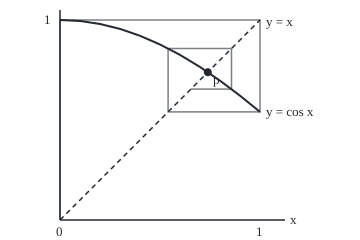

# Fixed points: iterating a function until it stops moving, and the contraction rule that guarantees it

Calculus and analysis → What Derivatives Tell You → Iterating to a standstill → Fixed points

---

## General Overview

Set a calculator to radians, clear it to 0, and press the cosine key. It shows 1. Again: 0.540302, then 0.857553, 0.654290, 0.793480. The readings swing, each swing smaller. After 100 presses the screen reads 0.7390851332, and pressing again changes nothing.

There the key has no effect: the cosine of 0.7390851332 is 0.7390851332. It solves cos x = x, which no algebra rearranges into a formula. A point a rule sends to itself is a **fixed point**, and pressing the rule again and again is **fixed-point iteration**, the terms used from here on.

Does pressing always settle, and how far off is the reading? One condition answers both. A rule that pulls every two points closer by a fixed factor is a **contraction**: it has exactly one fixed point, reached from any start, with an error bounded in advance.

**A rule that maps a closed interval into itself and shrinks every distance by a factor below 1 has exactly one fixed point, repeated pressing always reaches it, and the error after n presses is at most that factor to the power n, times a known constant.**

**What kind of fact this is:** a theorem, Banach's fixed-point theorem on a closed interval, proved on this card in Why it works.

### The picture: pressing cos, drawn as a staircase

<p align="center"></p>

Drawn to scale, 200 pixels to one unit on both axes. Solid curve: y = cos x. Dashed line: y = x. The dot, p, is where they cross: the fixed point 0.7390851332. The staircase is four presses from 0: each vertical move to the curve is a press of cos, each level move to the line feeds the answer back in. It winds inward because the curve is flatter than the line; the proof turns that into a number.

---

## The formula

Notation first, in words. The rule is $g$; the reading after $n$ presses is $x_n$, starting from $x_0$; the fixed point is $p$. Vertical bars give distance: |x − y| is how far apart x and y are. The contraction condition, on the closed interval from $a$ to $b$, ends included:

$$|g(x) - g(y)| \le q\,|x - y| \quad \text{for all } x, y \text{ in } [a, b], \qquad 0 \le q < 1$$

**Read it aloud:** after one press, any two points are at most q times as far apart as they were before.

Pressing is $x_{n+1} = g(x_n)$. The theorem then gives two bounds on the error:

$$|x_n - p| \le \frac{q^n}{1 - q}\,|x_1 - x_0| \qquad\qquad |x_n - p| \le \frac{q}{1 - q}\,|x_n - x_{n-1}|$$

**Read it aloud:** the error after n presses is at most q to the n over one minus q, times the first step; and at most q over one minus q, times the last step.

The **first-step bound** budgets the work before it starts; the **last-step bound** says when to stop.

| Symbol | Plain meaning | In our example | Push it up and the answer… |
| --- | --- | --- | --- |
| $g$ | the rule pressed | cos, radians | steeper settles slower |
| $x_0$, $x_n$ | start; reading after n presses | 0; 0.731404 at 10 | — |
| $n$ | presses so far | 10 | bounds fall |
| $p$ | fixed point: g(p) = p | 0.7390851332 | — |
| $q$ | contraction factor, worst over all pairs | sin 1 = 0.841471 | bounds grow |
| $a$, $b$ | ends of the interval | 0 and 1 | — |
| $x$, $y$ | any two points in it | any pair | — |
| $c$ | the mean value theorem's in-between point | depends on the pair | — |

All in radians; the slope of cos is radians per radian, so q has no unit.

### When it holds

- **The rule maps the interval into itself.** Otherwise a press leaves the region where the shrinking was checked: x/2 + 1 halves distances but sends 1 to 1.5, and its fixed point, 2, lies outside 0 to 1.
- **The interval is closed**, both ends included. Halving on 0 to 1 with 0 left out heads for the missing 0: no fixed point.
- **One factor q below 1 for every pair.** "Every pair moves closer" is weaker: x + 1/x on the numbers from 1 up does that and has no fixed point.
- **q strictly below 1.** At q = 1 the bounds divide by zero; above 1 it fails outright: pressing arccos, whose slope near p is about 1.48, runs away.

---

## Why it works

### Step 0: each press shrinks the next step, so the total travel is finite

The distance to p is unknown; the steps between presses are known. Each step is at most q times the one before, so the steps add up to a finite total, and the readings must settle. Where they settle is the fixed point.

### Step 1: steps shrink geometrically

Apply the contraction to the latest two readings:

$$|x_{n+1} - x_n| = |g(x_n) - g(x_{n-1})| \le q\,|x_n - x_{n-1}|$$

Repeated down to the first step: $|x_{n+1} - x_n| \le q^n |x_1 - x_0|$. For cos from 0, that is 0.841471 to the n.

### Step 2: every later reading stays within a known distance

From press n to any later press m, the pressing covers at most the sum of the steps between; bound each by Step 1 and sum:

$$|x_m - x_n| \le \left(q^n + q^{n+1} + \dots + q^{m-1}\right)|x_1 - x_0| < \frac{q^n}{1 - q}\,|x_1 - x_0| \qquad \text{for every } m > n$$

The tolerance game, with numbers: to keep every later reading within 0.001 of the reading at press n, make the right side at most 0.001. For cos from 0 that first happens at n = 51, and it holds however long the pressing goes on.

### Step 3: the readings settle on a point of the interval

Terms that bunch up closer than any tolerance have a limit, because the real numbers have no gaps. Every reading lies in the closed interval, which contains its ends, so the limit p lies in it too. Here "closed" earns its place.

### Step 4: the limit is fixed, and it is the only one

A contraction is Lipschitz with constant q ([uniform-continuity-and-lipschitz](../01-Limits%20and%20Continuity/08-uniform-continuity-and-lipschitz.md)), so continuous. The readings head for p, so their images head for g(p); but their images are the next readings, which head for p. So g(p) = p.

A second fixed point r would give |p − r| = |g(p) − g(r)| ≤ q |p − r|. A distance at most 0.841471 times itself is zero, so r = p.

### Step 5: the two stopping rules

Let m run on in Step 2: the reading at press m heads for p, giving the first-step bound. For the last-step bound, restart the clock at press n − 1; its first step is the latest step, and one press of the first-step bound gives q/(1 − q) times it.

<details>
<summary>Detailed proof</summary>

Let g map [a, b] into itself with |g(x) − g(y)| ≤ q|x − y|, 0 ≤ q < 1, and B the first step's length.

*Cauchy.* By induction step k is at most B q^k, so for m > n the triangle inequality and the finite geometric sum give |x_m − x_n| < B q^n / (1 − q). For any tolerance ε > 0 pick N with B q^N / (1 − q) < ε; then |x_m − x_n| < ε for all m > n ≥ N.

*Limit.* The reals are complete, so x_n converges to some p, with a ≤ p ≤ b.

*Fixed.* |g(p) − p| ≤ q|p − x_n| + |x_(n+1) − p|, which heads for 0, so g(p) = p.

*Unique.* g(r) = r gives (1 − q)|p − r| ≤ 0, so r = p.

*Bounds.* Let m head for infinity for the first; restart at x_(n−1) for the second.

</details>

### Step 6: checking that cos is a contraction, with the derivative

Two facts about cos on 0 to 1. It maps the interval into itself: cos falls from 1 at 0 to 0.540302 at 1. And the factor q: the mean value theorem ([mean-value-theorem](02-mean-value-theorem.md)) says a chord's slope equals the curve's slope at some point $c$ between the ends. The slope of cos is −sin, so

$$|\cos x - \cos y| = |\sin c|\,|x - y| \le \sin 1\,|x - y|$$

since sin rises from 0 to 0.841471 across the interval. So q = sin 1. In general, **a rule whose slope stays between −q and q on the interval is a contraction with factor q**: the derivative certifies the shrinking.

That q is a worst case. Near the answer each press shrinks the error by the slope there, sin p = 0.673612; the code measures 0.673611 at press 30.

Newton's step ([newtons-method](06-newtons-method.md)) is itself a rule to press, built to have slope 0 at the root, so its error shrinks faster than any fixed factor.

---

## Worked numbers, by hand

| Step | Arithmetic | Value |
| --- | --- | --- |
| cos stays inside | cos 1 to cos 0 | 0.540302 to 1 |
| contraction factor | q = sin 1 | 0.841471 |
| last-step multiplier | q / (1 − q) | 5.307994 |
| last-step bound at press 3 | 5.307994 × (0.857553 − 0.540302) | 1.683966 |
| first-step bound at press 10 | 0.841471 to the 10, ÷ (1 − 0.841471) | 1.122749 |
| last-step bound at press 10 | 5.307994 × the tenth step | 0.100925 |
| true error at press 10 | 0.7390851332 − 0.731404 | 0.007681 |
| presses to guarantee 0.001 | first n with first-step bound ≤ 0.001 | **51** |

Guaranteed within 0.001 by press 51 before anything runs; the last-step rule stops at 22; the truth arrives at 16. Cautious, never wrong.

### What breaks if you drop a piece

| Mistake | Comes out at | What went wrong |
| --- | --- | --- |
| Press arccos instead, from 0.75 | error 0.0109 grows to 0.2510 in 8 presses | arccos undoes cos, so its slope near p is 1 ÷ 0.673612, above 1 |
| Halve on 0 to 1 with 0 left out | 0.00000095 after 20 presses, heading for 0 | the interval is not closed; the limit is missing |
| Take x + 1/x on the numbers from 1 up | 44.7792 after 1,000 presses, still climbing | every pair moves closer, but no single q below 1 works |

---

## Code, from first principles, and it actually runs

Two roads share only the cos key: pressing cos 100 times, and halving a bracket around the sign change of x − cos x. Four asserts can fail: the roads agree, both bounds hold at every press to 40, no grid chord is steeper than q, and the error ratio matches a difference-quotient slope of cos at p.

### Python

```python
# Fixed points and the contraction rule -- the check behind the card.  Standard
# library only; math.cos, sin and acos are primitives.  The answer to cos x = x
# is reached twice: by pressing cos again and again, and by halving a bracket.
from math import cos, sin, acos, pi

xs = [0.0]                                   # road one: press cos 100 times from 0
for _ in range(100):
    xs.append(cos(xs[-1]))
lo, hi = 0.0, 1.0                            # road two: x - cos x changes sign on [0, 1]
for _ in range(60):
    mid = (lo + hi) / 2
    lo, hi = (mid, hi) if mid - cos(mid) < 0 else (lo, mid)
p = (lo + hi) / 2
q = sin(1.0)                                 # the mean value theorem's bound for |cos'| on [0, 1]
grid = [k / 200 for k in range(201)]
chord = max(abs(cos(a) - cos(b)) / (b - a) for a in grid for b in grid if b > a)
k = q / (1 - q)
prior = lambda n: q ** n / (1 - q) * abs(xs[1] - xs[0])
post = lambda n: k * abs(xs[n] - xs[n - 1])
print(f"pressing cos 100 times: {xs[100]:.10f}; halving 60 times: {p:.10f}")
print(f"q = sin 1 = {q:.6f}; widest sampled chord slope {chord:.6f}; q/(1-q) = {k:.6f}")
deg = 0.0                                    # the same key in degree mode
for _ in range(50):
    deg = cos(deg * pi / 180)
print(f"cos sends [0, 1] into [{min(cos(t) for t in grid):.6f}, {max(cos(t) for t in grid):.6f}]; degree mode settles at {deg:.10f}")
print("n, x_n, true error, last-step bound, first-step bound")
for n in (1, 2, 3, 4, 5, 10, 20):
    print(f"{n}, {xs[n]:.6f}, {abs(xs[n] - p):.6f}, {post(n):.6f}, {prior(n):.6f}")
first = lambda ok: next(n for n in range(1, 61) if ok(n))
print(f"within 0.001 promised by first-step bound at n = {first(lambda n: prior(n) <= 1e-3)}, "
      f"by last-step bound at n = {first(lambda n: post(n) <= 1e-3)}, true at n = {first(lambda n: abs(xs[n] - p) <= 1e-3)}")
h = 1e-5                                     # the card's own difference quotient for cos' at p
slope = (cos(p + h) - cos(p - h)) / (2 * h)
ratio = abs(xs[31] - p) / abs(xs[30] - p)
print(f"error ratio at n = 30: {ratio:.6f}; |slope of cos at p| by difference quotient: {abs(slope):.6f}")
y = [0.75]                                   # break 1: the same equation as x = arccos x
for _ in range(8):
    y.append(acos(y[-1]))
print("arccos from 0.75, errors: " + ", ".join(f"{abs(t - p):.4f}" for t in y))
z = 1.0                                      # break 2: halving on (0, 1], which lacks 0
for _ in range(20):
    z /= 2
print(f"halving on (0, 1], x_20 = {z:.8f}, heading for 0, outside the set")
w = 1.0                                      # break 3: x + 1/x on [1, infinity)
for _ in range(1000):
    w += 1 / w
s = lambda t: t + 1 / t
print(f"x + 1/x: chord slope on [100, 101] = {s(101) - s(100):.6f}; x_1000 from 1 = {w:.4f}")
pts = [(0.0, 0.0)] + [c for j in range(4) for c in ((xs[j], xs[j + 1]), (xs[j + 1], xs[j + 1]))]
print("figure, cobweb px: " + " ".join(f"{60 + 200 * a:.1f},{220 - 200 * b:.1f}" for a, b in pts))
print("figure, cos curve px: " + " ".join(f"{60 + 20 * i:.0f},{220 - 200 * cos(i / 10):.1f}" for i in range(11)))
print(f"figure, fixed point px: {60 + 200 * p:.1f},{220 - 200 * p:.1f}")
assert abs(xs[100] - p) < 1e-12                                  # two roads, one answer
assert all(abs(xs[n] - p) <= post(n) <= prior(n) for n in range(1, 41))
assert chord <= q                                               # q really bounds every sampled chord
assert abs(ratio - abs(slope)) < 1e-4                           # errors shrink at the slope at p
print("ALL CHECKS PASS")
```

**Ran 2026-09-27 on macOS, Python 3.14.6, standard library only. All checks passed. Output, pasted from the run:**

```
pressing cos 100 times: 0.7390851332; halving 60 times: 0.7390851332
q = sin 1 = 0.841471; widest sampled chord slope 0.840117; q/(1-q) = 5.307994
cos sends [0, 1] into [0.540302, 1.000000]; degree mode settles at 0.9998477415
n, x_n, true error, last-step bound, first-step bound
1, 1.000000, 0.260915, 5.307994, 5.307994
2, 0.540302, 0.198783, 2.440072, 4.466523
3, 0.857553, 0.118468, 1.683966, 3.758449
4, 0.654290, 0.084795, 1.078921, 3.162626
5, 0.793480, 0.054395, 0.738823, 2.661258
10, 0.731404, 0.007681, 0.100925, 1.122749
20, 0.738938, 0.000147, 0.001943, 0.199836
within 0.001 promised by first-step bound at n = 51, by last-step bound at n = 22, true at n = 16
error ratio at n = 30: 0.673611; |slope of cos at p| by difference quotient: 0.673612
arccos from 0.75, errors: 0.0109, 0.0164, 0.0240, 0.0363, 0.0524, 0.0815, 0.1142, 0.1905, 0.2510
halving on (0, 1], x_20 = 0.00000095, heading for 0, outside the set
x + 1/x: chord slope on [100, 101] = 0.999901; x_1000 from 1 = 44.7792
figure, cobweb px: 60.0,220.0 60.0,20.0 260.0,20.0 260.0,111.9 168.1,111.9 168.1,48.5 231.5,48.5 231.5,89.1 190.9,89.1
figure, cos curve px: 60,20.0 80,21.0 100,24.0 120,28.9 140,35.8 160,44.5 180,54.9 200,67.0 220,80.7 240,95.7 260,111.9
figure, fixed point px: 207.8,72.2
ALL CHECKS PASS
```

### Rust

```rust
// Fixed points and the contraction rule -- the same check as the Python, in
// Rust.  No crates; cos, sin and acos are primitives.  The answer to cos x = x
// is reached twice: by pressing cos again and again, and by halving a bracket.
fn first(ok: impl Fn(usize) -> bool) -> usize { (1..=60).find(|&n| ok(n)).unwrap() }

fn main() {
    let mut xs = vec![0.0_f64];                       // road one: press cos 100 times from 0
    for _ in 0..100 { let last = xs[xs.len() - 1]; xs.push(last.cos()) }
    let (mut lo, mut hi) = (0.0_f64, 1.0_f64);         // road two: x - cos x changes sign on [0, 1]
    for _ in 0..60 {
        let mid = (lo + hi) / 2.0;
        if mid - mid.cos() < 0.0 { lo = mid } else { hi = mid }
    }
    let p = (lo + hi) / 2.0;
    let q = 1.0_f64.sin();                            // the mean value theorem's bound for |cos'| on [0, 1]
    let grid: Vec<f64> = (0..=200).map(|k| k as f64 / 200.0).collect();
    let mut chord = 0.0_f64;
    for &a in &grid { for &b in &grid { if b > a { chord = chord.max((a.cos() - b.cos()).abs() / (b - a)) } } }
    let k = q / (1.0 - q);
    let prior = |n: usize| q.powi(n as i32) / (1.0 - q) * (xs[1] - xs[0]).abs();
    let post = |n: usize| k * (xs[n] - xs[n - 1]).abs();
    println!("pressing cos 100 times: {:.10}; halving 60 times: {:.10}", xs[100], p);
    println!("q = sin 1 = {:.6}; widest sampled chord slope {:.6}; q/(1-q) = {:.6}", q, chord, k);
    let cmin = grid.iter().map(|t| t.cos()).fold(f64::INFINITY, f64::min);
    let cmax = grid.iter().map(|t| t.cos()).fold(f64::NEG_INFINITY, f64::max);
    let mut deg = 0.0_f64;                            // the same key in degree mode
    for _ in 0..50 { deg = (deg * std::f64::consts::PI / 180.0).cos() }
    println!("cos sends [0, 1] into [{:.6}, {:.6}]; degree mode settles at {:.10}", cmin, cmax, deg);
    println!("n, x_n, true error, last-step bound, first-step bound");
    for n in [1, 2, 3, 4, 5, 10, 20] {
        println!("{}, {:.6}, {:.6}, {:.6}, {:.6}", n, xs[n], (xs[n] - p).abs(), post(n), prior(n));
    }
    println!("within 0.001 promised by first-step bound at n = {}, by last-step bound at n = {}, true at n = {}",
             first(|n| prior(n) <= 1e-3), first(|n| post(n) <= 1e-3), first(|n| (xs[n] - p).abs() <= 1e-3));
    let h = 1e-5;                                     // the card's own difference quotient for cos' at p
    let slope = ((p + h).cos() - (p - h).cos()) / (2.0 * h);
    let ratio = (xs[31] - p).abs() / (xs[30] - p).abs();
    println!("error ratio at n = 30: {:.6}; |slope of cos at p| by difference quotient: {:.6}", ratio, slope.abs());
    let mut y = vec![0.75_f64];                       // break 1: the same equation as x = arccos x
    for _ in 0..8 { let last = y[y.len() - 1]; y.push(last.acos()) }
    let errs: Vec<String> = y.iter().map(|t| format!("{:.4}", (t - p).abs())).collect();
    println!("arccos from 0.75, errors: {}", errs.join(", "));
    let mut z = 1.0_f64;                              // break 2: halving on (0, 1], which lacks 0
    for _ in 0..20 { z /= 2.0 }
    println!("halving on (0, 1], x_20 = {:.8}, heading for 0, outside the set", z);
    let mut w = 1.0_f64;                              // break 3: x + 1/x on [1, infinity)
    for _ in 0..1000 { w += 1.0 / w }
    let s = |t: f64| t + 1.0 / t;
    println!("x + 1/x: chord slope on [100, 101] = {:.6}; x_1000 from 1 = {:.4}", s(101.0) - s(100.0), w);
    let mut pts = vec![(0.0_f64, 0.0_f64)];
    for j in 0..4 { pts.push((xs[j], xs[j + 1])); pts.push((xs[j + 1], xs[j + 1])) }
    let cob: Vec<String> = pts.iter().map(|(a, b)| format!("{:.1},{:.1}", 60.0 + 200.0 * a, 220.0 - 200.0 * b)).collect();
    println!("figure, cobweb px: {}", cob.join(" "));
    let curve: Vec<String> = (0..=10).map(|i| format!("{},{:.1}", 60 + 20 * i, 220.0 - 200.0 * (i as f64 / 10.0).cos())).collect();
    println!("figure, cos curve px: {}", curve.join(" "));
    println!("figure, fixed point px: {:.1},{:.1}", 60.0 + 200.0 * p, 220.0 - 200.0 * p);
    assert!((xs[100] - p).abs() < 1e-12);                          // two roads, one answer
    assert!((1..=40).all(|n| (xs[n] - p).abs() <= post(n) && post(n) <= prior(n)));
    assert!(chord <= q);                                           // q really bounds every sampled chord
    assert!((ratio - slope.abs()).abs() < 1e-4);                   // errors shrink at the slope at p
    println!("ALL CHECKS PASS");
}
```

**Ran 2026-09-27 on macOS, rustc 1.98.1, no crates. All checks passed. Output, pasted from the run:**

```
pressing cos 100 times: 0.7390851332; halving 60 times: 0.7390851332
q = sin 1 = 0.841471; widest sampled chord slope 0.840117; q/(1-q) = 5.307994
cos sends [0, 1] into [0.540302, 1.000000]; degree mode settles at 0.9998477415
n, x_n, true error, last-step bound, first-step bound
1, 1.000000, 0.260915, 5.307994, 5.307994
2, 0.540302, 0.198783, 2.440072, 4.466523
3, 0.857553, 0.118468, 1.683966, 3.758449
4, 0.654290, 0.084795, 1.078921, 3.162626
5, 0.793480, 0.054395, 0.738823, 2.661258
10, 0.731404, 0.007681, 0.100925, 1.122749
20, 0.738938, 0.000147, 0.001943, 0.199836
within 0.001 promised by first-step bound at n = 51, by last-step bound at n = 22, true at n = 16
error ratio at n = 30: 0.673611; |slope of cos at p| by difference quotient: 0.673612
arccos from 0.75, errors: 0.0109, 0.0164, 0.0240, 0.0363, 0.0524, 0.0815, 0.1142, 0.1905, 0.2510
halving on (0, 1], x_20 = 0.00000095, heading for 0, outside the set
x + 1/x: chord slope on [100, 101] = 0.999901; x_1000 from 1 = 44.7792
figure, cobweb px: 60.0,220.0 60.0,20.0 260.0,20.0 260.0,111.9 168.1,111.9 168.1,48.5 231.5,48.5 231.5,89.1 190.9,89.1
figure, cos curve px: 60,20.0 80,21.0 100,24.0 120,28.9 140,35.8 160,44.5 180,54.9 200,67.0 220,80.7 240,95.7 260,111.9
figure, fixed point px: 207.8,72.2
ALL CHECKS PASS
```

The two outputs match line for line.

> [!TIP]
> **Try changing**
> Guess first, then run it.
> - **Start at 1.** The first step becomes 1 − 0.540302 = 0.459698, so every first-step bound is 0.459698 times as large; the readings reach the same 0.7390851332.
> - **Claim a smaller q.** Set `q = sin(0.9)`. The widest chord, 0.840117, is steeper, and the third assert stops the program.
> - **Degree mode.** The third output line: the key in degrees settles at 0.9998477415, a fixed point of a different rule.

---

## The usual mistake

> [!warning]
> **Trusting that small steps mean small error.** The last step must be multiplied by q/(1 − q), here 5.307994, not 1. With q near 1, steps are tiny while the answer is far; x + 1/x takes ever smaller steps and never arrives.
>
> - **Checking a few pairs.** x + 1/x shrinks 100 and 101 by 0.999901, yet the factors creep up to 1.
> - **Using the slope at the answer as q.** 0.673612 is the eventual rate; the guarantee needs the worst slope, 0.841471.
> - **Degree mode.** The pressing settles at 0.9998477415, not 0.7390851332.

---

## Where you meet it in real life

- **Solving equations.** Rearrange to x = g(x) and the contraction test says which rearrangement to press; [yield-from-price](../../12-Financial%20mathematics/01-Money%2C%20Dates%20and%20Discounting/07-yield-from-price.md) finds a bond's yield this way.
- **Differential equations.** Picard's method presses an integral rule on whole curves.
- **Planning and ranking.** Value iteration and PageRank press rules that shrink by a discount or damping factor.

> **Say it back**
> A fixed point is a place a rule leaves alone. If the rule keeps a closed interval inside itself and shrinks every distance by a factor q below 1, pressing settles on its one fixed point. The error bounds come from summing the shrinking steps. For cos, the mean value theorem gives q = sin 1, and pressing reaches 0.7390851332.

---

## What this builds on

- [uniform-continuity-and-lipschitz](../01-Limits%20and%20Continuity/08-uniform-continuity-and-lipschitz.md): a Lipschitz bound on distances, and the continuity it brings, used in Step 4.
- [newtons-method](06-newtons-method.md): an iteration whose rule is built to have slope 0 at the root, the fast case of this card's slow one.

## Where this goes next

- [lipschitz-and-the-picard-lindelof-theorem](../../08-Differential%20equations%20and%20dynamics/02-Existence%2C%20Uniqueness%20and%20Sensitivity/02-lipschitz-and-the-picard-lindelof-theorem.md): the theorem on curves: one solution per equation.
- [yield-from-price](../../12-Financial%20mathematics/01-Money%2C%20Dates%20and%20Discounting/07-yield-from-price.md): a yield recovered by iteration.
- the-bellman-operator-as-a-contraction: the discount factor as q.
- fixed-point-iteration-and-contraction: rates, rounding and acceleration.
- banach-fixed-point-in-metric-spaces: the same proof in any complete space.
- brouwer-and-borsuk-ulam: fixed points without shrinking, or a way to find them.
- neumann-series-and-inverting-close-to-the-identity: inverting a matrix by pressing.

Whether the argument survives on curves and matrices, where distance must first be defined, is what banach-fixed-point-in-metric-spaces answers.

---

## Sources

Verified 2026-09-27: every link below resolves to the publisher's page.

- Lebl, Jiří. *Basic Analysis I*, section 7.6. [Author's page](https://www.jirka.org/ra/html/sec_metpicard.html). Free; the proof, and Picard's theorem.
- Abbott, Stephen. *Understanding Analysis*, 2nd ed. Springer, 2015. [Publisher page](https://link.springer.com/book/10.1007/978-1-4939-2712-8). Completeness of the reals, which the proof uses.
- O'Connor, J. J., and E. F. Robertson. "Stefan Banach." MacTutor Archive, University of St Andrews. [Biography](https://mathshistory.st-andrews.ac.uk/Biographies/Banach/). Banach's Lwów thesis and the theorem named after him.
