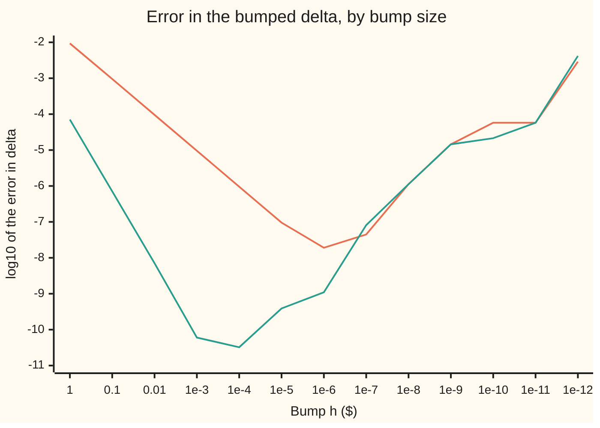

# Numerical derivatives: forward and central differences, and why the step cannot be too small

[Syllabus](../../../SYLLABUS.md) → [Calculus and analysis](../../../SYLLABUS.md#w06) → [What Derivatives Tell You](../../../SYLLABUS.md#w06-s03) → Numerical derivatives

---

## General Overview

A stock trades at $100. A call option on it is the right to buy one share for $100, the **strike**, in one year. With interest at 5% a year, dividends at 2% and volatility (the yearly size of the stock's swings) at 20%, the library's finance example prices it at $9.227005508154 by the Black–Scholes formula. Its **delta** is the derivative of that price with respect to the stock price. The formula's own derivative gives 0.586851146135.

Most pricing code has no formula for the delta, so a risk desk **bumps** the stock: price at $101, subtract the price at $100, divide by the $1 bump. The answer, 0.596254007798, is off in the second decimal place. Bumping $1 each way and dividing by the $2 span gives 0.586780115041, right to three decimals.

Smaller bumps help, for a while. A hundredth of a cent each way gives 0.586851146167, right to ten decimals. A trillionth of a dollar each way gives 0.582645043323, worse than the $1 bump each way. On prices quoted to the cent, a one-cent bump each way returns 0.5000.

Two errors compete. The **truncation error** comes from a finite step standing in for a limit; it shrinks with the step. The **rounding error** comes from prices known to limited digits; dividing by the step magnifies it. The best step balances the two.

**As the step shrinks, a difference quotient's truncation error falls and its rounding error rises; the step to trust is where they meet. A central difference makes that step larger and the answer far more accurate.**

**What kind of fact this is:** an approximation, with its error stated and proved on this card in Why it works.

### The picture: error against step size

The vertical axis is the base-10 logarithm of the error: −6 means an error of one millionth. A bump label such as 1e-3 means 10^−3 dollars.



Orange: forward difference, one bump up. Green: central difference, one bump each way. Each falls while truncation rules, then climbs as rounding takes over. Forward falls one decade per decade of step, central two; central bottoms out at 10^−10.49.

---

## The formula

Write $C(S)$ for the call's value in dollars when the stock stands at $S$ dollars; its derivative $C'(S)$ is the delta. Three primes, $C'''(S)$, mean the third derivative. The bump is $h$ dollars. $C$ is the Black–Scholes price; here it is just a smooth function the code evaluates.

$$D_+(h) = \frac{C(S+h) - C(S)}{h}, \qquad D_0(h) = \frac{C(S+h) - C(S-h)}{2h}$$

**Read it aloud:** forward is the price change over one bump up, per dollar; central is the change from one bump down to one bump up, per dollar of that span.

Their truncation errors, proved below:

$$D_+(h) - C'(S) = \tfrac{h}{2}\,C''(\xi), \qquad D_0(h) - C'(S) = \tfrac{h^2}{6}\,C'''(\xi)$$

**Read it aloud:** forward is off by half the step times the second derivative at some unknown point $\xi$ ("xi") in the range; central by a sixth of the step squared times the third, at another such point.

If each computed price is off by at most $\eta$ dollars, the total errors $E_+$ and $E_0$, each the distance from a computed quotient to the true delta, obey

$$E_+(h) \le \frac{h M_2}{2} + \frac{2\eta}{h}, \qquad E_0(h) \le \frac{h^2 M_3}{6} + \frac{\eta}{h}$$

and the bounds are smallest at

$$h^\ast_+ = 2\sqrt{\eta / M_2}, \qquad h^\ast_0 = \left(3\eta / M_3\right)^{1/3}.$$

**Read it aloud:** the best forward bump grows as the square root of the noise, the best central bump as its cube root.

| Symbol | Plain meaning | In our example | Push it up and the answer… |
| --- | --- | --- | --- |
| $C$ | the call price in dollars, as a function of the stock price | 9.227005508154 at 100 | — |
| $S$ | the stock price where the delta is wanted, in dollars | 100 dollars | moves the target delta itself |
| $h$, $h^\ast$ | the bump in dollars, and the bump that minimises the error bound | 1 dollar down to $10^{-12}$ dollars; best central bump 0.00024 | truncation grows, rounding shrinks |
| $C'$ | the delta: dollars of option per dollar of stock | 0.586851146135 | — |
| $C''$, $C'''$ | the second derivative (gamma, per dollar) and the third (per dollar squared) | 0.018950578755 and −0.000426388022 | larger truncation error at every bump |
| $D_+$, $D_0$; $E_+$, $E_0$ | forward and central difference quotients; their total errors | 0.596254007798 and 0.586780115041 at a 1-dollar bump | — |
| $\eta$, $\varepsilon$ | the most a computed price is off; $\varepsilon$ = $2^{-52}$, the gap between 1 and the next stored double-precision number | 2.05e-15 dollars in full precision, 0.005 on cent quotes | best bump grows |
| $M_2$, $M_3$, $\xi$ | the largest sizes of $C''$ and $C'''$ over the bumped range, and an unknown point inside it | near 0.018950578755 and 0.000426388022 | best bump shrinks |

### When it holds

- **Smooth across the bumped range.** The laws need $C''$ (forward) or $C'''$ (central) continuous from $S - h$ to $S + h$. At a kink there is no derivative to find: the option's value on expiry day, $\max(S - 100, 0)$, has a corner at 100, where forward gives 1 and central 0.5 at every step.
- **Bounded noise.** Double precision gives $\eta$ near $\varepsilon$ times the price; cent quotes give $\eta$ = 0.005. Simulated prices carry random noise instead, the business of [Bump and revalue](../../12-Financial%20mathematics/07-Greeks%20by%20Numbers%20and%20Calibration/01-bump-and-revalue-and-common-random-numbers.md).
- **Rough inputs to the best step.** $M_2$, $M_3$ and $\eta$ are guesses; a factor of ten wrong moves the best step only by the square or cube root of ten, and the error is flat near its minimum.

---

## Why it works

### Step 0: a secant slope is a tangent slope plus a correction

A difference quotient is a chord's slope; the derivative is the tangent's. Taylor's theorem ([Taylor's theorem](05-taylors-theorem.md)) says how far the curve bends from its tangent over a step, so it says how far the two slopes differ.

### Step 1: the forward error is proportional to the step

Taylor's theorem with one term and a remainder gives $C(S+h) = C(S) + h\,C'(S) + \tfrac{h^2}{2} C''(\xi)$ for some $\xi$ between $S$ and $S+h$. Subtract $C(S)$ and divide by $h$: the forward difference equals the delta plus $\tfrac{h}{2} C''(\xi)$. Halve the bump, halve the error. At a 1-dollar bump the law predicts +0.009475289378; the actual error is +0.009402861664. At a one-cent bump the ratio of actual to predicted is 0.99993.

### Step 2: the central error is proportional to the step squared

Expand one term further, once up and once down. The expansions differ in sign only in their odd terms, so subtracting cancels the price and the curvature term exactly. Divide by $2h$: the error is $\tfrac{h^2}{6}$ times a third derivative. Halve the bump, quarter the error. At a 1-dollar bump the law predicts −0.000071064670 against an actual −0.000071031094; at a ten-cent bump the ratio is 1.00000.

<details>
<summary>Detailed proof: the central error</summary>

Suppose $C'''$ is continuous on the interval from $S-h$ to $S+h$. Taylor's theorem with remainder gives
$C(S+h) = C(S) + hC'(S) + \tfrac{h^2}{2}C''(S) + \tfrac{h^3}{6}C'''(\xi_+)$ and
$C(S-h) = C(S) - hC'(S) + \tfrac{h^2}{2}C''(S) - \tfrac{h^3}{6}C'''(\xi_-)$,
with $\xi_+$ in $(S, S+h)$ and $\xi_-$ in $(S-h, S)$. Subtracting and dividing by $2h$:
$D_0(h) - C'(S) = \tfrac{h^2}{6}\cdot\tfrac{C'''(\xi_+) + C'''(\xi_-)}{2}$.
The average lies between the two values, and a continuous function takes every value between two of its values (the intermediate value theorem). So some $\xi$ between $\xi_-$ and $\xi_+$ has $C'''(\xi)$ equal to that average, which gives $D_0(h) - C'(S) = \tfrac{h^2}{6}C'''(\xi)$. The forward case is one term shorter and needs no averaging.

</details>

### Step 3: noise in the prices is divided by the step

A computer stores each price to a fixed number of binary digits, so each carries an error up to $\eta$. A difference of two prices can be off by $2\eta$; forward divides that by $h$, central by $2h$, giving $2\eta/h$ and $\eta/h$. Subtracting two nearly equal prices leaves only their differing digits: this loss is called **cancellation**.

### Step 4: the best step balances the two

The central bound is a rising term, $h^2 M_3/6$, plus a falling one, $\eta/h$. Its rate of change with $h$ is $h M_3/3 - \eta/h^2$. That is zero where $h^3 = 3\eta/M_3$, and the bound is smallest there ([Optimisation](03-monotonicity-and-optimisation.md)). The forward bound, $hM_2/2 + 2\eta/h$, has rate $M_2/2 - 2\eta/h^2$, zero at $h = 2\sqrt{\eta/M_2}$.

In full precision, $\eta$ = 2.05e-15 dollars, giving best bumps of 0.00000066 (forward) and 0.00024 (central). The run's best rows are 1e-6 and 1e-4: within a decade, as much as a rule built on bounds can promise.

Combining central differences at $h$ and $2h$ cancels the $h^2$ term, called Richardson extrapolation; Forward, backward and central differences builds it.

---

## Worked numbers, by hand

| Step | Arithmetic | Value |
| --- | --- | --- |
| price at 100 dollars | the Black–Scholes formula | 9.227005508154 |
| price at 101 and 99 dollars | the same formula, bumped | 9.823259515952 and 8.649699285870 |
| forward, 1-dollar bump | (9.823259515952 − 9.227005508154) / 1 | 0.596254007798 |
| central, 1-dollar bump | (9.823259515952 − 8.649699285870) / 2 | 0.586780115041 |
| exact delta | from its closed form | **0.586851146135** |
| forward error, and its law | h × 0.018950578755 / 2 | +0.009402861664 against +0.009475289378 |
| central error, and its law | h^2 × (−0.000426388022) / 6 | −0.000071031094 against −0.000071064670 |

On cent quotes, $\eta$ = 0.005 and the best bumps move to 1.03 dollars (forward) and 3.28 dollars (central). Central bumps of 1 and 3 dollars give 0.5850 and 0.5867; a one-cent bump gives 0.5000.

### What breaks if you drop a piece

| Mistake | Comes out at | What went wrong |
| --- | --- | --- |
| A trillionth-of-a-dollar bump | 0.582645043323, error 10^−2.38 | Rounding divided by a tiny step |
| Forward instead of central at 1 dollar | 0.596254007798, error 10^−2.03 against 10^−4.15 | The curvature term was left in |
| One-cent bump on cent-quoted prices | 0.5000 | One cent of quote change over a two-cent span |
| Ten-cent bump on cent-quoted prices | 0.6000 | Whole-cent quotes, still too coarse for the span |
| Bump the expiry value $\max(S - 100, 0)$ at 100 | forward 1.000, central 0.500, at $1 and at 1e-6 | A corner: no derivative for either to find |

The code prints all five.

---

## Code, from first principles, and it actually runs

The price formula needs the area under the bell curve $e^{-x^2/2}/\sqrt{2\pi}$ to the left of a point, written N in the code and summed from its own series. Road one bumps the price at 13 step sizes, forward and central. Road two takes the delta and the second and third derivatives from their closed forms. The asserts check that the roads meet, that both truncation laws hold, that the tiniest bump loses to the best, and that cent quotes need a big bump.

### Python

```python
# Numerical derivatives -- the check behind the card.  Python standard library
# only.  The function is the Black-Scholes call price C(S) on the library's
# finance example (K = 100, r = 5%, q = 2%, sigma = 20%, T = 1 year), bumped
# around S = 100.  Road one: difference quotients at 13 step sizes.  Road two:
# the exact delta from its closed form.  Truncation laws and rounding checked.
import math
S0, K, r, q, sig, T = 100.0, 100.0, 0.05, 0.02, 0.20, 1.0
def phi(x): return math.exp(-x * x / 2) / math.sqrt(2 * math.pi)   # bell height
def N(x):                          # bell-curve area left of x, by its own series
    term, total, k = x, x, 0
    while abs(term) > 1e-18 * abs(total):
        k += 1; term *= x * x / (2 * k + 1); total += term
    return 0.5 + phi(x) * total
def d1_of(S): return (math.log(S / K) + (r - q + sig * sig / 2) * T) / (sig * math.sqrt(T))
def call(S):
    d1 = d1_of(S)
    return S * math.exp(-q * T) * N(d1) - K * math.exp(-r * T) * N(d1 - sig * math.sqrt(T))
def cents(S): return math.floor(call(S) * 100 + 0.5) / 100            # a quoted price
def kink(S): return max(S - K, 0.0)                                    # value on expiry day
def fwd(f, h): return (f(S0 + h) - f(S0)) / h
def ctr(f, h): return (f(S0 + h) - f(S0 - h)) / (2 * h)
def lg(x): return math.log(abs(x)) / math.log(10)
d1 = d1_of(S0)
delta = math.exp(-q * T) * N(d1)                                      # road two
c2 = math.exp(-q * T) * phi(d1) / (S0 * sig * math.sqrt(T))           # C'' (gamma)
c3 = -c2 / S0 * (1 + d1 / (sig * math.sqrt(T)))                       # C'''
print(f"call C(100) = {call(S0):.12f}; exact delta e^(-qT)N(d1) = {delta:.12f}")
print(f"C'' = {c2:.12f}; C''' = {c3:.12f}")
steps = [("1", 1.0), ("0.1", 0.1), ("0.01", 0.01), ("1e-3", 1e-3), ("1e-4", 1e-4),
         ("1e-5", 1e-5), ("1e-6", 1e-6), ("1e-7", 1e-7), ("1e-8", 1e-8), ("1e-9", 1e-9),
         ("1e-10", 1e-10), ("1e-11", 1e-11), ("1e-12", 1e-12)]
err_c = {}
for lab, h in steps:
    f, c = fwd(call, h), ctr(call, h)
    err_c[lab] = abs(c - delta)
    print(f"h={lab}: forward {f:.12f} log10 err {lg(f - delta):.2f}; central {c:.12f} log10 err {lg(c - delta):.2f}")
print(f"h=1 by hand: C(101) = {call(101.0):.12f}; C(99) = {call(99.0):.12f}; forward err {fwd(call, 1.0) - delta:+.12f} "
      f"vs h C''/2 = {c2 / 2:+.12f}; central err {ctr(call, 1.0) - delta:+.12f} vs h^2 C'''/6 = {c3 / 6:+.12f}")
rf = (fwd(call, 0.01) - delta) / (0.01 * c2 / 2)      # observed over predicted
rc = (ctr(call, 0.1) - delta) / (0.1 ** 2 * c3 / 6)
print(f"truncation law: forward err / (h C''/2) at h=0.01 = {rf:.5f}; central err / (h^2 C'''/6) at h=0.1 = {rc:.5f}; "
      f"kink max(S-100,0) at h=1, 1e-6: forward {fwd(kink, 1.0):.3f}, {fwd(kink, 1e-6):.3f}; central {ctr(kink, 1.0):.3f}, {ctr(kink, 1e-6):.3f}")
eta = 2.0 ** -52 * call(S0)                           # one unit of rounding in C
print(f"best step: doubles (eta {eta * 1e15:.2f}e-15) forward {2 * math.sqrt(eta / c2):.8f}, central {(3 * eta / -c3) ** (1 / 3):.5f}; "
      f"cents (eta 0.005) forward {2 * math.sqrt(0.005 / c2):.2f}, central {(3 * 0.005 / -c3) ** (1 / 3):.2f}")
cq = {lab: ctr(cents, h) for lab, h in (("0.01", 0.01), ("0.1", 0.1), ("1", 1.0), ("3", 3.0))}
print("cent-rounded prices, central: " + "; ".join(f"h={lab} {v:.4f} err {v - delta:+.4f}" for lab, v in cq.items()))
assert abs(ctr(call, 1e-4) - delta) < 1e-9          # the two roads meet
assert abs(rf - 1) < 1e-3 and abs(rc - 1) < 1e-3     # truncation shrinks as h, h^2
assert err_c["1e-12"] > 1000 * err_c["1e-4"]         # too small a step: rounding wins
assert abs(cq["0.01"] - delta) > 100 * abs(cq["3"] - delta)   # coarse prices want a big step
print("ALL CHECKS PASS")
```

**Ran 2026-09-27 on macOS, Python 3.14.6, standard library only. All checks passed. Output, pasted from the run:**

```
call C(100) = 9.227005508154; exact delta e^(-qT)N(d1) = 0.586851146135
C'' = 0.018950578755; C''' = -0.000426388022
h=1: forward 0.596254007798 log10 err -2.03; central 0.586780115041 log10 err -4.15
h=0.1: forward 0.587797963033 log10 err -3.02; central 0.586850435491 log10 err -6.15
h=0.01: forward 0.586945891922 log10 err -4.02; central 0.586851139029 log10 err -8.15
h=1e-3: forward 0.586860621368 log10 err -5.02; central 0.586851146075 log10 err -10.22
h=1e-4: forward 0.586852093747 log10 err -6.02; central 0.586851146167 log10 err -10.49
h=1e-5: forward 0.586851241025 log10 err -7.02; central 0.586851146522 log10 err -9.41
h=1e-6: forward 0.586851164996 log10 err -7.72; central 0.586851147233 log10 err -8.96
h=1e-7: forward 0.586851101048 log10 err -7.35; central 0.586851065520 log10 err -7.09
h=1e-8: forward 0.586850035234 log10 err -5.95; central 0.586850035234 log10 err -5.95
h=1e-9: forward 0.586865667174 log10 err -4.84; central 0.586865667174 log10 err -4.84
h=1e-10: forward 0.586908299738 log10 err -4.24; central 0.586872772601 log10 err -4.67
h=1e-11: forward 0.586908299738 log10 err -4.24; central 0.586908299738 log10 err -4.24
h=1e-12: forward 0.589750470681 log10 err -2.54; central 0.582645043323 log10 err -2.38
h=1 by hand: C(101) = 9.823259515952; C(99) = 8.649699285870; forward err +0.009402861664 vs h C''/2 = +0.009475289378; central err -0.000071031094 vs h^2 C'''/6 = -0.000071064670
truncation law: forward err / (h C''/2) at h=0.01 = 0.99993; central err / (h^2 C'''/6) at h=0.1 = 1.00000; kink max(S-100,0) at h=1, 1e-6: forward 1.000, 1.000; central 0.500, 0.500
best step: doubles (eta 2.05e-15) forward 0.00000066, central 0.00024; cents (eta 0.005) forward 1.03, central 3.28
cent-rounded prices, central: h=0.01 0.5000 err -0.0869; h=0.1 0.6000 err +0.0131; h=1 0.5850 err -0.0019; h=3 0.5867 err -0.0002
ALL CHECKS PASS
```

### Rust

```rust
// Numerical derivatives -- the check behind the card.  Rust std only.  The
// function is the Black-Scholes call price C(S) on the library's finance
// example (K = 100, r = 5%, q = 2%, sigma = 20%, T = 1 year), bumped around
// S = 100.  Road one: difference quotients at 13 step sizes.  Road two: the
// exact delta from its closed form.  Truncation laws and rounding checked.
const S0: f64 = 100.0;
const K: f64 = 100.0;
const R: f64 = 0.05;
const Q: f64 = 0.02;
const SIG: f64 = 0.20;
const T: f64 = 1.0;
fn phi(x: f64) -> f64 { (-x * x / 2.0).exp() / (2.0 * std::f64::consts::PI).sqrt() }
fn n(x: f64) -> f64 { // bell-curve area left of x, by its own series
    let (mut term, mut total, mut k) = (x, x, 0.0);
    while term.abs() > 1e-18 * total.abs() {
        k += 1.0; term *= x * x / (2.0 * k + 1.0); total += term;
    }
    0.5 + phi(x) * total
}
fn d1_of(s: f64) -> f64 { ((s / K).ln() + (R - Q + SIG * SIG / 2.0) * T) / (SIG * T.sqrt()) }
fn call(s: f64) -> f64 {
    let d1 = d1_of(s);
    s * (-Q * T).exp() * n(d1) - K * (-R * T).exp() * n(d1 - SIG * T.sqrt())
}
fn cents(s: f64) -> f64 { (call(s) * 100.0 + 0.5).floor() / 100.0 } // a quoted price
fn kink(s: f64) -> f64 { (s - K).max(0.0) } // value on expiry day
fn fwd(f: fn(f64) -> f64, h: f64) -> f64 { (f(S0 + h) - f(S0)) / h }
fn ctr(f: fn(f64) -> f64, h: f64) -> f64 { (f(S0 + h) - f(S0 - h)) / (2.0 * h) }
fn lg(x: f64) -> f64 { x.abs().ln() / 10f64.ln() }
fn main() {
    let d1 = d1_of(S0);
    let delta = (-Q * T).exp() * n(d1); // road two
    let c2 = (-Q * T).exp() * phi(d1) / (S0 * SIG * T.sqrt()); // C'' (gamma)
    let c3 = -c2 / S0 * (1.0 + d1 / (SIG * T.sqrt())); // C'''
    println!("call C(100) = {:.12}; exact delta e^(-qT)N(d1) = {:.12}", call(S0), delta);
    println!("C'' = {:.12}; C''' = {:.12}", c2, c3);
    let steps = [("1", 1.0), ("0.1", 0.1), ("0.01", 0.01), ("1e-3", 1e-3), ("1e-4", 1e-4),
        ("1e-5", 1e-5), ("1e-6", 1e-6), ("1e-7", 1e-7), ("1e-8", 1e-8), ("1e-9", 1e-9),
        ("1e-10", 1e-10), ("1e-11", 1e-11), ("1e-12", 1e-12)];
    let mut err_c = std::collections::HashMap::new();
    for (lab, h) in steps {
        let (f, c) = (fwd(call, h), ctr(call, h));
        err_c.insert(lab, (c - delta).abs());
        println!("h={}: forward {:.12} log10 err {:.2}; central {:.12} log10 err {:.2}", lab, f, lg(f - delta), c, lg(c - delta));
    }
    println!("h=1 by hand: C(101) = {:.12}; C(99) = {:.12}; forward err {:+.12} vs h C''/2 = {:+.12}; central err {:+.12} vs h^2 C'''/6 = {:+.12}",
        call(101.0), call(99.0), fwd(call, 1.0) - delta, c2 / 2.0, ctr(call, 1.0) - delta, c3 / 6.0);
    let rf = (fwd(call, 0.01) - delta) / (0.01 * c2 / 2.0); // observed over predicted
    let rc = (ctr(call, 0.1) - delta) / (0.1f64.powi(2) * c3 / 6.0);
    println!("truncation law: forward err / (h C''/2) at h=0.01 = {:.5}; central err / (h^2 C'''/6) at h=0.1 = {:.5}; kink max(S-100,0) at h=1, 1e-6: forward {:.3}, {:.3}; central {:.3}, {:.3}",
        rf, rc, fwd(kink, 1.0), fwd(kink, 1e-6), ctr(kink, 1.0), ctr(kink, 1e-6));
    let eta = 2f64.powi(-52) * call(S0); // one unit of rounding in C
    println!("best step: doubles (eta {:.2}e-15) forward {:.8}, central {:.5}; cents (eta 0.005) forward {:.2}, central {:.2}",
        eta * 1e15, 2.0 * (eta / c2).sqrt(), (3.0 * eta / -c3).powf(1.0 / 3.0),
        2.0 * (0.005 / c2).sqrt(), (3.0 * 0.005 / -c3).powf(1.0 / 3.0));
    let cq: Vec<(&str, f64)> = [("0.01", 0.01), ("0.1", 0.1), ("1", 1.0), ("3", 3.0)]
        .iter().map(|&(lab, h)| (lab, ctr(cents, h))).collect();
    let parts: Vec<String> = cq.iter().map(|(lab, v)| format!("h={} {:.4} err {:+.4}", lab, v, v - delta)).collect();
    println!("cent-rounded prices, central: {}", parts.join("; "));
    assert!((ctr(call, 1e-4) - delta).abs() < 1e-9); // the two roads meet
    assert!((rf - 1.0).abs() < 1e-3 && (rc - 1.0).abs() < 1e-3); // truncation shrinks as h, h^2
    assert!(err_c["1e-12"] > 1000.0 * err_c["1e-4"]); // too small a step: rounding wins
    assert!((cq[0].1 - delta).abs() > 100.0 * (cq[3].1 - delta).abs()); // coarse prices want a big step
    println!("ALL CHECKS PASS");
}
```

**Ran 2026-09-27 on macOS, rustc 1.98.1, no crates. All checks passed. Output, pasted from the run:**

```
call C(100) = 9.227005508154; exact delta e^(-qT)N(d1) = 0.586851146135
C'' = 0.018950578755; C''' = -0.000426388022
h=1: forward 0.596254007798 log10 err -2.03; central 0.586780115041 log10 err -4.15
h=0.1: forward 0.587797963033 log10 err -3.02; central 0.586850435491 log10 err -6.15
h=0.01: forward 0.586945891922 log10 err -4.02; central 0.586851139029 log10 err -8.15
h=1e-3: forward 0.586860621368 log10 err -5.02; central 0.586851146075 log10 err -10.22
h=1e-4: forward 0.586852093747 log10 err -6.02; central 0.586851146167 log10 err -10.49
h=1e-5: forward 0.586851241025 log10 err -7.02; central 0.586851146522 log10 err -9.41
h=1e-6: forward 0.586851164996 log10 err -7.72; central 0.586851147233 log10 err -8.96
h=1e-7: forward 0.586851101048 log10 err -7.35; central 0.586851065520 log10 err -7.09
h=1e-8: forward 0.586850035234 log10 err -5.95; central 0.586850035234 log10 err -5.95
h=1e-9: forward 0.586865667174 log10 err -4.84; central 0.586865667174 log10 err -4.84
h=1e-10: forward 0.586908299738 log10 err -4.24; central 0.586872772601 log10 err -4.67
h=1e-11: forward 0.586908299738 log10 err -4.24; central 0.586908299738 log10 err -4.24
h=1e-12: forward 0.589750470681 log10 err -2.54; central 0.582645043323 log10 err -2.38
h=1 by hand: C(101) = 9.823259515952; C(99) = 8.649699285870; forward err +0.009402861664 vs h C''/2 = +0.009475289378; central err -0.000071031094 vs h^2 C'''/6 = -0.000071064670
truncation law: forward err / (h C''/2) at h=0.01 = 0.99993; central err / (h^2 C'''/6) at h=0.1 = 1.00000; kink max(S-100,0) at h=1, 1e-6: forward 1.000, 1.000; central 0.500, 0.500
best step: doubles (eta 2.05e-15) forward 0.00000066, central 0.00024; cents (eta 0.005) forward 1.03, central 3.28
cent-rounded prices, central: h=0.01 0.5000 err -0.0869; h=0.1 0.6000 err +0.0131; h=1 0.5850 err -0.0019; h=3 0.5867 err -0.0002
ALL CHECKS PASS
```

> [!TIP]
> **Try changing**
> - **Quote to a hundredth of a cent** (100 becomes 10000 in `cents`). Guess first: does the best central bump shrink 100-fold? No: by the cube root of 100.
> - **Bump at a stock of $140.** Guess first: which way does each error move? Truncation shrinks, since the third derivative is smaller there; the rounding floor rises with the larger price.

---

## The usual mistake

> [!warning]
> **Smaller is not safer.** Noise in the prices sets an error floor, and below the best step the error grows again. The trillionth-of-a-dollar bump, 0.582645043323, loses to the crude $1 bump each way.
>
> - **Forward where central is possible.** One extra price turns 10^−2.03 into 10^−4.15 at $1.
> - **A bump chosen once and reused.** The best step depends on the noise: 0.00024 in full precision, $3.28 on cent quotes.
> - **Trusting agreement.** At 1e-8 forward and central agree exactly, at 0.586850035234, and both are wrong in the sixth decimal: they count units of rounding, not a slope.

---

## Where you meet it in real life

- **Risk systems.** Banks compute Greeks, the price's sensitivities such as delta, by bump-and-revalue, often with a bump of 1% of the stock price; [Bump and revalue](../../12-Financial%20mathematics/07-Greeks%20by%20Numbers%20and%20Calibration/01-bump-and-revalue-and-common-random-numbers.md) adds simulation noise.
- **Engineering.** A bridge's sag per unit of steel stiffness comes from bumping a model; [Error propagation](../../13-Engineering%20mathematics/01-Units%20and%20Modelling/07-error-propagation-and-sensitivity.md) carries it through.
- **Gradient checks in machine learning.** A network's coded gradient is tested against central differences before training; Backpropagation computes the gradient exactly.
- **Root finders.** A solver with no slope formula bumps; a bad bump slows [Newton's method](06-newtons-method.md) or stalls it.

> **Say it back**
> A price change divided by the bump estimates a derivative. Taylor's theorem puts the forward error at half the step times the second derivative, the central at a sixth of the step squared times the third. Noise in the prices is divided by the step, so it grows as the step shrinks. The best step balances the two, near the square root of the noise for forward and the cube root for central. On cent quotes that step is dollars, not cents.

---

## What this builds on

- [Taylor's theorem](05-taylors-theorem.md): the remainder term that turns each truncation error into an exact formula.

## Where this goes next

- [Bump and revalue](../../12-Financial%20mathematics/07-Greeks%20by%20Numbers%20and%20Calibration/01-bump-and-revalue-and-common-random-numbers.md): bumping a simulated price, whose noise is random.
- [Error propagation](../../13-Engineering%20mathematics/01-Units%20and%20Modelling/07-error-propagation-and-sensitivity.md): input errors carried through a model by derivatives.
- Backpropagation: exact derivatives by the chain rule, no step.
- Forward, backward and central differences: higher-order formulas and Richardson extrapolation.
- Choosing the step: the step rule in floating-point detail.

---

## Sources

Verified 2026-09-27: every link below resolves to the cited work.

- Driscoll, Tobin A., and Richard J. Braun. *Fundamentals of Numerical Computation*, §5.5 "Convergence of finite differences". [Authors' online book](https://fncbook.com/fd-converge/). Truncation against roundoff, and the best step as a power of machine precision.
- Press, William H., Saul A. Teukolsky, William T. Vetterling, and Brian P. Flannery. *Numerical Recipes: The Art of Scientific Computing*, 3rd ed. Cambridge University Press, 2007. [Authors' site](https://numerical.recipes/). Section 5.7, "Numerical Derivatives": the square-root and cube-root step rules.
- Nocedal, Jorge, and Stephen J. Wright. *Numerical Optimization*, 2nd ed. Springer, 2006. [doi:10.1007/978-0-387-40065-5](https://doi.org/10.1007/978-0-387-40065-5). Chapter 8: finite-difference derivatives inside optimisers, and their accuracy.
- Glasserman, Paul. *Monte Carlo Methods in Financial Engineering*. Springer, 2003. [doi:10.1007/978-0-387-21617-1](https://doi.org/10.1007/978-0-387-21617-1). Chapter 7, "Estimating Sensitivities": bumped Greeks and their bias against their noise.
