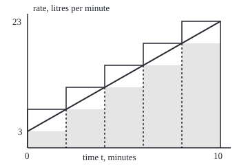
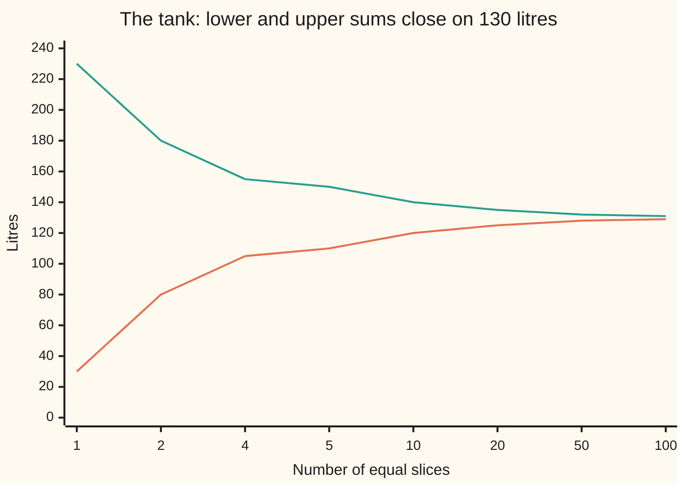

# The integral: area as a limit of thin rectangles

Calculus and analysis → Integrals → Adding up a rate → The integral

---

## General Overview

An empty tank is filled for 10 minutes by a pump that speeds up steadily: at minute t it delivers 3 + 2t litres per minute, so 3 at the start and 23 at the end. How much water is in the tank?

At a fixed rate the answer is rate times time. This rate never holds still, so cut the 10 minutes into thin slices. In each slice, lowest rate times width is too little and highest rate times width too much. With 5 slices the tank holds between 110 and 150 litres; with 100 slices, between 129 and 131. The bracket closes on one number: 130 litres.

Drawn against time, each slice is a thin rectangle and the water is the area under the rate line.

**The integral is the one number above every lower total and below every upper total, when finer slicing can close the gap between them.**

**What kind of fact this is:** a definition; that continuous and monotone rates always close the gap are theorems, proved on this card in Why it works.

### The picture: five slices under the rate line

<p align="center"></p>

To scale: 28 px per minute across, 8 px per litre per minute up. Shaded rectangles use each slice's lowest rate (110 litres in all); the outlined steps use the highest (150 litres). The 130 litres under the line sit between.

---

## The formula

Notation first, in words. The **integral sign** is a stretched S, for "sum", with the start a below and the end b above. After it comes what is added; the closing dt names the variable sliced, here time.

Write $f(t)$ for the rate at time t. Cut the interval from a to b at points $a = t_0 < t_1 < \dots < t_n = b$. That list of cuts is a **partition**, named $P$. Slice k runs from $t_{k-1}$ to $t_k$ and has width $\Delta t_k = t_k - t_{k-1}$. On it, $m_k$ is the rate's **infimum** $\inf$ (the greatest number it never drops below) and $M_k$ its supremum $\sup$ (the least number it never rises above). For a rising rate these are the rates at the slice's two ends.

$$L(P) = \sum_{k=1}^{n} m_k\,\Delta t_k \qquad U(P) = \sum_{k=1}^{n} M_k\,\Delta t_k$$

**Read it aloud:** the lower sum adds each slice's lowest rate times its width; the upper sum uses the highest rate.

The rate is **integrable** when exactly one number lies between every lower sum and every upper sum. That number is the integral:

$$\int_a^b f(t)\,dt = \sup_P L(P) = \inf_P U(P)$$

**Read it aloud:** the integral of f from a to b is the best lower sum, which equals the best upper sum.

| Symbol | Plain meaning | In our example | Push it up and the answer… |
| --- | --- | --- | --- |
| $f$ | the rate being added up | 3 + 2t litres per minute | more water |
| $t$, $a$, $b$ | time, and the start and end of the interval | minutes 0 and 10 | a later end adds water |
| $n$, $k$ | number of slices, and a slice's counter | 5 slices, k = 1 to 5 | the bracket narrows |
| $P$, $t_k$ | the partition, and its k-th cut | cuts 0, 2, 4, 6, 8, 10 | more cuts never loosen it |
| $\Delta t_k$ | width of slice k | 2 minutes | wider slices, looser bracket |
| $m_k$, $M_k$, $\inf$, $\sup$ | lowest and highest rate on slice k | 3 and 7 on the first slice | — |
| $L$, $U$ | lower and upper sums | 110 and 150 litres | — |
| $\int_a^b f(t)\,dt$ | the integral | 130 litres | — |

Units multiply: litres per minute times minutes gives litres.

### When it holds

- **A bounded rate.** A rate like 1/t grows without limit near t = 0, so a slice starting there has no highest rate and no upper sum; [improper-integrals](07-improper-integrals.md) adds a second limit.
- **A closed, finite interval.** An endless interval needs the same second limit.
- **Continuous or monotone is enough.** Monotone means only rising or only falling, jumps allowed. A rate with neither can fail: the fraction rule in What breaks.
- **Signs count.** A negative rate (the tank draining) subtracts, so the integral is a signed area.

---

## Why it works

### Step 0: a lower total can never pass an upper total

Every lower sum is at most every upper sum, even from different slicings. So the lower sums have a ceiling, and completeness (the real numbers have no gaps, [supremum-and-completeness](../01-Limits%20and%20Continuity/02-supremum-and-completeness.md)) supplies a best lower sum and a best upper sum.

### Step 1: an extra cut tightens the bracket

Cut the 10 minutes at 5 only: lower sum 80 litres, upper 180. Add a cut at 2: the lower sum rises to 92, the upper falls to 168. A piece of a slice has a lowest rate no lower, and a highest no higher, than the whole slice.

For two slicings P and Q, take their **common refinement**, which uses both sets of cuts. The lower sum of P is at most the refinement's lower sum, which is at most its upper sum, which is at most the upper sum of Q. Step 0 is proved.

### Step 2: the gap test

If every tolerance has a slicing whose upper minus lower is smaller, the best lower and best upper sums sit closer than every tolerance, so they are equal. For the tank, a gap of at most 1 litre first appears at 200 equal slices, each 0.05 minutes wide; 0.01 litres needs 20000.

### Step 3: monotone rates pass the test

Cut a rising rate into n equal slices. Upper minus lower is, slice by slice, right-end rate minus left-end rate, times the width. Each slice's right end is the next one's left end, so the differences cancel in a chain and leave f(b) − f(a). A falling rate swaps the ends:

$$U - L = \frac{b - a}{n}\,\bigl|f(b) - f(a)\bigr|$$

For the tank: 10/n times 23 − 3, or 200/n litres. No formula for the rate was used, so jumps are fine: the code's second case opens the valve wider at minute 4, from 3 to 8 litres per minute, and its gap is 50/n.

### Step 4: continuous rates pass the test

The tank's rate climbs 2 litres per minute each minute, so within a slice of width w its rates differ by at most 2w, and the gap is at most 2w × 10. Width 0.05 holds it to 1 litre.

A general continuous rate has no fixed climb. On a closed interval, though, it is **uniformly continuous** ([uniform-continuity-and-lipschitz](../01-Limits%20and%20Continuity/08-uniform-continuity-and-lipschitz.md)): for every tolerance on the rate, one width works everywhere, so any two times closer than it have rates within that tolerance. Take the rate tolerance as the total tolerance over the interval's length and slice that finely.

<details>
<summary>Detailed proof</summary>

Write ε (epsilon) for a tolerance and δ (delta) for a width.

**Gap test.** Let I₋ = sup L(P) and I₊ = inf U(P); Step 1 gives I₋ ≤ I₊. If every ε > 0 has a P with U(P) − L(P) < ε, then 0 ≤ I₊ − I₋ < ε for all ε, so they are equal.

**Continuous implies integrable.** A continuous f on [a, b] is uniformly continuous. Given ε, take δ so that |s − u| < δ forces |f(s) − f(u)| < ε/(2(b − a)). On any slice narrower than δ every two rates differ by less than that, so M_k − m_k ≤ ε/(2(b − a)). Multiplying by widths and adding, U − L ≤ ε/2 < ε.

</details>

### Step 5: compute one from the definition

The tank's cuts are t_k = 10k/n. The lower sum uses left ends:

$$L = \sum_{k=0}^{n-1}\Bigl(3 + 2\cdot\tfrac{10k}{n}\Bigr)\tfrac{10}{n} = 30 + \tfrac{200}{n^2}\sum_{k=0}^{n-1} k$$

The count 0 + 1 + … + (n − 1) is n(n − 1)/2, by induction. So L = 130 − 100/n, and right ends give U = 130 + 100/n. Both close on 130 litres. Geometry agrees: a 3-by-10 rectangle holds 30, the triangle above it (base 10, height 20) holds 100.

Riemann's own version samples one point anywhere in each slice. Any such sum lies between L and U, so it is squeezed to the same number; [numerical-integration](08-numerical-integration.md) chooses the points to get close with few slices.

---

## Worked numbers, by hand

| Step | Arithmetic | Value |
| --- | --- | --- |
| 5 slices of 2 minutes | cuts 0, 2, 4, 6, 8, 10 | rates 3, 7, 11, 15, 19, 23 |
| lower sum | 2 × (3 + 7 + 11 + 15 + 19) | 110 litres |
| upper sum | 2 × (7 + 11 + 15 + 19 + 23) | 150 litres |
| gap | 200 / 5 | 40 litres |
| 100 slices | 130 − 100/100 and 130 + 100/100 | 129 and 131 |
| 1000 slices | 130 ∓ 100/1000 | 129.9 and 130.1 |
| the limit | both tend to it | **130 litres** |

After 10 minutes the tank holds 130 litres; no slicing, however fine, can say otherwise.



The rising line is the lower sum, the falling line the upper sum. The x axis lists slice counts, not to scale.

### What breaks if you drop a piece

| Mistake | Comes out at | What went wrong |
| --- | --- | --- |
| 10-slice lower sum reported as the total | 120 litres | a bound, not the total |
| Add the 20 right-end rates, forget the widths | 270 | litres per minute summed, not litres |
| Fraction rule on [0, 1]: 1 at fractions, else 0 | lower 0, upper 1 at every n | neither continuous nor monotone |

A fraction here is a ratio of whole numbers. Every slice holds one, its left end k/n, and a non-fraction, k/n + √2/(4n), since a fraction plus a nonzero fraction times √2 is never a fraction. So the fraction rule's gap stays 1 at 4, 100 or 10000 slices.

---

## Code, from first principles, and it actually runs

Nothing is imported. The total is reached three ways: slice-by-slice sums, the closed form 130 ∓ 100/n, and the geometry. The asserts check that the first two agree, that the geometry sits in every bracket with gap 200/n, that a cut tightens, and that the valve traps 60 litres with gap 50/n.

### Python

```python
# The Riemann integral -- the check behind the card.  Nothing is imported.
# A tank fills at f(t) = 3 + 2t litres per minute from t = 0 to t = 10 minutes.
# Road one: lower and upper sums, slice by slice.  Road two: the closed form
# 130 -/+ 100/n, from 0 + 1 + ... + (n - 1) = n(n - 1)/2.  Road three: geometry,
# a 3-by-10 rectangle under a triangle of base 10 and height 20.
def rate(t):
    return 3 + 2 * t

def valve(t):                             # second case: the valve opens wider at t = 4
    return 3 if t < 4 else 8

def sums(f, cuts):                        # a monotone rate is lowest and highest at slice ends
    lo = hi = 0.0
    for s, u in zip(cuts, cuts[1:]):
        lo += min(f(s), f(u)) * (u - s)
        hi += max(f(s), f(u)) * (u - s)
    return lo, hi

def even(n, a=0, b=10):
    return [a + (b - a) * k / n for k in range(n + 1)]

def gap(f, n):
    lo, hi = sums(f, even(n))
    return hi - lo

def row(xs, d):
    return ", ".join(f"{x:.{d}f}" for x in xs)

geometry = 3 * 10 + 10 * 20 / 2
print(f"tank: rate 3 + 2t litres per minute, {rate(0):.0f} at t = 0, {rate(10):.0f} at t = 10; "
      f"geometry 3 x 10 + 10 x 20 / 2 = {geometry:.1f}")
for n in (5, 10, 100, 1000):
    lo, hi = sums(rate, even(n))
    print(f"n = {n}, width {10 / n:g}: lower {lo:.1f}, upper {hi:.1f}, gap {hi - lo:.1f}")
    assert abs(lo - (130 - 100 / n)) < 1e-9 and abs(hi - (130 + 100 / n)) < 1e-9  # road 1 = road 2
    assert lo <= geometry <= hi and abs((hi - lo) * n - 200) < 1e-6         # road 3 trapped, gap 200/n
print(f"n = 5, rate at each cut: {row([rate(t) for t in even(5)], 0)}")
ns = [1, 2, 4, 5, 10, 20, 50, 100]
print(f"chart n: {row(ns, 0)}; lower: {row([sums(rate, even(n))[0] for n in ns], 0)}")
print(f"chart upper: {row([sums(rate, even(n))[1] for n in ns], 0)}")
c, r = sums(rate, [0, 5, 10]), sums(rate, [0, 2, 5, 10])
print(f"refine: cuts 0, 5, 10 give lower {c[0]:.1f}, upper {c[1]:.1f}; a cut at 2 gives {r[0]:.1f}, {r[1]:.1f}")
assert c[0] <= r[0] <= geometry <= r[1] <= c[1]                        # extra cut tightens
n1 = next(n for n in range(1, 10**4) if gap(rate, n) <= 1 + 1e-9)   # road one, searched
n2 = next(n for n in range(19900, 20100) if gap(rate, n) <= 0.01 + 1e-9)
print(f"gap at most 1 litre first at n = {n1}, width {10 / n1:g}; at most 0.01 litres needs n = {n2}")
for n in (7, 100):
    lo, hi = sums(valve, even(n))
    print(f"valve, exact 3 x 4 + 8 x 6 = 60, n = {n}: lower {lo:.3f}, upper {hi:.3f}, gap {hi - lo:.3f}")
    assert lo - 1e-9 <= 3 * 4 + 8 * 6 <= hi and abs((hi - lo) * n - 50) < 1e-6  # gap (8 - 3) x 10 / n
xs = [40 + 28 * t for t in even(5)]
print(f"figure, 28 px per minute, 8 px per litre/min; slice edges x = {row(xs, 0)}")
print(f"figure, lower tops y = {row([215 - 8 * rate(t) for t in even(5)[:-1]], 0)}; "
      f"upper tops y = {row([215 - 8 * rate(t) for t in even(5)[1:]], 0)}")
print(f"mistake 1, lower sum at n = 10 taken as the total: {sums(rate, even(10))[0]:.1f}")
print(f"mistake 2, 20 slice rates added without widths: {sum(rate(t) for t in even(20)[1:]):.1f}")
inside = all(k / n < k / n + 2 ** 0.5 / (4 * n) < (k + 1) / n for n in (4, 100, 10000) for k in range(n))
print(f"mistake 3, fraction rule on [0, 1]: a sqrt(2) tag inside every slice: {'yes' if inside else 'no'}; "
      f"lower 0, upper 1 at n = 4, 100, 10000")
print("ALL CHECKS PASS")
```

**Ran 2026-09-27 on macOS, Python 3.14.6, standard library only. All checks passed. Output, pasted from the run:**

```
tank: rate 3 + 2t litres per minute, 3 at t = 0, 23 at t = 10; geometry 3 x 10 + 10 x 20 / 2 = 130.0
n = 5, width 2: lower 110.0, upper 150.0, gap 40.0
n = 10, width 1: lower 120.0, upper 140.0, gap 20.0
n = 100, width 0.1: lower 129.0, upper 131.0, gap 2.0
n = 1000, width 0.01: lower 129.9, upper 130.1, gap 0.2
n = 5, rate at each cut: 3, 7, 11, 15, 19, 23
chart n: 1, 2, 4, 5, 10, 20, 50, 100; lower: 30, 80, 105, 110, 120, 125, 128, 129
chart upper: 230, 180, 155, 150, 140, 135, 132, 131
refine: cuts 0, 5, 10 give lower 80.0, upper 180.0; a cut at 2 gives 92.0, 168.0
gap at most 1 litre first at n = 200, width 0.05; at most 0.01 litres needs n = 20000
valve, exact 3 x 4 + 8 x 6 = 60, n = 7: lower 58.571, upper 65.714, gap 7.143
valve, exact 3 x 4 + 8 x 6 = 60, n = 100: lower 60.000, upper 60.500, gap 0.500
figure, 28 px per minute, 8 px per litre/min; slice edges x = 40, 96, 152, 208, 264, 320
figure, lower tops y = 191, 159, 127, 95, 63; upper tops y = 159, 127, 95, 63, 31
mistake 1, lower sum at n = 10 taken as the total: 120.0
mistake 2, 20 slice rates added without widths: 270.0
mistake 3, fraction rule on [0, 1]: a sqrt(2) tag inside every slice: yes; lower 0, upper 1 at n = 4, 100, 10000
ALL CHECKS PASS
```

### Rust

Same numbers, same labels, built with `rustc --edition 2021 -O`.

```rust
// The Riemann integral -- the same check as the Python, in Rust.  No crates.
// A tank fills at f(t) = 3 + 2t litres per minute from t = 0 to t = 10 minutes.
// Road one: lower and upper sums, slice by slice.  Road two: the closed form
// 130 -/+ 100/n, from 0 + 1 + ... + (n - 1) = n(n - 1)/2.  Road three: geometry,
// a 3-by-10 rectangle under a triangle of base 10 and height 20.
fn rate(t: f64) -> f64 { 3.0 + 2.0 * t }

fn valve(t: f64) -> f64 { if t < 4.0 { 3.0 } else { 8.0 } }   // second case: wider at t = 4

fn sums(f: fn(f64) -> f64, cuts: &[f64]) -> (f64, f64) {     // monotone: extremes at slice ends
    let (mut lo, mut hi) = (0.0, 0.0);
    for w in cuts.windows(2) {
        let (s, u) = (w[0], w[1]);
        lo += f(s).min(f(u)) * (u - s);
        hi += f(s).max(f(u)) * (u - s);
    }
    (lo, hi)
}

fn even(n: usize) -> Vec<f64> { (0..=n).map(|k| 10.0 * k as f64 / n as f64).collect() }

fn gap(f: fn(f64) -> f64, n: usize) -> f64 { let (lo, hi) = sums(f, &even(n)); hi - lo }

fn row(xs: &[f64], d: usize) -> String {
    xs.iter().map(|x| format!("{:.*}", d, x)).collect::<Vec<_>>().join(", ")
}

fn main() {
    let geometry = 3.0 * 10.0 + 10.0 * 20.0 / 2.0;
    println!("tank: rate 3 + 2t litres per minute, {:.0} at t = 0, {:.0} at t = 10; geometry 3 x 10 + 10 x 20 / 2 = {:.1}",
             rate(0.0), rate(10.0), geometry);
    for n in [5usize, 10, 100, 1000] {
        let (lo, hi) = sums(rate, &even(n));
        let nf = n as f64;
        println!("n = {}, width {}: lower {:.1}, upper {:.1}, gap {:.1}", n, 10.0 / nf, lo, hi, hi - lo);
        assert!((lo - (130.0 - 100.0 / nf)).abs() < 1e-9 && (hi - (130.0 + 100.0 / nf)).abs() < 1e-9);
        assert!(lo <= geometry && geometry <= hi && ((hi - lo) * nf - 200.0).abs() < 1e-6);
    }
    println!("n = 5, rate at each cut: {}", row(&even(5).iter().map(|&t| rate(t)).collect::<Vec<_>>(), 0));
    let ns = [1usize, 2, 4, 5, 10, 20, 50, 100];
    let nsf: Vec<f64> = ns.iter().map(|&n| n as f64).collect();
    let lows: Vec<f64> = ns.iter().map(|&n| sums(rate, &even(n)).0).collect();
    let highs: Vec<f64> = ns.iter().map(|&n| sums(rate, &even(n)).1).collect();
    println!("chart n: {}; lower: {}", row(&nsf, 0), row(&lows, 0));
    println!("chart upper: {}", row(&highs, 0));
    let (c, r) = (sums(rate, &[0.0, 5.0, 10.0]), sums(rate, &[0.0, 2.0, 5.0, 10.0]));
    println!("refine: cuts 0, 5, 10 give lower {:.1}, upper {:.1}; a cut at 2 gives {:.1}, {:.1}", c.0, c.1, r.0, r.1);
    assert!(c.0 <= r.0 && r.0 <= geometry && geometry <= r.1 && r.1 <= c.1);   // extra cut tightens
    let n1 = (1..10_000).find(|&n| gap(rate, n) <= 1.0 + 1e-9).unwrap();         // road one, searched
    let n2 = (19_900..20_100).find(|&n| gap(rate, n) <= 0.01 + 1e-9).unwrap();
    println!("gap at most 1 litre first at n = {}, width {}; at most 0.01 litres needs n = {}", n1, 10.0 / n1 as f64, n2);
    for n in [7usize, 100] {
        let (lo, hi) = sums(valve, &even(n));
        println!("valve, exact 3 x 4 + 8 x 6 = 60, n = {}: lower {:.3}, upper {:.3}, gap {:.3}", n, lo, hi, hi - lo);
        let exact = 3.0 * 4.0 + 8.0 * 6.0;
        assert!(lo - 1e-9 <= exact && exact <= hi && ((hi - lo) * n as f64 - 50.0).abs() < 1e-6);
    }
    let e5 = even(5);
    let xs: Vec<f64> = e5.iter().map(|t| 40.0 + 28.0 * t).collect();
    let low_y: Vec<f64> = e5[..5].iter().map(|&t| 215.0 - 8.0 * rate(t)).collect();
    let up_y: Vec<f64> = e5[1..].iter().map(|&t| 215.0 - 8.0 * rate(t)).collect();
    println!("figure, 28 px per minute, 8 px per litre/min; slice edges x = {}", row(&xs, 0));
    println!("figure, lower tops y = {}; upper tops y = {}", row(&low_y, 0), row(&up_y, 0));
    println!("mistake 1, lower sum at n = 10 taken as the total: {:.1}", sums(rate, &even(10)).0);
    let heights: f64 = even(20)[1..].iter().map(|&t| rate(t)).sum();
    println!("mistake 2, 20 slice rates added without widths: {:.1}", heights);
    let inside = [4usize, 100, 10000].iter().all(|&n| (0..n).all(|k| {
        let (s, u, tag) = (k as f64 / n as f64, (k + 1) as f64 / n as f64,
                           k as f64 / n as f64 + 2f64.sqrt() / (4.0 * n as f64));
        s < tag && tag < u
    }));
    println!("mistake 3, fraction rule on [0, 1]: a sqrt(2) tag inside every slice: {}; lower 0, upper 1 at n = 4, 100, 10000",
             if inside { "yes" } else { "no" });
    println!("ALL CHECKS PASS");
}
```

**Ran 2026-09-27 on macOS, rustc 1.98.1, no crates. All checks passed. Output, pasted from the run:**

```
tank: rate 3 + 2t litres per minute, 3 at t = 0, 23 at t = 10; geometry 3 x 10 + 10 x 20 / 2 = 130.0
n = 5, width 2: lower 110.0, upper 150.0, gap 40.0
n = 10, width 1: lower 120.0, upper 140.0, gap 20.0
n = 100, width 0.1: lower 129.0, upper 131.0, gap 2.0
n = 1000, width 0.01: lower 129.9, upper 130.1, gap 0.2
n = 5, rate at each cut: 3, 7, 11, 15, 19, 23
chart n: 1, 2, 4, 5, 10, 20, 50, 100; lower: 30, 80, 105, 110, 120, 125, 128, 129
chart upper: 230, 180, 155, 150, 140, 135, 132, 131
refine: cuts 0, 5, 10 give lower 80.0, upper 180.0; a cut at 2 gives 92.0, 168.0
gap at most 1 litre first at n = 200, width 0.05; at most 0.01 litres needs n = 20000
valve, exact 3 x 4 + 8 x 6 = 60, n = 7: lower 58.571, upper 65.714, gap 7.143
valve, exact 3 x 4 + 8 x 6 = 60, n = 100: lower 60.000, upper 60.500, gap 0.500
figure, 28 px per minute, 8 px per litre/min; slice edges x = 40, 96, 152, 208, 264, 320
figure, lower tops y = 191, 159, 127, 95, 63; upper tops y = 159, 127, 95, 63, 31
mistake 1, lower sum at n = 10 taken as the total: 120.0
mistake 2, 20 slice rates added without widths: 270.0
mistake 3, fraction rule on [0, 1]: a sqrt(2) tag inside every slice: yes; lower 0, upper 1 at n = 4, 100, 10000
ALL CHECKS PASS
```

The two outputs match line for line.

> [!TIP]
> **Try changing**
> - **Guess first:** double each slice count in `(5, 10, 100, 1000)`. Each gap halves, since it is 200/n; every assert passes.
> - **Guess first:** open the valve at 4.5 minutes instead of 4. The true total falls below 60, so the valve assert fails.
> - **Guess first:** make the rate `3 + 2.1 * t`. Road two still says 130 ∓ 100/n, so the first assert stops the run.

---

## The usual mistake

> [!warning]
> **Treating one sum as the integral.** 10 slices give bounds of 120 and 140 litres, not 130. The integral is what the bounds are forced to.
>
> - **Forgetting the width.** Adding the 20 right-end rates gives 270, a count of litres per minute; times the half-minute widths it is the upper sum, 135 litres.
> - **Trusting samples.** Sampling the fraction rule at fractions reports 1 every time, yet it has no integral.
> - **Reading dt as zero.** It names the variable; every slice here has a positive width.

---

## Where you meet it in real life

- **Water and gas meters.** A meter adds flow rate times short time steps, an integral read in litres.
- **Energy bills.** Kilowatts added over hours give kilowatt-hours.
- **Credit risk.** A default rate integrated over years sets a borrower's survival chance: [hazard-rate-and-survival-probability](../../12-Financial%20mathematics/41-Default%2C%20Survival%20and%20the%20Hazard%20Rate/02-hazard-rate-and-survival-probability.md).

> **Say it back**
> Slice the interval. Lowest rate times width is too little, highest too much. Extra cuts only tighten the bracket, and no lower total passes an upper one. When the bracket closes below any tolerance, the number left is the integral. Monotone and continuous rates always close it; the tank closes on 130 litres.

---

## What this builds on

- [sequences-and-limits](../01-Limits%20and%20Continuity/03-sequences-and-limits.md): the lower sums 130 − 100/n as a sequence with a limit.
- [supremum-and-completeness](../01-Limits%20and%20Continuity/02-supremum-and-completeness.md): the best lower and upper sums exist because the real numbers have no gaps.

## Where this goes next

- [fundamental-theorem-of-calculus](02-fundamental-theorem-of-calculus.md): integrals from antiderivatives.
- [numerical-integration](08-numerical-integration.md): sample points that close the gap fast.
- [arc-length](../05-Curves%20and%20Solids/02-arc-length.md): length as an integral.
- [swapping-limits-with-integrals-and-derivatives](../06-Series/08-swapping-limits-with-integrals-and-derivatives.md): limits passing through integrals.
- [double-integrals](../08-Multiple%20Integrals/01-double-integrals.md): brackets over a rectangle.
- [riemann-stieltjes-integral](../08-Multiple%20Integrals/06-riemann-stieltjes-integral.md): widths measured by another function.
- [why-a-new-integral](../../10-Measure%20and%20integration/01-Sets%20You%20Can%20Measure/01-why-a-new-integral.md): an integral for the fraction rule.
- [riemann-meets-lebesgue](../../10-Measure%20and%20integration/04-The%20Lebesgue%20Integral/05-riemann-meets-lebesgue.md): which rates this definition accepts.
- [ito-integral](../../11-Stochastic%20processes%20and%20calculus/06-Ito%20Calculus/01-ito-integral.md): sums against a random path.
- [hazard-rate-and-survival-probability](../../12-Financial%20mathematics/41-Default%2C%20Survival%20and%20the%20Hazard%20Rate/02-hazard-rate-and-survival-probability.md): survival from a default rate.
- [cds-legs-risky-annuity-and-par-spread](../../12-Financial%20mathematics/42-Credit%20Default%20Swaps%20-%20Pricing%2C%20the%20Par%20Spread%20and%20the%20Hazard%20Behind%20It/02-cds-legs-risky-annuity-and-par-spread.md): swap legs as integrals over time.
- newton-cotes-and-composite-rules: slicing rules with error bounds.
- average-orders-and-the-hyperbola-method: sums compared with integrals.
- abel-and-partial-summation: sums turned into integrals.

The tank reached 130 only because a counting formula was at hand; most rates have none, and the fundamental theorem of calculus replaces the sum with an antiderivative.

---

## Sources

Verified 2026-09-27: every link below resolves to the publisher's page.

- Lebl, Jiří. *Basic Analysis I*, §5.1 "The Riemann integral". [Author's page](https://www.jirka.org/ra/html/sec_rint.html). Free; lower and upper sums and refinement.
- Abbott, Stephen. *Understanding Analysis*, 2nd ed. Springer, 2015. [Publisher page](https://link.springer.com/book/10.1007/978-1-4939-2712-8). Builds the integral from upper and lower sums.
- O'Connor, J. J., and E. F. Robertson. "Gaston Darboux." MacTutor Archive, University of St Andrews. [Biography](https://mathshistory.st-andrews.ac.uk/Biographies/Darboux/). His 1875 upper and lower sums, used here.
