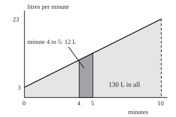
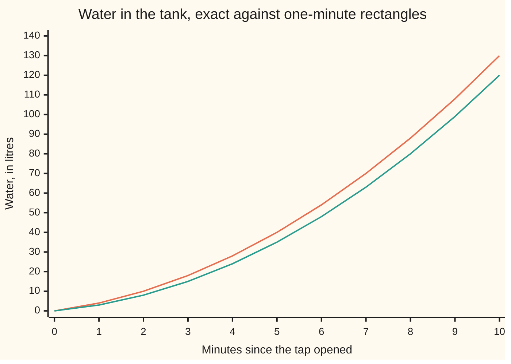

# Fundamental theorem of calculus: accumulation and rate are inverse operations

[Syllabus](../../../SYLLABUS.md) → [Calculus and analysis](../../../SYLLABUS.md#w06) → [Integrals](../../../SYLLABUS.md#w06-s04) → Fundamental theorem of calculus

---

## General Overview

An empty tank fills from a tap. The water starts at 3 litres a minute and the flow rises by 2 litres a minute every minute: 11 at minute 4, 23 at minute 10. How much water is in after 10 minutes?

Rectangles answer it ([The integral](01-riemann-integral.md)). Ten strips put it between 120 and 140 litres; a thousand, between 129.9 and 130.1. The sums close in on 130 without reaching it.

A one-line route exists. The formula 3t + t^2, with t in minutes, grows at 3 + 2t litres a minute: the tap's own rate. Read it at minute 10 and minute 0 and subtract: 130 − 0 = 130 litres, exactly.

Accumulating and taking a rate undo each other. Pile up a rate and a running total appears; ask how fast that total grows and the rate comes back.

**Adding up a rate over an interval gives the change in any function whose rate it is, and the running total of a continuous rate grows at exactly that rate.**

**What kind of fact this is:** a theorem, both halves proved on this card in Why it works, for continuous rates.

### The picture: ten minutes of flow, drawn to scale

<p align="center"></p>

Scale: 28 units across per minute, 7 up per litre a minute. The sloping line is the flow; the pale region is the water, 130 litres; the dark strip is one minute's worth, 12 litres.

---

## The formula

Notation first, in words. A function whose derivative is f is an **antiderivative** of f: it runs the derivative backwards. An integral with a letter x as its upper end is a **running total**, a function of where the interval stops; the t inside only counts time along the way.

The first half says the running total grows at the rate:

$$A(x) = \int_a^x f(t)\,dt \quad\text{has}\quad A'(x) = f(x)$$

**Read it aloud:** the litres in by minute x grow at the flow rate at minute x.

The second half turns an antiderivative into a total:

$$\int_a^b f(t)\,dt = G(b) - G(a) \quad\text{whenever}\quad G'(t) = f(t)$$

**Read it aloud:** the water from minute a to minute b is the antiderivative at the end minus the antiderivative at the start.

| Symbol | Plain meaning | In our example | Push it up and the answer… |
| --- | --- | --- | --- |
| $f$ | the rate, a function of time | 3 + 2t litres a minute | more water |
| $t$ | time inside the integral; its name is free | minutes, 0 to 10 | — |
| $a$, $b$ | start and end of the interval | minute 0 and minute 10 | a later end collects more water |
| $x$ | a movable end point | minute 4 | the running total grows |
| $A$ | the running total, built from sums alone | 28 litres at minute 4 | — |
| $G$, $C$ | an antiderivative, and the constant any antiderivative may carry | 3t + t^2, with no constant added | the constant cancels in the subtraction |
| $h$ | a small step past x | 1, 0.1, 0.01 minutes | the step's average drifts from the rate |

Units: the running total is in litres, so its rate is litres per minute, the same unit as the flow.

### When it holds

- **The rate is continuous.** A valve snapping open at minute 5, from 0 to 4 litres a minute, leaves a total with slope 0 just before and 4 just after: a corner, no derivative. (The second half needs only that the rate has an integral.)
- **The rate stays finite on a closed interval.** 1/t^2 on −1 to 1 is never negative, yet the formula gives −2 while the sums climb past 4,900: [Improper integrals](07-improper-integrals.md).
- **G has rate f at every inside point, with no break.** −1/t has rate 1/t^2 everywhere except 0; that gap produced the −2.
- **The total is signed.** A draining tank's water counts negative; swapping a and b flips the sign.

---

## Why it works

### Step 0: new water is about rate times time

In a short slice of time the flow barely changes, so the water arriving is close to the flow times the slice's length. The theorem is that sentence made exact, once in each direction.

### Step 1: the running total grows at the rate

Step h minutes past minute 4. The water arriving is $A(4 + h) - A(4)$. Meanwhile the flow stays between f(4) = 11 and f(4 + h) = 11 + 2h, so the slice's one-strip lower and upper sums are 11h and (11 + 2h)h, and the water lies between them. Divide by h: the slice's average rate lies between 11 and 11 + 2h. Computed from sums alone, the average reads 12 for a step of 1 minute, 11.1 for 0.1, 11.01 for 0.01.

The limit, played with numbers: to land within 0.001 of 11, keep the step below 0.0005 minutes, so 11 + 2h stays below 11.001. At h = 0.0005 the average reads 11.0005.

For any continuous rate, the slice's lowest and highest rates both head for f(x) as h heads for 0; that is what continuity means. The average is trapped between them, so $A'(x) = f(x)$. A negative step uses the slice on the left and ends the same way.

### Step 2: an antiderivative's changes add up to the total

Cut the ten minutes at each whole minute. G's change over the run is the sum of its ten one-minute changes; every middle value appears once with a plus and once with a minus, and cancels. A sum that collapses like this is **telescoping**.

The [Mean value theorem](../03-What%20Derivatives%20Tell%20You/02-mean-value-theorem.md) says each one-minute change equals G's rate at some inside point, times one minute. G's rate is f, so each change is one rectangle. For the tank that point is the half minute: over minute k, G changes by 2k + 2, and f(k − 0.5) = 2k + 2. The ten changes, 4, 6, up to 22, add to 130.

So $G(b) - G(a)$ is a rectangle sum for every cut of the interval. It therefore sits between the lower and upper sums for every cut, and the integral is the only number that does.

<details>
<summary>Detailed proof</summary>

**First half.** Let f be continuous on the closed interval from a to b, x in it, and $\varepsilon > 0$ a target closeness. Continuity gives $\delta > 0$ with $\lvert f(t) - f(x)\rvert < \varepsilon$ whenever $\lvert t - x\rvert < \delta$. For $0 < h < \delta$,

$$\frac{A(x+h) - A(x)}{h} - f(x) = \frac{1}{h}\int_x^{x+h} \bigl(f(t) - f(x)\bigr)\,dt.$$

The inner rate stays within $\varepsilon$ of 0 across the slice, so the slice's lower and upper sums bound the right side by $\varepsilon$ in size. For $-\delta < h < 0$ the slice runs from x + h to x, with the same bound. At a or b only the inward step exists: a one-sided derivative.

**Second half.** Let G be continuous on the closed interval, with G' = f at every inside point, and let f have an integral. Cut at points a = p0 < p1 < … < pn = b. The mean value theorem gives, in piece k, a point ck with G(pk) − G(pk−1) = f(ck)(pk − pk−1). Adding, the left side telescopes to G(b) − G(a); the right is a rectangle sum, between this cut's lower and upper sums, as is the integral. Some cut makes upper minus lower smaller than any $\varepsilon > 0$, so the two numbers are equal. Continuity of f was never used.

</details>

### Step 3: every continuous rate has an antiderivative, and the constant cancels

Step 1 builds an antiderivative for every continuous rate, the running total A, even for e^(−t^2), whose running total has no formula in powers, roots, exponentials, logs or trig. Two antiderivatives differ by a constant C, since their difference has rate 0 and the mean value theorem forbids it to change. C shifts G(b) and G(a) alike and cancels.

A second case: sin has antiderivative −cos, so one arch of sin, from 0 to pi, holds −cos(pi) + cos(0) = 2. A thousand midpoint strips give 2.000001.

When no antiderivative can be written down, the sums remain the road: [Numerical integration](08-numerical-integration.md).

---

## Worked numbers, by hand

| Step | Arithmetic | Value |
| --- | --- | --- |
| guess an antiderivative | G(t) = 3t + t^2, rate 3 + 2t | matches the flow |
| read it at the end | G(10) = 30 + 100 | 130 |
| read it at the start | G(0) = 0 + 0 | 0 |
| subtract | 130 − 0 | **130 litres** |
| minute by minute | 4 + 6 + … + 22 | 130 |
| the level's rate at minute 4 | f(4) = 3 + 8 | **11 litres a minute** |
| minutes 2 to 10 only | G(10) − G(2) = 130 − 10 | 120 |

After 10 minutes the tank holds 130 litres more than it started with; at minute 4 its level rises 11 litres a minute.



The upper line is the exact level, G(t) = 3t + t^2. The lower line adds one-minute rectangles using each minute's starting flow, and falls 10 litres short by minute 10.

### What breaks if you drop a piece

| Mistake | Comes out at | What went wrong |
| --- | --- | --- |
| Valve jumps from 0 to 4 litres a minute at minute 5 | total's slope 0 from the left, 4 from the right | no continuity at 5, so a corner |
| 1/t^2 on −1 to 1 | −2 from −1/t; sums 47.4, 491.5, 4,932.8 for 10, 100, 1,000 strips | −1/t breaks at 0 |
| G at the end only, minutes 2 to 10 | 130 instead of 120 | G(2) = 10 never subtracted |

The code prints all three.

---

## Code, from first principles, and it actually runs

Two roads to 130 that share no arithmetic: rectangle sums of the flow, which never mention G, and G read at the two ends. The first half is checked by building the running total from sums and nudging its end. Four asserts: the sums trap G's answer; each one-minute change in G equals the flow at the half minute; the average rate sits between f(4) and f(4 + h); the sin sums match −cos.

### Python

```python
# Fundamental theorem of calculus -- the check behind the card.  Standard
# library only: math.sin and math.cos are primitives, every sum is our own.
# The tank: water flows in at f(t) = 3 + 2t litres per minute for 10 minutes.
import math

def f(t): return 3 + 2 * t               # the rate, litres per minute
def G(t): return 3 * t + t * t           # a guessed antiderivative: G'(t) = f(t)

def rsum(g, a, b, n, at):                # n rectangles; at = 0 left, 0.5 mid, 1 right
    h = (b - a) / n
    return sum(g(a + (k + at) * h) for k in range(n)) * h

def A(x): return rsum(f, 0, x, 1000, 0.5)  # litres in by minute x, from sums alone
def ints(xs): return "[" + ", ".join(f"{x:.0f}" for x in xs) + "]"

exact = G(10) - G(0)
for n in (10, 100, 1000):
    lo, hi = rsum(f, 0, 10, n, 0), rsum(f, 0, 10, n, 1)
    print(f"{n} strips: left sum {lo:.6f}, right sum {hi:.6f}, gap {hi - lo:.6f}")
    assert lo < exact < hi and abs((hi - lo) - 200 / n) < 1e-9   # sums trap G's answer
print(f"antiderivative road: G(10) - G(0) = {G(10):.0f} - {G(0):.0f} = {exact:.0f}")
steps = [G(k) - G(k - 1) for k in range(1, 11)]
mids = [f(k - 0.5) for k in range(1, 11)]
print(f"minute by minute, G(k) - G(k-1): {ints(steps)}, total {sum(steps):.0f}")
print(f"rate at each half minute, f(k - 0.5): {ints(mids)}, total {sum(mids):.0f}")
assert all(abs(s - m) < 1e-12 for s, m in zip(steps, mids))  # mean value points found
print(f"level G(t), t = 0..10: {ints(G(k) for k in range(11))}")
print(f"one-minute left rectangles, running: {ints(rsum(f, 0, k, k, 0) if k else 0 for k in range(11))}")
qs = [(A(4 + h) - A(4)) / h for h in (1, 0.1, 0.01)]
print(f"slope of the level at t = 4, from sums: h = 1 {qs[0]:.4f}, h = 0.1 {qs[1]:.4f}, "
      f"h = 0.01 {qs[2]:.4f}; rate f(4) = {f(4):.0f}")
assert all(f(4) - 1e-9 <= q <= f(4 + h) + 1e-9 for q, h in zip(qs, (1, 0.1, 0.01)))
print(f"within 0.001 of 11: h = 0.0005 gives {(A(4.0005) - A(4)) / 0.0005:.4f}")
s = rsum(math.sin, 0, math.pi, 1000, 0.5)
print(f"second case, sin from 0 to pi: 1000 midpoint strips {s:.6f}; "
      f"-cos(pi) + cos(0) = {math.cos(0) - math.cos(math.pi):.6f}")
assert abs(s - (math.cos(0) - math.cos(math.pi))) < 1e-5
def fv(t): return 0 if t < 5 else 4      # valve opens at minute 5: a jump
def Av(x): return rsum(fv, 0, x, round(x * 1000), 0.5)
print(f"break 1, valve jumps at t = 5: slope from the left {(Av(5) - Av(4.9)) / 0.1:.3f}, "
      f"from the right {(Av(5.1) - Av(5)) / 0.1:.3f}")
blow = [rsum(lambda t: 1 / (t * t), -1, 1, n, 0.5) for n in (10, 100, 1000)]
print(f"break 2, 1/t^2 on [-1, 1]: -1/t gives {-1 / 1 - (-1 / -1):.0f}; midpoint sums "
      f"n = 10 {blow[0]:.1f}, n = 100 {blow[1]:.1f}, n = 1000 {blow[2]:.1f}")
print(f"break 3, minutes 2 to 10: G(10) alone {G(10):.0f}; G(10) - G(2) = {G(10) - G(2):.0f}; "
      f"sums {rsum(f, 2, 10, 1000, 0.5):.6f}")
px, py = (lambda t: 50 + 28 * t), (lambda r: 200 - 7 * r)
print(f"figure, rate line ({px(0):.0f}, {py(f(0)):.0f}) to ({px(10):.0f}, {py(f(10)):.0f}); "
      f"strip x {px(4):.0f} to {px(5):.0f}, top y {py(f(4)):.0f} to {py(f(5)):.0f}")
print("ALL CHECKS PASS")
```

**Ran 2026-09-27 on macOS, Python 3.14.6, standard library only. All checks passed. Output, pasted from the run:**

```
10 strips: left sum 120.000000, right sum 140.000000, gap 20.000000
100 strips: left sum 129.000000, right sum 131.000000, gap 2.000000
1000 strips: left sum 129.900000, right sum 130.100000, gap 0.200000
antiderivative road: G(10) - G(0) = 130 - 0 = 130
minute by minute, G(k) - G(k-1): [4, 6, 8, 10, 12, 14, 16, 18, 20, 22], total 130
rate at each half minute, f(k - 0.5): [4, 6, 8, 10, 12, 14, 16, 18, 20, 22], total 130
level G(t), t = 0..10: [0, 4, 10, 18, 28, 40, 54, 70, 88, 108, 130]
one-minute left rectangles, running: [0, 3, 8, 15, 24, 35, 48, 63, 80, 99, 120]
slope of the level at t = 4, from sums: h = 1 12.0000, h = 0.1 11.1000, h = 0.01 11.0100; rate f(4) = 11
within 0.001 of 11: h = 0.0005 gives 11.0005
second case, sin from 0 to pi: 1000 midpoint strips 2.000001; -cos(pi) + cos(0) = 2.000000
break 1, valve jumps at t = 5: slope from the left 0.000, from the right 4.000
break 2, 1/t^2 on [-1, 1]: -1/t gives -2; midpoint sums n = 10 47.4, n = 100 491.5, n = 1000 4932.8
break 3, minutes 2 to 10: G(10) alone 130; G(10) - G(2) = 120; sums 120.000000
figure, rate line (50, 179) to (330, 39); strip x 162 to 190, top y 123 to 109
ALL CHECKS PASS
```

### Rust

Same numbers, same labels, built with `rustc --edition 2021 -O`.

```rust
// Fundamental theorem of calculus -- the same check as the Python, in Rust.
// std only: sin and cos are primitives, every sum is our own.
// The tank: water flows in at f(t) = 3 + 2t litres per minute for 10 minutes.
use std::f64::consts::PI;

fn f(t: f64) -> f64 { 3.0 + 2.0 * t }            // the rate, litres per minute
fn g(t: f64) -> f64 { 3.0 * t + t * t }          // a guessed antiderivative: G'(t) = f(t)

fn rsum(h_fn: &dyn Fn(f64) -> f64, a: f64, b: f64, n: usize, at: f64) -> f64 {
    let h = (b - a) / n as f64;                  // n rectangles; at = 0 left, 0.5 mid, 1 right
    (0..n).map(|k| h_fn(a + (k as f64 + at) * h)).sum::<f64>() * h
}
fn acc(x: f64) -> f64 { rsum(&f, 0.0, x, 1000, 0.5) }   // litres in by minute x, from sums alone
fn ints(xs: &[f64]) -> String {
    format!("[{}]", xs.iter().map(|x| format!("{:.0}", x)).collect::<Vec<_>>().join(", "))
}

fn main() {
    let exact = g(10.0) - g(0.0);
    for n in [10usize, 100, 1000] {
        let (lo, hi) = (rsum(&f, 0.0, 10.0, n, 0.0), rsum(&f, 0.0, 10.0, n, 1.0));
        println!("{} strips: left sum {:.6}, right sum {:.6}, gap {:.6}", n, lo, hi, hi - lo);
        assert!(lo < exact && exact < hi && ((hi - lo) - 200.0 / n as f64).abs() < 1e-9);
    }
    println!("antiderivative road: G(10) - G(0) = {:.0} - {:.0} = {:.0}", g(10.0), g(0.0), exact);
    let steps: Vec<f64> = (1..=10).map(|k| g(k as f64) - g(k as f64 - 1.0)).collect();
    let mids: Vec<f64> = (1..=10).map(|k| f(k as f64 - 0.5)).collect();
    println!("minute by minute, G(k) - G(k-1): {}, total {:.0}", ints(&steps), steps.iter().sum::<f64>());
    println!("rate at each half minute, f(k - 0.5): {}, total {:.0}", ints(&mids), mids.iter().sum::<f64>());
    assert!(steps.iter().zip(&mids).all(|(s, m)| (s - m).abs() < 1e-12)); // mean value points found
    let level: Vec<f64> = (0..=10).map(|k| g(k as f64)).collect();
    let left: Vec<f64> = (0..=10)
        .map(|k| if k == 0 { 0.0 } else { rsum(&f, 0.0, k as f64, k, 0.0) }).collect();
    println!("level G(t), t = 0..10: {}", ints(&level));
    println!("one-minute left rectangles, running: {}", ints(&left));
    let hs = [1.0, 0.1, 0.01];
    let qs: Vec<f64> = hs.iter().map(|h| (acc(4.0 + h) - acc(4.0)) / h).collect();
    println!("slope of the level at t = 4, from sums: h = 1 {:.4}, h = 0.1 {:.4}, h = 0.01 {:.4}; rate f(4) = {:.0}",
             qs[0], qs[1], qs[2], f(4.0));
    assert!(qs.iter().zip(&hs).all(|(q, h)| f(4.0) - 1e-9 <= *q && *q <= f(4.0 + h) + 1e-9));
    println!("within 0.001 of 11: h = 0.0005 gives {:.4}", (acc(4.0005) - acc(4.0)) / 0.0005);
    let s = rsum(&|t: f64| t.sin(), 0.0, PI, 1000, 0.5);
    let by_g = 0.0f64.cos() - PI.cos();
    println!("second case, sin from 0 to pi: 1000 midpoint strips {:.6}; -cos(pi) + cos(0) = {:.6}", s, by_g);
    assert!((s - by_g).abs() < 1e-5);
    let fv = |t: f64| if t < 5.0 { 0.0 } else { 4.0 };   // valve opens at minute 5: a jump
    let av = |x: f64| rsum(&fv, 0.0, x, (x * 1000.0).round() as usize, 0.5);
    println!("break 1, valve jumps at t = 5: slope from the left {:.3}, from the right {:.3}",
             (av(5.0) - av(4.9)) / 0.1, (av(5.1) - av(5.0)) / 0.1);
    let blow: Vec<f64> = [10usize, 100, 1000].iter()
        .map(|&n| rsum(&|t: f64| 1.0 / (t * t), -1.0, 1.0, n, 0.5)).collect();
    println!("break 2, 1/t^2 on [-1, 1]: -1/t gives {:.0}; midpoint sums n = 10 {:.1}, n = 100 {:.1}, n = 1000 {:.1}",
             -1.0 / 1.0 - (-1.0 / -1.0), blow[0], blow[1], blow[2]);
    println!("break 3, minutes 2 to 10: G(10) alone {:.0}; G(10) - G(2) = {:.0}; sums {:.6}",
             g(10.0), g(10.0) - g(2.0), rsum(&f, 2.0, 10.0, 1000, 0.5));
    let (px, py) = (|t: f64| 50.0 + 28.0 * t, |r: f64| 200.0 - 7.0 * r);
    println!("figure, rate line ({:.0}, {:.0}) to ({:.0}, {:.0}); strip x {:.0} to {:.0}, top y {:.0} to {:.0}",
             px(0.0), py(f(0.0)), px(10.0), py(f(10.0)), px(4.0), px(5.0), py(f(4.0)), py(f(5.0)));
    println!("ALL CHECKS PASS");
}
```

**Ran 2026-09-27 on macOS, rustc 1.98.1, no crates. All checks passed. Output, pasted from the run:**

```
10 strips: left sum 120.000000, right sum 140.000000, gap 20.000000
100 strips: left sum 129.000000, right sum 131.000000, gap 2.000000
1000 strips: left sum 129.900000, right sum 130.100000, gap 0.200000
antiderivative road: G(10) - G(0) = 130 - 0 = 130
minute by minute, G(k) - G(k-1): [4, 6, 8, 10, 12, 14, 16, 18, 20, 22], total 130
rate at each half minute, f(k - 0.5): [4, 6, 8, 10, 12, 14, 16, 18, 20, 22], total 130
level G(t), t = 0..10: [0, 4, 10, 18, 28, 40, 54, 70, 88, 108, 130]
one-minute left rectangles, running: [0, 3, 8, 15, 24, 35, 48, 63, 80, 99, 120]
slope of the level at t = 4, from sums: h = 1 12.0000, h = 0.1 11.1000, h = 0.01 11.0100; rate f(4) = 11
within 0.001 of 11: h = 0.0005 gives 11.0005
second case, sin from 0 to pi: 1000 midpoint strips 2.000001; -cos(pi) + cos(0) = 2.000000
break 1, valve jumps at t = 5: slope from the left 0.000, from the right 4.000
break 2, 1/t^2 on [-1, 1]: -1/t gives -2; midpoint sums n = 10 47.4, n = 100 491.5, n = 1000 4932.8
break 3, minutes 2 to 10: G(10) alone 130; G(10) - G(2) = 120; sums 120.000000
figure, rate line (50, 179) to (330, 39); strip x 162 to 190, top y 123 to 109
ALL CHECKS PASS
```

The two outputs match line for line.

> [!TIP]
> **Try changing**
> Guess first, then run it.
> - **A wrong antiderivative.** Change G to `3 * t + t * t + 0.1 * t`. Its answer, 131, no longer sits below the 100-strip right sum of 131, and the first assert stops the program.
> - **A steeper tap.** Make the flow `3 + 4 * t` and G `3 * t + 2 * t * t`. The total becomes 230, and the gap assert stops the run: the gap is now 400/n, not 200/n.
> - **Step backwards.** Change the step `0.01` to `-0.01` in both places. The average reads 10.99, below f(4), and the sandwich assert fails: the slice now sits to the left.

---

## The usual mistake

> [!warning]
> **Reading the integral as the amount in the tank.** It is the change. A tank that already held water ends 130 litres above its start, not at 130; the starting amount comes from outside the integral.
>
> - **Forgetting G(a).** Minutes 2 to 10 give 130 instead of 120.
> - **Crossing a blow-up.** 1/t^2 on −1 to 1 gives −2, a negative total from a positive rate.
> - **Mixing the letters.** In the running total x is where the interval stops and t runs inside it; x in both places means nothing.

---

## Where you meet it in real life

- **Meters.** A water or electricity meter adds up a flow; the flow on its display is the reading's rate. Odometer and speedometer are the same pair.
- **Probability.** A density is the rate of the chance of falling below a value: [Densities](../../09-Probability%20and%20statistics/04-Continuous%20Distributions/01-densities-and-cdfs.md).
- **Physics.** Work and mass are integrals evaluated by antiderivatives: [Averages, mass and work](09-average-value-mass-and-work.md).

> **Say it back**
> The running total of a continuous rate grows at that rate, because a short slice's average is trapped between rates that close on the rate at the point. Any function with that rate, read at the ends and subtracted, gives the total, because its changes telescope into a rectangle sum for every cut. The tank's flow of 3 + 2t has antiderivative 3t + t^2, so ten minutes bring 130 litres. The answer is a change, not a level. A jump in the rate or a break in the antiderivative spoils it.

---

## What this builds on

- [The integral](01-riemann-integral.md): the integral as the one number between every lower and upper sum.
- [Mean value theorem](../03-What%20Derivatives%20Tell%20You/02-mean-value-theorem.md): a change equals some inside rate times the length.

## Where this goes next

- [Substitution](03-substitution.md): the chain rule run backwards.
- [Integration by parts](04-integration-by-parts.md): the product rule run backwards.
- [Improper integrals](07-improper-integrals.md): endless intervals and rates that blow up.
- [Averages, mass and work](09-average-value-mass-and-work.md): totals in physics.
- [Volumes](../05-Curves%20and%20Solids/03-volumes-by-slices-and-shells.md): volume as accumulated slices.
- [Antiderivatives](../../07-Complex%20analysis/03-Contour%20Integrals%20and%20Cauchy%27s%20Theorem/02-antiderivatives-and-path-independence.md): the second half along complex curves.
- [Separable equations](../../08-Differential%20equations%20and%20dynamics/01-Rate%20Equations/03-separable-equations.md): rate laws solved by integrating.
- [Picard iteration](../../08-Differential%20equations%20and%20dynamics/02-Existence%2C%20Uniqueness%20and%20Sensitivity/01-picard-iteration.md): a rate law as a running total, repeated.
- [Densities](../../09-Probability%20and%20statistics/04-Continuous%20Distributions/01-densities-and-cdfs.md): a density and its running total.
- [Absolutely continuous functions and the fundamental theorem](../../10-Measure%20and%20integration/11-Derivatives%20Meet%20the%20Lebesgue%20Integral/04-absolutely-continuous-functions-and-the-fundamental-theorem.md): the theorem for far rougher rates.

The antiderivative here was guessed; finding one when guessing fails, by running the chain rule backwards, is [Substitution](03-substitution.md).

---

## Sources

Verified 2026-09-27: every link below resolves to the publisher's page.

- Lebl, Jiří. *Basic Analysis I*. [Section 5.3, Fundamental theorem of calculus](https://www.jirka.org/ra/html/sec_ftc.html). Free; both halves, the second by telescoping.
- Spivak, Michael. *Calculus*, 4th ed. Publish or Perish, 2008. [Publisher page](https://mathpop.com/products/calculus-4th-edition). Both halves, with counterexamples.
- Apostol, Tom M. *Calculus, Volume 1*, 2nd ed. Wiley. [Publisher page](https://www.wiley.com/en-us/Calculus%2C+Volume+1%2C+2nd+Edition-p-9781119496731). Integration first, then its link to the derivative.
- Strang, Gilbert. *Calculus*. MIT OpenCourseWare. [Course page](https://ocw.mit.edu/courses/res-18-001-calculus-fall-2023/). Free; the theorem through rates.
