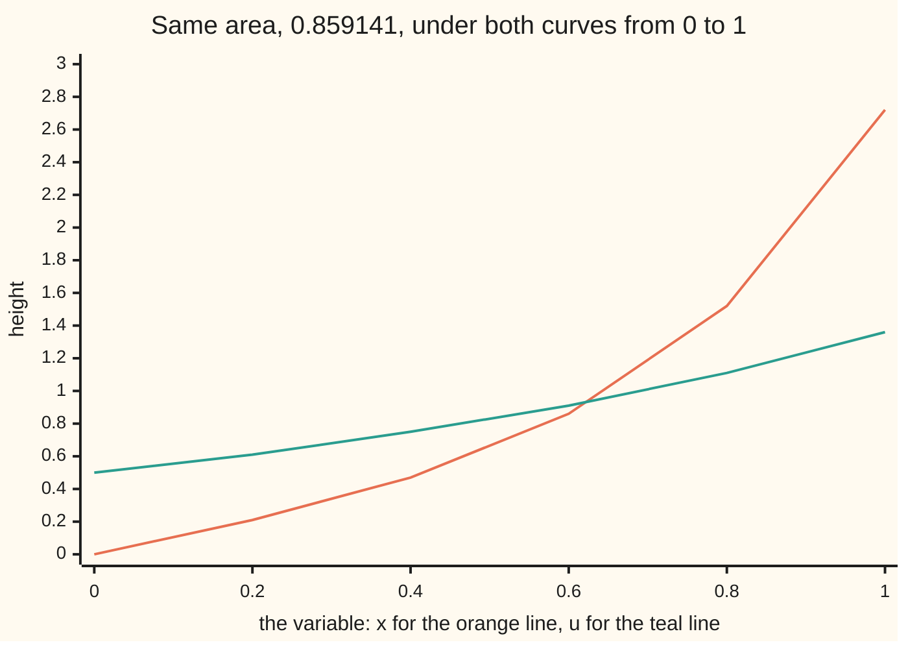
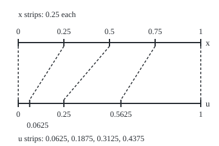

# Substitution: the chain rule run backwards

[Syllabus](../../../SYLLABUS.md) → [Calculus and analysis](../README.md) → [Integrals](../README.md#s04) → Substitution

---

## General Overview

Take the curve whose height at each x is x times e^(x^2): zero at x = 0, 0.47 at x = 0.4, 2.72 at x = 1. The area under it from x = 0 to x = 1 is a definite number. No power rule produces it directly, because the exponent is itself a function of x.

The way in is a matched pair. The exponent x^2 has rate 2x, and the factor x in front is half of that rate. Rename the exponent u. The integrand becomes e^u / 2, strip by strip, and the area is (e − 1)/2 = 0.859141.

That renaming is **substitution**: change the variable, move the two limits with it, and integrate the simpler thing. The chain rule says how fast a function of a function changes; substitution spots such a rate inside an integral and undoes it.

**Substitution replaces an inner function and its rate together: the integrand f(g(x)) times g'(x), accumulated from a to b, equals f(u) accumulated from g(a) to g(b).**

**What kind of fact this is:** a theorem, proved on this card in Why it works, and used as a method.

### The picture: two curves, one area



Orange: x e^(x^2) plotted against x. Teal: e^u / 2 plotted against u = x^2. The shapes differ; the areas are equal. Substitution says why.

---

## The formula

Reminders: the integral sign with limits a and b accumulates from a to b, and dx names the variable ([The integral](01-riemann-integral.md)); an antiderivative of a function is any function whose rate it is; g'(x) is the rate of g per unit of x.

$$\int_a^b f\big(g(x)\big)\,g'(x)\,dx \;=\; \int_{g(a)}^{g(b)} f(u)\,du$$

**Read it aloud:** the outer function of the inner function, times the inner rate, accumulated as x runs from a to b, equals the outer function alone accumulated as u runs from g(a) to g(b).

On the example, g(x) = x^2, g'(x) = 2x and f(u) = e^u / 2:

$$\int_0^1 x\,e^{x^2}\,dx \;=\; \int_0^1 \tfrac12 e^{u}\,du \;=\; \tfrac12\,(e-1) \;=\; 0.859141$$

Without limits, the same step gives an antiderivative: e^(x^2)/2 + C, for any constant C.

| Symbol | Plain meaning | In our example | Push it up and the answer… |
| --- | --- | --- | --- |
| $x$ | the original variable | 0 to 1 | — |
| $a$, $b$ | the original limits, in order | 0 and 1 | b = 2 from a = 1 gives 25.939934 |
| $g$ | the inner function, renamed | x^2 | — |
| $g'$ | its rate per unit of x | 2x | stretches each strip more |
| $u$ | the new variable, g(x) | x^2 | — |
| $f$ | the outer function of u | e^u / 2 | — |
| $F$, $C$ | an antiderivative of f; any constant | e^u / 2; C cancels | — |
| $dx$, $du$ | strip widths on the x and u rulers | du = 2x dx | — |

The line du = g'(x) dx is bookkeeping: a strip of width dx on the x ruler becomes a strip of width g'(x) times dx on the u ruler. It is shorthand for the theorem, not a division.

### When it holds

- **g has a continuous rate from a to b.** The proof runs the chain rule at every point; a corner in g, where no rate exists, breaks that step.
- **f is continuous at every value g takes, not only at g(a) and g(b).** Otherwise the formula prints a number where no area exists (Step 4).
- **The limits keep the order g(a), g(b), even downhill.** Sorting them flips the sign: x from 1 to 0 gives −0.859141.
- **g need not be one-to-one.** When u turns back, the retraced stretch cancels (Step 3).

---

## Why it works

### Step 0: an integrand of the form f(g(x)) g'(x) is already a rate

The chain rule says: the rate of F(g(x)) is F'(g(x)) times g'(x) ([Chain rule](../02-Derivatives/03-chain-rule.md)). If F is an antiderivative of f, that rate is f(g(x)) g'(x), exactly the integrand. So the integrand has an antiderivative, F(g(x)), and the fundamental theorem evaluates it at the two ends. The rest is bookkeeping.

### Step 1: the renaming stretches the ruler

Mark the x ruler from 0 to 1 in quarters, then mark each point's u = x^2 on a second ruler.

<p align="center"></p>

Scale: one unit on either ruler is 300 px, both starting at px 30; the dashed lines join each x to its u = x^2.

Four equal x strips land as four unequal u strips: 0.0625, 0.1875, 0.3125, 0.4375. Each is 2 times its centre times 0.25: the strip from 0.25 to 0.5 has centre 0.375, and 2 × 0.375 × 0.25 = 0.1875. The multiplier, the rate g'(x) = 2x, is the stretch.

Now read one strip of area. In x it is height x e^(x^2) times width dx. Split the height as (e^u / 2) times 2x. The piece 2x times dx is the strip's width on the u ruler, du. So each strip is also height e^u / 2 times width du, and as strips thin the sum in x and the sum in u close on one number; Step 2 proves it. The lone factor x pays for the stretch.

### Step 2: the proof, in words

The fundamental theorem ([Fundamental theorem of calculus](02-fundamental-theorem-of-calculus.md)) builds an antiderivative F of f on an interval holding every value g takes. The chain rule gives F(g(x)) the rate f(g(x)) g'(x). The fundamental theorem, applied in x, turns the left side into F(g(b)) − F(g(a)); applied in u, it turns the right side into the same difference.

<details>
<summary>Detailed proof</summary>

Assume g has a continuous rate from a to b, and f is continuous on an interval I holding every value g(x) for x from a to b.

Fix c in I and set F(v) = the integral of f from c to v. The fundamental theorem, first part, gives F'(v) = f(v) for every v in I.

Let H(x) = F(g(x)). Each g(x) lies in I, so the chain rule applies everywhere: H'(x) = f(g(x)) g'(x), a continuous rate.

The second part, applied to H: the integral of f(g(x)) g'(x) from a to b is H(b) − H(a) = F(g(b)) − F(g(a)). Applied to F on u from g(a) to g(b), it gives the same difference; when g(b) is below g(a), the integral carries a minus sign, as backward limits always do.

Nothing required g to be one-to-one or its rate non-zero. The hypothesis that I holds every value of g is used once: F needs a rate at each g(x). Without limits, two antiderivatives of the same rate differ by a function of rate zero, which the mean value theorem makes a constant: the C.

</details>

### Step 3: orientation, when u turns back

From x = −1 to x = 1, u = x^2 falls from 1 to 0 and climbs back to 1. The right side runs from u = 1 to u = 1 and gives 0. The negative and positive halves of the integrand match, and the midpoint sum in x prints 0.000000.

Extend to x = 2. The u path is 1 down to 0, then 0 up to 4. The retraced part cancels, leaving the u total from 1 to 4: 25.939934, the same as from x = 1. Where u turns, g'(x) = 2x is zero, and writing dx = du/(2x) would divide by zero. The theorem never divides, so it survives the turn.

### Step 4: domain, when u leaves the outer function's reach

The integrand 2x/(x^2 − 1) has the shape f(g(x)) g'(x) with g(x) = x^2 − 1 and f(u) = 1/u. From x = 0 to x = 2 the formula offers ln|u| from −1 to 3, which is ln 3 = 1.098612. But u passes through 0 at x = 1, where 1/u has no value. The area from 0 to 0.99 is −3.917036; to 0.9999 it is −8.517243; it has no floor. No area equals 1.098612.

Substitution can also run the other way: write x = h(t) for a new variable t and read the theorem right to left. That direction needs h to cover the whole interval and drives [Trig substitution](06-trig-substitution.md).

---

## Worked numbers, by hand

| Step | Arithmetic | Value |
| --- | --- | --- |
| inner function | u = x^2 | rate 2x |
| match the front factor | x = (1/2) × 2x | (1/2) e^u du |
| move the limits | 0^2 and 1^2 | 0 and 1 |
| antiderivative in u | e^u / 2 | — |
| evaluate | (2.718282 − 1)/2 | **0.859141** |
| x from 1 to 2 | u from 1 to 4: (e^4 − e)/2 | **25.939934** |

The area under x e^(x^2) from 0 to 1 is 0.859141 square units, equal to the area under e^u / 2 from 0 to 1.

### What breaks if you drop a piece

| Mistake | Comes out at | What went wrong |
| --- | --- | --- |
| x limits 1, 2 kept for u | 2.335387, not 25.939934 | the upper limit moves to 4 |
| the 1/2 dropped | 1.718282, not 0.859141 | x is half the stretch 2x |
| limits sorted, x from 1 to 0 | 0.859141, not −0.859141 | backward limits carry a minus |
| 2x/(x^2 − 1) from 0 to 2 | 1.098612, but no area exists | u crosses 0, where 1/u fails |

---

## Code, from first principles, and it actually runs

Two roads that share no arithmetic. Road one is the substitution: e^u / 2 at the moved limits, with e^u summed from its own series, 1 + u + u^2/2! + …. Road two ignores substitution: a midpoint sum (equal strips, each at its centre's height) of the original integrand at 10, 100 and 1000 strips, the error shrinking about 100-fold each time, and the same sum in u. A difference quotient checks the chain-rule step at x = 0.7. The last lines print the chart points and the figure's coordinates.

### Python

```python
# Substitution -- the check behind the card.  Standard library only; math.exp
# and math.log are primitives.  The area under x e^(x^2) is found by two roads:
# the antiderivative e^u / 2 at the moved limits, with e^u built from its own
# series, and midpoint sums in x and in u, refined until the error closes.
import math

def exp_series(t):                        # e^t = 1 + t + t^2/2! + ..., 60 terms
    term, total = 1.0, 1.0
    for k in range(1, 60):
        term *= t / k
        total += term
    return total

def mid(fn, a, b, n):                     # midpoint sum: n strips, height at each centre
    w = (b - a) / n
    return w * sum(fn(a + (k + 0.5) * w) for k in range(n))

f_x = lambda x: x * math.exp(x * x)       # the integrand, written in x
f_u = lambda u: math.exp(u) / 2           # the same integrand, written in u = x^2
F = lambda u: exp_series(u) / 2           # an antiderivative in u
exact = F(1) - F(0)
print(f"road 1, e^u/2 from u = 0 to u = 1: {exact:.6f}  (e = {exp_series(1):.6f})")
errors = []
for n in (10, 100, 1000):
    s = mid(f_x, 0, 1, n)
    errors.append(s - exact)
    print(f"road 2, midpoint sum in x, n = {n:4}: {s:.6f}  error {s - exact:.9f}")
u_sum = mid(f_u, 0, 1, 1000)
print(f"road 2, midpoint sum in u, n = 1000: {u_sum:.6f}")
x0, h = 0.7, 1e-5
dq = (F((x0 + h) ** 2) - F((x0 - h) ** 2)) / (2 * h)
print(f"chain rule at x = 0.7: slope of e^(x^2)/2 {dq:.6f}, integrand {f_x(x0):.6f}")
for a, b in ((1, 2), (1, 0), (-1, 1), (-1, 2)):
    s = round(mid(f_x, a, b, 30000), 9) + 0.0
    print(f"x from {a} to {b}: u from {a * a} to {b * b}; e^u/2 gives {F(b * b) - F(a * a):.6f}; x sum {s:.6f}")
print(f"mistake, x limits 1 and 2 kept on u: {F(2) - F(1):.6f}, not {F(4) - F(1):.6f}")
print(f"mistake, the 1/2 dropped: {2 * exact:.6f}, not {exact:.6f}")
g = lambda x: 2 * x / (x * x - 1)          # u = x^2 - 1 passes through 0, where 1/u fails
print(f"mistake, 2x/(x^2 - 1) on 0 to 2: formula ln 3 = {math.log(3):.6f}; area 0 to 0.99 = "
      f"{math.log(0.0199):.6f} (sum {mid(g, 0, 0.99, 200000):.6f}); 0 to 0.9999 = "
      f"{math.log(0.00019999):.6f} (sum {mid(g, 0, 0.9999, 200000):.6f})")
pts = [i / 5 for i in range(6)]
print("chart, x e^(x^2) at x = 0, 0.2, ..., 1:", " ".join(f"{f_x(p):.2f}" for p in pts))
print("chart, e^u/2 at u = 0, 0.2, ..., 1:", " ".join(f"{f_u(p):.2f}" for p in pts))
ticks = [i / 4 for i in range(5)]
print("figure, x ticks", " ".join(f"{t:.4f}" for t in ticks), "at px", " ".join(f"{30 + 300 * t:.2f}" for t in ticks))
print("figure, u marks", " ".join(f"{t * t:.4f}" for t in ticks), "at px", " ".join(f"{30 + 300 * t * t:.2f}" for t in ticks))
print("figure, u strip widths", " ".join(f"{b * b - a * a:.4f}" for a, b in zip(ticks, ticks[1:])),
      "= 2 x centre x 0.25, centres", " ".join(f"{a + 0.125:.4f}" for a in ticks[:4]))
assert abs(mid(f_x, 0, 1, 1000) - exact) < 1e-6          # x-road meets the moved-limit antiderivative
assert abs(u_sum - exact) < 1e-6                          # u-road meets it too
assert abs(dq - f_x(x0)) < 1e-6                           # the chain rule, by difference quotient
assert abs(mid(f_x, -1, 2, 30000) - (F(4) - F(1))) < 1e-5 and abs(errors[2]) < abs(errors[1]) / 50
print("ALL CHECKS PASS")
```

**Ran 2026-09-27 on macOS, Python 3.14.6, standard library only. All checks passed. Output, pasted from the run:**

```
road 1, e^u/2 from u = 0 to u = 1: 0.859141  (e = 2.718282)
road 2, midpoint sum in x, n =   10: 0.856171  error -0.002969420
road 2, midpoint sum in x, n =  100: 0.859111  error -0.000029811
road 2, midpoint sum in x, n = 1000: 0.859141  error -0.000000298
road 2, midpoint sum in u, n = 1000: 0.859141
chain rule at x = 0.7: slope of e^(x^2)/2 1.142621, integrand 1.142621
x from 1 to 2: u from 1 to 4; e^u/2 gives 25.939934; x sum 25.939934
x from 1 to 0: u from 1 to 0; e^u/2 gives -0.859141; x sum -0.859141
x from -1 to 1: u from 1 to 1; e^u/2 gives 0.000000; x sum 0.000000
x from -1 to 2: u from 1 to 4; e^u/2 gives 25.939934; x sum 25.939934
mistake, x limits 1 and 2 kept on u: 2.335387, not 25.939934
mistake, the 1/2 dropped: 1.718282, not 0.859141
mistake, 2x/(x^2 - 1) on 0 to 2: formula ln 3 = 1.098612; area 0 to 0.99 = -3.917036 (sum -3.917036); 0 to 0.9999 = -8.517243 (sum -8.517139)
chart, x e^(x^2) at x = 0, 0.2, ..., 1: 0.00 0.21 0.47 0.86 1.52 2.72
chart, e^u/2 at u = 0, 0.2, ..., 1: 0.50 0.61 0.75 0.91 1.11 1.36
figure, x ticks 0.0000 0.2500 0.5000 0.7500 1.0000 at px 30.00 105.00 180.00 255.00 330.00
figure, u marks 0.0000 0.0625 0.2500 0.5625 1.0000 at px 30.00 48.75 105.00 198.75 330.00
figure, u strip widths 0.0625 0.1875 0.3125 0.4375 = 2 x centre x 0.25, centres 0.1250 0.3750 0.6250 0.8750
ALL CHECKS PASS
```

### Rust

Same numbers, same labels, built with `rustc --edition 2021 -O`.

```rust
// Substitution -- the same check as the Python, in Rust.  No crates; exp and ln
// are primitives.  The area under x e^(x^2) is found by two roads: the
// antiderivative e^u / 2 at the moved limits, with e^u built from its own
// series, and midpoint sums in x and in u, refined until the error closes.

fn exp_series(t: f64) -> f64 {              // e^t = 1 + t + t^2/2! + ..., 60 terms
    let (mut term, mut total) = (1.0, 1.0);
    for k in 1..60 {
        term *= t / k as f64;
        total += term;
    }
    total
}

fn mid(f: &dyn Fn(f64) -> f64, a: f64, b: f64, n: usize) -> f64 {   // midpoint sum
    let w = (b - a) / n as f64;
    w * (0..n).map(|k| f(a + (k as f64 + 0.5) * w)).sum::<f64>()
}

fn f_x(x: f64) -> f64 { x * (x * x).exp() }        // the integrand, written in x
fn f_u(u: f64) -> f64 { u.exp() / 2.0 }            // the same integrand, written in u = x^2
fn big_f(u: f64) -> f64 { exp_series(u) / 2.0 }    // an antiderivative in u

fn join(v: &[f64], places: usize) -> String {
    v.iter().map(|x| format!("{:.*}", places, x)).collect::<Vec<_>>().join(" ")
}

fn main() {
    let exact = big_f(1.0) - big_f(0.0);
    println!("road 1, e^u/2 from u = 0 to u = 1: {:.6}  (e = {:.6})", exact, exp_series(1.0));
    let mut errors = Vec::new();
    for n in [10usize, 100, 1000] {
        let s = mid(&f_x, 0.0, 1.0, n);
        errors.push(s - exact);
        println!("road 2, midpoint sum in x, n = {:4}: {:.6}  error {:.9}", n, s, s - exact);
    }
    let u_sum = mid(&f_u, 0.0, 1.0, 1000);
    println!("road 2, midpoint sum in u, n = 1000: {:.6}", u_sum);
    let (x0, h) = (0.7f64, 1e-5);
    let dq = (big_f((x0 + h).powi(2)) - big_f((x0 - h).powi(2))) / (2.0 * h);
    println!("chain rule at x = 0.7: slope of e^(x^2)/2 {:.6}, integrand {:.6}", dq, f_x(x0));
    for (a, b) in [(1i32, 2i32), (1, 0), (-1, 1), (-1, 2)] {
        let (af, bf) = (a as f64, b as f64);
        let s = (mid(&f_x, af, bf, 30000) * 1e9).round() / 1e9 + 0.0;
        println!("x from {} to {}: u from {} to {}; e^u/2 gives {:.6}; x sum {:.6}",
                 a, b, a * a, b * b, big_f(bf * bf) - big_f(af * af), s);
    }
    println!("mistake, x limits 1 and 2 kept on u: {:.6}, not {:.6}", big_f(2.0) - big_f(1.0), big_f(4.0) - big_f(1.0));
    println!("mistake, the 1/2 dropped: {:.6}, not {:.6}", 2.0 * exact, exact);
    let g = |x: f64| 2.0 * x / (x * x - 1.0);      // u = x^2 - 1 passes through 0, where 1/u fails
    println!("mistake, 2x/(x^2 - 1) on 0 to 2: formula ln 3 = {:.6}; area 0 to 0.99 = {:.6} (sum {:.6}); 0 to 0.9999 = {:.6} (sum {:.6})",
             3f64.ln(), 0.0199f64.ln(), mid(&g, 0.0, 0.99, 200000), 0.00019999f64.ln(), mid(&g, 0.0, 0.9999, 200000));
    let pts: Vec<f64> = (0..6).map(|i| i as f64 / 5.0).collect();
    println!("chart, x e^(x^2) at x = 0, 0.2, ..., 1: {}", join(&pts.iter().map(|&p| f_x(p)).collect::<Vec<_>>(), 2));
    println!("chart, e^u/2 at u = 0, 0.2, ..., 1: {}", join(&pts.iter().map(|&p| f_u(p)).collect::<Vec<_>>(), 2));
    let t: Vec<f64> = (0..5).map(|i| i as f64 / 4.0).collect();
    let ts = |f: &dyn Fn(f64) -> f64, p: usize| join(&t.iter().map(|&v| f(v)).collect::<Vec<_>>(), p);
    println!("figure, x ticks {} at px {}", ts(&|v| v, 4), ts(&|v| 30.0 + 300.0 * v, 2));
    println!("figure, u marks {} at px {}", ts(&|v| v * v, 4), ts(&|v| 30.0 + 300.0 * v * v, 2));
    println!("figure, u strip widths {} = 2 x centre x 0.25, centres {}",
             join(&t.windows(2).map(|w| w[1] * w[1] - w[0] * w[0]).collect::<Vec<_>>(), 4),
             join(&t[..4].iter().map(|&a| a + 0.125).collect::<Vec<_>>(), 4));
    assert!((mid(&f_x, 0.0, 1.0, 1000) - exact).abs() < 1e-6);   // x-road meets the moved-limit antiderivative
    assert!((u_sum - exact).abs() < 1e-6);                        // u-road meets it too
    assert!((dq - f_x(x0)).abs() < 1e-6);                         // the chain rule, by difference quotient
    assert!((mid(&f_x, -1.0, 2.0, 30000) - (big_f(4.0) - big_f(1.0))).abs() < 1e-5 && errors[2].abs() < errors[1].abs() / 50.0);
    println!("ALL CHECKS PASS");
}
```

**Ran 2026-09-27 on macOS, rustc 1.98.1, no crates. All checks passed. Output, pasted from the run:**

```
road 1, e^u/2 from u = 0 to u = 1: 0.859141  (e = 2.718282)
road 2, midpoint sum in x, n =   10: 0.856171  error -0.002969420
road 2, midpoint sum in x, n =  100: 0.859111  error -0.000029811
road 2, midpoint sum in x, n = 1000: 0.859141  error -0.000000298
road 2, midpoint sum in u, n = 1000: 0.859141
chain rule at x = 0.7: slope of e^(x^2)/2 1.142621, integrand 1.142621
x from 1 to 2: u from 1 to 4; e^u/2 gives 25.939934; x sum 25.939934
x from 1 to 0: u from 1 to 0; e^u/2 gives -0.859141; x sum -0.859141
x from -1 to 1: u from 1 to 1; e^u/2 gives 0.000000; x sum 0.000000
x from -1 to 2: u from 1 to 4; e^u/2 gives 25.939934; x sum 25.939934
mistake, x limits 1 and 2 kept on u: 2.335387, not 25.939934
mistake, the 1/2 dropped: 1.718282, not 0.859141
mistake, 2x/(x^2 - 1) on 0 to 2: formula ln 3 = 1.098612; area 0 to 0.99 = -3.917036 (sum -3.917036); 0 to 0.9999 = -8.517243 (sum -8.517139)
chart, x e^(x^2) at x = 0, 0.2, ..., 1: 0.00 0.21 0.47 0.86 1.52 2.72
chart, e^u/2 at u = 0, 0.2, ..., 1: 0.50 0.61 0.75 0.91 1.11 1.36
figure, x ticks 0.0000 0.2500 0.5000 0.7500 1.0000 at px 30.00 105.00 180.00 255.00 330.00
figure, u marks 0.0000 0.0625 0.2500 0.5625 1.0000 at px 30.00 48.75 105.00 198.75 330.00
figure, u strip widths 0.0625 0.1875 0.3125 0.4375 = 2 x centre x 0.25, centres 0.1250 0.3750 0.6250 0.8750
ALL CHECKS PASS
```

The two outputs match line for line. The midpoint sum up to 0.9999 lags the true value, −8.517139 against −8.517243, because a spike that steep outruns the fixed grid of strips.

> [!TIP]
> **Try changing**
> Guess first, then run it.
> - **Drop the 1/2.** Change `exp_series(u) / 2` to `exp_series(u)`: road one prints 1.718282, the sums stay at 0.859141, and the first assert stops the run.
> - **Lose the square.** Make the integrand `x * math.exp(x)`: the x sum no longer meets e^u / 2, and the first assert fails.
> - **Run backwards.** Swap `(1, 2)` for `(2, 1)` in the cases: both roads print 25.939934 with a minus sign.

---

## The usual mistake

> [!warning]
> **Changing the variable but not the limits.** After renaming x^2 as u, the numbers on the integral sign are values of u. For x from 1 to 2 the u limits are 1 and 4; keeping 1 and 2 gives 2.335387 instead of 25.939934. Move both limits, or return to x before evaluating; mixing the two is the error.
>
> - **Dropping the constant that matches the rate.** The front factor is x, the rate 2x; forgetting the 1/2 gives 1.718282.
> - **Sorting the limits.** x from 1 to 0 gives −0.859141, not 0.859141.
> - **Dividing by a zero rate.** dx = du/(2x) fails at x = 0; the theorem needs no division.
> - **Substituting across a hole in f.** For 2x/(x^2 − 1) from 0 to 2, ln 3 = 1.098612 is not an area.

---

## Where you meet it in real life

- **Energy of motion.** Work on a moving mass accrues at mass times speed times the speed's rate; with the speed as u, the total from rest is half the mass times the speed squared.
- **Discounting a payment stream.** Money paid continuously and discounted at rate r is worth e^(−rt) per unit at time t; the substitution u = −rt totals it.
- **Bell-shaped curves.** e^(−x^2/2) has no antiderivative built from familiar functions, but x times it does, by this substitution. Rescaling a random quantity is the same move ([Transforming a variable](../../09-Probability%20and%20statistics/05-Transformations%20and%20Joint%20Laws/01-transforming-a-random-variable.md)).
- **Rate equations.** Separating a rate equation and integrating turns an integral in time into one in the unknown quantity: a substitution ([Separable equations](../../08-Differential%20equations%20and%20dynamics/01-Rate%20Equations/03-separable-equations.md)).

> **Say it back**
> Substitution is the chain rule run in reverse. When the integrand is an outer function of an inner function times the inner rate, rename the inner function u. The rate is the stretch between the two rulers, so strips in x and in u carry the same area. Move the limits, keep their order, and check the outer function is continuous wherever u goes. For x e^(x^2) from 0 to 1 the area is 0.859141.

---

## What this builds on

- [Fundamental theorem of calculus](02-fundamental-theorem-of-calculus.md): builds the antiderivative F and turns each side into F(g(b)) − F(g(a)).
- [Chain rule](../02-Derivatives/03-chain-rule.md): the rate of F(g(x)) is f(g(x)) g'(x), the fact this card runs backwards.

## Where this goes next

- [Trig substitution](06-trig-substitution.md): substitution run the other way, x = sin t, to clear square roots.
- [Separable equations](../../08-Differential%20equations%20and%20dynamics/01-Rate%20Equations/03-separable-equations.md): both sides of a rate equation integrated by substitution.
- [Variation of parameters](../../08-Differential%20equations%20and%20dynamics/03-Oscillators%20-%20Second-Order%20Linear%20Equations/07-variation-of-parameters.md): the integrals it produces, often settled by a substitution.
- [Transforming a variable](../../09-Probability%20and%20statistics/05-Transformations%20and%20Joint%20Laws/01-transforming-a-random-variable.md): the stretch g'(x) as the factor that keeps total probability at 1.

Substitution needs the inner rate already sitting in the integrand; when one such as the square root of 1 − x^2 offers none, the variable must change the other way round, the job of [Trig substitution](06-trig-substitution.md).

---

## Sources

Verified 2026-09-27: every link below resolves to the publisher's page.

- Strang, Gilbert, Edwin Herman, et al. *Calculus Volume 1*, OpenStax, Rice University. [Section 5.5, Substitution](https://openstax.org/books/calculus-volume-1/pages/5-5-substitution). Free; substitution from the chain rule, with moved limits.
- Spivak, Michael. *Calculus*, 4th ed. Publish or Perish, 2008. [Publisher page](https://mathpop.com/products/calculus-4th-edition). The theorem with its hypotheses, proved from the fundamental theorem.
- Jerison, David, et al. *18.01SC Single Variable Calculus*, MIT OpenCourseWare, Fall 2010. [Course page](https://ocw.mit.edu/courses/18-01sc-single-variable-calculus-fall-2010/). Lectures and problems on substitution.
