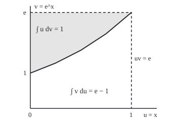

# Integration by parts: the product rule run backwards

[Syllabus](../../../SYLLABUS.md) → [Calculus and analysis](../../../SYLLABUS.md#w06) → [Integrals](../../../SYLLABUS.md#w06-s04) → Integration by parts

---

## General Overview

Draw the curve y = x e^x from x = 0 to x = 1, where e is Euler's number, 2.718282. The area under it is exactly 1 square unit. Draw y = ln x from x = 1 to x = e: again exactly 1. One exchange gives both.

The first curve is a product, x times e^x. Antiderivatives (functions whose rate is the curve) have no product rule of their own. Rates do: the product rule splits a product's rate into two shares ([Product and quotient rules](../02-Derivatives/02-product-and-quotient-rules.md)). Added up over an interval, the shares make the product's change from end to end. Know that change and one share, and the other follows.

So the method trades the integral wanted for another: differentiate one factor, integrate the other, and pay with a term measured at the two ends. It pays when the new integral is easier. Here x differentiates to 1 and e^x integrates to itself; ln x is read as ln x times 1.

**Integrating a product equals the product's change between the ends, minus the integral with the two factors' roles swapped.**

**What kind of fact this is:** a theorem, proved on this card in Why it works; choosing which factor to differentiate is a method, a rule of thumb that can fail.

### The picture: two areas that fill one rectangle

<p align="center"></p>

Drawn to scale: 1 unit across is 200 px, 1 unit up is 70 px; the curve's points are the checks' figure line. Below the curve lies the integral of e^x, e − 1; the shaded integral wanted, 1, fills the rest of the 1 by e rectangle.

---

## The formula

Notation first. A dash marks a rate: u'(x) is the rate of u per unit of x. Square brackets with two limits mean "at the top end minus at the bottom end": $[uv]_a^b$ is u(b)v(b) − u(a)v(a). And $du$ is shorthand for u'(x) dx.

$$\int_a^b u(x)\,v'(x)\,dx \;=\; \Big[\,u(x)\,v(x)\,\Big]_a^b \;-\; \int_a^b v(x)\,u'(x)\,dx$$

**Read it aloud:** the integral of one factor times the rate of the other equals their product's change across the interval, minus the integral with the roles swapped.

Most books print it in shorthand:

$$\int u\,dv = uv - \int v\,du$$

Write $J_n$ for the area under x^n e^x from 0 to 1. For every whole number n from 1 up:

$$J_n = e - n\,J_{n-1}, \qquad J_0 = e - 1$$

| Symbol | Plain meaning | In our example | Push it up and the answer… |
| --- | --- | --- | --- |
| $u$, $u'$ | the factor to differentiate, and its rate | x and 1; for the log, ln x and 1/x | simpler rate, easier leftover |
| $v$, $v'$ | the factor to integrate, and the factor as written | e^x and e^x; for the log, x and 1 | a constant added to v cancels |
| $a$, $b$ | the lower and upper limits | 0 and 1; for the log, 1 and e | both terms change |
| $du$, $dv$ | shorthand for u'(x) dx and v'(x) dx | dx and e^x dx | — |
| $[uv]_a^b$ | the boundary term: product at b minus product at a | e | rises one for one |
| $e$, $x$ | Euler's number, 2.718282; the variable | x from 0 to 1 | — |
| $J_n$, $n$, $J_0$ | area under x^n e^x from 0 to 1; a whole number; the start | J_0 = 1.718282, J_1 = 1 | the area falls: 1, 0.718282, 0.563436, 0.464536 |
| $C$ | the constant any antiderivative may carry | e^x (x − 1) + C | cancels from any area |

### When it holds

- **u and v have continuous rates on the closed interval.** Take u = x on 0 to 3 and let v jump from 0 to 1 at x = 1. The rate of v is 0 wherever it exists, so the left side is 0; the right side is 1, u at the jump times the jump.
- **The interval is finite and both factors are defined on it.** The log is undefined at 0, so the area under ln x from 0 to 1 needs its boundary term as a limit ([Improper integrals](07-improper-integrals.md)).
- **The leftover must be easier.** Every split is true; u = e^x for x e^x leaves x^2 e^x, a higher power.
- **The reduction needs n of at least 1, and exact arithmetic.** Each step multiplies rounding error by n: at n = 20 it prints −129.263708 for an area of 0.123804.

---

## Why it works

### Step 0: a product's change comes in two shares

When x moves a little, uv changes because u moved and because v moved. Integrated, the two shares make the product's total change.

### Step 1: integrate the product rule

The product rule holds at every point:

$$\big(u v\big)' = u'\,v + u\,v'$$

Integrate both sides from a to b. The fundamental theorem of calculus ([Fundamental theorem of calculus](02-fundamental-theorem-of-calculus.md)) turns the left side into u(b)v(b) − u(a)v(a). The right side splits into two integrals. Move one across the equals sign: the formula appears, minus sign included.

<details>
<summary>Detailed proof</summary>

Let u and v have continuous derivatives on [a, b]. Then u'v and uv' are continuous, hence Riemann integrable. The product uv has the continuous derivative $u'v + uv'$, so the fundamental theorem gives $\int_a^b (uv)'\,dx = u(b)v(b) - u(a)v(a)$. The integral is linear, so this equals $\int_a^b u'v\,dx + \int_a^b uv'\,dx$. Subtract the first integral from both sides.

**The reduction, by induction on n.** For n ≥ 1 take u = x^n and v = e^x on [0, 1]: $J_n = [x^n e^x]_0^1 - n\int_0^1 x^{n-1}e^x\,dx = e - nJ_{n-1}$. The lower boundary value is 0 because 0^n = 0 when n ≥ 1; at n = 0 it would be 1, which is why $J_0 = e - 1$ comes straight from the antiderivative e^x. After n steps only $J_0$ remains.

</details>

### Step 2: the product x e^x

Choose u = x, since its rate is 1. Choose dv = e^x dx, so v = e^x. Then du = dx.

The boundary term is $[x e^x]_0^1$ = 1 × e − 0 × 1 = e. The leftover is the integral of e^x from 0 to 1, e − 1. Subtract: 1.

Without limits, the antiderivative is e^x (x − 1) + C; its rate is e^x (x − 1) + e^x = x e^x. The checks' difference quotient agrees: 0.824361 at x = 0.5.

### Step 3: the log, a product in disguise

Supply the second factor: ln x = ln x × 1. Choose u = ln x, whose rate is 1/x. Choose dv = dx, so v = x.

The boundary term is $[x \ln x]_1^e$ = e × 1 − 1 × 0 = e. The leftover is the integral of x × (1/x) = 1 from 1 to e, which is e − 1. Subtract: again 1.

The antiderivative is x ln x − x + C, whose rate is ln x + 1 − 1 = ln x; at x = 2 the checks give 0.693147, ln 2.

### Step 4: choosing the parts

Make u the factor whose rate is simpler than itself, and dv one that integrates without getting worse. A power of x drops a degree; a log becomes a power of x; an exponential stays put. A common order for u, best first: logs, inverse trig, powers of x, trig, exponentials. It is a rule of thumb, not a theorem.

### Step 5: the reduction formula

Apply Step 2 to x^n e^x with u = x^n. The rate of u is n x^(n−1), so the leftover is n times the same integral one power lower: $J_n = e - n J_{n-1}$. A **reduction formula** is exactly this: parts once, landing one step down the same family, repeated until the first member.

Step 3 applied to (ln x)^n on 1 to e gives boundary e, leftover n times the integral of (ln x)^(n−1), start e − 1: the same recurrence, confirmed by the checks for n from 0 to 4. The reason is that x = e^t turns one integral into the other ([Substitution](03-substitution.md)).

A second road never uses parts: add up thin strips under the original curve, as on [Numerical integration](08-numerical-integration.md). The checks do this with Simpson's rule. Sums have their own version, summation by parts.

---

## Worked numbers, by hand

| Step | Arithmetic | Value |
| --- | --- | --- |
| x e^x: the parts | u = x, dv = e^x dx, so du = dx, v = e^x | — |
| boundary term | 1 × e − 0 × 1 | 2.718282 |
| leftover | integral of e^x from 0 to 1 = e − 1 | 1.718282 |
| subtract | boundary minus leftover | **1** |
| ln x: the parts | u = ln x, dv = dx, so du = dx / x, v = x | — |
| boundary term | e × 1 − 1 × 0 | 2.718282 |
| leftover | integral of 1 from 1 to e = e − 1 | 1.718282 |
| subtract | 2.718282 − 1.718282 | **1** |
| reduction, n = 2 | e − 2 × 1 | 0.718282 |

Both areas are exactly 1 square unit.

### What breaks if you drop a piece

| Mistake | Comes out at | What went wrong |
| --- | --- | --- |
| Plus sign before the leftover | 4.436564 | The leftover is subtracted, not added |
| Boundary term alone | 2.718282 | The leftover integral was dropped |
| v jumps by 1 at x = 1, u = x on 0 to 3 | left side 0, right side 1 | Continuous rates are a hypothesis |
| Reduction run to n = 20 in floating point | −129.263708, true 0.123804 | Each step multiplies the rounding error by n |

The code prints all four.

---

## Code, from first principles, and it actually runs

Two roads that share no arithmetic. Road one is the parts formula and its reduction. Road two is Simpson's rule on the original curve, written out here: an even number of strips, heights weighted 1, 4, 2, 4, …, 4, 1. Its error closes from 0.000169047140 at 4 strips to 0.000000041706 at 32. A difference quotient then differentiates both antiderivatives back.

### Python

```python
# Integration by parts -- the check behind the card.  Standard library only;
# math.exp and math.log are the only primitives used.
# Road one: the parts formula, and its reduction J_n = e - n * J_(n-1).
# Road two: a Simpson sum of the original integrand, refined until it closes.
import math

def simpson(f, a, b, n):                 # n even; weights 1, 4, 2, 4, ..., 4, 1
    h = (b - a) / n
    s = f(a) + f(b) + sum((4 if k % 2 else 2) * f(a + k * h) for k in range(1, n))
    return s * h / 3

E = math.exp(1.0)
xex = lambda x: x * math.exp(x)
bx, lx = 1.0 * E - 0.0 * 1.0, E - 1.0    # [x e^x] from 0 to 1; integral of e^x
bl, ll = E * 1.0 - 1.0 * 0.0, E - 1.0    # [x ln x] from 1 to e; integral of 1
print(f"x e^x on 0..1: boundary {bx:.6f} - leftover {lx:.6f} = {bx - lx:.6f}")
print(f"ln x on 1..e:  boundary {bl:.6f} - leftover {ll:.6f} = {bl - ll:.6f}")
for n in (4, 8, 16, 32):
    s = simpson(xex, 0.0, 1.0, n)
    print(f"Simpson x e^x, {n:2d} strips: {s:.12f}, error {s - (bx - lx):.12f}")
J, rows = E - 1.0, []                    # J_0 = e - 1, then the reduction
for n in range(5):
    if n > 0:
        J = E - n * J
    se = simpson(lambda x: x ** n * math.exp(x), 0.0, 1.0, 128)
    sl = simpson(lambda x: math.log(x) ** n, 1.0, E, 128)
    rows.append((J, se, sl))
    print(f"J_{n}: reduction {J:.6f}, Simpson x^{n} e^x {se:.6f}, Simpson (ln x)^{n} {sl:.6f}")
h = 1e-5                                 # the antiderivatives, differentiated back
F = lambda x: math.exp(x) * (x - 1)       # the antiderivative of x e^x
G = lambda x: x * math.log(x) - x         # the antiderivative of ln x
dF, dG = (F(0.5 + h) - F(0.5 - h)) / (2 * h), (G(2 + h) - G(2 - h)) / (2 * h)
print(f"rates: e^x (x - 1) at 0.5 is {dF:.6f}, x e^x {xex(0.5):.6f}; x ln x - x at 2 is {dG:.6f}, ln 2 {math.log(2.0):.6f}")
pts = " ".join(f"({60 + 200 * u:.1f}, {215 - 70 * math.exp(u):.1f})" for u in (0, 0.25, 0.5, 0.75, 1))
print(f"figure, curve v = e^u in px (1 across = 200 px, 1 up = 70 px): {pts}")
print(f"mistake, plus sign instead of minus: {bx + lx:.6f}, not 1")
print(f"mistake, boundary term alone: {bx:.6f}, not 1")
step = lambda x: 1.0 if x >= 1.0 else 0.0              # v jumps from 0 to 1 at x = 1
vdash = lambda x: (step(x + 1e-6) - step(x - 1e-6)) / 2e-6
left = simpson(lambda x: x * vdash(x), 0.0, 3.0, 1000)  # no node lies within 1e-6 of 1
right = (3.0 * step(3.0) - 0.0 * step(0.0)) - simpson(step, 1.0, 3.0, 1000)  # v is 0 before 1
print(f"mistake, v with a jump at 1 on 0..3: left side {left:.6f}, right side {right:.6f}")
J20 = E - 1.0
for n in range(1, 21):
    J20 = E - n * J20
s20 = simpson(lambda x: x ** 20 * math.exp(x), 0.0, 1.0, 256)
print(f"mistake, reduction run to J_20 in floating point: {J20:.6f}; Simpson {s20:.6f}")
assert abs((bx - lx) - simpson(xex, 0.0, 1.0, 128)) < 1e-8          # road one against road two
assert abs((bl - ll) - simpson(math.log, 1.0, E, 128)) < 1e-8
assert all(abs(j - se) < 1e-8 and abs(j - sl) < 1e-8 for j, se, sl in rows)
assert abs((right - left) - 1.0) < 1e-6 and abs(J20 - s20) > 1.0   # the breaks are real
print("ALL CHECKS PASS")
```

**Ran 2026-09-27 on macOS, Python 3.14.6, standard library only. All checks passed. Output, pasted from the run:**

```
x e^x on 0..1: boundary 2.718282 - leftover 1.718282 = 1.000000
ln x on 1..e:  boundary 2.718282 - leftover 1.718282 = 1.000000
Simpson x e^x,  4 strips: 1.000169047140, error 0.000169047140
Simpson x e^x,  8 strips: 1.000010650140, error 0.000010650140
Simpson x e^x, 16 strips: 1.000000666968, error 0.000000666968
Simpson x e^x, 32 strips: 1.000000041706, error 0.000000041706
J_0: reduction 1.718282, Simpson x^0 e^x 1.718282, Simpson (ln x)^0 1.718282
J_1: reduction 1.000000, Simpson x^1 e^x 1.000000, Simpson (ln x)^1 1.000000
J_2: reduction 0.718282, Simpson x^2 e^x 0.718282, Simpson (ln x)^2 0.718282
J_3: reduction 0.563436, Simpson x^3 e^x 0.563436, Simpson (ln x)^3 0.563436
J_4: reduction 0.464536, Simpson x^4 e^x 0.464536, Simpson (ln x)^4 0.464536
rates: e^x (x - 1) at 0.5 is 0.824361, x e^x 0.824361; x ln x - x at 2 is 0.693147, ln 2 0.693147
figure, curve v = e^u in px (1 across = 200 px, 1 up = 70 px): (60.0, 145.0) (110.0, 125.1) (160.0, 99.6) (210.0, 66.8) (260.0, 24.7)
mistake, plus sign instead of minus: 4.436564, not 1
mistake, boundary term alone: 2.718282, not 1
mistake, v with a jump at 1 on 0..3: left side 0.000000, right side 1.000000
mistake, reduction run to J_20 in floating point: -129.263708; Simpson 0.123804
ALL CHECKS PASS
```

### Rust

Same numbers, same labels, built with `rustc --edition 2021 -O`.

```rust
// Integration by parts -- the same check as the Python, in Rust.  std only;
// exp and ln are the only primitives used.
// Road one: the parts formula, and its reduction J_n = e - n * J_(n-1).
// Road two: a Simpson sum of the original integrand, refined until it closes.

fn simpson(f: &dyn Fn(f64) -> f64, a: f64, b: f64, n: usize) -> f64 {
    let h = (b - a) / n as f64; // n even; weights 1, 4, 2, 4, ..., 4, 1
    let mut inner = 0.0;
    for k in 1..n {
        inner += (if k % 2 == 1 { 4.0 } else { 2.0 }) * f(a + k as f64 * h);
    }
    (f(a) + f(b) + inner) * h / 3.0
}

fn main() {
    let e = 1.0_f64.exp();
    let xex = |x: f64| x * x.exp();
    let (bx, lx) = (1.0 * e - 0.0 * 1.0, e - 1.0); // [x e^x] from 0 to 1; integral of e^x
    let (bl, ll) = (e * 1.0 - 1.0 * 0.0, e - 1.0); // [x ln x] from 1 to e; integral of 1
    println!("x e^x on 0..1: boundary {:.6} - leftover {:.6} = {:.6}", bx, lx, bx - lx);
    println!("ln x on 1..e:  boundary {:.6} - leftover {:.6} = {:.6}", bl, ll, bl - ll);
    for n in [4usize, 8, 16, 32] {
        let s = simpson(&xex, 0.0, 1.0, n);
        println!("Simpson x e^x, {:2} strips: {:.12}, error {:.12}", n, s, s - (bx - lx));
    }
    let (mut j, mut rows) = (e - 1.0, Vec::new()); // J_0 = e - 1, then the reduction
    for n in 0..5i32 {
        if n > 0 {
            j = e - n as f64 * j;
        }
        let se = simpson(&|x: f64| x.powi(n) * x.exp(), 0.0, 1.0, 128);
        let sl = simpson(&|x: f64| x.ln().powi(n), 1.0, e, 128);
        rows.push((j, se, sl));
        println!("J_{}: reduction {:.6}, Simpson x^{} e^x {:.6}, Simpson (ln x)^{} {:.6}", n, j, n, se, n, sl);
    }
    let h = 1e-5; // the antiderivatives, differentiated back
    let big_f = |x: f64| x.exp() * (x - 1.0);
    let big_g = |x: f64| x * x.ln() - x;
    let d_f = (big_f(0.5 + h) - big_f(0.5 - h)) / (2.0 * h);
    let d_g = (big_g(2.0 + h) - big_g(2.0 - h)) / (2.0 * h);
    println!("rates: e^x (x - 1) at 0.5 is {:.6}, x e^x {:.6}; x ln x - x at 2 is {:.6}, ln 2 {:.6}", d_f, xex(0.5), d_g, 2.0_f64.ln());
    let pts: Vec<String> = [0.0, 0.25, 0.5, 0.75, 1.0_f64].iter()
        .map(|u: &f64| format!("({:.1}, {:.1})", 60.0 + 200.0 * u, 215.0 - 70.0 * u.exp())).collect();
    println!("figure, curve v = e^u in px (1 across = 200 px, 1 up = 70 px): {}", pts.join(" "));
    println!("mistake, plus sign instead of minus: {:.6}, not 1", bx + lx);
    println!("mistake, boundary term alone: {:.6}, not 1", bx);
    let step = |x: f64| if x >= 1.0 { 1.0 } else { 0.0 }; // v jumps from 0 to 1 at x = 1
    let vdash = |x: f64| (step(x + 1e-6) - step(x - 1e-6)) / 2e-6;
    let left = simpson(&|x: f64| x * vdash(x), 0.0, 3.0, 1000); // no node lies within 1e-6 of 1
    let right = (3.0 * step(3.0) - 0.0 * step(0.0)) - simpson(&step, 1.0, 3.0, 1000); // v is 0 before 1
    println!("mistake, v with a jump at 1 on 0..3: left side {:.6}, right side {:.6}", left, right);
    let mut j20 = e - 1.0;
    for n in 1..21 {
        j20 = e - n as f64 * j20;
    }
    let s20 = simpson(&|x: f64| x.powi(20) * x.exp(), 0.0, 1.0, 256);
    println!("mistake, reduction run to J_20 in floating point: {:.6}; Simpson {:.6}", j20, s20);
    assert!(((bx - lx) - simpson(&xex, 0.0, 1.0, 128)).abs() < 1e-8); // road one against road two
    assert!(((bl - ll) - simpson(&|x: f64| x.ln(), 1.0, e, 128)).abs() < 1e-8);
    assert!(rows.iter().all(|&(j, se, sl)| (j - se).abs() < 1e-8 && (j - sl).abs() < 1e-8));
    assert!(((right - left) - 1.0).abs() < 1e-6 && (j20 - s20).abs() > 1.0); // the breaks are real
    println!("ALL CHECKS PASS");
}
```

**Ran 2026-09-27 on macOS, rustc 1.98.1, no crates. All checks passed. Output, pasted from the run:**

```
x e^x on 0..1: boundary 2.718282 - leftover 1.718282 = 1.000000
ln x on 1..e:  boundary 2.718282 - leftover 1.718282 = 1.000000
Simpson x e^x,  4 strips: 1.000169047140, error 0.000169047140
Simpson x e^x,  8 strips: 1.000010650140, error 0.000010650140
Simpson x e^x, 16 strips: 1.000000666968, error 0.000000666968
Simpson x e^x, 32 strips: 1.000000041706, error 0.000000041706
J_0: reduction 1.718282, Simpson x^0 e^x 1.718282, Simpson (ln x)^0 1.718282
J_1: reduction 1.000000, Simpson x^1 e^x 1.000000, Simpson (ln x)^1 1.000000
J_2: reduction 0.718282, Simpson x^2 e^x 0.718282, Simpson (ln x)^2 0.718282
J_3: reduction 0.563436, Simpson x^3 e^x 0.563436, Simpson (ln x)^3 0.563436
J_4: reduction 0.464536, Simpson x^4 e^x 0.464536, Simpson (ln x)^4 0.464536
rates: e^x (x - 1) at 0.5 is 0.824361, x e^x 0.824361; x ln x - x at 2 is 0.693147, ln 2 0.693147
figure, curve v = e^u in px (1 across = 200 px, 1 up = 70 px): (60.0, 145.0) (110.0, 125.1) (160.0, 99.6) (210.0, 66.8) (260.0, 24.7)
mistake, plus sign instead of minus: 4.436564, not 1
mistake, boundary term alone: 2.718282, not 1
mistake, v with a jump at 1 on 0..3: left side 0.000000, right side 1.000000
mistake, reduction run to J_20 in floating point: -129.263708; Simpson 0.123804
ALL CHECKS PASS
```

The two outputs match line for line.

> [!TIP]
> **Try changing**
> Guess first, then run it.
> - **Flip the sign.** In the reduction, change `E - n * J` to `E + n * J`. The reduction column leaves both Simpson columns from n = 1 on, and the third assert stops the run.
> - **Move the jump.** In `step`, move the jump from 1.0 to 2.0. The gap becomes u at the new jump, and the fourth assert stops the run.
> - **Shorten the unstable loop.** Run the floating-point reduction to n = 18 instead of 20. The answer is already negative: no area under a positive curve can be.

---

## The usual mistake

> [!warning]
> **Taking the boundary term for the answer.** For x e^x on 0 to 1 it gives e, 2.718282, against a true area of 1. Parts leaves an integral behind.
>
> - **The wrong sign.** Adding the leftover gives 4.436564.
> - **A constant carried into an area.** An indefinite answer needs one + C; an area needs none.
> - **A long reduction trusted in floating point.** Run $J_{n-1} = (e - J_n)/n$ downward from a high n instead, and errors shrink.

---

## Where you meet it in real life

- **Engineering transforms.** The Laplace transform turns a rate into multiplication, by parts ([Transforming a derivative](../../08-Differential%20equations%20and%20dynamics/08-Laplace%20Transforms%20for%20Initial-Value%20Problems/02-transforms-of-derivatives.md)).
- **Factorials beyond whole numbers.** The same reduction on x^n e^(−x) from 0 to infinity gives n!, and defines the gamma function ([The gamma function](../../07-Complex%20analysis/09-Special%20Functions%20and%20the%20Zeta%20Function/02-gamma-function.md)).
- **Option markets.** Parts, applied twice, rebuilds a payoff from calls and puts, the step behind the VIX index ([Any payoff from a strip of options](../../12-Financial%20mathematics/19-Variance%20swaps%2C%20the%20log%20contract%20and%20VIX/02-carr-madan-spanning-and-the-log-contract.md)).

> **Say it back**
> The product rule splits a product's rate into two shares; integrated, they give the product's change between the ends. So one share's integral is that change minus the other's. Differentiate the factor that gets simpler; integrate the one that does not get worse. Repeating the trade on x^n e^x gives a reduction formula that ends at e − 1.

---

## What this builds on

- [Fundamental theorem of calculus](02-fundamental-theorem-of-calculus.md): integrating a rate gives the change between the ends.
- [Product and quotient rules](../02-Derivatives/02-product-and-quotient-rules.md): the rule being run backwards.

## Where this goes next

- [Partial fractions](05-partial-fractions.md): quotients of polynomials.
- [Fourier series](../../07-Complex%20analysis/08-Transforms%20in%20Outline/01-fourier-series-in-complex-form.md): coefficients that parts evaluates.
- [The Laplace transform](../../07-Complex%20analysis/08-Transforms%20in%20Outline/05-laplace-transform.md): a transform whose derivative rule is parts.
- [The gamma function](../../07-Complex%20analysis/09-Special%20Functions%20and%20the%20Zeta%20Function/02-gamma-function.md): this reduction, taken to infinity.
- [The integrating factor](../../08-Differential%20equations%20and%20dynamics/01-Rate%20Equations/05-integrating-factor.md): the product rule run backwards on a rate equation.
- [Sturm-Liouville](../../08-Differential%20equations%20and%20dynamics/07-Series%20Solutions%20and%20Boundary%20Problems/09-sturm-liouville-and-orthogonality.md): parts twice, boundary terms made to vanish.
- [Transforming a derivative](../../08-Differential%20equations%20and%20dynamics/08-Laplace%20Transforms%20for%20Initial-Value%20Problems/02-transforms-of-derivatives.md): one parts step per derivative.
- [The Euler-Lagrange equation](../../08-Differential%20equations%20and%20dynamics/12-Calculus%20of%20Variations%20and%20Optimal%20Control/01-functionals-and-the-euler-lagrange-equation.md): parts moves the derivative off a change of path.
- [Gamma and beta](../../09-Probability%20and%20statistics/04-Continuous%20Distributions/07-gamma-and-beta-distributions.md): average waiting times by this reduction.
- [The Lebesgue-Stieltjes integral](../../10-Measure%20and%20integration/11-Derivatives%20Meet%20the%20Lebesgue%20Integral/05-lebesgue-stieltjes-integral.md): parts that counts a jump's share.
- [The butterfly and the implied density](../../12-Financial%20mathematics/10-Digitals%20and%20the%20implied%20density/05-butterfly-and-the-implied-density.md): a density read off call prices.
- [Any payoff from a strip of options](../../12-Financial%20mathematics/19-Variance%20swaps%2C%20the%20log%20contract%20and%20VIX/02-carr-madan-spanning-and-the-log-contract.md): any payoff from calls and puts.
- Finite elements: the weak form, made by parts.
- Smoothness shows in the tail: smoother curves, faster-shrinking coefficients.

---

## Sources

Verified 2026-09-27: every link below resolves to the publisher's page.

- OpenStax. *Calculus Volume 2*, section 3.1, "Integration by Parts." [Publisher page](https://openstax.org/books/calculus-volume-2/pages/3-1-integration-by-parts). Free; the derivation, the order for choosing u, parts applied twice.
- Strang, Gilbert. *Calculus*, MIT OpenCourseWare open textbook. [Publisher page](https://ocw.mit.edu/courses/res-18-001-calculus-fall-2023/). Free; chapter 7 opens with parts and reduction formulas.
- Graham, Ronald L., Donald E. Knuth, and Oren Patashnik. *Concrete Mathematics*, 2nd ed. Addison-Wesley, 1994. [Publisher page](https://www.informit.com/store/concrete-mathematics-a-foundation-for-computer-science-9780201558029). Section 2.6: summation by parts.
