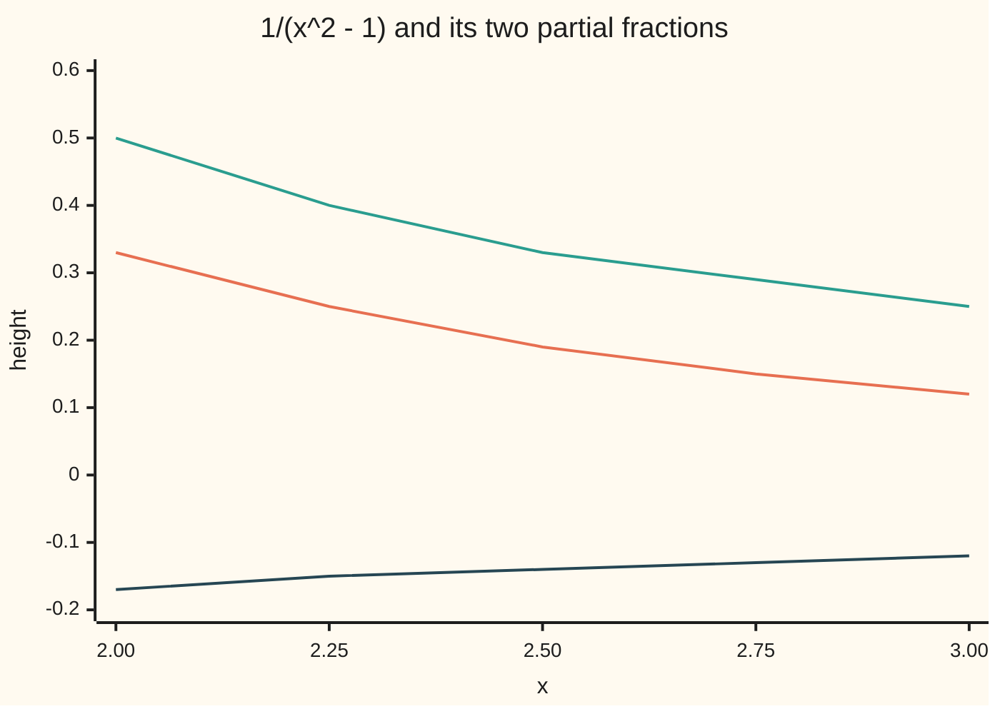

# Partial fractions: splitting a rational function into pieces you can integrate

[Syllabus](../../../SYLLABUS.md) → [Calculus and analysis](../README.md) → [Integrals](../README.md#s04) → Partial fractions

---

## General Overview

Draw the curve y = 1 / (x^2 − 1) from x = 2 to x = 3. It sinks from height 1/3 to 1/8. The area under it is 0.202733 square units: exactly half of ln(3/2), the natural log of 1.5. Neither substitution nor parts reaches it directly.

The way in is schoolroom arithmetic run backwards. Adding 1/2 and 1/3 needs a common bottom: 3/6 + 2/6 = 5/6. Fractions with x in them add the same way, and half of 1/(x − 1) minus half of 1/(x + 1) combines to exactly 1/(x^2 − 1). Each piece has a log as its antiderivative (a function whose rate is the piece). So the area is one log minus another.

A ratio of two polynomials is a **rational function**; taking one apart into simple fractions is **partial fractions**.

**Every rational function is a polynomial plus simple fractions, one per power of each factor of its bottom, and each piece integrates to a polynomial, a fraction, a log or an arctangent.**

**What kind of fact this is:** a method; that the split always exists is a theorem of algebra, outlined in a folded proof in Why it works.

### The picture: one curve, two pieces



Middle line: the curve. Top line: half of 1/(x − 1). Bottom line: minus half of 1/(x + 1). At every x the top and bottom add to the middle: at x = 2, 0.50 − 0.17 = 0.33.

---

## The formula

$$\frac{1}{x^2-1} = \frac{1/2}{x-1} - \frac{1/2}{x+1}$$

$$\int_2^3 \frac{dx}{x^2-1} = \Big[\tfrac12\ln\lvert x-1\rvert - \tfrac12\ln\lvert x+1\rvert\Big]_2^3 = \tfrac12\ln\tfrac32 = 0.202733$$

**Read it aloud:** one over x squared minus one is half of one over x minus one, less half of one over x plus one, so its area from 2 to 3 is half the log of 1.5.

Bars mean size with the sign dropped; square brackets with two limits mean "at the top limit minus at the bottom limit". In general, first divide the top P by the bottom Q:

$$\frac{P(x)}{Q(x)} = H(x) + \frac{R(x)}{Q(x)}, \qquad \text{the degree of } R \text{ below the degree of } Q$$

Then split the remainder part, one piece per power of each factor of Q:

$$\frac{R(x)}{Q(x)} = \sum_{\text{roots } r}\sum_{k=1}^{m} \frac{A}{(x-r)^k} + \sum_{\text{quadratics } q}\sum_{k=1}^{m} \frac{Mx+N}{q(x)^k}$$

**Read it aloud:** a constant over each power of each linear factor, and a straight-line top over each power of each quadratic that will not split.

| Symbol | Plain meaning | In our example | Push it up and the answer… |
| --- | --- | --- | --- |
| $x$ | the input | 2 to 3 | nearing 1, the curve goes to infinity |
| $P$, $Q$ | top and bottom polynomials | 1 and x^2 − 1 | top as big as bottom: divide first |
| $H$, $R$ | quotient and remainder of P over Q | for x^3/(x^2 − 1): x and x | H adds 2.5 of the 2.990415 |
| $A$, $B$ | constants over the linear factors | 1/2 and −1/2 | doubled, the area doubles to 0.405465 |
| $r$, $k$, $m$ | a root of Q; a power; how often r repeats | r = ±1, m = 1; m = 2 when squared | each extra power adds a piece |
| $M$, $N$, $q$ | top Mx + N over a quadratic q with no real root | q = x^2 + 1, M = 0, N = −1/2 | N gives an arctangent, M a log |
| $F$, $C$ | an antiderivative; its free constant | $F$ = ½ ln of size of x − 1, less ½ ln of size of x + 1 | C cancels from any area |
| $\ln$, $\arctan$ | natural log; the angle whose tangent is the input | ln(3/2) = 0.405465; arctan(1/7) = 0.141897 | both rise with the input |

### When it holds

- **Top of lower degree than bottom.** Otherwise divide first, or x^3/(x^2 − 1) gives 0.490415 for 2.990415.
- **Bottom fully factored over the real numbers.** A quadratic with no real root, such as x^2 + 1, stays whole with a straight-line top.
- **A piece for every power of a repeated factor.** Otherwise 1/(x^2 − 1)^2 gives −0.101366, negative under a positive curve.
- **No root of the bottom in the interval, ends included.** From 0 to 2 the logs print −0.549306; the area is infinite.

---

## Why it works

### Step 0: adding fractions can be undone

Adding simple fractions gives a rational function. Partial fractions asks which were added. The bottom's factors say which to try; only the tops are unknown.

### Step 1: clear the bottom, then read off the constants

Write 1/(x^2 − 1) = A/(x − 1) + B/(x + 1). Multiply both sides by (x − 1)(x + 1):

$$1 = A(x+1) + B(x-1)$$

This holds for every x, 1 and −1 included. Two roads give the constants.

- **Cover-up.** Set x = 1: the B term vanishes and 1 = 2A, so A = 1/2. Set x = −1: 1 = −2B, so B = −1/2.
- **Matching coefficients.** Collect terms: (A + B)x + (A − B) = 1. The right side has no x, so A + B = 0 and A − B = 1. Again A = 1/2, B = −1/2.

Setting x = 1 is legitimate here, never in the fractions. Two polynomials that agree at more points than their degree agree everywhere ([Polynomial long division](../../03-Algebra/02-Polynomials/04-polynomial-division.md)).

### Step 2: each piece is a log

The rate of ln x is 1/x for positive x; for negative x, ln(−x) has rate (−1)/(−x) = 1/x too. So on either side of r,

$$\int \frac{A}{x-r}\,dx = A\ln\lvert x-r\rvert + C.$$

With F(x) = ½ ln|x − 1| − ½ ln|x + 1|, the fundamental theorem ([Fundamental theorem of calculus](02-fundamental-theorem-of-calculus.md)) gives the area as F(3) − F(2) = 0.202733, worked in the table below.

### Step 3: divide first when the top is too big

Fractions over x − 1 and x + 1 combine to a top of degree at most 1, never x^3. Divide: x^3 = x(x^2 − 1) + x, so

$$\frac{x^3}{x^2-1} = x + \frac{x}{x^2-1} = x + \frac{1/2}{x-1} + \frac{1/2}{x+1}.$$

On 2 to 3 the x contributes (9 − 4)/2 = 2.5 and the fractions ½ ln(8/3) = 0.490415: total 2.990415.

### Step 4: a repeated factor needs every power

Square the curve. A bottom of degree 4 allows a top of degree up to 3, four numbers, so four constants are needed, two per factor:

$$\frac{1}{(x^2-1)^2} = -\frac{1/4}{x-1} + \frac{1/4}{(x-1)^2} + \frac{1/4}{x+1} + \frac{1/4}{(x+1)^2}$$

Setting x = 1 and x = −1 in the cleared line gives the squared tops; x = 0 and the x^3 terms give the rest. The squared pieces integrate to fractions, since the rate of −1/(x − 1) is 1/(x − 1)^2. The area from 2 to 3 is 0.044467.

### Step 5: a quadratic with no real root keeps a straight-line top

Now x^4 − 1 = (x − 1)(x + 1)(x^2 + 1), and x^2 + 1 is never zero, so it cannot split. Its piece gets a top Mx + N:

$$\frac{1}{x^4-1} = \frac{1/4}{x-1} - \frac{1/4}{x+1} - \frac{1/2}{x^2+1}$$

Cover-up gives 1/4 and −1/4; x = 0 gives N = −1/2; the x^3 terms give M = 0. The first two pieces are half the card's curve. The last needs the **arctangent**: arctan x is the angle, in radians, whose tangent is x. If tan y = x, the rate of tan y per unit of y is 1 + tan^2 y = 1 + x^2, so the rate of arctan x is 1/(1 + x^2).

The area is ½ × 0.202733 − ½ (arctan 3 − arctan 2). The tangent subtraction identity makes arctan 3 − arctan 2 = arctan(1/7) = 0.141897. The total is 0.030418.

A nonzero M gives a log of q by [Substitution](03-substitution.md); x^2 + 2x + 5 becomes (x + 1)^2 + 4 for [Trig substitution](06-trig-substitution.md).

<details>
<summary>Detailed proof: the split always exists, and only one split works</summary>

**Factor.** Every real polynomial factors into linear factors and quadratics with no real root: the fundamental theorem of algebra, proved in the complex analysis wing.

**Separate coprime parts.** If Q = S T with no shared factor, Euclid's algorithm on polynomials finds a and b with a S + b T = 1. Then
$$\frac{R}{ST} = \frac{R(aS + bT)}{ST} = \frac{Ra}{T} + \frac{Rb}{S}.$$
Make each fraction proper by division; the polynomial parts cancel, since R/Q was proper. Repeat until each bottom is a single power, (x − r)^m or q^m.

**Peel off powers.** For G/(x − r)^m, divide G by (x − r) repeatedly to write it in powers of (x − r); dividing through by (x − r)^m leaves one constant over each power. For G/q^m, divide by q; each remainder is a straight line.

**Uniqueness.** Clearing the bottom turns the constants, one per unit of Q's degree, into a top of lower degree than Q, with just as many coefficients. That is a square linear system, and existence says it is solvable for every top. A square system solvable for every right side has exactly one solution, so the constants are unique.

</details>

A second road skips the algebra: Simpson strips under the curve, from [Numerical integration](08-numerical-integration.md).

---

## Worked numbers, by hand

| Step | Arithmetic | Value |
| --- | --- | --- |
| clear the bottom | 1 = A(x + 1) + B(x − 1) | — |
| cover up x − 1 | set x = 1: 1 = 2A | A = 1/2 |
| cover up x + 1 | set x = −1: 1 = −2B | B = −1/2 |
| antiderivative at 3 | ½ ln 2 − ½ ln 4 | −½ ln 2 |
| antiderivative at 2 | ½ ln 1 − ½ ln 3 | −½ ln 3 |
| subtract | −½ ln 2 + ½ ln 3 = ½ ln(3/2) | **0.202733** |

The area is 0.202733 square units.

### What breaks if you drop a piece

| Mistake | Comes out at | What went wrong |
| --- | --- | --- |
| Halves forgotten | 0.405465, not 0.202733 | The pieces rebuild 2/(x^2 − 1) |
| x^3/(x^2 − 1) not divided | 0.490415, not 2.990415 | The x, worth 2.5, is lost |
| 1/(x^2 − 1)^2 with log pieces only | −0.101366, not 0.044467 | Squared pieces left out |
| Logs from 0 to 2, across x = 1 | −0.549306; no finite area exists | The antiderivative breaks at the root |

The code prints all four, plus the area from 0 sliding to −4.951719 at 0.9999 and −7.254329 at 0.999999.

---

## Code, from first principles, and it actually runs

Two roads sharing no arithmetic. Road one: the split, its logs, and an arctangent built from its own series. Road two: Simpson strips under the unsplit curve, whose error (0.0000528550, 0.0000036409, 0.0000002340 at 4, 8, 16 strips) shrinks about sixteenfold per doubling.

### Python

```python
# Partial fractions -- the check behind the card.  Standard library only;
# math.log is the one primitive used, and arctan is built from its own series.
# Road one: split the fraction, integrate each piece to a log (or an arctan).
# Road two: a Simpson sum of the original, unsplit curve, refined until it closes.
import math

def simpson(f, a, b, n):                    # n even; weights 1, 4, 2, 4, ..., 4, 1
    h = (b - a) / n
    s = f(a) + f(b) + sum((4 if k % 2 else 2) * f(a + k * h) for k in range(1, n))
    return s * h / 3

def arctan(y):                              # the series y - y^3/3 + y^5/5 - ..., for small y
    return sum((-1) ** k * y ** (2 * k + 1) / (2 * k + 1) for k in range(30))

f = lambda x: 1 / (x * x - 1)
A, B = 1 / (1 + 1), 1 / (-1 - 1)            # cover-up: hide (x - 1), set x = 1; hide (x + 1), set x = -1
Am, Bm = (0 + 1) / 2, (0 - 1) / 2           # matching: A + B = 0 (the x's), A - B = 1 (the constants)
print(f"cover-up: A = {A:.6f}, B = {B:.6f}; matching coefficients: A = {Am:.6f}, B = {Bm:.6f}")
gap = max(abs(f(x) - (A / (x - 1) + B / (x + 1))) for x in (-3, -0.5, 0.5, 2, 2.5, 3, 10))
print(f"1/(x^2 - 1) against the two pieces at seven points, largest gap below 1e-12: {'yes' if gap < 1e-12 else 'no'}")
F = lambda x: A * math.log(abs(x - 1)) + B * math.log(abs(x + 1))
two_logs = F(3) - F(2)
print(f"two logs on 2..3: F(3) - F(2) = {two_logs:.6f}; half of ln(3/2) = {0.5 * math.log(1.5):.6f}")
for n in (4, 8, 16):
    s = simpson(f, 2.0, 3.0, n)
    print(f"Simpson, {n:2d} strips: {s:.10f}, error {s - two_logs:.10f}")
for x in (2, 2.25, 2.5, 2.75, 3):
    print(f"chart, x = {x:.2f}: curve {f(x):.2f}, A/(x - 1) {A / (x - 1):.2f}, B/(x + 1) {B / (x + 1):.2f}")
div = (9 - 4) / 2 + 0.5 * math.log(8 / 3)    # x^3/(x^2 - 1) = x + x/(x^2 - 1)
print(f"divide first, x^3/(x^2 - 1): {(9 - 4) / 2:.6f} + {div - (9 - 4) / 2:.6f} = {div:.6f}; Simpson {simpson(lambda x: x ** 3 / (x * x - 1), 2.0, 3.0, 64):.6f}")
G = lambda x: 0.25 * (-1 / (x - 1) - math.log(x - 1) - 1 / (x + 1) + math.log(x + 1))
rep = G(3) - G(2)                           # pieces -1/4, 1/4 on the logs; 1/4, 1/4 on the squares
print(f"repeated, 1/(x^2 - 1)^2: {rep:.6f}; Simpson {simpson(lambda x: f(x) ** 2, 2.0, 3.0, 64):.6f}")
quad = 0.5 * two_logs - 0.5 * arctan(1 / 7)  # arctan 3 - arctan 2 = arctan(1/7)
print(f"quadratic, 1/(x^4 - 1): {quad:.6f}; Simpson {simpson(lambda x: 1 / (x ** 4 - 1), 2.0, 3.0, 64):.6f}; arctan(1/7) {arctan(1 / 7):.6f}")
print(f"mistake, the half forgotten: {math.log(3 / 2):.6f}, not {two_logs:.6f}")
print(f"mistake, no division, pieces 1/2 and 1/2: {0.5 * math.log(8 / 3):.6f}, not {div:.6f}")
print(f"mistake, repeated factor given logs only: {0.25 * (-math.log(2) + math.log(4) - math.log(3)):.6f}, not {rep:.6f}")
print(f"mistake, F(2) - F(0) across the wall at 1: {F(2) - F(0):.6f}; 0 to 0.9999 alone {F(0.9999) - F(0):.6f}, to 0.999999 {F(0.999999) - F(0):.6f}")
assert gap < 1e-12                                                  # the pieces rebuild the curve
assert abs(two_logs - simpson(f, 2.0, 3.0, 256)) < 1e-10             # logs against strips
assert abs(rep - simpson(lambda x: f(x) ** 2, 2.0, 3.0, 256)) < 1e-9
assert abs(quad - simpson(lambda x: 1 / (x ** 4 - 1), 2.0, 3.0, 256)) < 1e-9
print("ALL CHECKS PASS")
```

**Ran 2026-09-27 on macOS, Python 3.14.6, standard library only. All checks passed. Output, pasted from the run:**

```
cover-up: A = 0.500000, B = -0.500000; matching coefficients: A = 0.500000, B = -0.500000
1/(x^2 - 1) against the two pieces at seven points, largest gap below 1e-12: yes
two logs on 2..3: F(3) - F(2) = 0.202733; half of ln(3/2) = 0.202733
Simpson,  4 strips: 0.2027854090, error 0.0000528550
Simpson,  8 strips: 0.2027361949, error 0.0000036409
Simpson, 16 strips: 0.2027327880, error 0.0000002340
chart, x = 2.00: curve 0.33, A/(x - 1) 0.50, B/(x + 1) -0.17
chart, x = 2.25: curve 0.25, A/(x - 1) 0.40, B/(x + 1) -0.15
chart, x = 2.50: curve 0.19, A/(x - 1) 0.33, B/(x + 1) -0.14
chart, x = 2.75: curve 0.15, A/(x - 1) 0.29, B/(x + 1) -0.13
chart, x = 3.00: curve 0.12, A/(x - 1) 0.25, B/(x + 1) -0.12
divide first, x^3/(x^2 - 1): 2.500000 + 0.490415 = 2.990415; Simpson 2.990415
repeated, 1/(x^2 - 1)^2: 0.044467; Simpson 0.044467
quadratic, 1/(x^4 - 1): 0.030418; Simpson 0.030418; arctan(1/7) 0.141897
mistake, the half forgotten: 0.405465, not 0.202733
mistake, no division, pieces 1/2 and 1/2: 0.490415, not 2.990415
mistake, repeated factor given logs only: -0.101366, not 0.044467
mistake, F(2) - F(0) across the wall at 1: -0.549306; 0 to 0.9999 alone -4.951719, to 0.999999 -7.254329
ALL CHECKS PASS
```

### Rust

Same numbers, same labels, built with `rustc --edition 2021 -O`.

```rust
// Partial fractions -- the same check as the Python, in Rust.  std only;
// ln is the one primitive used, and arctan is built from its own series.
// Road one: split the fraction, integrate each piece to a log (or an arctan).
// Road two: a Simpson sum of the original, unsplit curve, refined until it closes.

fn simpson(f: &dyn Fn(f64) -> f64, a: f64, b: f64, n: usize) -> f64 {
    let h = (b - a) / n as f64; // n even; weights 1, 4, 2, 4, ..., 4, 1
    let mut inner = 0.0;
    for k in 1..n {
        inner += (if k % 2 == 1 { 4.0 } else { 2.0 }) * f(a + k as f64 * h);
    }
    (f(a) + f(b) + inner) * h / 3.0
}

fn arctan(y: f64) -> f64 { // the series y - y^3/3 + y^5/5 - ..., for small y
    (0..30).map(|k: i32| (-1.0_f64).powi(k) * y.powi(2 * k + 1) / (2 * k + 1) as f64).sum()
}

fn main() {
    let f = |x: f64| 1.0 / (x * x - 1.0);
    let (a, b) = (1.0 / (1.0 + 1.0), 1.0 / (-1.0 - 1.0)); // cover-up at x = 1 and x = -1
    let (am, bm) = ((0.0 + 1.0) / 2.0, (0.0 - 1.0) / 2.0); // matching: A + B = 0, A - B = 1
    println!("cover-up: A = {:.6}, B = {:.6}; matching coefficients: A = {:.6}, B = {:.6}", a, b, am, bm);
    let gap = [-3.0, -0.5, 0.5, 2.0, 2.5, 3.0, 10.0_f64].iter()
        .map(|&x| (f(x) - (a / (x - 1.0) + b / (x + 1.0))).abs()).fold(0.0, f64::max);
    println!("1/(x^2 - 1) against the two pieces at seven points, largest gap below 1e-12: {}", if gap < 1e-12 { "yes" } else { "no" });
    let big_f = |x: f64| a * (x - 1.0).abs().ln() + b * (x + 1.0).abs().ln();
    let two_logs = big_f(3.0) - big_f(2.0);
    println!("two logs on 2..3: F(3) - F(2) = {:.6}; half of ln(3/2) = {:.6}", two_logs, 0.5 * 1.5_f64.ln());
    for n in [4usize, 8, 16] {
        let s = simpson(&f, 2.0, 3.0, n);
        println!("Simpson, {:2} strips: {:.10}, error {:.10}", n, s, s - two_logs);
    }
    for x in [2.0, 2.25, 2.5, 2.75, 3.0_f64] {
        println!("chart, x = {:.2}: curve {:.2}, A/(x - 1) {:.2}, B/(x + 1) {:.2}", x, f(x), a / (x - 1.0), b / (x + 1.0));
    }
    let div = (9.0 - 4.0) / 2.0 + 0.5 * (8.0_f64 / 3.0).ln(); // x^3/(x^2 - 1) = x + x/(x^2 - 1)
    println!("divide first, x^3/(x^2 - 1): {:.6} + {:.6} = {:.6}; Simpson {:.6}", (9.0 - 4.0) / 2.0, div - (9.0 - 4.0) / 2.0, div, simpson(&|x: f64| x.powi(3) / (x * x - 1.0), 2.0, 3.0, 64));
    let g = |x: f64| 0.25 * (-1.0 / (x - 1.0) - (x - 1.0).ln() - 1.0 / (x + 1.0) + (x + 1.0).ln());
    let rep = g(3.0) - g(2.0); // pieces -1/4, 1/4 on the logs; 1/4, 1/4 on the squares
    let sq = |x: f64| f(x) * f(x);
    println!("repeated, 1/(x^2 - 1)^2: {:.6}; Simpson {:.6}", rep, simpson(&sq, 2.0, 3.0, 64));
    let quad = 0.5 * two_logs - 0.5 * arctan(1.0 / 7.0); // arctan 3 - arctan 2 = arctan(1/7)
    let q4 = |x: f64| 1.0 / (x.powi(4) - 1.0);
    println!("quadratic, 1/(x^4 - 1): {:.6}; Simpson {:.6}; arctan(1/7) {:.6}", quad, simpson(&q4, 2.0, 3.0, 64), arctan(1.0 / 7.0));
    println!("mistake, the half forgotten: {:.6}, not {:.6}", 1.5_f64.ln(), two_logs);
    println!("mistake, no division, pieces 1/2 and 1/2: {:.6}, not {:.6}", 0.5 * (8.0_f64 / 3.0).ln(), div);
    println!("mistake, repeated factor given logs only: {:.6}, not {:.6}", 0.25 * (-2.0_f64.ln() + 4.0_f64.ln() - 3.0_f64.ln()), rep);
    println!("mistake, F(2) - F(0) across the wall at 1: {:.6}; 0 to 0.9999 alone {:.6}, to 0.999999 {:.6}",
             big_f(2.0) - big_f(0.0), big_f(0.9999) - big_f(0.0), big_f(0.999999) - big_f(0.0));
    assert!(gap < 1e-12); // the pieces rebuild the curve
    assert!((two_logs - simpson(&f, 2.0, 3.0, 256)).abs() < 1e-10); // logs against strips
    assert!((rep - simpson(&sq, 2.0, 3.0, 256)).abs() < 1e-9);
    assert!((quad - simpson(&q4, 2.0, 3.0, 256)).abs() < 1e-9);
    println!("ALL CHECKS PASS");
}
```

**Ran 2026-09-27 on macOS, rustc 1.98.1, no crates. All checks passed. Output, pasted from the run:**

```
cover-up: A = 0.500000, B = -0.500000; matching coefficients: A = 0.500000, B = -0.500000
1/(x^2 - 1) against the two pieces at seven points, largest gap below 1e-12: yes
two logs on 2..3: F(3) - F(2) = 0.202733; half of ln(3/2) = 0.202733
Simpson,  4 strips: 0.2027854090, error 0.0000528550
Simpson,  8 strips: 0.2027361949, error 0.0000036409
Simpson, 16 strips: 0.2027327880, error 0.0000002340
chart, x = 2.00: curve 0.33, A/(x - 1) 0.50, B/(x + 1) -0.17
chart, x = 2.25: curve 0.25, A/(x - 1) 0.40, B/(x + 1) -0.15
chart, x = 2.50: curve 0.19, A/(x - 1) 0.33, B/(x + 1) -0.14
chart, x = 2.75: curve 0.15, A/(x - 1) 0.29, B/(x + 1) -0.13
chart, x = 3.00: curve 0.12, A/(x - 1) 0.25, B/(x + 1) -0.12
divide first, x^3/(x^2 - 1): 2.500000 + 0.490415 = 2.990415; Simpson 2.990415
repeated, 1/(x^2 - 1)^2: 0.044467; Simpson 0.044467
quadratic, 1/(x^4 - 1): 0.030418; Simpson 0.030418; arctan(1/7) 0.141897
mistake, the half forgotten: 0.405465, not 0.202733
mistake, no division, pieces 1/2 and 1/2: 0.490415, not 2.990415
mistake, repeated factor given logs only: -0.101366, not 0.044467
mistake, F(2) - F(0) across the wall at 1: -0.549306; 0 to 0.9999 alone -4.951719, to 0.999999 -7.254329
ALL CHECKS PASS
```

The two outputs match line for line.

> [!TIP]
> **Try changing**
> Guess first, then run it.
> - **Flip a sign.** Change `1 / (-1 - 1)` to `1 / (1 + 1)`. The seven-point line prints `no`; the first assert stops the run.
> - **Drop the arctangent.** Change `- 0.5 * arctan(1 / 7)` to `- 0`. The quadratic line reads 0.101366 against Simpson's 0.030418; the fourth assert stops it.
> - **Forget the halves.** Set `A, B = 1, -1`. The pieces rebuild 2/(x^2 − 1); the first assert stops the run.

---

## The usual mistake

> [!warning]
> **Carrying the two logs across a root of the bottom.** From 0 to 2 they give −0.549306, a tidy number. But the curve shoots to infinity at x = 1, and the area from 0 to 0.999999 is already −7.254329. The split holds wherever the curve is defined; the logs measure area only on a stretch with no root on it, ends included ([Improper integrals](07-improper-integrals.md)).
>
> A second trap is **dropping the bars**: ln(x + 1) fails below x = −1; ln|x + 1| does not.

---

## Where you meet it in real life

- **Population curves.** Logistic growth leads to 1/(y(1 − y)) = 1/y + 1/(1 − y); its two logs give the S-shaped curve ([Logistic growth](../../08-Differential%20equations%20and%20dynamics/01-Rate%20Equations/07-logistic-growth.md)).
- **Circuits and control.** Engineers split a Laplace transform into partial fractions and read one decaying or oscillating mode off each piece ([Inverting](../../08-Differential%20equations%20and%20dynamics/08-Laplace%20Transforms%20for%20Initial-Value%20Problems/03-inverting-by-partial-fractions.md)).
- **Chemical kinetics.** Two reactants give a rate k(a − x)(b − x), with k a constant. The time to reach x is the integral of 1/(k(a − x)(b − x)): two logs.

> **Say it back**
> A rational function is a ratio of polynomials. If the top is too big, divide first. Factor the bottom and write one simple fraction per power of each factor. Clear the bottom and find the constants by setting x to each root or matching coefficients. Each piece integrates to a log, a fraction or an arctangent, on any stretch that avoids the roots.

---

## What this builds on

- [Integration by parts](04-integration-by-parts.md): the technique for products, which leaves quotients of polynomials untouched.
- [Polynomial long division](../../03-Algebra/02-Polynomials/04-polynomial-division.md): dividing first, and why a polynomial identity may be tested at a root.

## Where this goes next

- [Rational functions](../../07-Complex%20analysis/05-Laurent%20Series%2C%20Singularities%20and%20Residues/03-rational-functions-and-partial-fractions.md): over the complex numbers every quadratic splits, and each cover-up constant is a residue.
- [Logistic growth](../../08-Differential%20equations%20and%20dynamics/01-Rate%20Equations/07-logistic-growth.md): the split that solves the logistic equation.
- [Inverting](../../08-Differential%20equations%20and%20dynamics/08-Laplace%20Transforms%20for%20Initial-Value%20Problems/03-inverting-by-partial-fractions.md): the same split, turned into a system's response over time.

---

## Sources

Verified 2026-09-27: every link below resolves to the publisher's page.

- OpenStax. *Calculus Volume 2*, section 3.4, "Partial Fractions." [Publisher page](https://openstax.org/books/calculus-volume-2/pages/3-4-partial-fractions). Free; templates for every factor type, division first.
- Strang, Gilbert. *Calculus*, MIT OpenCourseWare open textbook. [Publisher page](https://ocw.mit.edu/courses/res-18-001-calculus-fall-2023/). Free; chapter 7 covers partial fractions.
- Apostol, Tom M. *Calculus, Volume 1*, 2nd ed. Wiley, 1967. [Publisher page](https://www.wiley.com/en-us/Calculus%2C+Volume+1%3A+One-Variable+Calculus%2C+with+an+Introduction+to+Linear+Algebra%2C+2nd+Edition-p-9780471000051). Rational functions integrated by partial fractions, with proofs.
