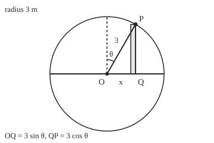

# Trig substitution: square roots of quadratics through a triangle

[Syllabus](../../../SYLLABUS.md) → [Calculus and analysis](../README.md) → [Integrals](../README.md#s04) → Trig substitution

---

## General Overview

A round pond has radius 3 metres. Lay a measuring line across its middle, from −3 m to 3 m. At x metres along it, the bank stands √(9 − x^2) metres to either side, by Pythagoras. Strips of width dx and length 2√(9 − x^2), added up, give the pond's area.

The root blocks the power rule, and no inner rate sits in front for plain substitution to grab. Walk round the bank instead. Measure a bank point by its angle θ (theta, in radians) from the dashed upright through the centre. It sits 3 sin θ along the line and 3 cos θ out from it. The identity 1 − sin^2 θ = cos^2 θ turns the root into a plain cosine.

That swap is **trig substitution**: write x as a sine, tangent or secant, restrict the angle so each x has exactly one, and the root becomes a trig function. The pond comes to 9π = 28.274334 square metres.

**For a root of a^2 − x^2, put x = a sin θ with θ between −π/2 and π/2: the root becomes a cos θ, the strip width a cos θ dθ, and a double-angle identity finishes the integral.**

**What kind of fact this is:** a method, justified by the substitution theorem in Why it works; the area it recovers was first proved by polygons.

### The picture: the triangle inside the pond

<p align="center"></p>

Scale: 1 m = 32 units. Centre O (180, 124), top of the bank (180, 28.00), P (228.00, 40.86), Q (228.00, 124); the angle's arc ends at (192.00, 103.22). P sits above x = 1.5 m, at θ = 0.523599 radians from the dashed upright. Triangle OQP is the method: hypotenuse 3, one leg x, the other leg the root.

---

## The formula

Reminder: the substitution rule, with its moved limits, is [Substitution](03-substitution.md). Here it runs right to left: the old variable x is written as a function of a new one, θ.

$$\int_{-a}^{a} \sqrt{a^2 - x^2}\,dx \;=\; \int_{-\pi/2}^{\pi/2} a\cos\theta \cdot a\cos\theta\,d\theta \;=\; \frac{\pi a^2}{2}$$

**Read it aloud:** the half circle's area is the root a cos θ times the restretched width a cos θ, accumulated over a half turn: half of pi a squared.

Doubled, the pond is $A = \pi a^2 = 9\pi$ = 28.274334 m^2. Without limits, the same steps give the antiderivative

$$\int \sqrt{a^2 - x^2}\,dx = \tfrac12\left(x\sqrt{a^2 - x^2} + a^2\,\theta\right) + C, \qquad \sin\theta = \frac{x}{a},\ -\tfrac{\pi}{2} \le \theta \le \tfrac{\pi}{2}$$

That θ is the inverse sine of x/a, written arcsin(x/a): the angle on the branch whose sine is x/a.

| Symbol | Plain meaning | In our example | Push it up and the answer… |
| --- | --- | --- | --- |
| $a$ | the radius | 3 m | area grows as its square |
| $x$ | position along the line | −3 m to 3 m | — |
| $\theta$ | angle from the dashed upright, radians | −π/2 to π/2 | x moves right |
| $dx$, $d\theta$ | strip widths on the x and θ rulers | dx = 3 cos θ dθ | — |
| $A$ | the area enclosed | 28.274334 m^2 | — |
| $F$, $C$ | an antiderivative; its free constant | F(1.5) − F(0) = 4.304752 m^2 | C cancels |
| $\sin$, $\cos$, $\tan$, $\sec$ | trig functions; sec θ = 1/cos θ | root = 3 cos θ | tan, sec blow up at π/2 |
| $\pi$ | a half turn; circumference over diameter | 3.141592653590 | — |

The other two shapes, each with its own identity:

| Root | Put | Identity used | Root becomes | Branch |
| --- | --- | --- | --- | --- |
| √(a^2 + x^2) | x = a tan θ | 1 + tan^2 = sec^2 | a sec θ | −π/2 < θ < π/2 |
| √(x^2 − a^2), x ≥ a | x = a sec θ | sec^2 − 1 = tan^2 | a tan θ | 0 ≤ θ < π/2 |
| √(x^2 − a^2), x ≤ −a | x = a sec θ | sec^2 − 1 = tan^2 | −a tan θ, as tan θ ≤ 0 | π/2 < θ ≤ π |

### When it holds

- **The root is real on the interval:** here x from −3 to 3.
- **The substitution has a continuous rate,** here 3 cos θ; it need not be one-to-one.
- **The branch is named before the root is removed.** √(cos^2 θ) is |cos θ|, the size without the sign. Off the branch, 14.137167 comes out where −14.137167 is true.
- **Angles are in radians.** Only then is the rate of sin θ equal to cos θ.
- **Tangent and secant stay short of π/2**, where neither has a value.

---

## Why it works

### Step 0: a point on a circle is a sine and a cosine

Wherever x = 3 sin θ, Pythagoras has done the work: 9 − x^2 = 9 − 9 sin^2 θ = 9 cos^2 θ ([Trig identities](../../05-Geometry%20and%20trig/03-Trigonometry/03-trig-identities.md)). Taking the root of a square needs a choice.

### Step 1: choose the branch, so the root has one sign

As θ runs from −π/2 to π/2, sine takes each value from −1 to 1 exactly once, and cos θ is never negative. Keep θ there. So

√(9 − x^2) = 3|cos θ| = 3 cos θ.

θ = 5π/6 also gives x = 1.500000, but there 3 cos θ is −2.598076 while the root is +2.598076: that angle is off the branch.

### Step 2: change the strips and the limits together

The rate of 3 sin θ is 3 cos θ ([Derivatives of sine and cosine](../02-Derivatives/04-derivatives-of-trig-functions.md)), so a strip of angle width dθ is a strip of width 3 cos θ dθ on the line. The ends move too: x = −3 is θ = −π/2, and x = 3 is θ = π/2. The half pond is

$$\int_{-3}^{3}\sqrt{9 - x^2}\,dx = \int_{-\pi/2}^{\pi/2} 9\cos^2\theta\,d\theta$$

One factor 3 cos θ is the root, the other the stretch between rulers.

### Step 3: the double-angle identity finishes it

cos^2 θ = (1 + cos 2θ)/2, so 9 cos^2 θ has antiderivative (9/2)(θ + sin θ cos θ); its rate, by the product rule, is 9 cos^2 θ. At θ = ±π/2 the product sin θ cos θ is 0, so the half pond is (9/2)(π/2 − (−π/2)) = 9π/2, and the pond is 9π = 28.274334 m^2.

The π arrived through the limits: sine first reaches 1 at a quarter turn, 1.570796326795, which the code finds as cosine's first zero. Polygons of 6291456 sides, measuring circumference over diameter ([Circles](../../05-Geometry%20and%20trig/02-Circles%20and%20Solids/01-circle-circumference-and-area.md)), give the same 3.141592653590.

### Step 4: honestly, what this proves and what it borrows

The rate of sin θ was proved by trapping a slice of circle between two triangles, and that slice's area came from the disc's area. So this calculation confirms πr^2 rather than proving it from nothing. The midpoint sum in x stands alone: square roots only, and it closes on 28.274334.

<details>
<summary>Detailed proof</summary>

**The substitution, read right to left.** Let f(x) = √(9 − x^2), continuous on [−3, 3], and g(θ) = 3 sin θ, with continuous rate 3 cos θ. The substitution theorem says the integral of f(g(θ)) g'(θ) from −π/2 to π/2 equals the integral of f from g(−π/2) = −3 to g(π/2) = 3. No inverse is used; the branch only turns f(g(θ)) = 3|cos θ| into 3 cos θ.

**The antiderivative in x.** For −3 < x < 3, θ(x) = arcsin(x/3) has rate 1/√(9 − x^2). Then F(x) = ½(x√(9 − x^2) + 9θ(x)) has rate ½(√(9 − x^2) − x^2/√(9 − x^2) + 9/√(9 − x^2)) = √(9 − x^2). By continuity at ±3, F(3) − F(−3) = 9π/2.

**Removing the borrowed area.** Measure angle by arc length ([Arc length](../05-Curves%20and%20Solids/02-arc-length.md)): the unit circle's arc from its top to the point above s has length the integral of 1/√(1 − t^2) from 0 to s, which gives arcsin its rate, and sine its rate, with no slice of disc. The calculation then proves the area outright.

</details>

### Step 5: a relative, through the 3-4-5 triangle

Take the integral of 1/√(9 + x^2) from 0 to 4. Put x = 3 tan θ, θ short of π/2. The root becomes 3 sec θ and dx = 3 sec^2 θ dθ, so the integrand becomes sec θ, whose antiderivative is ln(sec θ + tan θ): its rate is (sec θ tan θ + sec^2 θ)/(sec θ + tan θ) = sec θ.

At x = 4 the triangle has legs 3 and 4 and hypotenuse 5: tan θ = 4/3, sec θ = 5/3. At x = 0 the sum sec θ + tan θ is 1. The integral is ln 3 = 1.098612, and the angle itself was never needed.

A second route to roots of a^2 + x^2 is x = 3 sinh t, since cosh^2 t − sinh^2 t = 1; it has no pole at π/2 to avoid.

---

## Worked numbers, by hand

| Step | Arithmetic | Value |
| --- | --- | --- |
| substitution | x = 3 sin θ | root = 3 cos θ, dx = 3 cos θ dθ |
| move the limits | sin θ = −1 and sin θ = 1 | θ = −1.570796 to 1.570796 |
| integrand in θ | 3 cos θ × 3 cos θ | 9 cos^2 θ |
| half pond | (9/2)(θ + sin θ cos θ), sin θ cos θ = 0 at the ends: (9/2)(1.570796 + 1.570796) | 14.137167 |
| whole pond | 2 × 14.137167 | **28.274334 m^2** |
| strip x = 0 to 1.5 | sector (9/2)(0.523599) + triangle ½(1.5)(2.598076) | 2.356194 + 1.948557 = **4.304752 m^2** |

The strip from 0 to 1.5 m, on one side of the line, is a sector plus a right triangle: the two terms of F.

### What breaks if you drop a piece

| Mistake | Comes out at | What went wrong |
| --- | --- | --- |
| The dx factor 3 cos θ dropped | 12.000000, not 28.274334 | the strips were never restretched |
| Limits −3 and 3 kept as angles | 51.485261 | the ends are positions, not angles |
| θ from π/2 to 3π/2, root as 3 cos θ | 14.137167, true −14.137167 | off the branch, cos θ is negative |

---

## Code, from first principles, and it actually runs

No built-in π: the quarter turn comes from halving an interval until cosine changes sign, and π again from polygons. Road one is the antiderivative; road two a midpoint sum in x (equal strips, each at its centre's height); road three a midpoint sum in θ.

### Python

```python
# Trig substitution -- the check behind the card.  Standard library only; sin, cos,
# sqrt and log are primitives, and no built-in pi is used.  A pond of radius 3 m:
# its area by x = 3 sin(theta) and by midpoint sums; a relative by x = 3 tan(theta).
import math
R = 3.0

def bisect(fn, lo, hi):                     # a root of fn between lo and hi
    for _ in range(200):
        m = (lo + hi) / 2
        lo, hi = (m, hi) if (fn(lo) > 0) == (fn(m) > 0) else (lo, m)
    return (lo + hi) / 2

def mid(fn, a, b, n):                       # midpoint sum: n strips, height at each centre
    w = (b - a) / n
    return w * sum(fn(a + (k + 0.5) * w) for k in range(n))

quarter = bisect(math.cos, 1.0, 2.0)        # the quarter turn: cos first reaches 0
s, sides = 1.0, 6                           # hexagon in a circle of radius 1: side 1
for _ in range(20):
    s, sides = s / math.sqrt(2 + math.sqrt(4 - s * s)), sides * 2
pi_poly = sides * s / 2                     # half the perimeter, square roots only
root = lambda x: math.sqrt(max(R * R - x * x, 0.0))
F_theta = lambda t: R * R / 2 * (t + math.sin(t) * math.cos(t))   # antiderivative of 9 cos^2
area = 2 * (F_theta(quarter) - F_theta(-quarter))
print(f"pond radius 3 m; quarter turn, first zero of cos: {quarter:.12f}")
print(f"pi from the zero of cos: {2 * quarter:.12f}; from {sides} sides: {pi_poly:.12f}")
print(f"road 1, substitution, 2 x (9/2)(pi/2 + pi/2) = {area:.6f} m^2")
errs = []
for n in (10, 100, 1000, 10000):
    v = mid(lambda x: 2 * root(x), -R, R, n)
    errs.append(v - area)
    print(f"road 2, midpoint sum in x, n = {n:5}: {v:.6f}  error {v - area:.9f}")
th = mid(lambda t: 2 * R * R * math.cos(t) ** 2, -quarter, quarter, 10)
print(f"road 3, midpoint sum in theta, n = 10: {th:.6f}  error {th - area:.9f}")
t1 = bisect(lambda t: R * math.sin(t) - 1.5, -quarter, quarter)   # the branch's own angle
strip, sector, tri = F_theta(t1) - F_theta(0), R * R * t1 / 2, 1.5 * root(1.5) / 2
xs = mid(root, 0, 1.5, 10000)
print(f"strip x = 0 to 1.5: theta = {t1:.6f}; formula {strip:.6f} = sector {sector:.6f}"
      f" + triangle {tri:.6f}; x sum {xs:.6f}")
other = 5 * quarter / 3                     # 5 pi / 6, off the branch
print(f"branch: theta = 5pi/6 gives x = {R * math.sin(other):.6f}; root {root(1.5):.6f};"
      f" 3 cos theta {R * math.cos(other):.6f}")
rel = mid(lambda x: 1 / math.sqrt(9 + x * x), 0, 4, 10000)
sec, tan = math.sqrt(9 + 16) / 3, 4 / 3     # the 3-4-5 triangle at x = 4
print(f"relative, 1/sqrt(9 + x^2) from 0 to 4: sec {sec:.6f} + tan {tan:.6f};"
      f" ln 3 = {math.log(sec + tan):.6f}; x sum {rel:.6f}")
print(f"mistake, dx factor dropped: {2 * R * (math.sin(quarter) - math.sin(-quarter)):.6f}, not {area:.6f}")
print(f"mistake, x limits -3 and 3 kept as angles: {2 * (F_theta(3) - F_theta(-3)):.6f}")
naive = mid(lambda t: R * R * math.cos(t) ** 2, quarter, 3 * quarter, 1000)
true = -mid(root, -R, R, 100000)            # x runs from 3 back to -3
print(f"mistake, root read as 3 cos theta on theta from pi/2 to 3pi/2: {naive:.6f}; true {true:.6f}")
sc, cx, cy = 32, 180, 124                   # figure: 32 px per metre, centre at (180, 124)
print(f"figure, centre ({cx}, {cy}), top ({cx}, {cy - sc * R:.2f}), P ({cx + sc * 1.5:.2f},"
      f" {cy - sc * root(1.5):.2f}), Q ({cx + sc * 1.5:.2f}, {cy}), arc end"
      f" ({cx + 24 * math.sin(t1):.2f}, {cy - 24 * math.cos(t1):.2f})")
assert abs(2 * quarter - pi_poly) < 1e-9                        # radian pi meets polygon pi
assert abs(errs[3]) < 1e-4 and abs(th - R * R * pi_poly) < 1e-9   # road 1 meets road 2; road 3 meets 9 pi
assert abs(xs - strip) < 1e-6 and abs(errs[3]) < abs(errs[2]) / 20
assert abs(rel - math.log(sec + tan)) < 1e-6 and abs(naive + true) < 1e-6   # tangent relative; off-branch sign flip
print("ALL CHECKS PASS")
```

**Ran 2026-09-27 on macOS, Python 3.14.6, standard library only. All checks passed. Output, pasted from the run:**

```
pond radius 3 m; quarter turn, first zero of cos: 1.570796326795
pi from the zero of cos: 3.141592653590; from 6291456 sides: 3.141592653590
road 1, substitution, 2 x (9/2)(pi/2 + pi/2) = 28.274334 m^2
road 2, midpoint sum in x, n =    10: 28.547890  error 0.273556530
road 2, midpoint sum in x, n =   100: 28.283090  error 0.008756090
road 2, midpoint sum in x, n =  1000: 28.274611  error 0.000277229
road 2, midpoint sum in x, n = 10000: 28.274343  error 0.000008768
road 3, midpoint sum in theta, n = 10: 28.274334  error 0.000000000
strip x = 0 to 1.5: theta = 0.523599; formula 4.304752 = sector 2.356194 + triangle 1.948557; x sum 4.304752
branch: theta = 5pi/6 gives x = 1.500000; root 2.598076; 3 cos theta -2.598076
relative, 1/sqrt(9 + x^2) from 0 to 4: sec 1.666667 + tan 1.333333; ln 3 = 1.098612; x sum 1.098612
mistake, dx factor dropped: 12.000000, not 28.274334
mistake, x limits -3 and 3 kept as angles: 51.485261
mistake, root read as 3 cos theta on theta from pi/2 to 3pi/2: 14.137167; true -14.137167
figure, centre (180, 124), top (180, 28.00), P (228.00, 40.86), Q (228.00, 124), arc end (192.00, 103.22)
ALL CHECKS PASS
```

### Rust

Same numbers, same labels, built with `rustc --edition 2021 -O`.

```rust
// Trig substitution -- the same check as the Python, in Rust.  No crates; sin,
// cos, sqrt and ln are primitives, and no built-in pi is used.  A pond of radius
// 3 m: its area by x = 3 sin(theta) and by midpoint sums; a relative by x = 3 tan(theta).
const R: f64 = 3.0;

fn bisect(f: &dyn Fn(f64) -> f64, mut lo: f64, mut hi: f64) -> f64 {   // a root of f between lo and hi
    for _ in 0..200 {
        let m = (lo + hi) / 2.0;
        if (f(lo) > 0.0) == (f(m) > 0.0) { lo = m } else { hi = m }
    }
    (lo + hi) / 2.0
}

fn mid(f: &dyn Fn(f64) -> f64, a: f64, b: f64, n: usize) -> f64 {   // midpoint sum
    let w = (b - a) / n as f64;
    w * (0..n).map(|k| f(a + (k as f64 + 0.5) * w)).sum::<f64>()
}

fn root(x: f64) -> f64 { (R * R - x * x).max(0.0).sqrt() }
fn f_theta(t: f64) -> f64 { R * R / 2.0 * (t + t.sin() * t.cos()) }   // antiderivative of 9 cos^2

fn main() {
    let quarter = bisect(&|t: f64| t.cos(), 1.0, 2.0);   // the quarter turn: cos first reaches 0
    let (mut s, mut sides) = (1.0f64, 6u64);            // hexagon in a circle of radius 1: side 1
    for _ in 0..20 {
        s = s / (2.0 + (4.0 - s * s).sqrt()).sqrt();
        sides *= 2;
    }
    let pi_poly = sides as f64 * s / 2.0;               // half the perimeter, square roots only
    let area = 2.0 * (f_theta(quarter) - f_theta(-quarter));
    println!("pond radius 3 m; quarter turn, first zero of cos: {:.12}", quarter);
    println!("pi from the zero of cos: {:.12}; from {} sides: {:.12}", 2.0 * quarter, sides, pi_poly);
    println!("road 1, substitution, 2 x (9/2)(pi/2 + pi/2) = {:.6} m^2", area);
    let mut errs = Vec::new();
    for n in [10usize, 100, 1000, 10000] {
        let v = mid(&|x| 2.0 * root(x), -R, R, n);
        errs.push(v - area);
        println!("road 2, midpoint sum in x, n = {:5}: {:.6}  error {:.9}", n, v, v - area);
    }
    let th = mid(&|t: f64| 2.0 * R * R * t.cos().powi(2), -quarter, quarter, 10);
    println!("road 3, midpoint sum in theta, n = 10: {:.6}  error {:.9}", th, th - area);
    let t1 = bisect(&|t: f64| R * t.sin() - 1.5, -quarter, quarter);   // the branch's own angle
    let (strip, sector, tri) = (f_theta(t1) - f_theta(0.0), R * R * t1 / 2.0, 1.5 * root(1.5) / 2.0);
    let xs = mid(&root, 0.0, 1.5, 10000);
    println!("strip x = 0 to 1.5: theta = {:.6}; formula {:.6} = sector {:.6} + triangle {:.6}; x sum {:.6}",
             t1, strip, sector, tri, xs);
    let other = 5.0 * quarter / 3.0;                    // 5 pi / 6, off the branch
    println!("branch: theta = 5pi/6 gives x = {:.6}; root {:.6}; 3 cos theta {:.6}",
             R * other.sin(), root(1.5), R * other.cos());
    let rel = mid(&|x: f64| 1.0 / (9.0 + x * x).sqrt(), 0.0, 4.0, 10000);
    let (sec, tan) = ((9.0f64 + 16.0).sqrt() / 3.0, 4.0 / 3.0);   // the 3-4-5 triangle at x = 4
    println!("relative, 1/sqrt(9 + x^2) from 0 to 4: sec {:.6} + tan {:.6}; ln 3 = {:.6}; x sum {:.6}",
             sec, tan, (sec + tan).ln(), rel);
    println!("mistake, dx factor dropped: {:.6}, not {:.6}", 2.0 * R * (quarter.sin() - (-quarter).sin()), area);
    println!("mistake, x limits -3 and 3 kept as angles: {:.6}", 2.0 * (f_theta(3.0) - f_theta(-3.0)));
    let naive = mid(&|t: f64| R * R * t.cos().powi(2), quarter, 3.0 * quarter, 1000);
    let truth = -mid(&root, -R, R, 100000);             // x runs from 3 back to -3
    println!("mistake, root read as 3 cos theta on theta from pi/2 to 3pi/2: {:.6}; true {:.6}", naive, truth);
    let (sc, cx, cy) = (32.0, 180.0, 124.0);            // figure: 32 px per metre, centre at (180, 124)
    println!("figure, centre ({}, {}), top ({}, {:.2}), P ({:.2}, {:.2}), Q ({:.2}, {}), arc end ({:.2}, {:.2})",
             cx, cy, cx, cy - sc * R, cx + sc * 1.5, cy - sc * root(1.5), cx + sc * 1.5, cy,
             cx + 24.0 * t1.sin(), cy - 24.0 * t1.cos());
    assert!((2.0 * quarter - pi_poly).abs() < 1e-9);                          // radian pi meets polygon pi
    assert!(errs[3].abs() < 1e-4 && (th - R * R * pi_poly).abs() < 1e-9);    // road 1 meets road 2; road 3 meets 9 pi
    assert!((xs - strip).abs() < 1e-6 && errs[3].abs() < errs[2].abs() / 20.0);
    assert!((rel - (sec + tan).ln()).abs() < 1e-6 && (naive + truth).abs() < 1e-6);   // tangent relative; off-branch sign flip
    println!("ALL CHECKS PASS");
}
```

**Ran 2026-09-27 on macOS, rustc 1.98.1, no crates. All checks passed. Output, pasted from the run:**

```
pond radius 3 m; quarter turn, first zero of cos: 1.570796326795
pi from the zero of cos: 3.141592653590; from 6291456 sides: 3.141592653590
road 1, substitution, 2 x (9/2)(pi/2 + pi/2) = 28.274334 m^2
road 2, midpoint sum in x, n =    10: 28.547890  error 0.273556530
road 2, midpoint sum in x, n =   100: 28.283090  error 0.008756090
road 2, midpoint sum in x, n =  1000: 28.274611  error 0.000277229
road 2, midpoint sum in x, n = 10000: 28.274343  error 0.000008768
road 3, midpoint sum in theta, n = 10: 28.274334  error 0.000000000
strip x = 0 to 1.5: theta = 0.523599; formula 4.304752 = sector 2.356194 + triangle 1.948557; x sum 4.304752
branch: theta = 5pi/6 gives x = 1.500000; root 2.598076; 3 cos theta -2.598076
relative, 1/sqrt(9 + x^2) from 0 to 4: sec 1.666667 + tan 1.333333; ln 3 = 1.098612; x sum 1.098612
mistake, dx factor dropped: 12.000000, not 28.274334
mistake, x limits -3 and 3 kept as angles: 51.485261
mistake, root read as 3 cos theta on theta from pi/2 to 3pi/2: 14.137167; true -14.137167
figure, centre (180, 124), top (180, 28.00), P (228.00, 40.86), Q (228.00, 124), arc end (192.00, 103.22)
ALL CHECKS PASS
```

The outputs match line for line. Road two closes slowly, 0.273556530 off at 10 strips and 0.000008768 at 10000, because the bank meets the line at right angles. In θ the area is the smooth wave 18 cos^2 θ, and 10 strips are exact to nine places.

> [!TIP]
> **Try changing**
> Guess first, then run it.
> - **Drop the stretch.** Change `2 * R * R * math.cos(t) ** 2` to `2 * R * math.cos(t)`: road three falls near 12.000000 and the second assert stops the run.
> - **Leave the branch.** Replace `-quarter, quarter, 10` with `quarter, 3 * quarter, 10`: road three still prints 28.274334 and every assert passes, though x now runs from 3 back to −3. Only the branch rule catches it.
> - **Lose the quarter turn.** Change the bracket `1.0, 2.0` to `1.0, 1.5`: cosine has no zero there, and the first assert stops the run.

---

## The usual mistake

> [!warning]
> **Writing √(cos^2 θ) = cos θ without naming the branch.** The root of a square is its size, |cos θ|: cos θ on −π/2 to π/2, −cos θ on π/2 to 3π/2. The wrong half turn gives +14.137167 for an integral from x = 3 back to −3 that equals −14.137167.
>
> - **Trusting an unsigned triangle.** The drawing gives sizes; for negative x the sign comes from the branch.

---

## Where you meet it in real life

- **Fuel in a horizontal tank.** The fuel at a given depth fills a slice of circle, a sector plus a triangle as above; that sets the gauge markings.
- **Arc length of a parabola.** The length of y = x^2 needs √(1 + 4x^2), cleared by a tangent substitution.

> **Say it back**
> A root of a^2 − x^2 is a leg of a right triangle with hypotenuse a. Writing x = a sin θ, θ between −π/2 and π/2, makes it a cos θ. The strip width becomes a cos θ dθ and the limits become angles. A pond of radius 3 m comes to 9π = 28.274334 m^2. Tangent and secant do the same for a^2 + x^2 and x^2 − a^2.

---

## What this builds on

- [Substitution](03-substitution.md): the theorem that lets x be replaced by 3 sin θ, strips and limits together.
- [Derivatives of sine and cosine](../02-Derivatives/04-derivatives-of-trig-functions.md): the rate 3 cos θ, and sec θ tan θ for the secant row.
- [Trig identities](../../05-Geometry%20and%20trig/03-Trigonometry/03-trig-identities.md): the three Pythagorean identities and the double angle.

## Where this goes next

- [Improper integrals](07-improper-integrals.md): integrands that run off to infinity at an end, such as 1/√(9 − x^2) at x = 3.
- [Numerical integration](08-numerical-integration.md): error ceilings set by a curve's derivatives, which the bank's vertical ends break.
- [Averages, mass and work](09-average-value-mass-and-work.md): averages as integrals; the pond's mean width is its area over 6 m.

---

## Sources

Verified 2026-09-27: every link below resolves to the publisher's page.

- Strang, Gilbert, Edwin Herman, et al. *Calculus Volume 2*, OpenStax, Rice University. [Section 3.3, Trigonometric Substitution](https://openstax.org/books/calculus-volume-2/pages/3-3-trigonometric-substitution). The three shapes and their branches.
- Spivak, Michael. *Calculus*, 4th ed. Publish or Perish, 2008. [Publisher page](https://mathpop.com/products/calculus-4th-edition). Defines π by this card's area integral, avoiding Step 4's circularity.
- Jerison, David, et al. *18.01SC Single Variable Calculus*, MIT OpenCourseWare, Fall 2010. [Course page](https://ocw.mit.edu/courses/18-01sc-single-variable-calculus-fall-2010/). Lectures and problems on trig substitution.
