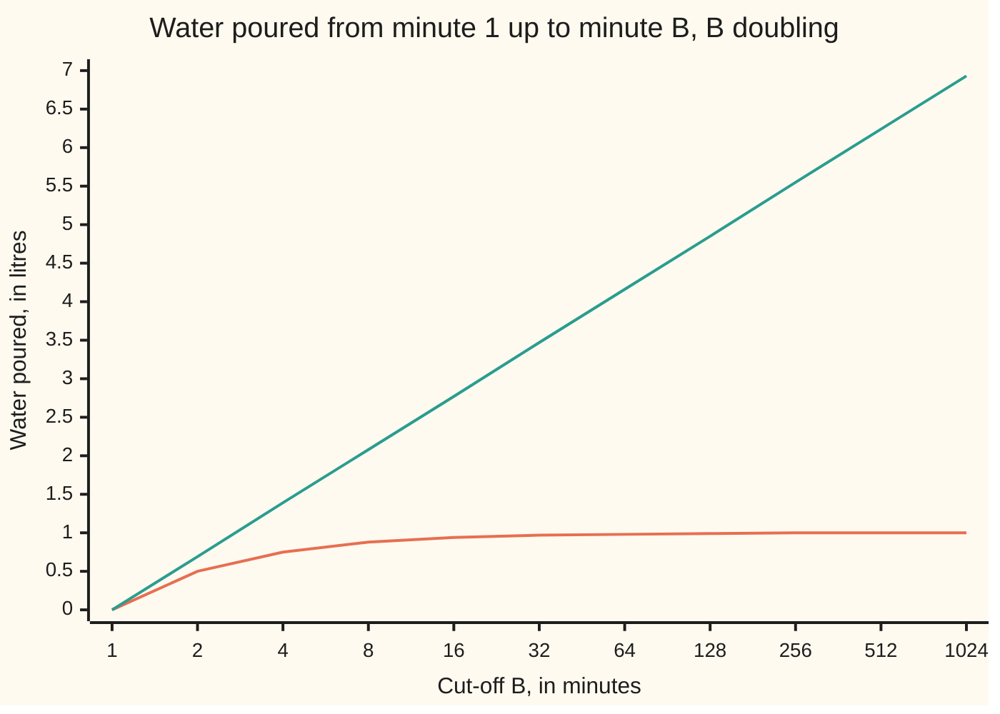

# Improper integrals: infinite intervals and infinite spikes, each as a limit

[Syllabus](../../../SYLLABUS.md) → [Calculus and analysis](../README.md) → [Integrals](../README.md#s04) → Improper integrals

---

## General Overview

Two taps open at minute 1 and are never shut. At minute t the first pours 1/t^2 litres a minute, the second 1/t. By minute 10 they are down to a hundredth and a tenth. Does either, left running for ever, pour a finite amount?

An ordinary integral needs a finite interval ([The integral](01-riemann-integral.md)). So stop the clock at minute B, total as usual, and push B out.

The first tap has poured 0.9 litres by minute 10, 0.99 by minute 100, 0.999 by minute 1000: heading for 1 litre, the answer. The second adds 0.693147 litres every time the clock doubles, for ever. The first integral **converges** (settles on a finite number); the second **diverges**.

A rate that shoots up without bound, a spike, is handled the same way: stop short of it and let the gap close.

**An improper integral is the limit of ordinary integrals over finite pieces as the cut-off heads for the trouble: a finite limit means it converges, anything else means it diverges.**

**What kind of fact this is:** a definition; the power rule and the comparison test that decide convergence are theorems, proved on this card in Why it works.

### The picture: two fading taps, one settles and one does not



The lower line is the 1/t^2 tap, levelling off at 1 litre. The climbing line is the 1/t tap, up 0.69 litres per doubling of the clock, with no ceiling.

---

## The formula

Notation first, in words. The sign $\infty$, read "infinity", is not a number: as an integral's upper end it means no end; in a limit, B growing past every number. A small plus after the 0 under a limit says the cut-off approaches 0 from above.

The first kind, an endless interval:

$$\int_a^\infty f(t)\,dt = \lim_{B\to\infty} \int_a^B f(t)\,dt$$

**Read it aloud:** the total from a for ever is where the total from a to B heads as B grows without bound.

The second kind, a spike at 0:

$$\int_0^1 f(t)\,dt = \lim_{s\to 0^+} \int_s^1 f(t)\,dt$$

**Read it aloud:** the total up to a spike is where the total from s to 1 heads as the gap s closes.

The power rule, the usual yardstick:

$$\int_1^\infty \frac{dt}{t^p} = \frac{1}{p-1} \text{ if } p > 1, \qquad \int_0^1 \frac{dt}{t^p} = \frac{1}{1-p} \text{ if } p < 1$$

and each diverges otherwise, p = 1 included.

The comparison test: if $0 \le f(t) \le g(t)$ from some point on, a finite total for g forces one for f, and an endless total for f forces one for g.

| Symbol | Plain meaning | In our example | Push it up and the answer… |
| --- | --- | --- | --- |
| $f$, $g$ | a rate in litres a minute; a larger rate it is compared with | 1/(t^2 + t) under 1/t^2 | a bigger total |
| $t$ | time in minutes, the variable inside | minute 1 onwards | — |
| $a$ | the fixed, well-behaved end | minute 1 | less water |
| $B$, $B_0$ | a far cut-off in minutes; $B_0$ one fixed in the proof | 10, 100, 1000 | more of the tail collected |
| $s$ | a near cut-off: the gap left beside a spike | 0.01, 0.0001 | more of the spike left out |
| $p$ | the power in 1/t^p: how fast the rate fades | 2, then 1 | a smaller total far out |
| $\infty$ | no end: a direction, not a number | taps never shut | — |
| $F$, $G$, $L$ | f's running total; g's full total; F's limit, in the proof | 1 litre for G | — |

### When it holds

The definition needs only that each finite piece is an ordinary integral. The tests carry conditions:

- **The rate is integrable on every finite piece clear of trouble.** Continuity there is enough.
- **Every trouble spot takes its own limit.** 1/t on −1 to 1 is split at 0, and neither side settles, so it diverges, whatever paired gaps suggest. A whole-line integral splits at any point, and both halves must settle.
- **Comparison needs a rate that is never negative.** −1/t sits below 1/t^2, yet its totals run off to minus infinity.
- **The inequality need only hold from some point on.** An earlier finite piece changes the value, never the verdict.

---

## Why it works

### Step 0: cut, total, then let the cut move

An ordinary integral needs finitely many strips of finite height; an endless interval breaks the first, a spike the second. On a finite piece clear of trouble, the fundamental theorem ([Fundamental theorem of calculus](02-fundamental-theorem-of-calculus.md)) evaluates it with an antiderivative. The limit comes afterwards.

### Step 1: the 1/t^2 tap settles on 1 litre

The rate 1/t^2 has antiderivative −1/t, since the rate of −1/t is 1/t^2. On 1 to B:

$$\int_1^B \frac{dt}{t^2} = -\frac{1}{B} - \left(-\frac{1}{1}\right) = 1 - \frac{1}{B}$$

The shortfall from 1 is exactly 1/B, the water still to come. The tolerance game: to land within 0.001 litres of 1, need B at least 1000. At B = 999 the shortfall is 0.001001, too big; at B = 1000, 0.001000. Every target is met by a large enough B, so the limit is 1 litre.

### Step 2: doubling blocks show why one settles and one does not

Cut the time line at 1, 2, 4, 8, and so on: each block twice as long as the last.

For 1/t^2, each block's rate is a quarter of the last's and the block twice as long: the area halves. The blocks hold 0.5, 0.25, 0.125, 0.0625 litres, a geometric series with total 1.

For 1/t, the rate halves while the length doubles: every block holds ln(2B) − ln B = ln 2 = 0.693147 litres. Ten blocks, minute 1 to 1024, hold 6.931472 litres, and nothing stops the climb.

The rate must fade faster than the blocks grow.

### Step 3: the power rule, both ends

For p other than 1, the rate of t^(1−p)/(1−p) is t^−p, so

$$\int_1^B \frac{dt}{t^p} = \frac{B^{1-p} - 1}{1-p}$$

When p > 1, B^(1−p) heads for 0 and the total for 1/(p − 1). When p < 1, B^(1−p) grows without bound; at p = 1 the total is ln B, unbounded too. In blocks: each doubling block holds 2^(1−p) times the last, a shrinking factor exactly when p > 1.

Near 0, for a gap s,

$$\int_s^1 \frac{dt}{t^p} = \frac{1 - s^{1-p}}{1-p}$$

and s^(1−p) heads for 0 exactly when p < 1: the rule flips. A tap gushing 1/√t litres a minute as it opens (p = 1/2) totals 2 − 2√s from s to 1: 1.8, 1.98, 1.998 at gaps 0.01, 0.0001, 0.000001, heading for 2 litres. The spike of 1/t^2 is too tall: its halving blocks toward 0 double, and from 1/1024 to 1 hold 1023 litres. The borderline 1/t diverges at both ends.

### Step 4: comparison, when there is no antiderivative to hand

Take 0 ≤ f(t) ≤ g(t) from minute a on, with g's total finite, G litres. The running total of f never falls, since f is never negative, and never passes G. A total that only rises below a ceiling has a limit: the real numbers have no gaps, and its least upper bound (sup) is that limit.

Example: 1/(t^2 + t) is below 1/t^2, so its total is at most 1 litre. [Partial fractions](05-partial-fractions.md) gives the exact value, ln 2 = 0.693147.

Turned round: 1/√t is at least 1/t from minute 1, so it diverges; its totals 2√B − 2 read 18 at B = 100 and 198 at B = 10,000.

<details>
<summary>Detailed proof</summary>

**Claim.** Let f and g be integrable from a to every B, with $0 \le f(t) \le g(t)$ for t ≥ a. If g's integral from a to infinity converges to G, f's converges, to at most G.

**Proof.** Write F(B) for the integral of f from a to B. For B < C, F(C) − F(B) is f's integral from B to C, at least 0, so F never falls. By the comparison property F(B) is at most g's integral to B, itself at most G. So F has an upper bound, and by the no-gaps property a least upper bound $L$.

Take any target closeness $\varepsilon > 0$, the 0.001 of Step 1 made general. $L - \varepsilon$ is not an upper bound, so some $B_0$ has $F(B_0) > L - \varepsilon$. For every B beyond $B_0$, $L - \varepsilon < F(B_0) \le F(B) \le L$. So the limit is $L$, and $L \le G$.

**The other half.** If f's integral diverges, F is unbounded (a bounded, never-falling F converges), so g's running total, at least F(B), is too. A gap s closing on a spike in place of B gives the second kind.

</details>

A second road to every number here adds up the blocks by Simpson's rule, with no antiderivative ([Numerical integration](08-numerical-integration.md)).

---

## Worked numbers, by hand

| Step | Arithmetic | Value |
| --- | --- | --- |
| B = 10, 100, 1000 | 1 − 0.1, 1 − 0.01, 1 − 0.001 | 0.9, 0.99, 0.999 litres |
| let B grow | shortfall 1/B heads for 0 | **1 litre** |
| blocks for 1/t^2 | each block half the one before | 0.5, 0.25, 0.125, 0.0625 |
| blocks for 1/t | ln(2B) − ln B | 0.693147 every time |
| ten blocks of 1/t | 10 × ln 2 | 6.931472, still climbing |
| spike 1/√t, gap 0.0001 | 2 − 2 × 0.01 | 1.98, heading for **2 litres** |

The first tap, run for ever, pours exactly 1 litre; the second overflows any tank, slowly.

### What breaks if you drop a piece

| Mistake | Comes out at | What went wrong |
| --- | --- | --- |
| Stop at B = 100 | 0.99 litres, missing 0.01 | a cut-off is not the limit |
| Compare −1/t with 1/t^2 | −6.907755 by B = 1000, −13.815511 by 1,000,000 | comparison needs a never-negative rate |
| 1/t on −1 to 1 with gaps paired | 0 with equal gaps, −0.693147 with 0.01 and 0.02 | each side must settle on its own |
| −1/t across 0 for 1/t^2 on −1 to 1 | −2 from a positive rate | 1/1024 to 1 alone holds 1023 |

The code prints all four.

---

## Code, from first principles, and it actually runs

Two roads that share no arithmetic. Road one reads antiderivatives at the ends. Road two adds Simpson's-rule areas block by block, doubling outward along a tail, halving inward toward a spike. Four asserts hold the roads together: for 1/t^2, 1/t, the power rule, and the spike with the comparison example.

### Python

```python
# Improper integrals -- the check behind the card.  Standard library only:
# math.log and math.sqrt are primitives; every integral is our own Simpson sum.
# The tap pours 1/t^2 litres a minute from minute 1 on; its rival pours 1/t.
import math

def simpson(f, a, b, n=64):              # Simpson's rule, n strips (n even)
    h = (b - a) / n
    s = f(a) + f(b) + sum((4 if k % 2 else 2) * f(a + k * h) for k in range(1, n))
    return s * h / 3

def blocks(f, k):                        # areas over [1,2], [2,4], ... k doubling blocks
    return [simpson(f, 2.0 ** j, 2.0 ** (j + 1)) for j in range(k)]

def fmt(xs, d=6): return ", ".join(f"{x:.{d}f}" for x in xs)
def sq(t): return 1 / (t * t)
def inv(t): return 1 / t

print(f"road 1, antiderivative 1 - 1/B: B = 10, 100, 1000 -> {fmt(1 - 1 / B for B in (10, 100, 1000))}")
b2, b1 = blocks(sq, 10), blocks(inv, 10)
print(f"road 2, Simpson on doubling blocks of 1/t^2: {fmt(b2[:4])}, ...")
print(f"  10 blocks, 1 to 1024: sum {sum(b2):.6f}; 1 - 1/1024 = {1 - 1 / 1024:.6f}")
assert all(abs(sum(b2[:k]) - (1 - 2.0 ** -k)) < 1e-7 for k in range(1, 11))
print(f"1/t, same blocks: {fmt(b1[:4])}, ...; ln 2 = {math.log(2):.6f}")
print(f"  10 blocks, 1 to 1024: sum {sum(b1):.6f}; ln 1024 = {math.log(1024):.6f}")
assert all(abs(x - math.log(2)) < 1e-7 for x in b1)
run2 = [0.0] + [sum(b2[:k]) for k in range(1, 11)]
run1 = [0.0] + [sum(b1[:k]) for k in range(1, 11)]
print(f"chart, 1/t^2 totals at B = 1, 2, 4, ..., 1024: [{fmt(run2, 2)}]")
print(f"chart, 1/t totals at the same B: [{fmt(run1, 2)}]")
print(f"within 0.001 of 1: tail 1/B at B = 999 is {1 / 999:.6f}, at B = 1000 {1 / 1000:.6f}")
ps = (1.5, 2, 3)
pt = [sum(blocks(lambda t: t ** -p, 60)) for p in ps]
print(f"p-test at infinity, p = 1.5, 2, 3: 60 blocks {fmt(pt)}; 1/(p - 1) = {fmt(1 / (p - 1) for p in ps)}")
assert all(abs(x - 1 / (p - 1)) < 1e-6 for x, p in zip(pt, ps))
spk = [sum(simpson(lambda t: t ** -0.5, 2.0 ** -(j + 1), 2.0 ** -j) for j in range(k)) for k in (20, 40)]
print(f"spike 1/sqrt(t) on [s, 1]: 2 - 2 sqrt(s) at s = 0.01, 0.0001, 0.000001 -> "
      f"{fmt(2 - 2 * math.sqrt(s) for s in (0.01, 1e-4, 1e-6))}")
print(f"  Simpson on halving blocks: 20 blocks {spk[0]:.6f}, 40 blocks {spk[1]:.6f}; "
      f"formula {2 - 2 * 2.0 ** -10:.6f}, {2 - 2 * 2.0 ** -20:.6f}")
cmp = sum(blocks(lambda t: 1 / (t * t + t), 40))
print(f"comparison, 1/(t^2 + t) below 1/t^2: 40 blocks {cmp:.6f}, under the cap 1; "
      f"partial fractions give ln 2 = {math.log(2):.6f}")
assert abs(spk[1] - (2 - 2 * 2.0 ** -20)) < 1e-7 and abs(cmp - math.log(2)) < 1e-7
big = [2 * math.sqrt(B) - 2 for B in (100, 10000)]
print(f"comparison, 1/sqrt(t) above 1/t from 1: totals {fmt(big)} at B = 100, 10000")
print(f"break 1, stop at B = 100 and call it done: {1 - 1 / 100:.6f}, missing tail {1 / 100:.6f}")
print(f"break 2, -1/t is below 1/t^2 yet its totals are {fmt(-math.log(B) for B in (1e3, 1e6))} "
      f"at B = 1000, 1000000")
print(f"break 3, 1/t on [-1, 1]: gaps 0.01 and 0.01 sum {math.log(0.01) - math.log(0.01):.6f}; "
      f"gaps 0.01 and 0.02 sum {math.log(0.01) - math.log(0.02):.6f}")
print(f"break 4, -1/t across 0 for 1/t^2 on [-1, 1] gives {-1 / 1 - (-1 / -1):.0f}; "
      f"from 1/1024 to 1 alone {sum(simpson(sq, 2.0 ** -(j + 1), 2.0 ** -j) for j in range(10)):.2f}")
print("ALL CHECKS PASS")
```

**Ran 2026-09-27 on macOS, Python 3.14.6, standard library only. All checks passed. Output, pasted from the run:**

```
road 1, antiderivative 1 - 1/B: B = 10, 100, 1000 -> 0.900000, 0.990000, 0.999000
road 2, Simpson on doubling blocks of 1/t^2: 0.500000, 0.250000, 0.125000, 0.062500, ...
  10 blocks, 1 to 1024: sum 0.999023; 1 - 1/1024 = 0.999023
1/t, same blocks: 0.693147, 0.693147, 0.693147, 0.693147, ...; ln 2 = 0.693147
  10 blocks, 1 to 1024: sum 6.931472; ln 1024 = 6.931472
chart, 1/t^2 totals at B = 1, 2, 4, ..., 1024: [0.00, 0.50, 0.75, 0.88, 0.94, 0.97, 0.98, 0.99, 1.00, 1.00, 1.00]
chart, 1/t totals at the same B: [0.00, 0.69, 1.39, 2.08, 2.77, 3.47, 4.16, 4.85, 5.55, 6.24, 6.93]
within 0.001 of 1: tail 1/B at B = 999 is 0.001001, at B = 1000 0.001000
p-test at infinity, p = 1.5, 2, 3: 60 blocks 2.000000, 1.000000, 0.500000; 1/(p - 1) = 2.000000, 1.000000, 0.500000
spike 1/sqrt(t) on [s, 1]: 2 - 2 sqrt(s) at s = 0.01, 0.0001, 0.000001 -> 1.800000, 1.980000, 1.998000
  Simpson on halving blocks: 20 blocks 1.998047, 40 blocks 1.999998; formula 1.998047, 1.999998
comparison, 1/(t^2 + t) below 1/t^2: 40 blocks 0.693147, under the cap 1; partial fractions give ln 2 = 0.693147
comparison, 1/sqrt(t) above 1/t from 1: totals 18.000000, 198.000000 at B = 100, 10000
break 1, stop at B = 100 and call it done: 0.990000, missing tail 0.010000
break 2, -1/t is below 1/t^2 yet its totals are -6.907755, -13.815511 at B = 1000, 1000000
break 3, 1/t on [-1, 1]: gaps 0.01 and 0.01 sum 0.000000; gaps 0.01 and 0.02 sum -0.693147
break 4, -1/t across 0 for 1/t^2 on [-1, 1] gives -2; from 1/1024 to 1 alone 1023.00
ALL CHECKS PASS
```

### Rust

Same numbers, same labels, built with `rustc --edition 2021 -O`.

```rust
// Improper integrals -- the same check as the Python, in Rust.  std only:
// ln and sqrt are primitives; every integral is our own Simpson sum.
// The tap pours 1/t^2 litres a minute from minute 1 on; its rival pours 1/t.

fn simpson(f: &dyn Fn(f64) -> f64, a: f64, b: f64, n: usize) -> f64 {
    let h = (b - a) / n as f64;                      // Simpson's rule, n strips (n even)
    let inner: f64 = (1..n).map(|k| (if k % 2 == 1 { 4.0 } else { 2.0 }) * f(a + k as f64 * h)).sum();
    (f(a) + f(b) + inner) * h / 3.0
}

fn blocks(f: &dyn Fn(f64) -> f64, k: i32) -> Vec<f64> { // areas over [1,2], [2,4], ...
    (0..k).map(|j| simpson(f, 2f64.powi(j), 2f64.powi(j + 1), 64)).collect()
}

fn halving(f: &dyn Fn(f64) -> f64, k: i32) -> f64 {    // areas over [1/2,1], [1/4,1/2], ...
    (0..k).map(|j| simpson(f, 2f64.powi(-(j + 1)), 2f64.powi(-j), 64)).sum()
}

fn fmt(xs: &[f64], d: usize) -> String {
    xs.iter().map(|x| format!("{:.*}", d, x)).collect::<Vec<_>>().join(", ")
}

fn main() {
    let sq = |t: f64| 1.0 / (t * t);
    let inv = |t: f64| 1.0 / t;
    let ln2 = 2f64.ln();
    let r1: Vec<f64> = [10.0, 100.0, 1000.0].iter().map(|b| 1.0 - 1.0 / b).collect();
    println!("road 1, antiderivative 1 - 1/B: B = 10, 100, 1000 -> {}", fmt(&r1, 6));
    let (b2, b1) = (blocks(&sq, 10), blocks(&inv, 10));
    println!("road 2, Simpson on doubling blocks of 1/t^2: {}, ...", fmt(&b2[..4], 6));
    let (s2, s1): (f64, f64) = (b2.iter().sum(), b1.iter().sum());
    println!("  10 blocks, 1 to 1024: sum {:.6}; 1 - 1/1024 = {:.6}", s2, 1.0 - 1.0 / 1024.0);
    assert!((1..=10).all(|k| (b2[..k].iter().sum::<f64>() - (1.0 - 2f64.powi(-(k as i32)))).abs() < 1e-7));
    println!("1/t, same blocks: {}, ...; ln 2 = {:.6}", fmt(&b1[..4], 6), ln2);
    println!("  10 blocks, 1 to 1024: sum {:.6}; ln 1024 = {:.6}", s1, 1024f64.ln());
    assert!(b1.iter().all(|x| (x - ln2).abs() < 1e-7));
    let run2: Vec<f64> = (0..=10).map(|k| 0.0 + b2[..k].iter().sum::<f64>()).collect();
    let run1: Vec<f64> = (0..=10).map(|k| 0.0 + b1[..k].iter().sum::<f64>()).collect();
    println!("chart, 1/t^2 totals at B = 1, 2, 4, ..., 1024: [{}]", fmt(&run2, 2));
    println!("chart, 1/t totals at the same B: [{}]", fmt(&run1, 2));
    println!("within 0.001 of 1: tail 1/B at B = 999 is {:.6}, at B = 1000 {:.6}", 1.0 / 999.0, 1.0 / 1000.0);
    let ps = [1.5f64, 2.0, 3.0];
    let pt: Vec<f64> = ps.iter().map(|&p| blocks(&|t: f64| t.powf(-p), 60).iter().sum()).collect();
    let exact: Vec<f64> = ps.iter().map(|p| 1.0 / (p - 1.0)).collect();
    println!("p-test at infinity, p = 1.5, 2, 3: 60 blocks {}; 1/(p - 1) = {}", fmt(&pt, 6), fmt(&exact, 6));
    assert!(pt.iter().zip(&exact).all(|(x, e)| (x - e).abs() < 1e-6));
    let spk = [halving(&|t: f64| 1.0 / t.sqrt(), 20), halving(&|t: f64| 1.0 / t.sqrt(), 40)];
    let cut: Vec<f64> = [0.01f64, 1e-4, 1e-6].iter().map(|s| 2.0 - 2.0 * s.sqrt()).collect();
    println!("spike 1/sqrt(t) on [s, 1]: 2 - 2 sqrt(s) at s = 0.01, 0.0001, 0.000001 -> {}", fmt(&cut, 6));
    println!("  Simpson on halving blocks: 20 blocks {:.6}, 40 blocks {:.6}; formula {:.6}, {:.6}",
             spk[0], spk[1], 2.0 - 2.0 * 2f64.powi(-10), 2.0 - 2.0 * 2f64.powi(-20));
    let cmp: f64 = blocks(&|t: f64| 1.0 / (t * t + t), 40).iter().sum();
    println!("comparison, 1/(t^2 + t) below 1/t^2: 40 blocks {:.6}, under the cap 1; partial fractions give ln 2 = {:.6}",
             cmp, ln2);
    assert!((spk[1] - (2.0 - 2.0 * 2f64.powi(-20))).abs() < 1e-7 && (cmp - ln2).abs() < 1e-7);
    let big: Vec<f64> = [100f64, 10000.0].iter().map(|b| 2.0 * b.sqrt() - 2.0).collect();
    println!("comparison, 1/sqrt(t) above 1/t from 1: totals {} at B = 100, 10000", fmt(&big, 6));
    println!("break 1, stop at B = 100 and call it done: {:.6}, missing tail {:.6}", 1.0 - 1.0 / 100.0, 1.0 / 100.0);
    let neg: Vec<f64> = [1e3f64, 1e6].iter().map(|b| -b.ln()).collect();
    println!("break 2, -1/t is below 1/t^2 yet its totals are {} at B = 1000, 1000000", fmt(&neg, 6));
    println!("break 3, 1/t on [-1, 1]: gaps 0.01 and 0.01 sum {:.6}; gaps 0.01 and 0.02 sum {:.6}",
             0.01f64.ln() - 0.01f64.ln(), 0.01f64.ln() - 0.02f64.ln());
    println!("break 4, -1/t across 0 for 1/t^2 on [-1, 1] gives {:.0}; from 1/1024 to 1 alone {:.2}",
             -1.0 / 1.0 - (-1.0 / -1.0), halving(&sq, 10));
    println!("ALL CHECKS PASS");
}
```

**Ran 2026-09-27 on macOS, rustc 1.98.1, no crates. All checks passed. Output, pasted from the run:**

```
road 1, antiderivative 1 - 1/B: B = 10, 100, 1000 -> 0.900000, 0.990000, 0.999000
road 2, Simpson on doubling blocks of 1/t^2: 0.500000, 0.250000, 0.125000, 0.062500, ...
  10 blocks, 1 to 1024: sum 0.999023; 1 - 1/1024 = 0.999023
1/t, same blocks: 0.693147, 0.693147, 0.693147, 0.693147, ...; ln 2 = 0.693147
  10 blocks, 1 to 1024: sum 6.931472; ln 1024 = 6.931472
chart, 1/t^2 totals at B = 1, 2, 4, ..., 1024: [0.00, 0.50, 0.75, 0.88, 0.94, 0.97, 0.98, 0.99, 1.00, 1.00, 1.00]
chart, 1/t totals at the same B: [0.00, 0.69, 1.39, 2.08, 2.77, 3.47, 4.16, 4.85, 5.55, 6.24, 6.93]
within 0.001 of 1: tail 1/B at B = 999 is 0.001001, at B = 1000 0.001000
p-test at infinity, p = 1.5, 2, 3: 60 blocks 2.000000, 1.000000, 0.500000; 1/(p - 1) = 2.000000, 1.000000, 0.500000
spike 1/sqrt(t) on [s, 1]: 2 - 2 sqrt(s) at s = 0.01, 0.0001, 0.000001 -> 1.800000, 1.980000, 1.998000
  Simpson on halving blocks: 20 blocks 1.998047, 40 blocks 1.999998; formula 1.998047, 1.999998
comparison, 1/(t^2 + t) below 1/t^2: 40 blocks 0.693147, under the cap 1; partial fractions give ln 2 = 0.693147
comparison, 1/sqrt(t) above 1/t from 1: totals 18.000000, 198.000000 at B = 100, 10000
break 1, stop at B = 100 and call it done: 0.990000, missing tail 0.010000
break 2, -1/t is below 1/t^2 yet its totals are -6.907755, -13.815511 at B = 1000, 1000000
break 3, 1/t on [-1, 1]: gaps 0.01 and 0.01 sum 0.000000; gaps 0.01 and 0.02 sum -0.693147
break 4, -1/t across 0 for 1/t^2 on [-1, 1] gives -2; from 1/1024 to 1 alone 1023.00
ALL CHECKS PASS
```

The two outputs match line for line.

> [!TIP]
> **Try changing**
> Guess first, then run it.
> - **A tap that barely beats 1/t.** In the Python, set `ps` to `(1.01, 2, 3)`. Sixty doublings collect about a third of the promised 100 litres; the power-rule assert stops the run.
> - **A fatter spike.** Change `t ** -0.5` to `t ** -1.5`. The halving blocks grow, and the spike assert stops the run.
> - **Tripling blocks.** In `blocks`, change both `2.0` to `3.0`. The first assert stops the run, since 1/t^2's blocks no longer halve. The 1/t blocks would each hold ln 3: equal blocks are the story, not the 2.

---

## The usual mistake

> [!warning]
> **"The rate heads for zero, so the total is finite."** The 1/t tap fades to nothing and still pours 0.693147 litres every time the clock doubles. Fading is not enough.
>
> - **Stopping at a big cut-off.** 0.99 litres at B = 100 misses a tail of 0.01.
> - **Pairing the cut-offs.** 1/t on −1 to 1 gives 0 or −0.693147 depending on the gaps; it diverges.
> - **Reading an antiderivative across a spike.** −2 for 1/t^2 on −1 to 1, a negative total from a positive rate.

---

## Where you meet it in real life

- **Escape from a planet.** Gravity weakens like 1/r^2 with distance r, so the work to lift a mass away for ever is finite, the first tap's integral.
- **Heavy tails.** Some averages in statistics are integrals whose rate fades like a power; they exist only when the integral converges: [Heavy tails](../../09-Probability%20and%20statistics/04-Continuous%20Distributions/08-heavy-tails-pareto-and-cauchy.md).

> **Say it back**
> An improper integral totals a finite piece and moves the cut-off toward the trouble. If the totals settle, it converges; otherwise it diverges. 1/t^2 from 1 settles at 1 because its doubling blocks halve; 1/t does not, because its blocks stay at ln 2. Powers above 1 converge far out, powers below 1 at a spike. A never-negative rate below a convergent one converges too.

---

## What this builds on

- [Fundamental theorem of calculus](02-fundamental-theorem-of-calculus.md): evaluates each finite piece before the limit is taken.

## Where this goes next

- [Convergence tests](../06-Series/02-comparison-ratio-and-root-tests.md): the doubling blocks made this integral a sum; the same comparison, run on sums.
- [The Gaussian integral](../08-Multiple%20Integrals/04-gaussian-integral.md): an endless integral found without an antiderivative.
- [The semicircle contour](../../07-Complex%20analysis/06-Real%20Integrals%20and%20Counting%20Zeros/01-semicircle-contours.md): endless integrals by closing a loop.
- [The Fourier transform](../../07-Complex%20analysis/08-Transforms%20in%20Outline/03-fourier-transform.md): an integral over the whole line.
- [The Laplace transform](../../07-Complex%20analysis/08-Transforms%20in%20Outline/05-laplace-transform.md): an integral from 0 on, tamed by decay.
- [The gamma function](../../07-Complex%20analysis/09-Special%20Functions%20and%20the%20Zeta%20Function/02-gamma-function.md): a spike and a tail at once.
- [The Laplace transform](../../08-Differential%20equations%20and%20dynamics/08-Laplace%20Transforms%20for%20Initial-Value%20Problems/01-the-laplace-transform.md): the transform applied to rate equations.
- [The complex form](../../08-Differential%20equations%20and%20dynamics/09-Fourier%20Series/05-complex-fourier-series-and-the-transform-in-outline.md): a series stretched into an integral.
- [Heavy tails](../../09-Probability%20and%20statistics/04-Continuous%20Distributions/08-heavy-tails-pareto-and-cauchy.md): averages that diverge.
- [Riemann meets Lebesgue](../../10-Measure%20and%20integration/04-The%20Lebesgue%20Integral/05-riemann-meets-lebesgue.md): what a stronger integral accepts.
- Adaptive quadrature and awkward integrals: computing them to a stated error.
- Partial summation: sums turned into integrals.
- The logarithmic integral: an integral of 1/ln t that estimates prime counts.

---

## Sources

Verified 2026-09-27: every link below resolves to the publisher's page.

- Strang, Gilbert, Edwin Herman, et al. *Calculus Volume 2*. OpenStax. [Section 3.7, Improper Integrals](https://openstax.org/books/calculus-volume-2/pages/3-7-improper-integrals). Free; both kinds, powers, comparison.
- Lebl, Jiří. *Basic Analysis I*. [Section 5.5, Improper integrals](https://www.jirka.org/ra/html/sec_impropriemann.html). Free; definitions with proofs.
- Spivak, Michael. *Calculus*, 4th ed. Publish or Perish, 2008. [Publisher page](https://mathpop.com/products/calculus-4th-edition). Improper integrals with counterexamples.
- Apostol, Tom M. *Calculus, Volume 1*, 2nd ed. Wiley. [Publisher page](https://www.wiley.com/en-us/Calculus%2C+Volume+1%2C+2nd+Edition-p-9781119496731). Both kinds, and the comparison test.
