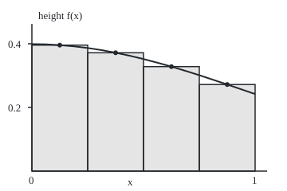

# Numerical integration: midpoint, trapezoid and Simpson, with error bounds

[Syllabus](../../../SYLLABUS.md) → [Calculus and analysis](../../../SYLLABUS.md#w06) → [Integrals](../../../SYLLABUS.md#w06-s04) → Numerical integration

---

## General Overview

The bell curve that statistics runs on has height e^(−x^2/2)/√(2π) at position x. Its area from 0 to 1 is 0.341345 to six decimals. No formula of powers, roots, exponentials, logs and trig functions has this curve as its rate, so the antiderivative route ([Fundamental theorem of calculus](02-fundamental-theorem-of-calculus.md)) is closed. The area must come from heights.

The integral is a limit of slice sums ([The integral](01-riemann-integral.md)), but plain sums need many slices. Three better rules weight sampled heights. The **midpoint rule** reads each slice's centre height. The **trapezoid rule** joins a slice's two end heights by a straight line. **Simpson's rule** fits a parabola through three heights. With four slices, Simpson is already within 0.000010742 of the truth.

Each rule's error has a ceiling set by how sharply the curve bends, known before the truth is. Inverted, it gives the slices a target needs: 12 for Simpson at six decimals.

**Replace the curve on each slice by a flat line, a chord or a parabola, add their exact areas, and bound the error by a ceiling on the second or fourth derivative times a power of the slice width.**

**What kind of fact this is:** a method; its three error bounds are theorems, proved on this card in Why it works.

### The picture: four midpoint rectangles under the bell curve

<p align="center"></p>

To scale: 280 px per unit across, 400 up. The curve sits above each rectangle on the left, below on the right; bending down, it falls further than it rises, so the total runs high: 0.341977 against 0.341345.

---

## The formula

Notation first. The interval from a to b is cut into n equal slices of width h = (b − a)/n, at the points $x_i = a + ih$. f″ is the second derivative, how fast the slope changes; $f^{(4)}$ is the fourth ([Taylor's theorem](../03-What%20Derivatives%20Tell%20You/05-taylors-theorem.md)).

$$M_n = h\sum_{i=1}^{n} f\bigl(a + (i - \tfrac12)h\bigr)$$

$$T_n = h\Bigl[\tfrac12 f(x_0) + f(x_1) + \dots + f(x_{n-1}) + \tfrac12 f(x_n)\Bigr]$$

$$S_n = \tfrac{h}{3}\Bigl[f(x_0) + 4f(x_1) + 2f(x_2) + \dots + 4f(x_{n-1}) + f(x_n)\Bigr], \quad n \text{ even}$$

**Read it aloud:** midpoint is width times the sum of the centre heights; trapezoid, width times the sum of the cut heights with the two ends halved; Simpson, a third of the width times the heights weighted 1, 4, 2, …, 4, 1.

If the size of f″ never exceeds $K_2$ on the interval, and that of $f^{(4)}$ never exceeds $K_4$:

$$|I - M_n| \le \frac{K_2\,(b-a)\,h^2}{24}, \qquad |I - T_n| \le \frac{K_2\,(b-a)\,h^2}{12}, \qquad |I - S_n| \le \frac{K_4\,(b-a)\,h^4}{180}$$

**Read it aloud:** midpoint error is at most bend ceiling times length times width squared, over 24; trapezoid, twice that; Simpson, the fourth-derivative ceiling with the width to the fourth, over 180.

For a target error $E$, set a bound equal to it and solve for n, rounding up (to even, for Simpson).

| Symbol | Plain meaning | In our example | Push it up and the answer… |
| --- | --- | --- | --- |
| $f$, $x$ | the curve's height at position x | 0.398942 at 0, 0.241971 at 1 | more area |
| $a$, $b$ | the ends of the interval | 0 and 1 | longer interval, larger bound |
| $n$, $h$ | slice count and width | n = 4, h = 0.25 | smaller error |
| $x_i$, $i$ | cut point i | 0, 0.25, …, 1 | — |
| $M_n$, $T_n$, $S_n$ | the three rules' totals | 0.341977187, 0.340081845, 0.341355488 | — |
| $I$ | the true area | 0.341344746069 | — |
| $K_2$, $K_4$ | ceilings on the size of f″ and $f^{(4)}$ | 0.398942 and 1.196827 | a larger bound |
| $E$ | the target error | 5e-7, half a unit in the sixth decimal | fewer slices |

### When it holds

- **The named derivative exists and is bounded.** At a corner or spike the ceiling fails; split there, or see [Improper integrals](07-improper-integrals.md) when the curve runs off to infinity.
- **The ceiling covers every point.** Read at x = 1, where f″ is 0, it claims zero error; one midpoint slice is off by 0.010721.
- **Simpson needs an even count.** Its weights forced onto 5 slices give 0.323594.
- **Exact arithmetic.** The bounds ignore computer rounding, far smaller here.

---

## Why it works

### Step 0: swap the curve for a shape with a known area

Each rule swaps the curve on a slice for a flat line, a chord or a parabola, with exact areas. The error is the area between curve and stand-in. Taylor's theorem ([Taylor's theorem](../03-What%20Derivatives%20Tell%20You/05-taylors-theorem.md)) sizes that gap through a derivative read somewhere in between.

### Step 1: the midpoint rule's slope term cancels

Take a slice of width h, centre m, and let t = x − m. Taylor's theorem at m gives f(x) = f(m) + f′(m)·t + ½f″(ξ)·t^2, with ξ (xi) some point between m and x.

Integrate over the slice. The first term gives h·f(m), the rectangle. The slope term gives nothing: it rises on one side of m as much as it falls on the other. The rest is at most ½K₂ times the integral of t^2 from −h/2 to h/2, which is h^3/12: so K₂h^3/24 per slice. With n slices and nh = b − a, the total is at most K₂(b − a)h^2/24. For 4 slices that ceiling is 0.001038912; the actual error is 0.000632441.

### Step 2: the trapezoid rule's chord misses by a parabola's worth

The chord meets the curve at both slice ends. Between them the gap at x is exactly ½f″(ζ)·(x − left end)(x − right end), for some point ζ (zeta) in the slice: Rolle's theorem used twice ([Mean value theorem](../03-What%20Derivatives%20Tell%20You/02-mean-value-theorem.md)), in the folded proof. That product integrates to h^3/6, so one slice errs by at most K₂h^3/12 and the interval by K₂(b − a)h^2/12, twice the midpoint's ceiling.

Signs matter too. On [0, 1], f″ = (x^2 − 1)·f is never positive, so the curve bends down: chords lie under it, and midpoint rectangles, the areas under centre tangents, over it. The rules bracket the truth: 0.340081845 ≤ I ≤ 0.341977187.

### Step 3: Simpson's weights, and a free extra degree

Centre two slices at m, with t = x − m from −h to h. Weights on the three heights, equal at the ends, must give the true area for 1, t and t^2, whose integrals are 2h, 0 and 2h^3/3. That forces h/3 at each end and 4h/3 at the centre. Pairs share ends, so interior weights alternate 4, 2.

Exactness for t^3 comes free: its area is 0, and the weighted heights −h^3, 0, h^3 cancel too. Exact on every cubic, the rule's error falls with $h^4$, not $h^3$.

Rolle again, with a cubic matching the three heights and the centre slope, bounds a pair's error by K₄h^5/90; n/2 pairs give K₄(b − a)h^4/180.

<details>
<summary>Detailed proof</summary>

Rolle's theorem: a smooth function zero at two points has zero derivative somewhere between.

**Trapezoid.** On [p, q] let e = f − chord, so e(p) = e(q) = 0. Fix x inside, let w(t) = (t − p)(t − q) and g(t) = e(t) − e(x)·w(t)/w(x). g vanishes at p, x, q; Rolle twice gives g″(ζ) = 0. A chord's second derivative is 0 and w″ = 2, so e(x) = ½f″(ζ)(x − p)(x − q). Integrating ½K₂(x − p)(q − x) over the slice gives K₂h^3/12.

**Simpson.** Measure t from m. Let q be the parabola through the three heights and c(t) = q(t) + α·t(t^2 − h^2), with α chosen so c′(0) = f′(m). The added term vanishes at the nodes and is odd, so c has Simpson's area. Let e = f − c, w(t) = t^2(t^2 − h^2), and g(t) = e(t) − e(x)·w(t)/w(x). g vanishes at −h, 0, h, x and g′ at 0; Rolle four times gives g''''(ζ) = 0. With c'''' = 0 and w'''' = 24, e(x) = f''''(ζ)·w(x)/24. As w ≤ 0 on [−h, h], the error is at most (K₄/24) times the integral of t^2(h^2 − t^2), 4h^5/15: K₄h^5/90 per pair.

</details>

### Step 4: the ceilings for the bell curve, and the step for six decimals

Differentiating gives f″ = (x^2 − 1)·f and $f^{(4)}$ = (x^4 − 6x^2 + 3)·f. On [0, 1] both are largest in size at x = 0: K₂ = 1/√(2π) = 0.398942 and K₄ = 3/√(2π) = 1.196827. Difference quotients on 1001 points agree: 0.398932 and 1.196727.

Six decimals means an error below 5e-7. The bounds ask for 183 midpoint, 258 trapezoid or 12 Simpson slices. They are cautious: 143, 201 and 10 work, as the bend hits its ceiling only at x = 0.

Midpoint's error is about half the trapezoid's, with opposite sign (0.000632441 against 0.001262902); their two-to-one blend is Simpson's rule on twice the slices. Halving h from n = 8 to 16 cuts the errors by 4.00, 4.00 and 16.07, as $h^2$ and $h^4$ predict.

The second road: e^u is the sum of u^k/k! (wing 01). Put u = −x^2/2 and integrate each power: the area is 1/√(2π) times the sum of (−1)^k/(2^k k! (2k + 1)). Taylor's theorem bounds the tail after 13 terms by (1/2)^13/13! times 1/√(2π), below 7.8e-15, so I = 0.341344746069.

---

## Worked numbers, by hand

Heights at x = 0, 0.125, …, 1 come from the check's first line, to six decimals.

| Step | Arithmetic | Value |
| --- | --- | --- |
| slice width, n = 4 | (1 − 0)/4 | 0.25 |
| midpoint | 0.25 × (0.395838 + 0.371855 + 0.328161 + 0.272055) | 0.341977 |
| trapezoid | 0.25 × (0.398942/2 + 0.386668 + 0.352065 + 0.301137 + 0.241971/2) | 0.340082 |
| Simpson | 0.25/3 × (0.398942 + 4 × 0.386668 + 2 × 0.352065 + 4 × 0.301137 + 0.241971) | 0.341355 |
| true area, series | 13 terms | 0.341344746069 |
| slices for six decimals | Simpson bound, rounded up to even | 12 |
| Simpson, n = 12 | rounded to six decimals | **0.341345** |

Thirteen heights fix the area at 0.341345. The shelf's tank, filling at 3 + 2t litres per minute for 10 minutes, has no bend: all three rules give 130.000000 litres.

### What breaks if you drop a piece

| Mistake | Comes out at | What went wrong |
| --- | --- | --- |
| K₂ read at x = 1 only | bound 0; one midpoint slice 0.352065, off by 0.010721 | f″ is 0 there, 0.398942 in size at 0 |
| Simpson with h, not h/3 | 1.024066 | three times too big |
| Simpson's weights on 5 slices | 0.323594, off by 0.017751 | one slice has no partner |
| Trapezoid n = 258, rounded | 0.341344 | error 3.0e-07 near a rounding boundary |

---

## Code, from first principles, and it actually runs

Only exp, sqrt and π come from `math`. Two roads reach the area: the slice rules, and the exponential series integrated term by term. Asserts check each error against its ceiling, the shrink ratios, the ceilings by difference quotients, six decimals at the chosen step, and the tank.

### Python

```python
# Numerical integration -- the check behind the card.  Only math is imported.
# The bell curve f(x) = exp(-x^2/2) / sqrt(2 pi) on [0, 1].  Road one: midpoint,
# trapezoid and Simpson sums.  Road two: the exp series integrated term by term,
# with Taylor's remainder bounding the terms left off.
import math
C = 1 / math.sqrt(2 * math.pi)
def f(x): return C * math.exp(-x * x / 2)
def mid(g, n, a=0.0, b=1.0):
    h = (b - a) / n
    return h * sum(g(a + (i + 0.5) * h) for i in range(n))
def trap(g, n, a=0.0, b=1.0):
    h = (b - a) / n
    return h * ((g(a) + g(b)) / 2 + sum(g(a + i * h) for i in range(1, n)))
def simp(g, n, a=0.0, b=1.0, third=3):
    h = (b - a) / n
    return h / third * (g(a) + g(b) + sum((4 if i % 2 else 2) * g(a + i * h) for i in range(1, n)))
K2, K4 = C, 3 * C                      # |f''| = |x^2 - 1| f, |f''''| = |x^4 - 6x^2 + 3| f, largest at x = 0
def bounds(n): return K2 / (24 * n * n), K2 / (12 * n * n), K4 / (180 * n ** 4)
def row(xs, d): return ", ".join(f"{x:.{d}f}" for x in xs)
fact, total = 1, 0.0
for k in range(13):                    # integral of (-x^2/2)^k / k! from 0 to 1
    fact *= max(k, 1)
    total += (-1) ** k / (2 ** k * fact * (2 * k + 1))
exact, tail = C * total, C * 0.5 ** 13 / (fact * 13)
print(f"f at x = 0, 1/8, ..., 1: {row([f(k / 8) for k in range(9)], 6)}")
print(f"series road: 13 terms give {exact:.12f}, tail below {tail:.1e}")
for name, rule, bd in zip(("midpoint", "trapezoid", "Simpson"), (mid, trap, simp), bounds(4)):
    v = rule(f, 4)
    print(f"n = 4 {name}: {v:.9f}, error {abs(v - exact):.9f}, bound {bd:.9f}")
    assert abs(v - exact) <= bd                                  # road 1 inside the proved window
err = lambda rule, n: abs(rule(f, n) - exact)
r = [err(rule, 8) / err(rule, 16) for rule in (mid, trap, simp)]
print(f"error ratio, n = 8 to n = 16: midpoint {r[0]:.2f}, trapezoid {r[1]:.2f}, Simpson {r[2]:.2f}")
d, xs = 0.01, [i / 1000 for i in range(1001)]
q2 = max(abs(f(x + d) - 2 * f(x) + f(x - d)) / d ** 2 for x in xs)
q4 = max(abs(f(x + 2 * d) - 4 * f(x + d) + 6 * f(x) - 4 * f(x - d) + f(x - 2 * d)) / d ** 4 for x in xs)
print(f"difference quotients on 1001 points: max |f''| {q2:.6f} vs K2 {K2:.6f}; max |f''''| {q4:.6f} vs K4 {K4:.6f}")
assert (abs(r[0] - 4) < 0.05 and abs(r[1] - 4) < 0.05 and abs(r[2] - 16) < 0.5     # h^2, h^2, h^4
        and abs(q2 - K2) < 1e-4 and abs(q4 - K4) < 1e-3)                  # ceilings by a second road
eps = 5e-7
nm, nt = math.ceil(math.sqrt(K2 / (24 * eps))), math.ceil(math.sqrt(K2 / (12 * eps)))
ns = math.ceil((K4 / (180 * eps)) ** 0.25); ns += ns % 2
print(f"target 5e-7: bounds ask for midpoint n = {nm}, trapezoid n = {nt}, Simpson n = {ns}")
e3 = (err(mid, nm), err(trap, nt), err(simp, ns))
print(f"errors there: midpoint {e3[0]:.1e}, trapezoid {e3[1]:.1e}, Simpson {e3[2]:.1e}")
first = [next(n for n in range(s, 999, s) if err(rule, n) < eps) for rule, s in ((mid, 1), (trap, 1), (simp, 2))]
print(f"smallest n that actually works: midpoint {first[0]}, trapezoid {first[1]}, Simpson {first[2]}")
print(f"six decimals: Simpson n = {ns} gives {simp(f, ns):.6f}, trapezoid n = {nt} gives {trap(f, nt):.6f}, series {exact:.6f}")
assert max(e3) < eps and f"{simp(f, ns):.6f}" == f"{exact:.6f}"      # the chosen step delivers
v = [rule(lambda t: 3 + 2 * t, 10, 0, 10) for rule in (mid, trap, simp)]
print(f"tank 3 + 2t over 10 minutes, n = 10: midpoint {v[0]:.6f}, trapezoid {v[1]:.6f}, Simpson {v[2]:.6f}")
assert all(abs(x - (3 * 10 + 10 * 20 / 2)) < 1e-9 for x in v)        # geometry: 30 + 100 litres
print(f"figure, 280 px per unit across, 400 px per unit up; x = {row([40 + 280 * k / 16 for k in range(17)], 1)}")
print(f"figure, curve y = {row([215 - 400 * f(k / 16) for k in range(17)], 1)}")
print(f"figure, rectangle tops y = {row([215 - 400 * f(k / 8) for k in (1, 3, 5, 7)], 1)}; ticks 0.2 at y = {215 - 400 * 0.2:.0f}, 0.4 at y = {215 - 400 * 0.4:.0f}")
print(f"mistake 1, K2 read at x = 1: |f''(1)| = |1 - 1| f(1) = {abs((1 * 1 - 1) * f(1)):.6f}, yet n = 1 midpoint gives {mid(f, 1):.6f}, error {err(mid, 1):.6f}")
print(f"mistake 2, Simpson n = 4 with h instead of h/3: {simp(f, 4, third=1):.6f}")
print(f"mistake 3, Simpson weights on odd n = 5: {simp(f, 5):.6f}, error {err(simp, 5):.6f}")
print("ALL CHECKS PASS")
```

**Ran 2026-09-27 on macOS, Python 3.14.6, standard library only. All checks passed. Output, pasted from the run:**

```
f at x = 0, 1/8, ..., 1: 0.398942, 0.395838, 0.386668, 0.371855, 0.352065, 0.328161, 0.301137, 0.272055, 0.241971
series road: 13 terms give 0.341344746069, tail below 7.8e-15
n = 4 midpoint: 0.341977187, error 0.000632441, bound 0.001038912
n = 4 trapezoid: 0.340081845, error 0.001262902, bound 0.002077824
n = 4 Simpson: 0.341355488, error 0.000010742, bound 0.000025973
error ratio, n = 8 to n = 16: midpoint 4.00, trapezoid 4.00, Simpson 16.07
difference quotients on 1001 points: max |f''| 0.398932 vs K2 0.398942; max |f''''| 1.196727 vs K4 1.196827
target 5e-7: bounds ask for midpoint n = 183, trapezoid n = 258, Simpson n = 12
errors there: midpoint 3.0e-07, trapezoid 3.0e-07, Simpson 1.3e-07
smallest n that actually works: midpoint 143, trapezoid 201, Simpson 10
six decimals: Simpson n = 12 gives 0.341345, trapezoid n = 258 gives 0.341344, series 0.341345
tank 3 + 2t over 10 minutes, n = 10: midpoint 130.000000, trapezoid 130.000000, Simpson 130.000000
figure, 280 px per unit across, 400 px per unit up; x = 40.0, 57.5, 75.0, 92.5, 110.0, 127.5, 145.0, 162.5, 180.0, 197.5, 215.0, 232.5, 250.0, 267.5, 285.0, 302.5, 320.0
figure, curve y = 55.4, 55.7, 56.7, 58.2, 60.3, 63.0, 66.3, 70.0, 74.2, 78.8, 83.7, 89.0, 94.5, 100.3, 106.2, 112.2, 118.2
figure, rectangle tops y = 56.7, 66.3, 83.7, 106.2; ticks 0.2 at y = 135, 0.4 at y = 55
mistake 1, K2 read at x = 1: |f''(1)| = |1 - 1| f(1) = 0.000000, yet n = 1 midpoint gives 0.352065, error 0.010721
mistake 2, Simpson n = 4 with h instead of h/3: 1.024066
mistake 3, Simpson weights on odd n = 5: 0.323594, error 0.017751
ALL CHECKS PASS
```

### Rust

Built with `rustc --edition 2021 -O`.

```rust
// Numerical integration -- the same check as the Python, in Rust.  No crates.
// The bell curve f(x) = exp(-x^2/2) / sqrt(2 pi) on [0, 1].  Road one: midpoint,
// trapezoid and Simpson sums.  Road two: the exp series integrated term by term,
// with Taylor's remainder bounding the terms left off.
const PI: f64 = std::f64::consts::PI;
fn c() -> f64 { 1.0 / (2.0 * PI).sqrt() }
fn f(x: f64) -> f64 { c() * (-x * x / 2.0).exp() }
fn mid(g: &dyn Fn(f64) -> f64, n: usize, a: f64, b: f64) -> f64 {
    let h = (b - a) / n as f64;
    h * (0..n).map(|i| g(a + (i as f64 + 0.5) * h)).sum::<f64>()
}
fn trap(g: &dyn Fn(f64) -> f64, n: usize, a: f64, b: f64) -> f64 {
    let h = (b - a) / n as f64;
    h * ((g(a) + g(b)) / 2.0 + (1..n).map(|i| g(a + i as f64 * h)).sum::<f64>())
}
fn simp_w(g: &dyn Fn(f64) -> f64, n: usize, a: f64, b: f64, third: f64) -> f64 {
    let h = (b - a) / n as f64;
    h / third * (g(a) + g(b) + (1..n).map(|i| if i % 2 == 1 { 4.0 } else { 2.0 } * g(a + i as f64 * h)).sum::<f64>())
}
fn simp(g: &dyn Fn(f64) -> f64, n: usize, a: f64, b: f64) -> f64 { simp_w(g, n, a, b, 3.0) }
fn row(xs: &[f64], d: usize) -> String { xs.iter().map(|x| format!("{:.*}", d, x)).collect::<Vec<_>>().join(", ") }
fn sci(x: f64) -> String {                    // 3.0e-7 written 3.0e-07, as Python does
    let s = format!("{:.1e}", x);
    let (m, e) = s.split_once('e').map(|(m, e)| (m, e.parse::<i32>().unwrap())).unwrap();
    format!("{}e{}{:02}", m, if e < 0 { '-' } else { '+' }, e.abs())
}
type Rule = fn(&dyn Fn(f64) -> f64, usize, f64, f64) -> f64;
fn main() {
    let (k2, k4) = (c(), 3.0 * c());          // |f''| = |x^2 - 1| f, |f''''| = |x^4 - 6x^2 + 3| f, largest at x = 0
    let bounds = |n: f64| [k2 / (24.0 * n * n), k2 / (12.0 * n * n), k4 / (180.0 * n.powi(4))];
    let (mut fact, mut total) = (1.0f64, 0.0f64);
    for k in 0..13 {                          // integral of (-x^2/2)^k / k! from 0 to 1
        fact *= (k.max(1)) as f64;
        total += (-1f64).powi(k) / (2f64.powi(k) * fact * (2 * k + 1) as f64);
    }
    let (exact, tail) = (c() * total, c() * 0.5f64.powi(13) / (fact * 13.0));
    println!("f at x = 0, 1/8, ..., 1: {}", row(&(0..9).map(|k| f(k as f64 / 8.0)).collect::<Vec<_>>(), 6));
    println!("series road: 13 terms give {:.12}, tail below {}", exact, sci(tail));
    let rules: [(&str, Rule); 3] = [("midpoint", mid), ("trapezoid", trap), ("Simpson", simp)];
    for ((name, rule), bd) in rules.iter().zip(bounds(4.0)) {
        let v = rule(&f, 4, 0.0, 1.0);
        println!("n = 4 {}: {:.9}, error {:.9}, bound {:.9}", name, v, (v - exact).abs(), bd);
        assert!((v - exact).abs() <= bd);                           // road 1 inside the proved window
    }
    let err = |rule: Rule, n: usize| (rule(&f, n, 0.0, 1.0) - exact).abs();
    let r: Vec<f64> = rules.iter().map(|&(_, rule)| err(rule, 8) / err(rule, 16)).collect();
    println!("error ratio, n = 8 to n = 16: midpoint {:.2}, trapezoid {:.2}, Simpson {:.2}", r[0], r[1], r[2]);
    let (d, xs): (f64, Vec<f64>) = (0.01, (0..=1000).map(|i| i as f64 / 1000.0).collect());
    let q2 = xs.iter().map(|&x| ((f(x + d) - 2.0 * f(x) + f(x - d)) / (d * d)).abs()).fold(0.0, f64::max);
    let q4 = xs.iter().map(|&x| ((f(x + 2.0 * d) - 4.0 * f(x + d) + 6.0 * f(x) - 4.0 * f(x - d) + f(x - 2.0 * d)) / d.powi(4)).abs()).fold(0.0, f64::max);
    println!("difference quotients on 1001 points: max |f''| {:.6} vs K2 {:.6}; max |f''''| {:.6} vs K4 {:.6}", q2, k2, q4, k4);
    assert!((r[0] - 4.0).abs() < 0.05 && (r[1] - 4.0).abs() < 0.05 && (r[2] - 16.0).abs() < 0.5
        && (q2 - k2).abs() < 1e-4 && (q4 - k4).abs() < 1e-3);    // h^2, h^2, h^4; ceilings by a second road
    let eps = 5e-7;
    let (nm, nt) = ((k2 / (24.0 * eps)).sqrt().ceil() as usize, (k2 / (12.0 * eps)).sqrt().ceil() as usize);
    let mut ns = (k4 / (180.0 * eps)).powf(0.25).ceil() as usize;
    ns += ns % 2;
    println!("target 5e-7: bounds ask for midpoint n = {}, trapezoid n = {}, Simpson n = {}", nm, nt, ns);
    let e3 = [err(mid, nm), err(trap, nt), err(simp, ns)];
    println!("errors there: midpoint {}, trapezoid {}, Simpson {}", sci(e3[0]), sci(e3[1]), sci(e3[2]));
    let first: Vec<usize> = [(mid as Rule, 1), (trap, 1), (simp, 2)].iter()
        .map(|&(rule, s)| (s..999).step_by(s).find(|&n| err(rule, n) < eps).unwrap()).collect();
    println!("smallest n that actually works: midpoint {}, trapezoid {}, Simpson {}", first[0], first[1], first[2]);
    let (sv, tv) = (simp(&f, ns, 0.0, 1.0), trap(&f, nt, 0.0, 1.0));
    println!("six decimals: Simpson n = {} gives {:.6}, trapezoid n = {} gives {:.6}, series {:.6}", ns, sv, nt, tv, exact);
    assert!(e3.iter().all(|&e| e < eps) && format!("{:.6}", sv) == format!("{:.6}", exact));
    let v: Vec<f64> = rules.iter().map(|&(_, rule)| rule(&|t: f64| 3.0 + 2.0 * t, 10, 0.0, 10.0)).collect();
    println!("tank 3 + 2t over 10 minutes, n = 10: midpoint {:.6}, trapezoid {:.6}, Simpson {:.6}", v[0], v[1], v[2]);
    assert!(v.iter().all(|&x| (x - (3.0 * 10.0 + 10.0 * 20.0 / 2.0)).abs() < 1e-9));   // geometry: 30 + 100 litres
    println!("figure, 280 px per unit across, 400 px per unit up; x = {}", row(&(0..17).map(|k| 40.0 + 280.0 * k as f64 / 16.0).collect::<Vec<_>>(), 1));
    println!("figure, curve y = {}", row(&(0..17).map(|k| 215.0 - 400.0 * f(k as f64 / 16.0)).collect::<Vec<_>>(), 1));
    println!("figure, rectangle tops y = {}; ticks 0.2 at y = {:.0}, 0.4 at y = {:.0}",
             row(&[1.0, 3.0, 5.0, 7.0].map(|k: f64| 215.0 - 400.0 * f(k / 8.0)), 1), 215.0 - 400.0 * 0.2, 215.0 - 400.0 * 0.4);
    println!("mistake 1, K2 read at x = 1: |f''(1)| = |1 - 1| f(1) = {:.6}, yet n = 1 midpoint gives {:.6}, error {:.6}",
             ((1.0 * 1.0 - 1.0) * f(1.0)).abs(), mid(&f, 1, 0.0, 1.0), err(mid, 1));
    println!("mistake 2, Simpson n = 4 with h instead of h/3: {:.6}", simp_w(&f, 4, 0.0, 1.0, 1.0));
    println!("mistake 3, Simpson weights on odd n = 5: {:.6}, error {:.6}", simp(&f, 5, 0.0, 1.0), err(simp, 5));
    println!("ALL CHECKS PASS");
}
```

**Ran 2026-09-27 on macOS, rustc 1.98.1, no crates. All checks passed. Output, pasted from the run:**

```
f at x = 0, 1/8, ..., 1: 0.398942, 0.395838, 0.386668, 0.371855, 0.352065, 0.328161, 0.301137, 0.272055, 0.241971
series road: 13 terms give 0.341344746069, tail below 7.8e-15
n = 4 midpoint: 0.341977187, error 0.000632441, bound 0.001038912
n = 4 trapezoid: 0.340081845, error 0.001262902, bound 0.002077824
n = 4 Simpson: 0.341355488, error 0.000010742, bound 0.000025973
error ratio, n = 8 to n = 16: midpoint 4.00, trapezoid 4.00, Simpson 16.07
difference quotients on 1001 points: max |f''| 0.398932 vs K2 0.398942; max |f''''| 1.196727 vs K4 1.196827
target 5e-7: bounds ask for midpoint n = 183, trapezoid n = 258, Simpson n = 12
errors there: midpoint 3.0e-07, trapezoid 3.0e-07, Simpson 1.3e-07
smallest n that actually works: midpoint 143, trapezoid 201, Simpson 10
six decimals: Simpson n = 12 gives 0.341345, trapezoid n = 258 gives 0.341344, series 0.341345
tank 3 + 2t over 10 minutes, n = 10: midpoint 130.000000, trapezoid 130.000000, Simpson 130.000000
figure, 280 px per unit across, 400 px per unit up; x = 40.0, 57.5, 75.0, 92.5, 110.0, 127.5, 145.0, 162.5, 180.0, 197.5, 215.0, 232.5, 250.0, 267.5, 285.0, 302.5, 320.0
figure, curve y = 55.4, 55.7, 56.7, 58.2, 60.3, 63.0, 66.3, 70.0, 74.2, 78.8, 83.7, 89.0, 94.5, 100.3, 106.2, 112.2, 118.2
figure, rectangle tops y = 56.7, 66.3, 83.7, 106.2; ticks 0.2 at y = 135, 0.4 at y = 55
mistake 1, K2 read at x = 1: |f''(1)| = |1 - 1| f(1) = 0.000000, yet n = 1 midpoint gives 0.352065, error 0.010721
mistake 2, Simpson n = 4 with h instead of h/3: 1.024066
mistake 3, Simpson weights on odd n = 5: 0.323594, error 0.017751
ALL CHECKS PASS
```

The two outputs match line for line.

> [!TIP]
> **Try changing**
> - **Guess first:** in `mid`, change `(i + 0.5)` to `(i + 0)`, sampling left ends. The error leaves the midpoint ceiling; the first assert fails.
> - **Guess first:** change Simpson's weight 4 to 3. The n = 4 Simpson assert fails.
> - **Guess first:** set `K4 = 2 * C`. The Simpson error still fits, but the difference-quotient assert catches the false ceiling.

---

## The usual mistake

> [!warning]
> **Reading the derivative ceiling at a convenient point.** The bound needs the largest size of f″ or $f^{(4)}$ over the whole interval. At x = 1, f″ is 0 and the bound promises perfection; one midpoint slice is off by 0.010721.
>
> - **Taking the bound for the error.** It asks for 183 midpoint slices; 143 work. A guarantee, not a forecast.
> - **Taking a small error for correct digits.** 3.0e-07 below the truth rounds to 0.341344.
> - **Odd counts with Simpson's weights.** Five slices give 0.323594.
> - **Dropping the 1/3.** The result, 1.024066, exceeds the unit square.

---

## Where you meet it in real life

- **Statistics tables.** Printed bell-curve areas such as 0.341345 come from rules like these or the series.
- **Option pricing.** Heston's model prices an option as an integral with no antiderivative, computed by such a rule: [Pricing Heston exactly](../../12-Financial%20mathematics/14-Stochastic%20volatility%20-%20Heston%2C%20SABR%20and%20their%20mix/02-heston-pricing-by-characteristic-function.md).
- **Digital audio.** The trapezoid rule turns an analogue filter into a digital one: Digital filters.

> **Say it back**
> With no antiderivative, weight sampled heights: centres, ends, or a parabola per pair of slices. The errors are at most a derivative ceiling over the whole interval times h^2 or h^4, over 24, 12 or 180. Solving for n guarantees a target. For the bell curve from 0 to 1, twelve Simpson slices give 0.341345.

---

## What this builds on

- [Taylor's theorem](../03-What%20Derivatives%20Tell%20You/05-taylors-theorem.md): the remainder that sizes each gap and the series tail.
- [The integral](01-riemann-integral.md): the integral as a limit of slice sums.

## Where this goes next

- [Stirling's approximation](../06-Series/09-stirlings-approximation.md): n! sized by comparing a sum with an integral.
- [Pricing Heston exactly](../../12-Financial%20mathematics/14-Stochastic%20volatility%20-%20Heston%2C%20SABR%20and%20their%20mix/02-heston-pricing-by-characteristic-function.md): an option price computed by quadrature.
- Digital filters: the trapezoid rule as a filter design.
- Trapezoid, midpoint and Simpson: the whole family of weighted rules.

Equal slices and fixed weights are one choice; which points and weights buy the most accuracy per height is the question Trapezoid, midpoint and Simpson takes up.

---

## Sources

Verified 2026-09-27: every link below opens a page naming the cited work.

- Strang, Gilbert, Edwin Herman, et al. *Calculus Volume 2*. OpenStax. [Section 3.6, Numerical Integration](https://openstax.org/books/calculus-volume-2/pages/3-6-numerical-integration). The three rules and their error bounds.
- Süli, Endre, and David Mayers. *An Introduction to Numerical Analysis*. Cambridge University Press, 2003. [Publisher page](https://www.cambridge.org/core/books/an-introduction-to-numerical-analysis/FD8BCAD7FE68002E2179DFF68B8B7237). Error terms proved by interpolation, as in the folded proof.
- O'Connor, J. J., and E. F. Robertson. "Thomas Simpson." MacTutor Archive, University of St Andrews. [Biography](https://mathshistory.st-andrews.ac.uk/Biographies/Simpson/). Simpson credited the rule to Newton.
