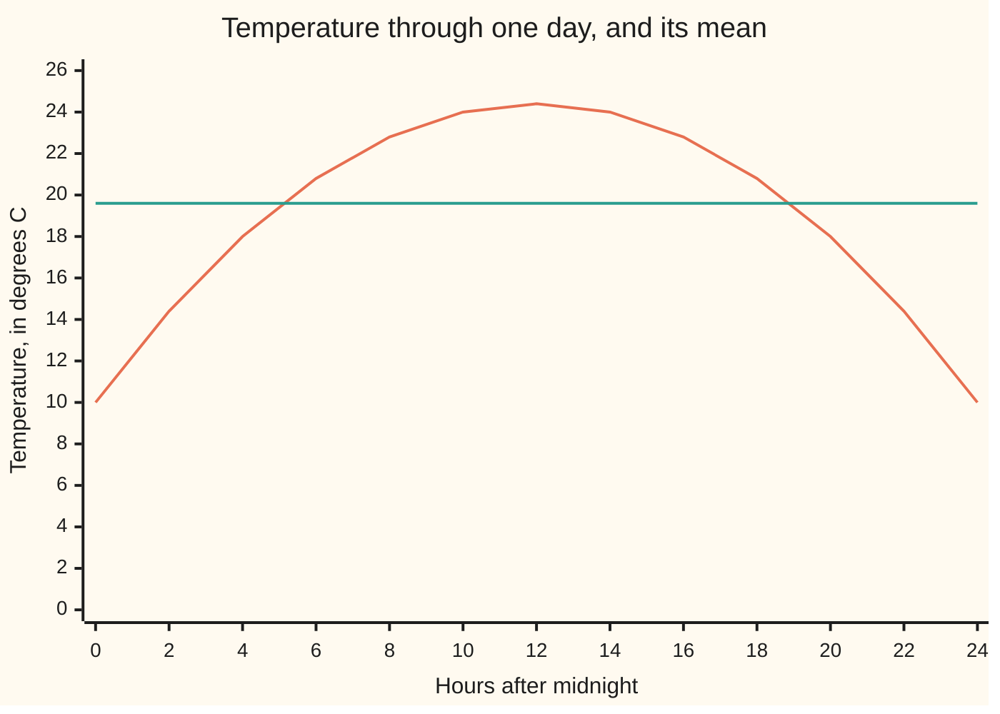
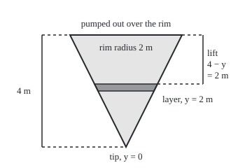

# Averages, mass and work: turning a rate or density into a total

[Syllabus](../../../SYLLABUS.md) → [Calculus and analysis](../../../SYLLABUS.md#w06) → [Integrals](../../../SYLLABUS.md#w06-s04) → Averages, mass and work

---

## General Overview

A spring day starts at 10 °C at midnight, warms to 24.4 °C at noon and falls back to 10 °C by the next midnight. What was the day's mean temperature? Averaging the coldest and warmest readings gives 17.2 °C. The true figure is 19.6 °C, because the day spends far more hours warm than cold.

A cone-shaped tank, point down, stands 4 m deep with a rim 2 m in radius. It is full of water. How heavy is the water, and how much work does a pump do lifting all of it out over the rim? The water near the rim is wide and barely needs lifting. The water near the tip is narrow and must be lifted almost 4 m.

Both questions have one shape. A quantity is known piece by piece: a temperature at each moment, a mass per metre of height, a lift for each layer. Multiply each piece by its width, add, and let the pieces shrink: an integral ([The integral](01-riemann-integral.md)), evaluated by an antiderivative ([Fundamental theorem of calculus](02-fundamental-theorem-of-calculus.md)). The answers: 16,755.2 kg of water, 164,368.1 joules of work.

**A total is the integral of an amount-per-unit over the units; an average is that total divided by how many units there were.**

**What kind of fact this is:** definitions: average value, mass and work are each defined as integrals. One theorem rides along: a continuous quantity takes its average value somewhere, proved on this card in Why it works.

### The picture: the day's temperature against its mean



The curve is the temperature, T(t) = 10 + t(24 − t)/10 °C at t hours after midnight. The flat line is the mean, 19.6 °C: the area under it over 24 hours equals the area under the curve.

---

## The formula

Notation first, in words. A bar marks an average: $\bar{f}$, read "f bar". The Greek letter $\lambda$ (lambda) is a **linear density**: mass per metre, here per metre of height.

$$\bar{f} = \frac{1}{b-a}\int_a^b f(t)\,dt$$

**Read it aloud:** the average of f from a to b is the total of f over that stretch, divided by the stretch's length.

$$M = \int_a^b \lambda(y)\,dy \qquad\qquad W = \int_a^b F(x)\,dx$$

**Read it aloud:** mass is linear density added up over the length; work is force added up over the distance moved.

For the pump, each thin layer has its own lift, from its height y to the rim at 4 m. Its weight is g times its mass, where g = 9.81 newtons per kilogram is gravity's pull (a newton, N, is the unit of force):

$$W = \int_0^4 g\,\lambda(y)\,(4 - y)\,dy$$

**Read it aloud:** the pump's work is each layer's weight times that layer's lift, added from the tip to the rim.

| Symbol | Plain meaning | In our example | Push it up and the answer… |
| --- | --- | --- | --- |
| $f$ | the quantity being averaged, a function of the input | temperature T(t), in °C | the average rises |
| $t$, $x$, $a$, $b$ | the input (time t, position x) and the stretch's start and end | t from 0 to 24 hours | a longer stretch divides by more |
| $\bar{f}$ | the average value: the constant with the same total | 19.6 °C | — |
| $c$ | an input where f equals its average | t = 5.0718 h and 18.9282 h | — |
| $y$, $r$ | height above the cone's tip; the water's radius there, r = y/2 | 0 to 4 m; 1 m at y = 2 m | wider layers, more mass |
| $\lambda$, $M$ | mass per metre of height; total mass | 1000π(y/2)^2 kg/m; 16,755.2 kg | heavier water, more mass and work |
| $F$, $W$ | a force along a line; the work it does, in joules (newton-metres) | the weight of each layer; 164,368.1 J | more work |
| $g$, $\rho$ | pull of gravity per kilogram; mass per cubic metre | 9.81 N/kg; water, 1000 kg/m^3 | work rises in proportion |

Units multiply: kg per metre times metres is kg; newtons times metres is joules.

### When it holds

- **The interval has length.** b must exceed a; a zero-length stretch has no average.
- **A continuous quantity, for the "reached somewhere" claim.** A heater that switches the room from 10 °C to 20 °C at noon averages 15 °C over the day, yet the room is never at 15 °C.
- **Each thin piece is uniform.** Density and lift are treated as constant within a layer; salty water, denser at the bottom, needs that variation inside $\lambda$.
- **Work counts only lifting.** The integral is the least energy that raises the water to the rim. A real pump also loses energy to friction and heat, so its meter reads more.

---

## Why it works

### Step 0: over a thin piece, amount is rate times width

Over a short stretch a density or rate barely changes, so the amount in that piece is close to the rate times the piece's width. Adding the pieces gives a Riemann sum; shrinking them gives the integral. Every formula on this card is that sentence applied once.

### Step 1: the average is the flat line with the same total

Replace the day's curve by a constant temperature with the same total of degree-hours. The total is the integral, 470.4 degree-hours. Spread over 24 hours, the constant is 470.4 / 24 = 19.6 °C: the average value.

Averaging readings is the same idea, coarser. The 24 readings on the hour average 19.5833 °C: a rectangle sum divided by 24. Midpoint strips close in: 19.608333 for 24 strips, 19.600083 for 240, 19.600001 for 2400.

### Step 2: a continuous quantity reaches its average

The day runs from 10 °C to 24.4 °C. A larger function has a larger integral, so the total lies between 10 × 24 and 24.4 × 24 degree-hours, and the average between 10 and 24.4 °C.

A continuous quantity passes through every value between its minimum and maximum ([Intermediate value theorem](../01-Limits%20and%20Continuity/06-intermediate-value-theorem.md)). So at some time c the temperature equals the average: here twice, at t = 5.0718 h on the rise and t = 18.9282 h on the fall. This is the **mean value theorem for integrals**.

<details>
<summary>Detailed proof</summary>

Let f be continuous on the closed interval from a to b, with a < b. By the [Extreme value theorem](../01-Limits%20and%20Continuity/07-extreme-value-theorem.md), f has a least value, lo, taken at some point p, and a greatest value, hi, taken at some point q. Since lo ≤ f(t) ≤ hi for every t, comparing integrals gives

$$\text{lo}\,(b-a) \le \int_a^b f(t)\,dt \le \text{hi}\,(b-a),$$

so lo ≤ $\bar{f}$ ≤ hi after dividing by the positive length b − a. On the closed interval between p and q, f is continuous and runs from lo to hi, so the intermediate value theorem gives a point c with f(c) = $\bar{f}$. Then $\int_a^b f(t)\,dt = f(c)(b-a)$. The step function 10 before noon, 20 after, shows continuity cannot be dropped: its average is 15 and it never takes that value.

</details>

### Step 3: mass is density added up over height

Slice the water into flat layers. The layer at height y above the tip is a thin disc. The cone widens 2 m over 4 m of height, so by similar triangles the disc's radius is y/2 metres and its area π(y/2)^2 square metres. A layer dy metres thick holds 1000π(y/2)^2 dy kilograms: the linear density is $\lambda(y) = 250\pi y^2$ kg per metre of height.

Adding the layers from the tip to the rim:

$$M = \int_0^4 250\pi y^2\,dy = 250\pi \cdot \frac{4^3}{3} \approx 16{,}755.2 \text{ kg}.$$

A second road needs no calculus: a cone holds one third of the cylinder with its base and height, π · 2^2 · 4 / 3 cubic metres, which at 1000 kg per cubic metre is 16,755.2 kg again.

### Step 4: work is force times distance, piece by piece

Lifting a weight through a distance takes weight times distance in work. Here each layer has its own distance: from height y it rises 4 − y metres to the rim.

<p align="center"></p>

Scale: 40 units per metre in both directions; the tip sits at (180, 210) and the rim runs from (100, 50) to (260, 50). The dark band is the layer from y = 2 m to 2.25 m, drawn thick enough to see.

Adding weight times lift over all layers:

$$W = \int_0^4 9.81 \cdot 250\pi y^2 (4 - y)\,dy = 9.81 \cdot 250\pi\left[\frac{4y^3}{3} - \frac{y^4}{4}\right]_0^4 \approx 164{,}368.1 \text{ J}.$$

Four 1 m layers, each lifted from its middle, give 169,504.6 J; 40 layers give 164,419.5 J; 400 give 164,368.6 J. The rule $W = \int_a^b F(x)\,dx$ also covers one object pushed along a line by a changing force. Stretching a spring that resists with 200 N per metre of stretch takes F(x) = 200x newtons at stretch x metres. Over the first 0.3 m, W = 100 × 0.3^2 = 9 J. The spring's own pull, −200x, points against the stretch, so over the same trip it does −9 J: a force opposing the motion does negative work.

A third road waits one shelf on. Lifting the whole 16,755.2 kg through 1 m gives the same 164,368.1 J, because the water's balance point sits 1 m below the rim. Finding that point is [Centre of mass](../05-Curves%20and%20Solids/05-centre-of-mass-and-pappus.md).

---

## Worked numbers, by hand

| Step | Arithmetic | Value |
| --- | --- | --- |
| antiderivative of T | 10t + (12t^2 − t^3/3)/10 | a function of t |
| the day's total | 240 + (6912 − 4608)/10 | 470.4 degree-hours |
| the mean | 470.4 / 24 | **19.6 °C** |
| layer mass per metre | 1000 × π × (y/2)^2 | 250π y^2 kg/m |
| the water's mass | 250π × 4^3/3 | **16,755.2 kg** |
| the pump's work | 9.81 × 250π × (4 × 4^3/3 − 4^4/4) | **164,368.1 J** |

The day held as much warmth as a steady 19.6 °C would; emptying the tank takes at least 164,368.1 J, whatever pump does it.

### What breaks if you drop a piece

| Mistake | Comes out at | What went wrong |
| --- | --- | --- |
| Mean as (max + min)/2 | 17.2 °C, not 19.6 | ignores how long the day spends at each temperature |
| Heater stepping 10 °C to 20 °C at noon | mean 15 °C, never reached | the jump breaks continuity, so no c exists |
| Lift measured from the tip, y not 4 − y | 493,104.4 J, three times too much | the wide top layers get the long lifts |
| Tank taken as a cylinder of radius 2 m | 50,265.5 kg, three times too much | the layer area must shrink toward the tip |

The code prints all four.

---

## Code, from first principles, and it actually runs

Every integral is computed twice, by roads sharing no arithmetic: a midpoint sum written in the script, and an antiderivative read at the ends. The mass also comes from the cone-volume rule; the crossing time comes from bisection (halving an interval that brackets the answer) and from the quadratic formula. Four asserts compare those pairs.

### Python

```python
# Averages, mass and work -- the check behind the card.  Standard library only:
# math.pi and math.sqrt are primitives; every integral is our own midpoint sum.
import math

def mid(f, a, b, n):                     # n midpoint rectangles from a to b
    h = (b - a) / n
    return sum(f(a + (k + 0.5) * h) for k in range(n)) * h
def row(xs, p): return "[" + ", ".join(f"{x:.{p}f}" for x in xs) + "]"

# The day: T(t) = 10 + t(24 - t)/10 degrees C, t in hours after midnight.
def T(t): return 10 + t * (24 - t) / 10
def TA(t): return 10 * t + (12 * t * t - t ** 3 / 3) / 10     # antiderivative of T
total = TA(24) - TA(0)
mean = total / 24
print(f"day: integral of T = {total:.1f} degree-hours; mean = {total:.1f} / 24 = {mean:.4f} C")
print("mean by midpoint strips, n = 24, 240, 2400: " + row([mid(T, 0, 24, n) / 24 for n in (24, 240, 2400)], 6))
assert abs(mid(T, 0, 24, 2400) / 24 - mean) < 1e-6                  # sums against antiderivative
print(f"24 hourly readings averaged {sum(T(k) for k in range(24)) / 24:.4f}; (max + min)/2 = {(T(12) + T(0)) / 2:.1f}")
lo, hi = 0.0, 12.0                       # bisection: when, before noon, is T = mean?
for _ in range(60):
    c = (lo + hi) / 2
    lo, hi = (c, hi) if T(c) < mean else (lo, c)
root = 12 - math.sqrt(144 - 10 * (mean - 10))                        # quadratic formula
print(f"T = mean at t = {lo:.4f} h by bisection, {root:.4f} h by formula; again at {24 - root:.4f} h")
assert abs(lo - root) < 1e-9
print("chart, T at t = 0, 2, ..., 24: " + row([T(t) for t in range(0, 25, 2)], 2) + f"; mean line {mean:.2f}")
# The tank: a cone, point down, 4 m deep, rim radius 2 m, full of water, pumped out over the rim.
RHO, G, H, R = 1000, 9.81, 4, 2          # kg per m^3, N per kg, m, m
def lam(y): return RHO * math.pi * (R * y / H) ** 2                 # kg per metre of height
def LA(y): return RHO * math.pi * (R / H) ** 2 * y ** 3 / 3          # antiderivative of lam
def WA(y): return G * RHO * math.pi * (R / H) ** 2 * (H * y ** 3 / 3 - y ** 4 / 4)
mass, work = LA(H) - LA(0), WA(H) - WA(0)
cone = RHO * math.pi * R * R * H / 3     # cone volume, one third of the cylinder: no calculus
print(f"mass by antiderivative {mass:.1f} kg; by cone volume x density {cone:.1f} kg")
assert abs(mid(lam, 0, H, 4000) - cone) < 1e-3 and abs(mass - cone) < 1e-9   # sums, antiderivative, geometry
slabs = [lam(y) for y in (0.5, 1.5, 2.5, 3.5)]
print(f"four 1 m slabs, masses {row(slabs, 1)}, total {sum(slabs):.1f} kg")
print("mass by strips, n = 4, 40, 400: " + row([mid(lam, 0, H, n) for n in (4, 40, 400)], 1))
def wf(y): return G * lam(y) * (H - y)   # newtons per metre of height, times the lift
print("work by strips, n = 4, 40, 400: " + row([mid(wf, 0, H, n) for n in (4, 40, 400)], 1))
print(f"work by antiderivative {work:.1f} J; mass x g x 1 m = {mass * G * 1:.1f} J")
assert abs(mid(wf, 0, H, 4000) - work) < 1e-2                      # sums against antiderivative
print(f"spring, F = 200x N from 0 to 0.3 m: strips {mid(lambda x: 200 * x, 0, 0.3, 4):.4f} J; 100 x 0.3^2 = "
      f"{100 * 0.3 ** 2:.4f} J; the spring's own pull does {mid(lambda x: -200 * x, 0, 0.3, 4):.4f} J")
step = mid(lambda t: 10 if t < 12 else 20, 0, 24, 2400) / 24
print(f"break, heater step 10 C then 20 C at noon: mean {step:.4f} C, yet T is only 10 or 20")
print(f"break, lift measured from the tip, y not 4 - y: {G * RHO * math.pi * (R / H) ** 2 * H ** 4 / 4:.1f} J")
print(f"break, tank taken as a cylinder of radius 2 m: {RHO * math.pi * R * R * H:.1f} kg")
print(f"figure, tip (180, 210); rim (100, 50) to (260, 50); slab at y = 2 m: x {180 - 40 * 1:.0f} to "
      f"{180 + 40 * 1:.0f} at svg y {210 - 40 * 2:.0f}, {180 - 40 * 1.125:.0f} to {180 + 40 * 1.125:.0f} at {210 - 40 * 2.25:.0f}")
print("ALL CHECKS PASS")
```

**Ran 2026-09-27 on macOS, Python 3.14.6, standard library only. All checks passed. Output, pasted from the run:**

```
day: integral of T = 470.4 degree-hours; mean = 470.4 / 24 = 19.6000 C
mean by midpoint strips, n = 24, 240, 2400: [19.608333, 19.600083, 19.600001]
24 hourly readings averaged 19.5833; (max + min)/2 = 17.2
T = mean at t = 5.0718 h by bisection, 5.0718 h by formula; again at 18.9282 h
chart, T at t = 0, 2, ..., 24: [10.00, 14.40, 18.00, 20.80, 22.80, 24.00, 24.40, 24.00, 22.80, 20.80, 18.00, 14.40, 10.00]; mean line 19.60
mass by antiderivative 16755.2 kg; by cone volume x density 16755.2 kg
four 1 m slabs, masses [196.3, 1767.1, 4908.7, 9621.1], total 16493.4 kg
mass by strips, n = 4, 40, 400: [16493.4, 16752.5, 16755.1]
work by strips, n = 4, 40, 400: [169504.6, 164419.5, 164368.6]
work by antiderivative 164368.1 J; mass x g x 1 m = 164368.1 J
spring, F = 200x N from 0 to 0.3 m: strips 9.0000 J; 100 x 0.3^2 = 9.0000 J; the spring's own pull does -9.0000 J
break, heater step 10 C then 20 C at noon: mean 15.0000 C, yet T is only 10 or 20
break, lift measured from the tip, y not 4 - y: 493104.4 J
break, tank taken as a cylinder of radius 2 m: 50265.5 kg
figure, tip (180, 210); rim (100, 50) to (260, 50); slab at y = 2 m: x 140 to 220 at svg y 130, 135 to 225 at 120
ALL CHECKS PASS
```

### Rust

Same numbers, same labels, built with `rustc --edition 2021 -O`.

```rust
// Averages, mass and work -- the same check as the Python, in Rust.  std only:
// PI and sqrt are primitives; every integral is our own midpoint sum.
use std::f64::consts::PI;

fn mid(f: &dyn Fn(f64) -> f64, a: f64, b: f64, n: usize) -> f64 {   // n midpoint rectangles
    let h = (b - a) / n as f64;
    (0..n).map(|k| f(a + (k as f64 + 0.5) * h)).sum::<f64>() * h
}
fn row(xs: &[f64], p: usize) -> String {
    format!("[{}]", xs.iter().map(|x| format!("{:.*}", p, x)).collect::<Vec<_>>().join(", "))
}
// The day: T(t) = 10 + t(24 - t)/10 degrees C, t in hours after midnight.
fn temp(t: f64) -> f64 { 10.0 + t * (24.0 - t) / 10.0 }
fn temp_anti(t: f64) -> f64 { 10.0 * t + (12.0 * t * t - t.powi(3) / 3.0) / 10.0 }
// The tank: a cone, point down, 4 m deep, rim radius 2 m, full of water, pumped out over the rim.
const RHO: f64 = 1000.0; const G: f64 = 9.81; const H: f64 = 4.0; const R: f64 = 2.0;
fn lam(y: f64) -> f64 { RHO * PI * (R * y / H).powi(2) }                     // kg per metre of height
fn lam_anti(y: f64) -> f64 { RHO * PI * (R / H).powi(2) * y.powi(3) / 3.0 }
fn work_anti(y: f64) -> f64 { G * RHO * PI * (R / H).powi(2) * (H * y.powi(3) / 3.0 - y.powi(4) / 4.0) }
fn wf(y: f64) -> f64 { G * lam(y) * (H - y) }                               // N per metre of height, times the lift

fn main() {
    let total = temp_anti(24.0) - temp_anti(0.0);
    let mean = total / 24.0;
    println!("day: integral of T = {:.1} degree-hours; mean = {:.1} / 24 = {:.4} C", total, total, mean);
    let means: Vec<f64> = [24usize, 240, 2400].iter().map(|&n| mid(&temp, 0.0, 24.0, n) / 24.0).collect();
    println!("mean by midpoint strips, n = 24, 240, 2400: {}", row(&means, 6));
    assert!((mid(&temp, 0.0, 24.0, 2400) / 24.0 - mean).abs() < 1e-6);     // sums against antiderivative
    let hourly = (0..24).map(|k| temp(k as f64)).sum::<f64>() / 24.0;
    println!("24 hourly readings averaged {:.4}; (max + min)/2 = {:.1}", hourly, (temp(12.0) + temp(0.0)) / 2.0);
    let (mut lo, mut hi) = (0.0f64, 12.0f64);  // bisection: when, before noon, is T = mean?
    for _ in 0..60 {
        let c = (lo + hi) / 2.0;
        if temp(c) < mean { lo = c } else { hi = c }
    }
    let root = 12.0 - (144.0 - 10.0 * (mean - 10.0)).sqrt();                 // quadratic formula
    println!("T = mean at t = {:.4} h by bisection, {:.4} h by formula; again at {:.4} h", lo, root, 24.0 - root);
    assert!((lo - root).abs() < 1e-9);
    let chart: Vec<f64> = (0..13).map(|k| temp(2.0 * k as f64)).collect();
    println!("chart, T at t = 0, 2, ..., 24: {}; mean line {:.2}", row(&chart, 2), mean);
    let (mass, work) = (lam_anti(H) - lam_anti(0.0), work_anti(H) - work_anti(0.0));
    let cone = RHO * PI * R * R * H / 3.0;     // cone volume, one third of the cylinder: no calculus
    println!("mass by antiderivative {:.1} kg; by cone volume x density {:.1} kg", mass, cone);
    assert!((mid(&lam, 0.0, H, 4000) - cone).abs() < 1e-3 && (mass - cone).abs() < 1e-9);   // sums, antiderivative, geometry
    let slabs: Vec<f64> = [0.5, 1.5, 2.5, 3.5].iter().map(|&y| lam(y)).collect();
    println!("four 1 m slabs, masses {}, total {:.1} kg", row(&slabs, 1), slabs.iter().sum::<f64>());
    let ms: Vec<f64> = [4usize, 40, 400].iter().map(|&n| mid(&lam, 0.0, H, n)).collect();
    println!("mass by strips, n = 4, 40, 400: {}", row(&ms, 1));
    let ws: Vec<f64> = [4usize, 40, 400].iter().map(|&n| mid(&wf, 0.0, H, n)).collect();
    println!("work by strips, n = 4, 40, 400: {}", row(&ws, 1));
    println!("work by antiderivative {:.1} J; mass x g x 1 m = {:.1} J", work, mass * G * 1.0);
    assert!((mid(&wf, 0.0, H, 4000) - work).abs() < 1e-2);                  // sums against antiderivative
    println!("spring, F = 200x N from 0 to 0.3 m: strips {:.4} J; 100 x 0.3^2 = {:.4} J; the spring's own pull does {:.4} J",
             mid(&|x: f64| 200.0 * x, 0.0, 0.3, 4), 100.0 * 0.3f64.powi(2), mid(&|x: f64| -200.0 * x, 0.0, 0.3, 4));
    let step = mid(&|t: f64| if t < 12.0 { 10.0 } else { 20.0 }, 0.0, 24.0, 2400) / 24.0;
    println!("break, heater step 10 C then 20 C at noon: mean {:.4} C, yet T is only 10 or 20", step);
    println!("break, lift measured from the tip, y not 4 - y: {:.1} J", G * RHO * PI * (R / H).powi(2) * H.powi(4) / 4.0);
    println!("break, tank taken as a cylinder of radius 2 m: {:.1} kg", RHO * PI * R * R * H);
    println!("figure, tip (180, 210); rim (100, 50) to (260, 50); slab at y = 2 m: x {:.0} to {:.0} at svg y {:.0}, {:.0} to {:.0} at {:.0}",
             180.0 - 40.0 * 1.0, 180.0 + 40.0 * 1.0, 210.0 - 40.0 * 2.0, 180.0 - 40.0 * 1.125, 180.0 + 40.0 * 1.125, 210.0 - 40.0 * 2.25);
    println!("ALL CHECKS PASS");
}
```

**Ran 2026-09-27 on macOS, rustc 1.98.1, no crates. All checks passed. Output, pasted from the run:**

```
day: integral of T = 470.4 degree-hours; mean = 470.4 / 24 = 19.6000 C
mean by midpoint strips, n = 24, 240, 2400: [19.608333, 19.600083, 19.600001]
24 hourly readings averaged 19.5833; (max + min)/2 = 17.2
T = mean at t = 5.0718 h by bisection, 5.0718 h by formula; again at 18.9282 h
chart, T at t = 0, 2, ..., 24: [10.00, 14.40, 18.00, 20.80, 22.80, 24.00, 24.40, 24.00, 22.80, 20.80, 18.00, 14.40, 10.00]; mean line 19.60
mass by antiderivative 16755.2 kg; by cone volume x density 16755.2 kg
four 1 m slabs, masses [196.3, 1767.1, 4908.7, 9621.1], total 16493.4 kg
mass by strips, n = 4, 40, 400: [16493.4, 16752.5, 16755.1]
work by strips, n = 4, 40, 400: [169504.6, 164419.5, 164368.6]
work by antiderivative 164368.1 J; mass x g x 1 m = 164368.1 J
spring, F = 200x N from 0 to 0.3 m: strips 9.0000 J; 100 x 0.3^2 = 9.0000 J; the spring's own pull does -9.0000 J
break, heater step 10 C then 20 C at noon: mean 15.0000 C, yet T is only 10 or 20
break, lift measured from the tip, y not 4 - y: 493104.4 J
break, tank taken as a cylinder of radius 2 m: 50265.5 kg
figure, tip (180, 210); rim (100, 50) to (260, 50); slab at y = 2 m: x 140 to 220 at svg y 130, 135 to 225 at 120
ALL CHECKS PASS
```

The two outputs match line for line.

> [!TIP]
> **Try changing**
> Guess first, then run it.
> - **A wrong antiderivative.** Change `12 * t * t` to `13 * t * t` in the day's antiderivative. The mean moves off 19.6, the strip sums do not follow, and the first assert stops the program.
> - **A lazy bisection.** Cut the 60 halvings to 10. The bracket is still about a hundredth of an hour wide, far looser than the assert's tolerance, and the second assert stops it.
> - **The cylinder mistake.** Change the linear density to `RHO * math.pi * R ** 2`. The sums now weigh a cylinder, the geometry road still weighs a cone, and the third assert stops it.

---

## The usual mistake

> [!warning]
> **Reporting the total as the average.** 470.4 degree-hours is not a temperature. Divide by the interval's length; the units catch the slip.
>
> - **Midpoint of the extremes.** (max + min)/2 gives 17.2 °C, not 19.6 °C.
> - **Lift from the wrong end.** Measuring from the tip gives 493,104.4 J; each layer rises 4 − y, not y.
> - **A constant cross-section.** A cylinder gives 50,265.5 kg, not 16,755.2 kg.

---

## Where you meet it in real life

- **Heating degree-days.** Energy suppliers total how far the temperature sits below a baseline over time: an integral, in degree-days.
- **Pumps and tanks.** Sizing a pump for a well or a cistern starts from weight times lift, added layer by layer.
- **Cables.** A cable whose mass per metre varies weighs the integral of that density, found by [Numerical integration](08-numerical-integration.md) when no antiderivative is at hand.

> **Say it back**
> Over a thin piece, amount is rate times width; adding and shrinking the pieces gives an integral. The average is that total divided by the interval's length, and a continuous quantity passes through it somewhere. Mass is linear density integrated over length. Work is weight times lift, added layer by layer.

---

## What this builds on

- [Fundamental theorem of calculus](02-fundamental-theorem-of-calculus.md): every exact total here is an antiderivative read at the two ends.

## Where this goes next

- [Centre of mass](../05-Curves%20and%20Solids/05-centre-of-mass-and-pappus.md): the balance point, an average of position weighted by mass.

---

## Sources

Verified 2026-09-27: every link below resolves to the publisher's page.

- Strang, Gilbert, and Edwin Herman. *Calculus Volume 1*. OpenStax. [Section 5.3, The Fundamental Theorem of Calculus](https://openstax.org/books/calculus-volume-1/pages/5-3-the-fundamental-theorem-of-calculus). Free; average value and the mean value theorem for integrals.
- Strang, Gilbert, and Edwin Herman. *Calculus Volume 2*. OpenStax. [Section 2.5, Physical Applications](https://openstax.org/books/calculus-volume-2/pages/2-5-physical-applications). Free; mass from density, work, and pumping a tank.
- Lebl, Jiří. *Basic Analysis I*. [Section 5.2, Properties of the integral](https://www.jirka.org/ra/html/sec_rintprop.html). Free; the comparison property and the mean value theorem, proved.
