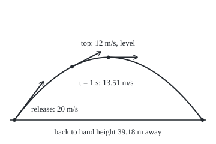
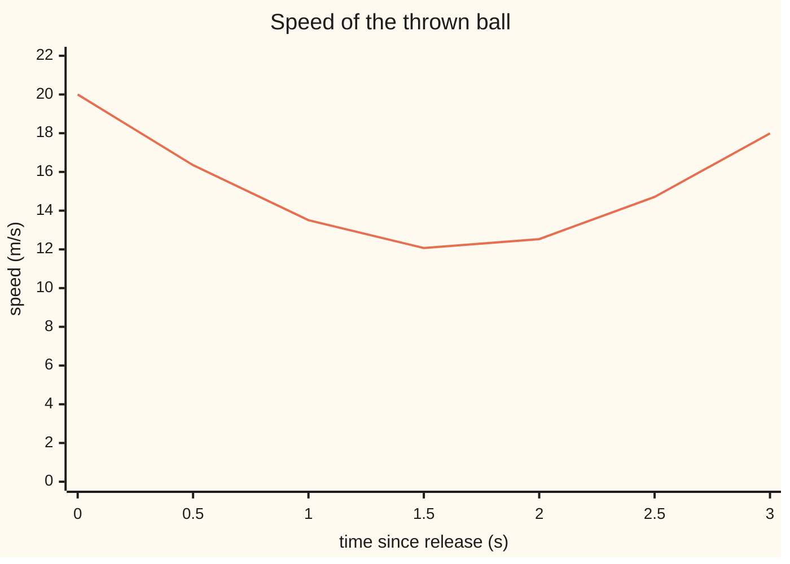

# Parametric motion: position, velocity and acceleration as vectors

[Syllabus](../../../SYLLABUS.md) → [Calculus and analysis](../README.md) → [Curves and Solids](../README.md#s05) → Parametric motion

---

## General Overview

A ball leaves a hand moving 12 m/s across and 16 m/s up. Gravity pulls it down at 9.8 m/s every second. It climbs, levels off 1.6327 s later, 13.0612 m above the hand, and comes back to hand height 39.1837 m away.

How fast is it going at the top? Not zero. It has stopped rising, but it is still crossing the ground at 12 m/s.

Two numbers place the ball at each instant: how far across and how high. Each is a function of time, so the path is a parametric curve ([Parametric curves](../../05-Geometry%20and%20trig/04-Coordinates%20and%20Curves/06-parametric-curves.md)) with time as the parameter. From those two functions calculus gives the velocity (which way and how fast), the speed (how fast only) and the slope (how steep the path is).

**Differentiate each coordinate separately to get the velocity; its length is the speed; the slope of the path is the up-rate over the across-rate, wherever the across-rate is not zero.**

**What kind of fact this is:** velocity, speed and acceleration are definitions; the slope rule is a theorem, proved on this card in Why it works.

### The picture: the throw, with its velocity at three moments

<p align="center"></p>

Drawn to scale, 8 units = 1 m. Each arrow is the velocity, drawn as the distance covered in 0.5 s at that velocity: at release, at t = 1 s and at the top.

---

## The formula

Notation first, in words. After $t$ seconds the ball is $x(t)$ metres across and $y(t)$ metres up from the hand. The bold $\mathbf r(t)$ is that pair written as one object, a vector. A prime is a rate per second: $x'(t)$, also written dx/dt, is "the rate of x per unit of t".

$$\mathbf r(t) = \big(x(t),\, y(t)\big), \qquad \mathbf v(t) = \big(x'(t),\, y'(t)\big), \qquad \mathbf a(t) = \big(x''(t),\, y''(t)\big)$$

**Read it aloud:** position is the pair of coordinates; velocity is the pair of their rates; acceleration is the pair of those rates' rates.

Straight bars around a vector mean its length, by Pythagoras:

$$\text{speed} = \lvert \mathbf v(t) \rvert = \sqrt{x'(t)^2 + y'(t)^2}, \qquad \frac{dy}{dx} = \frac{dy/dt}{dx/dt} \quad \text{when } dx/dt \neq 0$$

**Read it aloud:** speed is the length of the velocity arrow; the steepness of the path is the up-rate over the across-rate.

For the ball, with $u$ = 12 m/s across, $w$ = 16 m/s up and $g$ = 9.8 m/s^2:

$$x(t) = u\,t, \qquad y(t) = w\,t - \tfrac{1}{2} g\,t^2$$

so $\mathbf v(t)$ = (12, 16 − 9.8t) m/s and $\mathbf a(t)$ = (0, −9.8) m/s^2 at every instant.

| Symbol | Plain meaning | In our example | Push it up and the answer… |
| --- | --- | --- | --- |
| $t$ | the parameter: seconds since release | 0 to 3.2653 s | the ball moves on |
| $x(t)$, $y(t)$ | metres across and up from the hand | 12 and 11.1 m at t = 1 s | — |
| $\mathbf r(t)$ | position vector: the pair (x, y) | (12, 11.1) m | — |
| $\mathbf v(t)$ | velocity: rates of x and y, m/s | (12, 6.2) m/s at t = 1 s | the arrow grows and turns |
| $\lvert \mathbf v(t) \rvert$ | speed: the velocity's length, m/s | 13.5070 m/s at t = 1 s; 12 at the top | — |
| $\mathbf a(t)$ | acceleration: the velocity's rates, m/s^2 | (0, −9.8) always | — |
| $u$, $w$ | across and up speed at release | 12 and 16 m/s | u: a longer arch; w: a higher, longer one |
| $g$ | gravity's pull | 9.8 m/s^2 | a shorter, lower arch |

Acceleration is m/s per second, m/s^2. The slope dy/dx is metres up per metre across, so it has no unit.

### When it holds

- **Both coordinates have rates.** A ball that bounces has a corner in y(t), and no velocity at the instant of the bounce.
- **dx/dt is not zero.** The rule divides by it. Thrown straight up at 16 m/s, a ball has dx/dt = 0; at t = 1 s the ratio is 6.2 ÷ 0, no value. The path is vertical: a tangent, but no slope.
- **No air.** The arch is a model that ignores drag; a real ball lands short of 39.1837 m. The calculus applies to any smooth path.
- **One clock.** Replay the throw in slow motion and the same arch is traced more slowly: speed depends on the clock, the slope dy/dx does not.

---

## Why it works

### Step 0: a vector changes by changing its parts

A pair changes only when one of its numbers changes, so the rate of a pair should be the pair of rates.

### Step 1: velocity is the pair of difference quotients

Over a short time h the ball moves from $\mathbf r(t)$ to $\mathbf r(t+h)$. That move divided by h is the pair (change in x ÷ h, change in y ÷ h): two ordinary difference quotients, each heading for its own derivative.

The tolerance game, with numbers. At t = 1 s the across quotient is 12 for any h; the up quotient, stepping forward by h, is 6.2 − 4.9h. To land within 0.001 m/s of 6.2, keep h below 0.001 ÷ 4.9 = 0.000204 s. The code prints the error at h = 0.01, 0.001 and 0.0002: −0.049, −0.0049, −0.00098.

The gap between two arrows is at least each part's gap and at most the two parts' gaps added. So the arrow settles exactly when both parts do: velocity is componentwise.

<details>
<summary>Detailed proof: vector limits are componentwise</summary>

Let e = (e1, e2) be the gap between the difference quotient and the claimed velocity. By Pythagoras, each |ei| ≤ |e| ≤ |e1| + |e2|. Given ε > 0, pick δ so that |e1| and |e2| are both below ε/2 whenever 0 < |h| < δ; then |e| < ε. Conversely |e| < ε forces each |ei| < ε. So the vector quotient has a limit exactly when both parts do. Applied to the velocity, the same argument gives acceleration.

</details>

### Step 2: speed is the velocity's length

In a short time h the ball's move is h times the velocity plus an error that is small next to h, so the distance covered, divided by h, heads for the velocity's length. Hence speed = |v|.

At the top the velocity is (12, 0), length 12 m/s. The code measures the distance covered just after the top, divided by the time: 12.0100, 12.0001, 12.000001 m/s for h = 0.1, 0.01, 0.001 s. It closes on 12, not 0.

### Step 3: the slope rule, from the chain rule

Where dx/dt is never zero, x keeps moving one way, so each x belongs to one time and the height is a function of x alone: call it Y, so y(t) = Y(x(t)). The chain rule ([Chain rule](../02-Derivatives/03-chain-rule.md)) says

$$y'(t) = Y'\big(x(t)\big)\, x'(t).$$

Divide by x'(t), which is not zero: the path's slope dY/dx equals y'(t) ÷ x'(t).

For the ball, the clock can be removed by hand. From x = 12t, t = x/12, and substituting gives

$$y = \frac{w}{u}\,x - \frac{g}{2u^2}\,x^2,$$

a parabola. At x = 12 m, where the ball is at t = 1 s, the rule gives 6.2 ÷ 12 = 0.5167. The code checks it from forward difference quotients of y(x): 0.482639, 0.513264, 0.516326, 0.516663 for steps of 1, 0.1, 0.01 and 0.0001 m.

<details>
<summary>Detailed proof: why the inverse exists and has a rate</summary>

Suppose x' is continuous and positive on an interval of times. The mean value theorem gives x(t2) − x(t1) = x'(c)(t2 − t1) > 0 for t2 > t1, so x is increasing and has a continuous inverse T. The difference quotient of T is the reciprocal of that of x, so T has rate 1/x'(T(x)). Then Y = y ∘ T, and the chain rule gives Y'(x) = y'(t) · 1/x'(t). If x' is negative the same holds with "decreasing". If x' = 0 but y' ≠ 0, swap x and y: the tangent is vertical. If both are zero, neither ratio decides the tangent.

</details>

### Step 4: acceleration, and why it never goes to zero here

Differentiate the velocity (12, 16 − 9.8t) part by part: (0, −9.8). At the top the velocity is level but the acceleration still points down, so the ball does not stay there. The code recovers (0, −9.8) from second differences of position alone, (x(t+k) − 2x(t) + x(t−k)) ÷ k^2 with k = 0.001 s.

The top comes when y'(t) = 0: t = 16 ÷ 9.8 = 1.6327 s. The code also finds it by halving the interval on which y still rises.

---

## Worked numbers, by hand

| Step | Arithmetic | Value |
| --- | --- | --- |
| time of the top | 16 ÷ 9.8 | 1.6327 s |
| where the top is | across 12 × 1.6327; up 256 ÷ 19.6 | (19.5918, 13.0612) m |
| velocity at the top | (12, 16 − 16) | (12, 0) m/s |
| speed at the top | √(144 + 0) | **12 m/s** |
| position at t = 1 s | (12 × 1, 16 − 4.9) | (12, 11.1) m |
| velocity at t = 1 s | (12, 16 − 9.8) | (12, 6.2) m/s |
| speed at t = 1 s | √(144 + 38.44) | 13.5070 m/s |
| slope at t = 1 s | 6.2 ÷ 12 | 0.5167 |

At its highest point the ball is still crossing the ground at 12 m/s: the top of the arch is where the ball is slowest, not where it stops.

### What breaks if you drop a piece

| Mistake | Comes out at | What went wrong |
| --- | --- | --- |
| Speed at the top read off dy/dt alone | 0 m/s, not 12 | the up-rate is one part of the velocity, not its length |
| Slope at t = 1 s taken as dy/dt | 6.2, not 0.5167 | a rate per second, not a rise per metre |
| Speed at release as dx/dt + dy/dt | 28 m/s, not 20 | lengths add by Pythagoras, not by adding parts |
| Slope rule applied to a throw straight up | no value: 6.2 ÷ 0 | dx/dt = 0 drops the rule's one condition |


### How the speed moves

The speed falls from 20 m/s to 12 m/s at the top, then rises. It never reaches zero, because the across-rate never does.



The line is the speed √(144 + (16 − 9.8t)^2) every half second; its least value, 12 m/s at 1.6327 s, falls between samples.

---

## Code, from first principles, and it actually runs

Road one uses the derivative formulas. Road two never differentiates: shrinking difference quotients of position, second differences, halving for the top, and quotients of the clock-free path. Four asserts compare the roads.

### Python

```python
# Parametric motion -- the check behind the card.  Standard library only.
# A ball leaves the hand at 12 m/s across and 16 m/s up; gravity 9.8 m/s^2.
# Road one: the derivative formulas.  Road two: shrinking difference quotients
# of the position itself, and of the path with the clock removed.
import math
U, W, G = 12.0, 16.0, 9.8                    # across speed, up speed, gravity

def pos(t): return (U * t, W * t - G * t * t / 2)       # metres after t s
def vel(t): return (U, W - G * t)                       # road one: the formulas
def speed(v): return math.sqrt(v[0] ** 2 + v[1] ** 2)
def graph(x): return (W / U) * x - G * x * x / (2 * U * U)  # y from x, t removed

lo, hi = 0.0, 3.0                          # the top, found without the formula:
for _ in range(60):                        # halve the interval where y still climbs
    m = (lo + hi) / 2
    lo, hi = (m, hi) if pos(m + 1e-9)[1] > pos(m)[1] else (lo, m)
top = W / G
xt, yt = pos(top)
print(f"thrown at {U:.0f} m/s across, {W:.0f} m/s up, gravity {G} m/s^2, half of it {G / 2}")
print(f"top: t = {top:.4f} s by W/G, {lo:.4f} s by halving; x = {xt:.4f} m, y = {W * W:.0f}/{2 * G:.1f} = {yt:.4f} m")
print(f"velocity at the top ({vel(top)[0]:.4f}, {abs(vel(top)[1]):.4f}) m/s, speed {speed(vel(top)):.4f} m/s")
fwd = [math.dist(pos(top + h), pos(top)) / h for h in (0.1, 0.01, 0.001)]
print("distance per second just after the top, h = 0.1, 0.01, 0.001 s: " + ", ".join(f"{s:.6f}" for s in fwd))
print(f"at release: speed {speed(vel(0)):.4f} m/s, dy/dx {vel(0)[1] / vel(0)[0]:.4f}")
p1, v1 = pos(1), vel(1)
print(f"t = 1 s: position ({p1[0]:.4f}, {p1[1]:.4f}) m, velocity ({v1[0]:.4f}, {v1[1]:.4f}) m/s, speed sqrt({v1[0] ** 2:.2f} + {v1[1] ** 2:.2f}) = {speed(v1):.4f} m/s")
slope = v1[1] / v1[0]
qs = [(graph(p1[0] + k) - graph(p1[0])) / k for k in (1.0, 0.1, 0.01, 0.0001)]
print(f"dy/dx at t = 1 s: {slope:.6f} by (dy/dt)/(dx/dt); from y(x), step 1, 0.1, 0.01, 0.0001 m: " + ", ".join(f"{q:.6f}" for q in qs))
hs = [(pos(1 + h)[1] - pos(1)[1]) / h - v1[1] for h in (0.01, 0.001, 0.0002)]
print("forward quotient error in dy/dt at t = 1 s, h = 0.01, 0.001, 0.0002: " + ", ".join(f"{e:.6f}" for e in hs) + f"; within 0.001 once h < {0.001 / (G / 2):.6f}")
k = 0.001
acc = [(pos(1 + k)[i] - 2 * pos(1)[i] + pos(1 - k)[i]) / (k * k) for i in (0, 1)]
land = 2 * W / G
print(f"acceleration by second differences ({abs(acc[0]):.4f}, {acc[1]:.4f}) m/s^2; lands at t = {land:.4f} s, x = {pos(land)[0]:.4f} m")
print("chart, speed at t = 0, 0.5, ..., 3 s: " + ", ".join(f"{speed(vel(i / 2)):.2f}" for i in range(7)))
sx = lambda x: 24 + 8 * x
sy = lambda y: 200 - 8 * y
print(f"figure, 8 units per m: release (24, 200), top ({sx(xt):.2f}, {sy(yt):.2f}), landing ({sx(pos(land)[0]):.2f}, 200), "
      f"curve control ({sx(xt):.2f}, {sy(2 * yt):.2f})")
print(f"figure, arrow ends (velocity x 0.5 s): ({sx(U / 2):.2f}, {sy(W / 2):.2f}), ({sx(p1[0] + v1[0] / 2):.2f}, {sy(p1[1] + v1[1] / 2):.2f}), "
      f"({sx(xt + U / 2):.2f}, {sy(yt):.2f}); t = 1 s point ({sx(p1[0]):.2f}, {sy(p1[1]):.2f})")
print(f"mistake 1, speed at the top read off dy/dt alone: {abs(vel(top)[1]):.4f}, not {speed(vel(top)):.4f}")
print(f"mistake 2, slope at t = 1 s taken as dy/dt: {v1[1]:.4f}, not {slope:.4f}")
print(f"mistake 3, speed at release as dx/dt + dy/dt: {U + W:.4f}, not {speed(vel(0)):.4f}; ratio upside down: {U / W:.4f}")
print(f"straight up at 16 m/s: at t = 1 s, dx/dt = 0 and dy/dt = {W - G:.4f}, so (dy/dt)/(dx/dt) has no value")
assert abs(lo - top) < 1e-6                              # the top, two roads
assert abs(fwd[-1] - speed(vel(top))) < 0.001            # distance per second -> speed
assert abs(qs[-1] - slope) < 1e-4                        # clock removed -> same slope
assert abs(acc[1] + G) < 1e-3 and abs(acc[0]) < 1e-6     # second differences -> gravity
print("ALL CHECKS PASS")
```

**Ran 2026-09-27 on macOS, Python 3.14.6, standard library only. All checks passed. Output, pasted from the run:**

```
thrown at 12 m/s across, 16 m/s up, gravity 9.8 m/s^2, half of it 4.9
top: t = 1.6327 s by W/G, 1.6327 s by halving; x = 19.5918 m, y = 256/19.6 = 13.0612 m
velocity at the top (12.0000, 0.0000) m/s, speed 12.0000 m/s
distance per second just after the top, h = 0.1, 0.01, 0.001 s: 12.010000, 12.000100, 12.000001
at release: speed 20.0000 m/s, dy/dx 1.3333
t = 1 s: position (12.0000, 11.1000) m, velocity (12.0000, 6.2000) m/s, speed sqrt(144.00 + 38.44) = 13.5070 m/s
dy/dx at t = 1 s: 0.516667 by (dy/dt)/(dx/dt); from y(x), step 1, 0.1, 0.01, 0.0001 m: 0.482639, 0.513264, 0.516326, 0.516663
forward quotient error in dy/dt at t = 1 s, h = 0.01, 0.001, 0.0002: -0.049000, -0.004900, -0.000980; within 0.001 once h < 0.000204
acceleration by second differences (0.0000, -9.8000) m/s^2; lands at t = 3.2653 s, x = 39.1837 m
chart, speed at t = 0, 0.5, ..., 3 s: 20.00, 16.35, 13.51, 12.07, 12.53, 14.71, 17.99
figure, 8 units per m: release (24, 200), top (180.73, 95.51), landing (337.47, 200), curve control (180.73, -8.98)
figure, arrow ends (velocity x 0.5 s): (72.00, 136.00), (168.00, 86.40), (228.73, 95.51); t = 1 s point (120.00, 111.20)
mistake 1, speed at the top read off dy/dt alone: 0.0000, not 12.0000
mistake 2, slope at t = 1 s taken as dy/dt: 6.2000, not 0.5167
mistake 3, speed at release as dx/dt + dy/dt: 28.0000, not 20.0000; ratio upside down: 0.7500
straight up at 16 m/s: at t = 1 s, dx/dt = 0 and dy/dt = 6.2000, so (dy/dt)/(dx/dt) has no value
ALL CHECKS PASS
```

### Rust

Same numbers, same labels, built with `rustc --edition 2021 -O`.

```rust
// Parametric motion -- the same check as the Python, in Rust.  No crates.
// A ball leaves the hand at 12 m/s across and 16 m/s up; gravity 9.8 m/s^2.
// Road one: the derivative formulas.  Road two: shrinking difference quotients
// of the position itself, and of the path with the clock removed.
const U: f64 = 12.0; // across speed
const W: f64 = 16.0; // up speed
const G: f64 = 9.8; // gravity

fn pos(t: f64) -> (f64, f64) { (U * t, W * t - G * t * t / 2.0) } // metres after t s
fn vel(t: f64) -> (f64, f64) { (U, W - G * t) } // road one: the formulas
fn speed(v: (f64, f64)) -> f64 { (v.0 * v.0 + v.1 * v.1).sqrt() }
fn graph(x: f64) -> f64 { (W / U) * x - G * x * x / (2.0 * U * U) } // y from x, t removed
fn dist(a: (f64, f64), b: (f64, f64)) -> f64 { ((b.0 - a.0).powi(2) + (b.1 - a.1).powi(2)).sqrt() }
fn join(v: &[f64], d: usize) -> String { v.iter().map(|x| format!("{:.*}", d, x)).collect::<Vec<_>>().join(", ") }
fn sx(x: f64) -> f64 { 24.0 + 8.0 * x }
fn sy(y: f64) -> f64 { 200.0 - 8.0 * y }

fn main() {
    let (mut lo, mut hi) = (0.0_f64, 3.0_f64); // the top, found without the formula:
    for _ in 0..60 { // halve the interval where y still climbs
        let m = (lo + hi) / 2.0;
        if pos(m + 1e-9).1 > pos(m).1 { lo = m } else { hi = m }
    }
    let top = W / G;
    let (xt, yt) = pos(top);
    println!("thrown at {:.0} m/s across, {:.0} m/s up, gravity {} m/s^2, half of it {}", U, W, G, G / 2.0);
    println!("top: t = {:.4} s by W/G, {:.4} s by halving; x = {:.4} m, y = {:.0}/{:.1} = {:.4} m", top, lo, xt, W * W, 2.0 * G, yt);
    println!("velocity at the top ({:.4}, {:.4}) m/s, speed {:.4} m/s", vel(top).0, vel(top).1.abs(), speed(vel(top)));
    let fwd: Vec<f64> = [0.1, 0.01, 0.001].iter().map(|&h| dist(pos(top), pos(top + h)) / h).collect();
    println!("distance per second just after the top, h = 0.1, 0.01, 0.001 s: {}", join(&fwd, 6));
    println!("at release: speed {:.4} m/s, dy/dx {:.4}", speed(vel(0.0)), vel(0.0).1 / vel(0.0).0);
    let (p1, v1) = (pos(1.0), vel(1.0));
    println!("t = 1 s: position ({:.4}, {:.4}) m, velocity ({:.4}, {:.4}) m/s, speed sqrt({:.2} + {:.2}) = {:.4} m/s", p1.0, p1.1, v1.0, v1.1, v1.0 * v1.0, v1.1 * v1.1, speed(v1));
    let slope = v1.1 / v1.0;
    let qs: Vec<f64> = [1.0, 0.1, 0.01, 0.0001].iter().map(|&k| (graph(p1.0 + k) - graph(p1.0)) / k).collect();
    println!("dy/dx at t = 1 s: {:.6} by (dy/dt)/(dx/dt); from y(x), step 1, 0.1, 0.01, 0.0001 m: {}", slope, join(&qs, 6));
    let hs: Vec<f64> = [0.01, 0.001, 0.0002].iter().map(|&h| (pos(1.0 + h).1 - pos(1.0).1) / h - v1.1).collect();
    println!("forward quotient error in dy/dt at t = 1 s, h = 0.01, 0.001, 0.0002: {}; within 0.001 once h < {:.6}", join(&hs, 6), 0.001 / (G / 2.0));
    let k = 0.001;
    let second = |f: fn((f64, f64)) -> f64| (f(pos(1.0 + k)) - 2.0 * f(pos(1.0)) + f(pos(1.0 - k))) / (k * k);
    let acc = (second(|p| p.0), second(|p| p.1));
    let land = 2.0 * W / G;
    println!("acceleration by second differences ({:.4}, {:.4}) m/s^2; lands at t = {:.4} s, x = {:.4} m", acc.0.abs(), acc.1, land, pos(land).0);
    let chart: Vec<f64> = (0..7).map(|i| speed(vel(i as f64 / 2.0))).collect();
    println!("chart, speed at t = 0, 0.5, ..., 3 s: {}", join(&chart, 2));
    println!("figure, 8 units per m: release (24, 200), top ({:.2}, {:.2}), landing ({:.2}, 200), curve control ({:.2}, {:.2})",
             sx(xt), sy(yt), sx(pos(land).0), sx(xt), sy(2.0 * yt));
    println!("figure, arrow ends (velocity x 0.5 s): ({:.2}, {:.2}), ({:.2}, {:.2}), ({:.2}, {:.2}); t = 1 s point ({:.2}, {:.2})",
             sx(U / 2.0), sy(W / 2.0), sx(p1.0 + v1.0 / 2.0), sy(p1.1 + v1.1 / 2.0), sx(xt + U / 2.0), sy(yt), sx(p1.0), sy(p1.1));
    println!("mistake 1, speed at the top read off dy/dt alone: {:.4}, not {:.4}", vel(top).1.abs(), speed(vel(top)));
    println!("mistake 2, slope at t = 1 s taken as dy/dt: {:.4}, not {:.4}", v1.1, slope);
    println!("mistake 3, speed at release as dx/dt + dy/dt: {:.4}, not {:.4}; ratio upside down: {:.4}", U + W, speed(vel(0.0)), U / W);
    println!("straight up at 16 m/s: at t = 1 s, dx/dt = 0 and dy/dt = {:.4}, so (dy/dt)/(dx/dt) has no value", W - G);
    assert!((lo - top).abs() < 1e-6); // the top, two roads
    assert!((fwd[2] - speed(vel(top))).abs() < 0.001); // distance per second -> speed
    assert!((qs[3] - slope).abs() < 1e-4); // clock removed -> same slope
    assert!((acc.1 + G).abs() < 1e-3 && acc.0.abs() < 1e-6); // second differences -> gravity
    println!("ALL CHECKS PASS");
}
```

**Ran 2026-09-27 on macOS, rustc 1.98.1, no crates. All checks passed. Output, pasted from the run:**

```
thrown at 12 m/s across, 16 m/s up, gravity 9.8 m/s^2, half of it 4.9
top: t = 1.6327 s by W/G, 1.6327 s by halving; x = 19.5918 m, y = 256/19.6 = 13.0612 m
velocity at the top (12.0000, 0.0000) m/s, speed 12.0000 m/s
distance per second just after the top, h = 0.1, 0.01, 0.001 s: 12.010000, 12.000100, 12.000001
at release: speed 20.0000 m/s, dy/dx 1.3333
t = 1 s: position (12.0000, 11.1000) m, velocity (12.0000, 6.2000) m/s, speed sqrt(144.00 + 38.44) = 13.5070 m/s
dy/dx at t = 1 s: 0.516667 by (dy/dt)/(dx/dt); from y(x), step 1, 0.1, 0.01, 0.0001 m: 0.482639, 0.513264, 0.516326, 0.516663
forward quotient error in dy/dt at t = 1 s, h = 0.01, 0.001, 0.0002: -0.049000, -0.004900, -0.000980; within 0.001 once h < 0.000204
acceleration by second differences (0.0000, -9.8000) m/s^2; lands at t = 3.2653 s, x = 39.1837 m
chart, speed at t = 0, 0.5, ..., 3 s: 20.00, 16.35, 13.51, 12.07, 12.53, 14.71, 17.99
figure, 8 units per m: release (24, 200), top (180.73, 95.51), landing (337.47, 200), curve control (180.73, -8.98)
figure, arrow ends (velocity x 0.5 s): (72.00, 136.00), (168.00, 86.40), (228.73, 95.51); t = 1 s point (120.00, 111.20)
mistake 1, speed at the top read off dy/dt alone: 0.0000, not 12.0000
mistake 2, slope at t = 1 s taken as dy/dt: 6.2000, not 0.5167
mistake 3, speed at release as dx/dt + dy/dt: 28.0000, not 20.0000; ratio upside down: 0.7500
straight up at 16 m/s: at t = 1 s, dx/dt = 0 and dy/dt = 6.2000, so (dy/dt)/(dx/dt) has no value
ALL CHECKS PASS
```

The two outputs match line for line.

> [!TIP]
> **Try changing**
> Guess first, then run it.
> - **Throw harder across.** Set `U` to 16: the top still comes at 1.6327 s, since only the up part decides it, and the speed there is 16 m/s. All asserts pass.
> - **Throw on the Moon.** Set `G` to 1.62: the top comes at 9.8765 s, but the halving search looks only up to 3 s, so the first assert stops the run.
> - **Break the velocity formula.** Change `W - G * t` to `W - G * t / 2` in `vel`: the top's speed reads 14.4222, and the second assert stops the run.

---

## The usual mistake

> [!warning]
> **Reading speed off one coordinate.** At the top the up-rate is zero, but the velocity is (12, 0) m/s and the speed 12 m/s. Speed is the length of the whole arrow; a coordinate rate is one side of the triangle.
>
> - **Slope confused with a rate.** At t = 1 s, dy/dt = 6.2 m/s is how fast the ball rises; dy/dx = 0.5167 is how steep the path is.
> - **Adding the parts.** At release 12 + 16 = 28 m/s; the speed is √(144 + 256) = 20 m/s.
> - **The ratio upside down.** (dx/dt)/(dy/dt) at release is 0.75, the across-per-up; the slope is 1.3333.

---

## Where you meet it in real life

- **Sports ballistics.** Golf and baseball launch monitors measure the across and up rates and report speed and angle from them.
- **Curves into solids.** The shelf's other cards spin curves into solids: [Volumes](03-volumes-by-slices-and-shells.md), [Surface area](04-surface-area-of-revolution.md) and [Centre of mass](05-centre-of-mass-and-pappus.md).

> **Say it back**
> A moving point has two coordinates, each a function of time. Differentiating each gives the velocity; differentiating again gives the acceleration. The speed is the velocity's length, by Pythagoras, so the ball at the top still moves at 12 m/s. The path's slope is the up-rate over the across-rate, by the chain rule, while the across-rate is not zero.

---

## What this builds on

- [Chain rule](../02-Derivatives/03-chain-rule.md): the rate of a function of a function, which turns into the slope rule.
- [Parametric curves](../../05-Geometry%20and%20trig/04-Coordinates%20and%20Curves/06-parametric-curves.md): a curve as two coordinates driven by one number, and removing that number.

## Where this goes next

- [Arc length](02-arc-length.md): adding up speed over time to get distance along the path.
- Regular curve and arc length: curves whose velocity never vanishes, measured by their own length instead of a clock.
- Curvature: how sharply the path bends, separated from how fast it is travelled.

The speed is known at every instant; how far the ball travels along its arch is the question [Arc length](02-arc-length.md) answers.

---

## Sources

Verified 27 Sep 2026: every link below resolves to the publisher's page.

- OpenStax. *Calculus Volume 2*, §7.2 "Calculus of Parametric Curves". [Chapter page](https://openstax.org/books/calculus-volume-2/pages/7-2-calculus-of-parametric-curves). The slope rule dy/dx = (dy/dt)/(dx/dt) and its proof by the chain rule.
- OpenStax. *Calculus Volume 3*, §3.2 "Calculus of Vector-Valued Functions". [Chapter page](https://openstax.org/books/calculus-volume-3/pages/3-2-calculus-of-vector-valued-functions). Differentiating a vector part by part.
- OpenStax. *Calculus Volume 3*, §3.4 "Motion in Space". [Chapter page](https://openstax.org/books/calculus-volume-3/pages/3-4-motion-in-space). Velocity, speed and acceleration, with projectile motion.
