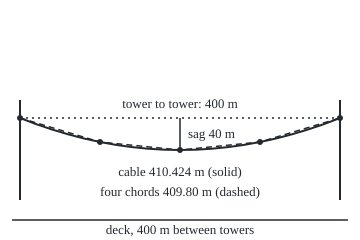
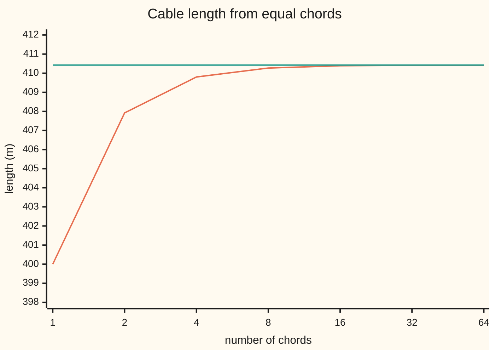

# Arc length: the length of a curve as the integral of speed

[Syllabus](../../../SYLLABUS.md) → [Calculus and analysis](../README.md) → [Curves and Solids](../README.md#s05) → Arc length

---

## General Overview

A suspension bridge hangs its deck from main cables. Take one cable between towers 400 m apart, dipping 40 m at midspan; that dip is the **sag**. The deck's weight, spread evenly along the road, pulls the cable into a parabola. Before any wire is spun, the builders need its length.

A ruler measures straight lines, not curves. So join points on the cable by straight pieces, called **chords**, and add them. One chord, tower to tower, gives 400 m. Four give 409.80 m. Sixty-four give 410.42 m. The totals climb towards one number: the cable's length, 410.424 m.

Calculus reaches it without chords. Each tiny piece of cable is almost straight, so its length is its width stretched by a factor set by the slope there. An integral adds the stretched widths.

<p align="center"></p>

Drawn to scale at 0.8 units per metre; chord points every 100 m. The deck line marks the span only, not its height.

**The length of a curve is the limit of the lengths of ever finer chord chains, and for a smooth curve that limit is the integral of $\sqrt{1 + f'(x)^2}$, or, for a moving point, the integral of its speed.**

**What kind of fact this is:** a theorem. Length is defined by chords; that it equals the integral is proved on this card in Why it works.

---

## The formula

A reminder: $f'(x)$ is the derivative, "the rate of height per unit of x", here the cable's slope.

For a graph, height $f(x)$ over the stretch from $a$ to $b$:

$$L = \int_a^b \sqrt{1 + f'(x)^2}\, dx$$

**Read it aloud:** the length adds each tiny width, stretched by the square root of one plus the slope squared.

For a point moving along a curve, its position at clock time $t$ is $(x(t), y(t))$, as on [Parametric motion](01-parametric-motion.md). Its speed is $\sqrt{x'(t)^2 + y'(t)^2}$, and

$$L = \int_{t_0}^{t_1} \sqrt{x'(t)^2 + y'(t)^2}\, dt$$

**Read it aloud:** the length is the integral of speed over the time the trip takes.

The graph formula is the second one with the clock set to $x$ itself: then $x'(t) = 1$ and $y'(t) = f'(x)$.

| Symbol | Plain meaning | In our example | Push it up and the answer… |
| --- | --- | --- | --- |
| $x$ | horizontal position, metres from midspan | −200 to 200 | a wider stretch is longer |
| $f(x)$ | cable height above its lowest point, metres | x^2/1000, so 40 at a tower | a deeper sag lengthens the cable |
| $f'(x)$ | slope: metres of rise per metre across | x/500, so 0.4 at a tower | steeper stretches count for more |
| $a$, $b$ | the two ends of the stretch | −200 and 200 m | — |
| $L$ | the length along the curve, metres | 410.424 m | — |
| $t$, $t_0$, $t_1$ | a clock for the moving point, its start and end | −1 to 1 | a faster clock changes speed, not length |
| $x(t)$, $y(t)$ | position at time t; primes are their rates | 200t and 40t^2 | — |
| $n$, $\Delta x$ | number of chords, and the width of each | 4 chords, 100 m wide | more chords, closer total |

The slope is metres per metre, so the square root is a pure stretch factor and the length is in metres.

### When it holds

- **The curve has no jumps and its slope changes without jumps.** A corner is fine: split the curve there and add the pieces. A 40 m step at midspan has slope 0 on both sides, so the formula says 400.00 m, while 1024 chords give 439.61 m.
- **The stretch is finite.** A curve running off forever may have no length.
- **No endless crinkling.** A continuous curve can wiggle at every scale so its chord totals grow without limit; smoothness rules that out.
- **A moving point counts each pass.** Out and back along the cable is twice the length.

---

## Why it works

### Step 0: chords undershoot, and refining can only help

A straight line is the shortest route, so no chord is longer than the curve it cuts across. Split a chord at a point on the curve and the three chords form a triangle, whose two sides together are at least the third. Adding points never shortens the total. The cable's totals, 400.00, 407.92, 409.80 m, only climb.

So the **length** of a curve is defined as the least upper bound (written sup: the smallest number no chord total exceeds) of all its chord totals.

### Step 1: one chord is a width times a stretch factor

Cut the stretch from a to b into $n$ strips of width $\Delta x$. Over one strip the height changes by an amount called the rise. By Pythagoras the chord is

$$\sqrt{\Delta x^2 + \text{rise}^2} = \Delta x \sqrt{1 + (\text{rise}/\Delta x)^2}$$

Rise over width is the chord's slope. The **mean value theorem** (on a smooth stretch, some point inside has slope equal to the chord's) puts a point in the strip where $f'(x)$ is exactly that ratio. So each chord is its width times $\sqrt{1 + f'(x)^2}$ at some point of its own strip.

### Step 2: the chord total is a Riemann sum

Add the chords: widths times values of the stretch factor, one value from each strip. That is a Riemann sum ([The integral](../04-Integrals/01-riemann-integral.md)). The stretch factor is continuous because the slope is, so these sums close in on its integral as the strips narrow, wherever in each strip the value is taken.

### Step 3: closing in from below means the least upper bound

Chord totals climb (Step 0) and close in on the integral (Step 2); a climbing list that closes in on a number never passes it. So the integral bounds every chord total, and nothing smaller does: it is the least upper bound, the length.

The tolerance game: to land within 0.01 m, 32 equal chords suffice, short by 0.0097 m. Halving the chord width cuts the shortfall to about a quarter: 0.6206 m at 4 chords, 0.1548 m at 8, 0.0387 m at 16.



Orange: the chord total. Green: the integral, 410.424 m. Orange climbs to green and never crosses it.

### Step 4: a moving point, and why the graph is a special case

For a moving point, cut the clock into short steps. In one step the point moves about $x'(t)$ times the step across and $y'(t)$ times it up, so each chord is about speed times step. One catch: the mean value theorem, applied to each coordinate, may pick two different instants in a step; because the rates have no jumps, the mismatch vanishes as steps shrink.

The cable as a moving point, $x(t) = 200t$ and $y(t) = 40t^2$ for t from −1 to 1, traces the same parabola; its speed integral gives 410.424252 m. A new clock changes speed, not length.

<details>
<summary>Detailed proof: chord totals close in on the speed integral</summary>

Let $x(t)$ and $y(t)$ have continuous rates from $t_0$ to $t_1$, and let L be the speed integral. Cut the clock at $t_0 < s_1 < \dots < s_n = t_1$, widest step h.

On each step, the mean value theorem gives instants c_i and d_i in that step with $\Delta x_i = x'(c_i)\,\Delta s_i$ and $\Delta y_i = y'(d_i)\,\Delta s_i$. So that step's chord has length $\sqrt{x'(c_i)^2 + y'(d_i)^2}\,\Delta s_i$.

A rate continuous on a closed interval is uniformly continuous: for every ε > 0 there is a δ > 0 such that instants less than δ apart have rates less than ε apart. Take h < δ. The reverse triangle inequality in the plane gives
$$\left|\sqrt{x'(c_i)^2 + y'(d_i)^2} - \sqrt{x'(c_i)^2 + y'(c_i)^2}\right| \le |y'(d_i) - y'(c_i)| < \varepsilon.$$
So the chord total is within ε times the clock's length of the Riemann sum $\sum \sqrt{x'(c_i)^2 + y'(c_i)^2}\,\Delta s_i$, which is within ε of L once h is small, since speed is continuous. The chord totals tend to L.

Refining never shortens a total, and any cutting refines to fine ones, so every total is at most L while fine ones come within any ε of it: L is the least upper bound.

</details>

### Step 5: the cable's integral in closed form

For the cable, $f'(x) = x/500$. Substituting $x = 500 \sinh w$ turns $\sqrt{1 + (x/500)^2}$ into a cosh, since $\cosh^2 w - \sinh^2 w = 1$. The result is

$$L = 500\left(0.4\sqrt{1.16} + \operatorname{asinh} 0.4\right)$$

where asinh is the inverse of sinh, and $\operatorname{asinh} u = \ln\left(u + \sqrt{1 + u^2}\right)$.

<details>
<summary>The algebra behind this</summary>

With $x = 500 \sinh w$, the width element is $500 \cosh w$ times the step in w, and the integrand becomes $500 \cosh^2 w$. Since $\cosh^2 w = (1 + \cosh 2w)/2$, an antiderivative is $250\,(w + \sinh w \cosh w)$. The ends are $\sinh w = \pm 0.4$, where $\cosh w = \sqrt{1.16}$; both ends contribute equally.

</details>

Most curves have no such closed form, so engineers integrate numerically, as the code does.

---

## Worked numbers, by hand

The cable: span 400 m, sag 40 m, height $f(x) = x^2/1000$ from −200 to 200 m.

| Step | Arithmetic | Value |
| --- | --- | --- |
| slope | derivative of x^2/1000 | x/500 |
| slope at a tower | 200/500 | 0.4 |
| stretch factor at a tower | sqrt(1 + 0.16) | 1.077033 |
| first term | 0.4 × 1.077033 | 0.430813 |
| second term | asinh 0.4 = ln(0.4 + 1.077033) = ln(1.477033) | 0.390035 |
| sum | 0.430813 + 0.390035 | 0.820849 |
| length | 500 × 0.820849 | **410.424 m** |

(The sum's last digit uses unrounded terms.) A 40 m sag costs 10.4243 m of wire beyond the span. The shallow-sag rule of thumb, span plus 8 × sag^2 / (3 × span), gives 410.667 m.

### What breaks if you drop a piece

| Mistake | Comes out at | What went wrong |
| --- | --- | --- |
| Measure tower to tower | 400.00 m | One chord; the sag is ignored |
| Integrate the slope's size, forgetting the 1 | 80.000 m | Only vertical travel, 40 m down and 40 m up |
| Drop the square root | 421.333 m | Squares added, not Pythagoras: the extra wire roughly doubles |
| Formula across a 40 m step | 400.00 m, not 439.61 m | Jump dropped: no slope sees the step |

The code prints each one.

---

## Code, from first principles, and it actually runs

Three roads. One: chord totals, the definition, with the shortfall printed. Two: Simpson's rule (a strip sum fitting a parabola over each pair of strips) on the stretch factor and on the moving point's speed. Three: Step 5's closed form. The asserts compare roads and check that chord totals climb and stay below.

### Python

```python
# Arc length -- the check behind the card.  Standard library only; math gives
# sqrt and log as primitives, and every sum below is written out here.
# A suspension cable hangs as the parabola y = x^2 / 1000 between towers at
# x = -200 and x = 200 m: span 400 m, sag 40 m.  Its length, three roads.
from math import sqrt, log

S, D = 400.0, 40.0                 # span and sag, metres
A, B = -S / 2, S / 2               # the towers
def f(x):  return 4 * D * x * x / (S * S)          # height above the low point
def fp(x): return 8 * D * x / (S * S)              # slope, metres per metre

def step(x): return D if x >= 0 else 0.0            # a 40 m jump at midspan

def polygon(n, g=f):               # road one: n straight chords, tower to tower
    xs = [A + (B - A) * i / n for i in range(n + 1)]
    return sum(sqrt((xs[i] - xs[i - 1]) ** 2 + (g(xs[i]) - g(xs[i - 1])) ** 2)
               for i in range(1, n + 1))

def simpson(g, a, b, n):           # road two: Simpson's rule, n even strips
    h = (b - a) / n
    s = g(a) + g(b) + sum((4 if i % 2 else 2) * g(a + i * h) for i in range(1, n))
    return s * h / 3

k = 8 * D / (S * S)                # slope per metre of x: 1/500
u = k * B                          # slope at the tower: 0.4
exact = (u * sqrt(1 + u * u) + log(u + sqrt(1 + u * u))) / k   # road three
graph = simpson(lambda x: sqrt(1 + fp(x) ** 2), A, B, 100)
param = simpson(lambda t: sqrt((S / 2) ** 2 + (2 * D * t) ** 2), -1.0, 1.0, 100)

r = sqrt(1 + u * u)
print(f"span {S:.0f} m, sag {D:.0f} m, cable y = x^2/1000, slope x/500, at the tower {u:.1f}")
print(f"sqrt(1.16) = {r:.6f}; 0.4 x it = {u * r:.6f}; asinh 0.4 = ln({u + r:.6f}) = "
      f"{log(u + r):.6f}; sum {u * r + log(u + r):.6f}")
print(f"closed form, 500 x (0.4 x sqrt(1.16) + asinh 0.4): {exact:.6f} m")
print(f"Simpson on sqrt(1 + f'(x)^2), 100 strips: {graph:.6f} m")
print(f"Simpson on the speed of x = 200t, y = 40t^2, 100 strips: {param:.6f} m")
lengths = []
for n in (1, 2, 4, 8, 16, 32, 64):
    lengths.append(polygon(n))
    print(f"chords {n:4d}: polygon {lengths[-1]:.2f} m, short by {exact - lengths[-1]:.4f} m")
print(f"mistake 1, integrate |slope| only: {simpson(lambda x: abs(fp(x)), A, B, 100):.3f} m")
print(f"mistake 2, drop the square root: {simpson(lambda x: 1 + fp(x) ** 2, A, B, 100):.3f} m")
print(f"no jumps dropped, a {D:.0f} m step at midspan: formula (slope 0) {S:.2f} m, "
      f"1024 chords {polygon(1024, step):.2f} m")
print(f"rule of thumb s + 8d^2/(3s): {S + 8 * D * D / (3 * S):.3f} m")
X = lambda x: 180 + 0.8 * x
Y = lambda x: 150 - 0.8 * f(x)
print("figure, 0.8 units per m, chord points:",
      " ".join(f"({X(x):.1f},{Y(x):.1f})" for x in (-200, -100, 0, 100, 200)))
assert abs(graph - exact) < 1e-7                  # road two against road three
assert abs(param - exact) < 1e-7                  # a new clock, the same length
assert all(p < q for p, q in zip(lengths, lengths[1:] + [exact]))   # chords climb, stay under
assert 0 < exact - polygon(1024) < 1e-4           # road one closes the gap, from below
print("ALL CHECKS PASS")
```

**Ran 2026-09-27 on macOS, Python 3.14.6, standard library only. All checks passed. Output, pasted from the run:**

```
span 400 m, sag 40 m, cable y = x^2/1000, slope x/500, at the tower 0.4
sqrt(1.16) = 1.077033; 0.4 x it = 0.430813; asinh 0.4 = ln(1.477033) = 0.390035; sum 0.820849
closed form, 500 x (0.4 x sqrt(1.16) + asinh 0.4): 410.424252 m
Simpson on sqrt(1 + f'(x)^2), 100 strips: 410.424252 m
Simpson on the speed of x = 200t, y = 40t^2, 100 strips: 410.424252 m
chords    1: polygon 400.00 m, short by 10.4243 m
chords    2: polygon 407.92 m, short by 2.5027 m
chords    4: polygon 409.80 m, short by 0.6206 m
chords    8: polygon 410.27 m, short by 0.1548 m
chords   16: polygon 410.39 m, short by 0.0387 m
chords   32: polygon 410.41 m, short by 0.0097 m
chords   64: polygon 410.42 m, short by 0.0024 m
mistake 1, integrate |slope| only: 80.000 m
mistake 2, drop the square root: 421.333 m
no jumps dropped, a 40 m step at midspan: formula (slope 0) 400.00 m, 1024 chords 439.61 m
rule of thumb s + 8d^2/(3s): 410.667 m
figure, 0.8 units per m, chord points: (20.0,118.0) (100.0,142.0) (180.0,150.0) (260.0,142.0) (340.0,118.0)
ALL CHECKS PASS
```

### Rust

Same numbers, same labels, built with `rustc --edition 2021 -O`.

```rust
// Arc length -- the same check as the Python, in Rust.  No crates; sqrt and
// ln are primitives, and every sum below is written out here.
// A suspension cable hangs as the parabola y = x^2 / 1000 between towers at
// x = -200 and x = 200 m: span 400 m, sag 40 m.  Its length, three roads.
const S: f64 = 400.0; // span, metres
const D: f64 = 40.0; // sag, metres
const A: f64 = -S / 2.0;
const B: f64 = S / 2.0;

fn f(x: f64) -> f64 { 4.0 * D * x * x / (S * S) } // height above the low point
fn fp(x: f64) -> f64 { 8.0 * D * x / (S * S) } // slope, metres per metre

fn step(x: f64) -> f64 { if x >= 0.0 { D } else { 0.0 } } // a 40 m jump at midspan

fn polygon(n: usize, g: &dyn Fn(f64) -> f64) -> f64 { // road one: n straight chords
    let xs: Vec<f64> = (0..=n).map(|i| A + (B - A) * i as f64 / n as f64).collect();
    (1..=n).map(|i| ((xs[i] - xs[i - 1]).powi(2) + (g(xs[i]) - g(xs[i - 1])).powi(2)).sqrt()).sum()
}

fn simpson(g: &dyn Fn(f64) -> f64, a: f64, b: f64, n: usize) -> f64 { // road two
    let h = (b - a) / n as f64;
    let mut s = g(a) + g(b);
    for i in 1..n {
        s += if i % 2 == 1 { 4.0 } else { 2.0 } * g(a + i as f64 * h);
    }
    s * h / 3.0
}

fn main() {
    let k = 8.0 * D / (S * S); // slope per metre of x: 1/500
    let u = k * B; // slope at the tower: 0.4
    let exact = (u * (1.0 + u * u).sqrt() + (u + (1.0 + u * u).sqrt()).ln()) / k; // road three
    let graph = simpson(&|x| (1.0 + fp(x).powi(2)).sqrt(), A, B, 100);
    let param = simpson(&|t| ((S / 2.0).powi(2) + (2.0 * D * t).powi(2)).sqrt(), -1.0, 1.0, 100);

    let r = (1.0 + u * u).sqrt();
    println!("span {:.0} m, sag {:.0} m, cable y = x^2/1000, slope x/500, at the tower {:.1}", S, D, u);
    println!("sqrt(1.16) = {:.6}; 0.4 x it = {:.6}; asinh 0.4 = ln({:.6}) = {:.6}; sum {:.6}",
             r, u * r, u + r, (u + r).ln(), u * r + (u + r).ln());
    println!("closed form, 500 x (0.4 x sqrt(1.16) + asinh 0.4): {:.6} m", exact);
    println!("Simpson on sqrt(1 + f'(x)^2), 100 strips: {:.6} m", graph);
    println!("Simpson on the speed of x = 200t, y = 40t^2, 100 strips: {:.6} m", param);
    let mut lengths: Vec<f64> = Vec::new();
    for n in [1, 2, 4, 8, 16, 32, 64] {
        lengths.push(polygon(n, &f));
        let p = lengths[lengths.len() - 1];
        println!("chords {:4}: polygon {:.2} m, short by {:.4} m", n, p, exact - p);
    }
    println!("mistake 1, integrate |slope| only: {:.3} m", simpson(&|x| fp(x).abs(), A, B, 100));
    println!("mistake 2, drop the square root: {:.3} m", simpson(&|x| 1.0 + fp(x).powi(2), A, B, 100));
    println!("no jumps dropped, a {:.0} m step at midspan: formula (slope 0) {:.2} m, 1024 chords {:.2} m",
             D, S, polygon(1024, &step));
    println!("rule of thumb s + 8d^2/(3s): {:.3} m", S + 8.0 * D * D / (3.0 * S));
    let pts: Vec<String> = [-200.0, -100.0, 0.0, 100.0, 200.0].iter()
        .map(|&x: &f64| format!("({:.1},{:.1})", 180.0 + 0.8 * x, 150.0 - 0.8 * f(x))).collect();
    println!("figure, 0.8 units per m, chord points: {}", pts.join(" "));
    assert!((graph - exact).abs() < 1e-7); // road two against road three
    assert!((param - exact).abs() < 1e-7); // a new clock, the same length
    let mut climb = lengths.clone();
    climb.push(exact);
    assert!(climb.windows(2).all(|w| w[0] < w[1])); // chords climb, stay under
    let gap = exact - polygon(1024, &f);
    assert!(gap > 0.0 && gap < 1e-4); // road one closes the gap, from below
    println!("ALL CHECKS PASS");
}
```

**Ran 2026-09-27 on macOS, rustc 1.98.1, no crates. All checks passed. Output, pasted from the run:**

```
span 400 m, sag 40 m, cable y = x^2/1000, slope x/500, at the tower 0.4
sqrt(1.16) = 1.077033; 0.4 x it = 0.430813; asinh 0.4 = ln(1.477033) = 0.390035; sum 0.820849
closed form, 500 x (0.4 x sqrt(1.16) + asinh 0.4): 410.424252 m
Simpson on sqrt(1 + f'(x)^2), 100 strips: 410.424252 m
Simpson on the speed of x = 200t, y = 40t^2, 100 strips: 410.424252 m
chords    1: polygon 400.00 m, short by 10.4243 m
chords    2: polygon 407.92 m, short by 2.5027 m
chords    4: polygon 409.80 m, short by 0.6206 m
chords    8: polygon 410.27 m, short by 0.1548 m
chords   16: polygon 410.39 m, short by 0.0387 m
chords   32: polygon 410.41 m, short by 0.0097 m
chords   64: polygon 410.42 m, short by 0.0024 m
mistake 1, integrate |slope| only: 80.000 m
mistake 2, drop the square root: 421.333 m
no jumps dropped, a 40 m step at midspan: formula (slope 0) 400.00 m, 1024 chords 439.61 m
rule of thumb s + 8d^2/(3s): 410.667 m
figure, 0.8 units per m, chord points: (20.0,118.0) (100.0,142.0) (180.0,150.0) (260.0,142.0) (340.0,118.0)
ALL CHECKS PASS
```

The outputs match line for line.

> [!TIP]
> **Try changing**
> Guess first, then run it.
> - **A deeper sag.** Set `D = 80.0` and guess the extra wire. About 439 m: double the sag, nearly four times the extra.
> - **Coarser Simpson.** Give the graph `4` strips, not `100`. It lands within 8 mm, and the first assert stops the run.
> - **Forget Pythagoras.** In `polygon`, drop the height term. Every chord total becomes 400 m, and the climbing assert fails.

---

## The usual mistake

> [!warning]
> **Treating the integral of the slope as the length.** The integral of $f'(x)$ is the change in height, 0 m tower to tower; the integral of its size is the vertical travel, 80 m. Length joins both directions by Pythagoras: hence the 1 and the square root.
>
> - **Dropping the square root.** 421.333 m against the true 410.424 m.
> - **Trusting a coarse chain.** Two chords give 407.92 m, 2.5027 m short.
> - **Mixing units.** Height in metres against x in kilometres puts the slope a thousand times off.

---

## Where you meet it in real life

- **Suspension bridges.** Main cables are spun to a computed length. A cable under its own weight hangs as a catenary (a cosh curve); the same integral measures it.
- **GPS tracks.** A GPS log is a chord chain between fixes; a sparse log reads short on a winding road.
- **Wires and surfaces.** Where a bent wire balances uses its length: [Centre of mass](05-centre-of-mass-and-pappus.md). Spinning a curve's length round an axis gives [Surface area](04-surface-area-of-revolution.md).

> **Say it back**
> Length is defined by chords: join points, add the straight pieces, refine; the length is the least upper bound of the totals. Each chord is its width times the square root of one plus the slope squared somewhere in its strip, so the total is a Riemann sum and the length an integral. For a moving point it is the integral of speed, whatever the clock. The 400 m cable with a 40 m sag is 410.424 m long.

---

## What this builds on

- [Parametric motion](01-parametric-motion.md): position as functions of a clock, and speed.
- [The integral](../04-Integrals/01-riemann-integral.md): strip sums closing in on the integral, as in Step 2.

## Where this goes next

- [Surface area](04-surface-area-of-revolution.md): spins each small length round an axis.
- [Line integrals of a function](../09-Vector%20Calculus/01-scalar-line-integrals.md): weights each small length by a density.
- Regular curve and arc length: length itself as the clock.

Arc length adds plain metres of curve; how to add something that varies along it, such as the cable's weight per metre, is what a line integral answers.

---

## Sources

Verified 2026-09-27: every link below resolves to the publisher's page.

- Strang, Gilbert, Edwin Herman et al. *Calculus Volume 2*, OpenStax. [Section 2.4, Arc Length of a Curve and Surface Area](https://openstax.org/books/calculus-volume-2/pages/2-4-arc-length-of-a-curve-and-surface-area). The graph formula from chords.
- Strang, Gilbert, Edwin Herman et al. *Calculus Volume 3*, OpenStax. [Section 3.3, Arc Length and Curvature](https://openstax.org/books/calculus-volume-3/pages/3-3-arc-length-and-curvature). Length as the integral of speed.
- "Catenary." MacTutor History of Mathematics, University of St Andrews. [Curve page](https://mathshistory.st-andrews.ac.uk/Curves/Catenary/). The hanging chain, and Jungius's 1669 disproof of Galileo's parabola.
