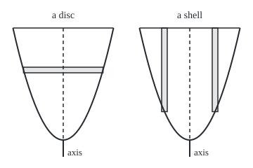
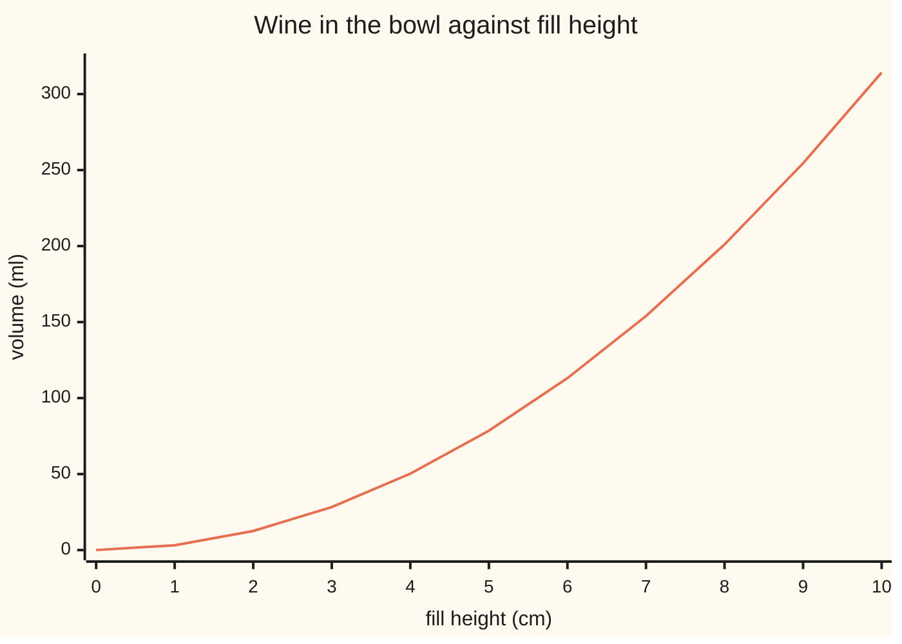

# Volumes: slicing a solid into discs, washers or shells

[Syllabus](../../../SYLLABUS.md) → [Calculus and analysis](../../../SYLLABUS.md#w06) → [Curves and Solids](../../../SYLLABUS.md#w06-s05) → Volumes

---

## General Overview

A glassblower draws the inside wall of a wine glass's bowl as one curve, 10 cm deep. At 2 cm from the stem's centre line the wall stands 2 cm high; at 4 cm out, 8 cm. Height is half of distance squared, so the rim sits 4.472136 cm out. Spin the curve round the centre line and the bowl appears. How much wine does it hold?

No box formula fits a curved bowl, but a thin piece is nearly a known shape. Cut across, like a loaf, and each slice is almost a flat coin: a short cylinder. Cut round the centre line, like tree rings, and each piece is a tube. Add thinner and thinner pieces and an integral gives the total.

Both cuts give 100 pi cubic centimetres, 314.16 ml to the brim. The skill is picking the easier cut.

**Cut a solid of revolution (a solid made by spinning a flat shape round a line) into thin discs across the line or thin tubes round it; each piece's volume is a known shape's volume, and the integral adds them.**

**What kind of fact this is:** a method; that each cut gives the true volume is a theorem, proved in Why it works by a squeeze.

### The picture: one disc and one shell, cut from the same bowl

<p align="center"></p>

Scale 1 cm = 16 units. Dashed: the axis the wall spins round. Left: the disc from 6 to 6.5 cm high, at its middle height's radius. Right: the shell from 2 to 2.5 cm out, cut through on both sides, from the rim down to the wall's height at its middle radius.

---

## The formula

Notation first. The **axis** is the line the solid spins round. Height up it is $y$, from $a$ to $b$; the cross-section there is a circle of radius $r(y)$. The integral sign adds thin pieces from $a$ to $b$; the closing dy names the variable they stack along ([Fundamental theorem of calculus](../04-Integrals/02-fundamental-theorem-of-calculus.md)).

**Discs**, slices across the axis:

$$V = \int_a^b \pi\, r(y)^2 \, dy$$

**Read it aloud:** add each circular slice's area up the axis.

**Washers**, discs with a hole of radius $r(y)$ inside an outer radius $R(y)$:

$$V = \int_a^b \pi\,\big(R(y)^2 - r(y)^2\big)\, dy$$

**Read it aloud:** each slice is a circle's area minus the hole's.

**Shells**, thin tubes round the axis. A tube's distance from the axis is $\rho$ (Greek rho), from 0 to $c$; its length along the axis is $\ell(\rho)$:

$$V = \int_0^c 2\pi\,\rho\,\ell(\rho)\, d\rho$$

**Read it aloud:** each tube, unrolled flat, is circumference times length times thickness.

For the bowl, the wall is $y = r^2/2$, so a disc at height $y$ has $r(y)^2 = 2y$. Wine at distance $\rho$ runs from the wall to the rim: $\ell(\rho) = 10 - \rho^2/2$.

| Symbol | Plain meaning | In our example | Push it up and the answer… |
| --- | --- | --- | --- |
| $V$ | volume, cm^3 (1 cm^3 = 1 ml) | 314.159265 | — |
| $y$, $a$, $b$ | height up the axis; its ends | 0 to 10 cm | more slices |
| $r$, $R$ | slice radius; outer radius round a hole | r(y)^2 = 2y | R: more; hole: less |
| $\rho$, $c$ | shell's distance from the axis; the largest | 0 to 4.472136 cm | far shells weigh more |
| $\ell$ | shell's length along the axis | 10 − ρ^2/2 cm | more, in step |
| $H$, $h$, $T$ | depth; fill height; outer wall's drop | 10; 6.909883; 0.3 cm | grows as h squared |
| $n$, $u$, $v$, $L_n$, $U_n$ | slice count; a slice's ends; inside and outside totals | 10, 100, 1000 | squeeze tightens |
| $\pi$ | circumference over diameter | 3.14 | fixed |

### When it holds

- **A known axis.** Every radius is a distance from it. Taking the wall height as the radius spins about the other axis: 280.992589, not 314.159265.
- **An unbroken profile.** A continuous radius or length lets the squeeze close; a profile with a few breaks is split at them.
- **Each part counted once.** Shells run over distances from 0 up; counting both sides of the axis doubles the wine to 628.318531.
- **Areas subtracted, not radii.** A washer is $\pi R^2 - \pi r^2$; squaring the gap gives the glass wall 0.905869 cm^3, not 19.132299.

---

## Why it works

### Step 0: a thin piece is nearly a shape whose volume is known

A cylinder of radius r and height h holds pi r^2 h ([Prisms and cylinders](../../05-Geometry%20and%20trig/02-Circles%20and%20Solids/04-prisms-and-cylinders.md)). A slice of the bowl has a sloping wall, but the bowl widens upward: the cylinder on the slice's bottom radius sits inside it, and the one on its top radius holds it.

### Step 1: discs, squeezed

Cut the depth into $n$ equal slices; the volume lies between the inside and outside cylinder totals. With 10 slices the totals are 282.743339 and 345.575192; with 100, 311.017673 and 317.300858; with 1000, 313.845106 and 314.473425. The gap, 62.831853, then 6.283185, then 0.628319, shrinks tenfold per tenfold more slices: neighbouring cylinders cancel, leaving the top slice's area times one slice's height.

Both totals are the sums whose limit is the integral, so the volume is the integral of the slice area, 2 pi y. An antiderivative (a function whose rate is the slice area) is pi y^2; at 10 cm it gives 100 pi = 314.159265 cm^3.

### Step 2: washers subtract a hole

The glass is hollow: its outer wall is the inner one lowered 0.3 cm, so at height y the outer radius squared is 2(y + 0.3) and the hole's is 2y. Each washer's area is pi times the difference, 2 pi times 0.3: 1.884956 cm^2 at every height. Below the bowl, the outer wall's 0.3 cm deep tip is solid glass: pi times 0.3 squared. Wall plus cap: 6.09 pi = 19.132299 cm^3 of glass.

### Step 3: shells, a tube unrolled

A tube with radii u and v and length ℓ is a cylinder minus a smaller one. Factor:

$$\pi\,(v^2 - u^2)\,\ell = 2\pi \cdot \tfrac{u+v}{2} \cdot (v-u) \cdot \ell$$

Middle circumference, times thickness, times length: the tube slit and laid flat, exactly.

The wine's tube at distance $\rho$ runs from the wall, $\rho^2/2$, to the rim. Using the length at each edge brackets every tube; with 1000 tubes the totals are 313.740386 and 314.578144, gap 0.837758, closing tenfold as before. The limit is the shell integral. An antiderivative of 2 pi rho (10 − rho^2/2) is 2 pi (5 rho^2 − rho^4/8); at $\rho^2 = 20$ it gives 2 pi (100 − 50) = 314.159265 cm^3.

<details>
<summary>Detailed proof: the squeeze for any widening bowl</summary>

Let $r(y)$ grow as $y$ rises from $a$ to $b$; cut $[a, b]$ into $n$ slices of height $(b-a)/n$. A slice from $u$ to $v$ holds the cylinder of radius $r(u)$ and lies inside the one of radius $r(v)$. Summing, $L_n \le V \le U_n$, with $L_n$ on bottom radii and $U_n$ on top radii.

Each inside cylinder but the lowest is the outside cylinder of the slice below, so $U_n - L_n = \pi\big(r(b)^2 - r(a)^2\big)(b-a)/n$: for the bowl, 628.318531 over n. Both totals are Riemann sums of the continuous $\pi r(y)^2$, so both tend to its integral, and $V$, trapped between them for every n, equals it.

For shells, let $\ell(\rho)$ shrink as $\rho$ grows, and cut $[0, c]$ into $n$ tubes of width $w = c/n$. The tube from $u$ to $v$ lies between exact tubes of lengths $\ell(v)$ and $\ell(u)$, each $2\pi\cdot\tfrac{u+v}{2}\,w$ times its length by Step 3's identity. Since $2\pi\rho\,\ell(\rho)$ lies between $2\pi\rho\,\ell(v)$ and $2\pi\rho\,\ell(u)$ on the tube, its integral there lies between the same two numbers. So $V$ and the shell integral share the bracket. This gap does not telescope, but each middle radius is at most $c$, so $U_n - L_n \le 2\pi c\, w \sum (\ell(u) - \ell(v)) = 2\pi c^2 \big(\ell(0) - \ell(c)\big)/n$: for the bowl, 1256.637061 over n. The gap tends to 0, so $V$ equals the shell integral. A profile that rises and falls is split where it turns.

</details>

### Step 4: choose the cut whose piece has one formula

For the wine both are easy: discs turn $y = r^2/2$ round to $r^2 = 2y$; shells use it as drawn.

For the glass, washers win: one constant area plus the cap. Shells need two pieces: out to the rim, 4.472136 cm, each tube's glass is 0.3 cm long; from there to 4.538722 cm the rim cuts the tubes off, a second formula. Both give 19.132299 cm^3.

The rule: slice so each piece has one formula over the whole range and no curve needs turning inside out.

A third road, area times the distance the region's balance point travels, is Pappus's theorem: [Centre of mass](05-centre-of-mass-and-pappus.md).

---

## Worked numbers, by hand

| Step | Arithmetic | Value |
| --- | --- | --- |
| slice area at height y | pi r^2 with r^2 = 2y | 2 pi y |
| add the discs, 0 to 10 cm | antiderivative pi y^2 at 10 | **100 pi = 314.159265 cm^3** |
| add the shells | 2 pi (5 rho^2 − rho^4/8) at rho^2 = 20 | 2 pi (100 − 50) = **314.159265** |
| the can round the bowl | pi × 20 × 10 | 628.318531, half is 314.159265 |
| a 150 ml pour | h = sqrt(150/pi) | 6.909883 cm |
| the glass itself, washers | 2 pi × 0.3 × 10 + pi × 0.3^2 | **6.09 pi = 19.132299 cm^3** |

Brimful, the bowl holds 314.16 ml, half the can that encloses it; Archimedes proved that half for every paraboloid, the bowl's shape, in *On Conoids and Spheroids*. A 150 ml pour reaches 6.909883 cm, over two thirds of the way up.

### How the volume grows with the fill line

Discs up to a fill height h give pi h^2: volume grows as the square of the height.



One line: the wine's volume in ml at each whole centimetre of fill height, from the disc integral pi h^2.

### What breaks if you drop a piece

| Mistake | Comes out at | What went wrong |
| --- | --- | --- |
| washer as pi (R − r)^2 | 0.905869 cm^3 of glass, not 19.132299 | squared the gap, not the areas |
| wall height used as the radius | 280.992589, not 314.159265 | spins about the other axis |
| shells from −4.472136 to 4.472136 | 628.318531, double | each tube counted twice |
| half the depth read as half full | 78.539816, a fraction 0.25 | volume grows as depth squared |

The code prints all four.

---

## Code, from first principles, and it actually runs

Only square roots and pi are imported. Two roads sharing no step, disc cylinders and exact tubes, each squeeze 314.159265, and a midpoint sum checks the shell antiderivative. The glass wall is summed both ways; a bisection finds the 150 ml line without the square-root formula.

### Python

```python
# Volumes by discs, washers and shells -- the check behind the card.  Only
# math is imported, for sqrt and pi; every sum and root is written out here.
# The wine glass: its inside wall stands y = r^2/2 cm above the bowl's bottom
# at r cm from the stem's axis; the bowl is 10 cm deep, rim radius sqrt(20).
import math
PI, H, T = math.pi, 10.0, 0.3          # depth, and how far the outer wall sits below
C, TOP = math.sqrt(2 * H), math.sqrt(2 * (H + T))   # rim radius; where the outer wall meets the rim's level

def discs(n):                          # cylinders inside and outside each slice
    h = H / n                          # radius^2 is 2y: smallest at a slice's bottom
    return (sum(PI * 2 * (i * h) * h for i in range(n)),
            sum(PI * 2 * ((i + 1) * h) * h for i in range(n)))

def shells(n):                         # exact tubes, length taken at each edge
    w, lo, hi = C / n, 0.0, 0.0
    for i in range(n):
        u, v = i * w, (i + 1) * w
        lo += PI * (v * v - u * u) * (H - v * v / 2)
        hi += PI * (v * v - u * u) * (H - u * u / 2)
    return lo, hi

def midpoint(f, a, b, n):              # thin slices sampled at their middles
    return sum(f(a + (i + 0.5) * (b - a) / n) for i in range(n)) * (b - a) / n

disc_exact = PI * H * H                                    # antiderivative pi y^2 at 10
shell_exact = 2 * PI * (H / 2 * C**2 - C**4 / 8)           # 2 pi (5 p^2 - p^4/8) at sqrt(20)
print(f"bowl: wall y = r^2/2 cm, depth {H:.0f} cm, rim radius {C:.6f} cm")
print(f"discs: pi x {H:.0f}^2 = {disc_exact / PI:.0f} pi = {disc_exact:.6f}; shells: 2 pi ({H / 2 * C**2:.0f} - {C**4 / 8:.0f}) = {shell_exact:.6f}")
print(f"the can round the bowl: pi x {C * C:.0f} x 10 = {PI * C * C * H:.6f} cm^3, half of it {PI * C * C * H / 2:.6f}")
for n in (10, 100, 1000):
    (a, b), (c, d) = discs(n), shells(n)
    print(f"n = {n:>4}: discs [{a:.6f}, {b:.6f}] gap {b - a:.6f}; shells [{c:.6f}, {d:.6f}] gap {d - c:.6f}")
print("fill height cm: 0 1 2 3 4 5 6 7 8 9 10")
print("volume cm^3:", " ".join(f"{PI * h * h:.2f}" for h in range(11)))
lo, hi = 0.0, H                                            # bisection: fill height for 150 ml
for _ in range(60):
    mid = (lo + hi) / 2
    lo, hi = (mid, hi) if midpoint(lambda y: 2 * PI * y, 0, mid, 8) < 150 else (lo, mid)
print(f"150 ml fills to {lo:.6f} cm by bisection; sqrt(150/pi) = {math.sqrt(150 / PI):.6f} cm")
wall_exact = PI * (2 * T * H + T * T)                      # washers: constant 2 pi T, plus the cap
washer = midpoint(lambda y: PI * (2 * (y + T) - 2 * max(y, 0)), -T, H, 103000)
shell_wall = midpoint(lambda p: 2 * PI * p * (min(p * p / 2, H) - (p * p / 2 - T)), 0, TOP, 200000)
print(f"glass in the bowl: washers exact {wall_exact / PI:.2f} pi = {wall_exact:.6f}, washer sum {washer:.6f}, shell sum {shell_wall:.6f} cm^3")
print(f"each washer 2 pi T = {2 * PI * T:.6f} cm^2; shells need two pieces: rim at r = {C:.6f}, outer wall ends at r = {TOP:.6f} cm")
bad_ring = midpoint(lambda y: PI * (math.sqrt(2 * (y + T)) - math.sqrt(2 * max(y, 0)))**2, -T, H, 103000)
wrong_axis = midpoint(lambda r: PI * (r * r / 2)**2, 0, C, 100000)
double = midpoint(lambda p: 2 * PI * abs(p) * (H - p * p / 2), -C, C, 100000)
print(f"mistake, (R - r)^2 for the glass: {bad_ring:.6f} cm^3")
print(f"mistake, wall height as the radius: {wrong_axis:.6f} cm^3")
print(f"mistake, shells from -sqrt(20) to sqrt(20): {double:.6f} cm^3")
print(f"mistake, half the depth: {PI * 25:.6f} cm^3, a fraction {PI * 25 / disc_exact:.2f} of the bowl")
k, m = 16 * C, 16 * math.sqrt(12.5); print(f"figure, bottom y 200, rim y {200 - 16 * H:.2f}, control y {200 + 16 * H:.2f}, stem to y 224; rim x {90 - k:.2f} {90 + k:.2f} "
      f"{270 - k:.2f} {270 + k:.2f}; disc x {90 - m:.2f} to {90 + m:.2f}, y {200 - 16 * 6.5:.2f} to {200 - 16 * 6:.2f}; "
      f"shells x 230-238, 302-310, y 40 to {200 - 16 * 2.25**2 / 2:.2f}")
assert abs(midpoint(lambda p: 2 * PI * p * (H - p * p / 2), 0, C, 1000) - shell_exact) < 1e-3   # shell sum vs antiderivative
a, b = discs(1000); c, d = shells(1000)
assert a <= disc_exact <= b and c <= disc_exact <= d and b - a < 0.9 and d - c < 0.9
assert abs(washer - wall_exact) < 1e-6 and abs(shell_wall - wall_exact) < 1e-6
assert abs(lo - math.sqrt(150 / PI)) < 1e-9                # bisection against the formula
print("ALL CHECKS PASS")
```

**Ran 2026-09-27 on macOS, Python 3.14.6, standard library only. All checks passed. Output, pasted from the run:**

```
bowl: wall y = r^2/2 cm, depth 10 cm, rim radius 4.472136 cm
discs: pi x 10^2 = 100 pi = 314.159265; shells: 2 pi (100 - 50) = 314.159265
the can round the bowl: pi x 20 x 10 = 628.318531 cm^3, half of it 314.159265
n =   10: discs [282.743339, 345.575192] gap 62.831853; shells [272.376083, 355.942448] gap 83.566365
n =  100: discs [311.017673, 317.300858] gap 6.283185; shells [309.970580, 318.347951] gap 8.377371
n = 1000: discs [313.845106, 314.473425] gap 0.628319; shells [313.740386, 314.578144] gap 0.837758
fill height cm: 0 1 2 3 4 5 6 7 8 9 10
volume cm^3: 0.00 3.14 12.57 28.27 50.27 78.54 113.10 153.94 201.06 254.47 314.16
150 ml fills to 6.909883 cm by bisection; sqrt(150/pi) = 6.909883 cm
glass in the bowl: washers exact 6.09 pi = 19.132299, washer sum 19.132299, shell sum 19.132299 cm^3
each washer 2 pi T = 1.884956 cm^2; shells need two pieces: rim at r = 4.472136, outer wall ends at r = 4.538722 cm
mistake, (R - r)^2 for the glass: 0.905869 cm^3
mistake, wall height as the radius: 280.992589 cm^3
mistake, shells from -sqrt(20) to sqrt(20): 628.318531 cm^3
mistake, half the depth: 78.539816 cm^3, a fraction 0.25 of the bowl
figure, bottom y 200, rim y 40.00, control y 360.00, stem to y 224; rim x 18.45 161.55 198.45 341.55; disc x 33.43 to 146.57, y 96.00 to 104.00; shells x 230-238, 302-310, y 40 to 159.50
ALL CHECKS PASS
```

### Rust

Same numbers, same labels, built with `rustc --edition 2021 -O`. The two outputs agree line for line.

```rust
// Volumes by discs, washers and shells -- the same check as the Python, in
// Rust, std only.  Every sum and root is written out here.  The wine glass:
// its inside wall stands y = r^2/2 cm above the bowl's bottom at r cm from the
// stem's axis; the bowl is 10 cm deep, so the rim radius is sqrt(20).
use std::f64::consts::PI;
const H: f64 = 10.0; // depth
const T: f64 = 0.3; // how far the outer wall sits below the inner one

fn discs(n: usize) -> (f64, f64) { // cylinders inside and outside each slice
    let h = H / n as f64; // radius^2 is 2y: smallest at a slice's bottom
    let lo: f64 = (0..n).map(|i| PI * 2.0 * (i as f64 * h) * h).sum();
    let hi: f64 = (0..n).map(|i| PI * 2.0 * ((i + 1) as f64 * h) * h).sum();
    (lo, hi)
}

fn shells(n: usize, c: f64) -> (f64, f64) { // exact tubes, length at each edge
    let (w, mut lo, mut hi) = (c / n as f64, 0.0, 0.0);
    for i in 0..n {
        let (u, v) = (i as f64 * w, (i + 1) as f64 * w);
        lo += PI * (v * v - u * u) * (H - v * v / 2.0);
        hi += PI * (v * v - u * u) * (H - u * u / 2.0);
    }
    (lo, hi)
}

fn midpoint(f: impl Fn(f64) -> f64, a: f64, b: f64, n: usize) -> f64 { // slices sampled at their middles
    (0..n).map(|i| f(a + (i as f64 + 0.5) * (b - a) / n as f64)).sum::<f64>() * (b - a) / n as f64
}

fn main() {
    let c = (2.0 * H).sqrt(); // rim radius
    let disc_exact = PI * H * H; // antiderivative pi y^2 at 10
    let shell_exact = 2.0 * PI * (H / 2.0 * c.powi(2) - c.powi(4) / 8.0); // 2 pi (5 p^2 - p^4/8) at sqrt(20)
    println!("bowl: wall y = r^2/2 cm, depth {:.0} cm, rim radius {:.6} cm", H, c);
    println!("discs: pi x {:.0}^2 = {:.0} pi = {:.6}; shells: 2 pi ({:.0} - {:.0}) = {:.6}",
             H, disc_exact / PI, disc_exact, H / 2.0 * c.powi(2), c.powi(4) / 8.0, shell_exact);
    println!("the can round the bowl: pi x {:.0} x 10 = {:.6} cm^3, half of it {:.6}", c * c, PI * c * c * H, PI * c * c * H / 2.0);
    for n in [10, 100, 1000] {
        let ((a, b), (s, d)) = (discs(n), shells(n, c));
        println!("n = {:>4}: discs [{:.6}, {:.6}] gap {:.6}; shells [{:.6}, {:.6}] gap {:.6}", n, a, b, b - a, s, d, d - s);
    }
    println!("fill height cm: 0 1 2 3 4 5 6 7 8 9 10");
    let vols: Vec<String> = (0..11).map(|h| format!("{:.2}", PI * (h * h) as f64)).collect();
    println!("volume cm^3: {}", vols.join(" "));
    let (mut lo, mut hi) = (0.0, H); // bisection: fill height for 150 ml
    for _ in 0..60 {
        let mid = (lo + hi) / 2.0;
        if midpoint(|y| 2.0 * PI * y, 0.0, mid, 8) < 150.0 { lo = mid } else { hi = mid }
    }
    println!("150 ml fills to {:.6} cm by bisection; sqrt(150/pi) = {:.6} cm", lo, (150.0 / PI).sqrt());
    let wall_exact = PI * (2.0 * T * H + T * T); // washers: constant 2 pi T, plus the cap
    let washer = midpoint(|y| PI * (2.0 * (y + T) - 2.0 * y.max(0.0)), -T, H, 103000);
    let top = (2.0 * (H + T)).sqrt();
    let shell_wall = midpoint(|p| 2.0 * PI * p * ((p * p / 2.0).min(H) - (p * p / 2.0 - T)), 0.0, top, 200000);
    println!("glass in the bowl: washers exact {:.2} pi = {:.6}, washer sum {:.6}, shell sum {:.6} cm^3",
             wall_exact / PI, wall_exact, washer, shell_wall);
    println!("each washer 2 pi T = {:.6} cm^2; shells need two pieces: rim at r = {:.6}, outer wall ends at r = {:.6} cm",
             2.0 * PI * T, c, top);
    let bad_ring = midpoint(|y| PI * ((2.0 * (y + T)).sqrt() - (2.0 * y.max(0.0)).sqrt()).powi(2), -T, H, 103000);
    let wrong_axis = midpoint(|r| PI * (r * r / 2.0).powi(2), 0.0, c, 100000);
    let double = midpoint(|p| 2.0 * PI * p.abs() * (H - p * p / 2.0), -c, c, 100000);
    println!("mistake, (R - r)^2 for the glass: {:.6} cm^3", bad_ring);
    println!("mistake, wall height as the radius: {:.6} cm^3", wrong_axis);
    println!("mistake, shells from -sqrt(20) to sqrt(20): {:.6} cm^3", double);
    println!("mistake, half the depth: {:.6} cm^3, a fraction {:.2} of the bowl", PI * 25.0, PI * 25.0 / disc_exact);
    let (k, m) = (16.0 * c, 16.0 * 12.5f64.sqrt()); // figure: 16 units per cm, y runs down
    println!("figure, bottom y 200, rim y {:.2}, control y {:.2}, stem to y 224; rim x {:.2} {:.2} {:.2} {:.2}; disc x {:.2} to {:.2}, y {:.2} to {:.2}; shells x 230-238, 302-310, y 40 to {:.2}",
             200.0 - 16.0 * H, 200.0 + 16.0 * H, 90.0 - k, 90.0 + k, 270.0 - k, 270.0 + k, 90.0 - m, 90.0 + m,
             200.0 - 16.0 * 6.5, 200.0 - 16.0 * 6.0, 200.0 - 16.0 * 2.25 * 2.25 / 2.0);
    assert!((midpoint(|p| 2.0 * PI * p * (H - p * p / 2.0), 0.0, c, 1000) - shell_exact).abs() < 1e-3); // shell sum vs antiderivative
    let ((a, b), (s, d)) = (discs(1000), shells(1000, c));
    assert!(a <= disc_exact && disc_exact <= b && s <= disc_exact && disc_exact <= d && b - a < 0.9 && d - s < 0.9);
    assert!((washer - wall_exact).abs() < 1e-6 && (shell_wall - wall_exact).abs() < 1e-6);
    assert!((lo - (150.0 / PI).sqrt()).abs() < 1e-9); // bisection against the formula
    println!("ALL CHECKS PASS");
}
```

**Ran 2026-09-27 on macOS, rustc 1.98.1, no crates. All checks passed. Output, pasted from the run:**

```
bowl: wall y = r^2/2 cm, depth 10 cm, rim radius 4.472136 cm
discs: pi x 10^2 = 100 pi = 314.159265; shells: 2 pi (100 - 50) = 314.159265
the can round the bowl: pi x 20 x 10 = 628.318531 cm^3, half of it 314.159265
n =   10: discs [282.743339, 345.575192] gap 62.831853; shells [272.376083, 355.942448] gap 83.566365
n =  100: discs [311.017673, 317.300858] gap 6.283185; shells [309.970580, 318.347951] gap 8.377371
n = 1000: discs [313.845106, 314.473425] gap 0.628319; shells [313.740386, 314.578144] gap 0.837758
fill height cm: 0 1 2 3 4 5 6 7 8 9 10
volume cm^3: 0.00 3.14 12.57 28.27 50.27 78.54 113.10 153.94 201.06 254.47 314.16
150 ml fills to 6.909883 cm by bisection; sqrt(150/pi) = 6.909883 cm
glass in the bowl: washers exact 6.09 pi = 19.132299, washer sum 19.132299, shell sum 19.132299 cm^3
each washer 2 pi T = 1.884956 cm^2; shells need two pieces: rim at r = 4.472136, outer wall ends at r = 4.538722 cm
mistake, (R - r)^2 for the glass: 0.905869 cm^3
mistake, wall height as the radius: 280.992589 cm^3
mistake, shells from -sqrt(20) to sqrt(20): 628.318531 cm^3
mistake, half the depth: 78.539816 cm^3, a fraction 0.25 of the bowl
figure, bottom y 200, rim y 40.00, control y 360.00, stem to y 224; rim x 18.45 161.55 198.45 341.55; disc x 33.43 to 146.57, y 96.00 to 104.00; shells x 230-238, 302-310, y 40 to 159.50
ALL CHECKS PASS
```

> [!TIP]
> **Try changing**
> - **Set H to 5.** Guess first: what fraction of the wine? A quarter, 78.539816; the last assert fails, since 150 ml no longer fits.
> - **Set T to 0.** Guess first: no glass, and all three wall sums print 0.000000.
> - **Replace `max(y, 0)` by `y` in the washer sum.** Guess first: below the bowl the hole's radius squared turns negative, the tip counts as a full washer, the sum reads 19.415043 and the third assert fails.
> - **Add 10000 to the list (10, 100, 1000).** Guess first: both gaps shrink tenfold again.

---

## The usual mistake

> [!warning]
> **Picking a formula before drawing the solid.** No cut is right until the axis, the spinning region and the limits are drawn. Radii are distances from the chosen axis; shell lengths run parallel to it. The bowl's curve spun about the wrong line gives 280.992589: plausible, and a different solid.
>
> The other slips are in the table above.
>
> - **Dropping the cap.** Washers over the bowl's range alone miss the solid base.

---

## Where you meet it in real life

- **Glassware.** A pour line marks the fill height a volume integral of the profile gives, as 150 ml sits at 6.909883 cm here.
- **Medical imaging.** An organ's volume from a scan is slice areas times slice thickness: discs without the circles.
- **The same glass's skin and wall.** Its surface is [Surface area](04-surface-area-of-revolution.md); the wall curve's length is [Arc length](02-arc-length.md).

> **Say it back**
> A spun solid can be cut into thin discs across its axis or thin tubes round it. A disc is pi r^2 times its thickness; a tube is circumference times length times thickness. Squeezing each sum between pieces inside and outside the solid proves the integral is the volume. Both cuts give the wine glass 100 pi, 314.16 ml. Choose the cut whose piece has one formula across the range.

---

## What this builds on

- [Fundamental theorem of calculus](../04-Integrals/02-fundamental-theorem-of-calculus.md): turns each sum of slices into an antiderivative evaluated at the ends.
- [Prisms and cylinders](../../05-Geometry%20and%20trig/02-Circles%20and%20Solids/04-prisms-and-cylinders.md): the cylinder's pi r^2 h, the volume every disc and tube is built from.

## Where this goes next

- [Centre of mass](05-centre-of-mass-and-pappus.md): the same volumes from one area and the path of its balance point.

These slices work because each is a circle; a solid whose slices are any shape at all is added one small box at a time, by the double and triple integrals of this wing.

---

## Sources

Verified 2026-09-27: every link below resolves to the publisher's page.

- Strang, Gilbert, Edwin Herman et al. *Calculus Volume 1*, section 6.2, "Determining Volumes by Slicing." OpenStax. [Section page](https://openstax.org/books/calculus-volume-1/pages/6-2-determining-volumes-by-slicing). Discs, washers and the slicing principle.
- Strang, Gilbert, Edwin Herman et al. *Calculus Volume 1*, section 6.3, "Volumes of Revolution: Cylindrical Shells." OpenStax. [Section page](https://openstax.org/books/calculus-volume-1/pages/6-3-volumes-of-revolution-cylindrical-shells). Shells, and when to prefer them.
- O'Connor, J. J., and E. F. Robertson. "Archimedes of Syracuse." MacTutor Archive, University of St Andrews. [Biography](https://mathshistory.st-andrews.ac.uk/Biographies/Archimedes/). Names *On Conoids and Spheroids*, on paraboloids of revolution.
