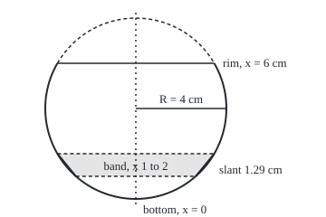

# Surface area: why a slanted strip needs the slant length

[Syllabus](../../../SYLLABUS.md) → [Calculus and analysis](../../../SYLLABUS.md#w06) → [Curves and Solids](../../../SYLLABUS.md#w06-s05) → Surface area

---

## General Overview

A glassworks silver-plates the outside of a wine glass's bowl. The bowl is the lower 6 cm of a ball of radius 4 cm, with a rim 3.464102 cm from the centre line. The plating is 0.002 cm thick; silver weighs 10.49 g per cm^3. How much silver does one glass take?

Thickness times area gives the silver's volume, so the question is the bowl's area. The bowl is a curve spun round an axis: its side profile turned a full circle about the centre line. Cut it into thin rings, like a barrel's hoops. Each ring's area is its circumference times its width. The catch is which width: measured up the glass, a ring is thinner than measured along the curved wall, and silver covers the wall.

The answer is 150.796447 cm^2 of bowl, 0.301593 cm^3 of silver, 3.1637 g per glass. The same method gives a whole ball's area, 4 pi R^2 for radius R, which Archimedes found by other means.

**Spin a curve round an axis and its surface area is the sum of thin rings, each one circumference times its slant length, and the slant length is the arc-length element, not the step along the axis.**

**What kind of fact this is:** a theorem, proved on this card in Why it works, for surfaces measured by thin cone-shaped bands; the sphere's area is a worked case of it.

### The picture: the bowl and one band

<p align="center"></p>

Drawn to scale, 1 cm = 25 units. Dotted: the axis. Dashed arc: the ball above the rim. Shaded: one band seen edge-on, whose slanted edges are the width the silver covers.

---

## The formula

Let $x$ be the height above the bowl's bottom, in cm, and $f(x)$ the profile's radius there. The slope $f'(x)$ is the rate of radius per unit of height, as on [Arc length](02-arc-length.md). Spin the profile from height $a$ to height $b$ once round the axis. The area swept is

$$S = \int_a^b 2\pi f(x)\sqrt{1 + f'(x)^2}\,dx$$

**Read it aloud:** add up, along the axis, each height's circumference times the wall's slant length there.

The factor $\sqrt{1 + f'(x)^2}\,dx$ is the arc-length element: the length of wall over an axial step $dx$. For the bowl, $f(x) = \sqrt{8x - x^2}$, the circle of radius 4 cm with its lowest point at height 0.

For a ball of radius $R$ cut to a height $h$, it comes out as

$$S = 2\pi R h, \qquad \text{and for the whole ball, } h = 2R: \quad S = 4\pi R^2.$$

**Read it aloud:** a slice of a ball has the area of a straight tube of the ball's radius and the slice's height.

| Symbol | Plain meaning | In our example | Push it up and the answer… |
| --- | --- | --- | --- |
| $x$, $dx$ | height above the bowl's bottom, and a small step in it | 0 to 6 cm | — |
| $f$ | the radius of the profile at height $x$ | $\sqrt{8x - x^2}$ cm; 3.872983 cm at $x = 3$ | wider rings, more area |
| $f'$ | slope: cm of radius per cm of height | 0.258199 at $x = 3$ | a longer slant, more area |
| $a$, $b$ | heights where the spun piece starts and stops | 0 and 6 cm | a taller piece, more area |
| $S$ | area of the spun surface, cm^2 | 150.796447 cm^2 | more silver |
| $R$, $h$ | the ball's radius, and the height of the slice | 4 cm, 6 cm | area grows in step with each |
| $r_1$, $r_2$, $\ell$, $L$ | a band's edge radii and slant width; $L$ a full cone's slant | 2.6458, 3.4641, 1.2922 cm | a bigger band |
| $n$, $i$, $c_i$, $w$, $K$ | band count, one band, a point in it, widest band, steepest slope | 6 to 6000 bands | a closer total |

### When it holds

- **The radius is never negative.** A profile below the axis must use its distance, or that part cancels real area: What breaks shows 79.97 cm^2 counted as 0.
- **The slope is continuous.** A sharp corner: split there and add the pieces.
- **The slope stays finite at the ends,** or the integral is taken as a limit. The bowl's wall lies flat at its bottom, so its radius changes infinitely fast per unit of height there; Step 5 takes that limit.
- **One full turn about a straight axis the profile does not cross.** Half a turn gives half the area; a crossing profile sweeps some wall twice.

---

## Why it works

### Step 0: the silver covers the wall, and the wall is slanted

A thin ring of the bowl is nearly a strip of a cone. Its width is the wall it spans, longer than the height step whenever the wall leans.

### Step 1: one straight segment, spun, sweeps a band of area pi (r1 + r2) times slant

Join two points of the profile with a straight chord. Spun, it sweeps a **frustum**: a cone with its tip cut off, a lampshade. With edge radii $r_1$ and $r_2$ and slant width $\ell$, its area is

$$\pi\,(r_1 + r_2)\,\ell,$$

the average edge circumference times the slant.

<details>
<summary>The algebra behind this, if you want it</summary>

A cone of base radius $r_2$ and slant $L$ unrolls to a sector of radius $L$ and arc $2\pi r_2$, area $\pi r_2 L$. Extend the frustum to such a cone; the removed tip has slant $L - \ell$. Similar triangles give $r_1 / (L - \ell) = r_2 / L$ (taking $r_2 > r_1$), so $r_2 (L - \ell) = r_1 L$. The frustum's area is $\pi r_2 L - \pi r_1 (L - \ell) = \pi (r_2 - r_1) L + \pi r_1 \ell$, and $(r_2 - r_1) L = r_2 \ell$ from the similar triangles, which gives $\pi (r_1 + r_2)\ell$. Equal radii give a cylinder, $2\pi r_1 \ell$: the same formula.

</details>

### Step 2: the slant is the height step times the arc-length factor

The chord rises $\Delta x$ along the axis while the radius changes by $r_2 - r_1$. Pythagoras gives

$$\ell = \sqrt{\Delta x^2 + (r_2 - r_1)^2} = \Delta x\,\sqrt{1 + \left(\frac{r_2 - r_1}{\Delta x}\right)^2}.$$

The ratio inside is the chord's slope. The bowl's band from $x = 1$ to $x = 2$ has radii 2.6458 and 3.4641 cm and slant 1.2922 cm, not 1 cm; its area is 24.8027 cm^2. That centimetre of bowl truly has 25.1327 cm^2 (Step 4): the chord cuts inside the curve.

### Step 3: many thin bands, and the limit is the integral

Cut the profile into equal height steps and add the bands. Six bands fall short of 150.796447 cm^2 by 2.814318; 6000 bands by 0.000006.

As the steps thin, the chord's slope equals the profile's slope $f'(x)$ at some height inside the step (the mean value theorem: a point where the curve's slope equals the chord's), and the average radius approaches $f(x)$ at that height. So each band tends to $2\pi f(x)\sqrt{1 + f'(x)^2}\,\Delta x$, and the sum of those is a Riemann sum whose limit is the integral.

<details>
<summary>Detailed proof</summary>

Let $f \ge 0$ with $f'$ continuous on $[a, b]$, split into steps of width at most $w$. On step $i$ the mean value theorem gives $c_i$ with chord slope $f'(c_i)$, so the band's slant is $\sqrt{1 + f'(c_i)^2}\,\Delta x_i$. On a closed interval, $|f'| \le K$ for some $K$, and $f$ is uniformly continuous: for every $\varepsilon > 0$ some $\delta > 0$ makes $w < \delta$ put both edge radii within $\varepsilon$ of $f(c_i)$. The band sum then differs from $\sum_i 2\pi f(c_i)\sqrt{1 + f'(c_i)^2}\,\Delta x_i$ by at most $2\pi\varepsilon\sqrt{1 + K^2}\,(b - a)$, and that sum is a Riemann sum of a continuous function, tending to the integral as $w \to 0$.

</details>

### Step 4: on a ball, radius times slant factor is the ball's radius

For the bowl, $f(x) = \sqrt{8x - x^2}$ and the slope is $f'(x) = (4 - x)/f(x)$. Multiply the radius by the slant factor:

$$f\sqrt{1 + f'^2} = \sqrt{f^2 + (4 - x)^2} = \sqrt{8x - x^2 + 16 - 8x + x^2} = 4.$$

The product is 4, the ball's radius, at every height. Low down the ring is small but the wall nearly flat, so a height step spans a long stretch of wall; higher up the ring is wide and the wall nearly upright. The two cancel exactly, so

$$S = \int_0^6 2\pi \cdot 4\,dx = 2\pi \cdot 4 \cdot 6 = 48\pi = 150.796447 \text{ cm}^2.$$

For any radius $R$ the product is $R$. A slice of height $h$ has area $2\pi R h$; the whole ball, $h = 2R$, has $4\pi R^2$, 201.061930 cm^2 here. This is Archimedes' result: a ball has the area of the tube that fits round it, ends excluded.

### Step 5: the steep bottom is a limit, played with numbers

At $x = 0$ the slope is infinite, so the hypothesis fails at that end. Start a little way up and slide the start down. Starting 0.01 cm up loses 0.251327 cm^2. To lose less than 0.01 cm^2, start below 0.000398 cm. Any tolerance can be met this way, so the limit is 150.796447 cm^2.

A second road measures tiny patches of the surface, located by height and angle round the axis: Surface area.

---

## Worked numbers, by hand

| Step | Arithmetic | Value |
| --- | --- | --- |
| radius at $x = 3$ | $\sqrt{8 \cdot 3 - 3^2} = \sqrt{15}$ | 3.872983 cm |
| slope at $x = 3$ | $(4 - 3) / 3.872983$ | 0.258199 |
| slant factor | $\sqrt{1 + 0.258199^2} = \sqrt{16/15}$ | 1.032796 |
| radius times slant factor | $3.872983 \times 1.032796$ | 4.000000 cm |
| area per cm of height | $2\pi \times 4$ | 25.1327 cm^2 |
| bowl, 6 cm tall | $25.1327 \times 6 = 48\pi$ | **150.796447 cm^2** |
| silver, 0.002 cm thick | $150.796447 \times 0.002$ | 0.301593 cm^3 |
| its weight | $0.301593 \times 10.49$ | **3.1637 g** |

Each glass takes just over 3 g of silver on its bowl, stem and foot aside.

### What breaks if you drop a piece

| Mistake | Comes out at | What went wrong |
| --- | --- | --- |
| Height step as the band's width | 127.04 cm^2 | Slant factor dropped |
| Disc formula, pi times radius squared | 226.19, in cm^3 | Sums volume, not skin |
| The whole ball's 4 pi R^2 | 201.061930 cm^2 | Counts the ball above the rim |
| Profile crinkled by 0.01 cm | 172.94 cm^2 | Close radii, far slopes |
| Signed radius $x - 3$ from 0 to 6, crossing the axis | 0.00, not 79.97 cm^2 | Negative radius cancels real area |

The crinkled profile is $f(x) + 0.01\sin(100x)$: never more than 0.01 cm from the bowl, yet its steep ripples add area. The line $x - 3$ drops the hypothesis that the radius is never negative: its two cones cancel instead of adding. The code prints all five.

---

## Code, from first principles, and it actually runs

Pi is built from a polygon. Road one: a difference quotient confirms radius times slant factor is 4, then $2\pi R h$. Road two uses no slope: chord bands, 6 to 6000, with the shortfall closing. A second case runs the whole ball.

### Python

```python
# Surface area of revolution -- the check behind the card.  Standard library
# only; math.sqrt and math.sin are the only primitives used.  The glass's bowl
# is the lower 6 cm of a ball of radius 4 cm: at height x above the bottom its
# radius is f(x) = sqrt(8x - x^2).  Road one: the formula, S = 2 pi R h.
# Road two: bands swept by chords, with no derivative anywhere.
import math

sides, s = 6, 1.0                           # Archimedes: a hexagon in a unit circle,
for _ in range(26):                         # its side count doubled 26 times
    s, sides = s / math.sqrt(2 + math.sqrt(4 - s * s)), sides * 2
PI = sides * s / 2                          # half the polygon's perimeter
R, H = 4.0, 6.0                             # ball radius and bowl height, cm

def f(x):
    return math.sqrt(max(8 * x - x * x, 0.0))

def bands(g, a, b, n, slant=True):          # n frustums, each pi (r1 + r2) times its width
    total, w = 0.0, (b - a) / n
    for k in range(n):
        x0, x1 = a + k * w, a + (k + 1) * w
        run = math.sqrt(w * w + (g(x1) - g(x0)) ** 2) if slant else w
        total += PI * (g(x0) + g(x1)) * run
    return total

def dq(g, x, h=1e-5):                       # a shrinking difference quotient for g'
    return (g(x + h) - g(x - h)) / (2 * h)

exact, ball = 2 * PI * R * H, 2 * PI * R * (2 * R)
print(f"pi, from a {sides}-sided polygon: {PI:.12f}")
print(f"bowl: R = {R:g} cm, h = {H:g} cm, rim radius {f(H):.6f} cm")
factors = []
for x in (1, 3, 5):
    k = math.sqrt(1 + dq(f, x) ** 2)
    factors.append(f(x) * k)
    print(f"x = {x}: radius {f(x):.6f}, slope {dq(f, x):.6f}, slant factor {k:.6f}, product {factors[-1]:.6f}")
print(f"road one, 2 pi R h: bowl {exact:.6f}, whole ball {ball:.6f}")
errs = []
for n in (6, 60, 600, 6000):
    errs.append(exact - bands(f, 0, H, n))
    print(f"road two, {n:4d} bands: {exact - errs[-1]:.6f}, short by {errs[-1]:.6f}")
ball2 = bands(f, 0, 2 * R, 6000)
print(f"road two, whole ball, 6000 bands: {ball2:.6f}")
print(f"one band, x 1 to 2: radii {f(1):.4f} and {f(2):.4f}, slant {math.sqrt(1 + (f(2) - f(1)) ** 2):.4f}, "
      f"area {bands(f, 1, 2, 1):.4f}, exact {2 * PI * R:.4f}")
print(f"pole: start 0.01 cm up, lose {2 * PI * R * 0.01:.6f}; to lose under 0.01, start below {0.01 / (2 * PI * R):.6f}")
print(f"silver 0.002 cm thick at 10.49 g per cm^3: {exact * 0.002:.6f} cm^3, {exact * 0.002 * 10.49:.4f} g")
print(f"figure, 25 per cm: centre (150, 120), band ({150 + 25 * f(1):.2f}, 195) to "
      f"({150 + 25 * f(2):.2f}, 170), rim ({150 - 25 * f(H):.2f} to {150 + 25 * f(H):.2f}, 70)")
w = H / 6000
disc = sum(PI * f((k + 0.5) * w) ** 2 * w for k in range(6000))
print(f"mistake, width not slant: {bands(f, 0, H, 60000, slant=False):.2f}")
print(f"mistake, disc formula pi f^2 (a volume, cm^3): {disc:.2f}")
print(f"mistake, crinkled within 0.01 cm: {bands(lambda x: f(x) + 0.01 * math.sin(100 * x), 0, H, 60000):.2f}")
print(f"mistake, signed radius x - 3 on 0 to 6: {round(bands(lambda x: x - 3, 0, 6, 6), 2) + 0.0:.2f}, true {bands(lambda x: abs(x - 3), 0, 6, 6):.2f}")
assert abs(exact - bands(f, 0, H, 6000)) < 1e-3               # road two meets road one
assert all(a > b > 0 for a, b in zip(errs, errs[1:]))          # and closes in from below
assert abs(ball2 - 4 * PI * R * R) < 1e-3                       # the sphere, 4 pi R^2
assert all(abs(p - R) < 1e-6 for p in factors)                  # radius x slant factor = R
print("ALL CHECKS PASS")
```

**Ran 2026-09-27 on macOS, Python 3.14.6, standard library only. All checks passed. Output, pasted from the run:**

```
pi, from a 402653184-sided polygon: 3.141592653590
bowl: R = 4 cm, h = 6 cm, rim radius 3.464102 cm
x = 1: radius 2.645751, slope 1.133893, slant factor 1.511858, product 4.000000
x = 3: radius 3.872983, slope 0.258199, slant factor 1.032796, product 4.000000
x = 5: radius 3.872983, slope -0.258199, slant factor 1.032796, product 4.000000
road one, 2 pi R h: bowl 150.796447, whole ball 201.061930
road two,    6 bands: 147.982130, short by 2.814318
road two,   60 bands: 150.759254, short by 0.037193
road two,  600 bands: 150.795985, short by 0.000462
road two, 6000 bands: 150.796442, short by 0.000006
road two, whole ball, 6000 bands: 201.061912
one band, x 1 to 2: radii 2.6458 and 3.4641, slant 1.2922, area 24.8027, exact 25.1327
pole: start 0.01 cm up, lose 0.251327; to lose under 0.01, start below 0.000398
silver 0.002 cm thick at 10.49 g per cm^3: 0.301593 cm^3, 3.1637 g
figure, 25 per cm: centre (150, 120), band (216.14, 195) to (236.60, 170), rim (63.40 to 236.60, 70)
mistake, width not slant: 127.04
mistake, disc formula pi f^2 (a volume, cm^3): 226.19
mistake, crinkled within 0.01 cm: 172.94
mistake, signed radius x - 3 on 0 to 6: 0.00, true 79.97
ALL CHECKS PASS
```

### Rust

```rust
// Surface area of revolution -- the same check as the Python, in Rust, std only.
// The glass's bowl is the lower 6 cm of a ball of radius 4 cm: at height x above
// the bottom its radius is f(x) = sqrt(8x - x^2).  Road one: S = 2 pi R h.
// Road two: bands swept by chords, with no derivative anywhere.

fn f(x: f64) -> f64 {
    (8.0 * x - x * x).max(0.0).sqrt()
}

// n frustums, each pi (r1 + r2) times its width (slant, or axial if slant is false)
fn bands(pi: f64, g: &dyn Fn(f64) -> f64, a: f64, b: f64, n: usize, slant: bool) -> f64 {
    let w = (b - a) / n as f64;
    let mut total = 0.0;
    for k in 0..n {
        let (x0, x1) = (a + k as f64 * w, a + (k + 1) as f64 * w);
        let run = if slant { (w * w + (g(x1) - g(x0)).powi(2)).sqrt() } else { w };
        total += pi * (g(x0) + g(x1)) * run;
    }
    total
}

// a shrinking difference quotient for g'
fn dq(g: &dyn Fn(f64) -> f64, x: f64) -> f64 {
    let h = 1e-5;
    (g(x + h) - g(x - h)) / (2.0 * h)
}

fn main() {
    let (mut sides, mut s) = (6u64, 1.0f64); // Archimedes: a hexagon in a unit circle
    for _ in 0..26 {
        s = s / (2.0 + (4.0 - s * s).sqrt()).sqrt();
        sides *= 2;
    }
    let pi = sides as f64 * s / 2.0; // half the polygon's perimeter
    let (r, h) = (4.0f64, 6.0f64); // ball radius and bowl height, cm
    let exact = 2.0 * pi * r * h;
    let ball = 2.0 * pi * r * (2.0 * r);
    println!("pi, from a {}-sided polygon: {:.12}", sides, pi);
    println!("bowl: R = {} cm, h = {} cm, rim radius {:.6} cm", r, h, f(h));
    let mut factors = Vec::new();
    for x in [1.0, 3.0, 5.0] {
        let k = (1.0 + dq(&f, x).powi(2)).sqrt();
        factors.push(f(x) * k);
        println!("x = {}: radius {:.6}, slope {:.6}, slant factor {:.6}, product {:.6}", x, f(x), dq(&f, x), k, f(x) * k);
    }
    println!("road one, 2 pi R h: bowl {:.6}, whole ball {:.6}", exact, ball);
    let mut errs = Vec::new();
    for n in [6usize, 60, 600, 6000] {
        errs.push(exact - bands(pi, &f, 0.0, h, n, true));
        let e = errs[errs.len() - 1];
        println!("road two, {:4} bands: {:.6}, short by {:.6}", n, exact - e, e);
    }
    let ball2 = bands(pi, &f, 0.0, 2.0 * r, 6000, true);
    println!("road two, whole ball, 6000 bands: {:.6}", ball2);
    println!("one band, x 1 to 2: radii {:.4} and {:.4}, slant {:.4}, area {:.4}, exact {:.4}",
        f(1.0), f(2.0), (1.0 + (f(2.0) - f(1.0)).powi(2)).sqrt(), bands(pi, &f, 1.0, 2.0, 1, true), 2.0 * pi * r);
    println!("pole: start 0.01 cm up, lose {:.6}; to lose under 0.01, start below {:.6}",
        2.0 * pi * r * 0.01, 0.01 / (2.0 * pi * r));
    println!("silver 0.002 cm thick at 10.49 g per cm^3: {:.6} cm^3, {:.4} g", exact * 0.002, exact * 0.002 * 10.49);
    println!("figure, 25 per cm: centre (150, 120), band ({:.2}, 195) to ({:.2}, 170), rim ({:.2} to {:.2}, 70)",
        150.0 + 25.0 * f(1.0), 150.0 + 25.0 * f(2.0), 150.0 - 25.0 * f(h), 150.0 + 25.0 * f(h));
    let w = h / 6000.0;
    let disc: f64 = (0..6000).map(|k| pi * f((k as f64 + 0.5) * w).powi(2) * w).sum();
    let crinkle = |x: f64| f(x) + 0.01 * (100.0 * x).sin();
    println!("mistake, width not slant: {:.2}", bands(pi, &f, 0.0, h, 60000, false));
    println!("mistake, disc formula pi f^2 (a volume, cm^3): {:.2}", disc);
    println!("mistake, crinkled within 0.01 cm: {:.2}", bands(pi, &crinkle, 0.0, h, 60000, true));
    let signed = bands(pi, &|x: f64| x - 3.0, 0.0, 6.0, 6, true);
    println!("mistake, signed radius x - 3 on 0 to 6: {:.2}, true {:.2}",
        (signed * 100.0).round() / 100.0 + 0.0, bands(pi, &|x: f64| (x - 3.0).abs(), 0.0, 6.0, 6, true));
    assert!((exact - bands(pi, &f, 0.0, h, 6000, true)).abs() < 1e-3); // road two meets road one
    assert!(errs.windows(2).all(|p| p[0] > p[1] && p[1] > 0.0)); // and closes in from below
    assert!((ball2 - 4.0 * pi * r * r).abs() < 1e-3); // the sphere, 4 pi R^2
    assert!(factors.iter().all(|p| (p - r).abs() < 1e-6)); // radius x slant factor = R
    println!("ALL CHECKS PASS");
}
```

**Ran 2026-09-27 on macOS, rustc 1.98.1, no crates. All checks passed. Output, pasted from the run:**

```
pi, from a 402653184-sided polygon: 3.141592653590
bowl: R = 4 cm, h = 6 cm, rim radius 3.464102 cm
x = 1: radius 2.645751, slope 1.133893, slant factor 1.511858, product 4.000000
x = 3: radius 3.872983, slope 0.258199, slant factor 1.032796, product 4.000000
x = 5: radius 3.872983, slope -0.258199, slant factor 1.032796, product 4.000000
road one, 2 pi R h: bowl 150.796447, whole ball 201.061930
road two,    6 bands: 147.982130, short by 2.814318
road two,   60 bands: 150.759254, short by 0.037193
road two,  600 bands: 150.795985, short by 0.000462
road two, 6000 bands: 150.796442, short by 0.000006
road two, whole ball, 6000 bands: 201.061912
one band, x 1 to 2: radii 2.6458 and 3.4641, slant 1.2922, area 24.8027, exact 25.1327
pole: start 0.01 cm up, lose 0.251327; to lose under 0.01, start below 0.000398
silver 0.002 cm thick at 10.49 g per cm^3: 0.301593 cm^3, 3.1637 g
figure, 25 per cm: centre (150, 120), band (216.14, 195) to (236.60, 170), rim (63.40 to 236.60, 70)
mistake, width not slant: 127.04
mistake, disc formula pi f^2 (a volume, cm^3): 226.19
mistake, crinkled within 0.01 cm: 172.94
mistake, signed radius x - 3 on 0 to 6: 0.00, true 79.97
ALL CHECKS PASS
```

The two outputs are identical.

> [!TIP]
> **Try changing**
> - **Guess first:** raise the bowl height `H` from 6 to 8, the whole ball. The area becomes 201.061930 cm^2, since $2\pi R h$ grows in step with $h$.
> - **Guess first:** change 6000 to 6 in the first assert. The chords sit inside the curve, so the total is 147.982130 cm^2, short by 2.81, and the assert fails.
> - **Guess first:** add `slant=False` to the band call in the first assert. It then meets 127.04 cm^2 and fails.

---

## The usual mistake

> [!warning]
> **Multiplying circumference by the height step.** The volume formula does that with a disc, so it feels natural. But a disc's thickness lies along the axis; a wall's width lies along the wall. On the bowl this gives 127.04 cm^2, well short, and the error grows with the slope.
>
> - **Squaring the radius out of habit.** $\pi f(x)^2$ sums slices of volume: 226.19 cm^3 for this bowl, a quantity in different units.
> - **Adding lids.** The formula measures the spun wall only; a closed container adds its end discs separately.

---

## Where you meet it in real life

- **Plating and paint.** A turned object's coating is its spun area times a thickness: 3.1637 g of silver for this bowl.
- **Heat loss.** A flask loses heat through its skin, so its area sets the rate; its capacity is [Volumes](03-volumes-by-slices-and-shells.md).
- **Pappus's rule.** A spun area equals the profile's length times the distance its centre of mass travels: [Centre of mass](05-centre-of-mass-and-pappus.md).

> **Say it back**
> A spun curve's area is a stack of thin rings, each circumference times width along the wall, and that width is the height step times the arc-length factor. On a ball, radius times slant factor is the ball's radius, so a slice has area 2 pi R h.

---

## What this builds on

- [Arc length](02-arc-length.md): the slant factor $\sqrt{1 + f'(x)^2}$ and the chord-to-limit argument used here for the wall's width.

## Where this goes next

- Surface area: area for any curved surface, not only one spun round an axis.

---

## Sources

Verified 2026-09-27: every link below resolves to the publisher's page.

- Strang, Gilbert, Edwin Herman, et al. *Calculus Volume 2*, OpenStax, 2016. [Section 2.4, Arc Length of a Curve and Surface Area](https://openstax.org/books/calculus-volume-2/pages/2-4-arc-length-of-a-curve-and-surface-area). The frustum derivation and the integral.
- O'Connor, J. J., and E. F. Robertson. "Archimedes." MacTutor History of Mathematics, University of St Andrews. [Biography](https://mathshistory.st-andrews.ac.uk/Biographies/Archimedes/). *On the Sphere and Cylinder*, and the result he wanted on his tomb.
