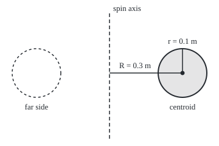
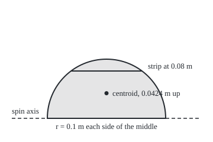

# Centre of mass: where a shape balances, and the trick that gives volumes from a balance point

[Syllabus](../../../SYLLABUS.md) → [Calculus and analysis](../../../SYLLABUS.md#w06) → [Curves and Solids](../../../SYLLABUS.md#w06-s05) → Centre of mass

---

## General Overview

A swim ring is a tube bent into a loop. Cut through the tube and the cut face is a circle of radius 0.1 m, its middle 0.3 m from the ring's centre line. How much air does the ring hold?

The ring is what a circle sweeps when it swings once round a line: a **torus** (the doughnut shape). Slicing it into rings finds its volume, through an integral with a square root in it. There is a shorter road. Cut the circle out of card and it balances on a pin at its middle. Swing the circle round the line and that point travels a path 1.885 m long. The circle's area, 0.0314 m^2, times that path is 0.0592 m^3: 59.2 litres.

The balance point of a flat shape is its **centroid**, the term used from here on. For a circle it is the middle. For most shapes an integral finds it. The rule that turns a centroid into a volume is **Pappus's theorem**, from Pappus of Alexandria around 340 AD.

**The centroid is the average position of a shape's area; spin the shape round a line it does not cross, and the solid's volume is the area times the distance the centroid travels.**

**What kind of fact this is:** the centroid is a definition; Pappus's theorem is a theorem, proved on this card in Why it works.

### The picture: the swim ring cut in half

<p align="center"></p>

Scale 1 m = 400 units. Shaded: the tube's cut face. Dashed: the same face half a turn later. The dot, the centroid, travels a circle of radius 0.3 m.

---

## The formula

Slice a flat region beside the axis into thin strips parallel to it. The strip at distance $x$ has height $h(x)$. Weight each strip's area by its distance, add, and divide by the total area: that is the centroid's distance, written $\bar{x}$, read "x bar".

$$\bar{x} = \frac{\int_a^b x\,h(x)\,dx}{\int_a^b h(x)\,dx} = \frac{M}{A}$$

**Read it aloud:** the centroid's distance is the strips' distances averaged, each strip counting in proportion to its area.

The top integral is the **moment** $M$: area weighted by distance. The bottom is the area $A$. Then Pappus:

$$V = A \times 2\pi\bar{x}$$

**Read it aloud:** the volume swept out is the area times the length of the circle the centroid runs round.

For the swim ring, $A$ is the circle's area and $\bar{x} = R$, so

$$V = \pi r^2 \times 2\pi R = 2\pi^2 R r^2$$

| Symbol | Plain meaning | In our example | Push it up and the answer… |
| --- | --- | --- | --- |
| $x$, $y$, $a$, $b$ | distance from the axis; height; the region's nearest and farthest distance | $a$ = 0.2 m, $b$ = 0.4 m | — |
| $h(x)$ | height of the strip at distance $x$ | $2\sqrt{r^2 - (x-R)^2}$ | more area, more volume |
| $A$, $M$ | area; moment, the area weighted by distance | 0.0314159 m^2; 0.00942478 m^3 | — |
| $\bar{x}$, $\bar{y}$ | the centroid's distance from the axis, or up from an edge | 0.3 m; 0.042441 m for the half-disc | volume grows in proportion |
| $R$, $r$ | tube centre's distance from the axis; tube radius | 0.3 m, 0.1 m | $V$ grows as $R$, and as $r$ squared |
| $V$ | the volume swept out in one full turn | 59.2176 litres | — |
| $n$, $x_k$, $A_k$, $M_k$, $V_k$, $\varepsilon$ | proof only: strip count; a strip's edge, area, moment, swept volume; allowed error | — | — |

A **centre of mass** weights each piece by mass instead of area ([Averages, mass and work](../04-Integrals/09-average-value-mass-and-work.md)); for a sheet of even thickness the two coincide.

### When it holds

- **The region lies on one side of the axis.** Touching is fine; crossing is not. With the tube's middle 0.05 m out, Pappus says 9.8696 L and the solid holds 10.6608 L: the part beyond the axis counts with a negative distance and subtracts volume that is there.
- **The region is flat and the axis lies in its plane.** Tilted out of the plane, it sweeps a different solid.
- **A full turn.** A quarter turn sweeps a quarter: area times the centroid's arc.
- **The centroid of the area.** The middle of the boundary, or the balance point of an unevenly thick plate, can give the wrong distance.

---

## Why it works

### Step 0: a strip sweeps a shell, and the shell is area times path

Take one thin rectangle of height $h$, standing between distance $x$ and $x + \Delta x$ from the axis, where $\Delta x$ is a small step. Spun once round, it sweeps a hollow cylinder. Its volume is a big disc minus a small one, times the height: $\pi\left((x+\Delta x)^2 - x^2\right)h$. That expands to $2\pi\left(x + \tfrac{1}{2}\Delta x\right)h\,\Delta x$: the rectangle's area, $h\,\Delta x$, times the length of the circle its own middle travels. For one strip, Pappus is exact.

### Step 1: add the strips

Add the shells of many thin strips. As they thin, the sum becomes the shell-method integral ([Volumes](03-volumes-by-slices-and-shells.md)):

$$V = \int_a^b 2\pi x\,h(x)\,dx$$

### Step 2: pull out the constant, and the moment appears

The $2\pi$ is the same for every strip, so it comes outside: $V = 2\pi \int_a^b x\,h(x)\,dx = 2\pi M$. The volume depends on the region only through its moment.

### Step 3: the moment is area times centroid

By the definition of the centroid, $M = A\bar{x}$, so $V = A \times 2\pi\bar{x}$. Every strip travels its own circle; the centroid is the one distance whose circle, times the whole area, gives the same total.

<details>
<summary>Detailed proof</summary>

Cut the distances from $a$ to $b$ into $n$ strips of width $\Delta x = (b-a)/n$. Strip k runs from $x_{k-1}$ to $x_k$ and holds area $A_k$ of the region. At any height, the solid it sweeps is cut in flat rings between radii $p < q$ inside that range, of area $\pi(q^2 - p^2) = 2\pi\tfrac{p+q}{2}(q-p)$, between $2\pi x_{k-1}(q-p)$ and $2\pi x_k(q-p)$. The widths $q - p$, integrated over height, give $A_k$. So the swept volume $V_k$ lies between $2\pi x_{k-1}A_k$ and $2\pi x_k A_k$, and the moment $M_k$ between $x_{k-1}A_k$ and $x_k A_k$: $V_k$ and $2\pi M_k$ differ by at most $2\pi\,\Delta x\,A_k$.

On one side of the axis, different strips sweep separate solids, so $V = \sum V_k$ and $M = \sum M_k$, and $V$ and $2\pi M$ differ by at most $2\pi(b-a)A/n$. For any $\varepsilon > 0$, an $n$ above $2\pi(b-a)A/\varepsilon$ pushes that below $\varepsilon$; a fixed gap below every $\varepsilon$ is zero. So $V = 2\pi M = A \times 2\pi\bar{x}$. Across the axis, the two sides' solids overlap and the sum fails: the swim ring at 0.05 m.

</details>

### Step 4: the circle's centroid is its middle

For the tube, two strips the same distance either side of $R$ have the same height. Their moments add to $2R$ times one strip's area, so the whole moment is $R$ times the whole area, and $\bar{x} = R = 0.3$ m. The code finds 0.300000 m by integration, without being told.

### Step 5: a centroid that is not in the middle

A half-disc of radius $r = 0.1$ m, flat edge down, has no symmetry upward. At height $y$ its strip is $2\sqrt{r^2 - y^2}$ wide. Its moment about the flat edge is

$$M = \int_0^r y \cdot 2\sqrt{r^2 - y^2}\,dy = \left[-\tfrac{2}{3}\left(r^2 - y^2\right)^{3/2}\right]_0^r = \tfrac{2}{3}r^3$$

Differentiating the antiderivative returns $2y\sqrt{r^2-y^2}$, which checks it. The moment is 0.000666667 m^3; the area, half the disc, is 0.0157080 m^2. So $\bar{y} = M/A = 4r/(3\pi) = 0.042441$ m: below halfway, 0.05 m, because the wide strips sit low.

### The picture: the half-disc and one strip

<p align="center"></p>

Scale 1 m = 1000 units. The strip 0.08 m up reaches 0.06 m each side of the middle; lower strips are wider.

Spun round its flat edge, the half-disc sweeps a ball of radius 0.1 m. Pappus gives 0.0157080 m^2 × 2π × 0.042441 m = 4.1888 litres, which is the ball formula $\tfrac{4}{3}\pi r^3$. Run backwards, the same line finds the centroid from the ball's known volume.

The other road stacks washers (flat rings) along the axis and never mentions a centroid ([Volumes](03-volumes-by-slices-and-shells.md)); the code takes it. Spinning a curve gives surface area the same way, length times path ([Surface area](04-surface-area-of-revolution.md)).

---

## Worked numbers, by hand

| Step | Arithmetic | Value |
| --- | --- | --- |
| tube cross-section | π × 0.1^2 | 0.0314159 m^2 |
| centroid, by symmetry | the middle of the circle | 0.3 m |
| centroid's path | 2 × π × 0.3 | 1.884956 m |
| volume, Pappus | 0.0314159 × 1.884956 | 0.0592176 m^3 |
| in litres | × 1000 | **59.2176 L** |
| half-disc moment | 2 × 0.1^3 ÷ 3 | 0.000666667 m^3 |
| half-disc centroid | 0.000666667 ÷ 0.0157080 | 0.042441 m |
| ball, Pappus | 0.0157080 × 2π × 0.042441, × 1000 | **4.1888 L** |

The ring holds about 59 litres of air, and no square root was integrated to find it.

### What breaks if you drop a piece

| Mistake | Comes out at | What went wrong |
| --- | --- | --- |
| Outer edge, 0.4 m, as the distance | 78.9568 L | the rim travels farther than the average piece |
| Inner edge, 0.2 m, as the distance | 39.4784 L | the rim travels less far than the average |
| Half-disc centroid taken halfway up, 0.05 m | 4.9348 L, not 4.1888 L | wide strips sit low |
| Circle crossing the axis, centre 0.05 m out | Pappus 9.8696 L, solid 10.6608 L | the far side counts negative |

---

## Code, from first principles, and it actually runs

Two roads to the swim ring. Road one integrates area and moment with its own Simpson sum (strips weighted 1, 4, 2, 4, …, 1), divides for the centroid, and applies Pappus. Road two stacks washers and never finds a centroid; its error is printed as the panels multiply. The half-disc checks a centroid against its antiderivative and the ball formula.

### Python

```python
# Centre of mass and Pappus -- the check behind the card.  Standard library
# only: math gives sqrt and pi, and every integral is this file's own Simpson
# sum.  A swim ring's tube is a circle of radius r = 0.1 m whose centre sits
# R = 0.3 m from the axis it spins round.  Metres in, litres out.
import math
R, r, L, N = 0.3, 0.1, 1000.0, 20000        # L: litres per m^3; N: panels

def simpson(f, a, b, n):                    # n even panels, weights 1 4 2 4 ... 4 1
    h = (b - a) / n
    s = f(a) + f(b) + sum((4 if k % 2 else 2) * f(a + k * h) for k in range(1, n))
    return s * h / 3

def w(y):                                   # half-chord of the tube circle at offset y
    return math.sqrt(max(r * r - y * y, 0.0))

def washers(c, n):                          # road two: rings stacked along the axis
    return simpson(lambda y: math.pi * ((c + w(y)) ** 2 - max(c - w(y), 0.0) ** 2), -r, r, n)

area = simpson(lambda x: 2 * w(x - R), R - r, R + r, N)          # vertical strips
xbar = simpson(lambda x: x * 2 * w(x - R), R - r, R + r, N) / area
pappus = area * 2 * math.pi * xbar                                  # road one
exact = 2 * math.pi ** 2 * R * r * r
half = simpson(lambda y: 2 * w(y), 0, r, N)                      # half-disc, flat side down
moment = simpson(lambda y: y * 2 * w(y), 0, r, N)                  # strips times their height
ybar = moment / half
sphere = half * 2 * math.pi * ybar
c = 0.05                                                            # axis cuts the circle
cross_pappus, cross_true = area * 2 * math.pi * c, washers(c, N)

print(f"swim ring: tube radius r = {r} m, {2 * r:.1f} m across, centre R = {R} m from the axis, "
      f"strips from a = {R - r:.1f} m to b = {R + r:.1f} m")
print(f"area by strips {area:.7f} m^2, pi r^2 = {math.pi * r * r:.7f} m^2")
print(f"centroid by integration: xbar = {xbar:.6f} m, path 2 pi xbar = {2 * math.pi * xbar:.6f} m")
print(f"road one, Pappus: area x path = {pappus:.7f} m^3 = {pappus * L:.4f} L")
for n in (10, 100, 1000):
    v = washers(R, n)
    print(f"road two, washers, {n:4d} panels: {v * L:.4f} L, error {abs(v - exact) * L:.6f} L")
print(f"closed form 2 pi^2 R r^2 = {exact * L:.4f} L")
print(f"half-disc moment by strips {moment:.9f} m^3, antiderivative 2 r^3 / 3 = {2 * r ** 3 / 3:.9f} m^3")
print(f"half-disc: area {half:.7f} m^2, ybar = {ybar:.6f} m, 4r/(3 pi) = {4 * r / (3 * math.pi):.6f} m")
print(f"half-disc spun on its flat side, Pappus: {sphere * L:.4f} L, 4/3 pi r^3 = {4 / 3 * math.pi * r ** 3 * L:.4f} L")
print(f"mistake, outer edge R + r as the distance: {area * 2 * math.pi * (R + r) * L:.4f} L")
print(f"mistake, inner edge R - r as the distance: {area * 2 * math.pi * (R - r) * L:.4f} L")
print(f"mistake, half-disc centroid halfway up at r/2: {half * 2 * math.pi * (r / 2) * L:.4f} L")
print(f"axis through the circle, centre {c} m out: Pappus {cross_pappus * L:.4f} L, solid {cross_true * L:.4f} L")
print(f"figure, ring at 1 m = 400: axis x = 180, tube centre ({180 + 400 * R:.0f}, 120), "
      f"radius {400 * r:.0f}, mirror ({180 - 400 * R:.0f}, 120)")
print(f"figure, half-disc at 1 m = 1000: flat side y = 200, centroid y = {200 - 1000 * ybar:.2f}, "
      f"strip 0.08 m up at y = 120, half-width {w(0.08):.2f} m = {1000 * w(0.08):.2f}")
assert abs(pappus - washers(R, N)) < 1e-7          # two roads, one volume
assert abs(washers(R, N) - exact) < 1e-7           # refining sum against the closed form
assert abs(sphere - 4 / 3 * math.pi * r ** 3) < 1e-8  # Pappus against the sphere formula
assert cross_true - cross_pappus > 0.0005             # the dropped hypothesis bites
print("ALL CHECKS PASS")
```

**Ran 2026-09-27 on macOS, Python 3.14.6, standard library only. All checks passed. Output, pasted from the run:**

```
swim ring: tube radius r = 0.1 m, 0.2 m across, centre R = 0.3 m from the axis, strips from a = 0.2 m to b = 0.4 m
area by strips 0.0314159 m^2, pi r^2 = 0.0314159 m^2
centroid by integration: xbar = 0.300000 m, path 2 pi xbar = 1.884956 m
road one, Pappus: area x path = 0.0592176 m^3 = 59.2176 L
road two, washers,   10 panels: 58.4369 L, error 0.780724 L
road two, washers,  100 panels: 59.1931 L, error 0.024506 L
road two, washers, 1000 panels: 59.2169 L, error 0.000774 L
closed form 2 pi^2 R r^2 = 59.2176 L
half-disc moment by strips 0.000666667 m^3, antiderivative 2 r^3 / 3 = 0.000666667 m^3
half-disc: area 0.0157080 m^2, ybar = 0.042441 m, 4r/(3 pi) = 0.042441 m
half-disc spun on its flat side, Pappus: 4.1888 L, 4/3 pi r^3 = 4.1888 L
mistake, outer edge R + r as the distance: 78.9568 L
mistake, inner edge R - r as the distance: 39.4784 L
mistake, half-disc centroid halfway up at r/2: 4.9348 L
axis through the circle, centre 0.05 m out: Pappus 9.8696 L, solid 10.6608 L
figure, ring at 1 m = 400: axis x = 180, tube centre (300, 120), radius 40, mirror (60, 120)
figure, half-disc at 1 m = 1000: flat side y = 200, centroid y = 157.56, strip 0.08 m up at y = 120, half-width 0.06 m = 60.00
ALL CHECKS PASS
```

### Rust

Same numbers, same labels, built with `rustc --edition 2021 -O`.

```rust
// Centre of mass and Pappus -- the same check as the Python, in Rust.  No
// crates: sqrt and PI come from std, and every integral is this file's own
// Simpson sum.  A swim ring's tube is a circle of radius r = 0.1 m whose centre
// sits R = 0.3 m from the axis it spins round.  Metres in, litres out.
use std::f64::consts::PI;
const R: f64 = 0.3;
const RT: f64 = 0.1; // the tube radius r
const L: f64 = 1000.0; // litres per m^3
const N: usize = 20000; // panels

fn simpson(f: &dyn Fn(f64) -> f64, a: f64, b: f64, n: usize) -> f64 {
    let h = (b - a) / n as f64;
    let mut s = f(a) + f(b);
    for k in 1..n {
        s += if k % 2 == 1 { 4.0 } else { 2.0 } * f(a + k as f64 * h);
    }
    s * h / 3.0
}

fn w(y: f64) -> f64 { (RT * RT - y * y).max(0.0).sqrt() } // half-chord at offset y

fn washers(c: f64, n: usize) -> f64 { // road two: rings stacked along the axis
    simpson(&|y: f64| PI * ((c + w(y)).powi(2) - (c - w(y)).max(0.0).powi(2)), -RT, RT, n)
}

fn main() {
    let r = RT;
    let area = simpson(&|x: f64| 2.0 * w(x - R), R - r, R + r, N); // vertical strips
    let xbar = simpson(&|x: f64| x * 2.0 * w(x - R), R - r, R + r, N) / area;
    let pappus = area * 2.0 * PI * xbar; // road one
    let exact = 2.0 * PI * PI * R * r * r;
    let half = simpson(&|y: f64| 2.0 * w(y), 0.0, r, N); // half-disc, flat side down
    let moment = simpson(&|y: f64| y * 2.0 * w(y), 0.0, r, N);
    let ybar = moment / half;
    let sphere = half * 2.0 * PI * ybar;
    let c = 0.05; // axis cuts the circle
    let (cross_pappus, cross_true) = (area * 2.0 * PI * c, washers(c, N));

    println!("swim ring: tube radius r = {} m, {:.1} m across, centre R = {} m from the axis, strips from a = {:.1} m to b = {:.1} m",
             r, 2.0 * r, R, R - r, R + r);
    println!("area by strips {:.7} m^2, pi r^2 = {:.7} m^2", area, PI * r * r);
    println!("centroid by integration: xbar = {:.6} m, path 2 pi xbar = {:.6} m", xbar, 2.0 * PI * xbar);
    println!("road one, Pappus: area x path = {:.7} m^3 = {:.4} L", pappus, pappus * L);
    for n in [10, 100, 1000] {
        let v = washers(R, n);
        println!("road two, washers, {:4} panels: {:.4} L, error {:.6} L", n, v * L, (v - exact).abs() * L);
    }
    println!("closed form 2 pi^2 R r^2 = {:.4} L", exact * L);
    println!("half-disc moment by strips {:.9} m^3, antiderivative 2 r^3 / 3 = {:.9} m^3", moment, 2.0 * r.powi(3) / 3.0);
    println!("half-disc: area {:.7} m^2, ybar = {:.6} m, 4r/(3 pi) = {:.6} m", half, ybar, 4.0 * r / (3.0 * PI));
    println!("half-disc spun on its flat side, Pappus: {:.4} L, 4/3 pi r^3 = {:.4} L", sphere * L, 4.0 / 3.0 * PI * r.powi(3) * L);
    println!("mistake, outer edge R + r as the distance: {:.4} L", area * 2.0 * PI * (R + r) * L);
    println!("mistake, inner edge R - r as the distance: {:.4} L", area * 2.0 * PI * (R - r) * L);
    println!("mistake, half-disc centroid halfway up at r/2: {:.4} L", half * 2.0 * PI * (r / 2.0) * L);
    println!("axis through the circle, centre {} m out: Pappus {:.4} L, solid {:.4} L", c, cross_pappus * L, cross_true * L);
    println!("figure, ring at 1 m = 400: axis x = 180, tube centre ({:.0}, 120), radius {:.0}, mirror ({:.0}, 120)",
             180.0 + 400.0 * R, 400.0 * r, 180.0 - 400.0 * R);
    println!("figure, half-disc at 1 m = 1000: flat side y = 200, centroid y = {:.2}, strip 0.08 m up at y = 120, half-width {:.2} m = {:.2}",
             200.0 - 1000.0 * ybar, w(0.08), 1000.0 * w(0.08));
    assert!((pappus - washers(R, N)).abs() < 1e-7); // two roads, one volume
    assert!((washers(R, N) - exact).abs() < 1e-7); // refining sum against the closed form
    assert!((sphere - 4.0 / 3.0 * PI * r.powi(3)).abs() < 1e-8); // Pappus against the sphere formula
    assert!(cross_true - cross_pappus > 0.0005); // the dropped hypothesis bites
    println!("ALL CHECKS PASS");
}
```

**Ran 2026-09-27 on macOS, rustc 1.98.1, no crates. All checks passed. Output, pasted from the run:**

```
swim ring: tube radius r = 0.1 m, 0.2 m across, centre R = 0.3 m from the axis, strips from a = 0.2 m to b = 0.4 m
area by strips 0.0314159 m^2, pi r^2 = 0.0314159 m^2
centroid by integration: xbar = 0.300000 m, path 2 pi xbar = 1.884956 m
road one, Pappus: area x path = 0.0592176 m^3 = 59.2176 L
road two, washers,   10 panels: 58.4369 L, error 0.780724 L
road two, washers,  100 panels: 59.1931 L, error 0.024506 L
road two, washers, 1000 panels: 59.2169 L, error 0.000774 L
closed form 2 pi^2 R r^2 = 59.2176 L
half-disc moment by strips 0.000666667 m^3, antiderivative 2 r^3 / 3 = 0.000666667 m^3
half-disc: area 0.0157080 m^2, ybar = 0.042441 m, 4r/(3 pi) = 0.042441 m
half-disc spun on its flat side, Pappus: 4.1888 L, 4/3 pi r^3 = 4.1888 L
mistake, outer edge R + r as the distance: 78.9568 L
mistake, inner edge R - r as the distance: 39.4784 L
mistake, half-disc centroid halfway up at r/2: 4.9348 L
axis through the circle, centre 0.05 m out: Pappus 9.8696 L, solid 10.6608 L
figure, ring at 1 m = 400: axis x = 180, tube centre (300, 120), radius 40, mirror (60, 120)
figure, half-disc at 1 m = 1000: flat side y = 200, centroid y = 157.56, strip 0.08 m up at y = 120, half-width 0.06 m = 60.00
ALL CHECKS PASS
```

The two outputs match line for line. The washer error closes more slowly than Simpson's rule manages on smooth curves, because the circle's edge is vertical where the square root reaches zero.

> [!TIP]
> **Try changing**
> Guess first, then run it.
> - **Double the distance.** Set `R` to 0.6: only the centroid's path changes, so the volume doubles and every assert passes.
> - **Double the tube.** Set `r` to 0.2: area grows as the radius squared, so the volume goes up four times.
> - **Touch, do not cross.** Set `c` to 0.1: the circle touches the axis, Pappus holds again, and the last assert stops the run because nothing breaks.

---

## The usual mistake

> [!warning]
> **Using the distance to an edge, or to where the shape looks centred, instead of the centroid.** The volume is set by the area's average distance. For the swim ring the outer rim gives 78.9568 L and the inner rim 39.4784 L; only the centroid's 0.3 m gives 59.2176 L.
>
> - **Halfway is not the centroid.** A half-disc's centroid is 0.042441 m up, not 0.05 m; using halfway overstates the ball as 4.9348 L.
> - **Crossing the axis.** The far side counts with a negative distance; Pappus gives 9.8696 L where the solid holds 10.6608 L.
> - **Radius where the path belongs.** Multiply by 2π times the centroid's distance, not the distance alone.

---

## Where you meet it in real life

- **O-ring seals.** An O-ring's rubber volume is its cord's cross-section area times the circle through the cord's middle; groove sizes are checked this way.
- **Beams and bridges.** A beam bends about a line through the centroid of its cross-section, so steel section tables list where it sits.
- **Ships.** The water's upward push acts at the centroid of the hull's underwater volume; stability depends on where that sits against the centre of mass.

> **Say it back**
> The centroid is the average position of a shape's area: strips weighted by distance, divided by the total area. Spin the shape once round a line it does not cross, and the volume is the area times the circle the centroid travels. The swim ring's tube, 0.0314 m^2, runs 1.885 m and holds 59.2 litres. A half-disc's centroid sits 0.0424 m up, below halfway. Across the axis, the rule undercounts.

---

## What this builds on

- [Volumes](03-volumes-by-slices-and-shells.md): the shell integral that Pappus rewrites, and the washer road the code takes.
- [Averages, mass and work](../04-Integrals/09-average-value-mass-and-work.md): an integral as a weighted average, and mass as density added up.

## Where this goes next

- Rotation: weighting each piece by its distance squared instead of its distance, which sets how hard a body is to spin.

---

## Sources

Verified 27 Sep 2026: every link below resolves to the publisher's page.

- Strang, Gilbert, and Edwin Herman. *Calculus Volume 2*. OpenStax, 2016. [Section 2.6, Moments and Centers of Mass](https://openstax.org/books/calculus-volume-2/pages/2-6-moments-and-centers-of-mass). Free; centroids by integration and Pappus for volume.
- Apostol, Tom M. *Calculus, Volume 1*, 2nd ed. Wiley, 1967. [Publisher page](https://www.wiley.com/en-us/Calculus%2C+Volume+1%2C+2nd+Edition-p-9780471000051). Integrals as limits of step sums; volumes of revolution.
- O'Connor, J. J., and E. F. Robertson. "Pappus of Alexandria." MacTutor Archive, University of St Andrews. [Biography](https://mathshistory.st-andrews.ac.uk/Biographies/Pappus/). Dates the *Mathematical Collection* to about 340 and places the volume theorem in Book VII, later credited to Guldin (1640).
