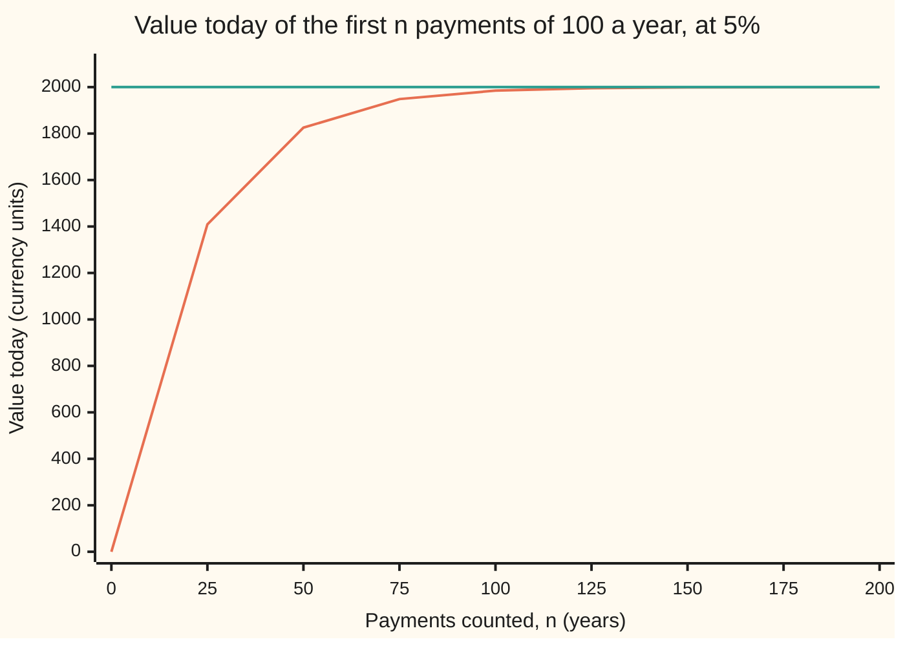

# Infinite series: a sum defined by its partial sums, and the geometric series done exactly

Calculus and analysis → Series → Summing forever → Infinite series

---

## General Overview

A perpetuity is a contract that pays 100 at the end of every year, forever. Money is worth 5% a year. What is the contract worth today?

A later payment is worth less today. The first, one year out, is worth 100 ÷ 1.05 = 95.24. The second, 100 ÷ 1.05 ÷ 1.05 = 90.70. The third, 86.38 ([discounting-and-present-value](../../01-Foundations/04-Compound%20Growth%20and%20Discounting/06-discounting-and-present-value.md)). The price is the total of infinitely many such numbers, and nobody can add infinitely many numbers.

Anyone can add the first 100 and watch. After 100 years the running total is 1,984.79; after 200, 1,999.88. The totals close in on 2,000 without passing it. The contract is worth exactly 2,000, and this card says what "exactly" means for a sum that never ends.

A sum with infinitely many terms is a **series**. Its value is defined as the number the running totals head for.

**An infinite sum means the limit of its running totals: if the totals settle on one number, that number is the sum; if they do not, the series has no sum.**

**What kind of fact this is:** a definition, of what an infinite sum means; the geometric-series formula and the term test built on it are theorems, proved on this card in Why it works.

### The picture: the running total closing on 2,000



The rising line is the running total after n payments; the flat line is 2,000. The gap is what the later payments are still worth today.

---

## The formula

Notation first, in words. The terms form a sequence ([sequences-and-limits](../01-Limits%20and%20Continuity/03-sequences-and-limits.md)), written $a_k$ with $k$ counting them. The running total of the first $n$ is $S_n$, the $n$th **partial sum**. The sigma sign with infinity on top means "the limit of the partial sums":

$$\sum_{k=1}^{\infty} a_k \;=\; \lim_{n\to\infty} S_n, \qquad S_n = a_1 + a_2 + \dots + a_n$$

**Read it aloud:** the infinite sum is whatever the running total heads for as more and more terms are counted.

If that limit is a real number $S$, the series **converges** to $S$. If not, it **diverges** and has no sum.

In a **geometric series** each term is the one before times a fixed **ratio** $r$. With first term $a$:

$$a + ar + ar^2 + \dots + ar^{n-1} \;=\; \frac{a\,(1-r^n)}{1-r} \ \text{ when } r \ne 1, \qquad a + ar + ar^2 + \dots \;=\; \frac{a}{1-r} \ \text{ when } -1<r<1$$

**Read it aloud:** forever, the geometric series adds to its first term over one minus its ratio.

The perpetuity is geometric: $a = 100/1.05$ and $r = 1/1.05$, so the sum is $100/0.05 = 2000$. The part still missing after $n$ payments, the **tail**, is $R_n = a r^n/(1-r) = 2000/1.05^n$.

| Symbol | Plain meaning | In our example | Push it up and the answer… |
| --- | --- | --- | --- |
| $a_k$ | the $k$th term: one payment's value today | 100/1.05^k | later totals rise |
| $k$ | which term, counting from 1 | the payment's year | — |
| $n$ | how many terms are added | 100 years | the total nears 2,000 |
| $S_n$ | the $n$th partial sum: the running total | 1,984.79 after 100 years | — |
| $S$ | the sum: the limit of the partial sums | 2,000 | — |
| $a$ | the first term of a geometric series | 95.238095 | the sum scales with it |
| $r$ | each term ÷ the one before | 1/1.05 = 0.952381 | the sum grows; at 1 it is gone |
| $R_n$ | the tail: sum minus partial sum | 15.21 after 100 years | — |

### When it holds

The definition applies to every series. The geometric formula needs more:

- **A fixed ratio.** Same payment, same rate. If the rate drifts, the formula is only an estimate; the partial sums still decide.
- **A ratio strictly between −1 and 1.** At $r = 1$ the totals grow without limit; at $r = -1$ they flip between two values forever.
- **The right first term.** Count a payment made today as well and the answer is 2,100: a different contract.

---

## Why it works

### Step 0: settle the finite sum first, then let n grow

An infinite sum cannot be computed directly; a finite one can. So find $S_n$ as a formula in $n$, then ask what it heads for.

### Step 1: the finite geometric sum, by shifting and subtracting

Write the first $n$ terms, then the same line multiplied by $r$:

$S_n = a + ar + \dots + ar^{n-1}$ and $rS_n = ar + ar^2 + \dots + ar^n$.

Every term but two appears in both lines. Subtract: $S_n - rS_n = a - ar^n$. When $r$ is not 1, divide by $1 - r$:

$$S_n = \frac{a\,(1 - r^n)}{1 - r}$$

For the perpetuity that is $2000 \times (1 - 1/1.05^n)$: at $n = 100$, 15.21 is missing and $S_{100} = 1984.79$. No infinity was used yet.

### Step 2: the power r^n shrinks to zero

Only $r^n = 1/1.05^n$ changes with $n$, and $1.05^n$ grows past any number: each year adds at least 0.05, so after $n$ years it is at least $1 + 0.05n$.

The tolerance game makes the limit concrete. To land within 1 of 2,000, the tail $2000/1.05^n$ must be at most 1, so $1.05^n$ must reach 2,000: first at $n = 156$. Within one cent needs $n = 251$. Any tolerance is met from some year on and stays met, because the tail only shrinks. That is what "converges to 2,000" means.

<details>
<summary>Detailed proof: the geometric series converges to a/(1 − r)</summary>

Let $q = |r| < 1$. If $q = 0$ the tail is 0. Otherwise write $1/q = 1 + b$ with $b > 0$. By induction, $(1 + b)^n \ge 1 + nb$: true at $n = 1$, and multiplying both sides by $1 + b$ gives $(1+b)^{n+1} \ge 1 + (n+1)b + nb^2$. So $q^n \le 1/(1 + nb)$.

The tail is $|R_n| = |a|\,q^n/(1-r)$ in size, at most $|a|/((1 - r)(1 + nb))$. Given any $\varepsilon > 0$, choose a count N with $1 + Nb > |a|/((1-r)\varepsilon)$. Then every $n \ge N$ has $|S - S_n| = |R_n| < \varepsilon$, which is the definition of $S_n \to a/(1-r)$.

If $|r| \ge 1$ and $a \ne 0$, every term has size at least $|a|$, so by Step 3 the series diverges.

</details>

A shortcut reaches 2,000 in one line. A year from now the holder receives 100 and still owns a perpetuity worth $S$, so $S = (100 + S)/1.05$ and $S = 100/0.05 = 2000$. It is valid only because $S$ is now known to exist. The usual mistake, below, shows the same move failing on a divergent series.

### Step 3: the term test, which rules series out

If the totals settle on $S$, then $S_n$ and $S_{n-1}$ both head for $S$, and their difference, the $n$th term, heads for 0. Turned round: **if the terms do not shrink to 0, the series diverges.** This is the **term test**.

Let the payments grow 5% a year, matching the rate. The second, 105, is worth 105 ÷ 1.05^2 = 95.24 today, like the first. Every term is 95.238095 and the total after 100 years is 9,523.81, growing forever. The terms never approach 0, so the term test rules the series out. The ratio is exactly 1.

<details>
<summary>Detailed proof: the term test</summary>

Suppose $S_n \to S$. Given $\varepsilon > 0$, choose a count N so that $|S_n - S| < \varepsilon/2$ for all $n \ge N$. For $n \ge N + 1$ both $S_n$ and $S_{n-1}$ are within $\varepsilon/2$ of $S$, so $|a_n| = |S_n - S_{n-1}| < \varepsilon$. Hence $a_n \to 0$.

</details>

### Step 4: the term test cannot rule a series in

Terms shrinking to 0 are needed, not enough. The **harmonic series** $1 + 1/2 + 1/3 + 1/4 + \dots$ has terms heading for 0 and no sum.

Group its terms in blocks that double in length. 1/3 and 1/4 are each at least 1/4, so together at least 1/2. 1/5 to 1/8 are each at least 1/8: again at least 1/2. Every block adds at least a half, so after 1,024 terms the total is at least 1 + 10/2 = 6. It is 7.5092, while the last term is only 0.000977. The blocks never stop adding halves.

---

## Worked numbers, by hand

| Step | Arithmetic | Value |
| --- | --- | --- |
| first term | 100 ÷ 1.05 | 95.24 |
| ratio | 1 ÷ 1.05 | 0.952381 |
| first three terms | 95.24 + 90.70 + 86.38 | 272.32 |
| sum | 95.238095 ÷ (1 − 0.952381) = 100 ÷ 0.05 | **2,000** |
| tail after 100 years | 2000 ÷ 1.05^100 | 15.21 |
| partial sum after 100 years | 2000 − 15.21 | 1,984.79 |
| years to land within 1 of 2,000 | first n with 1.05^n ≥ 2000 | **156** |

100 a year forever is worth 2,000 today, and the first 156 years account for all but 1 of it.

### What breaks if you drop a piece

| Mistake | Comes out at | What went wrong |
| --- | --- | --- |
| Ratio 0.95, taking 5% off each year | 1,900.00 | Discounting divides by 1.05; it does not subtract 5% |
| A payment today counted too | 2,100.00 | A different contract: the first term is 100, not 95.24 |
| Payments growing 5% a year | 9,523.81 after 100 years, rising | Ratio 1: every term stays 95.238095, so the term test says diverge |
| Stopping at 100 years | 1,984.79 | The tail of 15.21 was dropped |

The code prints all four.

---

## Code, from first principles, and it actually runs

Three roads to 2,000 that share no arithmetic: adding 700 discounted payments (the tail left, about 0.000000000003, is below the printed digits), the closed form with powers taken by logarithms, and the self-similar equation. The tolerance game is played twice, by adding until the gap closes and by solving with logarithms. Then the term test on growing payments and the harmonic doubling bound.

### Python

```python
# Infinite series -- the check behind the card.  Standard library only.
# A perpetuity pays 100 at the end of every year, forever, at a 5% rate.
# Its value is the sum of the discounted payments, reached by three roads:
# adding the payments one by one, the closed form, and the self-similar equation.
import math
PAY, RATE = 100.0, 0.05
r = 1 / (1 + RATE)                        # each payment is worth r times the one before
a = PAY * r                               # the first payment, discounted one year

def added(n, first=a, ratio=r):           # road one: add n discounted payments
    total, term = 0.0, first
    for _ in range(n):
        total, term = total + term, term * ratio
    return total

def formula(n):                           # road two: a(1 - r^n)/(1 - r), r^n by logs
    return a * (1 - math.exp(n * math.log(r))) / (1 - r)

limit = a / (1 - r)                       # road two, all payments
self_similar = PAY / RATE                 # road three: S = (100 + S)/1.05
by_adding = added(700)

def within(tol):                          # the tolerance game, two ways
    n = 0
    while limit - added(n) > tol:
        n += 1
    return n, math.ceil(math.log(limit / tol) / math.log(1 + RATE))

pay, disc, grow = PAY, 1.0, []            # term test: payments growing 5% a year
for k in range(100):
    disc *= 1 + RATE
    grow.append(pay / disc)
    pay *= 1 + RATE
h, bounds = 0.0, []                       # harmonic series 1 + 1/2 + 1/3 + ...
for k in range(1, 1025):
    h += 1 / k
    if k & (k - 1) == 0:                  # k is a power of 2: record (H_k, 1 + j/2)
        bounds.append((h, 1 + math.log2(k) / 2))

print(f"perpetuity 100 a year at 5%: ratio r = {r:.6f}, first term a = {a:.6f}")
print(f"first three terms {a:.6f} {a * r:.6f} {a * r * r:.6f}, S_3 = {added(3):.6f}")
print(f"limit, closed form a/(1 - r): {limit:.6f}")
print(f"limit, self-similar S = (100 + S)/1.05, so S = 100/0.05: {self_similar:.6f}")
print(f"limit, adding 700 payments: {by_adding:.6f}")
for n in range(0, 201, 25):
    print(f"chart, n = {n:3}: added {added(n):8.2f}, formula {formula(n):8.2f}, tail {limit - formula(n):8.2f}")
for tol in (1.0, 0.01):
    print(f"within {tol:.2f} of {limit:.0f}: n = {within(tol)[0]} by adding, {within(tol)[1]} by logs")
print(f"term test, payments growing 5% a year: term 1 = {grow[0]:.6f}, term 100 = {grow[99]:.6f}, S_100 = {sum(grow):.2f}")
print(f"harmonic 1 + 1/2 + ... + 1/1024: last term {1 / 1024:.6f}, sum {h:.4f}, doubling bound {bounds[-1][1]:.0f}")
print(f"mistakes: ratio 0.95 gives {95 / (1 - 0.95):.2f}; a payment today added gives {PAY + limit:.2f}; S = 1 + 2S gives {1 / (1 - 2):.0f}")
assert all(abs(added(n) - formula(n)) < 1e-9 for n in range(0, 201, 25))   # road one = road two
assert abs(by_adding - self_similar) < 1e-9 and abs(limit - self_similar) < 1e-9
assert within(1.0)[0] == within(1.0)[1] and within(0.01)[0] == within(0.01)[1]
assert all(hk >= b for hk, b in bounds) and min(grow) > 0.99 * a   # harmonic bound; growing terms never shrink
print("ALL CHECKS PASS")
```

**Ran 2026-09-27 on macOS, Python 3.14.6, standard library only. All checks passed. Output, pasted from the run:**

```
perpetuity 100 a year at 5%: ratio r = 0.952381, first term a = 95.238095
first three terms 95.238095 90.702948 86.383760, S_3 = 272.324803
limit, closed form a/(1 - r): 2000.000000
limit, self-similar S = (100 + S)/1.05, so S = 100/0.05: 2000.000000
limit, adding 700 payments: 2000.000000
chart, n =   0: added     0.00, formula     0.00, tail  2000.00
chart, n =  25: added  1409.39, formula  1409.39, tail   590.61
chart, n =  50: added  1825.59, formula  1825.59, tail   174.41
chart, n =  75: added  1948.50, formula  1948.50, tail    51.50
chart, n = 100: added  1984.79, formula  1984.79, tail    15.21
chart, n = 125: added  1995.51, formula  1995.51, tail     4.49
chart, n = 150: added  1998.67, formula  1998.67, tail     1.33
chart, n = 175: added  1999.61, formula  1999.61, tail     0.39
chart, n = 200: added  1999.88, formula  1999.88, tail     0.12
within 1.00 of 2000: n = 156 by adding, 156 by logs
within 0.01 of 2000: n = 251 by adding, 251 by logs
term test, payments growing 5% a year: term 1 = 95.238095, term 100 = 95.238095, S_100 = 9523.81
harmonic 1 + 1/2 + ... + 1/1024: last term 0.000977, sum 7.5092, doubling bound 6
mistakes: ratio 0.95 gives 1900.00; a payment today added gives 2100.00; S = 1 + 2S gives -1
ALL CHECKS PASS
```

### Rust

Same numbers, same labels, built with `rustc --edition 2021 -O`.

```rust
// Infinite series -- the same check as the Python, in Rust.  No crates.
// A perpetuity pays 100 at the end of every year, forever, at a 5% rate.
// Its value is the sum of the discounted payments, reached by three roads:
// adding the payments one by one, the closed form, and the self-similar equation.
const PAY: f64 = 100.0;
const RATE: f64 = 0.05;

fn added(n: usize, first: f64, ratio: f64) -> f64 {  // road one: add n discounted payments
    let (mut total, mut term) = (0.0, first);
    for _ in 0..n {
        total += term;
        term *= ratio;
    }
    total
}

fn formula(n: usize, a: f64, r: f64) -> f64 {       // road two: a(1 - r^n)/(1 - r), r^n by logs
    a * (1.0 - (n as f64 * r.ln()).exp()) / (1.0 - r)
}

fn within(tol: f64, a: f64, r: f64, limit: f64) -> (usize, usize) {  // the tolerance game, two ways
    let mut n = 0;
    while limit - added(n, a, r) > tol {
        n += 1;
    }
    (n, ((limit / tol).ln() / (1.0 + RATE).ln()).ceil() as usize)
}

fn main() {
    let r = 1.0 / (1.0 + RATE);                      // each payment is worth r times the one before
    let a = PAY * r;                                 // the first payment, discounted one year
    let limit = a / (1.0 - r);                       // road two, all payments
    let self_similar = PAY / RATE;                   // road three: S = (100 + S)/1.05
    let by_adding = added(700, a, r);
    let (mut pay, mut disc, mut grow) = (PAY, 1.0, Vec::new());  // term test: payments growing 5% a year
    for _ in 0..100 {
        disc *= 1.0 + RATE;
        grow.push(pay / disc);
        pay *= 1.0 + RATE;
    }
    let (mut h, mut bounds) = (0.0, Vec::new());     // harmonic series 1 + 1/2 + 1/3 + ...
    for k in 1..=1024u32 {
        h += 1.0 / k as f64;
        if k & (k - 1) == 0 {                        // k is a power of 2: record (H_k, 1 + j/2)
            bounds.push((h, 1.0 + (k as f64).log2() / 2.0));
        }
    }
    let grow_sum: f64 = grow.iter().sum();
    let grow_min = grow.iter().cloned().fold(f64::INFINITY, f64::min);
    println!("perpetuity 100 a year at 5%: ratio r = {:.6}, first term a = {:.6}", r, a);
    println!("first three terms {:.6} {:.6} {:.6}, S_3 = {:.6}", a, a * r, a * r * r, added(3, a, r));
    println!("limit, closed form a/(1 - r): {:.6}", limit);
    println!("limit, self-similar S = (100 + S)/1.05, so S = 100/0.05: {:.6}", self_similar);
    println!("limit, adding 700 payments: {:.6}", by_adding);
    for n in (0..=200).step_by(25) {
        println!("chart, n = {:3}: added {:8.2}, formula {:8.2}, tail {:8.2}",
                 n, added(n, a, r), formula(n, a, r), limit - formula(n, a, r));
    }
    for tol in [1.0, 0.01] {
        let (by_add, by_log) = within(tol, a, r, limit);
        println!("within {:.2} of {:.0}: n = {} by adding, {} by logs", tol, limit, by_add, by_log);
    }
    println!("term test, payments growing 5% a year: term 1 = {:.6}, term 100 = {:.6}, S_100 = {:.2}",
             grow[0], grow[99], grow_sum);
    println!("harmonic 1 + 1/2 + ... + 1/1024: last term {:.6}, sum {:.4}, doubling bound {:.0}",
             1.0 / 1024.0, h, bounds[bounds.len() - 1].1);
    println!("mistakes: ratio 0.95 gives {:.2}; a payment today added gives {:.2}; S = 1 + 2S gives {:.0}",
             95.0 / (1.0 - 0.95), PAY + limit, 1.0 / (1.0 - 2.0));
    assert!((0..=200).step_by(25).all(|n| (added(n, a, r) - formula(n, a, r)).abs() < 1e-9));
    assert!((by_adding - self_similar).abs() < 1e-9 && (limit - self_similar).abs() < 1e-9);
    let (w1, w2) = (within(1.0, a, r, limit), within(0.01, a, r, limit));
    assert!(w1.0 == w1.1 && w2.0 == w2.1);
    assert!(bounds.iter().all(|&(hk, b)| hk >= b) && grow_min > 0.99 * a);  // harmonic bound; growing terms never shrink
    println!("ALL CHECKS PASS");
}
```

**Ran 2026-09-27 on macOS, rustc 1.98.1, no crates. All checks passed. Output, pasted from the run:**

```
perpetuity 100 a year at 5%: ratio r = 0.952381, first term a = 95.238095
first three terms 95.238095 90.702948 86.383760, S_3 = 272.324803
limit, closed form a/(1 - r): 2000.000000
limit, self-similar S = (100 + S)/1.05, so S = 100/0.05: 2000.000000
limit, adding 700 payments: 2000.000000
chart, n =   0: added     0.00, formula     0.00, tail  2000.00
chart, n =  25: added  1409.39, formula  1409.39, tail   590.61
chart, n =  50: added  1825.59, formula  1825.59, tail   174.41
chart, n =  75: added  1948.50, formula  1948.50, tail    51.50
chart, n = 100: added  1984.79, formula  1984.79, tail    15.21
chart, n = 125: added  1995.51, formula  1995.51, tail     4.49
chart, n = 150: added  1998.67, formula  1998.67, tail     1.33
chart, n = 175: added  1999.61, formula  1999.61, tail     0.39
chart, n = 200: added  1999.88, formula  1999.88, tail     0.12
within 1.00 of 2000: n = 156 by adding, 156 by logs
within 0.01 of 2000: n = 251 by adding, 251 by logs
term test, payments growing 5% a year: term 1 = 95.238095, term 100 = 95.238095, S_100 = 9523.81
harmonic 1 + 1/2 + ... + 1/1024: last term 0.000977, sum 7.5092, doubling bound 6
mistakes: ratio 0.95 gives 1900.00; a payment today added gives 2100.00; S = 1 + 2S gives -1
ALL CHECKS PASS
```

The two outputs match line for line.

> [!TIP]
> **Try changing**
> Guess first, then run it.
> - **A lower rate.** Set `RATE` to `0.04`. The sum becomes 2,500 and landing within 1 takes 200 years. The second assert stops the run: 700 payments no longer reach within a billionth of the limit.
> - **Pay today as well.** Set `a` to `PAY`. Adding and the closed form give 2,100; the self-similar line still says 2,000, so the second assert stops it.
> - **Slower growth.** Grow `pay` by `1.04` instead of `1 + RATE`. The terms now shrink and the fourth assert stops the run.

---

## The usual mistake

> [!warning]
> **Treating an infinite sum as a number before knowing it exists.** The self-similar trick works on the perpetuity only because Step 2 proved the totals settle. Apply it to $1 + 2 + 4 + 8 + \dots$: calling the total $S$ gives $S = 1 + 2S$, so $S = -1$. A sum of positive numbers cannot be negative: the totals grow without limit, so there was never a number to solve for.
>
> - **Shrinking terms taken as proof of convergence.** The harmonic series has terms heading for 0 and no sum.
> - **Subtracting the rate instead of dividing by one plus it.** Ratio 0.95 in place of 1/1.05 gives 1,900.00, not 2,000.
> - **A long run read as the answer.** 100 years of payments show 1,984.79; the missing 15.21 is real value.

---

## Where you meet it in real life

- **Perpetual bonds and endowments.** A payment forever is priced at payment ÷ rate. Loans are the finite partial sums ([annuities-and-loans](../../12-Financial%20mathematics/01-Money%2C%20Dates%20and%20Discounting/03-annuities-and-loans.md)).
- **Valuing a company.** A steadily growing dividend is a geometric series with ratio (1 + growth) ÷ (1 + rate). Once growth reaches the rate, the term test says the model has no answer.
- **Numerical computing.** The exponential and its relatives are computed from series ([taylor-series](05-taylor-series.md)); a tail bound says when to stop.

> **Say it back**
> An infinite sum is the limit of its running totals, if there is one. A geometric series with ratio between −1 and 1 sums to first term ÷ (1 − ratio), which prices 100 a year at 5% at 2,000. Terms that do not shrink to 0 rule a series out. Terms that shrink prove nothing alone, as the harmonic series shows.

---

## What this builds on

- [sequences-and-limits](../01-Limits%20and%20Continuity/03-sequences-and-limits.md): the limit of a sequence, applied here to the sequence of partial sums.
- [discounting-and-present-value](../../01-Foundations/04-Compound%20Growth%20and%20Discounting/06-discounting-and-present-value.md): why a payment k years out is worth 100 ÷ 1.05^k today.

## Where this goes next

- [comparison-ratio-and-root-tests](02-comparison-ratio-and-root-tests.md): convergence decided by comparison with a geometric series.
- [complex-limits-series-and-regions](../../07-Complex%20analysis/01-Complex%20Numbers%20and%20the%20Plane/06-complex-limits-series-and-regions.md): the same definition, complex terms.
- [laurent-series](../../07-Complex%20analysis/05-Laurent%20Series%2C%20Singularities%20and%20Residues/01-laurent-series.md): series running both ways.
- [measures](../../10-Measure%20and%20integration/01-Sets%20You%20Can%20Measure/04-measures.md): size that adds over infinitely many pieces.
- [lebesgue-outer-measure](../../10-Measure%20and%20integration/02-Length%20Done%20Properly/01-lebesgue-outer-measure.md): interval lengths summed as a series.
- [monotone-convergence-theorem](../../10-Measure%20and%20integration/04-The%20Lebesgue%20Integral/03-monotone-convergence-theorem.md): rising totals passed inside an integral.
- [annuities-and-loans](../../12-Financial%20mathematics/01-Money%2C%20Dates%20and%20Discounting/03-annuities-and-loans.md): the finite geometric sum pricing a loan.
- sequence-spaces-lp-and-c0: sequences whose sizes sum.
- wieners-lemma-and-invertible-filters: the geometric series inverting 1 − r for operators.
- asymptotic-notation-and-error-terms: how fast harmonic totals grow.
- mertens-theorems: the harmonic series over primes.

The geometric series came with a formula for its partial sums; most series do not, and deciding their fate anyway is [comparison-ratio-and-root-tests](02-comparison-ratio-and-root-tests.md).

---

## Sources

Verified 27 Sep 2026: every link below resolves to the publisher's page.

- Lebl, Jiří. *Basic Analysis I: Introduction to Real Analysis*, section 2.5 "Series". [Online text](https://www.jirka.org/ra/html/sec_series.html). The partial-sum definition, the geometric series, the term test and the harmonic series, proved.
- Strang, Gilbert, Edwin Herman, et al. *Calculus Volume 2*, section 5.2 "Infinite Series". OpenStax. [Book page](https://openstax.org/books/calculus-volume-2/pages/5-2-infinite-series). The same material at a gentler pace, with worked geometric examples.
- Graham, Ronald L., Donald E. Knuth, and Oren Patashnik. *Concrete Mathematics*, 2nd ed. Addison-Wesley, 1994. [Publisher page](https://www.informit.com/store/concrete-mathematics-a-foundation-for-computer-science-9780201558029). Chapter 2 sums the finite geometric series by the shift-and-subtract method of Step 1.
