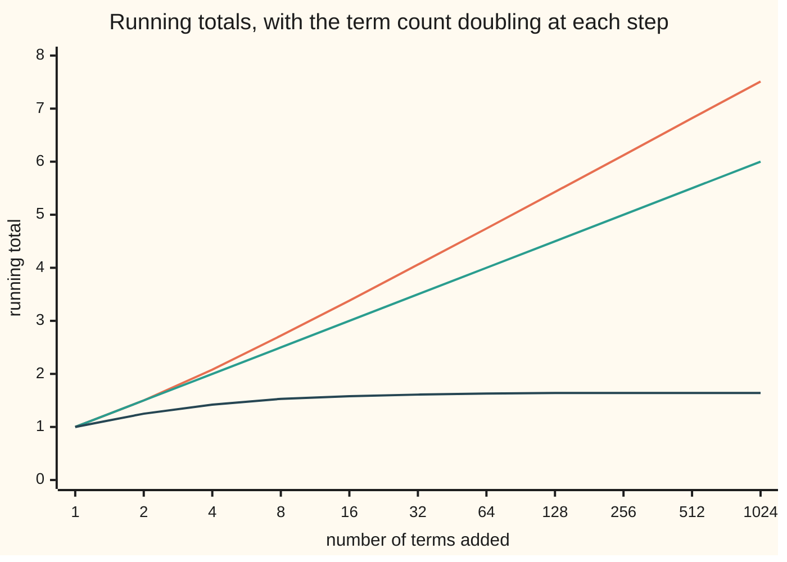

# Convergence tests: comparison, integral, ratio and root, and which to reach for

[Syllabus](../../../SYLLABUS.md) → [Calculus and analysis](../../../SYLLABUS.md#w06) → [Series](../../../SYLLABUS.md#w06-s06) → Convergence tests

---

## General Overview

Two endless sums look alike. One adds 1, then 1/2, 1/3, 1/4 and so on: the **harmonic series**. The other adds 1, then 1/4, 1/9, 1/16, one over each square: the **squares**. The terms of both shrink towards zero.

Their fates split. After 1,000 terms the harmonic total is 7.485471; after a million, 14.392727, and it never stops climbing. The squares total 1.643935 after 1,000 terms, and no number of terms carries them past 2.

A total that looks still may be crawling upward. A **convergence test** decides from the shape of the terms instead.

**A series of terms that are never negative converges exactly when its running totals have a ceiling; each test is a way to prove a ceiling exists, or that none can.**

**What kind of fact this is:** four theorems, proved on this card in Why it works, and a method for choosing among them.

### The picture: one total climbs for ever, the other levels off



Orange: the harmonic total. Green: the floor 1 + k/2 after 2^k terms, proved in Step 1. Dark blue: the squares, flat at 1.64 from 128 terms on. Each step right doubles the count.

---

## The formula

A reminder from [Infinite series](01-series-convergence.md): $a_n$ is the term in position n, and the sigma sign running to infinity means the limit of the running totals $S_N$, the sum of the first N terms. Every test assumes terms that are never negative, from some position on.

The result this card settles, the **p-series** (one over n to a fixed power p):

$$\sum_{n=1}^{\infty} \frac{1}{n^p} \ \text{ converges exactly when } \ p > 1.$$

**Read it aloud:** one over n to the power p adds to a finite total when p is bigger than one, and grows without end otherwise.

The harmonic series is p = 1, the squares p = 2. Four tests reach it:

- **Comparison.** If $0 \le a_n \le b_n$ and the sum of $b_n$ converges, so does the sum of $a_n$. A divergent smaller sum makes the bigger diverge.
- **Integral.** If $a_n = f(n)$ for a curve $f$ that is positive and falling, the series and the area under $f$ from 1 to infinity share a verdict. The totals sit between two areas:

$$\int_{1}^{N+1} f(x)\,dx \ \le \ S_N \ \le \ f(1) + \int_{1}^{N} f(x)\,dx$$

- **Ratio.** For positive terms, let $L = \lim (n \to \infty)\ a_{n+1}/a_n$, each term against the one before. Below 1: converges; above 1, or infinite: diverges.
- **Root.** Let $L = \lim (n \to \infty)\ (a_n)^{1/n}$, the n-th root of the n-th term. Same verdicts.

**At L = 1, ratio and root say nothing.** Both our series land there.

| Symbol | Plain meaning | In our example | Push it up and the answer… |
| --- | --- | --- | --- |
| $a_n$, $n$ | the term in position n | 1/n, or 1/n^2 | bigger totals |
| $b_n$ | a comparison term with a known sum | 1/((n − 1)n), from n = 2 | a looser ceiling |
| $S_N$, $N$ | the running total of the first N terms | 1.643935 and 7.485471 at N = 1000 | creeps to the full sum |
| $f$, $x$ | a falling curve through the terms, and its input | f(x) = 1/x^2 | more area |
| $p$ | the power in a p-series | 1, or 2 | above 1, a finite total |
| $L$ | long-run ratio, or n-th root, of the terms | 1 for both | past 1, divergence |
| $q$, $k$ | a fixed ceiling ratio below 1, and steps taken | q = 3/4 for n/2^n | nearer 1, a weaker ceiling |

### When it holds

- **Terms never negative, eventually.** Mixed signs: [Alternating series](03-alternating-and-conditional-convergence.md).
- **Comparison in the right direction.** The squares sit below the divergent harmonic series and converge.
- **A curve falling everywhere, not only at whole numbers.** Spikes between integers can add infinite area.
- **A limit, not merely ratios below 1.** The harmonic ratios n/(n+1) are all below 1, and it diverges.

### Which test to reach for

| The terms look like | Reach for | Because |
| --- | --- | --- |
| powers of n, or polynomial over polynomial | comparison with a p-series | ratio and root give 1 |
| a falling curve with a known antiderivative | integral | it also bounds the tail |
| factorials, or a number to the power n | ratio | neighbours cancel cleanly |
| a whole expression to the power n | root | the root strips the power |

---

## Why it works

### Step 0: a rising total with a ceiling must settle

Terms never negative make the totals rise or stand still. The real numbers have no gaps, so rising totals under a ceiling close in on their least upper bound; without one they run to infinity. Each test asks one question: is there a ceiling? Terms not shrinking to 0 answer it first: no (the term test).

### Step 1: comparison settles our pair

Squares. For n from 2 on, n^2 is at least (n − 1)n, so 1/n^2 is at most 1/(n − 1) − 1/n. Added up, these cancel in a chain (they telescope) to 1 − 1/N. With the first term in front:

$$S_N \le 1 + \Big(1 - \frac{1}{N}\Big) = 2 - \frac{1}{N} < 2.$$

At N = 1000 that ceiling reads 1.999000. A ceiling for every N, so the squares converge.

Harmonic. Group the terms in doubling blocks: 1/2; then 1/3 + 1/4; then 1/5 to 1/8. The block ending at 1/2^k holds 2^(k−1) terms, each at least 1/2^k, so it adds at least 1/2. After 2^k terms the total is at least 1 + k/2, the green line. After 1024 terms: 7.51 against a floor of 6.00. The floor has no ceiling, so the harmonic series diverges.

### Step 2: the integral test traps totals between areas

Let $f$ fall, with $f(n) = a_n$. Between n and n + 1 a width-1 rectangle of height $a_n$ covers the area under the curve, and one of height $a_{n+1}$ fits beneath it. Adding rectangles gives the sandwich.

For 1/x^p the area from 1 to T is (T^(1−p) − 1)/(1 − p), or log T when p = 1, log being the natural logarithm ([Improper integrals](../04-Integrals/07-improper-integrals.md)). It settles to 1/(p − 1) when p > 1 and grows without end otherwise: the p-series.

The rectangles also bound the tail after N terms: between the areas from N + 1 on and from N on, for the squares 1/(N + 1) and 1/N.

$$S_N + \frac{1}{N+1} \ \le \ \sum_{n=1}^{\infty} \frac{1}{n^2} \ \le \ S_N + \frac{1}{N}.$$

At N = 1000 the full sum lies between 1.644934 and 1.644935. Leonhard Euler found its exact value, pi^2/6, in the 1730s; the check builds pi from its own series and gets 1.644934, inside the box.

### Step 3: the ratio test hides a geometric series

Take n/2^n. Its neighbour ratio is (n + 1)/(2n): 0.75 at n = 2, 0.525 at n = 20, falling towards L = 1/2. So from n = 2 on, each term is at most q = 3/4 of the one before, and k steps later at most (3/4)^k of the start. That sits below a geometric series, which has a finite sum, and comparison finishes.

For any L below 1, fix q between L and 1 and wait until every ratio is below q. For L above 1 the terms eventually grow.

The harmonic ratio at n = 1000 is 0.999001; the squares', 0.998003. Both head for 1, so no fixed q below 1 caps them, and Step 1 had to decide.

### Step 4: the root test is the same comparison

If the n-th root of $a_n$ settles below 1, fix q between L and 1: eventually $a_n$ is below q^n, a geometric term, and the tail is at most q^N/(1 − q). If it settles above 1, eventually $a_n$ exceeds 1 and the terms cannot shrink to 0. At n = 1000 the n-th root of 1/n is 0.993116, of 1/n^2 is 0.986279: both creeping to 1, no verdict.

<details>
<summary>Detailed proof: ratio, root and integral tests</summary>

**Ratio, L < 1.** Let q = (L + 1)/2 and ε = q − L > 0. By the definition of the limit there is an N with |a_{n+1}/a_n − L| < ε for all n ≥ N, so a_{n+1} < q · a_n. By induction a_{N+k} ≤ a_N q^k, so every tail total a_N + … + a_M is at most a_N/(1 − q). Rising and bounded: convergent (Step 0).

**Ratio, L > 1.** Let q = (L + 1)/2 and ε = L − q > 0. For n ≥ N, a_{n+1} > q · a_n > a_n, so a_n ≥ a_N > 0: the terms do not tend to 0, and the series diverges.

**Integral.** Since f falls, a_{n+1} ≤ (area from n to n + 1) ≤ a_n. Sum over n = 1 to N, or 1 to N − 1, for the two halves of the sandwich.

</details>

---

## Worked numbers, by hand

| Step | Arithmetic | Value |
| --- | --- | --- |
| squares, 10 terms | 1 + 1/4 + … + 1/100 | 1.549768 |
| add tail bounds | plus 1/11; plus 1/10 | 1.640677 to 1.649768 |
| squares, 1000 terms | carried further | 1.643935 |
| whole sum, boxed | plus 1/1001; plus 1/1000 | **1.644934 to 1.644935** |
| harmonic, 1000 terms | 1 + 1/2 + … + 1/1000 | 7.485471 |
| area bounds | log 1001; 1 + log 1000 | 6.908755 to 7.907755 |
| harmonic, a million terms | carried further | **14.392727** |

The squares are pinned to six decimals by 1000 terms. The harmonic total has no value to pin: it tracks log N for ever.

A second case, the ratio test deciding: the first N terms of n/2^n add to 2 − (N + 2)/2^N (induction on N), 1.999979 at N = 20, matched term by term.

### What breaks if you drop a piece

| Mistake | Comes out at | What went wrong |
| --- | --- | --- |
| Each ratio below 1 taken as enough | ratio 0.999001, yet 14.392727 after a million terms | ratios creep to 1; no fixed q caps them |
| Ratio limit 1 read as divergence | squares rejected, though capped at 1.999000 for N = 1000 | L = 1 gives no verdict |
| The integral taken as the sum | 1 (area to a million: 0.999999), not 1.644934 | the test matches verdicts, not values |
| Comparing with a bigger divergent series | 1/n^2 below 1/n: no verdict | a ceiling of infinity caps nothing |

---

## Code, from first principles, and it actually runs

Every series is added term by term, then checked by a second road: harmonic totals against the log bounds; the squares' box against pi^2/6, with pi from Machin's formula 16 arctan(1/5) − 4 arctan(1/239) and arctan from its own series; the telescoped ceiling and the n/2^n sum against closed forms. Changing the squares to 1/(n^2 + 1), or the harmonic to 1/n^1.01, trips an assert.

### Python

```python
# Convergence tests -- the check behind the card.  Standard library only;
# math.log is a primitive, and every sum is added here one term at a time.
from math import log

def partial(term, N):                        # road one: add the terms
    s = 0.0
    for n in range(1, N + 1):
        s += term(n)
    return s

harm = lambda n: 1.0 / n                     # the harmonic series
sq = lambda n: 1.0 / (n * n)                 # the squares
tele = lambda n: 1.0 / (n * (n + 1))         # shifted one place, caps a square
half = lambda n: n / 2.0 ** n                # a case the ratio test settles
f2 = lambda v: " ".join(f"{x:.2f}" for x in v)

print("tests on the harmonic series 1/n and the squares 1/n^2")
pts = [2 ** k for k in range(11)]
print("figure, n:", " ".join(str(n) for n in pts))
print("figure, harmonic partial sums:", f2(partial(harm, n) for n in pts))
print("figure, doubling floor 1 + k/2:", f2(1 + k / 2 for k in range(11)))
print("figure, squares partial sums:", f2(partial(sq, n) for n in pts))

for N in (1000, 1000000):                    # road two: area under 1/x is log x
    H, lo, hi = partial(harm, N), log(N + 1), 1 + log(N)
    assert lo <= H <= hi
    print(f"harmonic N={N}: sum {H:.6f}, integral bounds {lo:.6f} to {hi:.6f}")

for N in (10, 1000):                         # road two: area under 1/x^2 is 1/N
    S = partial(sq, N)
    print(f"squares N={N}: sum {S:.6f}, whole sum between {S + 1 / (N + 1):.6f} and {S + 1 / N:.6f}")

def atan(x):                                 # arctangent by its own series
    return sum((-1) ** k * x ** (2 * k + 1) / (2 * k + 1) for k in range(30))
pi = 16 * atan(1 / 5) - 4 * atan(1 / 239)    # Machin's formula builds pi
euler, S = pi * pi / 6, partial(sq, 1000)
assert S + 1 / 1001 <= euler <= S + 1 / 1000 # Euler's value lands in the box
print(f"Euler's value pi^2/6, pi built by Machin: {euler:.6f}, inside the N=1000 bounds")
T = 1 + partial(tele, 999)                   # 1 + sum of 1/((n-1)n), n = 2..1000
assert abs(T - (2 - 1 / 1000)) < 1e-12 and S <= T  # telescoping, then the ceiling
print(f"squares ceiling by comparison, N=1000: added {T:.6f}, telescoped 2 - 1/N = {2 - 1 / 1000:.6f}")

n = 1000
print(f"ratio at n={n}: harmonic {harm(n + 1) / harm(n):.6f}, squares {sq(n + 1) / sq(n):.6f}")
print(f"root at n={n}: harmonic {harm(n) ** (1 / n):.6f}, squares {sq(n) ** (1 / n):.6f}")

h20, closed = partial(half, 20), 2 - 22 / 2.0 ** 20
assert abs(h20 - closed) < 1e-12             # adding against the induction formula
print(f"n/2^n: ratio at n=2 {half(3) / half(2):.6f}, at n=20 {half(21) / half(20):.6f}, root at n=20 {half(20) ** (1 / 20):.6f}")
print(f"n/2^n, N=20: added {h20:.6f}, closed form 2 - 22/2^20 = {closed:.6f}")
print(f"integral of 1/x^2 from 1 to 1000000: {1 - 1 / 1000000:.6f}")
print("All 4 asserts passed.")
```

**Ran 2026-09-27 on macOS, Python 3.14.6, standard library only. All checks passed. Output, pasted from the run:**

```
tests on the harmonic series 1/n and the squares 1/n^2
figure, n: 1 2 4 8 16 32 64 128 256 512 1024
figure, harmonic partial sums: 1.00 1.50 2.08 2.72 3.38 4.06 4.74 5.43 6.12 6.82 7.51
figure, doubling floor 1 + k/2: 1.00 1.50 2.00 2.50 3.00 3.50 4.00 4.50 5.00 5.50 6.00
figure, squares partial sums: 1.00 1.25 1.42 1.53 1.58 1.61 1.63 1.64 1.64 1.64 1.64
harmonic N=1000: sum 7.485471, integral bounds 6.908755 to 7.907755
harmonic N=1000000: sum 14.392727, integral bounds 13.815512 to 14.815511
squares N=10: sum 1.549768, whole sum between 1.640677 and 1.649768
squares N=1000: sum 1.643935, whole sum between 1.644934 and 1.644935
Euler's value pi^2/6, pi built by Machin: 1.644934, inside the N=1000 bounds
squares ceiling by comparison, N=1000: added 1.999000, telescoped 2 - 1/N = 1.999000
ratio at n=1000: harmonic 0.999001, squares 0.998003
root at n=1000: harmonic 0.993116, squares 0.986279
n/2^n: ratio at n=2 0.750000, at n=20 0.525000, root at n=20 0.580793
n/2^n, N=20: added 1.999979, closed form 2 - 22/2^20 = 1.999979
integral of 1/x^2 from 1 to 1000000: 0.999999
All 4 asserts passed.
```

### Rust

```rust
// Convergence tests -- the check behind the card.  Rust std only; ln() is a
// primitive, and every sum is added here one term at a time.
fn partial(term: fn(u64) -> f64, big_n: u64) -> f64 { // road one: add the terms
    let mut s = 0.0;
    for n in 1..=big_n {
        s += term(n);
    }
    s
}
fn harm(n: u64) -> f64 { 1.0 / n as f64 } // the harmonic series
fn sq(n: u64) -> f64 { 1.0 / (n * n) as f64 } // the squares
fn tele(n: u64) -> f64 { 1.0 / (n * (n + 1)) as f64 } // shifted one place, caps a square
fn half(n: u64) -> f64 { n as f64 / 2f64.powi(n as i32) } // a case the ratio test settles
fn atan(x: f64) -> f64 { // arctangent by its own series
    (0..30).map(|k| (-1f64).powi(k) * x.powi(2 * k + 1) / (2 * k + 1) as f64).sum()
}
fn f2(v: Vec<f64>) -> String {
    v.iter().map(|x| format!("{:.2}", x)).collect::<Vec<_>>().join(" ")
}

fn main() {
    println!("tests on the harmonic series 1/n and the squares 1/n^2");
    let pts: Vec<u64> = (0..11).map(|k| 1u64 << k).collect();
    let names: Vec<String> = pts.iter().map(|n| n.to_string()).collect();
    println!("figure, n: {}", names.join(" "));
    println!("figure, harmonic partial sums: {}", f2(pts.iter().map(|&n| partial(harm, n)).collect()));
    println!("figure, doubling floor 1 + k/2: {}", f2((0..11).map(|k| 1.0 + k as f64 / 2.0).collect()));
    println!("figure, squares partial sums: {}", f2(pts.iter().map(|&n| partial(sq, n)).collect()));

    for big_n in [1000u64, 1000000] { // road two: area under 1/x is log x
        let h = partial(harm, big_n);
        let (lo, hi) = (((big_n + 1) as f64).ln(), 1.0 + (big_n as f64).ln());
        assert!(lo <= h && h <= hi);
        println!("harmonic N={}: sum {:.6}, integral bounds {:.6} to {:.6}", big_n, h, lo, hi);
    }

    for big_n in [10u64, 1000] { // road two: area under 1/x^2 is 1/N
        let s = partial(sq, big_n);
        println!("squares N={}: sum {:.6}, whole sum between {:.6} and {:.6}",
            big_n, s, s + 1.0 / (big_n + 1) as f64, s + 1.0 / big_n as f64);
    }
    let pi = 16.0 * atan(1.0 / 5.0) - 4.0 * atan(1.0 / 239.0); // Machin's formula builds pi
    let (euler, s) = (pi * pi / 6.0, partial(sq, 1000));
    assert!(s + 1.0 / 1001.0 <= euler && euler <= s + 1.0 / 1000.0); // Euler's value lands in the box
    println!("Euler's value pi^2/6, pi built by Machin: {:.6}, inside the N=1000 bounds", euler);
    let t = 1.0 + partial(tele, 999); // 1 + sum of 1/((n-1)n), n = 2..1000
    assert!((t - (2.0 - 1.0 / 1000.0)).abs() < 1e-12 && s <= t); // telescoping, then the ceiling
    println!("squares ceiling by comparison, N=1000: added {:.6}, telescoped 2 - 1/N = {:.6}", t, 2.0 - 1.0 / 1000.0);

    let n = 1000u64;
    println!("ratio at n={}: harmonic {:.6}, squares {:.6}", n, harm(n + 1) / harm(n), sq(n + 1) / sq(n));
    let r = 1.0 / n as f64;
    println!("root at n={}: harmonic {:.6}, squares {:.6}", n, harm(n).powf(r), sq(n).powf(r));

    let (h20, closed) = (partial(half, 20), 2.0 - 22.0 / 2f64.powi(20));
    assert!((h20 - closed).abs() < 1e-12); // adding against the induction formula
    println!("n/2^n: ratio at n=2 {:.6}, at n=20 {:.6}, root at n=20 {:.6}",
        half(3) / half(2), half(21) / half(20), half(20).powf(1.0 / 20.0));
    println!("n/2^n, N=20: added {:.6}, closed form 2 - 22/2^20 = {:.6}", h20, closed);
    println!("integral of 1/x^2 from 1 to 1000000: {:.6}", 1.0 - 1.0 / 1000000.0);
    println!("All 4 asserts passed.");
}
```

**Ran 2026-09-27 on macOS, rustc 1.98.1, no crates. All checks passed. Output, pasted from the run:**

```
tests on the harmonic series 1/n and the squares 1/n^2
figure, n: 1 2 4 8 16 32 64 128 256 512 1024
figure, harmonic partial sums: 1.00 1.50 2.08 2.72 3.38 4.06 4.74 5.43 6.12 6.82 7.51
figure, doubling floor 1 + k/2: 1.00 1.50 2.00 2.50 3.00 3.50 4.00 4.50 5.00 5.50 6.00
figure, squares partial sums: 1.00 1.25 1.42 1.53 1.58 1.61 1.63 1.64 1.64 1.64 1.64
harmonic N=1000: sum 7.485471, integral bounds 6.908755 to 7.907755
harmonic N=1000000: sum 14.392727, integral bounds 13.815512 to 14.815511
squares N=10: sum 1.549768, whole sum between 1.640677 and 1.649768
squares N=1000: sum 1.643935, whole sum between 1.644934 and 1.644935
Euler's value pi^2/6, pi built by Machin: 1.644934, inside the N=1000 bounds
squares ceiling by comparison, N=1000: added 1.999000, telescoped 2 - 1/N = 1.999000
ratio at n=1000: harmonic 0.999001, squares 0.998003
root at n=1000: harmonic 0.993116, squares 0.986279
n/2^n: ratio at n=2 0.750000, at n=20 0.525000, root at n=20 0.580793
n/2^n, N=20: added 1.999979, closed form 2 - 22/2^20 = 1.999979
integral of 1/x^2 from 1 to 1000000: 0.999999
All 4 asserts passed.
```

The two outputs agree line for line.

> [!TIP]
> **Try changing**
> - **Guess first:** start the harmonic sum at n = 1001. Each doubling block still adds at least 1/2: it still diverges.
> - **Guess first:** replace n/2^n by n^2/2^n. The ratio limit is still 1/2: it converges.
> - **Guess first:** box the squares at N = 10. The box widens to 1.640677 to 1.649768; pi^2/6 stays inside.

---

## The usual mistake

> [!warning]
> **Terms shrinking to zero do not make a sum finite.** The harmonic terms shrink, and the total passes 14.392727 at a million terms on its way past any number. Speed decides: p = 1 is the border.
>
> - **A limit of 1 read as a verdict.** Ratio and root give 1 for every p-series. At 1, switch to comparison or the integral.
> - **The integral's value taken as the sum's.** The area under 1/x^2 from 1 on is 1; the sum is 1.644934.

---

## Where you meet it in real life

- **Numerical libraries.** A stopping rule: the tail bound 1/N says how many terms buy how many decimals.
- **Stacking blocks.** Equal blocks of length 1 stacked at a table edge can overhang it by half the harmonic total: with enough blocks, any distance.
- **Power series.** Ratio and root find the inputs where a series in powers of x converges: [Power series](04-power-series.md).

> **Say it back**
> Terms never negative give rising totals, finite exactly when capped. Comparison borrows a cap from a known series, the integral test from an area. Ratio and root find a geometric cap when the limit is below 1, and are silent at 1. One over n to the p is finite exactly when p > 1.

---

## What this builds on

- [Infinite series](01-series-convergence.md): the sum as a limit of running totals, the term test, and the geometric series.
- [Improper integrals](../04-Integrals/07-improper-integrals.md): areas out to infinity, and the power rule for 1/x^p.

## Where this goes next

- [Alternating series](03-alternating-and-conditional-convergence.md): mixed signs, where cancellation rescues sums these tests reject.
- [Power series](04-power-series.md): ratio and root turned into a radius of convergence.
- [Limits and regions in the plane](../../07-Complex%20analysis/01-Complex%20Numbers%20and%20the%20Plane/06-complex-limits-series-and-regions.md): the same tests on the sizes of complex terms.
- [Infinite products](../../07-Complex%20analysis/09-Special%20Functions%20and%20the%20Zeta%20Function/01-infinite-products.md): endless products, judged through sums like these.

Every test here needs terms that are never negative; why 1 − 1/2 + 1/3 − … converges though the harmonic series does not is [Alternating series](03-alternating-and-conditional-convergence.md).

---

## Sources

Verified 2026-09-27: every link below resolves to the publisher's page.

- Lebl, Jiří. *Basic Analysis I*, §2.5 "Series". [Section page](https://www.jirka.org/ra/html/sec_series.html). Comparison and ratio tests, proved.
- Lebl, Jiří. *Basic Analysis I*, §2.6 "More on series". [Section page](https://www.jirka.org/ra/html/sec_moreonseries.html). The root test.
- Lebl, Jiří. *Basic Analysis I*, §5.5 "Improper integrals". [Section page](https://www.jirka.org/ra/html/sec_impropriemann.html). The integral test and its rectangle bounds.
- OpenStax. *Calculus Volume 2*, §5.6 "Ratio and Root Tests". [Section page](https://openstax.org/books/calculus-volume-2/pages/5-6-ratio-and-root-tests). A summary of which test to choose.
