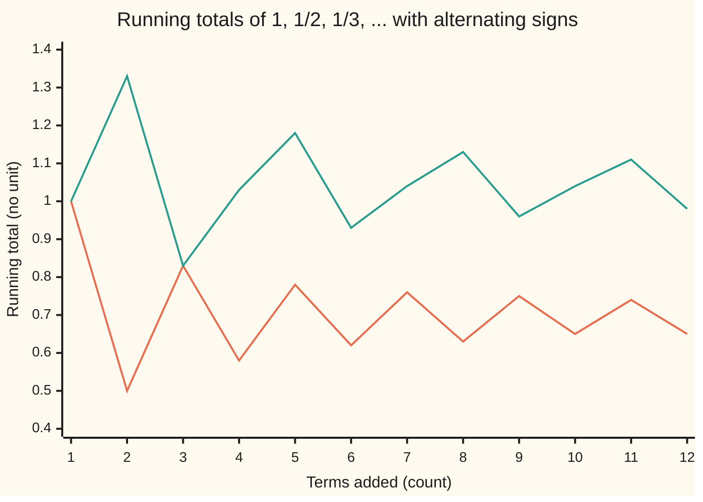

# Alternating series: the sign-flipping sums, their error bound, and the danger of reordering

[Syllabus](../../../SYLLABUS.md) → [Calculus and analysis](../../../SYLLABUS.md#w06) → [Series](../../../SYLLABUS.md#w06-s06) → Alternating series

---

## General Overview

Start a running total at zero. Add 1, take away one half, add one third, take away one quarter, and keep going: the steps shrink and the direction flips. After ten steps the total reads 0.645634921. The totals swing back and forth, each swing shorter, closing in on the natural log of 2, 0.693147181.

After ten steps the miss, the gap to ln 2, is no bigger than the eleventh step, 1/11 = 0.090909091; the true miss is 0.047512260. A sum whose signs take turns is an **alternating series**, and the rule that such sums settle, with the next step bounding the miss, is the **alternating series test**.

Now add the same fractions two positive, then one negative, each used once. The totals settle at 1.039720771, half as much again as ln 2. The sizes 1, 1/2, 1/3, … alone add to infinity; cancellation holds the sum finite, and order steers it. Such a sum is **conditionally convergent**. When the sizes alone add to a finite amount, the sum is **absolutely convergent**, and no reordering moves it.

**A sum whose signs alternate and whose sizes fall steadily to zero settles on a limit, the first term left out bounds the miss, and unless the sizes alone add to a finite total, the order of the terms is part of the answer.**

**What kind of fact this is:** a theorem, proved on this card in Why it works; absolute and conditional convergence are definitions.

### The picture: the same fractions, two orders



Orange: 1 − 1/2 + 1/3 − … in its first order, closing in on ln 2. Teal: the same terms as 1 + 1/3 − 1/2 + 1/5 + 1/7 − 1/4 + …, closing in on 1.039720771.

---

## The formula

A reminder from [Infinite series](01-series-convergence.md): a sigma sign running to infinity means the limit of the running totals, the **partial sums**. The factor $(-1)^{n-1}$ is a sign switch: +1 when $n$ is odd, −1 when $n$ is even.

Take sizes $b_n$, never negative. The alternating series built from them is

$$S = \sum_{n=1}^{\infty} (-1)^{n-1} b_n = b_1 - b_2 + b_3 - b_4 + \cdots$$

**Read it aloud:** add the first size, take away the second, and so on forever; the sum is where the totals head.

Write $S_N$ for the partial sum after $N$ terms. If the sizes never grow and head for zero, the limit $S$ exists and

$$|S - S_N| \le b_{N+1}, \qquad S - S_N \text{ has the sign of the first term left out.}$$

**Read it aloud:** stop after N terms and the miss is no bigger than the next size, and points the way that term points.

For any series with terms $a_n$:

$$\text{absolutely convergent: } \sum |a_n| \text{ is finite}; \qquad \text{conditionally convergent: } \sum a_n \text{ settles but } \sum |a_n| \text{ does not.}$$

| Symbol | Plain meaning | In our example | Push it up and the answer… |
| --- | --- | --- | --- |
| $a_n$ | the n-th term, sign included | 1, −1/2, 1/3, … | — |
| $b_n$, $b_{N+1}$ | the n-th size; the first size left out | 1/n; 1/11 at N = 10 | bigger next size, looser guarantee |
| $n$, $N$ | a term's position; how many terms are kept | N = 10, 100, 999 | more terms, smaller miss |
| $S_N$, $S$, $S_{2m}$, $S_{4m}$ | the partial sum after N (or 2m, 4m) terms; the limit | 0.645634921 at N = 10; ln 2 = 0.693147181 | — |
| $T_{3m}$, $m$ | the reordered partial sum after m two-up, one-down triples | 1.039470818 at m = 1000 | closer to 1.039720771 |
| $H_m$ | the harmonic partial sum 1 + 1/2 + … + 1/m | half of it is 2.371945 at m = 64 | grows without limit |
| $t$ | the variable of the integral that names ln 2 | runs from 0 to 1 | — |
| $\varepsilon$ | a tolerance, used inside the folded proof | 0.001 in the main text | smaller tolerance, more terms |

### When it holds

- **Signs strictly take turns.** Otherwise the zigzag that traps the limit is gone, and the test is silent.
- **Sizes never grow.** The terms of 1 − 1/2 + 1/2 − 1/4 + 1/3 − 1/6 + … shrink to zero, but not steadily: each pair adds 1/(2k), and after 64 pairs the total is 2.371945 and climbing.
- **Sizes head for zero.** 1 − 1 + 1 − … has totals 1, 0, 1, 0 for ever: no limit.
- **The order is kept.** Reordered, a conditionally convergent series can change its limit.

---

## Why it works

### Step 0: a zigzag with shrinking swings traps its own limit

Each step overshoots and the next pulls back by less, so the limit sits between neighbouring totals, one shrinking term apart.

### Step 1: the even totals rise, the odd totals fall

The even-numbered totals 0.50, 0.58, 0.62 rise: each adds a size and takes away a smaller one.

$$S_{2m+2} - S_{2m} = b_{2m+1} - b_{2m+2} \ge 0.$$

The odd-numbered totals 1.00, 0.83, 0.78 fall for the mirror reason. Each odd total is the even total before it plus a size, so it sits above that even total; as evens rise and odds fall, every odd total sits above every even one.

### Step 2: both chains settle, on one number

The even totals rise but never pass 1, so they settle on their least upper bound: the real numbers have no gaps. The odd totals fall but never pass 0.5, so they settle too. Neighbours differ by $b_{2m+1}$, which heads for zero, so the two limits are one number, $S$.

$S$ lies between $S_N$ and the next total, which differ by $b_{N+1}$: that is the bound, and the miss points the way term N + 1 points. To land within 0.001, keep 999 terms: there 1/(N + 1) is 0.001 exactly.

<details>
<summary>Detailed proof: the alternating series test</summary>

Let $b_n \ge 0$ fall steadily to 0. The even totals rise, bounded above by the first total, so converge to their least upper bound E; the odd totals fall, bounded below, to their greatest lower bound (largest number below them all) O ≥ E. As 0 ≤ O − E ≤ $b_{2m+1}$ for every m, E = O = S. Given $\varepsilon > 0$, both chains are within $\varepsilon$ of S from some position on, so every total is. S lies between $S_N$ and $S_{N+1}$, so $|S - S_N| \le b_{N+1}$, with the sign of $(-1)^N b_{N+1}$ or zero. If the sizes fall only from some later term, apply this to that tail.

</details>

### Step 3: the limit is ln 2, from finite sums only

A finite identity names the limit. For $t$ between 0 and 1, the geometric sum with ratio −t and N terms gives

$$\frac{1}{1+t} = 1 - t + t^2 - \cdots + (-t)^{N-1} + \frac{(-t)^N}{1+t}.$$

Integrate from 0 to 1. The left side's antiderivative is ln(1 + t), so its area is ln 2. On the right, each of the finitely many powers $t^k$ integrates to 1/(k + 1), giving exactly $S_N$. So

$$\ln 2 = S_N + (-1)^N \int_0^1 \frac{t^N}{1+t}\,dt.$$

The leftover integral is positive and below the integral of $t^N$, 1/(N + 1), which shrinks to zero; so $S$ = ln 2. No infinite sum was swapped with an integral; that licence is in [Swapping limits](08-swapping-limits-with-integrals-and-derivatives.md).

### Step 4: absolute convergence is the stronger kind

Over any finite stretch, the terms total no more than their sizes. If the sizes add to a finite amount, far stretches are tiny, so the partial sums stop moving and, as the real numbers have no gaps, settle: absolute convergence implies convergence.

The converse fails. The sizes 1, 1/2, 1/3, … form the harmonic series, whose partial sums $H_m$ grow without limit ([Infinite series](01-series-convergence.md)), so 1 − 1/2 + 1/3 − … converges only conditionally. The sizes of 1 − 1/2 + 1/4 − 1/8 + … are geometric with ratio one half and pass the tests in [Convergence tests](02-comparison-ratio-and-root-tests.md). It converges absolutely, to 0.666666667, in either order.

<details>
<summary>Detailed proof: reordering cannot move an absolutely convergent sum</summary>

Pick N with the sizes beyond N adding to less than $\varepsilon$. Once a reordering has used the first N terms, each total is $S_N$ plus terms from beyond N: within $2\varepsilon$ of S.

</details>

### Step 5: the reordering really changes the sum

After m triples, the reordered total $T_{3m}$ has added every 1/(odd number) below 4m and subtracted 1/2 through 1/(2m). The original $S_{4m}$ adds the same but subtracts 1/2 through 1/(4m). The difference is the part not yet subtracted:

$$T_{3m} - S_{4m} = \frac{1}{2m+2} + \cdots + \frac{1}{4m} = \tfrac12\,(H_{2m} - H_m) = \tfrac12\, S_{2m}.$$

The last step holds because the alternating sum of 2m terms is every reciprocal up to 2m minus twice the even ones. Both $S_{4m}$ and $S_{2m}$ head for ln 2, so $T_{3m}$ heads for one and a half times ln 2, 1.039720771. Totals stopped mid-triple are at most two shrinking terms away, so the whole series lands there.

<details>
<summary>Riemann's theorem: any target at all</summary>

The positive terms alone add to infinity, and so do the negative ones. To hit 2: add positives until past 2, negatives until below, repeat. Each overshoot is at most one shrinking term, so the totals close in on 2. Riemann proved this for every conditionally convergent series (Abbott, Knopp).

</details>

A second road to ln 2 is the series of ln(1 + x) at x = 1, in [Taylor series](05-taylor-series.md).

---

## Worked numbers, by hand

| Step | Arithmetic | Value |
| --- | --- | --- |
| ten terms | 1 − 1/2 + … − 1/10 | 0.645634921 |
| guarantee | next size, 1/11 | 0.090909091 |
| true miss | ln 2 minus that, positive as + 1/11 is | +0.047512260 |
| terms for 0.001, by the bound | 1/(N + 1) ≤ 0.001 | **N = 999** |
| true miss there | negative: − 1/1000 is next | −0.000500250 |
| terms for 0.001, by walking | first N whose true miss is that small | N = 500 |
| after 1000 reordered triples | two-up, one-down | 1.039470818, heading for **1.039720771** |

### What breaks if you drop a piece

| Mistake | Comes out at | What went wrong |
| --- | --- | --- |
| Reorder two-up, one-down, expect ln 2 | 1.039720771 | Conditional convergence: order is part of the sum |
| Sizes shrink but not steadily: 1 − 1/2 + 1/2 − 1/4 + … | 1.358929 after 8 pairs, 2.371945 after 64 | Each pair adds 1/(2k): half the harmonic series |
| Sizes never head for zero: 1 − 1 + 1 − … | totals 1, 0, 1, 0, 1, 0 | No single number to settle on |
| Bound read as the miss | 999 terms, where 500 do | A ceiling, not the error |

The code prints all four.

---

## Code, from first principles, and it actually runs

Nothing is imported. Road one adds the terms. Road two builds ln 2 with no series: Simpson's rule (parabolas through pairs of thin strips) on the area under 1/(1 + t) from 0 to 1. The asserts test the miss's size and side, the reordered limit, and the reordered geometric sum.

### Python

```python
# Alternating series -- the check behind the card.  Nothing is imported.
# Road one adds the terms 1 - 1/2 + 1/3 - ... in order.  Road two builds ln 2
# with no series at all: Simpson's rule on the area under 1/(1+t), t from 0 to 1.

def simpson(f, a, b, panels):            # parabolas through each pair of strips
    h = (b - a) / panels
    s = f(a) + f(b)
    for i in range(1, panels):
        s += (4 if i % 2 else 2) * f(a + i * h)
    return s * h / 3

def partial(terms, n):                   # add the first n terms, in the given order
    total = 0.0
    for k in range(1, n + 1):
        total += terms(k)
    return total

harmonic = lambda k: (1.0 if k % 2 else -1.0) / k
def rearranged(k):                       # two odd reciprocals up, then one even down
    m, r = (k + 2) // 3, k % 3
    return 1.0 / (4 * m - 3) if r == 1 else (1.0 / (4 * m - 1) if r == 2 else -1.0 / (2 * m))
def geo_rearranged(k):                   # 1 - 1/2 + 1/4 - ... in the same two-up, one-down order
    m, r = (k + 2) // 3, k % 3
    return 0.25 ** (2 * m - 2) if r == 1 else (0.25 ** (2 * m - 1) if r == 2 else -0.5 * 0.25 ** (m - 1))

L = simpson(lambda t: 1.0 / (1.0 + t), 0.0, 1.0, 2000)
print(f"ln 2 by Simpson, 2000 strips: {L:.9f}")
print("chart S_n, n=1..12: " + " ".join(f"{partial(harmonic, n):.2f}" for n in range(1, 13)))
print("chart T_n, n=1..12: " + " ".join(f"{partial(rearranged, n):.2f}" for n in range(1, 13)))
for n in (10, 100, 999):
    s = partial(harmonic, n)
    err, bound = L - s, 1.0 / (n + 1)
    assert abs(err) <= bound         # the tail is no bigger than the next term
    assert (err > 0) == (n % 2 == 0) # and it points the way the next term points
    print(f"N={n}: S_N={s:.9f}  ln2-S_N={err:+.9f}  bound b_(N+1)={bound:.9f}")
n_bound = next(n for n in range(1, 10 ** 6) if 1.0 / (n + 1) <= 0.001)
s, n_true = 0.0, 0
while n_true == 0 or abs(L - s) > 0.001:   # walk until the true error is small
    n_true += 1
    s += harmonic(n_true)
print(f"within 0.001: bound certifies N={n_bound}; true error first there at N={n_true}")
for m in (10, 100, 1000):
    t = partial(rearranged, 3 * m)
    slack = 1.0 / (4 * m + 1) + 0.5 / (2 * m + 1)   # two alternating tails, added
    assert abs(t - 1.5 * L) <= slack
    print(f"rearranged, {m} triples: T={t:.9f}  (3/2)ln2={1.5 * L:.9f}  gap={t - 1.5 * L:+.9f}")
for m in (8, 64):
    seq = []
    for k in range(1, m + 1):
        seq += [1.0 / k, -1.0 / (2 * k)]     # alternates, shrinks to 0, not steadily
    half_h = partial(lambda k: 1.0 / k, m) / 2
    print(f"not decreasing, {m} pairs: total={sum(seq):.6f}  H_m/2={half_h:.6f}")
print("not shrinking, 1-1+1-...: " + " ".join(f"{partial(lambda k: (-1) ** (k + 1), n):.0f}" for n in range(1, 7)))
geo = partial(lambda k: (-0.5) ** (k - 1), 60)
geo_re = partial(geo_rearranged, 60)
assert abs(geo_re - 2 / 3) < 1e-12   # absolute convergence: order is harmless
print(f"1-1/2+1/4-...: in order={geo:.9f}  reordered={geo_re:.9f}  closed form 2/3={2 / 3:.9f}")
print("all checks passed")
```

**Ran 2026-09-27 on macOS, Python 3.14.6, standard library only. All checks passed. Output, pasted from the run:**

```
ln 2 by Simpson, 2000 strips: 0.693147181
chart S_n, n=1..12: 1.00 0.50 0.83 0.58 0.78 0.62 0.76 0.63 0.75 0.65 0.74 0.65
chart T_n, n=1..12: 1.00 1.33 0.83 1.03 1.18 0.93 1.04 1.13 0.96 1.04 1.11 0.98
N=10: S_N=0.645634921  ln2-S_N=+0.047512260  bound b_(N+1)=0.090909091
N=100: S_N=0.688172179  ln2-S_N=+0.004975001  bound b_(N+1)=0.009900990
N=999: S_N=0.693647431  ln2-S_N=-0.000500250  bound b_(N+1)=0.001000000
within 0.001: bound certifies N=999; true error first there at N=500
rearranged, 10 triples: T=1.015189083  (3/2)ln2=1.039720771  gap=-0.024531687
rearranged, 100 triples: T=1.037225458  (3/2)ln2=1.039720771  gap=-0.002495313
rearranged, 1000 triples: T=1.039470818  (3/2)ln2=1.039720771  gap=-0.000249953
not decreasing, 8 pairs: total=1.358929  H_m/2=1.358929
not decreasing, 64 pairs: total=2.371945  H_m/2=2.371945
not shrinking, 1-1+1-...: 1 0 1 0 1 0
1-1/2+1/4-...: in order=0.666666667  reordered=0.666666667  closed form 2/3=0.666666667
all checks passed
```

### Rust

```rust
// Alternating series -- the check behind the card.  Rust std only.
// Road one adds the terms 1 - 1/2 + 1/3 - ... in order.  Road two builds ln 2
// with no series at all: Simpson's rule on the area under 1/(1+t), t from 0 to 1.

fn simpson(f: impl Fn(f64) -> f64, a: f64, b: f64, panels: usize) -> f64 {
    let h = (b - a) / panels as f64;
    let mut s = f(a) + f(b);
    for i in 1..panels {
        s += if i % 2 == 1 { 4.0 } else { 2.0 } * f(a + i as f64 * h);
    }
    s * h / 3.0
}

fn partial(terms: impl Fn(usize) -> f64, n: usize) -> f64 {
    let mut total = 0.0;
    for k in 1..=n {
        total += terms(k);
    }
    total
}

fn harmonic(k: usize) -> f64 {
    (if k % 2 == 1 { 1.0 } else { -1.0 }) / k as f64
}

fn rearranged(k: usize) -> f64 {
    let (m, r) = ((k + 2) / 3, k % 3);
    if r == 1 { 1.0 / (4 * m - 3) as f64 } else if r == 2 { 1.0 / (4 * m - 1) as f64 } else { -1.0 / (2 * m) as f64 }
}

fn geo_rearranged(k: usize) -> f64 {
    let (m, r) = ((k + 2) / 3, k % 3);
    if r == 1 { 0.25f64.powi(2 * m as i32 - 2) } else if r == 2 { 0.25f64.powi(2 * m as i32 - 1) } else { -0.5 * 0.25f64.powi(m as i32 - 1) }
}

fn row(v: Vec<String>) -> String { v.join(" ") }

fn main() {
    let l = simpson(|t| 1.0 / (1.0 + t), 0.0, 1.0, 2000);
    println!("ln 2 by Simpson, 2000 strips: {:.9}", l);
    println!("chart S_n, n=1..12: {}", row((1..=12).map(|n| format!("{:.2}", partial(harmonic, n))).collect()));
    println!("chart T_n, n=1..12: {}", row((1..=12).map(|n| format!("{:.2}", partial(rearranged, n))).collect()));
    for n in [10usize, 100, 999] {
        let s = partial(harmonic, n);
        let (err, bound) = (l - s, 1.0 / (n + 1) as f64);
        assert!(err.abs() <= bound);
        assert!((err > 0.0) == (n % 2 == 0));
        println!("N={}: S_N={:.9}  ln2-S_N={:+.9}  bound b_(N+1)={:.9}", n, s, err, bound);
    }
    let n_bound = (1..1_000_000usize).find(|&n| 1.0 / (n + 1) as f64 <= 0.001).unwrap();
    let (mut s, mut n_true) = (0.0, 0usize);
    while n_true == 0 || (l - s).abs() > 0.001 {
        n_true += 1;
        s += harmonic(n_true);
    }
    println!("within 0.001: bound certifies N={}; true error first there at N={}", n_bound, n_true);
    for m in [10usize, 100, 1000] {
        let t = partial(rearranged, 3 * m);
        let slack = 1.0 / (4 * m + 1) as f64 + 0.5 / (2 * m + 1) as f64;
        assert!((t - 1.5 * l).abs() <= slack);
        println!("rearranged, {} triples: T={:.9}  (3/2)ln2={:.9}  gap={:+.9}", m, t, 1.5 * l, t - 1.5 * l);
    }
    for m in [8usize, 64] {
        let mut total = 0.0;
        for k in 1..=m {
            total += 1.0 / k as f64;
            total += -1.0 / (2 * k) as f64;
        }
        let half_h = partial(|k| 1.0 / k as f64, m) / 2.0;
        println!("not decreasing, {} pairs: total={:.6}  H_m/2={:.6}", m, total, half_h);
    }
    println!("not shrinking, 1-1+1-...: {}", row((1..=6).map(|n| format!("{:.0}", partial(|k| if k % 2 == 1 { 1.0 } else { -1.0 }, n))).collect()));
    let geo = partial(|k| (-0.5f64).powi(k as i32 - 1), 60);
    let geo_re = partial(geo_rearranged, 60);
    assert!((geo_re - 2.0 / 3.0).abs() < 1e-12);
    println!("1-1/2+1/4-...: in order={:.9}  reordered={:.9}  closed form 2/3={:.9}", geo, geo_re, 2.0 / 3.0);
    println!("all checks passed");
}
```

**Ran 2026-09-27 on macOS, rustc 1.98.1, no crates. All checks passed. Output, pasted from the run:**

```
ln 2 by Simpson, 2000 strips: 0.693147181
chart S_n, n=1..12: 1.00 0.50 0.83 0.58 0.78 0.62 0.76 0.63 0.75 0.65 0.74 0.65
chart T_n, n=1..12: 1.00 1.33 0.83 1.03 1.18 0.93 1.04 1.13 0.96 1.04 1.11 0.98
N=10: S_N=0.645634921  ln2-S_N=+0.047512260  bound b_(N+1)=0.090909091
N=100: S_N=0.688172179  ln2-S_N=+0.004975001  bound b_(N+1)=0.009900990
N=999: S_N=0.693647431  ln2-S_N=-0.000500250  bound b_(N+1)=0.001000000
within 0.001: bound certifies N=999; true error first there at N=500
rearranged, 10 triples: T=1.015189083  (3/2)ln2=1.039720771  gap=-0.024531687
rearranged, 100 triples: T=1.037225458  (3/2)ln2=1.039720771  gap=-0.002495313
rearranged, 1000 triples: T=1.039470818  (3/2)ln2=1.039720771  gap=-0.000249953
not decreasing, 8 pairs: total=1.358929  H_m/2=1.358929
not decreasing, 64 pairs: total=2.371945  H_m/2=2.371945
not shrinking, 1-1+1-...: 1 0 1 0 1 0
1-1/2+1/4-...: in order=0.666666667  reordered=0.666666667  closed form 2/3=0.666666667
all checks passed
```

> [!TIP]
> **Try changing**
> - **Guess first:** reverse the triples to one positive, two negative. It settles at half of ln 2.
> - **Guess first:** tighten 0.001 to 0.0001. Both counts grow about tenfold; the true miss stays near half the next size.
> - **Guess first:** sum 6 geometric terms instead of 60. The two orders now differ: six reordered terms are not the same six.

---

## The usual mistake

> [!warning]
> **Treating an infinite sum as a bag of numbers.** An infinite sum is the limit of its partial sums, and those depend on the order. When the sizes alone add to infinity, another order gives another limit: 1.039720771 instead of 0.693147181.
>
> - **Forgetting the sign.** After 999 terms the total is too high by 0.000500250, since − 1/1000 is next.

---

## Where you meet it in real life

- **Stopping rules in numerical code.** The log series ln(1 + x) = x − x^2/2 + x^3/3 − … alternates for x between 0 and 1, so code stops once the next term is below the tolerance.
- **Crystal energies.** The electrical sum over a salt crystal's ions, its Madelung constant, is conditionally convergent: added in growing cubes it settles; in growing spheres it never does.

> **Say it back**
> Alternating signs with sizes falling steadily to zero make the totals zigzag in on a limit. Stopping after N terms misses by at most the next size, in that term's direction. 1 − 1/2 + 1/3 − … sums to ln 2, but its sizes add to infinity: conditional convergence. Reordered two positive, one negative, it sums to one and a half times ln 2. Only absolutely convergent sums are safe to reorder.

---

## What this builds on

- [Convergence tests](02-comparison-ratio-and-root-tests.md): the tests that decide whether the sizes alone add to a finite amount.
- [Infinite series](01-series-convergence.md): partial sums, the geometric sum, and the harmonic series running to infinity.

## Where this goes next

- [Power series](04-power-series.md): at the edge of its range a power series often alternates, and this test settles it.
- [Uniform convergence](07-uniform-convergence.md): one tail bound for every input at once.

---

## Sources

Verified 2026-09-27: every link below resolves to the publisher's page.

- Lebl, Jiří. *Basic Analysis I*, §2.6 "More on series". [Free online text](https://www.jirka.org/ra/html/sec_moreonseries.html). The test, and reordering absolute sums.
- Abbott, Stephen. *Understanding Analysis*, 2nd ed. Springer, 2015. [DOI](https://doi.org/10.1007/978-1-4939-2712-8). Rearrangements and Riemann's theorem.
- Knopp, Konrad. *Theory and Application of Infinite Series*. Dover. [Publisher page](https://store.doverpublications.com/products/9780486661650). The classic account.
- Apostol, Tom M. *Calculus*, Volume 1, 2nd ed. Wiley. [Publisher page](https://www.wiley.com/en-us/Calculus%2C+Volume+1%2C+2nd+Edition-p-9780471000051). The test and its error estimate.
