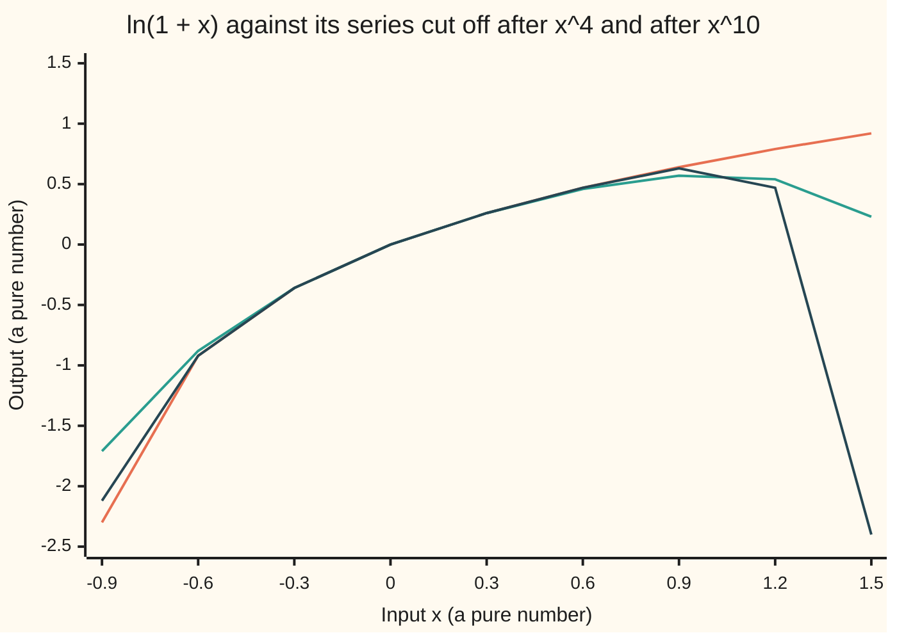

# Power series: polynomials that never stop, and the radius inside which they behave

[Syllabus](../../../SYLLABUS.md) → [Calculus and analysis](../../../SYLLABUS.md#w06) → [Series](../../../SYLLABUS.md#w06-s06) → Power series

---

## General Overview

A calculator chip can add and multiply, but has no circuit for the natural log of 1.5. It runs a recipe of adds and multiplies instead: 0.500000 − 0.125000 + 0.041667 − 0.015625 + … Twenty terms give 0.405465093. The true value is 0.405465108.

The recipe is a polynomial that never stops. At 0.5 its terms shrink fast; at 1.1 the x^100 term alone is −137.81. So it comes with a fence: inside it works, outside it fails, and each fence post must be checked by hand.

Two recipes run through this card: 1 + x + x^2 + …, which adds up to 1/(1 − x), and x − x^2/2 + x^3/3 − …, which adds up to ln(1 + x) and comes from the first by integrating term by term. From here on a recipe is a **power series**, the fence's half-width its **radius of convergence**, and the two posts its **endpoints**.

**A power series converges at every input nearer its centre than a distance R, fails farther away, must be tested separately at the two inputs exactly R away, and inside can be differentiated and integrated term by term.**

**What kind of fact this is:** a theorem, proved on this card in Why it works; the power series itself is a definition.

### The picture: the log and two of its partial sums



Orange is ln(1 + x), computed as an area; teal, the series cut after x^4; dark blue, after x^10. From −0.3 to 0.3 all agree to two decimals. Past the fence, at 1.5, extra terms hurt: −2.40 against 0.92.

---

## The formula

A power series has a centre c, fixed numbers $a_n$ called coefficients, and an input x. The bars in $|x - c|$ mean the distance from x to c. A sigma sign running to infinity means the limit of partial sums ([Infinite series](01-series-convergence.md)).

$$f(x) = \sum_{n=0}^{\infty} a_n (x-c)^n = a_0 + a_1 (x-c) + a_2 (x-c)^2 + \cdots$$

**Read it aloud:** f of x is where the sums of more and more terms head, each term a fixed number times a power of the distance from the centre.

$$R = \frac{1}{L}, \qquad L = \lim_{n\to\infty} \left| \frac{a_{n+1}}{a_n} \right|$$

**Read it aloud:** the radius is one over the limit of neighbouring coefficient ratios; L = 0 means no fence, and L infinite means only the centre works.

$$f'(x) = \sum_{n=1}^{\infty} n\, a_n (x-c)^{n-1}, \qquad \int_c^x f(t)\,dt = \sum_{n=0}^{\infty} \frac{a_n}{n+1} (x-c)^{n+1}, \qquad |x - c| < R$$

**Read it aloud:** strictly inside the radius, differentiate or integrate each term; both new series have radius R.

The card's two series, centred at c = 0:

$$\frac{1}{1-x} = \sum_{n=0}^{\infty} x^n, \qquad \ln(1+x) = \sum_{n=1}^{\infty} \frac{(-1)^{n+1}}{n}\, x^n$$

| Symbol | Plain meaning | In our example | Push it up and the answer… |
| --- | --- | --- | --- |
| $x$, $t$ | the input; t is a stand-in input inside an integral | x = 0.5; endpoints −1 and 1 | nearer an endpoint, slower convergence |
| $n$, $N$ | n counts terms; N is the last power kept | N = 20 | larger N, smaller gap inside |
| $a_n$ | the coefficient of the n-th power | 1; and (−1)^(n+1)/n for the log | faster growth, smaller radius |
| $c$ | the centre | 0 | slides the fence |
| $f$ | the function the series adds up to | 1/(1 − x), ln(1 + x) | — |
| $S_N$ | partial sum: terms through the N-th power | S_20(0.5) = 0.405465093, log | heads for f(x) inside |
| $R$, $L$ | radius; limit of coefficient ratios, R = 1/L | L = 1, R = 1 | larger L, smaller R |
| $d$, $M$ | in the proof: a working distance, and a ceiling on the terms there | d below 1 | — |

### When it holds

- **Strictly inside.** At distance exactly R the theorem is silent: the two series here behave differently at their endpoints.
- **The ratio formula needs a limit.** If ratios never settle, or coefficients vanish, R still exists (Step 1) but the root test finds it ([Convergence tests](02-comparison-ratio-and-root-tests.md)).
- **Term by term only inside.** At x = 1 the log series converges; its differentiated series 1 − 1 + 1 − … does not.

---

## Why it works

### Step 0: at a fixed input, a power series is a plain series

At x = 0.5, 1 + x + x^2 + … is 1 + 0.5 + 0.25 + …, the shelf's house example, adding up to 2. Each fixed input gives an ordinary series, decided by comparing with a geometric one.

### Step 1: working at one distance forces working at every smaller distance

Say the series converges at distance d from the centre. Its terms shrink to zero, so none exceeds some ceiling M. At a nearer input the n-th term is at most M times (|x − c|/d)^n, a geometric series with ratio below 1, so it converges, even with every term made positive.

So the working inputs fill a stretch around c with no holes. Let R be the least upper bound (sup) of the working distances. Anything nearer than R lies below some working distance, so works; anything farther cannot work, or R would not be an upper bound.

### Step 2: the ratio test measures the fence

Neighbouring terms have ratio $|a_{n+1}/a_n|$ times |x − c|, heading for L times |x − c|. Below 1 converges, above 1 diverges, so R = 1/L. For the log the ratio n/(n + 1) is 0.999001 at n = 1,000, heading for 1; for 1/(1 − x) it is 1. Both radii are 1.

### Step 3: the endpoints are separate questions

At distance R the ratio heads for exactly 1 and the test is silent.

- **1/(1 − x) at 1:** 1 + 1 + 1 + …; through x^99 the sum is 100. Diverges.
- **1/(1 − x) at −1:** sums run 1, 0, 1, 0. Diverges.
- **Log at −1:** minus the harmonic series, −7.485471 after 1,000 terms. Diverges.
- **Log at 1:** 1 − 1/2 + 1/3 − …, which converges ([Alternating series](03-alternating-and-conditional-convergence.md)); Step 5 proves it equals ln 2.

So 1/(1 − x) works for −1 < x < 1; the log for −1 < x ≤ 1.

### Step 4: inside, differentiate and integrate term by term

Fix x inside and a distance d between |x − c| and R. The differentiated terms are at most n times a geometric series with ratio below 1, and n grows slower than the geometric factor shrinks, so they converge. That this sum is the slope of f takes a bound on the gap, folded below. For integration, the tail beyond N terms is small at every point from c to x at once, so its integral is small.

<details>
<summary>Detailed proof</summary>

Take c = 0, |x| < r < d < R. Convergence at d gives $|a_n| d^n \le M$.

**Slope.** For |x + h| ≤ r, the mean value theorem applied twice to $y^n$ gives $|((x+h)^n - x^n)/h - n x^{n-1}| \le |h|\, n(n-1)\, r^{n-2}$. Summed, the gap between f's difference quotient and $\sum n a_n x^{n-1}$ is at most $|h| (M/r^2) \sum n(n-1)(r/d)^n$. That sum converges by the ratio test, so the gap is a constant times |h|; for any tolerance ε, |h| below ε over the constant works.

**Same radius.** Convergence of the differentiated series at |y| > R would, by Step 1, give absolute convergence at some z with R < |z| < |y|; since $|a_n z^n| \le |z| \cdot n |a_n| |z|^{n-1}$, the original would converge beyond R. The integrated series has the original as its derivative series, so its radius is R too.

**Integral.** For |t| ≤ |x| the tail beyond N terms is at most $\sum_{n>N} M (|x|/d)^n$, a number independent of t that heads for 0; its integral is at most |x| times that.

</details>

### Step 5: the log series and its error, from the geometric series

Replace x by −t: 1/(1 + t) = 1 − t + t^2 − … for |t| < 1. Integrate each term from 0 to x. The antiderivative of 1/(1 + t) is ln(1 + t), so ln(1 + x) = x − x^2/2 + x^3/3 − …

A finite version gives the error. The finite geometric sum says 1/(1 + t) is 1 − t + … ± t^(N−1) plus a remainder ±t^N/(1 + t). Integrating from 0 to x, for x from 0 to 1, ln(1 + x) is $S_N(x)$ plus at most the area under t^N: x^(N+1)/(N + 1).

At x = 0.5, N = 20 the bound is 0.000000023. At x = 1 it is 1/(N + 1), heading for 0, so the log series at 1 equals ln 2. To land within 0.001 of ln 2, N = 1,000 is enough: the actual gap is 0.000500.

Differentiating instead gives 1 + 2x + 3x^2 + … = 1/(1 − x)^2, which is 4 at 0.5. Where coefficients come from is [Taylor series](05-taylor-series.md); the general rules for passing limits through integrals and derivatives are [Swapping limits](08-swapping-limits-with-integrals-and-derivatives.md).

---

## Worked numbers, by hand

| Step | Arithmetic | Value |
| --- | --- | --- |
| Log coefficient ratio | n/(n + 1) at n = 1,000 | 0.999001, heading for 1 |
| Radius | R = 1/L | **1** |
| Geometric at 0.5, through x^20 | 2 − 0.5^20 | 1.999999046 |
| Log at 0.5, through x^20 | 0.500000 − 0.125000 + 0.041667 − … | **0.405465093** |
| Gap to the area under 1/(1 + t), 0.405465108 | bound 0.5^21/21 | 0.000000015 ≤ 0.000000023 |
| Slope of 1/(1 − x) at 0.5 | 1 + 2(0.5) + … + 20(0.5)^19 | 3.999958038, against 4 |
| Log at 1 and at −1, 1,000 terms | 1 − 1/2 + …; −(1 + 1/2 + …) | 0.692647 (ln 2 = 0.693147); −7.485471 |
| Where each works | Steps 2 and 3 | 1/(1 − x): −1 < x < 1; log: **−1 < x ≤ 1** |

Twenty adds and multiplies give ln 1.5 to seven decimals, as the bound promised.

### What breaks if you drop a piece

| Mistake | Comes out at | What went wrong |
| --- | --- | --- |
| Take both log endpoints because R = 1 | −7.485471 at x = −1 after 1,000 terms, falling | endpoints need their own test |
| Differentiate at x = 1, where the log converges | slope sums 1, 0, 1, 0, 1, 0 | term by term holds only strictly inside |
| Use the series at x = 1.1 | x^100 term: −137.81 for the log, 13780.61 for 1/(1 − x) | growing terms have no sum |
| Same N for slope as for value | value gap 0.000000954, slope gap 0.000042 | term n is multiplied by n |

---

## Code, from first principles, and it actually runs

Nothing is imported. Road one adds the series, and the differentiated geometric series, term by term. Road two shares no arithmetic with it: the closed form, a Simpson's-rule area under 1/(1 + t), and a difference quotient. Four asserts compare the roads; each failed when the maths was broken on purpose.

### Python

```python
# Power series -- the check behind the card.  Nothing is imported.
# Road one: partial sums of the two series, and their term-by-term slope.
# Road two, sharing no arithmetic with road one: the closed form 1/(1-x), a
# Simpson sum for the area under 1/(1+t) from 0 to x, which is ln(1+x), and a
# shrinking difference quotient for the slope of 1/(1-x).
def geo(x, N):                          # 1 + x + x^2 + ... + x^N
    return sum(x**n for n in range(N + 1))

def geo_slope(x, N):                    # term by term: 1 + 2x + 3x^2 + ... + N x^(N-1)
    return sum(n * x**(n - 1) for n in range(1, N + 1))

def ln_series(x, N):                    # x - x^2/2 + x^3/3 - ... through the x^N term
    return sum((-1)**(n + 1) * x**n / n for n in range(1, N + 1))

def ln_area(x, m=4000):                 # Simpson's rule: area under 1/(1+t) from 0 to x
    h = x / m
    s = 1 + 1 / (1 + x) + sum((4 if k % 2 else 2) / (1 + k * h) for k in range(1, m))
    return s * h / 3

def row(vals):
    return ", ".join(f"{v:.2f}" for v in vals)

x, N = 0.5, 20
g, closed = geo(x, N), 1 / (1 - x)
s, area = ln_series(x, N), ln_area(x)
h, slope = 1e-5, geo_slope(x, N)
dq = (1 / (1 - x - h) - 1 / (1 - x + h)) / (2 * h)
tail = ((N + 1) * x**N - N * x**(N + 1)) / (1 - x)**2
ln2 = ln_area(1.0)
print(f"radius: coefficient ratio 1 for 1/(1-x); n/(n+1) = {1000 / 1001:.6f} at n = 1000 for ln(1+x)")
print(f"1/(1-x) at {x}, through x^{N}: {g:.9f}; closed form {closed:.9f}; gap {closed - g:.9f}")
print(f"ln(1+x) at {x}, through x^{N}: {s:.9f}; Simpson area {area:.9f}; gap {abs(s - area):.9f}; bound {x**(N + 1) / (N + 1):.9f}")
print(f"slope of 1/(1-x) at {x}, through {N}x^{N - 1}: {slope:.9f}; difference quotient {dq:.6f}; gap {dq - slope:.6f}")
for M in (10, 100, 1000):
    v = ln_series(1.0, M)
    print(f"N = {M}: x = 1 sum {v:.6f}, ln 2 = {ln2:.6f}, gap {abs(v - ln2):.6f} <= 1/(N+1) = {1 / (M + 1):.6f}; x = -1 sum {ln_series(-1.0, M):.6f}")
print(f"1/(1-x) at x = 1: sum through x^99 = {geo(1.0, 99):.0f}; at x = -1 sums run {row(geo(-1.0, k) for k in range(6))}")
print(f"slope series of ln(1+x) at x = 1, 1 - 1 + 1 - ...: sums run {row(sum((-1)**(n + 1) * 1.0**(n - 1) for n in range(1, k + 1)) for k in range(1, 7))}")
print(f"log terms at {x}: {', '.join(f'{(-1)**(n + 1) * x**n / n:.6f}' for n in range(1, 5))}; at x = 2, 1/(1-x) = {1 / (1 - 2):.2f} but terms run {row(2.0**n for n in range(4))}")
print(f"outside, x = 1.1: x^100 term of 1/(1-x) is {1.1**100:.2f}; of ln(1+x) is {-1.1**100 / 100:.2f}")
xs = [(3 * k - 9) / 10 for k in range(9)]
print(f"chart, x: {row(xs)}")
print(f"chart, ln(1+x) by Simpson: {row(ln_area(t) for t in xs)}")
print(f"chart, through x^4: {row(ln_series(t, 4) for t in xs)}")
print(f"chart, through x^10: {row(ln_series(t, 10) for t in xs)}")
assert abs(closed - g) <= x**(N + 1) / (1 - x) + 1e-15      # partial sum against closed form
assert abs(s - area) <= x**(N + 1) / (N + 1) + 1e-12          # term-by-term integral against area
assert abs((dq - slope) - tail) < 1e-8                        # slope gap is the predicted tail
assert all(abs(ln_series(1.0, M) - ln2) <= 1 / (M + 1) for M in (10, 100, 1000))
print("ALL CHECKS PASS")
```

**Ran 2026-09-27 on macOS, Python 3.14.6, standard library only. All checks passed. Output, pasted from the run:**

```
radius: coefficient ratio 1 for 1/(1-x); n/(n+1) = 0.999001 at n = 1000 for ln(1+x)
1/(1-x) at 0.5, through x^20: 1.999999046; closed form 2.000000000; gap 0.000000954
ln(1+x) at 0.5, through x^20: 0.405465093; Simpson area 0.405465108; gap 0.000000015; bound 0.000000023
slope of 1/(1-x) at 0.5, through 20x^19: 3.999958038; difference quotient 4.000000; gap 0.000042
N = 10: x = 1 sum 0.645635, ln 2 = 0.693147, gap 0.047512 <= 1/(N+1) = 0.090909; x = -1 sum -2.928968
N = 100: x = 1 sum 0.688172, ln 2 = 0.693147, gap 0.004975 <= 1/(N+1) = 0.009901; x = -1 sum -5.187378
N = 1000: x = 1 sum 0.692647, ln 2 = 0.693147, gap 0.000500 <= 1/(N+1) = 0.000999; x = -1 sum -7.485471
1/(1-x) at x = 1: sum through x^99 = 100; at x = -1 sums run 1.00, 0.00, 1.00, 0.00, 1.00, 0.00
slope series of ln(1+x) at x = 1, 1 - 1 + 1 - ...: sums run 1.00, 0.00, 1.00, 0.00, 1.00, 0.00
log terms at 0.5: 0.500000, -0.125000, 0.041667, -0.015625; at x = 2, 1/(1-x) = -1.00 but terms run 1.00, 2.00, 4.00, 8.00
outside, x = 1.1: x^100 term of 1/(1-x) is 13780.61; of ln(1+x) is -137.81
chart, x: -0.90, -0.60, -0.30, 0.00, 0.30, 0.60, 0.90, 1.20, 1.50
chart, ln(1+x) by Simpson: -2.30, -0.92, -0.36, 0.00, 0.26, 0.47, 0.64, 0.79, 0.92
chart, through x^4: -1.71, -0.88, -0.36, 0.00, 0.26, 0.46, 0.57, 0.54, 0.23
chart, through x^10: -2.12, -0.92, -0.36, 0.00, 0.26, 0.47, 0.63, 0.47, -2.40
ALL CHECKS PASS
```

### Rust

Same rows and labels, built with `rustc --edition 2021 -O`; outputs agree byte for byte.

```rust
// Power series -- the same check as the Python, in Rust, std only.
// Road one: partial sums of the two series, and their term-by-term slope.
// Road two, sharing no arithmetic with road one: the closed form 1/(1-x), a
// Simpson sum for the area under 1/(1+t) from 0 to x, which is ln(1+x), and a
// shrinking difference quotient for the slope of 1/(1-x).
fn geo(x: f64, n: i32) -> f64 { // 1 + x + x^2 + ... + x^N
    (0..=n).fold(0.0, |a, k| a + x.powf(k as f64))
}
fn geo_slope(x: f64, n: i32) -> f64 { // term by term: 1 + 2x + 3x^2 + ... + N x^(N-1)
    (1..=n).fold(0.0, |a, k| a + k as f64 * x.powf((k - 1) as f64))
}
fn sign(n: i32) -> f64 { if n % 2 == 1 { 1.0 } else { -1.0 } } // (-1)^(n+1)
fn ln_series(x: f64, n: i32) -> f64 { // x - x^2/2 + x^3/3 - ... through the x^N term
    (1..=n).fold(0.0, |a, k| a + sign(k) * x.powf(k as f64) / k as f64)
}
fn ln_area(x: f64) -> f64 { // Simpson's rule: area under 1/(1+t) from 0 to x
    let m = 4000;
    let h = x / m as f64;
    let inner = (1..m).fold(0.0, |a, k| a + (if k % 2 == 1 { 4.0 } else { 2.0 }) / (1.0 + k as f64 * h));
    (1.0 + 1.0 / (1.0 + x) + inner) * h / 3.0
}
fn row(v: &[f64]) -> String {
    v.iter().map(|t| format!("{:.2}", t)).collect::<Vec<_>>().join(", ")
}
fn main() {
    let (x, n) = (0.5_f64, 20);
    let (g, closed) = (geo(x, n), 1.0 / (1.0 - x));
    let (s, area) = (ln_series(x, n), ln_area(x));
    let (h, slope) = (1e-5, geo_slope(x, n));
    let dq = (1.0 / (1.0 - x - h) - 1.0 / (1.0 - x + h)) / (2.0 * h);
    let tail = ((n + 1) as f64 * x.powf(n as f64) - n as f64 * x.powf((n + 1) as f64)) / (1.0 - x).powf(2.0);
    let ln2 = ln_area(1.0);
    println!("radius: coefficient ratio 1 for 1/(1-x); n/(n+1) = {:.6} at n = 1000 for ln(1+x)", 1000.0 / 1001.0);
    println!("1/(1-x) at {}, through x^{}: {:.9}; closed form {:.9}; gap {:.9}", x, n, g, closed, closed - g);
    println!("ln(1+x) at {}, through x^{}: {:.9}; Simpson area {:.9}; gap {:.9}; bound {:.9}", x, n, s, area, (s - area).abs(), x.powf((n + 1) as f64) / (n + 1) as f64);
    println!("slope of 1/(1-x) at {}, through {}x^{}: {:.9}; difference quotient {:.6}; gap {:.6}", x, n, n - 1, slope, dq, dq - slope);
    for m in [10, 100, 1000] {
        let v = ln_series(1.0, m);
        println!("N = {}: x = 1 sum {:.6}, ln 2 = {:.6}, gap {:.6} <= 1/(N+1) = {:.6}; x = -1 sum {:.6}",
            m, v, ln2, (v - ln2).abs(), 1.0 / (m + 1) as f64, ln_series(-1.0, m));
    }
    let ends: Vec<f64> = (0..6).map(|k| geo(-1.0, k)).collect();
    println!("1/(1-x) at x = 1: sum through x^99 = {:.0}; at x = -1 sums run {}", geo(1.0, 99), row(&ends));
    let slopes: Vec<f64> = (1..7).map(|k| (1..=k).fold(0.0, |a, j| a + sign(j) * 1.0_f64.powf((j - 1) as f64))).collect();
    println!("slope series of ln(1+x) at x = 1, 1 - 1 + 1 - ...: sums run {}", row(&slopes));
    let terms: Vec<String> = (1..5).map(|k| format!("{:.6}", sign(k) * x.powf(k as f64) / k as f64)).collect();
    let doubling: Vec<f64> = (0..4).map(|k| 2.0_f64.powf(k as f64)).collect();
    println!("log terms at {}: {}; at x = 2, 1/(1-x) = {:.2} but terms run {}", x, terms.join(", "), 1.0 / (1.0 - 2.0), row(&doubling));
    println!("outside, x = 1.1: x^100 term of 1/(1-x) is {:.2}; of ln(1+x) is {:.2}", 1.1_f64.powf(100.0), -1.1_f64.powf(100.0) / 100.0);
    let xs: Vec<f64> = (0..9).map(|k| (3 * k - 9) as f64 / 10.0).collect();
    println!("chart, x: {}", row(&xs));
    println!("chart, ln(1+x) by Simpson: {}", row(&xs.iter().map(|&t| ln_area(t)).collect::<Vec<_>>()));
    println!("chart, through x^4: {}", row(&xs.iter().map(|&t| ln_series(t, 4)).collect::<Vec<_>>()));
    println!("chart, through x^10: {}", row(&xs.iter().map(|&t| ln_series(t, 10)).collect::<Vec<_>>()));
    assert!((closed - g).abs() <= x.powf((n + 1) as f64) / (1.0 - x) + 1e-15); // partial sum against closed form
    assert!((s - area).abs() <= x.powf((n + 1) as f64) / (n + 1) as f64 + 1e-12); // term-by-term integral against area
    assert!(((dq - slope) - tail).abs() < 1e-8); // slope gap is the predicted tail
    assert!([10, 100, 1000].iter().all(|&m| (ln_series(1.0, m) - ln2).abs() <= 1.0 / (m + 1) as f64));
    println!("ALL CHECKS PASS");
}
```

**Ran 2026-09-27 on macOS, rustc 1.98.1, no crates. All checks passed. Output, pasted from the run:**

```
radius: coefficient ratio 1 for 1/(1-x); n/(n+1) = 0.999001 at n = 1000 for ln(1+x)
1/(1-x) at 0.5, through x^20: 1.999999046; closed form 2.000000000; gap 0.000000954
ln(1+x) at 0.5, through x^20: 0.405465093; Simpson area 0.405465108; gap 0.000000015; bound 0.000000023
slope of 1/(1-x) at 0.5, through 20x^19: 3.999958038; difference quotient 4.000000; gap 0.000042
N = 10: x = 1 sum 0.645635, ln 2 = 0.693147, gap 0.047512 <= 1/(N+1) = 0.090909; x = -1 sum -2.928968
N = 100: x = 1 sum 0.688172, ln 2 = 0.693147, gap 0.004975 <= 1/(N+1) = 0.009901; x = -1 sum -5.187378
N = 1000: x = 1 sum 0.692647, ln 2 = 0.693147, gap 0.000500 <= 1/(N+1) = 0.000999; x = -1 sum -7.485471
1/(1-x) at x = 1: sum through x^99 = 100; at x = -1 sums run 1.00, 0.00, 1.00, 0.00, 1.00, 0.00
slope series of ln(1+x) at x = 1, 1 - 1 + 1 - ...: sums run 1.00, 0.00, 1.00, 0.00, 1.00, 0.00
log terms at 0.5: 0.500000, -0.125000, 0.041667, -0.015625; at x = 2, 1/(1-x) = -1.00 but terms run 1.00, 2.00, 4.00, 8.00
outside, x = 1.1: x^100 term of 1/(1-x) is 13780.61; of ln(1+x) is -137.81
chart, x: -0.90, -0.60, -0.30, 0.00, 0.30, 0.60, 0.90, 1.20, 1.50
chart, ln(1+x) by Simpson: -2.30, -0.92, -0.36, 0.00, 0.26, 0.47, 0.64, 0.79, 0.92
chart, through x^4: -1.71, -0.88, -0.36, 0.00, 0.26, 0.46, 0.57, 0.54, 0.23
chart, through x^10: -2.12, -0.92, -0.36, 0.00, 0.26, 0.47, 0.63, 0.47, -2.40
ALL CHECKS PASS
```

> [!TIP]
> **Try changing**
> Guess first, then run it.
> - **Move to the fence.** `x, N = 0.9, 20`: the geometric gap becomes 1.094189891, the slope gap 36.472997, and the third assert stops the run: the difference quotient's own error, 0.000001, exceeds its tolerance.
> - **Double the terms.** `x, N = 0.5, 40`: every gap prints as zero and all asserts pass.
> - **Starve the area.** `m=4000` to `m=4`: the area reads 0.405471380, a gap of 0.000006288 against a bound of 0.000000023, and the second assert stops it.

---

## The usual mistake

> [!warning]
> **Reading the endpoints off the radius.** Both series have R = 1, yet 1/(1 − x) fails at both endpoints while the log fails at −1 and converges at 1.
>
> - **Trusting the closed form past the fence.** 1/(1 − x) at x = 2 is −1.00; the series 1 + 2 + 4 + 8 + … has no sum.
> - **Differentiating at an endpoint.** The log converges at 1; its derivative series has sums 1, 0, 1, 0.

---

## Where you meet it in real life

- **Calculators.** Logs come from polynomials, on inputs first shrunk towards the centre so few terms are needed.
- **Finance.** The geometric series prices a perpetual bond, the shelf's house example; x times its derivative, x + 2x^2 + 3x^3 + …, weights each payment by its date; divided by the price, it gives the bond's duration.
- **Differential equations.** Solutions are sought as power series, and the radius says how far to trust them: [Series solutions](../../08-Differential%20equations%20and%20dynamics/07-Series%20Solutions%20and%20Boundary%20Problems/01-power-series-at-an-ordinary-point.md).

> **Say it back**
> A power series is a polynomial that never stops, read as the limit of its partial sums. Working at one distance forces working at every smaller one, so one radius R splits inside from outside. Coefficient ratios find R; the two points exactly R away are tested one by one. Inside, term-by-term calculus holds, and integrating 1 − t + t^2 − … gives the log series with its error bound.

---

## What this builds on

- [Convergence tests](02-comparison-ratio-and-root-tests.md): geometric comparison and the ratio test, which find the radius.

## Where this goes next

- [Taylor series](05-taylor-series.md): the coefficients a function's own derivatives force.
- [Power series in the plane](../../07-Complex%20analysis/02-Holomorphic%20Functions/02-complex-power-series.md): the fence becomes a circle, explaining the radius.
- [Series solutions](../../08-Differential%20equations%20and%20dynamics/07-Series%20Solutions%20and%20Boundary%20Problems/01-power-series-at-an-ordinary-point.md): solving for a function by solving for its coefficients.
- Weierstrass and the minimax fit: polynomials good over a whole interval.

---

## Sources

Verified 2026-09-27: every link below resolves to the publisher's page.

- Lebl, Jiří. *Basic Analysis I & II*. [Section 2.6, More on series](https://www.jirka.org/ra/html/sec_moreonseries.html): the radius and endpoints. [Section 6.2, Interchange of limits](https://www.jirka.org/ra/html/sec_liminter.html): term-by-term calculus.
- Abbott, Stephen. *Understanding Analysis*, 2nd ed. Springer, 2015. [DOI 10.1007/978-1-4939-2712-8](https://doi.org/10.1007/978-1-4939-2712-8). Proves the radius from bounded terms, as Step 1 does.
- OpenStax. *Calculus Volume 2*, Rice University. [6.2 Properties of Power Series](https://openstax.org/books/calculus-volume-2/pages/6-2-properties-of-power-series): the log series by term-by-term integration.
