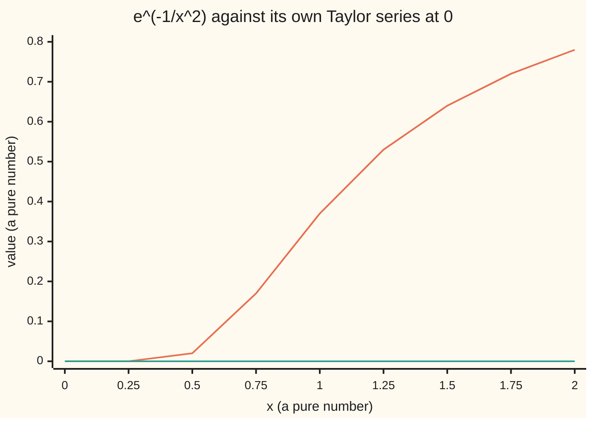

# Taylor series: when the polynomial stand-ins converge to the function

[Syllabus](../../../SYLLABUS.md) → [Calculus and analysis](../README.md) → [Series](../README.md#s06) → Taylor series

---

## General Overview

A calculator asked for e squared cannot look it up. It adds. Start with 1, add 2, add 4 over 2, add 8 over 6: each piece is a power of 2 divided by a factorial (1 × 2 × … up to that count). Six pieces give 7.2666666667. Twenty-one give 7.3890560989, e squared to every digit shown.

The pieces come from one recipe: read a function's value and every rate of change at one point, and build the polynomial that matches them. For e to the x, sin, cos and the natural log, the error falls below any tolerance named in advance.

It does not always work. The function e to the minus 1 over x squared, set to 0 at x = 0, is smooth, yet every rate of change at 0 is zero, so its recipe gives 0. At x = 0.5 the function is 0.0183156389 and the series says 0.

**A function equals its Taylor series exactly where the leftover from Taylor's theorem shrinks to zero: for exp, sin and cos at every x, for ln(1 + x) with x above −1 and at most 1, and for some smooth functions nowhere but the centre.**

**What kind of fact this is:** a theorem, proved on this card in Why it works.

### The picture: a smooth function its series cannot see



Orange: the function, rounded to two places. Green: its Taylor series at 0, zero everywhere. The curve is so flat at 0 that every derivative there is 0; Step 5 proves it.

---

## The formula

A reminder of notation from [Taylor's theorem](../03-What%20Derivatives%20Tell%20You/05-taylors-theorem.md): $f^{(k)}(a)$ is the k-th derivative of $f$ at the point $a$, with $f^{(0)}$ the function itself. The Taylor series of $f$ centred at $a$ is

$$f(x)\stackrel{?}{=}\sum_{k=0}^{\infty}\frac{f^{(k)}(a)}{k!}\,(x-a)^k$$

**Read it aloud:** the k-th derivative at the centre, over k factorial, times the k-th power of the distance from the centre, added over every k.

The question mark is the point. The right side is a power series ([Power series](04-power-series.md)); whether it adds up to $f(x)$ is a separate fact. Stopping after term n gives the Taylor polynomial $T_n$, and Taylor's theorem gives the leftover exactly:

$$R_n(x)=f(x)-T_n(x)=\frac{f^{(n+1)}(\xi)}{(n+1)!}\,(x-a)^{n+1}$$

for some point $\xi$ between $a$ and $x$. The series equals $f(x)$ exactly when this leftover heads for 0 as $n$ grows. With centre 0, the four series proved here:

$$e^x=1+x+\frac{x^2}{2!}+\frac{x^3}{3!}+\cdots\qquad\text{every } x$$

$$\sin x=x-\frac{x^3}{3!}+\frac{x^5}{5!}-\cdots\qquad\cos x=1-\frac{x^2}{2!}+\frac{x^4}{4!}-\cdots\qquad\text{every } x$$

$$\ln(1+x)=x-\frac{x^2}{2}+\frac{x^3}{3}-\cdots\qquad-1<x\le1$$

| Symbol | Plain meaning | In our example | Push it up and the answer… |
| --- | --- | --- | --- |
| $f$ | the function rebuilt | e to the x | — |
| $x$, $a$ | the input; the centre | x = 2, a = 0 | farther x, more terms |
| $k$, $n$, $k!$ | term counter; last term kept; 1 × 2 × … × k | n = 5, then 10 | smaller error, where it converges |
| $f^{(k)}(a)$ | the k-th derivative at the centre | 1 for every k | bigger coefficient |
| $T_n(x)$ | Taylor polynomial: terms 0 to n | T_5(2) = 7.2666666667 | closes on e squared |
| $R_n(x)$ | the leftover f(x) − T_n(x) | 0.1224 at n = 5 | shrinks when the series works |
| $\xi$ | an unknown point between a and x | in 0 to 2 | — |
| $g$, $h$ | the impostor e^(−1/x^2), with g(0) = 0; h a small step | g(0.5) = 0.0183156389 | its series stays 0 |

### When it holds

- **Every derivative exists near the centre.** The size of x, cubed, has no third derivative at 0, so its series cannot be written.
- **The leftover shrinks to zero.** Derivatives alone are not enough: the impostor $g$ has all of them and still misses by 0.0183156389 at x = 0.5.
- **The input lies inside the radius of convergence** (the distance from the centre within which the series adds up). For ln(1 + x) it is 1; at x = 1.5 the sums of 10, 20 and 40 terms run −2.4, −96.8, −164192.6.

---

## Why it works

### Step 0: the leftover is the whole story

Taylor's theorem gives the error $R_n(x)$ exactly, up to the unknown point $\xi$. So bound that derivative over the stretch from $a$ to $x$, and show the bound heads for 0.

### Step 1: a factorial outruns any power

Take x = 2. The quantity 2 to the (n + 1), over (n + 1)!, gains a factor 2/(n + 2) each step. From n = 2 on that factor is at most 1/2, so the quantity at least halves each step. Any x behaves the same once n + 2 passes twice its size: a large x only delays it.

### Step 2: exp equals its series everywhere

Every derivative of e to the x is e to the x. Between 0 and 2 it is at most e squared, under 9 because e is under 3. So

$$\lvert R_n(2)\rvert\le9\cdot\frac{2^{n+1}}{(n+1)!}$$

and Step 1 sends it to 0. The tolerance game with real numbers: to land within 0.001 of e squared, the bound first drops under 0.001 at n = 10, where it reads 4.618e-04; the real error there is 6.139e-05. For a general x, e to the size of x replaces 9.

### Step 3: sin and cos equal their series everywhere

Each derivative of sin or cos is ±sin or ±cos, never above 1 in size. So the leftover is at most |x| to the (n + 1), over (n + 1)!, and Step 1 finishes it. At x = 2, n = 19: bound 4.310e-13, real error 4.075e-14. At 0, sin's derivatives cycle 0, 1, 0, −1, which leaves odd powers with alternating signs.

### Step 4: ln(1 + x), and the wall at 1

The geometric series with its exact leftover says, for t above −1,

$$\frac{1}{1+t}=1-t+t^2-\cdots+(-t)^{n-1}+\frac{(-t)^n}{1+t}$$

Integrate from 0 to x: the left side gives ln(1 + x), the polynomial gives $T_n(x)$, and the leftover becomes the integral of (−t) to the n over 1 + t. For |x| < 1, 1 + t stays at least 1 − |x|, so

$$\lvert R_n(x)\rvert\le\frac{\lvert x\rvert^{n+1}}{(n+1)(1-\lvert x\rvert)}$$

At x = 0.5, n = 20: bound 4.541e-08, real error 1.537e-08. At x = 1 the leftover is at most 1/(n + 1), so ln 2 = 1 − 1/2 + 1/3 − … holds, slowly: 1000 terms leave 4.998e-04. For |x| > 1 the terms x to the k, over k, grow without limit, so the sum cannot settle. At x = −1 the series is minus the harmonic series 1 + 1/2 + 1/3 + …, which diverges.

### Step 5: the smooth impostor

Let $g$ be e to the minus 1 over x squared, with g(0) = 0. At 0 every derivative is 0, so its series is 0 and $T_n(0.5) = 0$ for every n, while g(0.5) = 0.0183156389. The leftover never shrinks.

The proof is a race: e to the minus 1 over x squared shrinks faster than any power of x as x heads for 0. The difference quotient g(h)/h, heading for the first derivative, reads 6.944e-11, 3.720e-43 and 3.830e-173 at h = 0.2, 0.1 and 0.05. Divided by h to the 10th: 1.356e-04, 3.720e-34, 1.961e-161.

<details>
<summary>Detailed proof: every derivative of the impostor at 0 is 0</summary>

**Claim 1.** For x ≠ 0, the k-th derivative of g is a polynomial in 1/x times $e^{-1/x^2}$. True for k = 0. If true for k, the product and chain rules turn $p(1/x)\,e^{-1/x^2}$ into $\bigl(-p'(1/x)/x^2 + 2p(1/x)/x^3\bigr)e^{-1/x^2}$, again of that form.

**Claim 2.** For each whole number m, $e^{-1/x^2}/x^m$ heads for 0 as x does. Put s = 1/x^2 and pick a whole j > m/2. The exp series has positive terms, so $e^{s}>s^{j}/j!$, and the size is $s^{m/2}e^{-s}<j!\,s^{m/2-j}$: below any $\varepsilon>0$ once s is large, that is once |x| < δ for some δ > 0.

**Claim 3.** Induction on k. If the k-th derivative is 0 at 0, the next is the limit of $p(1/h)\,e^{-1/h^2}/h$, powers of 1/h times $e^{-1/h^2}$, which Claim 2 sends to 0. So every coefficient is 0, while g(x) > 0 for x ≠ 0.

</details>

A function equal to its Taylor series near every point is **analytic**. Exp, sin, cos and ln are; g is smooth (every derivative exists) but not analytic at 0, as Augustin-Louis Cauchy noted in the 1820s. Why the radius sits where it does, even when no break shows on the real line, is proved in [Taylor series in the plane](../../07-Complex%20analysis/04-Taylor%20Series%2C%20Zeros%20and%20Rigidity/01-taylor-series-in-the-plane.md).

---

## Worked numbers, by hand

| Step | Arithmetic | Value |
| --- | --- | --- |
| terms k = 0 to 2 | 1 + 2 + 4/2 | 5 |
| add terms k = 3 to 5 | 5 + 8/6 + 16/24 + 32/120 | T_5(2) = 7.2666666667 |
| true value | e squared | 7.3890560989 |
| real leftover | 7.3890560989 − 7.2666666667 | 0.1224 |
| leftover bound, n = 5 | 9 × 2^6 / 6! = 576/720 | 0.8 |
| terms needed for 0.001 | first n with 9 × 2^(n+1)/(n+1)! under 0.001 | **n = 10**, bound 4.618e-04 |

Eleven terms guarantee e squared to within 0.001 before the true value is ever consulted.

### What breaks if you drop a piece

| Mistake | Comes out at | What went wrong |
| --- | --- | --- |
| Trusting derivatives without the leftover | series gives 0 at x = 0.5; truth 0.0183156389 | smooth is not the same as analytic |
| Going past the radius | ln series at x = 1.5, 40 terms: −164192.6; truth 0.9163 | beyond 1 the terms grow |
| Dropping the factorials | 1 + 2 + 4 + … + 2^20 = 2097151 and climbing | powers alone never shrink |

The code prints all three.

---

## Code, from first principles, and it actually runs

Each term is the previous one times x over the next count, so no power or factorial routine is imported. Three roads meet: the partial sum, the library's closed form, and the leftover bound, which must cover the gap between them. The impostor's difference quotients shrink to zero while it stays positive.

### Python

```python
# Taylor series -- the check behind the card.  Standard library only.
# Road one: partial sums T_n(x), built term by term here.  Road two: the
# closed form (math.exp, sin, cos, log).  Road three: the remainder bound
# from Taylor's theorem, which must cover the gap between the first two.
import math

def taylor(pattern, x, n):               # exp, sin, cos: sign pattern times x^k/k!
    total, p = 0.0, 1.0
    for k in range(n + 1):
        total += pattern[k % 4] * p
        p = p * x / (k + 1)
    return total

def ln_taylor(x, n):                     # ln(1 + x) = x - x^2/2 + x^3/3 - ...
    total, p = 0.0, 1.0
    for k in range(1, n + 1):
        p *= x
        total += (1 if k % 2 else -1) * p / k
    return total

def bound(x, n, top):                    # top * |x|^(n+1) / (n+1)!
    b = top
    for j in range(1, n + 2):
        b = b * abs(x) / j
    return b

g = lambda x: 0.0 if x == 0 else math.exp(-1 / (x * x))   # the smooth impostor
sci = lambda v: f"{v:.3e}"
EXP, SIN, COS = (1, 1, 1, 1), (0, 1, 0, -1), (1, 0, -1, 0)

rows = []
for n in (2, 5, 10, 15, 20):
    t = taylor(EXP, 2.0, n)
    rows.append((abs(math.exp(2) - t), bound(2, n, 9)))
    print(f"exp(2), n = {n:2d}: T_n = {t:.10f}, error {sci(rows[-1][0])}, bound {sci(rows[-1][1])}")
need = next(n for n in range(50) if bound(2, n, 9) < 0.001)
print(f"exp(2) = {math.exp(2):.10f}; first n with bound under 0.001: {need} (bound {sci(bound(2, need, 9))})")
es = abs(taylor(SIN, 2.0, 19) - math.sin(2)); ec = abs(taylor(COS, 2.0, 18) - math.cos(2))
print(f"sin(2), n = 19: error {sci(es)}, bound {sci(bound(2, 19, 1))}")
print(f"cos(2), n = 18: error {sci(ec)}, bound {sci(bound(2, 18, 1))}")
el = abs(ln_taylor(0.5, 20) - math.log(1.5)); bl = 0.5 ** 21 / (21 * 0.5)
print(f"ln(1.5), n = 20: error {sci(el)}, bound {sci(bl)}")
e2 = abs(ln_taylor(1.0, 1000) - math.log(2))
print(f"ln(2), n = 1000: error {sci(e2)}, bound {sci(1 / 1001)}")
far = [ln_taylor(1.5, n) for n in (10, 20, 40)]
print(f"ln(2.5) = {math.log(2.5):.4f}, but T_10, T_20, T_40 at x = 1.5: {far[0]:.1f}, {far[1]:.1f}, {far[2]:.1f}")
print(f"impostor g(0.5) = {g(0.5):.10f}; every T_n(0.5) = 0, so the error stays {g(0.5):.10f}")
hs = (0.2, 0.1, 0.05)
print("g(h)/h at h = 0.2, 0.1, 0.05: " + ", ".join(sci(g(h) / h) for h in hs))
q10 = [g(h) / h ** 10 for h in hs]
print("g(h)/h^10 at h = 0.2, 0.1, 0.05: " + ", ".join(sci(v) for v in q10))
print(f"second difference at 0, h = 0.1: {sci((g(0.1) - 2 * g(0) + g(-0.1)) / 0.01)}")
print("chart, g(x) at x = 0, 0.25, ..., 2: " + " ".join(f"{g(i / 4):.2f}" for i in range(9)))
print(f"mistake, factorials dropped: 1 + 2 + 4 + ... + 2^20 = {sum(2 ** k for k in range(21))}")
assert all(err <= b for err, b in rows) and rows[-1][0] < 1e-12       # roads one, two, three agree
assert es <= bound(2, 19, 1) and ec <= bound(2, 18, 1) and el <= bl and e2 <= 1 / 1001
assert abs(far[2]) > 1000 * abs(math.log(2.5))                          # beyond radius 1: no convergence
assert g(0.5) > 0.018 and q10[0] > q10[1] > q10[2] and q10[2] < 1e-150  # flat to every order, yet not zero
print("ALL CHECKS PASS")
```

**Ran 2026-09-27 on macOS, Python 3.14.6, standard library only. All checks passed. Output, pasted from the run:**

```
exp(2), n =  2: T_n = 5.0000000000, error 2.389e+00, bound 1.200e+01
exp(2), n =  5: T_n = 7.2666666667, error 1.224e-01, bound 8.000e-01
exp(2), n = 10: T_n = 7.3889947090, error 6.139e-05, bound 4.618e-04
exp(2), n = 15: T_n = 7.3890560954, error 3.547e-09, bound 2.819e-08
exp(2), n = 20: T_n = 7.3890560989, error 4.619e-14, bound 3.694e-13
exp(2) = 7.3890560989; first n with bound under 0.001: 10 (bound 4.618e-04)
sin(2), n = 19: error 4.075e-14, bound 4.310e-13
cos(2), n = 18: error 4.273e-13, bound 4.310e-12
ln(1.5), n = 20: error 1.537e-08, bound 4.541e-08
ln(2), n = 1000: error 4.998e-04, bound 9.990e-04
ln(2.5) = 0.9163, but T_10, T_20, T_40 at x = 1.5: -2.4, -96.8, -164192.6
impostor g(0.5) = 0.0183156389; every T_n(0.5) = 0, so the error stays 0.0183156389
g(h)/h at h = 0.2, 0.1, 0.05: 6.944e-11, 3.720e-43, 3.830e-173
g(h)/h^10 at h = 0.2, 0.1, 0.05: 1.356e-04, 3.720e-34, 1.961e-161
second difference at 0, h = 0.1: 7.440e-42
chart, g(x) at x = 0, 0.25, ..., 2: 0.00 0.00 0.02 0.17 0.37 0.53 0.64 0.72 0.78
mistake, factorials dropped: 1 + 2 + 4 + ... + 2^20 = 2097151
ALL CHECKS PASS
```

### Rust

Same rows and labels, built with `rustc --edition 2021 -O`; the outputs agree byte for byte.

```rust
// Taylor series -- the same check as the Python, in Rust.  No crates.
// Road one: partial sums T_n(x), built term by term here.  Road two: the
// closed form (exp, sin, cos, ln).  Road three: the remainder bound from
// Taylor's theorem, which must cover the gap between the first two.
fn taylor(pattern: [f64; 4], x: f64, n: usize) -> f64 {  // sign pattern times x^k/k!
    let (mut total, mut p) = (0.0, 1.0);
    for k in 0..=n {
        total += pattern[k % 4] * p;
        p = p * x / (k + 1) as f64;
    }
    total
}
fn ln_taylor(x: f64, n: usize) -> f64 {                   // ln(1 + x) = x - x^2/2 + ...
    let (mut total, mut p) = (0.0, 1.0);
    for k in 1..=n {
        p *= x;
        total += if k % 2 == 1 { 1.0 } else { -1.0 } * p / k as f64;
    }
    total
}
fn bound(x: f64, n: usize, top: f64) -> f64 {             // top * |x|^(n+1) / (n+1)!
    let mut b = top;
    for j in 1..=n + 1 {
        b = b * x.abs() / j as f64;
    }
    b
}
fn g(x: f64) -> f64 { if x == 0.0 { 0.0 } else { (-1.0 / (x * x)).exp() } }  // the smooth impostor
fn sci(v: f64) -> String {                                // 1.234e-05, as Python prints it
    let s = format!("{:.3e}", v);
    let (m, e) = s.split_once('e').unwrap();
    let e: i32 = e.parse().unwrap();
    format!("{}e{}{:02}", m, if e < 0 { '-' } else { '+' }, e.abs())
}
fn main() {
    let (exp_p, sin_p, cos_p) = ([1.0, 1.0, 1.0, 1.0], [0.0, 1.0, 0.0, -1.0], [1.0, 0.0, -1.0, 0.0]);
    let e2x = 2.0f64.exp();
    let mut rows = vec![];
    for n in [2, 5, 10, 15, 20] {
        let t = taylor(exp_p, 2.0, n);
        rows.push(((e2x - t).abs(), bound(2.0, n, 9.0)));
        let (err, b) = rows[rows.len() - 1];
        println!("exp(2), n = {:2}: T_n = {:.10}, error {}, bound {}", n, t, sci(err), sci(b));
    }
    let need = (0..50).find(|&n| bound(2.0, n, 9.0) < 0.001).unwrap();
    println!("exp(2) = {:.10}; first n with bound under 0.001: {} (bound {})", e2x, need, sci(bound(2.0, need, 9.0)));
    let es = (taylor(sin_p, 2.0, 19) - 2.0f64.sin()).abs();
    let ec = (taylor(cos_p, 2.0, 18) - 2.0f64.cos()).abs();
    println!("sin(2), n = 19: error {}, bound {}", sci(es), sci(bound(2.0, 19, 1.0)));
    println!("cos(2), n = 18: error {}, bound {}", sci(ec), sci(bound(2.0, 18, 1.0)));
    let el = (ln_taylor(0.5, 20) - 1.5f64.ln()).abs();
    let bl = 0.5f64.powf(21.0) / (21.0 * 0.5);
    println!("ln(1.5), n = 20: error {}, bound {}", sci(el), sci(bl));
    let e2 = (ln_taylor(1.0, 1000) - 2.0f64.ln()).abs();
    println!("ln(2), n = 1000: error {}, bound {}", sci(e2), sci(1.0 / 1001.0));
    let far: Vec<f64> = [10, 20, 40].iter().map(|&n| ln_taylor(1.5, n)).collect();
    println!("ln(2.5) = {:.4}, but T_10, T_20, T_40 at x = 1.5: {:.1}, {:.1}, {:.1}", 2.5f64.ln(), far[0], far[1], far[2]);
    println!("impostor g(0.5) = {:.10}; every T_n(0.5) = 0, so the error stays {:.10}", g(0.5), g(0.5));
    let hs = [0.2, 0.1, 0.05];
    let q1: Vec<String> = hs.iter().map(|&h| sci(g(h) / h)).collect();
    println!("g(h)/h at h = 0.2, 0.1, 0.05: {}", q1.join(", "));
    let q10: Vec<f64> = hs.iter().map(|&h| g(h) / h.powf(10.0)).collect();
    let q10s: Vec<String> = q10.iter().map(|&v| sci(v)).collect();
    println!("g(h)/h^10 at h = 0.2, 0.1, 0.05: {}", q10s.join(", "));
    println!("second difference at 0, h = 0.1: {}", sci((g(0.1) - 2.0 * g(0.0) + g(-0.1)) / 0.01));
    let chart: Vec<String> = (0..9).map(|i| format!("{:.2}", g(i as f64 / 4.0))).collect();
    println!("chart, g(x) at x = 0, 0.25, ..., 2: {}", chart.join(" "));
    println!("mistake, factorials dropped: 1 + 2 + 4 + ... + 2^20 = {}", (0..21).map(|k| 1u64 << k).sum::<u64>());
    assert!(rows.iter().all(|&(err, b)| err <= b) && rows[4].0 < 1e-12);  // roads one, two, three agree
    assert!(es <= bound(2.0, 19, 1.0) && ec <= bound(2.0, 18, 1.0) && el <= bl && e2 <= 1.0 / 1001.0);
    assert!(far[2].abs() > 1000.0 * 2.5f64.ln().abs());                     // beyond radius 1: no convergence
    assert!(g(0.5) > 0.018 && q10[0] > q10[1] && q10[1] > q10[2] && q10[2] < 1e-150); // flat, yet not zero
    println!("ALL CHECKS PASS");
}
```

**Ran 2026-09-27 on macOS, rustc 1.98.1, no crates. All checks passed. Output, pasted from the run:**

```
exp(2), n =  2: T_n = 5.0000000000, error 2.389e+00, bound 1.200e+01
exp(2), n =  5: T_n = 7.2666666667, error 1.224e-01, bound 8.000e-01
exp(2), n = 10: T_n = 7.3889947090, error 6.139e-05, bound 4.618e-04
exp(2), n = 15: T_n = 7.3890560954, error 3.547e-09, bound 2.819e-08
exp(2), n = 20: T_n = 7.3890560989, error 4.619e-14, bound 3.694e-13
exp(2) = 7.3890560989; first n with bound under 0.001: 10 (bound 4.618e-04)
sin(2), n = 19: error 4.075e-14, bound 4.310e-13
cos(2), n = 18: error 4.273e-13, bound 4.310e-12
ln(1.5), n = 20: error 1.537e-08, bound 4.541e-08
ln(2), n = 1000: error 4.998e-04, bound 9.990e-04
ln(2.5) = 0.9163, but T_10, T_20, T_40 at x = 1.5: -2.4, -96.8, -164192.6
impostor g(0.5) = 0.0183156389; every T_n(0.5) = 0, so the error stays 0.0183156389
g(h)/h at h = 0.2, 0.1, 0.05: 6.944e-11, 3.720e-43, 3.830e-173
g(h)/h^10 at h = 0.2, 0.1, 0.05: 1.356e-04, 3.720e-34, 1.961e-161
second difference at 0, h = 0.1: 7.440e-42
chart, g(x) at x = 0, 0.25, ..., 2: 0.00 0.00 0.02 0.17 0.37 0.53 0.64 0.72 0.78
mistake, factorials dropped: 1 + 2 + 4 + ... + 2^20 = 2097151
ALL CHECKS PASS
```

> [!TIP]
> **Try changing**
> Guess first, then run it.
> - **Pretend e squared is under 1.** Change the `9` in the exp rows to `1`. The first assert fails: at n = 2 the bound drops below the real error 2.389.
> - **Step inside the wall.** Change `ln_taylor(1.5, n)` to `ln_taylor(0.9, n)`. The sums settle near ln 1.9 and the third assert fails.
> - **Lose the minus signs.** Set `SIN` to `(0, 1, 0, 1)`: the series of sinh, near 3.6269 at x = 2. The second assert fails.

---

## The usual mistake

> [!warning]
> **Believing that a function with every derivative equals its Taylor series.** Every derivative only lets the series be written. Whether it adds up to the function is the question of the leftover. The impostor's series is 0, and at x = 0.5 it misses by 0.0183156389 however many terms are kept.
>
> - **Using a series past its radius.** The ln(1 + x) series at x = 1.5 gives −164192.6 after 40 terms; the truth is 0.9163.
> - **Reading the bound as the error.** For exp at x = 2 with n = 5 the bound is 0.8 and the real leftover 0.1224. A bound is a ceiling, not an estimate.
> - **Forgetting the factorial.** The exp recipe without it is 1 + 2 + 4 + …, already 2097151 at the 20th power.

---

## Where you meet it in real life

- **Maths libraries.** Exp, sin and log routines shrink the input into a small range, then evaluate a short polynomial.
- **Small-angle physics.** A pendulum's sin x becomes x, with error at most |x| cubed over 6, by Step 3.
- **Finance.** Growth e to the rt is read as 1 + rt over short times, and ln(1 + r) as r for small returns.

> **Say it back**
> A Taylor series rebuilds a function from its derivatives at one point. The series equals the function where Taylor's leftover heads for 0. For exp, sin and cos a factorial beats bounded derivatives at every x; ln(1 + x) works for x above −1 up to 1. The function e to the minus 1 over x squared has every derivative 0 at 0, so its series is 0 and misses it everywhere else.

---

## What this builds on

- [Taylor's theorem](../03-What%20Derivatives%20Tell%20You/05-taylors-theorem.md): the Taylor polynomial and the exact leftover with its unknown point.
- [Power series](04-power-series.md): sums of powers, and the radius inside which they add up.

## Where this goes next

- [The binomial series and the number e](06-binomial-series-and-e.md): (1 + x) to any power, and e itself.
- [Stirling's approximation](09-stirlings-approximation.md): how big n! is.
- [Euler's formula](../../07-Complex%20analysis/01-Complex%20Numbers%20and%20the%20Plane/04-eulers-formula.md): the exp series splits into cos and sin.
- [Taylor series in the plane](../../07-Complex%20analysis/04-Taylor%20Series%2C%20Zeros%20and%20Rigidity/01-taylor-series-in-the-plane.md): why the radius is where it is.
- [Stirling's formula](../../07-Complex%20analysis/09-Special%20Functions%20and%20the%20Zeta%20Function/04-stirlings-formula.md): n! by complex tools.
- [Picard iteration](../../08-Differential%20equations%20and%20dynamics/02-Existence%2C%20Uniqueness%20and%20Sensitivity/01-picard-iteration.md): integration that rebuilds the exp series.
- [The matrix exponential](../../08-Differential%20equations%20and%20dynamics/04-Systems%20and%20the%20Matrix%20Exponential/04-the-matrix-exponential.md): the exp series for a matrix.
- [Order of a method](../../08-Differential%20equations%20and%20dynamics/05-Numerical%20Evolution/02-local-and-global-error-and-order.md): leftovers as step errors.
- [Series solutions](../../08-Differential%20equations%20and%20dynamics/07-Series%20Solutions%20and%20Boundary%20Problems/01-power-series-at-an-ordinary-point.md): equations solved by series.
- [The HJB equation](../../08-Differential%20equations%20and%20dynamics/12-Calculus%20of%20Variations%20and%20Optimal%20Control/08-the-hjb-equation-and-the-linear-quadratic-regulator.md): a second-order cost expansion.
- [Moment generating functions](../../09-Probability%20and%20statistics/02-Random%20Variables/07-moment-generating-functions.md): coefficients that are averages.
- [Poisson](../../09-Probability%20and%20statistics/03-Discrete%20Distributions/04-poisson.md): probabilities from exp's terms.
- [Regular perturbation](../../13-Engineering%20mathematics/01-Units%20and%20Modelling/05-regular-perturbation.md): answers in powers of a small parameter.
- Pade approximants: fractions of polynomials reaching past the radius.
- Gaussian quadrature: rules exact for polynomials.
- Chasing an algebraic number with fractions: fast series building numbers no polynomial equation has as roots.
- Nodes and cusps: the lowest terms shape a curve at a point.

Four functions now equal their series and one does not; whether (1 + x) to a fractional power has one too, and how such sums pin down e, is [The binomial series and the number e](06-binomial-series-and-e.md).

---

## Sources

Verified 27 Sep 2026: every link below resolves to the publisher's page.

- Spivak, Michael. *Calculus*, 4th ed. Publish or Perish, 2008. [Publisher page](https://www.mathpop.com/products/calculus-4th-edition). Taylor polynomials and their remainders, proved with care.
- Abbott, Stephen. *Understanding Analysis*, 2nd ed. Springer, 2015. [doi:10.1007/978-1-4939-2712-8](https://doi.org/10.1007/978-1-4939-2712-8). The remainder and the smooth function that is not its series.
- Strang, Gilbert, and Edwin Herman. *Calculus Volume 2*. OpenStax, 2016. [Section 6.3, Taylor and Maclaurin Series](https://openstax.org/books/calculus-volume-2/pages/6-3-taylor-and-maclaurin-series). Free; the remainder bound for exp, sin and cos.
