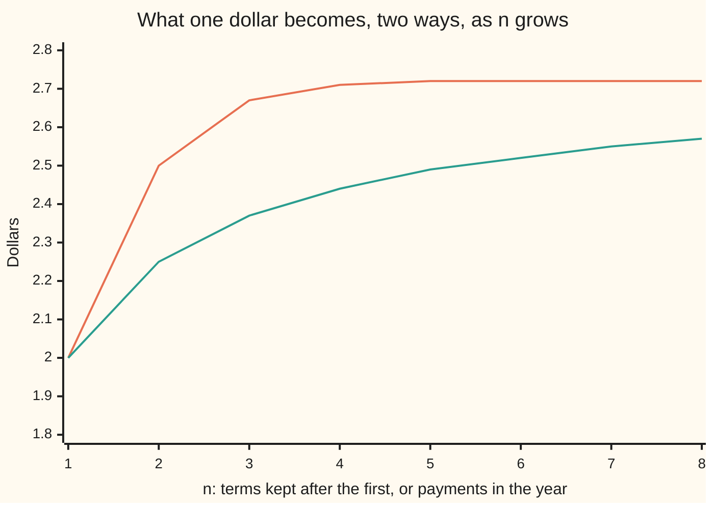

# The binomial series and the number e: Newton's expansion of (1 plus x) to any power, and the series for e

Calculus and analysis → Series → Powers without an end → The binomial series and the number e

---

## General Overview

The square root of 1.1 has no neat decimal. The binomial theorem expands (1 + 0.1) cubed into four pieces, but a square root is a power of one half, and the theorem stops at whole powers.

Isaac Newton pushed the rule past them. The pieces keep their shape but never run out: 1, then 0.05, then −0.00125, then 0.0000625. Four add to 1.0488125. The true root is 1.048808848170, so four pieces are right to five decimals.

The same pieces settle two older questions. The compounding ceiling e is exactly 1 + 1 + 1/2 + 1/6 + …, one over every factorial, added. And of the 720 ways six people can draw names, the 265 that leave nobody with their own are 720 divided by e, rounded.

**A power that is not whole still expands into choice-count pieces, endlessly; the sum is exact when the added bit lies between −1 and 1, and the same pieces, in the limit, build e and 1/e.**

**What kind of fact this is:** a theorem, proved on this card in Why it works; the extended choice count C(a, k) is a definition.

### The picture: two roads to e, one from each side of the proof



The upper line is the series 1 + 1 + 1/2! + … + 1/n!. The lower line is one dollar at 100% a year paid in n instalments, (1 + 1/n)^n. Step 5 shows why the lower never crosses the upper, and why both end at e.

---

## The formula

Reminder: a sigma sum running to infinity means the limit of its partial sums ([series-convergence](01-series-convergence.md)). One new shorthand, for any number $a$ and whole $k$ from 0 up:

$$C(a,k) = \frac{a(a-1)(a-2)\cdots(a-k+1)}{k!}, \qquad C(a,0) = 1.$$

That is $k$ factors counting down from $a$, divided by $k!$. For a whole $a$ it is "a choose k" ([binomial-theorem](../../04-Combinatorics%20and%20graphs/03-Binomial%20Coefficients%20and%20Identities/02-binomial-theorem.md)). For $a$ = 1/2 it gives 1, 0.5, −0.125, 0.0625.

$$(1+x)^a = \sum_{k=0}^{\infty} C(a,k)\,x^k \qquad \text{whenever } -1 < x < 1$$

**Read it aloud:** one plus x to the power a is the sum, over every k, of the extended choice count times x to the k.

Three consequences:

$$e = \lim_{n\to\infty}\Bigl(1+\frac1n\Bigr)^n = \sum_{k=0}^{\infty}\frac{1}{k!}, \qquad \frac1e = \sum_{k=0}^{\infty}\frac{(-1)^k}{k!}, \qquad \lim_{n\to\infty}\frac{D(n)}{n!} = \frac1e.$$

**Read it aloud:** compounding ever more often heads for the sum of one over every factorial; with alternating signs that sum is one over e; the clean share of a large draw heads there too.

| Symbol | Plain meaning | In our example | Push it up and the answer… |
| --- | --- | --- | --- |
| $a$ | the power, any number | 1/2, a square root | — |
| $x$ | the added bit beside the 1 | 0.1 | pieces shrink more slowly |
| $k$, $m$ | piece counters | 0, 1, 2, … | the piece shrinks |
| $C(a,k)$ | extended choice count | 1, 0.5, −0.125, 0.0625 | — |
| $n$, $n!$ | people or payments; all possible draws | 6 and 720 | the share settles on 1/e |
| $D(n)$ | draws with nobody on their own name | 265 | — |
| $e$ | the compounding ceiling | 2.718281828459, and 1/e = 0.367879441171 | — |
| $g$, $S$, $L_n$, $L$ | series totals: binomial, for e; the ladder at $n$, its limit | 1.048808848170; 2.718281828459; 2.57 at $n$ = 8 | — |

### When it holds

- **The added bit $x$ strictly between −1 and 1.** Drop it and the pieces grow: for the root of 4, $x$ = 3, the partial sums run −0.10, 155.68, 2966803.56.
- **Or a whole power $a$ of 0 or more.** Then the sum stops, any $x$ works, and this is the binomial theorem.
- **At $x$ = 1 or −1** the answer depends on $a$: an endpoint question ([power-series](04-power-series.md)).
- **The rounding rule for $D(n)$ from $n$ = 1 on.** At $n$ = 0 the empty draw is clean, but 0!/e rounds to 0.

---

## Why it works

### Step 0: a power as a function, expanded by its rates

Treat $(1+x)^a$ as a function of $x$ and take its Taylor series: the endless polynomial whose value and every rate match the function at $x$ = 0 ([taylor-series](05-taylor-series.md)). Then ask: does it add up, and to the power itself?

### Step 1: the coefficients are extended choice counts

Each derivative brings the current power down as a factor and lowers it by one: $a(1+x)^{a-1}$, then $a(a-1)(1+x)^{a-2}$, and the $k$-th is $a(a-1)\cdots(a-k+1)(1+x)^{a-k}$. At $x$ = 0 the bracket is 1. Dividing by $k!$, as Taylor's recipe does, gives exactly $C(a,k)$.

For a whole $a$ the countdown reaches $a - a$ = 0 and every later coefficient vanishes. For $a$ = 1/2 it runs 1/2, −1/2, −3/2, … and never hits zero.

### Step 2: the pieces shrink when the added bit is small

Going from piece $k$ to piece $k+1$ multiplies by $x$ and by $(a-k)/(k+1)$. As $k$ grows that fraction closes on −1, whatever $a$ is. So far out, each piece is about $x$ times the one before, give or take its sign.

The ratio test compares the series with a geometric one of that ratio ([comparison-ratio-and-root-tests](02-comparison-ratio-and-root-tests.md)): ratio 0.1 converges fast; ratio 3 is the root-of-4 failure.

### Step 3: the total is the power

Call the total $g(x)$. At $x$ = 0 it is 1. And $(1+x)$ times its rate equals $a$ times itself, exactly as for the power. Divide one by the other: the quotient's rate is zero everywhere, so it never leaves its starting value 1.

<details>
<summary>Detailed proof: the series equals the power for every x between −1 and 1</summary>

Inside $-1 < x < 1$ a power series may be differentiated piece by piece ([power-series](04-power-series.md)).

The coefficient of $x^k$ in $(1+x)\,g'(x)$ is $(k+1)\,C(a,k+1) + k\,C(a,k)$. Since $C(a,k+1) = C(a,k)\,(a-k)/(k+1)$, that is $(a-k)\,C(a,k) + k\,C(a,k) = a\,C(a,k)$, the coefficient of $x^k$ in $a\,g(x)$. So $(1+x)\,g'(x) = a\,g(x)$.

Let $h(x) = g(x)\,(1+x)^{-a}$. By the product rule, $h'(x) = (1+x)^{-a-1}\bigl[(1+x)\,g'(x) - a\,g(x)\bigr] = 0$. A function with zero derivative on an interval is constant (mean value theorem), so $h(x) = h(0) = 1$ and $g(x) = (1+x)^a$.

</details>

### Step 4: the error is smaller than the first piece left out

After the first, the pieces for the root of 1.1 alternate in sign and shrink, so stopping leaves an error smaller than the first piece dropped ([alternating-and-conditional-convergence](03-alternating-and-conditional-convergence.md)). Four pieces miss by 0.0000036518; the dropped piece is 0.0000039063 in size. To land within 0.00001 of the root, four pieces suffice.

### Step 5: the compounding ceiling is the series

Expand one dollar at 100% paid in $n$ instalments by the binomial theorem:

$$\Bigl(1+\frac1n\Bigr)^n = \sum_{k=0}^{n} C(n,k)\,\frac{1}{n^k} = \sum_{k=0}^{n}\frac{1}{k!}\Bigl(1-\frac1n\Bigr)\Bigl(1-\frac2n\Bigr)\cdots\Bigl(1-\frac{k-1}{n}\Bigr).$$

Every bracket is below 1, so each piece is at most $1/k!$: the lower line stays under the upper. As $n$ grows each bracket heads for 1. So the limit, the e of [compounding-frequency-and-e](../../01-Foundations/04-Compound%20Growth%20and%20Discounting/04-compounding-frequency-and-e.md), is the whole series: 2.718281828459.

<details>
<summary>Detailed proof: the limit of the ladder equals the sum</summary>

Write $L_n = (1+1/n)^n$ and $S$ for the series. The expansion gives $L_n \le S$. The ladder climbs with $n$, since each bracket grows and a new piece joins, so it has a limit $L \le S$.

Fix a cutoff $m$. For $n > m$, dropping the pieces past $m$ leaves $L_n$ at least the first $m+1$ pieces. As $n$ grows those finitely many brackets head for 1, so $L$ is at least $1/0! + \cdots + 1/m!$. That holds for every $m$, so $L \ge S$, and $L = S$.

</details>

### Step 6: the same sum with alternating signs is 1/e

Multiply the series for e by $1 - 1 + 1/2! - 1/3! + \cdots$ and group the products $1/k!$ times $(-1)^{m-k}/(m-k)!$ by $m$, the sum of their two positions:

$$\sum_{k=0}^{m}\frac{(-1)^{m-k}}{k!\,(m-k)!} = \frac{1}{m!}\sum_{k=0}^{m} C(m,k)\,(-1)^{m-k} = \frac{(1-1)^m}{m!},$$

by the binomial theorem. For $m \ge 1$ that is zero; $m$ = 0 gives 1. So the product is 1 and the alternating series is 1/e: 0.367879441171. The regrouping is safe because both series converge even with every sign made positive.

### Step 7: the derangement share settles on 1/e, fast

The sieve of [derangements](../../04-Combinatorics%20and%20graphs/04-Inclusion-Exclusion%20and%20Pigeonhole/02-derangements.md) gave the clean share $D(n)/n!$ as $1 - 1/1! + 1/2! - \cdots \pm 1/n!$: Step 6's series, stopped at $n$. By Step 4's rule it misses 1/e by less than $1/(n+1)!$. For six people: share 0.368056, gap +0.000176, bound 0.000198.

Times $n!$: $D(n)$ misses $n!/e$ by less than $1/(n+1)$, at most one half. A whole number that close to 264.873 must be 265: $D(n)$ is $n!/e$ rounded.

A second road to 1/e is the Taylor series of the function that is its own rate, read at $x$ = −1 ([taylor-series](05-taylor-series.md)).

---

## Worked numbers, by hand

The root of 1.1; each coefficient is the last times $(a-k)/(k+1)$.

| Step | Arithmetic | Value |
| --- | --- | --- |
| piece 0 | $C(a,0)$ = 1 | 1.0000000000 |
| piece 1 | 1 × (1/2) / 1 = 0.5, times 0.1 | 0.0500000000 |
| piece 2 | 0.5 × (−1/2) / 2 = −0.125, times 0.01 | −0.0012500000 |
| piece 3 | −0.125 × (−3/2) / 3 = 0.0625, times 0.001 | 0.0000625000 |
| four pieces | 1 + 0.05 − 0.00125 + 0.0000625 | **1.0488125000** |
| the root, by Heron's averaging | average y and 1.1/y, repeat | 1.048808848170 |
| error against the bound | 0.0000036518 against the dropped piece 0.0000039063 | inside |
| six-person draw | 720 × 0.367879441171 = 264.873 | **265** |

A 1-metre length scaled by the root of 1.1 is 1.0488 m from four pieces, good to a tenth of a millimetre.

### What breaks if you drop a piece

| Mistake | Comes out at | What went wrong |
| --- | --- | --- |
| Root of 4 at $x$ = 3 | −0.10, 155.68, 2966803.56 after 5, 10, 20 pieces | Each piece about 3 times the last |
| No $k!$ | 1.047875 for the root of 1.1 | The countdown is the rate, not the coefficient |
| Signs dropped in the share | 720 × 2.718056 = 1957 of 720 draws | That sum heads for e, not 1/e |

The code prints all three.

---

## Code, from first principles, and it actually runs

Nothing is imported. Each answer comes twice, the second road never touching the series: the root against Heron's averaging, e and 1/e against a dollar grown or shrunk by a millionth a million times, and derangements counted by trying every draw, each share held inside the Step 7 bound for n = 1 to 9.

### Python

```python
# The binomial series and e -- the check behind the card.  Nothing imported.
# Road one: a series, term by term.  Road two never touches it: Heron's root,
# a dollar compounded a million times, a direct count of clean draws.
N = 1000000

def binom_terms(a, x, count):            # C(a, k) x^k for k = 0 .. count - 1
    terms, c, p = [], 1.0, 1.0
    for k in range(count):
        terms.append(c * p)
        c, p = c * (a - k) / (k + 1), p * x   # next coefficient, next power
    return terms

def heron(s):                            # road two to a root: average y and s / y
    y = s
    for _ in range(60): y = (y + s / y) / 2
    return y

def exp_sum(x, count):                   # 1 + x + x^2/2! + ..., count terms
    total, term = 0.0, 1.0
    for k in range(count):
        total, term = total + term, term * x / (k + 1)
    return total

def ladder(step, times):                 # (1 + step) multiplied in, times times
    y = 1.0
    for _ in range(times):
        y = y * (1 + step)
    return y

def clean(n, pos=0, used=0):             # draws of n names, nobody on their own
    return 1 if pos == n else sum(clean(n, pos + 1, used | 1 << j) for j in range(n) if j != pos and not used >> j & 1)

t = binom_terms(0.5, 0.1, 6)
sums = [sum(t[:k + 1]) for k in range(6)]
root, root2 = sum(binom_terms(0.5, 0.1, 20)), heron(1.1)
print("C(1/2, k), k = 0..5:", " ".join(f"{v:.8f}" for v in binom_terms(0.5, 1, 6)))
print("terms, k = 0..5:", " ".join(f"{v:.10f}" for v in t))
print("partial sums:   ", " ".join(f"{v:.10f}" for v in sums))
print(f"root of 1.1: 20 terms {root:.12f}, Heron {root2:.12f}")
print(f"error after 4 terms {sums[3] - root2:.10f}, first term left out {-t[4]:.10f}")
print("root of 4, x = 3, by 5, 10, 20 terms:", " ".join(f"{sum(binom_terms(0.5, 3, m)):.2f}" for m in (5, 10, 20)))
print(f"no k! in the coefficients, 4 terms: {sum(v * f for v, f in zip(t, (1, 1, 2, 6))):.6f}")
e, e2, inv, inv2 = exp_sum(1, 20), ladder(1 / N, N), exp_sum(-1, 20), ladder(-1 / N, N)
print(f"e: series {e:.12f}, compounded {N} times {e2:.12f}")
print(f"1/e: series {inv:.12f}, (1 - 1/{N})^{N} {inv2:.12f}")
print(f"series at 1 times series at -1: {e * inv:.12f}")
print("chart, series to 1/n!, n = 1..8:", " ".join(f"{exp_sum(1, n + 1):.2f}" for n in range(1, 9)))
print("chart, (1 + 1/n)^n, n = 1..8:   ", " ".join(f"{ladder(1 / n, n):.2f}" for n in range(1, 9)))
print("n  counted       n!/e  share     gap to 1/e  bound 1/(n+1)!")
fact = 1
for n in range(1, 10):
    fact *= n
    d, share = clean(n), clean(n) / fact
    if 4 <= n <= 8:
        print(f"{n}  {d:7d}  {fact * inv:10.3f}  {share:.6f}  {share - inv:+.6f}   {1 / (fact * (n + 1)):.6f}")
    assert abs(share - inv) < 1 / (fact * (n + 1))  # counted share within the tail bound
print(f"signs dropped, six people: 720 x {exp_sum(1, 7):.6f} = {720 * exp_sum(1, 7):.0f}")
assert abs(root - root2) < 1e-14                  # binomial series against Heron
assert abs(e - e2) < 2e-6                         # series against compounding
assert abs(inv - inv2) < 1e-6                     # alternating series against discounting
```

**Ran 2026-09-27 on macOS, Python 3.14.6, standard library only. All checks passed. Output, pasted from the run:**

```
C(1/2, k), k = 0..5: 1.00000000 0.50000000 -0.12500000 0.06250000 -0.03906250 0.02734375
terms, k = 0..5: 1.0000000000 0.0500000000 -0.0012500000 0.0000625000 -0.0000039063 0.0000002734
partial sums:    1.0000000000 1.0500000000 1.0487500000 1.0488125000 1.0488085938 1.0488088672
root of 1.1: 20 terms 1.048808848170, Heron 1.048808848170
error after 4 terms 0.0000036518, first term left out 0.0000039063
root of 4, x = 3, by 5, 10, 20 terms: -0.10 155.68 2966803.56
no k! in the coefficients, 4 terms: 1.047875
e: series 2.718281828459, compounded 1000000 times 2.718280469096
1/e: series 0.367879441171, (1 - 1/1000000)^1000000 0.367879257221
series at 1 times series at -1: 1.000000000000
chart, series to 1/n!, n = 1..8: 2.00 2.50 2.67 2.71 2.72 2.72 2.72 2.72
chart, (1 + 1/n)^n, n = 1..8:    2.00 2.25 2.37 2.44 2.49 2.52 2.55 2.57
n  counted       n!/e  share     gap to 1/e  bound 1/(n+1)!
4        9       8.829  0.375000  +0.007121   0.008333
5       44      44.146  0.366667  -0.001213   0.001389
6      265     264.873  0.368056  +0.000176   0.000198
7     1854    1854.112  0.367857  -0.000022   0.000025
8    14833   14832.899  0.367882  +0.000003   0.000003
signs dropped, six people: 720 x 2.718056 = 1957
```

### Rust

```rust
// The binomial series and e -- the check behind the card.  No crates.
// Road one: a series, term by term.  Road two never touches it: Heron's root,
// a dollar compounded a million times, a direct count of clean draws.
const N: usize = 1000000;

fn binom_terms(a: f64, x: f64, count: usize) -> Vec<f64> {
    let (mut terms, mut c, mut p) = (Vec::new(), 1.0, 1.0); // C(a, k) x^k
    for k in 0..count {
        terms.push(c * p);
        c = c * (a - k as f64) / (k as f64 + 1.0); // next coefficient
        p = p * x; // next power
    }
    terms
}

fn heron(s: f64) -> f64 { // road two to a root: average y and s / y
    let mut y = s;
    for _ in 0..60 { y = (y + s / y) / 2.0; }
    y
}

fn exp_sum(x: f64, count: usize) -> f64 { // 1 + x + x^2/2! + ..., count terms
    let (mut total, mut term) = (0.0, 1.0);
    for k in 0..count { total += term; term = term * x / (k as f64 + 1.0); }
    total
}

fn ladder(step: f64, times: usize) -> f64 { // (1 + step) multiplied in
    let mut y = 1.0;
    for _ in 0..times { y = y * (1.0 + step); }
    y
}

fn clean(n: usize, pos: usize, used: u32) -> u64 { // nobody on their own name
    if pos == n { return 1; }
    (0..n).filter(|&j| j != pos && used >> j & 1 == 0).map(|j| clean(n, pos + 1, used | 1 << j)).sum()
}

fn join(v: &[f64], d: usize) -> String {
    v.iter().map(|x| format!("{:.*}", d, x)).collect::<Vec<_>>().join(" ")
}

fn main() {
    let t = binom_terms(0.5, 0.1, 6);
    let sums: Vec<f64> = (0..6).map(|k| t[..k + 1].iter().sum()).collect();
    let (root, root2) = (binom_terms(0.5, 0.1, 20).iter().sum::<f64>(), heron(1.1));
    println!("C(1/2, k), k = 0..5: {}", join(&binom_terms(0.5, 1.0, 6), 8));
    println!("terms, k = 0..5: {}", join(&t, 10));
    println!("partial sums:    {}", join(&sums, 10));
    println!("root of 1.1: 20 terms {:.12}, Heron {:.12}", root, root2);
    println!("error after 4 terms {:.10}, first term left out {:.10}", sums[3] - root2, -t[4]);
    let far: Vec<f64> = [5, 10, 20].iter().map(|&m| binom_terms(0.5, 3.0, m).iter().sum()).collect();
    println!("root of 4, x = 3, by 5, 10, 20 terms: {}", join(&far, 2));
    println!("no k! in the coefficients, 4 terms: {:.6}", t.iter().zip([1.0, 1.0, 2.0, 6.0]).map(|(v, f)| v * f).sum::<f64>());
    let (e, e2) = (exp_sum(1.0, 20), ladder(1.0 / N as f64, N));
    let (inv, inv2) = (exp_sum(-1.0, 20), ladder(-1.0 / N as f64, N));
    println!("e: series {:.12}, compounded {} times {:.12}", e, N, e2);
    println!("1/e: series {:.12}, (1 - 1/{})^{} {:.12}", inv, N, N, inv2);
    println!("series at 1 times series at -1: {:.12}", e * inv);
    let s1: Vec<f64> = (1..9).map(|n| exp_sum(1.0, n + 1)).collect();
    let s2: Vec<f64> = (1..9).map(|n| ladder(1.0 / n as f64, n)).collect();
    println!("chart, series to 1/n!, n = 1..8: {}", join(&s1, 2));
    println!("chart, (1 + 1/n)^n, n = 1..8:    {}", join(&s2, 2));
    println!("n  counted       n!/e  share     gap to 1/e  bound 1/(n+1)!");
    let mut fact = 1.0;
    for n in 1..10 {
        fact *= n as f64;
        let d = clean(n, 0, 0);
        let share = d as f64 / fact;
        let bound = 1.0 / (fact * (n as f64 + 1.0));
        if (4..=8).contains(&n) {
            println!("{}  {:7}  {:10.3}  {:.6}  {:+.6}   {:.6}", n, d, fact * inv, share, share - inv, bound);
        }
        assert!((share - inv).abs() < bound); // counted share within the tail bound
    }
    println!("signs dropped, six people: 720 x {:.6} = {:.0}", exp_sum(1.0, 7), 720.0 * exp_sum(1.0, 7));
    assert!((root - root2).abs() < 1e-14); // binomial series against Heron
    assert!((e - e2).abs() < 2e-6); // series against compounding
    assert!((inv - inv2).abs() < 1e-6); // alternating series against discounting
}
```

**Ran 2026-09-27 on macOS, rustc 1.98.1, no crates. All checks passed. Output, pasted from the run:**

```
C(1/2, k), k = 0..5: 1.00000000 0.50000000 -0.12500000 0.06250000 -0.03906250 0.02734375
terms, k = 0..5: 1.0000000000 0.0500000000 -0.0012500000 0.0000625000 -0.0000039063 0.0000002734
partial sums:    1.0000000000 1.0500000000 1.0487500000 1.0488125000 1.0488085938 1.0488088672
root of 1.1: 20 terms 1.048808848170, Heron 1.048808848170
error after 4 terms 0.0000036518, first term left out 0.0000039063
root of 4, x = 3, by 5, 10, 20 terms: -0.10 155.68 2966803.56
no k! in the coefficients, 4 terms: 1.047875
e: series 2.718281828459, compounded 1000000 times 2.718280469096
1/e: series 0.367879441171, (1 - 1/1000000)^1000000 0.367879257221
series at 1 times series at -1: 1.000000000000
chart, series to 1/n!, n = 1..8: 2.00 2.50 2.67 2.71 2.72 2.72 2.72 2.72
chart, (1 + 1/n)^n, n = 1..8:    2.00 2.25 2.37 2.44 2.49 2.52 2.55 2.57
n  counted       n!/e  share     gap to 1/e  bound 1/(n+1)!
4        9       8.829  0.375000  +0.007121   0.008333
5       44      44.146  0.366667  -0.001213   0.001389
6      265     264.873  0.368056  +0.000176   0.000198
7     1854    1854.112  0.367857  -0.000022   0.000025
8    14833   14832.899  0.367882  +0.000003   0.000003
signs dropped, six people: 720 x 2.718056 = 1957
```

The two outputs agree line for line.

> [!TIP]
> **Try changing**
> - **Push the added bit to 0.9.** Guess first: are twenty pieces enough? In the `root` line set `binom_terms(0.5, 0.9, 20)` and `heron(1.9)`: 1.378618 against 1.378405, and the Heron assert fails.
> - **Break the count.** Remove `j != pos` from `clean`. Guess first: which assert fails? Every draw counts, the share is 1, and the bound assert stops it at n = 1.
> - **Cut the e series short.** Change `exp_sum(1, 20)` to `exp_sum(1, 5)`. Guess first: above or below e? Below, at 2.71, and the compounding assert fails.

---

## The usual mistake

> [!warning]
> **Using the endless series for any x.** A whole power expands for every number; the endless series only for an added bit between −1 and 1. The root of 4 as (1 + 3) to the half gives 155.68 after ten pieces. Rewrite first so the added bit is small.
>
> - **Forgetting the $k!$:** 1.047875 instead of 1.0488125.
> - **Dropping the signs:** 1957 clean draws out of 720.
> - **Calling (1 + 1/n)^n e for a modest n.** Eight payments give 2.57; the series reaches 2.72 by its fifth piece.

---

## Where you meet it in real life

- **Quick estimates.** The first two pieces, 1 + a x: a 10% rise under a square root is about 5%.
- **Relativity.** The speed factor, one over the root of one minus a small ratio, is expanded this way.
- **Compounding.** Continuous compounding at 100% for a year is the series for e; every account paying in instalments sits on the lower line ([compounding-frequency-and-e](../../01-Foundations/04-Compound%20Growth%20and%20Discounting/04-compounding-frequency-and-e.md)).
- **Secret Santa and hat checks.** In a large group, about 36.8% of all possible draws leave nobody matched ([derangements](../../04-Combinatorics%20and%20graphs/04-Inclusion-Exclusion%20and%20Pigeonhole/02-derangements.md)).

> **Say it back**
> The Taylor coefficients of one plus x to any power are choice counts with any top number. For a whole power they stop; otherwise they add up to the power for x between −1 and 1. Expanding compound interest the same way shows e is the sum of one over every factorial. The alternating sum is 1/e, where the share of clean draws settles.

---

## What this builds on

- [taylor-series](05-taylor-series.md): rates at one point turned into coefficients.
- [derangements](../../04-Combinatorics%20and%20graphs/04-Inclusion-Exclusion%20and%20Pigeonhole/02-derangements.md): the sieve count sent here to 1/e.
- [binomial-theorem](../../04-Combinatorics%20and%20graphs/03-Binomial%20Coefficients%20and%20Identities/02-binomial-theorem.md): the whole-power expansion, and the tool in Steps 5 and 6.

## Where this goes next

- [uniform-convergence](07-uniform-convergence.md): when a whole curve of partial sums settles at once.
- [swapping-limits-with-integrals-and-derivatives](08-swapping-limits-with-integrals-and-derivatives.md): why Step 3 may differentiate piece by piece.
- [stirlings-approximation](09-stirlings-approximation.md): e inside the size of $n!$.

The derangement count is now $n!/e$ rounded, but $n!$ is still a product of $n$ numbers; how large it is without multiplying them out is what stirlings-approximation answers.

---

## Sources

Verified 2026-09-27: every link below resolves to the publisher's page.

- Strang, Gilbert, and Edwin Herman. *Calculus Volume 2*, OpenStax, section 6.3. [Publisher page](https://openstax.org/books/calculus-volume-2/pages/6-3-taylor-and-maclaurin-series). Taylor's theorem with remainder; the series for e to the x.
- Strang and Herman, *Calculus Volume 2*, section 6.4. [Publisher page](https://openstax.org/books/calculus-volume-2/pages/6-4-working-with-taylor-series). The binomial series and its interval.
- Graham, Ronald L., Donald E. Knuth, and Oren Patashnik. *Concrete Mathematics*, 2nd ed. Addison-Wesley, 1994. [Publisher page](https://www.informit.com/store/concrete-mathematics-a-foundation-for-computer-science-9780201558029). Chapter 5: binomial coefficients with any upper number; derangements as n!/e rounded.
