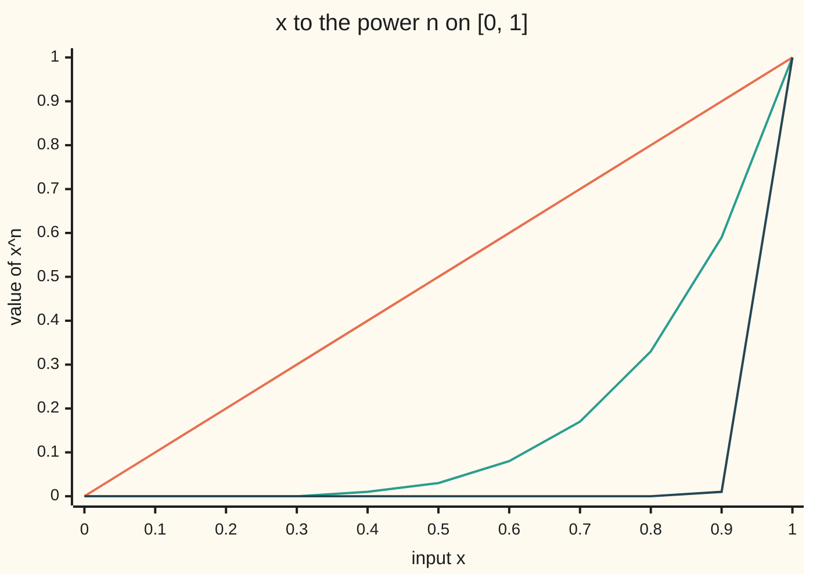

# Uniform convergence: one tolerance for every x, and why it keeps continuity

[Syllabus](../../../SYLLABUS.md) → [Calculus and analysis](../README.md) → [Series](../README.md#s06) → Uniform convergence

---

## General Overview

A sheet of tinted glass passes a fraction x of the light that hits it. Stack n sheets and x multiplied by itself n times gets through: x to the power n. At x = 0.5, 10 sheets pass 0.000977, under a thousandth. At 0.9 that takes 66 sheets; at 0.99, 688; at 0.999, 6,905. A clear sheet, x = 1, passes everything at every depth.

Every tinted stack goes dark eventually; the clear one never does. So the limit jumps: 0 below x = 1, and 1 at x = 1. Each stack's curve against x is unbroken; their limit is broken.

From here the glass is set aside. The objects are $f_n$, with $f_n(x) = x^n$ on the interval from 0 to 1, and n is the stage, the sequence's clock ([Sequences](../01-Limits%20and%20Continuity/03-sequences-and-limits.md)). Every input settles, so the sequence **converges pointwise**. But the stage needed depends on x and has no ceiling. **Uniform convergence** demands one stage that serves every x at once. With it, a limit of unbroken functions stays unbroken; the Weierstrass M-test earns it for a series.

**Pointwise convergence lets each input choose its own waiting time; uniform convergence fixes one waiting time for all inputs, and only the second guarantees that a limit of continuous functions is continuous.**

**What kind of fact this is:** two definitions (pointwise and uniform convergence) and two theorems on them (continuity survives a uniform limit; the M-test), both proved below.

### The picture: x to the n, sagging toward a jump



Orange: n = 1. Teal: n = 5. Dark blue: n = 50, flat until a cliff just before x = 1. The cliff moves right as n grows but never disappears. The chart illustrates; the argument below proves.

---

## The formula

Reminders: $\lim_{n\to\infty} a_n$ is the value a sequence heads for; sup, the supremum, is a set's least upper bound, reached or not.

**Pointwise convergence.** For each fixed input $x$:

$$\lim_{n\to\infty} f_n(x) = f(x)$$

**Read it aloud:** at each input on its own, the values head for the limit's value there.

**Uniform convergence.** The worst gap anywhere on the interval must shrink:

$$E_n = \sup_{0 \le x \le 1} \lvert f_n(x) - f(x)\rvert, \qquad \lim_{n\to\infty} E_n = 0$$

**Read it aloud:** the largest gap between stage n and the limit, over every input at once, heads for zero.

**Theorem 1.** If every $f_n$ is continuous and $E_n$ heads for 0, the limit $f$ is continuous.

**Theorem 2, the Weierstrass M-test.** If the terms $g_k(x)$ of a series obey $\lvert g_k(x)\rvert \le M_k$ for every $x$, with caps $M_k$ that are numbers with a finite sum, the partial sums $S_N(x) = g_1(x) + \cdots + g_N(x)$ converge uniformly to a sum $S(x)$, and

$$\sup_x \lvert S(x) - S_N(x)\rvert \le \sum_{k=N+1}^{\infty} M_k$$

**Read it aloud:** if number caps on the terms add up, the caps' leftover bounds the series' leftover at every x.

The card's series is $g_k(x) = (x/2)^k$ on the interval from −1 to 1, capped by $M_k = 1/2^k$: the shelf's house series 1/2 + 1/4 + 1/8 + ⋯, whose sum is 1 ([Infinite series](01-series-convergence.md)).

| Symbol | Plain meaning | In our example | Push it up and the answer… |
| --- | --- | --- | --- |
| $x$, $x_0$ | an input; one fixed input | x0 = 0.5 | nearer 1, slower decay |
| $n$, $N$ | the stage; a cutoff stage | n = 10, 66, 688 | later stages, smaller gaps |
| $f_n$, $f_j$ | the stage-n function; one chosen stage j | $x^n$ | — |
| $f$ | the limit function | 0 below 1, 1 at 1 | — |
| $E_n$, $E_j$ | worst gap over the interval, a sup | 1 on [0, 1] | weaker guarantee |
| $g_k$ | k-th term of a series | $(x/2)^k$ | — |
| $M_k$ | a number capping the k-th term at every x | $1/2^k$ | looser bound |
| $S_N$, $S_n$, $S_{12}$, $S$ | partial sums; the full sum | $S(x) = x/(2-x)$ | more terms, smaller gap |

### When it holds

- **A stated interval.** On [0, 1] the convergence of $x^n$ is not uniform; on [0, 0.9] it is.
- **Theorem 1 needs uniform, not pointwise.** Drop it and the continuous curves $x^n$ converge to a jump of 1.
- **M-test caps must be numbers.** Caps $x^k$ that depend on x prove nothing: at x = 0.999 their leftover after 10 terms is 989.05, and at x = 1 it is infinite.
- **The M-test is sufficient, not necessary.** Failing it proves nothing.

---

## Why it works

### Step 0: the order of two choices is the whole difference

In the tolerance game a challenger names a tolerance, here 0.001; the reply is a stage after which every gap is within it. Pointwise: an input is named first, then a stage for it. Uniform: the stage is named first and must survive every input. $E_n$ packs that second game into one number.

Uniform continuity ([Uniform continuity](../01-Limits%20and%20Continuity/08-uniform-continuity-and-lipschitz.md)) asks the same of one function's input distances; this card asks it of a sequence's stages.

### Step 1: find the pointwise limit of x to the n

For fixed x below 1, $x^n$ is a geometric sequence with ratio below 1, so it heads for 0; the cutoffs 10, 66, 688 and 6,905 are its first stages below 0.001. At x = 1 every power is 1.

### Step 2: on [0, 1] the convergence is not uniform

For any stage n, take $x = 2^{-1/n}$, the number whose n-th power is exactly 1/2. It is below 1, so the limit there is 0 and the gap is 1/2. At n = 10 it is 0.933033; at n = 100, 0.993092; at n = 1000, 0.999307. Every stage has such an input, so none wins at tolerance 0.001. In fact $E_n = 1$: inputs nearer 1 give gaps nearer 1, but the gap at x = 1 is 0, so the sup is never attained.

### Step 3: cut the interval and it becomes uniform

On [0, 0.9] every $x^n$ is at most $0.9^n$ and the limit is 0, so $E_n = 0.9^n$, attained at x = 0.9. At n = 65 that is 0.001061; at n = 66, 0.000955. One stage, 66, serves every input. The trouble lived next to x = 1.

### Step 4: a uniform limit of continuous functions is continuous

Fix $x_0$ and the tolerance 0.001. Split the gap from $f(x)$ to $f(x_0)$ into three pieces, each under a third:

1. $f(x)$ to $f_j(x)$: pick one stage j with $E_j$ under a third; it works whatever x is.
2. $f_j(x)$ to $f_j(x_0)$: one continuous function, so inputs close enough to $x_0$ keep it within a third.
3. $f_j(x_0)$ to $f(x_0)$: under a third, by the choice of j.

Three thirds make less than the whole. The stage j is chosen before x; under pointwise convergence it would depend on x.

<details>
<summary>Detailed proof</summary>

Let each $f_n$ be continuous on a set D and $E_n \to 0$. Fix $x_0$ in D and a tolerance ε > 0. Choose j with $E_j < ε/3$. Continuity of $f_j$ at $x_0$ gives an input distance δ > 0 with $\lvert f_j(x) - f_j(x_0)\rvert < ε/3$ whenever x is in D and $\lvert x - x_0\rvert < δ$. For such x,

$$\lvert f(x) - f(x_0)\rvert \le \lvert f(x) - f_j(x)\rvert + \lvert f_j(x) - f_j(x_0)\rvert + \lvert f_j(x_0) - f(x_0)\rvert < ε.$$

The first and third terms are each at most $E_j$.

</details>

### Step 5: the M-test turns a series of numbers into a uniform cap

At any input the leftover after N terms is $g_{N+1}(x) + g_{N+2}(x) + \cdots$. Each term is at most its cap in size, so the leftover is at most $M_{N+1} + M_{N+2} + \cdots$, a number with no x in it. That heads for 0, so one stage serves every input. The same comparison makes the series converge at each x ([Convergence tests](02-comparison-ratio-and-root-tests.md)).

For $(x/2)^k$ on [−1, 1] the caps leave $1/2^N$: 0.000977 at N = 10, under 0.001. With q = x/2 the geometric sum is exact: $S(x) = q/(1-q) = x/(2-x)$. The true gap after 10 terms is 0.000977 at x = 1, meeting the cap exactly, and 0.000326 at x = −1.

### Step 6: the three thirds, with numbers

Take the series at $x_0 = 0.5$, each third 0.000333.

- Piece 1: the first stage whose caps' leftover is under a third is 12, leftover 0.000244.
- Piece 2: $a^k - b^k$ is $(a - b)$ times k products, each at most $(1/2)^{k-1}$ when a and b are at most 1/2 in size. So moving x by 0.0001 moves $(x/2)^k$ by at most $k/2^k$ times 0.0001, and $S_{12}$ by at most 0.000200.
- Piece 3: 0.000244 again.

The budget is 0.000688, under 0.001. The true move of S, from $x/(2-x)$ directly, is 0.000089.

A second road, the uniform Cauchy criterion, compares stages with each other and needs no limit in hand (Lebl, §6.1).

---

## Worked numbers, by hand

| Step | Arithmetic | Value |
| --- | --- | --- |
| worst gap on [0, 1] | sup of $x^n$ below x = 1 | **1**, never attained |
| worst gap on [0, 0.9], n = 66 | $0.9^{66}$ | **0.000955** |
| M-test, N = 10 | cap leftover $1/2^{10}$ | **0.000977** |
| three thirds at 0.5 | 0.000244 + 0.000200 + 0.000244 | **0.000688** |

### What breaks if you drop a piece

| Mistake | Comes out at | What went wrong |
| --- | --- | --- |
| Pointwise only | limit of continuous $x^n$ jumps by 1 at x = 1 | no single stage serves inputs near 1 |
| Checking on a grid at n = 1024 | grid max 0.000034; witness gap 0.500000 | the worst inputs sit between grid points |
| Borrowing the cutoff 688 from x = 0.99 | 0.502407 at x = 0.999 | a pointwise cutoff is private to its input |
| Caps $x^k$ that depend on x | caps' leftover 989.05 at x = 0.999 after 10 terms | the M-test needs caps that are plain numbers |

The code prints all four.

---

## Code, from first principles, and it actually runs

The code prints every number on the card by two roads: cutoffs by counting and by logarithms, the M-test gap by adding terms against the closed form, the three-thirds budget against the true move of S.

### Python

```python
# Uniform convergence -- the check behind the card.  The example: x^n on
# [0, 1].  math's log, exp and ceil are primitives; every power, sum and
# cutoff below is built here, and each answer is reached two ways.
from math import log, exp, ceil
TOL = 0.001

def power(x, n):                          # x multiplied in n times
    out = 1.0
    for _ in range(n):
        out *= x
    return out

def cutoff(x):                            # road one: count until x^n < TOL
    n, v = 1, x
    while v >= TOL:
        n, v = n + 1, v * x
    return n

def partial(x, N):                        # S_N(x) = (x/2) + ... + (x/2)^N
    return sum(power(x / 2, k) for k in range(1, N + 1))

def tail(N):                              # M_(N+1) + M_(N+2) + ..., M_k = 1/2^k
    return sum(power(0.5, k) for k in range(N + 1, N + 80))

for n in (1, 5, 50):
    print(f"chart n={n}:", " ".join(f"{power(i / 10, n):.2f}" for i in range(11)))
xs = (0.5, 0.9, 0.99, 0.999)
count = [cutoff(x) for x in xs]
logs = [ceil(log(TOL) / log(x)) for x in xs]            # road two
assert count == logs
print("cutoff for 0.001 at x = 0.5, 0.9, 0.99, 0.999, by counting:", count)
print("the same cutoffs, by logarithms:", logs)
for n in (10, 100, 1000):
    w = exp(-log(2) / n)                  # the input whose n-th power is 1/2
    assert abs(power(w, n) - 0.5) < 1e-9
    print(f"witness n={n}: x = {w:.6f}, x^n = {power(w, n):.6f}, limit there 0")
s65, s66 = (max(power(i / 1000, n) for i in range(901)) for n in (65, 66))
print(f"sup on [0, 0.9]: n=65 {s65:.6f}, n=66 {s66:.6f}; first below 0.001: n={cutoff(0.9)}")
g = max(power(i / 100, 1024) for i in range(100))
print(f"n=1024: grid 0, 0.01, ..., 0.99 max error {g:.6f}; witness error {power(exp(-log(2) / 1024), 1024):.6f}")
print(f"cutoff 688 from x=0.99, used at x=0.999: error {power(0.999, 688):.6f}")
N, pts = 10, [i / 100 - 1 for i in range(201)]
errs = [abs(x / (2 - x) - partial(x, N)) for x in pts]
assert abs(max(errs) - tail(N)) < 1e-12                 # grid max against the M tail
print(f"M-test N=10: tail bound {tail(N):.6f}; grid max error {max(errs):.6f}; at x=1 {errs[-1]:.6f}, at x=-1 {errs[0]:.6f}")
j = next(k for k in range(1, 60) if tail(k) < TOL / 3)
d, x0 = 0.0001, 0.5
move_j = sum(k * power(0.5, k) for k in range(1, j + 1)) * d
budget = 2 * tail(j) + move_j
actual = max(abs(x / (2 - x) - x0 / (2 - x0)) for x in (x0 - d, x0 + d))
assert actual < budget
print(f"three thirds at x0=0.5, delta 0.0001: stage {j}, gap {tail(j):.6f}, move of S_{j} within {move_j:.6f}")
print(f"  error budget {budget:.6f} against tolerance 0.001; actual move of S {actual:.6f}")
bad, t = 0.0, power(0.999, 10)
for _ in range(20000):
    t *= 0.999
    bad += t
print(f"x-dependent bound x^k at x=0.999: tail after 10 terms {bad:.2f}")
print("ALL CHECKS PASS")
```

**Ran 2026-09-27 on macOS, Python 3.14.6, standard library only. All checks passed. Output, pasted from the run:**

```
chart n=1: 0.00 0.10 0.20 0.30 0.40 0.50 0.60 0.70 0.80 0.90 1.00
chart n=5: 0.00 0.00 0.00 0.00 0.01 0.03 0.08 0.17 0.33 0.59 1.00
chart n=50: 0.00 0.00 0.00 0.00 0.00 0.00 0.00 0.00 0.00 0.01 1.00
cutoff for 0.001 at x = 0.5, 0.9, 0.99, 0.999, by counting: [10, 66, 688, 6905]
the same cutoffs, by logarithms: [10, 66, 688, 6905]
witness n=10: x = 0.933033, x^n = 0.500000, limit there 0
witness n=100: x = 0.993092, x^n = 0.500000, limit there 0
witness n=1000: x = 0.999307, x^n = 0.500000, limit there 0
sup on [0, 0.9]: n=65 0.001061, n=66 0.000955; first below 0.001: n=66
n=1024: grid 0, 0.01, ..., 0.99 max error 0.000034; witness error 0.500000
cutoff 688 from x=0.99, used at x=0.999: error 0.502407
M-test N=10: tail bound 0.000977; grid max error 0.000977; at x=1 0.000977, at x=-1 0.000326
three thirds at x0=0.5, delta 0.0001: stage 12, gap 0.000244, move of S_12 within 0.000200
  error budget 0.000688 against tolerance 0.001; actual move of S 0.000089
x-dependent bound x^k at x=0.999: tail after 10 terms 989.05
ALL CHECKS PASS
```

### Rust

Same numbers, same labels, built with `rustc --edition 2021 -O`.

```rust
// Uniform convergence -- the same check as the Python, in Rust.  No crates.
// The example: x^n on [0, 1].  ln, exp and ceil are primitives; every power,
// sum and cutoff below is built here, and each answer is reached two ways.
const TOL: f64 = 0.001;

fn power(x: f64, n: usize) -> f64 { // x multiplied in n times
    let mut out = 1.0;
    for _ in 0..n { out *= x; }
    out
}

fn cutoff(x: f64) -> usize { // road one: count until x^n < TOL
    let (mut n, mut v) = (1, x);
    while v >= TOL { n += 1; v *= x; }
    n
}

fn partial(x: f64, n: usize) -> f64 { // S_N(x) = (x/2) + ... + (x/2)^N
    (1..=n).map(|k| power(x / 2.0, k)).sum()
}

fn tail(n: usize) -> f64 { // M_(N+1) + M_(N+2) + ..., M_k = 1/2^k
    (n + 1..n + 80).map(|k| power(0.5, k)).sum()
}

fn grid_max(pts: impl Iterator<Item = f64>, n: usize) -> f64 {
    pts.map(|x| power(x, n)).fold(0.0, f64::max)
}

fn main() {
    for n in [1, 5, 50] {
        let r: Vec<String> = (0..11).map(|i| format!("{:.2}", power(i as f64 / 10.0, n))).collect();
        println!("chart n={}: {}", n, r.join(" "));
    }
    let xs = [0.5, 0.9, 0.99, 0.999];
    let count: Vec<usize> = xs.iter().map(|&x| cutoff(x)).collect();
    let logs: Vec<usize> = xs.iter().map(|&x| (TOL.ln() / f64::ln(x)).ceil() as usize).collect(); // road two
    assert_eq!(count, logs);
    println!("cutoff for 0.001 at x = 0.5, 0.9, 0.99, 0.999, by counting: {:?}", count);
    println!("the same cutoffs, by logarithms: {:?}", logs);
    for n in [10usize, 100, 1000] {
        let w = (-(2f64.ln()) / n as f64).exp(); // the input whose n-th power is 1/2
        assert!((power(w, n) - 0.5).abs() < 1e-9);
        println!("witness n={}: x = {:.6}, x^n = {:.6}, limit there 0", n, w, power(w, n));
    }
    let s65 = grid_max((0..901).map(|i| i as f64 / 1000.0), 65);
    let s66 = grid_max((0..901).map(|i| i as f64 / 1000.0), 66);
    println!("sup on [0, 0.9]: n=65 {:.6}, n=66 {:.6}; first below 0.001: n={}", s65, s66, cutoff(0.9));
    let g = grid_max((0..100).map(|i| i as f64 / 100.0), 1024);
    let wit = power((-(2f64.ln()) / 1024.0).exp(), 1024);
    println!("n=1024: grid 0, 0.01, ..., 0.99 max error {:.6}; witness error {:.6}", g, wit);
    println!("cutoff 688 from x=0.99, used at x=0.999: error {:.6}", power(0.999, 688));
    let n = 10;
    let errs: Vec<f64> = (0..201).map(|i| i as f64 / 100.0 - 1.0)
        .map(|x| (x / (2.0 - x) - partial(x, n)).abs()).collect();
    let emax = errs.iter().cloned().fold(0.0, f64::max);
    assert!((emax - tail(n)).abs() < 1e-12); // grid max against the M tail
    println!("M-test N=10: tail bound {:.6}; grid max error {:.6}; at x=1 {:.6}, at x=-1 {:.6}",
        tail(n), emax, errs[200], errs[0]);
    let j = (1..60).find(|&k| tail(k) < TOL / 3.0).unwrap();
    let (d, x0) = (0.0001, 0.5);
    let move_j: f64 = (1..=j).map(|k| k as f64 * power(0.5, k)).sum::<f64>() * d;
    let budget = 2.0 * tail(j) + move_j;
    let actual = [x0 - d, x0 + d].iter().map(|&x| (x / (2.0 - x) - x0 / (2.0 - x0)).abs()).fold(0.0, f64::max);
    assert!(actual < budget);
    println!("three thirds at x0=0.5, delta 0.0001: stage {}, gap {:.6}, move of S_{} within {:.6}", j, tail(j), j, move_j);
    println!("  error budget {:.6} against tolerance 0.001; actual move of S {:.6}", budget, actual);
    let (mut bad, mut t) = (0.0, power(0.999, 10));
    for _ in 0..20000 { t *= 0.999; bad += t; }
    println!("x-dependent bound x^k at x=0.999: tail after 10 terms {:.2}", bad);
    println!("ALL CHECKS PASS");
}
```

**Ran 2026-09-27 on macOS, rustc 1.98.1, no crates. All checks passed. Output, pasted from the run:**

```
chart n=1: 0.00 0.10 0.20 0.30 0.40 0.50 0.60 0.70 0.80 0.90 1.00
chart n=5: 0.00 0.00 0.00 0.00 0.01 0.03 0.08 0.17 0.33 0.59 1.00
chart n=50: 0.00 0.00 0.00 0.00 0.00 0.00 0.00 0.00 0.00 0.01 1.00
cutoff for 0.001 at x = 0.5, 0.9, 0.99, 0.999, by counting: [10, 66, 688, 6905]
the same cutoffs, by logarithms: [10, 66, 688, 6905]
witness n=10: x = 0.933033, x^n = 0.500000, limit there 0
witness n=100: x = 0.993092, x^n = 0.500000, limit there 0
witness n=1000: x = 0.999307, x^n = 0.500000, limit there 0
sup on [0, 0.9]: n=65 0.001061, n=66 0.000955; first below 0.001: n=66
n=1024: grid 0, 0.01, ..., 0.99 max error 0.000034; witness error 0.500000
cutoff 688 from x=0.99, used at x=0.999: error 0.502407
M-test N=10: tail bound 0.000977; grid max error 0.000977; at x=1 0.000977, at x=-1 0.000326
three thirds at x0=0.5, delta 0.0001: stage 12, gap 0.000244, move of S_12 within 0.000200
  error budget 0.000688 against tolerance 0.001; actual move of S 0.000089
x-dependent bound x^k at x=0.999: tail after 10 terms 989.05
ALL CHECKS PASS
```

The two outputs are identical.

> [!TIP]
> **Try changing**
> Guess first, then run it.
> - **Tighten the tolerance.** Set `TOL` to `0.0001`. The cutoffs grow to 14, 88, 917 and 9,206.
> - **Drop a term.** Change `range(1, N + 1)` in `partial` to `range(1, N)`. The gap at x = 1 now exceeds the cap leftover, and the M-test assert stops the program.

---

## The usual mistake

> [!warning]
> **Believing that convergence at every input means convergence everywhere at once.** Each input of $x^n$ settles, yet the worst gap on [0, 1] stays 1 forever.
>
> - **Trusting a grid.** At n = 1024 the grid 0, 0.01, …, 0.99 shows a worst gap of 0.000034; an input between grid points has gap 0.500000.
> - **Reading it as a licence to differentiate.** sin(nx)/n converges uniformly to 0, yet the slopes cos(nx) do not settle; see [Swapping limits](08-swapping-limits-with-integrals-and-derivatives.md).

---

## Where you meet it in real life

- **Maths libraries.** A polynomial routine for sin or exp states one maximum error over its whole input range.
- **Bond pricing across rates.** A perpetual bond's price is a geometric series in the discount factor. Above a floor rate that factor has one cap, so one truncation length serves every rate.
- **Fourier series.** Smooth waves cannot converge uniformly to a square wave, since Theorem 1 forbids the jump: Dirichlet's theorem.

> **Say it back**
> Pointwise convergence lets each input choose its own stage; uniform convergence demands one stage for all. For $x^n$ the worst gap stays 1 on [0, 1] and shrinks like $0.9^n$ on [0, 0.9]. A uniform limit of continuous functions is continuous, by three thirds with the stage chosen first. If number caps on a series' terms add up, the series converges uniformly.

---

## What this builds on

- [Sequences](../01-Limits%20and%20Continuity/03-sequences-and-limits.md): the tolerance game for a sequence, and geometric decay to 0.
- [Uniform continuity](../01-Limits%20and%20Continuity/08-uniform-continuity-and-lipschitz.md): one choice serving every input, for a single function.

## Where this goes next

- [Swapping limits](08-swapping-limits-with-integrals-and-derivatives.md): limits through integrals and derivatives.
- [Limits of holomorphic functions](../../07-Complex%20analysis/04-Taylor%20Series%2C%20Zeros%20and%20Rigidity/02-uniform-limits-of-holomorphic-functions.md): uniform limits keeping far more than continuity.
- [Modes of convergence](../../10-Measure%20and%20integration/05-Swapping%20Limits%20and%20Integrals/04-modes-of-convergence.md): uniform beside other kinds of convergence.
- Weierstrass and the minimax fit: polynomials approximating uniformly.
- Arzela-Ascoli: when uniformly convergent subsequences must exist.
- Function spaces C and Lp: the worst gap as a distance between functions.
- Weak convergence: a far looser convergence.
- Convolution and mollifiers: smoothing that converges uniformly.
- Dirichlet's theorem: both modes for Fourier series.
- Equidistribution: step functions approximated by smooth ones.
- Partition of unity: uniform approximation on curved spaces.

---

## Sources

Verified 2026-09-27: every link below resolves to the publisher's page.

- Lebl, Jiří. *Basic Analysis I & II*, §6.1 "Pointwise and uniform convergence". [Online text](https://www.jirka.org/ra/html/sec_puconv.html). Both definitions and the uniform Cauchy criterion.
- Lebl, Jiří. *Basic Analysis I & II*, §6.2 "Interchange of limits". [Online text](https://www.jirka.org/ra/html/sec_liminter.html). The continuity theorem.
- Lebl, Jiří. *Basic Analysis I & II*, §11.2 "Swapping limits". [Online text](https://www.jirka.org/ra/html/sec_swaplim.html). The M-test.
- Abbott, Stephen. *Understanding Analysis*, 2nd ed. Springer, 2015. [Publisher page](https://link.springer.com/book/10.1007/978-1-4939-2712-8). Chapter 6: both modes of convergence, continuity of the limit, the M-test.
